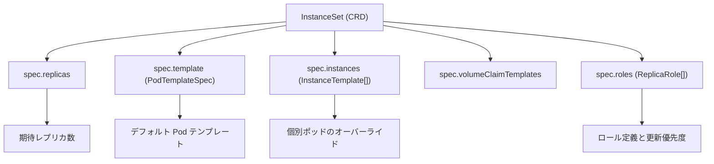
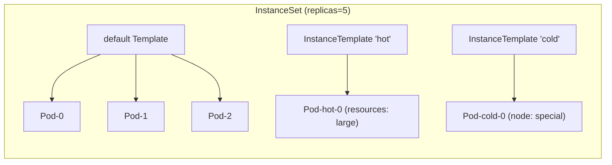
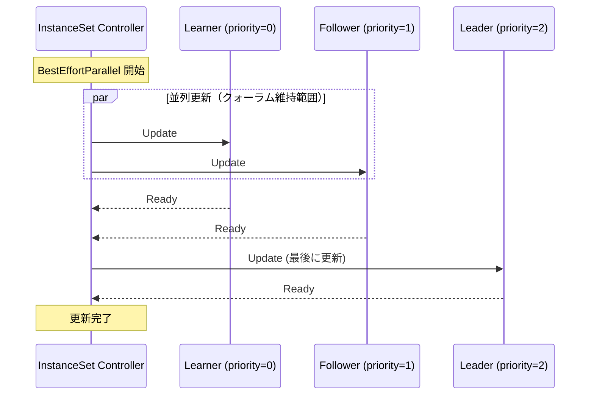

# 第4章 InstanceSet: ポッド集合のワークロード抽象

> 本章で読むソース:
>
> - [apis/workloads/v1/instanceset_types.go L48-L62](https://github.com/apecloud/kubeblocks/blob/v1.0.2/apis/workloads/v1/instanceset_types.go#L48-L62)
> - [apis/workloads/v1/instanceset_types.go L78-L240](https://github.com/apecloud/kubeblocks/blob/v1.0.2/apis/workloads/v1/instanceset_types.go#L78-L240)
> - [apis/workloads/v1/instanceset_types.go L344-L417](https://github.com/apecloud/kubeblocks/blob/v1.0.2/apis/workloads/v1/instanceset_types.go#L344-L417)
> - [apis/workloads/v1/instanceset_types.go L440-L459](https://github.com/apecloud/kubeblocks/blob/v1.0.2/apis/workloads/v1/instanceset_types.go#L440-L459)
> - [apis/workloads/v1/instanceset_types.go L243-L326](https://github.com/apecloud/kubeblocks/blob/v1.0.2/apis/workloads/v1/instanceset_types.go#L243-L326)
> - [apis/workloads/v1/instanceset_types.go L551-L637](https://github.com/apecloud/kubeblocks/blob/v1.0.2/apis/workloads/v1/instanceset_types.go#L551-L637)
> - [apis/workloads/v1/instanceset_webhook.go L29-L33](https://github.com/apecloud/kubeblocks/blob/v1.0.2/apis/workloads/v1/instanceset_webhook.go#L29-L33)

## この章の狙い

`InstanceSet` は KubeBlocks が Kubernetes 標準の `StatefulSet` を置き換えるために定義したワークロード CRD である。
データベースクラスタに特有の「ロール付きレプリカ」「インスタンスごとの差分設定」「安全なオフライン移行」を実現するデータモデルを、本章では読み解く。
コントローラの実装は第10章で扱い、本章は CRD の型定義が持つ設計意図に焦点を当てる。

## 前提

- 第3章 [Cluster と Component の仕様](03-cluster-and-component.md) で、`Component` が `InstanceSet` を生成することを前提とする。
- Kubernetes の `StatefulSet` が持つ `PodManagementPolicy`、`VolumeClaimTemplates`、`updateStrategy` の基本概念は既知とする。

## 4.1 StatefulSet との差異

Kubernetes の `StatefulSet` は全ポッドを同一テンプレートから生成する。
すべてのレプリカが等しいリソース、等しい設定で動作する前提の設計である。
データベースクラスタでは Leader と Follower でリソース要件が異なり、特定ポッドだけ異なるノードに配置したい場合がある。
`InstanceSet` は `StatefulSet` の基本構造（順序付きポッド名、PVC テンプレート、安定したネットワーク ID）を維持しつつ、次の機能を追加する。

- インスタンスごとのテンプレートオーバーライド（`InstanceTemplate`）
- インスタンスの安全なオフライン化（`OfflineInstances`）
- ロールベースの更新順序制御（`Roles` と `MemberUpdateStrategy`）
- インプレース更新ポリシー（`PodUpdatePolicy`）
- 分散システム向けのメンバ状態追跡（`MembersStatus`）



## 4.2 InstanceSet の基本構造

`InstanceSet` のトップレベル構造は、他の Kubernetes リソースと同じく `TypeMeta`、`ObjectMeta`、`Spec`、`Status` の4フィールドで構成される。

[apis/workloads/v1/instanceset_types.go L48-L62](https://github.com/apecloud/kubeblocks/blob/v1.0.2/apis/workloads/v1/instanceset_types.go#L48-L62)

```go
type InstanceSet struct {
	// The metadata for the type, like API version and kind.
	metav1.TypeMeta `json:",inline"`

	// Contains the metadata for the particular object, such as name, namespace, labels, and annotations.
	metav1.ObjectMeta `json:"metadata,omitempty"`

	// Defines the desired state of the state machine. It includes the configuration details for the state machine.
	//
	Spec InstanceSetSpec `json:"spec,omitempty"`

	// Represents the current information about the state machine. This data may be out of date.
	//
	Status InstanceSetStatus `json:"status,omitempty"`
}
```

`+kubebuilder:resource:categories={kubeblocks},shortName=its`（同 L40）により、`kubectl get its` で一覧できる。
`+kubebuilder:subresource:scale`（同 L38）により `kubectl scale` が利用可能で、`HorizontalPodAutoscaler` との統合も想定されている。

## 4.3 InstanceSetSpec の全体像

`InstanceSetSpec` は20以上のフィールドを持つ。
大きく分けて「レプリカ数とポッド生成」「テンプレートとオーバーライド」「更新戦略」「ロールとメンバーシップ」の4群に分類できる。

[apis/workloads/v1/instanceset_types.go L78-L240](https://github.com/apecloud/kubeblocks/blob/v1.0.2/apis/workloads/v1/instanceset_types.go#L78-L240)

レプリカ数とポッド生成に関するフィールド:

| フィールド | 型 | 概要 |
|---|---|---|
| `Replicas` | `*int32` | 期待レプリカ数。デフォルト1 |
| `MinReadySeconds` | `int32` | 利用可能とみなすまでの最低待機秒数 |
| `Selector` | `*metav1.LabelSelector` | 管理対象ポッドを選択するラベル |
| `Template` | `corev1.PodTemplateSpec` | デフォルトのポッドテンプレート |
| `VolumeClaimTemplates` | `[]corev1.PersistentVolumeClaim` | PVC テンプレート |
| `DefaultTemplateOrdinals` | `kbappsv1.Ordinals` | デフォルトテンプレートのポッド名に使う順序数 |

テンプレートとオーバーライドに関するフィールド:

| フィールド | 型 | 概要 |
|---|---|---|
| `Instances` | `[]InstanceTemplate` | インスタンスごとの差分定義 |
| `OfflineInstances` | `[]string` | オフライン化するポッド名のリスト |
| `PersistentVolumeClaimRetentionPolicy` | `*PersistentVolumeClaimRetentionPolicy` | PVC のライフサイクルポリシー |

更新戦略に関するフィールド:

| フィールド | 型 | 概要 |
|---|---|---|
| `PodManagementPolicy` | `appsv1.PodManagementPolicyType` | ポッドの作成順序（`OrderedReady` or `Parallel`） |
| `ParallelPodManagementConcurrency` | `*intstr.IntOrString` | 並列作成の上限 |
| `PodUpdatePolicy` | `PodUpdatePolicyType` | ポッド更新の方針 |
| `InstanceUpdateStrategy` | `*InstanceUpdateStrategy` | `RollingUpdate` か `OnDelete` か |
| `MemberUpdateStrategy` | `*MemberUpdateStrategy` | メンバー更新の並列性 |

ロールとメンバーシップに関するフィールド:

| フィールド | 型 | 概要 |
|---|---|---|
| `Roles` | `[]ReplicaRole` | ロール定義（Leader、Follower 等） |
| `MembershipReconfiguration` | `*MembershipReconfiguration` | メンバーシップ変更時のアクション |
| `TemplateVars` | `map[string]string` | アクション呼び出しに使う変数 |
| `Configs` | `[]ConfigTemplate` | 再設定対象の設定テンプレート |
| `Paused` | `bool` | リコンシリエーションの一時停止 |

## 4.4 InstanceTemplate による個別オーバーライド

`InstanceTemplate` はデフォルトテンプレートの値をインスタンス単位で上書きする仕組みである。

[apis/workloads/v1/instanceset_types.go L344-L406](https://github.com/apecloud/kubeblocks/blob/v1.0.2/apis/workloads/v1/instanceset_types.go#L344-L406)

```go
type InstanceTemplate struct {
	// Name specifies the unique name of the instance Pod created using this InstanceTemplate.
	// This name is constructed by concatenating the Component's name, the template's name, and the instance's ordinal
	// using the pattern: $(cluster.name)-$(component.name)-$(template.name)-$(ordinal). Ordinals start from 0.
	// The specified name overrides any default naming conventions or patterns.
	//
	// +kubebuilder:validation:MaxLength=54
	// +kubebuilder:validation:Pattern:=`^[a-z0-9]([a-z0-9\.\-]*[a-z0-9])?$`
	// +kubebuilder:validation:Required
	Name string `json:"name"`

	// Specifies the number of instances (Pods) to create from this InstanceTemplate.
	// ... (中略) ...
	// +kubebuilder:default=1
	// +kubebuilder:validation:Minimum=0
	// +optional
	Replicas *int32 `json:"replicas,omitempty"`

	// Specifies the desired Ordinals of this InstanceTemplate.
	// ... (中略) ...
	Ordinals Ordinals `json:"ordinals,omitempty"`

	// Specifies a map of key-value pairs to be merged into the Pod's existing annotations.
	// ... (中略) ...
	// +optional
	Annotations map[string]string `json:"annotations,omitempty"`

	// Specifies a map of key-value pairs that will be merged into the Pod's existing labels.
	// ... (中略) ...
	// +optional
	Labels map[string]string `json:"labels,omitempty"`

	// Specifies the scheduling policy for the Component.
	//
	// +optional
	SchedulingPolicy *SchedulingPolicy `json:"schedulingPolicy,omitempty"`

	// Specifies an override for the resource requirements of the first container in the Pod.
	// ... (中略) ...
	// +optional
	Resources *corev1.ResourceRequirements `json:"resources,omitempty"`

	// Defines Env to override.
	// Add new or override existing envs.
	// +optional
	Env []corev1.EnvVar `json:"env,omitempty"`

	// Specifies an override for the storage requirements of the instances.
	//
	// +optional
	VolumeClaimTemplates []corev1.PersistentVolumeClaim `json:"volumeClaimTemplates,omitempty"`
}
```

`InstanceSet` は `Replicas` で指定した総数のインスタンスを管理する。
デフォルトでは全インスタンスが `Template` から生成される。
`Instances` フィールドに `InstanceTemplate` を配置すると、そのテンプレート固有の値がデフォルトをオーバーライドする。
各 `InstanceTemplate` は `Name` で一意に識別され、生成されるポッド名は `$(instance_set.name)-$(template.name)-$(ordinal)` の規則に従う。
`Instances` の各エントリの `Replicas` 合計は `Spec.Replicas` を超えてはならず、残りはデフォルトテンプレートから生成される。

オーバーライド可能な項目はラベル、アノテーション、スケジューリングポリシー、リソース要求、環境変数、`VolumeClaimTemplates` である。
これにより、同一コンポーネント内で「1台だけメモリを倍にしたポッド」「特定のノードに配置するポッド」を実現できる。



## 4.5 OfflineInstances による安全なスケールイン

`OfflineInstances` はポッドを停止しつつ PVC を保持する仕組みである。

[apis/workloads/v1/instanceset_types.go L134-L149](https://github.com/apecloud/kubeblocks/blob/v1.0.2/apis/workloads/v1/instanceset_types.go#L134-L149)

オフライン化されたインスタンスは次の状態になる。

1. ポッドは停止し、PVC は保持される。
2. 割り当てられていた順序数は予約され、新規インスタンスとの衝突を避ける。

この機構はデータベースのスケールインでデータを失いたくない場合に有用である。
`StatefulSet` はスケールイン時に末尾のポッドと PVC を削除する。
`InstanceSet` は任意のポッドをオフライン対象に指定でき、管理者が明示的に削除するまでリソースを保持する。

## 4.6 ロールとメンバー状態の管理

`InstanceSet` は各ポッドにロールを割り当て、レプリカの役割を識別できる。
この点は `StatefulSet` にはない機能で、データベースの Leader/Follower 構成に直接対応する。

`Roles` フィールドは `ReplicaRole` の配列である（[apis/apps/v1/componentdefinition_types.go L1383-L1413](https://github.com/apecloud/kubeblocks/blob/v1.0.2/apis/apps/v1/componentdefinition_types.go#L1383-L1413)）。

```go
type ReplicaRole struct {
	// Name defines the role's unique identifier. This value is used to set the "apps.kubeblocks.io/role" label
	// on the corresponding object to identify its role.
	// ... (中略) ...
	// +kubebuilder:validation:Required
	// +kubebuilder:validation:MaxLength=32
	// +kubebuilder:validation:Pattern=`^.*[^\s]+.*$`
	Name string `json:"name"`

	// UpdatePriority determines the order in which pods with different roles are updated.
	// ... (中略) ...
	// +kubebuilder:default=0
	// +optional
	UpdatePriority int `json:"updatePriority"`
}
```

`Name` は `kubeblocks.io/role` ラベルの値としてポッドに付与される。
`UpdatePriority` は更新時の順序を制御する。数値が大きいロールほど最後に更新される。
たとえば Leader を `UpdatePriority=2`、Follower を `1`、Learner を `0` に設定すると、Learner から順に更新され Leader が最後になる。
`ParticipatesInQuorum` はクォーラム計算に含めるかどうかを示す。

コントローラはポッドの `kubeblocks.io/role` ラベルからロールを取得し、`Status.MembersStatus` に記録する。

[apis/workloads/v1/instanceset_types.go L486-L497](https://github.com/apecloud/kubeblocks/blob/v1.0.2/apis/workloads/v1/instanceset_types.go#L486-L497)

```go
type MemberStatus struct {
    PodName     string      `json:"podName"`
    ReplicaRole *ReplicaRole `json:"role,omitempty"`
}
```

`MembershipReconfiguration` はメンバーシップ動的再設定のアクションを定義する（同 L452-L459）。

```go
type MembershipReconfiguration struct {
    Switchover *kbappsv1.Action `json:"switchover,omitempty"`
}
```

`Switchover` はロールの新規レプリカへの制御された移行手順を定義する。

## 4.7 更新戦略の階層

`InstanceSet` は更新戦略を3つの階層で制御する。

### 4.7.1 MemberUpdateStrategy

メンバー全体の更新並列性を指定する。

[apis/workloads/v1/instanceset_types.go L440-L446](https://github.com/apecloud/kubeblocks/blob/v1.0.2/apis/workloads/v1/instanceset_types.go#L440-L446)

```go
const (
    SerialUpdateStrategy             MemberUpdateStrategy = "Serial"
    ParallelUpdateStrategy           MemberUpdateStrategy = "Parallel"
    BestEffortParallelUpdateStrategy MemberUpdateStrategy = "BestEffortParallel"
)
```

`Serial` は1つずつ更新し、最小限のダウンタイムを保証する。
`Parallel` は全ポッドを同時に更新する。
`BestEffortParallel` はクォーラムを維持できる範囲で並列更新し、書き込み停止時間を最小化する。

### 4.7.2 PodUpdatePolicy

ポッドの更新手法を指定する。
型定義は `apis/apps/v1/types.go` にある（[L561-L574](https://github.com/apecloud/kubeblocks/blob/v1.0.2/apis/apps/v1/types.go#L561-L574)）。

```go
const (
    StrictInPlacePodUpdatePolicyType PodUpdatePolicyType = "StrictInPlace"
    PreferInPlacePodUpdatePolicyType PodUpdatePolicyType = "PreferInPlace"
    ReCreatePodUpdatePolicyType      PodUpdatePolicyType = "ReCreate"
)
```

`StrictInPlace` はインプレース更新のみを許可する。インプレースで更新できないフィールドの変更は拒否される。
`PreferInPlace` はインプレース更新を優先し、失敗すれば `ReCreate` にフォールバックする。
`ReCreate` は常にポッドを再作成する。

### 4.7.3 InstanceUpdateStrategy

ローリングアップデートのきめ細かい制御を行う。
型定義は `apis/apps/v1/types.go` にある（[L577-L627](https://github.com/apecloud/kubeblocks/blob/v1.0.2/apis/apps/v1/types.go#L577-L627)）。

```go
type InstanceUpdateStrategy struct {
	// Indicates the type of the update strategy.
	// Default is RollingUpdate.
	//
	// +optional
	Type InstanceUpdateStrategyType `json:"type,omitempty"`

	// Specifies how the rolling update should be applied.
	//
	// +optional
	RollingUpdate *RollingUpdate `json:"rollingUpdate,omitempty"`
}
```

`Type` は `RollingUpdate` か `OnDelete` を指定する。
`RollingUpdate` は `Replicas`（更新対象数）と `MaxUnavailable`（更新中に利用不可となる上限数）で制御する。



この図は `BestEffortParallel` 戦略で `UpdatePriority` に基づき Learner、Follower を並列更新した後に Leader を更新する流れを示す。
クォーラムに参加しない Learner と Follower 2台の並列更新は可用性を維持したまま進められる。

### 4.7.4 最適化: インプレース更新によるポッド再作成の回避

`PodUpdatePolicy` に `PreferInPlace` を設定すると、リソース要求の変更や環境変数の変更をポッドの再作成なしに適用できる。
Kubernetes の InPlace Pod Update 機能を利用し、コンテナイメージのホットアップデートやリソース仕様のインプレース変更を行う。
ポッドを再作成すると一時的に利用不可となり、PVC の再アタッチやスケジューリングのやり直しが発生する。
インプレース更新はこれらを回避して更新時間を短縮し、サービスの可用性を維持する。

## 4.8 ステータスモデルと Ready 判定

`InstanceSetStatus` は `InstanceSet` の実行時状態を追跡する。

[apis/workloads/v1/instanceset_types.go L243-L326](https://github.com/apecloud/kubeblocks/blob/v1.0.2/apis/workloads/v1/instanceset_types.go#L243-L326)

| フィールド | 概要 |
|---|---|
| `ObservedGeneration` | 最後に観測した世代 |
| `Replicas` | 作成済レプリカ数 |
| `ReadyReplicas` | Ready 条件を満たすレプリカ数 |
| `CurrentReplicas` | 現リビジョンのレプリカ数 |
| `UpdatedReplicas` | 新リビジョンのレプリカ数 |
| `CurrentRevision` / `UpdateRevision` | リビジョン文字列 |
| `AvailableReplicas` | `MinReadySeconds` を満たす利用可能レプリカ数 |
| `InitReplicas` / `ReadyInitReplicas` | クラスタ初期化時のレプリカ追跡 |
| `MembersStatus` | 各メンバーのロール状態 |
| `InstanceStatus` | 各インスタンスの設定状態 |
| `CurrentRevisions` / `UpdateRevisions` | ポッドごとのリビジョンマップ |
| `TemplatesStatus` | `InstanceTemplate` ごとの集計状態 |

`ConditionType` は4種類定義される（[L551-L569](https://github.com/apecloud/kubeblocks/blob/v1.0.2/apis/workloads/v1/instanceset_types.go#L551-L569)）。

- `InstanceReady`: 全インスタンスが Ready。
- `InstanceAvailable`: 全インスタンスが `MinReadySeconds` 以上 Ready。
- `InstanceFailure`: いずれかのインスタンスが Failed。
- `InstanceUpdateRestricted`: `StrictInPlace` で更新できないフィールドの変更がある。

### 4.8.1 Ready 判定の階層

`IsInstancesReady()` はインスタンス集合全体の Ready を判定する。

[apis/workloads/v1/instanceset_types.go L592-L620](https://github.com/apecloud/kubeblocks/blob/v1.0.2/apis/workloads/v1/instanceset_types.go#L592-L620)

```go
func (r *InstanceSet) IsInstancesReady() bool {
    if r == nil {
        return false
    }
    if r.Status.ReadyInitReplicas != r.Status.InitReplicas {
        return false
    }
    if r.Status.ObservedGeneration != r.Generation {
        return false
    }
    if r.Spec.Replicas == nil {
        return false
    }
    replicas := *r.Spec.Replicas
    if r.Status.Replicas != replicas ||
        r.Status.ReadyReplicas != replicas ||
        r.Status.UpdatedReplicas != replicas {
        return false
    }
    if r.Spec.MinReadySeconds > 0 && r.Status.AvailableReplicas != replicas {
        return false
    }
    return true
}
```

判定は次の順序で行われる。

1. クラスタの初期化完了（`ReadyInitReplicas == InitReplicas`）。
2. 最新世代の反映（`ObservedGeneration == Generation`）。
3. 全レプリカの作成と Ready（`Replicas`、`ReadyReplicas`、`UpdatedReplicas` がすべて `spec.Replicas` に等しい）。
4. `MinReadySeconds` が設定されていれば `AvailableReplicas` も確認。

`IsInstanceSetReady()` はこれに加えてロールの追跡を確認する。

[apis/workloads/v1/instanceset_types.go L625-L637](https://github.com/apecloud/kubeblocks/blob/v1.0.2/apis/workloads/v1/instanceset_types.go#L625-L637)

```go
func (r *InstanceSet) IsInstanceSetReady() bool {
    instancesReady := r.IsInstancesReady()
    if !instancesReady {
        return false
    }
    if len(r.Spec.Roles) == 0 {
        return true
    }
    membersStatus := r.Status.MembersStatus
    return len(membersStatus) == int(*r.Spec.Replicas)
}
```

ロールが定義されていなければ `IsInstancesReady()` と同等である。
ロールが定義されていれば、全レプリカの `MembersStatus` が揃った時点で Ready と判断する。
この2段構えの判定により、「全ポッドが Ready かつロールプローブが完了」という厳密な条件でクラスタの可用性を評価できる。

## 4.9 Webhook の登録

`InstanceSet` の Webhook は `SetupWebhookWithManager` でマネージャーに登録される。

[apis/workloads/v1/instanceset_webhook.go L29-L33](https://github.com/apecloud/kubeblocks/blob/v1.0.2/apis/workloads/v1/instanceset_webhook.go#L29-L33)

```go
func (r *InstanceSet) SetupWebhookWithManager(mgr ctrl.Manager) error {
    return ctrl.NewWebhookManagedBy(mgr).
        For(r).
        Complete()
}
```

v1.0.2 ではバリデーションやミュート処理の本体は実装されていない。
Webhook の骨格のみが配置され、 Admission Webhook による入力検証の拡張余地が確保されている。

## まとめ

`InstanceSet` は `StatefulSet` の基本構造を維持しつつ、データベースオーケストレーションに不可欠な拡張を加えたワークロード CRD である。
`InstanceTemplate` のオーバーライド機構により、同一テンプレートを基本としつつインスタンス固有の設定を適用できる。
`OfflineInstances` はデータと順序番号を保持したまま安全にスケールインする。
`Roles` と `MemberUpdateStrategy` はロールに応じた更新順序を制御し、`PodUpdatePolicy` はインプレース更新によりポッド再作成を回避する。
`MembersStatus` は分散システムのメンバー状態を追跡し、2段構えの Ready 判定がクラスタの可用性を厳密に評価する。

## 関連する章

- 第1章 [KubeBlocks の全体像と CRD 設計思想](01-overview.md)
- 第3章 [Cluster と Component の仕様](03-cluster-and-component.md)
- 第10章 [InstanceSet コントローラ: ポッドライフサイクル管理](../part02-main-controllers/10-instanceset-controller.md)
