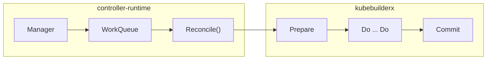
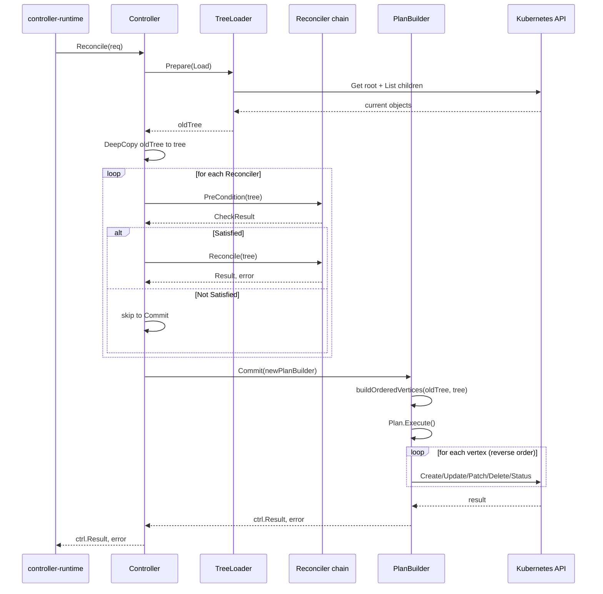

# 第5章 kubebuilderx: 拡張 Reconciler フレームワーク

> 本章で読むソース
>
> - [pkg/controller/kubebuilderx/doc.go L20-L34](https://github.com/apecloud/kubeblocks/blob/v1.0.2/pkg/controller/kubebuilderx/doc.go#L20-L34)
> - [pkg/controller/kubebuilderx/controller.go L40-L44](https://github.com/apecloud/kubeblocks/blob/v1.0.2/pkg/controller/kubebuilderx/controller.go#L40-L44)
> - [pkg/controller/kubebuilderx/controller.go L46-L58](https://github.com/apecloud/kubeblocks/blob/v1.0.2/pkg/controller/kubebuilderx/controller.go#L46-L58)
> - [pkg/controller/kubebuilderx/controller.go L60-L75](https://github.com/apecloud/kubeblocks/blob/v1.0.2/pkg/controller/kubebuilderx/controller.go#L60-L75)
> - [pkg/controller/kubebuilderx/controller.go L77-L103](https://github.com/apecloud/kubeblocks/blob/v1.0.2/pkg/controller/kubebuilderx/controller.go#L77-L103)
> - [pkg/controller/kubebuilderx/controller.go L105-L133](https://github.com/apecloud/kubeblocks/blob/v1.0.2/pkg/controller/kubebuilderx/controller.go#L105-L133)
> - [pkg/controller/kubebuilderx/reconciler.go L51-L67](https://github.com/apecloud/kubeblocks/blob/v1.0.2/pkg/controller/kubebuilderx/reconciler.go#L51-L67)
> - [pkg/controller/kubebuilderx/reconciler.go L69-L104](https://github.com/apecloud/kubeblocks/blob/v1.0.2/pkg/controller/kubebuilderx/reconciler.go#L69-L104)
> - [pkg/controller/kubebuilderx/reconciler.go L114-L142](https://github.com/apecloud/kubeblocks/blob/v1.0.2/pkg/controller/kubebuilderx/reconciler.go#L114-L142)
> - [pkg/controller/kubebuilderx/reconciler.go L194-L247](https://github.com/apecloud/kubeblocks/blob/v1.0.2/pkg/controller/kubebuilderx/reconciler.go#L194-L247)
> - [pkg/controller/kubebuilderx/plan_builder.go L50-L68](https://github.com/apecloud/kubeblocks/blob/v1.0.2/pkg/controller/kubebuilderx/plan_builder.go#L50-L68)
> - [pkg/controller/kubebuilderx/plan_builder.go L96-L103](https://github.com/apecloud/kubeblocks/blob/v1.0.2/pkg/controller/kubebuilderx/plan_builder.go#L96-L103)
> - [pkg/controller/kubebuilderx/plan_builder.go L105-L215](https://github.com/apecloud/kubeblocks/blob/v1.0.2/pkg/controller/kubebuilderx/plan_builder.go#L105-L215)
> - [pkg/controller/kubebuilderx/plan_builder.go L219-L254](https://github.com/apecloud/kubeblocks/blob/v1.0.2/pkg/controller/kubebuilderx/plan_builder.go#L219-L254)
> - [pkg/controller/kubebuilderx/utils.go L40-L84](https://github.com/apecloud/kubeblocks/blob/v1.0.2/pkg/controller/kubebuilderx/utils.go#L40-L84)

## この章の狙い

KubeBlocks のコントローラは controller-runtime の `Reconciler` インタフェースを直接実装するのではなく、`kubebuilderx` パッケージが提供する拡張フレームワーク üzerinden構築される。
本章では `pkg/controller/kubebuilderx/` のソースコードを読み、このフレームワークが提供する3つの抽象化、すなわち `Controller` の fluent API、`ObjectTree` によるスナップショット管理、`PlanBuilder` による差分実行計画の生成を把握する。
これらは後続の章で読む各コントローラ（`InstanceSet`、`Component`、`Cluster`）が共通して利用する基盤であり、仕組みを理解しておくことで個別コントローラの本文を読みやすくする。

## 前提

Kubernetes のコントローラパターン、Informer、WorkQueue の基礎を前提とする。
詳細は [第9章 kube-controller-manager のアーキテクチャ](../../kubernetes/kubernetes/part03-controller-manager/09-controller-manager-architecture.md) および [第19章 client-go と Informer](../../kubernetes/kubernetes/part07-extension/19-client-go-and-informer.md) を参照されたい。
また、旧世代の DAG フレームワーク（`pkg/controller/graph/`）の存在も前提知識とする。
本章末尾で新旧の対比を行う。

## controller-runtime との関係

controller-runtime は Kubernetes コントローラを構築するための標準的な Go フレームワークである。
コントローラは `Reconciler` インタフェースの `Reconcile` メソッドを実装し、オブジェクトの現在状態と期望状態の差分を調整する。
`kubebuilderx` はこの `Reconcile` メソッドの**内側**を構造化するレイヤーとして機能する。



`Reconcile` メソッドの中で `kubebuilderx.NewController(...)` を呼び、`Prepare`、`Do`、`Commit` の3段階を fluent API で繋げる。
この構造により、各コントローラの `Reconcile` メソッドは「どの TreeLoader を使い、どの Reconciler をどの順で実行するか」を宣言的に記述するだけでよくなる。

## Controller インタフェースと fluent API

`Controller` インタフェースは3つのメソッドを持つ。

[pkg/controller/kubebuilderx/controller.go L40-L44](https://github.com/apecloud/kubeblocks/blob/v1.0.2/pkg/controller/kubebuilderx/controller.go#L40-L44)

```go
type Controller interface {
    Prepare(TreeLoader) Controller
    Do(...Reconciler) Controller
    Commit() (ctrl.Result, error)
}
```

`Prepare` は `TreeLoader` を受け取り、Kubernetes API サーバからオブジェクトツリーを読み込む。
`Do` は任意個の `Reconciler` を受け取り、順に実行する。
`Commit` は最終的に差分を計算し、API サーバへ適用する。
戻り値はすべて `Controller` 自身であり、メソッドチェーンで繋げられる。

### controller 構造体

[pkg/controller/kubebuilderx/controller.go L46-L58](https://github.com/apecloud/kubeblocks/blob/v1.0.2/pkg/controller/kubebuilderx/controller.go#L46-L58)

```go
type controller struct {
    ctx      context.Context
    cli      client.Client
    req      ctrl.Request
    recorder record.EventRecorder
    logger   logr.Logger

    res Result
    err error

    oldTree *ObjectTree
    tree    *ObjectTree
}
```

`oldTree` は API サーバから読み込んだ現在状態のスナップショットである。
`tree` は `oldTree` を DeepCopy した作業用コピーであり、各 `Reconciler` はこの `tree` を変更していく。
`res` と `err` はチェーンの途中でエラーや制御フローの変更が発生した際に伝播される状態である。

## Prepare: オブジェクトツリーの読み込み

`Prepare` メソッドは `TreeLoader` インタフェースを通じてオブジェクトツリーをロードする。

[pkg/controller/kubebuilderx/controller.go L60-L75](https://github.com/apecloud/kubeblocks/blob/v1.0.2/pkg/controller/kubebuilderx/controller.go#L60-L75)

```go
func (c *controller) Prepare(reader TreeLoader) Controller {
    c.oldTree, c.err = reader.Load(c.ctx, c.cli, c.req, c.recorder, c.logger)
    if c.err != nil {
        return c
    }
    if c.oldTree == nil {
        c.err = fmt.Errorf("nil tree loaded")
        return c
    }
    c.tree, c.err = c.oldTree.DeepCopy()

    // init placement
    c.ctx = intoContext(c.ctx, placement(c.oldTree.GetRoot()))

    return c
}
```

処理の流れは以下の通りである。

1. `TreeLoader.Load` で API サーバからオブジェクトを読み込み `oldTree` を構築する。
2. `oldTree` の DeepCopy を取り、作業用の `tree` を作成する。
3. ルートオブジェクトの placement アノテーションを context に設定する。

DeepCopy を行う理由は、各 `Reconciler` が `tree` を破壊的に変更しても `oldTree`（現在状態）が保持されるため、`Commit` 段階で差分を正確に計算できるからである。

### TreeLoader と ReadObjectTree

`TreeLoader` は `Load` メソッドを持つインタフェースである。

[pkg/controller/kubebuilderx/reconciler.go L65-L67](https://github.com/apecloud/kubeblocks/blob/v1.0.2/pkg/controller/kubebuilderx/reconciler.go#L65-L67)

```go
type TreeLoader interface {
    Load(context.Context, client.Reader, ctrl.Request, record.EventRecorder, logr.Logger) (*ObjectTree, error)
}
```

実際の `TreeLoader` 実装では、汎用関数 `ReadObjectTree` を利用してツリーを構築する。

[pkg/controller/kubebuilderx/utils.go L40-L84](https://github.com/apecloud/kubeblocks/blob/v1.0.2/pkg/controller/kubebuilderx/utils.go#L40-L84)

```go
func ReadObjectTree[T client.Object](ctx context.Context, reader client.Reader, req ctrl.Request,
    ml client.MatchingLabels, kinds ...client.ObjectList) (*ObjectTree, error) {
    tree := NewObjectTree()

    // read root object
    var obj T
    t := reflect.TypeOf(obj)
    if t.Kind() == reflect.Ptr {
        t = t.Elem()
    }
    rootObj := reflect.New(t).Interface()
    root, _ := rootObj.(T)
    if err := reader.Get(ctx, req.NamespacedName, root); err != nil {
        if apierrors.IsNotFound(err) {
            return tree, nil
        }
        return nil, err
    }
    tree.SetRoot(root)

    // ... (中略) ...

    // read child objects
    inNS := client.InNamespace(req.Namespace)
    for _, list := range kinds {
        if err := reader.List(ctx, list, inNS, ml, inDataContext4C()); err != nil {
            return nil, err
        }
        items := reflect.ValueOf(list).Elem().FieldByName("Items")
        l := items.Len()
        for i := 0; i < l; i++ {
            object := items.Index(i).Addr().Interface().(client.Object)
            if len(object.GetOwnerReferences()) > 0 && !model.IsOwnerOf(root, object) {
                continue
            }
            if err := tree.Add(object); err != nil {
                return nil, err
            }
        }
    }

    return tree, nil
}
```

`ReadObjectTree` は Go のジェネリクスを用いてルートオブジェクトの型を指定を受け取る。
まず `reader.Get` でルートオブジェクトを取得し、次に `reader.List` で指定された種類のサブオブジェクトを列挙する。
OwnerReference を確認し、ルートオブジェクトを所有者とするサブオブジェクトのみをツリーに追加する。
このフィルタリングにより、関係のないオブジェクトがツリーに混入するのを防いでいる。

## ObjectTree: オブジェクト集合のスナップショット

`ObjectTree` はルートオブジェクトとサブオブジェクト群を保持するデータ構造である。

[pkg/controller/kubebuilderx/reconciler.go L51-L63](https://github.com/apecloud/kubeblocks/blob/v1.0.2/pkg/controller/kubebuilderx/reconciler.go#L51-L63)

```go
type ObjectTree struct {
    context.Context
    record.EventRecorder
    logr.Logger

    root            client.Object
    children        model.ObjectSnapshot
    childrenOptions map[model.GVKNObjKey]ObjectOptions

    finalizer string
}
```

`root` はツリーのルートとなる Kubernetes オブジェクトである。
`children` は `model.ObjectSnapshot` 型、すなわち `map[GVKNObjKey]client.Object` であり、サブオブジェクトを GVK（Group/Version/Kind）と名前をキーとして保持する。
`childrenOptions` は各サブオブジェクトに付随するオプション（サブオペレーション対象かどうか等）を格納する。

### ObjectTree の操作メソッド

`ObjectTree` はサブオブジェクトの操作に以下のメソッドを提供する。

[pkg/controller/kubebuilderx/reconciler.go L194-L228](https://github.com/apecloud/kubeblocks/blob/v1.0.2/pkg/controller/kubebuilderx/reconciler.go#L194-L228)

```go
func (t *ObjectTree) Add(objects ...client.Object) error {
    return t.replace(objects)
}

func (t *ObjectTree) Update(object client.Object, options ...ObjectOption) error {
    return t.replace([]client.Object{object}, options...)
}

func (t *ObjectTree) Delete(objects ...client.Object) error {
    for _, object := range objects {
        name, err := model.GetGVKName(object)
        if err != nil {
            return err
        }
        delete(t.children, *name)
    }
    return nil
}
```

`Add` と `Update` は内部で `replace` を呼び、`children` マップにオブジェクトを追加または上書きする。
`Delete` はマップからエントリを削除する。
これらの操作は `Reconciler` 内で使用され、期望状態の `tree` を構築していく。

### DeepCopy による状態隔離

`Prepare` で作成された DeepCopy は、`ObjectTree` の全オブジェクトを個別にコピーする。

[pkg/controller/kubebuilderx/reconciler.go L114-L142](https://github.com/apecloud/kubeblocks/blob/v1.0.2/pkg/controller/kubebuilderx/reconciler.go#L114-L142)

```go
func (t *ObjectTree) DeepCopy() (*ObjectTree, error) {
    out := new(ObjectTree)
    if t.root != nil {
        root, ok := t.root.DeepCopyObject().(client.Object)
        if !ok {
            return nil, ErrDeepCopyFailed
        }
        out.root = root
    }
    children := make(model.ObjectSnapshot, len(t.children))
    for key, child := range t.children {
        childCopied, ok := child.DeepCopyObject().(client.Object)
        if !ok {
            return nil, ErrDeepCopyFailed
        }
        children[key] = childCopied
    }
    // ... (中略) ...
    out.children = children
    out.childrenOptions = childrenOptions
    out.finalizer = t.finalizer
    out.Context = t.Context
    out.EventRecorder = t.EventRecorder
    out.Logger = t.Logger
    return out, nil
}
```

ルートオブジェクトと各サブオブジェクトは `DeepCopyObject()` で個別に複製される。
これにより `tree` への変更が `oldTree` に影響せず、`Commit` 段階で正確な差分計算が可能になる。

## Do: Reconciler チェーンの実行

`Do` メソッドは可変長引数で受け取った `Reconciler` を順に実行する。

[pkg/controller/kubebuilderx/controller.go L77-L103](https://github.com/apecloud/kubeblocks/blob/v1.0.2/pkg/controller/kubebuilderx/controller.go#L77-L103)

```go
func (c *controller) Do(reconcilers ...Reconciler) Controller {
    if c.err != nil {
        return c
    }
    if c.res.Next != cntn && c.res.Next != cmmt && c.res.Next != rtry {
        c.err = fmt.Errorf("unexpected next action: %s. should be one of Continue, Commit or Retry", c.res.Next)
        return c
    }
    if c.res.Next != cntn {
        return c
    }
    if len(reconcilers) == 0 {
        return c
    }

    reconciler := reconcilers[0]
    switch result := reconciler.PreCondition(c.tree); {
    case result.Err != nil:
        c.err = result.Err
        return c
    case !result.Satisfied:
        return c
    }
    c.res, c.err = reconciler.Reconcile(c.tree)

    return c.Do(reconcilers[1:]...)
}
```

各 `Reconciler` の実行前に `PreCondition` で事前条件をチェックする。
条件が満たされない場合、チェーンを中断して `Commit` へ進む。
これにより、前の Reconciler が特定の状態で後続をスキップするといった制御が可能になる。

### Reconciler インタフェース

[pkg/controller/kubebuilderx/reconciler.go L101-L104](https://github.com/apecloud/kubeblocks/blob/v1.0.2/pkg/controller/kubebuilderx/reconciler.go#L101-L104)

```go
type Reconciler interface {
    PreCondition(*ObjectTree) *CheckResult
    Reconcile(tree *ObjectTree) (Result, error)
}
```

`PreCondition` は `CheckResult` を返す。
`Satisfied` が `false` の場合は `Reconcile` は呼ばれず、チェーンが中断される。
`Reconcile` は `Result` を返し、`Next` フィールドの値によって制御フローが変化する。

### 制御フローの3つのモード

[pkg/controller/kubebuilderx/reconciler.go L79-L97](https://github.com/apecloud/kubeblocks/blob/v1.0.2/pkg/controller/kubebuilderx/reconciler.go#L79-L97)

```go
const (
    cntn controlMethod = "Continue"
    cmmt controlMethod = "Commit"
    rtry controlMethod = "Retry"
)

type Result struct {
    Next       controlMethod
    RetryAfter time.Duration
}

var Continue = Result{Next: cntn}
var Commit = Result{Next: cmmt}
```

- `Continue`: 次の `Reconciler` へ進む。デフォルトの動作。
- `Commit`: チェーンを中断し、即座に `Commit` へ進む。
- `Retry`: チェーンを中断し、`Commit` 実行後に再キューを要求する。

`RetryAfter` に `time.Duration` を指定することで、再キューの遅延時間を制御できる。

## Commit: 差分の計算と実行

`Commit` は `oldTree`（現在状態）と `tree`（期望状態）の差分を計算し、API サーバへ適用する。

[pkg/controller/kubebuilderx/controller.go L105-L133](https://github.com/apecloud/kubeblocks/blob/v1.0.2/pkg/controller/kubebuilderx/controller.go#L105-L133)

```go
func (c *controller) Commit() (ctrl.Result, error) {
    defer c.emitFailureEvent()

    if c.err != nil {
        return ctrl.Result{}, c.err
    }
    if c.oldTree.GetRoot() == nil {
        return ctrl.Result{}, nil
    }
    builder := NewPlanBuilder(c.ctx, c.cli, c.oldTree, c.tree, c.recorder, c.logger)
    if c.err = builder.Init(); c.err != nil {
        return ctrl.Result{}, c.err
    }
    var plan graph.Plan
    plan, c.err = builder.Build()
    if c.err != nil {
        return ctrl.Result{}, c.err
    }
    if c.err = plan.Execute(); c.err != nil {
        if apierrors.IsConflict(c.err) {
            return ctrl.Result{Requeue: true}, nil
        }
        return ctrl.Result{}, c.err
    }
    if c.res.Next == rtry {
        return ctrl.Result{Requeue: true, RequeueAfter: c.res.RetryAfter}, nil
    }
    return ctrl.Result{}, nil
}
```

`Commit` の処理は以下の3段階で進行する。

1. `NewPlanBuilder` で `PlanBuilder` を生成し、`oldTree` と `tree` を渡す。
2. `Build` で差分を計算し、`Plan`（実行計画）を生成する。
3. `Execute` で計画を実行し、各オブジェクトに対する CRUD 操作を API サーバに発行する。

Conflict エラーが発生した場合は `Requeue: true` を返し、WorkQueue に再キューする。
これにより Optimistic Locking の競合を自動的にリトライする。

### PlanBuilder: 差分計算の本体

`PlanBuilder.Build` は2つのツリーを比較し、`ObjectVertex` の列を生成する。

[pkg/controller/kubebuilderx/plan_builder.go L96-L103](https://github.com/apecloud/kubeblocks/blob/v1.0.2/pkg/controller/kubebuilderx/plan_builder.go#L96-L103)

```go
func (b *PlanBuilder) Build() (graph.Plan, error) {
    vertices := buildOrderedVertices(b.transCtx, b.currentTree, b.desiredTree)
    plan := &Plan{
        walkFunc: b.defaultWalkFunc,
        vertices: vertices,
    }
    return plan, nil
}
```

核心は `buildOrderedVertices` 関数にある。

### buildOrderedVertices の差分アルゴリズム

[pkg/controller/kubebuilderx/plan_builder.go L105-L215](https://github.com/apecloud/kubeblocks/blob/v1.0.2/pkg/controller/kubebuilderx/plan_builder.go#L105-L215)

```go
func buildOrderedVertices(transCtx *transformContext,
    currentTree *ObjectTree, desiredTree *ObjectTree) []*model.ObjectVertex {
    // ... (中略) ...

    // handle secondary objects
    oldSnapshot := currentTree.GetSecondaryObjects()
    newSnapshot := desiredTree.GetSecondaryObjects()

    oldNameSet := sets.KeySet(oldSnapshot)
    newNameSet := sets.KeySet(newSnapshot)

    createSet := newNameSet.Difference(oldNameSet)
    updateSet := newNameSet.Intersection(oldNameSet)
    deleteSet := oldNameSet.Difference(newNameSet)

    // ... (中略) ...

    createNewObjects()
    updateObjects()
    deleteOrphanObjects()
    handleDependencies()
    return vertices
}
```

サブオブジェクトの差分は集合演算で計算される。
`createSet` は新規作成すべきオブジェクト、`updateSet` は更新の可能性があるオブジェクト、`deleteSet` は削除すべきオブジェクトである。
`updateSet` については `equality.Semantic.DeepEqual` で実際に内容が変更されたかを確認し、変更がある場合のみ `ObjectVertex` を生成する。

### 実行順序の制御: workload と assistant の分離

`buildOrderedVertices` は生成された `ObjectVertex` を種類によって2つのグループに分類する。

[pkg/controller/kubebuilderx/plan_builder.go L159-L166](https://github.com/apecloud/kubeblocks/blob/v1.0.2/pkg/controller/kubebuilderx/plan_builder.go#L159-L166)

```go
findAndAppend := func(vertex *model.ObjectVertex) {
    switch vertex.Obj.(type) {
    case *corev1.Service, *corev1.ConfigMap, *corev1.Secret, *corev1.PersistentVolumeClaim:
        assistantVertices = append(assistantVertices, vertex)
    default:
        workloadVertices = append(workloadVertices, vertex)
    }
}
```

`Service`、`ConfigMap`、`Secret`、`PVC` は `assistantVertices`（補助オブジェクト）に分類される。
それ以外のオブジェクト（ワークロード本体等）は `workloadVertices` に分類される。

[pkg/controller/kubebuilderx/plan_builder.go L201-L204](https://github.com/apecloud/kubeblocks/blob/v1.0.2/pkg/controller/kubebuilderx/plan_builder.go#L201-L204)

```go
handleDependencies := func() {
    vertices = append(vertices, workloadVertices...)
    vertices = append(vertices, assistantVertices...)
}
```

最終的な `vertices` には `workloadVertices` が先に、`assistantVertices` が後に配置される。
`Plan.Execute` はスライスの末尾から先頭に向かって走査するため、結果的に**補助オブジェクトが先に処理され、ワークロードが後に処理される**。
これは `Service` や `ConfigMap` といった依存先を先に作成し、ワークロードが参照できるようにするための順序制御である。

### Plan の実行

`Plan.Execute` は `vertices` を逆順に走査し、各頂点に対応する API 操作を実行する。

[pkg/controller/kubebuilderx/plan_builder.go L219-L227](https://github.com/apecloud/kubeblocks/blob/v1.0.2/pkg/controller/kubebuilderx/plan_builder.go#L219-L227)

```go
func (p *Plan) Execute() error {
    var err error
    for i := len(p.vertices) - 1; i >= 0; i-- {
        if err = p.walkFunc(p.vertices[i]); err != nil {
            return err
        }
    }
    return nil
}
```

`defaultWalkFunc` は `ObjectVertex.Action` に応じて適切な API 操作を選択する。

[pkg/controller/kubebuilderx/plan_builder.go L231-L254](https://github.com/apecloud/kubeblocks/blob/v1.0.2/pkg/controller/kubebuilderx/plan_builder.go#L231-L254)

```go
func (b *PlanBuilder) defaultWalkFunc(v graph.Vertex) error {
    vertex, ok := v.(*model.ObjectVertex)
    if !ok {
        return fmt.Errorf("wrong vertex type %v", v)
    }
    if vertex.Action == nil {
        return errors.New("vertex action can't be nil")
    }
    b.transCtx.logger.V(5).Info("action for vertex", "vertex", vertex.String())
    ctx := b.transCtx.ctx
    switch *vertex.Action {
    case model.CREATE:
        return b.createObject(ctx, vertex)
    case model.UPDATE:
        return b.updateObject(ctx, vertex)
    case model.PATCH:
        return b.patchObject(ctx, vertex)
    case model.DELETE:
        return b.deleteObject(ctx, vertex)
    case model.STATUS:
        return b.statusObject(ctx, vertex)
    }
    return nil
}
```

各アクションは controller-runtime の `client.Client` を通じて API サーバと通信する。
`CREATE` は `cli.Create`、`UPDATE` は `cli.Update`、`PATCH` は `cli.Patch`（`MergeFrom` を使用）、`DELETE` は `cli.Delete` を呼び出す。
`STATUS` は `cli.Status().Update` でステータスサブリソースを更新する。

### ルートオブジェクトの特別な扱い

ルートオブジェクトはサブオブジェクトとは異なる方法で差分が処理される。

[pkg/controller/kubebuilderx/plan_builder.go L122-L141](https://github.com/apecloud/kubeblocks/blob/v1.0.2/pkg/controller/kubebuilderx/plan_builder.go#L122-L141)

```go
if desiredTree.GetRoot() == nil {
    root := model.NewObjectVertex(currentTree.GetRoot(), currentTree.GetRoot(), model.ActionDeletePtr())
    vertices = append(vertices, root)
} else {
    currentStatus := getStatusField(currentTree.GetRoot())
    desiredStatus := getStatusField(desiredTree.GetRoot())
    if !reflect.DeepEqual(currentStatus, desiredStatus) {
        root := model.NewObjectVertex(currentTree.GetRoot(), desiredTree.GetRoot(), model.ActionStatusPtr())
        vertices = append(vertices, root)
    }
    if !reflect.DeepEqual(currentTree.GetRoot().GetAnnotations(), desiredTree.GetRoot().GetAnnotations()) ||
        !reflect.DeepEqual(currentTree.GetRoot().GetLabels(), desiredTree.GetRoot().GetLabels()) ||
        !reflect.DeepEqual(currentTree.GetRoot().GetFinalizers(), desiredTree.GetRoot().GetFinalizers()) {
        currentRoot, _ := currentTree.GetRoot().DeepCopyObject().(client.Object)
        desiredRoot, _ := desiredTree.GetRoot().DeepCopyObject().(client.Object)
        patchRoot := model.NewObjectVertex(currentRoot, desiredRoot, model.ActionPatchPtr())
        vertices = append(vertices, patchRoot)
    }
}
```

ルートオブジェクトの `Status` フィールドが変更されていれば `STATUS` アクションを生成する。
`Annotations`、`Labels`、`Finalizers` が変更されていれば `PATCH` アクションを生成する。
これらは独立に判定されるため、メタデータの変更とステータスの更新が同時に発生した場合は両方のアクションが生成される。

## 実際の利用例: InstanceSet コントローラ

`kubebuilderx` フレームワークが実際にどのように使われているかを見るため、`InstanceSet` コントローラの `Reconcile` メソッドを確認する。

[controllers/workloads/instanceset_controller.go L80-L98](https://github.com/apecloud/kubeblocks/blob/v1.0.2/controllers/workloads/instanceset_controller.go#L80-L98)

```go
func (r *InstanceSetReconciler) Reconcile(ctx context.Context, req ctrl.Request) (ctrl.Result, error) {
    logger := log.FromContext(ctx).WithValues("InstanceSet", req.NamespacedName)

    res, err := kubebuilderx.NewController(ctx, r.Client, req, r.Recorder, logger).
        Prepare(instanceset.NewTreeLoader()).
        Do(instanceset.NewAPIVersionReconciler()).
        Do(instanceset.NewFixMetaReconciler()).
        Do(instanceset.NewDeletionReconciler()).
        Do(instanceset.NewStatusReconciler()).
        Do(instanceset.NewRevisionUpdateReconciler()).
        Do(instanceset.NewAssistantObjectReconciler()).
        Do(instanceset.NewReplicasAlignmentReconciler()).
        Do(instanceset.NewUpdateReconciler()).
        Commit()

    return res, err
}
```

`Prepare` で `instanceset.NewTreeLoader()` を使い、以降で9つの `Reconciler` を順に実行している。
各 Reconciler は単一の責務を持ち、`ObjectTree` を介して状態を伝播させる。
このパターンにより、`Reconcile` メソッド自体は処理の順序を宣言するだけの10数行のコードで済む。

## 旧フレームワーク（graph/DAG）との対比

`kubebuilderx` は `pkg/controller/graph/` に存在する旧フレームワークの上に構築されている。
旧フレームワークは `DAG`（有向非巡回グラフ）を直接操作し、`Transformer` チェーンでグラフを変換していく方式であった。

[pkg/controller/graph/transformer.go L42-L44](https://github.com/apecloud/kubeblocks/blob/v1.0.2/pkg/controller/graph/transformer.go#L42-L44)

```go
type Transformer interface {
    Transform(ctx TransformContext, dag *DAG) error
}
```

旧方式では各 `Transformer` が `DAG` の頂点と辺を直接追加・削除するため、DAG という低レベルなデータ構造が常に見えてしまう問題があった。
また、`Transformer` の実行が遅延されるため、ステップバイステップのデバッグが困難であった。

`kubebuilderx` は `ObjectTree` という高レベルの抽象を導入し、Reconciler が `DAG` を直接操作する必要をなくした。
`doc.go` のコメントにもこの設計意図が明記されている。

[pkg/controller/kubebuilderx/doc.go L20-L34](https://github.com/apecloud/kubeblocks/blob/v1.0.2/pkg/controller/kubebuilderx/doc.go#L20-L34)

```go
// Package kubebuilderx is a new framework builds upon the original DAG framework,
// which abstracts the reconciliation process into two stages.
// The first stage is the pure computation phase, where the goal is to generate an execution plan.
// The second stage is the plan execution phase, responsible for applying the changes
// computed in the first stage to the K8s API server.
// ...
// 1. The low-level exposure of the DAG data structure, which should be abstracted away.
// 2. The execution of business logic code being deferred, making step-by-step tracing
//    and debugging challenging.
```

新旧フレームワークの対応関係を以下に示す。

| 概念 | 旧フレームワーク | kubebuilderx |
|---|---|---|
| 状態の保持 | `DAG`（頂点と辺の集合） | `ObjectTree`（ルートとサブオブジェクトのマップ） |
| 変換単位 | `Transformer`（DAG を直接操作） | `Reconciler`（ObjectTree を操作） |
| 事前条件チェック | なし（Transformer 内で判定） | `PreCondition`（明示的なインタフェース） |
| 実行計画の生成 | Transformer チェーン後に DAG から Plan を構築 | `buildOrderedVertices` で2ツリーの差分から直接生成 |
| 実行順序の制御 | DAG のトポロジカルソート | workload/assistant の分類と逆順走査 |

## 最適化: 集合演算による差分計算の効率化

`buildOrderedVertices` の差分計算は `sets.KeySet` による集合演算で実装されている。

[pkg/controller/kubebuilderx/plan_builder.go L148-L153](https://github.com/apecloud/kubeblocks/blob/v1.0.2/pkg/controller/kubebuilderx/plan_builder.go#L148-L153)

```go
oldNameSet := sets.KeySet(oldSnapshot)
newNameSet := sets.KeySet(newSnapshot)

createSet := newNameSet.Difference(oldNameSet)
updateSet := newNameSet.Intersection(oldNameSet)
deleteSet := oldNameSet.Difference(newNameSet)
```

`sets.KeySet` はマップのキーから `sets.Set` を生成し、`Difference` と `Intersection` はハッシュテーブルの O(1) lookup を利用して集合演算を行う。
これにより、サブオブジェクトの数が N 個でも O(N) で作成・更新・削除の分類が完了する。
各更新候補については `equality.Semantic.DeepEqual` で内容を実際に比較し、差分がない場合は `ObjectVertex` を生成しない。
この2段階のフィルタリングにより、不要な API 呼び出しを抑制している。

## イベント出力とエラーハンドリング

`Commit` は `defer emitFailureEvent()` により、エラー発生時に Kubernetes イベントを出力する。

[pkg/controller/kubebuilderx/controller.go L135-L154](https://github.com/apecloud/kubeblocks/blob/v1.0.2/pkg/controller/kubebuilderx/controller.go#L135-L154)

```go
func (c *controller) emitFailureEvent() {
    if c.err == nil {
        return
    }
    if c.tree == nil {
        return
    }
    if c.tree.EventRecorder == nil {
        return
    }
    if c.tree.GetRoot() == nil {
        return
    }
    if apierrors.IsConflict(c.err) {
        return
    }
    c.tree.EventRecorder.Eventf(c.tree.GetRoot(), corev1.EventTypeWarning,
        "FailedReconcile", "%s", c.err.Error())
}
```

Conflict エラーはイベント出力の対象外である。
Conflict は Optimistic Locking の正常な動作であり、再キューによって自動的にリトライされるため、ユーザーに通知する必要がない。

また、`PlanBuilder` の各 CRUD 操作も成功時にイベントを出力する。

[pkg/controller/kubebuilderx/plan_builder.go L328-L336](https://github.com/apecloud/kubeblocks/blob/v1.0.2/pkg/controller/kubebuilderx/plan_builder.go#L328-L336)

```go
func (b *PlanBuilder) emitEvent(obj client.Object, reason string, action model.Action) {
    if b.currentTree == nil {
        return
    }
    root := b.currentTree.GetRoot()
    b.currentTree.EventRecorder.Eventf(root, corev1.EventTypeNormal, reason,
        "%s %s %s in %s %s successful",
        strings.ToLower(string(action)), getTypeName(obj), obj.GetName(),
        getTypeName(root), root.GetName())
}
```

成功イベントはルートオブジェクトに対して出力され、`kubectl describe` で確認できる。
これにより、どのオブジェクトがいつ作成・更新・削除されたかを追跡できる。

## 処理全体の流れ

本章で読んだ処理の流れを Mermaid でまとめる。



## まとめ

`kubebuilderx` は controller-runtime の `Reconcile` メソッド内を構造化する拡張フレームワークである。
`Prepare` でオブジェクトツリーをロードし、`Do` で Reconciler チェーンを実行し、`Commit` で差分を計算して API サーバに適用する。
`ObjectTree` はサブオブジェクトの集合を `map[GVKNObjKey]client.Object` で保持し、Reconciler 間の状態伝達を統一する。
差分計算は集合演算で O(N) の分類を行い、workload と assistant の実行順序を制御することで依存関係を正しく処理する。
旧フレームワーク（graph/DAG）の課題であった「低レベルなデータ構造の露出」と「デバッグの困難さ」を、`ObjectTree` による高レベル抽象と Reconciler の即座な実行によって解決している。

## 関連する章

- [第6章 graph エンジン: DAG による変換パイプライン](06-graph-engine.md): 旧フレームワークである graph/DAG の詳細
- [第7章 builder: リソース生成の統一インタフェース](07-builder.md): `PlanBuilder` が利用するリソース生成の仕組み
- [第10章 InstanceSet コントローラ: ポッドライフサイクル管理](../part02-main-controllers/10-instanceset-controller.md): `kubebuilderx` を利用する具体コントローラの一例
- [第9章 kube-controller-manager のアーキテクチャ](../../kubernetes/kubernetes/part03-controller-manager/09-controller-manager-architecture.md): コントローラパターンの基礎
