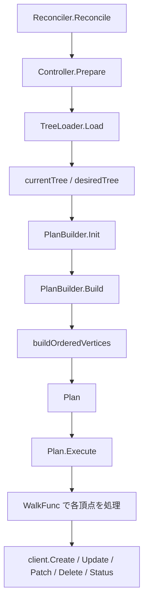

# 第6章 graph エンジン: DAG による変換パイプライン

> 本章で読むソース:
>
> - [pkg/controller/graph/dag.go L28-L407](https://github.com/apecloud/kubeblocks/blob/v1.0.2/pkg/controller/graph/dag.go#L28-L407)
> - [pkg/controller/graph/transformer.go L33-L75](https://github.com/apecloud/kubeblocks/blob/v1.0.2/pkg/controller/graph/transformer.go#L33-L75)
> - [pkg/controller/graph/plan_builder.go L22-L39](https://github.com/apecloud/kubeblocks/blob/v1.0.2/pkg/controller/graph/plan_builder.go#L22-L39)
> - [pkg/controller/graph/doc.go L20-L47](https://github.com/apecloud/kubeblocks/blob/v1.0.2/pkg/controller/graph/doc.go#L20-L47)
> - [pkg/controller/model/graph_client.go L31-L268](https://github.com/apecloud/kubeblocks/blob/v1.0.2/pkg/controller/model/graph_client.go#L31-L268)
> - [pkg/controller/model/transform_types.go L47-L96](https://github.com/apecloud/kubeblocks/blob/v1.0.2/pkg/controller/model/transform_types.go#L47-L96)

## この章の狙い

KubeBlocks のコントローラは、リコンシリエーションの過程で複数の Kubernetes リソースを同時に操作する。
`Cluster` 1つをとっても `Component`、`Service`、`ConfigMap`、`Secret`、`PVC` が派生し、それらの作成・更新・削除を正しい順序で実行しなければならない。
graph エンジンは、こうした複数リソースへの変更を DAG（有向非巡回グラフ）上にモデル化し、トポロジーソートで実行順序を決定する仕組みである。
本章では `pkg/controller/graph/` パッケージが提供するデータ構造と変換パイプラインの仕組みを読み、リソース操作がどのように構造化されるかを明らかにする。

## 前提

- 第5章で読んだ `kubebuilderx` フレームワークが、リコンシリエーションの最終段階で `PlanBuilder` を呼び出す流れを理解していること。
- Kubernetes のコントローラパターン（リコンシリエーションループ）の基礎（第9章）。

## 1. 3段階のリコンシリエーションモデル

`doc.go` がパッケージの設計方針を明示している。

pkg/controller/graph/doc.go L20-L46

```go
/*
Package graph tries to model the controller reconciliation loop in a more structured way.
It structures the reconciliation loop to 3 stage: Init, Build and Execute.

# Initialization Stage

the Init stage is for meta loading, object query etc.
Try loading infos that used in the following stages.

# Building Stage

...

# Execution Stage

the plan is executed in this stage, all the object manipulations(create/update/delete) are committed.
*/
package graph
```

リコンシリエーションは次の3段階に分かれる。

1. **Init**: メタデータの読み込み、オブジェクトの問い合わせ。
2. **Build**: 空の DAG を構築し、一連の `Transformer` を適用して最終的な実行計画（`Plan`）を生成する。
3. **Execute**: `Plan` を実行し、Kubernetes API に対してリソースの作成・更新・削除を投入する。

この分離により、変換ロジック（何をすべきか）と実行ロジック（どう適用するか）が独立する。

## 2. DAG のデータ構造

`DAG` はグラフエンジンの中心データ構造である。

pkg/controller/graph/dag.go L28-L38

```go
type DAG struct {
    vertices map[Vertex]Vertex
    edges    map[Edge]Edge
}

type Vertex interface{}

type Edge interface {
    From() Vertex
    To() Vertex
}
```

`Vertex` は任意の型を受け付ける空インタフェースである。
`Edge` は `From()` と `To()` を持つ有向辺を表す。
実装は `map` ベースで、頂点の追加・削除、辺の追加・削除を O(1) で扱う（ただし隣接頂点の列挙は辺の全走査が必要である）。

### 2.1 辺の構築

`Connect` は2つの頂点を結ぶ辺を新規に作成する。

pkg/controller/graph/dag.go L116-L128

```go
func (d *DAG) Connect(from, to Vertex) bool {
    if from == nil || to == nil {
        return false
    }
    for k := range d.edges {
        if k.From() == from && k.To() == to {
            return true
        }
    }
    edge := RealEdge(from, to)
    d.edges[edge] = edge
    return true
}
```

すでに同一の辺が存在する場合は二重追加を避ける。
`AddConnect` は頂点を追加してから辺を張る糖衣構文である。

pkg/controller/graph/dag.go L131-L136

```go
func (d *DAG) AddConnect(from, to Vertex) bool {
    if !d.AddVertex(to) {
        return false
    }
    return d.Connect(from, to)
}
```

### 2.2 トポロジーソート

DAG の最も重要な操作がトポロジーソートである。
`WalkTopoOrder` はバリデーション後にトポロジー順序で頂点を走査する。

pkg/controller/graph/dag.go L148-L159

```go
func (d *DAG) WalkTopoOrder(walkFunc WalkFunc, less func(v1, v2 Vertex) bool) error {
    if err := d.Validate(); err != nil {
        return err
    }
    orders := d.topologicalOrder(false, less)
    for _, v := range orders {
        if err := walkFunc(v); err != nil {
            return err
        }
    }
    return nil
}
```

内部の `topologicalOrder` は DFS で後順に頂点を積む古典的なアルゴリズムである。

pkg/controller/graph/dag.go L332-L372

```go
func (d *DAG) topologicalOrder(reverse bool, less func(v1, v2 Vertex) bool) []Vertex {
    orders := make([]Vertex, 0)
    walked := make(map[Vertex]bool)
    var walk func(v Vertex)
    walk = func(v Vertex) {
        if walked[v] {
            return
        }
        var adjacent []Vertex
        if reverse {
            adjacent = d.outAdj(v)
        } else {
            adjacent = d.inAdj(v)
        }
        if less != nil {
            sort.SliceStable(adjacent, func(i, j int) bool {
                return less(adjacent[i], adjacent[j])
            })
        }
        for _, vertex := range adjacent {
            walk(vertex)
        }
        walked[v] = true
        orders = append(orders, v)
    }
    vertexLst := d.Vertices()
    if less != nil {
        sort.SliceStable(vertexLst, func(i, j int) bool {
            return less(vertexLst[i], vertexLst[j])
        })
    }
    for _, v := range vertexLst {
        walk(v)
    }
    return orders
}
```

`less` 関数を受け取る設計になっている。
DAG は一般に複数のトポロジー順序を持ちうるが、`less` で比較基準を与えることで決定列を一意に固定する。
この仕組みがリソース間の依存関係を忠実に保ちながら、再現性のある実行順序を保証する。

### 2.3 バリデーション

`Validate` は単一のルート頂点の存在と、閉路の不在を検査する。

pkg/controller/graph/dag.go L284-L328

```go
func (d *DAG) Validate() error {
    root := d.Root()
    if root == nil {
        return errors.New("no single Root found")
    }
    for e := range d.edges {
        if e.From() == e.To() {
            return fmt.Errorf("self-cycle found: %v", e.From())
        }
    }
    walked := make(map[Vertex]bool)
    marked := make(map[Vertex]bool)
    var walk func(v Vertex) error
    walk = func(v Vertex) error {
        if walked[v] {
            return nil
        }
        if marked[v] {
            return errors.New("cycle found")
        }
        marked[v] = true
        adjacent := d.outAdj(v)
        for _, vertex := range adjacent {
            if err := walk(vertex); err != nil {
                return err
            }
        }
        marked[v] = false
        walked[v] = true
        return nil
    }
    for v := range d.vertices {
        if err := walk(v); err != nil {
            return err
        }
    }
    return nil
}
```

`marked` は DFS の再帰中に「現在辿っているパス上」にある頂点を記録する。
すでに `marked` の頂点に再到達すれば閉路と判定する。
`walked` は走査済みの頂点を記録し、不要な再帰呼び出しを防ぐ。

## 3. Transformer と変換チェーン

`Transformer` は DAG を受け取り、別の状態の DAG へ変換するインタフェースである。

pkg/controller/graph/transformer.go L42-L44

```go
type Transformer interface {
    Transform(ctx TransformContext, dag *DAG) error
}
```

`TransformContext` は `context.Context`、`client.Reader`、`EventRecorder`、`Logger` をまとめたコンテキストである。

pkg/controller/graph/transformer.go L34-L39

```go
type TransformContext interface {
    GetContext() context.Context
    GetClient() client.Reader
    GetRecorder() record.EventRecorder
    GetLogger() logr.Logger
}
```

### 3.1 TransformerChain

複数の `Transformer` を直列に連結するのが `TransformerChain` である。

pkg/controller/graph/transformer.go L47-L68

```go
type TransformerChain []Transformer

func (r TransformerChain) ApplyTo(ctx TransformContext, dag *DAG) error {
    var delayedError error
    for _, transformer := range r {
        if err := transformer.Transform(ctx, dag); err != nil {
            if intctrlutil.IsDelayedRequeueError(err) {
                if delayedError == nil {
                    delayedError = err
                }
                continue
            }
            return ignoredIfPrematureStop(err)
        }
    }
    return delayedError
}
```

チェーンの各要素は順に DAG を変換していく。
エラー処理に2つの特徴がある。

1つ目は `ErrPrematureStop` の扱いである。
このエラーを返すとチェーンが途中で停止するが、`ignoredIfPrematureStop` によって `nil` に変換される。
つまり「予定通りの早期終了」は正常終了として扱われる。

pkg/controller/graph/transformer.go L51-L52

```go
var ErrPrematureStop = errors.New("Premature-Stop")
```

2つ目は `DelayedRequeueError` の扱いである。
このエラーを返したトランスフォーマーはスキップされ、チェーンを最後まで実行した後に遅延再キューエラーとして返される。
これにより「再キューは必要だが、他のトランスフォーマーの処理は完了させたい」という要件を満たす。

## 4. PlanBuilder と Plan

`PlanBuilder` は `Init`、`AddTransformer`、`Build` の3段階で `Plan` を構築するインタフェースである。

pkg/controller/graph/plan_builder.go L23-L33

```go
type PlanBuilder interface {
    Init() error
    AddTransformer(transformer ...Transformer) PlanBuilder
    Build() (Plan, error)
}

type Plan interface {
    Execute() error
}
```

このインタフェースを実装するのが `kubebuilderx` パッケージの `PlanBuilder` である（詳細は第5章参照）。
ここでは `PlanBuilder` がどのように DAG を構築し、`Plan` として実行するかを読む。

### 4.1 ObjectVertex: リソース操作の単位

DAG の各頂点は `ObjectVertex` として具体化される。

pkg/controller/model/transform_types.go L47-L75

```go
type Action string

const (
    CREATE = Action("CREATE")
    UPDATE = Action("UPDATE")
    PATCH  = Action("PATCH")
    DELETE = Action("DELETE")
    STATUS = Action("STATUS")
)

type ObjectVertex struct {
    Obj               client.Object
    OriObj            client.Object
    Action            *Action
    SubResource       string
    ClientOpt         any
    PropagationPolicy client.PropagationPolicy
}
```

`Obj` は操作対象の Kubernetes オブジェクト（新規 or 更新後）。
`OriObj` は更新前のオブジェクト（`PATCH` で差分計算に使う）。
`Action` は `CREATE`、`UPDATE`、`PATCH`、`DELETE`、`STATUS` のいずれかである。

### 4.2 GraphClient: トランスフォーマーが DAG を操作する手段

トランスフォーマーは直接 `DAG` を操作せず、`GraphClient` を介して頂点を追加する。

pkg/controller/model/graph_client.go L71-L74

```go
type GraphClient interface {
    client.Reader
    GraphWriter
}
```

`GraphWriter` は `Create`、`Update`、`Delete`、`Patch`、`Status`、`DependOn` 等の操作を提供する。

pkg/controller/model/graph_client.go L31-L69

```go
type GraphWriter interface {
    Root(dag *graph.DAG, objOld, objNew client.Object, action *Action)
    Create(dag *graph.DAG, obj client.Object, opts ...GraphOption)
    Delete(dag *graph.DAG, obj client.Object, opts ...GraphOption)
    Update(dag *graph.DAG, objOld, objNew client.Object, opts ...GraphOption)
    Patch(dag *graph.DAG, objOld, objNew client.Object, opts ...GraphOption)
    Status(dag *graph.DAG, objOld, objNew client.Object, opts ...GraphOption)
    Do(dag *graph.DAG, objOld, objNew client.Object, action *Action, parent *ObjectVertex, opts ...GraphOption) *ObjectVertex
    IsAction(dag *graph.DAG, obj client.Object, action *Action) bool
    DependOn(dag *graph.DAG, object client.Object, dependencies ...client.Object)
    FindAll(dag *graph.DAG, obj interface{}, opts ...GraphOption) []client.Object
    FindMatchedVertex(dag *graph.DAG, object client.Object) graph.Vertex
}
```

`doWrite` は既存頂点の検索と新規頂点の追加を統一的に扱う。

pkg/controller/model/graph_client.go L209-L233

```go
func (r *realGraphClient) doWrite(dag *graph.DAG, objOld, objNew client.Object, action *Action, opts ...GraphOption) {
    graphOpts := &GraphOptions{}
    for _, opt := range opts {
        opt.ApplyTo(graphOpts)
    }
    vertex := r.FindMatchedVertex(dag, objNew)
    switch {
    case vertex != nil:
        objVertex, _ := vertex.(*ObjectVertex)
        objVertex.Action = action
        if graphOpts.replaceIfExisting {
            objVertex.Obj = objNew
            objVertex.OriObj = objOld
        }
    default:
        vertex = &ObjectVertex{
            Obj:       objNew,
            OriObj:    objOld,
            Action:    action,
            ClientOpt: graphOpts.clientOpt,
        }
        dag.AddConnectRoot(vertex)
    }
}
```

同じ GVK と名前のオブジェクトがすでに DAG 上に存在する場合、頂点を新規作成せずアクションを上書きする。
これにより複数のトランスフォーマーが同じリソースを操作しても、頂点が重複しない。

### 4.3 DependOn: 依存関係の明示

`DependOn` はオブジェクト間の依存関係を DAG の辺として記録する。

pkg/controller/model/graph_client.go L164-L181

```go
func (r *realGraphClient) DependOn(dag *graph.DAG, object client.Object, dependency ...client.Object) {
    objectVertex := r.FindMatchedVertex(dag, object)
    if objectVertex == nil {
        return
    }
    for _, d := range dependency {
        value := reflect.ValueOf(d)
        if d == nil || (value.Kind() == reflect.Ptr && value.IsNil()) {
            continue
        }
        v := r.FindMatchedVertex(dag, d)
        if v != nil {
            dag.Connect(objectVertex, v)
        }
    }
}
```

例えば `Service` が `Pod` の準備完了に依存する場合、`DependOn(service, pod)` を呼ぶことで辺が張られる。
トポロジーソート時に依存先が先に処理され、実行順序が保証される。

## 5. Plan の実行

`Plan` の実体は頂点の配列と、各頂点に適用する `WalkFunc` である。
`Execute` は配列を逆順に走査し、`WalkFunc` を呼び出す。

pkg/controller/kubebuilderx/plan_builder.go L219-L227

```go
func (p *Plan) Execute() error {
    var err error
    for i := len(p.vertices) - 1; i >= 0; i-- {
        if err = p.walkFunc(p.vertices[i]); err != nil {
            return err
        }
    }
    return nil
}
```

`defaultWalkFunc` は `ObjectVertex` の `Action` に応じて分岐する。

pkg/controller/kubebuilderx/plan_builder.go L231-L254

```go
func (b *PlanBuilder) defaultWalkFunc(v graph.Vertex) error {
    vertex, ok := v.(*model.ObjectVertex)
    if !ok {
        return fmt.Errorf("wrong vertex type %v", v)
    }
    if vertex.Action == nil {
        return errors.New("vertex action can't be nil")
    }
    b.transCtx.logger.V(5).Info("action for vertex", "vertex", vertex.String())
    ctx := b.transCtx.ctx
    switch *vertex.Action {
    case model.CREATE:
        return b.createObject(ctx, vertex)
    case model.UPDATE:
        return b.updateObject(ctx, vertex)
    case model.PATCH:
        return b.patchObject(ctx, vertex)
    case model.DELETE:
        return b.deleteObject(ctx, vertex)
    case model.STATUS:
        return b.statusObject(ctx, vertex)
    }
    return nil
}
```

各アクションは `client.Client` を通じて Kubernetes API を呼び出す。
`PATCH` は `MergeFrom` で差分を計算し、`DELETE` は Finalizer の除去を先に行う。

### 5.1 頂点の順序付け

`buildOrderedVertices` は current tree と desired tree の差分から頂点リストを生成する。

pkg/controller/kubebuilderx/plan_builder.go L105-L214

```go
func buildOrderedVertices(transCtx *transformContext, currentTree *ObjectTree, desiredTree *ObjectTree) []*model.ObjectVertex {
    // ... (中略) ...
    var vertices []*model.ObjectVertex

    // handle root object
    if desiredTree.GetRoot() == nil {
        root := model.NewObjectVertex(currentTree.GetRoot(), currentTree.GetRoot(), model.ActionDeletePtr())
        vertices = append(vertices, root)
    } else {
        // ... (中略: status update, meta patch) ...
    }

    // handle secondary objects
    oldSnapshot := currentTree.GetSecondaryObjects()
    newSnapshot := desiredTree.GetSecondaryObjects()

    oldNameSet := sets.KeySet(oldSnapshot)
    newNameSet := sets.KeySet(newSnapshot)

    createSet := newNameSet.Difference(oldNameSet)
    updateSet := newNameSet.Intersection(oldNameSet)
    deleteSet := oldNameSet.Difference(newNameSet)

    var (
        assistantVertices []*model.ObjectVertex
        workloadVertices  []*model.ObjectVertex
    )
    findAndAppend := func(vertex *model.ObjectVertex) {
        switch vertex.Obj.(type) {
        case *corev1.Service, *corev1.ConfigMap, *corev1.Secret, *corev1.PersistentVolumeClaim:
            assistantVertices = append(assistantVertices, vertex)
        default:
            workloadVertices = append(workloadVertices, vertex)
        }
    }
    // ... (中略: create, update, delete の各生成) ...
    handleDependencies := func() {
        vertices = append(vertices, workloadVertices...)
        vertices = append(vertices, assistantVertices...)
    }
    // ... (中略) ...
    handleDependencies()
    return vertices
}
```

この関数の重要な設計は、リソース種別による実行順序の制御である。
`Service`、`ConfigMap`、`Secret`、`PVC` を `assistantVertices` に分類し、ワークロード（`StatefulSet` 等）より後に配置する。
`Execute` は配列を逆順に走査するため、結果としてワークロードが先に処理され、補佐リソースが後に処理される。

## 6. DAG の活用事例: InstanceSet の更新計画

graph パッケージの `DAG` は `InstanceSet` コントローラの更新計画でも使われている。

pkg/controller/instanceset/update_plan.go L42-L48

```go
type realUpdatePlan struct {
    its             workloads.InstanceSet
    pods            []corev1.Pod
    dag             *graph.DAG
    podsToBeUpdated []*corev1.Pod
    isPodUpdated    func(*workloads.InstanceSet, *corev1.Pod) (bool, error)
}
```

`build` メソッドでポッドを頂点とする DAG を構築し、`WalkBFS` で走査する。

pkg/controller/instanceset/update_plan.go L121-L140

```go
func (p *realUpdatePlan) build() {
    root := &model.ObjectVertex{}
    p.dag.AddVertex(root)

    memberUpdateStrategy := getMemberUpdateStrategy(&p.its)

    rolePriorityMap := ComposeRolePriorityMap(p.its.Spec.Roles)
    SortPods(p.pods, rolePriorityMap, false)

    switch memberUpdateStrategy {
    case workloads.SerialUpdateStrategy:
        p.buildSerialUpdatePlan()
    case workloads.ParallelUpdateStrategy:
        p.buildParallelUpdatePlan()
    case workloads.BestEffortParallelUpdateStrategy:
        p.buildBestEffortParallelUpdatePlan(rolePriorityMap)
    }
}
```

シリアル戦略では全ポッドを鎖状に連結し、並列戦略ではルートから全ポッドに直接辺を張る。
Best-Effort 並列戦略では、ロールの優先度に従ってポッドをグループ化し、グループ内は並列、グループ間は直列の DAG を構成する。

## 7. データフローの全体像

graph エンジンにおけるデータフローを Mermaid で示す。



`Prepare` でロードした2つのツリー（現在状態と望ましい状態）の差分を取り、頂点リストを生成する。
`Execute` が逆順に走査することで、ワークロードが先に、補佐リソースが後に処理される。

## 8. 高速化・最適化: 頂点の重複排除による API 呼び出しの削減

`doWrite` の既存頂点検索は、同じリソースに対する重複した API 呼び出しを防ぐ最適化である。

pkg/controller/model/graph_client.go L215-L232

```go
    vertex := r.FindMatchedVertex(dag, objNew)
    switch {
    case vertex != nil:
        objVertex, _ := vertex.(*ObjectVertex)
        objVertex.Action = action
        if graphOpts.replaceIfExisting {
            objVertex.Obj = objNew
            objVertex.OriObj = objOld
        }
    default:
        vertex = &ObjectVertex{
            Obj:       objNew,
            OriObj:    objOld,
            Action:    action,
            ClientOpt: graphOpts.clientOpt,
        }
        dag.AddConnectRoot(vertex)
    }
```

複数のトランスフォーマーが同じ `ConfigMap` を更新する場合でも、DAG 上の頂点は1つに統合せされる。
結果として `Execute` 時の Kubernetes API 呼び出しは1回で済み、冗長なネットワークラウンドトリップを排除できる。

## まとめ

graph エンジンはリコンシリエーションを「Init → Build → Execute」の3段階に構造化する。
`DAG` はリソース操作を頂点としてモデル化し、トポロジーソートで実行順序を保証する。
`Transformer` と `TransformerChain` は変換ロジックを直列に連結し、`ErrPrematureStop` と `DelayedRequeueError` で柔軟な制御を提供する。
`GraphClient` はトランスフォーマーに対して安全な DAG 操作手段を提供し、頂点の重複排除で API 呼び出しを削減する。
`InstanceSet` の更新計画では、DAG の辺の張り方を変えることでシリアル・並列・Best-Effort の更新戦略を実現する。

## 関連する章

- 第5章 [kubebuilderx: 拡張 Reconciler フレームワーク](05-kubebuilderx.md): `PlanBuilder` の呼び出し元。
- 第7章 [builder: リソース生成の統一インタフェース](07-builder.md): トランスフォーマーが `GraphClient` を介して生成するリソースの詳細。
- 第10章 [InstanceSet コントローラ: ポッドライフサイクル管理](../part02-main-controllers/10-instanceset-controller.md): DAG を使った更新計画の具体的な適用例。
