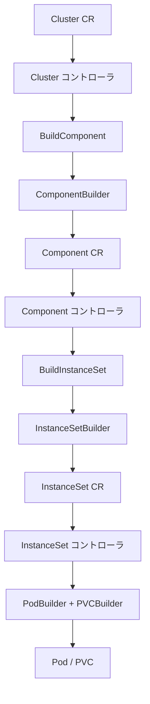

# 第7章 builder: リソース生成の統一インタフェース

> 本章で読むソース:
>
> - [pkg/controller/builder/builder_base.go L36-L134](https://github.com/apecloud/kubeblocks/blob/v1.0.2/pkg/controller/builder/builder_base.go#L36-L134)
> - [pkg/controller/builder/builder_instance_set.go L32-L161](https://github.com/apecloud/kubeblocks/blob/v1.0.2/pkg/controller/builder/builder_instance_set.go#L32-L161)
> - [pkg/controller/builder/builder_pod.go L27-L124](https://github.com/apecloud/kubeblocks/blob/v1.0.2/pkg/controller/builder/builder_pod.go#L27-L124)
> - [pkg/controller/builder/builder_container.go L26-L107](https://github.com/apecloud/kubeblocks/blob/v1.0.2/pkg/controller/builder/builder_container.go#L26-L107)
> - [pkg/controller/builder/builder_service.go L27-L125](https://github.com/apecloud/kubeblocks/blob/v1.0.2/pkg/controller/builder/builder_service.go#L27-L125)
> - [pkg/controller/builder/builder_component.go L29-L199](https://github.com/apecloud/kubeblocks/blob/v1.0.2/pkg/controller/builder/builder_component.go#L29-L199)
> - [pkg/controller/factory/builder.go L48-L107](https://github.com/apecloud/kubeblocks/blob/v1.0.2/pkg/controller/factory/builder.go#L48-L107)

## この章の狙い

KubeBlocks のコントローラは `Cluster`、`Component`、`InstanceSet`、`Pod`、`Service`、`PVC` など多数の Kubernetes リソースを生成する。
これらのリソース生成を統一された Builder パターンで扱うことで、コードの重複を排除し、呼び出し側での構築手順を可読なチェーン記述にしている。
本章では `BaseBuilder` のジェネリック設計から、30種以上の具象ビルダーの共通パターン、そして実際のコントローラでの利用場面までを追う。

## 前提

- 第5章 [kubebuilderx](05-kubebuilderx.md) でコントローラの Reconciler フレームワークを理解していること。
- 第6章 [graph エンジン](06-graph-engine.md) で DAG によるリソース変換の流れを把握していること。
- Kubernetes の `client.Object` インタフェースと `metav1.ObjectMeta` の基本構造を知っていること。

## 7.1 BaseBuilder: ジェネリクスによる共通基盤

builder パッケージの核心は `BaseBuilder` である。
Go のジェネリクスを用いて、任意の Kubernetes リソース型を単一の構造体で扱えるようにしている。

[pkg/controller/builder/builder_base.go L36-L39](https://github.com/apecloud/kubeblocks/blob/v1.0.2/pkg/controller/builder/builder_base.go#L36-L39)

```go
type BaseBuilder[T intctrlutil.Object, PT intctrlutil.PObject[T], B any] struct {
	object          PT
	concreteBuilder *B
}
```

3つの型パラメータを持つ。

- `T`: リソースの値型（例: `corev1.Pod`、`workloads.InstanceSet`）。
- `PT`: `T` へのポインタ型で `client.Object` を満たす制約（`PObject[T]`）。
- `B`: 具象ビルダー自身（CRTP: Curiously Recurring Template Pattern の Go 版）。

`intctrlutil.PObject[T]` は `pkg/generics/type.go` で定義された型制約である。

[pkg/generics/type.go L42-L49](https://github.com/apecloud/kubeblocks/blob/v1.0.2/pkg/generics/type.go#L42-L49)

```go
type Object interface{}

type PObject[T Object] interface {
	*T
	client.Object
	DeepCopy() *T
}
```

`*T` が `client.Object` を満たすことで、`SetNamespace`、`SetName`、`SetLabels` といった `metav1.ObjectMeta` 操作を型安全に呼び出せる。

### 7.1.1 init とアクセッサ

`init` メソッドは名前空間と名前を初期化し、具象ビルダーへの参照を保持する。

[pkg/controller/builder/builder_base.go L41-L50](https://github.com/apecloud/kubeblocks/blob/v1.0.2/pkg/controller/builder/builder_base.go#L41-L50)

```go
func (builder *BaseBuilder[T, PT, B]) init(namespace, name string, obj PT, b *B) {
	obj.SetNamespace(namespace)
	obj.SetName(name)
	builder.object = obj
	builder.concreteBuilder = b
}

func (builder *BaseBuilder[T, PT, B]) get() PT {
	return builder.object
}
```

`get()` は内部オブジェクトへのポインタを返す。
具象ビルダーは `get()` 経由で `Spec` フィールドにアクセスする。

### 7.1.2 ラベル、アノテーション、OwnerReference

`BaseBuilder` が提供する共通メソッドはラベル、アノテーション、OwnerReference の設定である。

[pkg/controller/builder/builder_base.go L62-L116](https://github.com/apecloud/kubeblocks/blob/v1.0.2/pkg/controller/builder/builder_base.go#L62-L116)

```go
func (builder *BaseBuilder[T, PT, B]) AddLabels(keysAndValues ...string) *B {
	builder.AddLabelsInMap(WithMap(keysAndValues...))
	return builder.concreteBuilder
}

func (builder *BaseBuilder[T, PT, B]) AddLabelsInMap(labels map[string]string) *B {
	if len(labels) == 0 {
		return builder.concreteBuilder
	}
	l := builder.object.GetLabels()
	if l == nil {
		l = make(map[string]string, 0)
	}
	for k, v := range labels {
		l[k] = v
	}
	builder.object.SetLabels(l)
	return builder.concreteBuilder
}
```

`AddLabels` は可変長引数でキーと値を受け取り、`WithMap` で `map[string]string` に変換する。
`AddLabelsInMap` は既存のラベルがあればマージし、なければ新規作成する。
すべてのメソッドが `*B`（具象ビルダーへのポインタ）を返すため、メソッドチェーンが途切れない。

`SetOwnerReferences` は `reflect` を使って nil チェックを行い、安全に OwnerReference を設定する。

[pkg/controller/builder/builder_base.go L105-L116](https://github.com/apecloud/kubeblocks/blob/v1.0.2/pkg/controller/builder/builder_base.go#L105-L116)

```go
func (builder *BaseBuilder[T, PT, B]) SetOwnerReferences(ownerAPIVersion string, ownerKind string, owner client.Object) *B {
	if owner != nil && !reflect.ValueOf(owner).IsNil() {
		t := true
		builder.object.SetOwnerReferences([]metav1.OwnerReference{
			{APIVersion: ownerAPIVersion, Kind: ownerKind, Controller: &t,
				BlockOwnerDeletion: &t, Name: owner.GetName(), UID: owner.GetUID()},
		})
	}
	return builder.concreteBuilder
}
```

`Controller: &t`、`BlockOwnerDeletion: &t` と両方のフラグを立てることで、ガベージコレクション時にオーナーが削除されたら従属リソースも自動的に削除される。

### 7.1.3 WithMap ヘルパー

可変長引数のキーと値のペアを `map[string]string` に変換するユーティリティである。

[pkg/controller/builder/builder_base.go L127-L134](https://github.com/apecloud/kubeblocks/blob/v1.0.2/pkg/controller/builder/builder_base.go#L127-L134)

```go
func WithMap(keysAndValues ...string) map[string]string {
	m := make(map[string]string, len(keysAndValues)/2)
	for i := 0; i+1 < len(keysAndValues); i += 2 {
		m[keysAndValues[i]] = keysAndValues[i+1]
	}
	return m
}
```

引数の長さが奇数の場合、最後のキーは無視される（`i+1 < len(keysAndValues)` の条件でガード）。
この設計により、呼び出し側は `AddLabels("key1", "val1", "key2", "val2")` のようにペアで渡すだけでよい。

## 7.2 具象ビルダーの実装パターン

`BaseBuilder` を埋め込むことで、各リソース用の具象ビルダーが最小のコードで定義できる。
本章では代表的な 4 つのビルダーを取り上げる。

### 7.2.1 InstanceSetBuilder

`InstanceSet` は KubeBlocks 独自のワークロード CRD であり、ビルダーも最もメソッド数が多い。

[pkg/controller/builder/builder_instance_set.go L32-L46](https://github.com/apecloud/kubeblocks/blob/v1.0.2/pkg/controller/builder/builder_instance_set.go#L32-L46)

```go
type InstanceSetBuilder struct {
	BaseBuilder[workloads.InstanceSet, *workloads.InstanceSet, InstanceSetBuilder]
}

func NewInstanceSetBuilder(namespace, name string) *InstanceSetBuilder {
	builder := &InstanceSetBuilder{}
	replicas := int32(1)
	builder.init(namespace, name,
		&workloads.InstanceSet{
			Spec: workloads.InstanceSetSpec{
				Replicas: &replicas,
			},
		}, builder)
	return builder
}
```

`BaseBuilder` の第3型パラメータに `InstanceSetBuilder` 自身を渡すことで、`AddLabels` 等の共通メソッドが `*InstanceSetBuilder` を返す。
コンストラクタではデフォルトの `Replicas` を 1 に設定している。

具象メソッドは `get()` 経由で `Spec` の各フィールドを設定する。

[pkg/controller/builder/builder_instance_set.go L48-L70](https://github.com/apecloud/kubeblocks/blob/v1.0.2/pkg/controller/builder/builder_instance_set.go#L48-L70)

```go
func (builder *InstanceSetBuilder) SetReplicas(replicas int32) *InstanceSetBuilder {
	builder.get().Spec.Replicas = &replicas
	return builder
}

func (builder *InstanceSetBuilder) SetSelectorMatchLabel(labels map[string]string) *InstanceSetBuilder {
	selector := builder.get().Spec.Selector
	if selector == nil {
		selector = &metav1.LabelSelector{}
		builder.get().Spec.Selector = selector
	}
	matchLabels := make(map[string]string, len(labels))
	for k, v := range labels {
		matchLabels[k] = v
	}
	builder.get().Spec.Selector.MatchLabels = matchLabels
	return builder
}
```

`SetSelectorMatchLabel` は `selector` が nil の場合に初期化する。
このように、ビルダーは必要な構造体の遅延初期化を内部で行うため、呼び出し側は nil チェックを気にせずチェーンできる。

### 7.2.2 PodBuilder

`PodBuilder` は `Pod` リソースの構築を担当する。

[pkg/controller/builder/builder_pod.go L27-L74](https://github.com/apecloud/kubeblocks/blob/v1.0.2/pkg/controller/builder/builder_pod.go#L27-L74)

```go
type PodBuilder struct {
	BaseBuilder[corev1.Pod, *corev1.Pod, PodBuilder]
}

func NewPodBuilder(namespace, name string) *PodBuilder {
	builder := &PodBuilder{}
	builder.init(namespace, name, &corev1.Pod{}, builder)
	return builder
}

func (builder *PodBuilder) SetPodSpec(podSpec corev1.PodSpec) *PodBuilder {
	builder.get().Spec = podSpec
	return builder
}

func (builder *PodBuilder) AddContainer(container corev1.Container) *PodBuilder {
	containers := builder.get().Spec.Containers
	containers = append(containers, container)
	builder.get().Spec.Containers = containers
	return builder
}
```

`SetPodSpec` で `PodSpec` 全体を一度に設定できるほか、`AddContainer`、`AddInitContainer`、`AddVolumes` 等で個別に追加も可能である。
`Add` 系のメソッドは既存のスライスに `append` するため、複数回の呼び出しで要素を蓄積できる。

### 7.2.3 ServiceBuilder と HeadlessServiceBuilder

`ServiceBuilder` には通常の `NewServiceBuilder` に加えて、Headless Service 専用のコンストラクタが用意されている。

[pkg/controller/builder/builder_service.go L31-L43](https://github.com/apecloud/kubeblocks/blob/v1.0.2/pkg/controller/builder/builder_service.go#L31-L43)

```go
func NewServiceBuilder(namespace, name string) *ServiceBuilder {
	builder := &ServiceBuilder{}
	builder.init(namespace, name, &corev1.Service{}, builder)
	return builder
}

func NewHeadlessServiceBuilder(namespace, name string) *ServiceBuilder {
	builder := &ServiceBuilder{}
	builder.init(namespace, name, &corev1.Service{}, builder)
	builder.SetType(corev1.ServiceTypeClusterIP)
	builder.get().Spec.ClusterIP = corev1.ClusterIPNone
	return builder
}
```

`NewHeadlessServiceBuilder` は `ClusterIP: None` を設定することで、DNS による個別ポッド解決を可能にする Headless Service を生成する。
データベースのクラスター構成では各ポッドに直接アクセスする必要があるため、Headless Service は頻繁に利用される。

`SetType` では `LoadBalancer` 指定時に `ExternalTrafficPolicy: Local` を自動設定する。

[pkg/controller/builder/builder_service.go L91-L103](https://github.com/apecloud/kubeblocks/blob/v1.0.2/pkg/controller/builder/builder_service.go#L91-L103)

```go
func (builder *ServiceBuilder) SetType(serviceType corev1.ServiceType) *ServiceBuilder {
	if serviceType == "" {
		return builder
	}
	builder.get().Spec.Type = serviceType
	if serviceType == corev1.ServiceTypeLoadBalancer {
		builder.get().Spec.ExternalTrafficPolicy = corev1.ServiceExternalTrafficPolicyTypeLocal
	}
	return builder
}
```

`ExternalTrafficPolicy: Local` はクライアント IP の保持とネットワークホップの削減という2つの効果を持つ。
この最適化の詳細は 7.5 節で改めて触れる。

### 7.2.4 ComponentBuilder

`ComponentBuilder` は `Cluster` の `ComponentSpec` から `Component` CRD オブジェクトを構築する。

[pkg/controller/builder/builder_component.go L29-L42](https://github.com/apecloud/kubeblocks/blob/v1.0.2/pkg/controller/builder/builder_component.go#L29-L42)

```go
type ComponentBuilder struct {
	BaseBuilder[appsv1.Cluster, *appsv1.Cluster, ComponentBuilder]
}

func NewComponentBuilder(namespace, name, compDef string) *ComponentBuilder {
	builder := &ComponentBuilder{}
	builder.init(namespace, name,
		&appsv1.Component{
			Spec: appsv1.ComponentSpec{
				CompDef: compDef,
			},
		}, builder)
	return builder
}
```

`NewComponentBuilder` は名前空間、名前に加えて `compDef`（ComponentDefinition 名）を受け取る。
これは `Component` の `Spec.CompDef` フィールドに設定され、どの定義テンプレートから生成されたコンポーネントかを示す。

## 7.3 サブビルダー: リソースの一部を構築する

`BaseBuilder` を使わないサブビルダーも存在する。
これらは Kubernetes リソースそのものではなく、リソースの一部（コンテナ、ボリューム等）を構築する。

### 7.3.1 ContainerBuilder

[pkg/controller/builder/builder_container.go L26-L47](https://github.com/apecloud/kubeblocks/blob/v1.0.2/pkg/controller/builder/builder_container.go#L26-L47)

```go
type ContainerBuilder struct {
	object *corev1.Container
}

func NewContainerBuilder(name string) *ContainerBuilder {
	builder := &ContainerBuilder{}
	builder.init(name, &corev1.Container{})
	return builder
}

func (builder *ContainerBuilder) init(name string, obj *corev1.Container) {
	obj.Name = name
	builder.object = obj
}
```

`ContainerBuilder` は `BaseBuilder` を使わず、`*corev1.Container` を直接保持する。
`Container` は `client.Object` を満たさない（`metav1.ObjectMeta` を持たない）ため、ジェネリック制約 `PObject[T]` を満たせない。
このため、独自の `init` と `get` を持つ独立した構造体になっている。

### 7.3.2 VolumeBuilder

[pkg/controller/builder/builder_volume.go L24-L45](https://github.com/apecloud/kubeblocks/blob/v1.0.2/pkg/controller/builder/builder_volume.go#L24-L45)

```go
type VolumeBuilder struct {
	object *corev1.Volume
}

func NewVolumeBuilder(name string) *VolumeBuilder {
	builder := &VolumeBuilder{}
	builder.object = &corev1.Volume{Name: name}
	return builder
}
```

`VolumeBuilder` も同様に `client.Object` を満たさない `corev1.Volume` を扱うため、独立した構造体である。
`SetVolumeSource` で `VolumeSource` を設定する。

## 7.4 ビルダー一覧

builder パッケージには 30種以上のビルダーが存在する。
表 7-1 に主要なビルダーとその用途を示す。

| ビルダー | 生成リソース | コンストラクタ |
|---|---|---|
| `InstanceSetBuilder` | `InstanceSet` | `NewInstanceSetBuilder(ns, name)` |
| `PodBuilder` | `Pod` | `NewPodBuilder(ns, name)` |
| `PVCBuilder` | `PersistentVolumeClaim` | `NewPVCBuilder(ns, name)` |
| `ServiceBuilder` | `Service` | `NewServiceBuilder(ns, name)` / `NewHeadlessServiceBuilder(ns, name)` |
| `ConfigMapBuilder` | `ConfigMap` | `NewConfigMapBuilder(ns, name)` |
| `SecretBuilder` | `Secret` | `NewSecretBuilder(ns, name)` |
| `JobBuilder` | `Job` | `NewJobBuilder(ns, name)` |
| `EventBuilder` | `Event` | `NewEventBuilder(ns, name)` |
| `ComponentBuilder` | `Component` | `NewComponentBuilder(ns, name, compDef)` |
| `ClusterBuilder` | `Cluster` | `NewClusterBuilder(ns, name)` |
| `BackupBuilder` | `Backup` | `NewBackupBuilder(ns, name)` |
| `RoleBuilder` | `Role` | `NewRoleBuilder(ns, name)` |
| `RoleBindingBuilder` | `RoleBinding` | `NewRoleBindingBuilder(ns, name)` |
| `ServiceAccountBuilder` | `ServiceAccount` | `NewServiceAccountBuilder(ns, name)` |
| `ServiceDescriptorBuilder` | `ServiceDescriptor` | `NewServiceDescriptorBuilder(ns, name)` |
| `ComponentDefinitionBuilder` | `ComponentDefinition` | `NewComponentDefinitionBuilder(name)` |
| `ContainerBuilder` | `Container`（サブ） | `NewContainerBuilder(name)` |
| `VolumeBuilder` | `Volume`（サブ） | `NewVolumeBuilder(name)` |

すべてのビルダーが `GetObject()` で最終的なリソースへのポインタを返す。

## 7.5 実際の利用場面

ビルダーは `pkg/controller/factory/builder.go` で `InstanceSet` の構築に、`pkg/controller/component/component.go` で `Component` の構築に使われている。

### 7.5.1 BuildInstanceSet

[pkg/controller/factory/builder.go L48-L93](https://github.com/apecloud/kubeblocks/blob/v1.0.2/pkg/controller/factory/builder.go#L48-L93)

```go
func BuildInstanceSet(synthesizedComp *component.SynthesizedComponent, componentDef *kbappsv1.ComponentDefinition) (*workloads.InstanceSet, error) {
	itsName := constant.GenerateWorkloadNamePattern(clusterName, compName)
	itsBuilder := builder.NewInstanceSetBuilder(namespace, itsName).
		AddLabelsInMap(synthesizedComp.StaticLabels).
		AddLabelsInMap(synthesizedComp.DynamicLabels).
		AddLabelsInMap(constant.GetCompLabels(clusterName, compName)).
		AddAnnotations(constant.KubeBlocksGenerationKey, synthesizedComp.Generation).
		AddAnnotations(constant.CRDAPIVersionAnnotationKey, workloads.GroupVersion.String()).
		SetTemplate(getTemplate(synthesizedComp)).
		SetSelectorMatchLabel(constant.GetCompLabels(clusterName, compName)).
		SetReplicas(synthesizedComp.Replicas).
		SetVolumeClaimTemplates(defaultVolumeClaimTemplates(synthesizedComp)...).
		SetRoles(synthesizedComp.Roles).
		SetPodManagementPolicy(getPodManagementPolicy(synthesizedComp)).
		SetParallelPodManagementConcurrency(getParallelPodManagementConcurrency(synthesizedComp)).
		SetPodUpdatePolicy(synthesizedComp.PodUpdatePolicy).
		SetPodUpgradePolicy(synthesizedComp.PodUpgradePolicy).
		SetInstanceUpdateStrategy(getInstanceUpdateStrategy(synthesizedComp)).
		SetMemberUpdateStrategy(getMemberUpdateStrategy(synthesizedComp)).
		SetLifecycleActions(synthesizedComp.LifecycleActions).
		SetTemplateVars(synthesizedComp.TemplateVars)

	itsObj := itsBuilder.GetObject()
	// ... (後続処理)
	return itsObj, nil
}
```

`SynthesizedComponent`（合成済みコンポーネント）から 30 行近いチェーンで `InstanceSet` を構築する。
ビルダーがなければ、各フィールドへの代入と nil チェックを手書きする必要がある。
メソッドチェーンにより「何を設定するか」が宣言的に並び、読み下しやすくなっている。

### 7.5.2 BuildComponent

[pkg/controller/component/component.go L58-L94](https://github.com/apecloud/kubeblocks/blob/v1.0.2/pkg/controller/component/component.go#L58-L94)

```go
func BuildComponent(cluster *appsv1.Cluster, compSpec *appsv1.ClusterComponentSpec, labels, annotations map[string]string) (*appsv1.Component, error) {
	compBuilder := builder.NewComponentBuilder(cluster.Namespace, FullName(cluster.Name, compSpec.Name), compSpec.ComponentDef).
		AddAnnotations(constant.KubeBlocksGenerationKey, strconv.FormatInt(cluster.Generation, 10)).
		AddAnnotations(constant.CRDAPIVersionAnnotationKey, appsv1.GroupVersion.String()).
		AddAnnotations(constant.KBAppClusterUIDKey, string(cluster.UID)).
		AddAnnotationsInMap(inheritedAnnotations(cluster)).
		AddLabelsInMap(constant.GetCompLabelsWithDef(cluster.Name, compSpec.Name, compSpec.ComponentDef, labels)).
		SetTerminationPolicy(cluster.Spec.TerminationPolicy).
		SetServiceVersion(compSpec.ServiceVersion).
		SetReplicas(compSpec.Replicas).
		SetResources(compSpec.Resources).
		SetServices(compSpec.Services).
		SetConfigs(compSpec.Configs).
		SetServiceRefs(compSpec.ServiceRefs).
		SetTLSConfig(compSpec.TLS, compSpec.Issuer).
		SetInstances(compSpec.Instances).
		SetOfflineInstances(compSpec.OfflineInstances).
		SetStop(compSpec.Stop).
		SetSidecars(nil)
	return compBuilder.GetObject(), nil
}
```

`Cluster` の仕様から `Component` CRD を生成する。
アノテーションの継承、ラベルの付与、各フィールドの設定が 1 つのチェーンで表現されている。

### 7.5.3 Pod の生成

`InstanceSet` コントローラが個別のポッドを生成する場面でもビルダーが使われる。

[pkg/controller/instanceset/instance_util.go L518-L525](https://github.com/apecloud/kubeblocks/blob/v1.0.2/pkg/controller/instanceset/instance_util.go#L518-L525)

```go
pod := builder.NewPodBuilder(parent.Namespace, name).
	AddAnnotationsInMap(template.Annotations).
	AddLabelsInMap(template.Labels).
	AddLabelsInMap(labels).
	AddLabels(constant.KBAppPodNameLabelKey, name).
	AddControllerRevisionHashLabel(revision).
	SetPodSpec(*template.Spec.DeepCopy()).
	GetObject()
```

テンプレートのラベルとアノテーションをコピーし、コントローラ管理用のラベルを追加し、`PodSpec` を設定する。
`DeepCopy()` でテンプレートを複製しているため、元テンプレートへの参照共有による意図しない変更を防ぐ。

## 7.6 ビルダーの合成とデータフロー

コントローラ内でのビルダー利用は、以下のデータフローに従う。



`Cluster` から `Component`、`InstanceSet`、`Pod` へと段階的にリソースが生成される。
各段階で対応するビルダーが使い分けられ、`GetObject()` で次の段階にリソースを渡す。

## 7.7 最適化: ExternalTrafficPolicy の自動設定

`ServiceBuilder.SetType` は `LoadBalancer` タイプの Service に対して `ExternalTrafficPolicy: Local` を自動的に設定する。

[pkg/controller/builder/builder_service.go L91-L103](https://github.com/apecloud/kubeblocks/blob/v1.0.2/pkg/controller/builder/builder_service.go#L91-L103)

```go
if serviceType == corev1.ServiceTypeLoadBalancer {
	builder.get().Spec.ExternalTrafficPolicy = corev1.ServiceExternalTrafficPolicyTypeLocal
}
```

`ExternalTrafficPolicy: Local` には2つの効果がある。

1. クライアントの送信元 IP アドレスが保持される。
2. トラフィックがノード間ホップを経由せず、ローカルポッドに直接届く。

デフォルトの `Cluster` ポリシーでは、一度 kube-proxy 経由で別ノードのポッドに転送される可能性がある。
`Local` にすることでネットワーク経路が最短化され、データベース接続のレイテンシが削減される。
ビルダーの構築時に自動設定されるため、呼び出し側がこの最適化を意識する必要はない。

同様の最適化は `Optimize4ExternalTraffic` メソッドでも提供されている。

[pkg/controller/builder/builder_service.go L117-L125](https://github.com/apecloud/kubeblocks/blob/v1.0.2/pkg/controller/builder/builder_service.go#L117-L125)

```go
func (builder *ServiceBuilder) Optimize4ExternalTraffic() *ServiceBuilder {
	if builder.get().Spec.Type == corev1.ServiceTypeLoadBalancer && len(builder.get().Spec.ExternalTrafficPolicy) == 0 {
		builder.get().Spec.ExternalTrafficPolicy = corev1.ServiceExternalTrafficPolicyTypeLocal
	}
	return builder
}
```

`SetType` と異なり、すでに `ExternalTrafficPolicy` が設定されている場合は上書きしない。
後からポリシーを明示的に設定したい場合に、このメソッドが安全に使える。

## 7.8 CRTP による型安全なメソッドチェーン

`BaseBuilder` の設計で重要な点は、CRTP（Curiously Recurring Template Pattern）によってメソッドチェーンの戻り値型を具象ビルダーに固定していることである。

```go
type InstanceSetBuilder struct {
	BaseBuilder[workloads.InstanceSet, *workloads.InstanceSet, InstanceSetBuilder]
}
```

`BaseBuilder` の `AddLabels` は `*B` を返す。
`B` に `InstanceSetBuilder` を渡すことで、`AddLabels` の戻り値は `*InstanceSetBuilder` になる。
これにより、`NewInstanceSetBuilder(...).AddLabels(...).SetReplicas(...)` のように、共通メソッドと具象メソッドを型安全にチェーンできる。

もし CRTP を使わなければ、`AddLabels` の戻り値は `*BaseBuilder` になり、具象メソッドを呼ぶために型アサーションが必要になる。
CRTP により、ゼロコストで型安全な fluent API が実現されている。

## まとめ

builder パッケージは KubeBlocks のリソース生成を統一する基盤である。

- `BaseBuilder` は Go ジェネリクスと CRTP により、任意の `client.Object` に対する共通操作を型安全に提供する。
- 30種以上の具象ビルダーが `BaseBuilder` を埋め込み、リソース固有の `Spec` 設定メソッドを追加する。
- `ContainerBuilder` と `VolumeBuilder` は `client.Object` を満たさないサブオブジェクトを扱うため、独立した構造体を持つ。
- 実際のコントローラでは `BuildInstanceSet` や `BuildComponent` で数十フィールドの設定をメソッドチェーンで記述し、可読性と保守性を確保している。
- `ServiceBuilder` の `ExternalTrafficPolicy: Local` 自動設定は、データベース接続のレイテンシ削減に寄与する。

## 関連する章

- [第5章 kubebuilderx: 拡張 Reconciler フレームワーク](05-kubebuilderx.md): ビルダーが生成したリソースを Reconciler が処理する。
- [第6章 graph エンジン: DAG による変換パイプライン](06-graph-engine.md): ビルダーが生成したオブジェクトが graph エンジンのノードとして変換される。
- [第8章 Cluster コントローラ](../part02-main-controllers/08-cluster-controller.md): `ComponentBuilder` の呼び出し元。
- [第9章 Component コントローラ](../part02-main-controllers/09-component-controller.md): `InstanceSetBuilder` の呼び出し元。
- [第10章 InstanceSet コントローラ](../part02-main-controllers/10-instanceset-controller.md): `PodBuilder`、`PVCBuilder` の呼び出し元。
