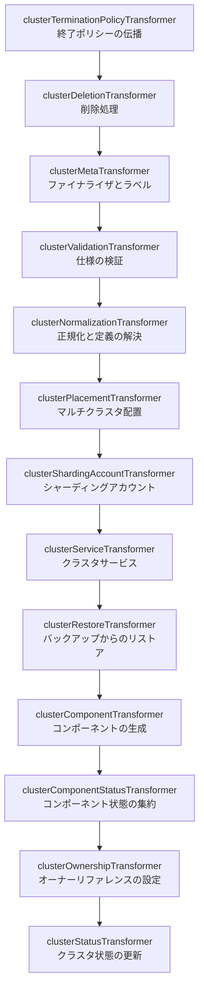

# 第8章 Cluster コントローラ: コンポーネントの編成

> 本章で読むソース:
>
> - [controllers/apps/cluster/cluster_controller.go L20-L184](https://github.com/apecloud/kubeblocks/blob/v1.0.2/controllers/apps/cluster/cluster_controller.go#L20-L184)
> - [controllers/apps/cluster/cluster_plan_builder.go L45-L425](https://github.com/apecloud/kubeblocks/blob/v1.0.2/controllers/apps/cluster/cluster_plan_builder.go#L45-L425)
> - [controllers/apps/cluster/transformer_cluster_init.go L29-L47](https://github.com/apecloud/kubeblocks/blob/v1.0.2/controllers/apps/cluster/transformer_cluster_init.go#L29-L47)
> - [controllers/apps/cluster/transformer_cluster_component.go L49-L1255](https://github.com/apecloud/kubeblocks/blob/v1.0.2/controllers/apps/cluster/transformer_cluster_component.go#L49-L1255)
> - [controllers/apps/cluster/transformer_cluster_deletion.go L43-L195](https://github.com/apecloud/kubeblocks/blob/v1.0.2/controllers/apps/cluster/transformer_cluster_deletion.go#L43-L195)
> - [controllers/apps/cluster/transformer_cluster_normalization.go L43-L721](https://github.com/apecloud/kubeblocks/blob/v1.0.2/controllers/apps/cluster/transformer_cluster_normalization.go#L43-L721)
> - [controllers/apps/cluster/transformer_cluster_status.go L33-L183](https://github.com/apecloud/kubeblocks/blob/v1.0.2/controllers/apps/cluster/transformer_cluster_status.go#L33-L183)

## この章の狙い

`Cluster` は KubeBlocks における最上位の CRD であり、ユーザーが作成するデータベースクラスタの全体像を表現する。
`Cluster` オブジェクトが投入されると、コントローラはそれを複数の `Component` オブジェクトに展開し、さらに各 `Component` が `InstanceSet` や `Service` といった下位リソースを生成する。
本章では `controllers/apps/cluster/` パッケージを読み、`Cluster` コントローラがどのようにトランスフォーマーの鎖を構成してコンポーネントを編成するかを明らかにする。

## 前提

- 第3章で `Cluster` と `Component` の CRD 構造を確認した。
- 第5章で `kubebuilderx` フレームワークのリコンシリエーションループを理解した。
- 第6章で graph エンジン（DAG、`PlanBuilder`、`Plan`）の仕組みを理解した。
- 第7章で builder パッケージによるリソース生成の共通インタフェースを確認した。

## 1. 3段階のリコンシリエーションモデル

`ClusterReconciler.Reconcile` は、Init・Build・Execute の3段階で構成される。

[controllers/apps/cluster/cluster_controller.go L84-L167](https://github.com/apecloud/kubeblocks/blob/v1.0.2/controllers/apps/cluster/cluster_controller.go#L84-L167)

```go
func (r *ClusterReconciler) Reconcile(ctx context.Context, req ctrl.Request) (ctrl.Result, error) {
    reqCtx := intctrlutil.RequestCtx{
        Ctx:      ctx,
        Req:      req,
        Log:      log.FromContext(ctx).WithValues("cluster", req.NamespacedName),
        Recorder: r.Recorder,
    }

    // the cluster reconciliation loop is a 3-stage model: plan Init, plan Build and plan Execute
    // Init stage
    planBuilder := newClusterPlanBuilder(reqCtx, r.Client)
    if err := planBuilder.Init(); err != nil {
        return intctrlutil.CheckedRequeueWithError(err, reqCtx.Log, "")
    }

    // ... (requeueError omitted)

    // Build stage
    plan, errBuild := planBuilder.
        AddTransformer(
            &clusterTerminationPolicyTransformer{},
            &clusterDeletionTransformer{},
            &clusterMetaTransformer{},
            &clusterValidationTransformer{},
            &clusterNormalizationTransformer{},
            &clusterPlacementTransformer{multiClusterMgr: r.MultiClusterMgr},
            &clusterShardingAccountTransformer{},
            &clusterServiceTransformer{},
            &clusterRestoreTransformer{},
            &clusterComponentTransformer{},
            &clusterComponentStatusTransformer{},
            &clusterOwnershipTransformer{},
            &clusterStatusTransformer{},
        ).
        Build()

    // Execute stage
    if errExec := plan.Execute(); errExec != nil {
        return requeueError(errExec)
    }
    if errBuild != nil {
        return requeueError(errBuild)
    }
    return intctrlutil.Reconciled()
}
```

Init 段階では `clusterPlanBuilder` を生成し、`clusterInitTransformer` を追加して `Cluster` オブジェクトを API サーバから取得する。
Build 段階では13種類のトランスフォーマーを鎖状に接続し、DAG を構築する。
Execute 段階では DAG を逆トポロジー順に走査して、各頂点の CRUD 操作を実行する。

注目すべきは、Build 段階でエラーが発生しても即座に中断せず、まず Execute で計画を実行してからエラーを処理する点である。
コメントにも「execute the plan first, delay error handling」とあるように、部分的に生成された DAG であっても可能な限り適用してから問題を報告する設計になっている。

## 2. 変換コンテキストとプランビルダ

`clusterTransformContext` は全トランスフォーマーが共有する状態である。

[controllers/apps/cluster/cluster_plan_builder.go L46-L67](https://github.com/apecloud/kubeblocks/blob/v1.0.2/controllers/apps/cluster/cluster_plan_builder.go#L46-L67)

```go
type clusterTransformContext struct {
    context.Context
    Client client.Reader
    record.EventRecorder
    logr.Logger

    Cluster     *appsv1.Cluster
    OrigCluster *appsv1.Cluster

    clusterDef    *appsv1.ClusterDefinition
    shardingDefs  map[string]*appsv1.ShardingDefinition
    componentDefs map[string]*appsv1.ComponentDefinition

    components []*appsv1.ClusterComponentSpec
    shardings  []*appsv1.ClusterSharding

    shardingComps map[string][]*appsv1.ClusterComponentSpec

    annotations map[string]map[string]string
}
```

`Cluster` は処理中に変更が加えられる作業用オブジェクト、`OrigCluster` は API サーバから取得した時点のオリジナルである。
この2つを分けて保持することで、トランスフォーマー鎖の終端で変更を比較し、パッチを生成できる。

`clusterPlanBuilder` は `graph.PlanBuilder` インタフェースの実装であり、トランスフォーマーの追加（`AddTransformer`）、DAG の構築（`Build`）、実行計画の生成（`Execute`）を担当する。

[controllers/apps/cluster/cluster_plan_builder.go L179-L214](https://github.com/apecloud/kubeblocks/blob/v1.0.2/controllers/apps/cluster/cluster_plan_builder.go#L179-L214)

```go
func (c *clusterPlanBuilder) Build() (graph.Plan, error) {
    var err error
    defer func() {
        if c.transCtx.Cluster.IsDeleting() {
            return
        }
        // ... set apply resource condition ...
        setApplyResourceCondition(&c.transCtx.Cluster.Status.Conditions, c.transCtx.Cluster.Generation, err)
        appsutil.SendWarningEventWithError(c.transCtx.GetRecorder(), c.transCtx.Cluster, ReasonApplyResourcesFailed, err)
    }()

    dag := graph.NewDAG()
    err = c.transformers.ApplyTo(c.transCtx, dag)
    c.transCtx.Logger.V(1).Info(fmt.Sprintf("DAG: %s", dag))

    plan := &clusterPlan{
        dag:      dag,
        walkFunc: c.defaultWalkFuncWithLogging,
        cli:      c.cli,
        transCtx: c.transCtx,
    }
    return plan, err
}
```

`transformers.ApplyTo` は各トランスフォーマーの `Transform` メソッドを順に呼び出し、それぞれが DAG に頂点を追加していく。
最終的に構築された DAG は `clusterPlan` として Execute 段階に渡される。

## 3. トランスフォーマー鎖の全体像

`Reconcile` メソッドに登録されている13個のトランスフォーマーは、以下の順序で実行される。



各トランスフォーマーは1つの責務だけを持つ。
削除処理、メタデータ管理、検証、正規化、配置、サービス、リストア、コンポーネント生成、状態集約、所有権設定、状態更新と、関心が明確に分離されている。

### 3.1 Init トランスフォーマー

`clusterInitTransformer` は `Init` 段階で追加され、`Cluster` オブジェクトを変換コンテキストに設定する。

[controllers/apps/cluster/transformer_cluster_init.go L35-L47](https://github.com/apecloud/kubeblocks/blob/v1.0.2/controllers/apps/cluster/transformer_cluster_init.go#L35-L47)

```go
func (t *clusterInitTransformer) Transform(ctx graph.TransformContext, dag *graph.DAG) error {
    transCtx, _ := ctx.(*clusterTransformContext)
    transCtx.Cluster, transCtx.OrigCluster = t.cluster, t.cluster.DeepCopy()
    graphCli, _ := transCtx.Client.(model.GraphClient)

    graphCli.Root(dag, transCtx.OrigCluster, transCtx.Cluster, model.ActionStatusPtr())

    if !intctrlutil.ObjectAPIVersionSupported(t.cluster) {
        return graph.ErrPrematureStop
    }
    return nil
}
```

`graphCli.Root` は DAG のルート頂点として `Cluster` オブジェクトを登録する。
アクションは `STATUS` であり、`Cluster` 自体は作成も更新もされず、状態の更新だけが許可される。
API バージョンがサポート対象外の場合は `ErrPrematureStop` を返して以降のトランスフォーマーをスキップする。

### 3.2 終了ポリシーと削除処理

`clusterTerminationPolicyTransformer` は、クラスタが削除中の場合に `TerminationPolicy` を全 `Component` に伝播する。

[controllers/apps/cluster/transformer_cluster_termination_policy.go L35-L63](https://github.com/apecloud/kubeblocks/blob/v1.0.2/controllers/apps/cluster/transformer_cluster_termination_policy.go#L35-L63)

```go
func (t *clusterTerminationPolicyTransformer) Transform(ctx graph.TransformContext, dag *graph.DAG) error {
    transCtx, _ := ctx.(*clusterTransformContext)
    cluster := transCtx.OrigCluster
    if !cluster.IsDeleting() {
        return nil
    }

    compList := &appsv1.ComponentList{}
    ml := client.MatchingLabels{constant.AppInstanceLabelKey: cluster.Name}
    if err := transCtx.Client.List(transCtx.Context, compList, client.InNamespace(cluster.Namespace), ml); err != nil {
        return err
    }

    hasUpdate := false
    graphCli, _ := transCtx.Client.(model.GraphClient)
    for i, comp := range compList.Items {
        if cluster.Spec.TerminationPolicy != comp.Spec.TerminationPolicy {
            hasUpdate = true
            obj := compList.Items[i].DeepCopy()
            obj.Spec.TerminationPolicy = cluster.Spec.TerminationPolicy
            graphCli.Update(dag, &compList.Items[i], obj)
        }
    }

    if hasUpdate {
        return graph.ErrPrematureStop
    }
    return nil
}
```

クラスタの `TerminationPolicy` が変更されてから削除に至る場合、このトランスフォーマーが先に全コンポーネントへポリシーを同期する。
`hasUpdate` が true の場合は `ErrPrematureStop` を返し、更新が API サーバに反映されるまで以降の処理を保留する。

`clusterDeletionTransformer` は削除中のクラスタについて、`TerminationPolicy` に応じてサブリーソースを整理する。

[controllers/apps/cluster/transformer_cluster_deletion.go L48-L152](https://github.com/apecloud/kubeblocks/blob/v1.0.2/controllers/apps/cluster/transformer_cluster_deletion.go#L48-L152)

```go
func (t *clusterDeletionTransformer) Transform(ctx graph.TransformContext, dag *graph.DAG) error {
    transCtx, _ := ctx.(*clusterTransformContext)
    cluster := transCtx.OrigCluster
    if !cluster.IsDeleting() {
        return nil
    }

    // ... (setup)

    var toDeleteNamespacedKinds, toDeleteNonNamespacedKinds []client.ObjectList
    switch cluster.Spec.TerminationPolicy {
    case appsv1.DoNotTerminate:
        transCtx.EventRecorder.Eventf(cluster, corev1.EventTypeWarning, "DoNotTerminate",
            "spec.terminationPolicy %s is preventing deletion.", cluster.Spec.TerminationPolicy)
        return graph.ErrPrematureStop
    case appsv1.Delete:
        toDeleteNamespacedKinds, toDeleteNonNamespacedKinds = kindsForDelete()
    case appsv1.WipeOut:
        toDeleteNamespacedKinds, toDeleteNonNamespacedKinds = kindsForWipeOut()
    }

    // firstly, delete components and shardings in the order that topology defined.
    deleteSet, err := deleteCompNShardingInOrder4Terminate(transCtx, dag)
    // ...
```

`DoNotTerminate` の場合は削除を拒否してイベントを発行する。
`Delete` の場合は `Component`、`Service`、`Secret` を削除対象とする。
`WipeOut` の場合はそれに加えて `Backup` も削除する。
いずれの場合も、まずトポロジーで定義された順序でコンポーネントとシャーディングを削除してから、残りのサブリーソースを削除する。

### 3.3 メタデータと検証

`clusterMetaTransformer` はファイナライザの追加と `ClusterDef` ラベルの設定を行う。

[controllers/apps/cluster/transformer_cluster_meta.go L33-L58](https://github.com/apecloud/kubeblocks/blob/v1.0.2/controllers/apps/cluster/transformer_cluster_meta.go#L33-L58)

```go
func (t *clusterMetaTransformer) Transform(ctx graph.TransformContext, dag *graph.DAG) error {
    transCtx, _ := ctx.(*clusterTransformContext)
    cluster := transCtx.Cluster

    if !controllerutil.ContainsFinalizer(cluster, constant.DBClusterFinalizerName) {
        controllerutil.AddFinalizer(cluster, constant.DBClusterFinalizerName)
    }

    labels := cluster.Labels
    if labels == nil {
        labels = map[string]string{}
    }
    cdLabelName := labels[constant.ClusterDefLabelKey]
    cdName := cluster.Spec.ClusterDef
    if cdLabelName == cdName {
        return nil
    }
    labels[constant.ClusterDefLabelKey] = cdName
    cluster.Labels = labels

    return nil
}
```

`clusterValidationTransformer` はクラスタ仕様の正当性を検証する。
`ClusterDefinition` の存在と可用性を確認し、トポロジーに矛盾がないかを検査する。
検証に失敗した場合は `ProvisioningStarted` Condition にエラーを記録してリキューする。

### 3.4 正規化による定義の解決

`clusterNormalizationTransformer` は、クラスタ仕様に含まれるコンポーネントとシャーディングについて、参照される `ComponentDefinition` と `ShardingDefinition` を実際に解決する。

[controllers/apps/cluster/transformer_cluster_normalization.go L48-L94](https://github.com/apecloud/kubeblocks/blob/v1.0.2/controllers/apps/cluster/transformer_cluster_normalization.go#L48-L94)

```go
func (t *clusterNormalizationTransformer) Transform(ctx graph.TransformContext, dag *graph.DAG) error {
    transCtx, _ := ctx.(*clusterTransformContext)
    cluster := transCtx.Cluster
    if transCtx.OrigCluster.IsDeleting() {
        return nil
    }

    var err error
    defer func() {
        setProvisioningStartedCondition(&cluster.Status.Conditions, cluster.Name, cluster.Generation, err)
    }()

    transCtx.components, transCtx.shardings, err = t.resolveCompsNShardings(transCtx)
    if err != nil {
        return err
    }

    if err = t.resolveDefinitions4Shardings(transCtx); err != nil {
        return err
    }

    if err = t.resolveDefinitions4Components(transCtx); err != nil {
        return err
    }

    // ... (CRD API version check, sharding comps build, postcheck, write-back)

    return nil
}
```

正規化の処理は以下の手順で進む。

1. トポロジーまたはユーザー指定からコンポーネントとシャーディングのリストを解決する。
2. 各シャーディングについて `ShardingDefinition` と `ComponentDefinition` を解決する。
3. 各コンポーネントについて `ComponentDefinition` とサービスバージョンを解決する。
4. シャーディング用のサブコンポーネント仕様を生成する。
5. 名前重複やシャード数上限の検証を行う。
6. 解決した定義名をクラスタ仕様に書き戻す。

`ComponentDefinition` の解決では、パターンマッチ（プレフィックスや正規表現）による名前照合と、`ComponentVersion` に基づくサービスバージョンの互換性チェックが行われる。
これにより、ユーザーは厳密な名前ではなくパターンで定義を参照できる。

## 4. コンポーネントトランスフォーマー

`clusterComponentTransformer` は本章の中心であり、クラスタのコンポーネント仕様を実際の `Component` オブジェクトに変換する。

### 4.1 早期スキップによる最適化

このトランスフォーマーは、全コンポーネントが最新の状態でクラスタが更新中でない場合、処理を完全にスキップする。

[controllers/apps/cluster/transformer_cluster_component.go L54-L71](https://github.com/apecloud/kubeblocks/blob/v1.0.2/controllers/apps/cluster/transformer_cluster_component.go#L54-L71)

```go
func (t *clusterComponentTransformer) Transform(ctx graph.TransformContext, dag *graph.DAG) error {
    transCtx, _ := ctx.(*clusterTransformContext)
    if transCtx.OrigCluster.IsDeleting() {
        return nil
    }

    updateToDate, err := checkAllCompsUpToDate(transCtx, transCtx.Cluster)
    if err != nil {
        return err
    }

    if !transCtx.OrigCluster.IsUpdating() && updateToDate {
        return nil
    }

    return t.transform(transCtx, dag)
}
```

`checkAllCompsUpToDate` は各 `Component` の `Generation` と `ObservedGeneration` を比較し、さらにアノテーションの `KubeBlocksGenerationKey` がクラスタの `Generation` と一致するかを確認する。

[controllers/apps/cluster/transformer_cluster_component.go L162-L181](https://github.com/apecloud/kubeblocks/blob/v1.0.2/controllers/apps/cluster/transformer_cluster_component.go#L162-L181)

```go
func checkAllCompsUpToDate(transCtx *clusterTransformContext, cluster *appsv1.Cluster) (bool, error) {
    compList := &appsv1.ComponentList{}
    labels := constant.GetClusterLabels(cluster.Name)
    if err := transCtx.Client.List(transCtx.Context, compList, client.InNamespace(cluster.Namespace), client.MatchingLabels(labels)); err != nil {
        return false, err
    }
    if len(compList.Items) != transCtx.total() {
        return false, nil
    }
    for _, comp := range compList.Items {
        generation, ok := comp.Annotations[constant.KubeBlocksGenerationKey]
        if !ok {
            return false, nil
        }
        if comp.Generation != comp.Status.ObservedGeneration || generation != strconv.FormatInt(cluster.Generation, 10) {
            return false, nil
        }
    }
    return true, nil
}
```

この早期リターンは、リコンシリエーションの cost を下げる仕組みである。
クラスタが安定状態で子リソースの変化によってトリガされた再リコンシリエーションでは、DAG の構築を飛ばして即座に完了できる。
結果として、状態の集約や Condition の更新だけが目的のリコンシリエーションでも、不要な変換処理を省略できる。

### 4.2 集合差分による CRUD の決定

`transform` メソッドは、実行中のコンポーネント集合（`runningSet`）と期待されるコンポーネント集合（`protoSet`）の差分を計算する。

[controllers/apps/cluster/transformer_cluster_component.go L73-L99](https://github.com/apecloud/kubeblocks/blob/v1.0.2/controllers/apps/cluster/transformer_cluster_component.go#L73-L99)

```go
func (t *clusterComponentTransformer) transform(transCtx *clusterTransformContext, dag *graph.DAG) error {
    runningSet, err := t.runningSet(transCtx)
    if err != nil {
        return err
    }
    protoSet := t.protoSet(transCtx)

    createSet, deleteSet, updateSet := setDiff(runningSet, protoSet)

    if err := deleteCompNShardingInOrder(transCtx, dag, deleteSet, pointer.Bool(true)); err != nil {
        return err
    }

    var delayedErr error
    if err := t.handleUpdate(transCtx, dag, updateSet); err != nil {
        if !ictrlutil.IsDelayedRequeueError(err) {
            return err
        }
        delayedErr = err
    }

    if err := t.handleCreate(transCtx, dag, createSet); err != nil {
        return err
    }

    return delayedErr
}
```

`setDiff` は2つの集合から作成・削除・更新の3つを算出する。

[controllers/apps/cluster/transformer_cluster_component.go L726-L728](https://github.com/apecloud/kubeblocks/blob/v1.0.2/controllers/apps/cluster/transformer_cluster_component.go#L726-L728)

```go
func setDiff(s1, s2 sets.Set[string]) (sets.Set[string], sets.Set[string], sets.Set[string]) {
    return s2.Difference(s1), s1.Difference(s2), s1.Intersection(s2)
}
```

処理順序は削除、更新、作成の順である。
削除を先に行うのは、名前衝突を避けるためである。

### 4.3 トポロジーに基づく順序制御

コンポーネントの作成・更新・削除は、トポロジーで定義された順序に従って実行される。
順序は `ClusterDefinition` の `topology.orders` で定義され、`provision`（作成時）、`terminate`（削除時）、`update`（更新時）の3種類がある。

[controllers/apps/cluster/transformer_cluster_component.go L305-L311](https://github.com/apecloud/kubeblocks/blob/v1.0.2/controllers/apps/cluster/transformer_cluster_component.go#L305-L311)

```go
func newCompNShardingHandler(transCtx *clusterTransformContext, op int) clusterConditionalHandler {
    topology, orders := definedOrders(transCtx, op)
    if len(orders) == 0 {
        return newParallelHandler(op)
    }
    return newOrderedHandler(topology, orders, op)
}
```

トポロジーに順序定義がない場合は `clusterParallelHandler` が使われ、全コンポーネントが並列に処理される。
順序定義がある場合は `orderedCreateNUpdateHandler` または `orderedDeleteHandler` が使われる。

順序付きハンドラは、前置コンポーネントの状態を確認しながら処理を進める。
作成・更新時には `phasePrecondition` により前置コンポーネントが `Running` または `Stopped` になるまで待機する。
削除時には `notExistPrecondition` により後置コンポーネントが先に削除されるまで待機する。

[controllers/apps/cluster/transformer_cluster_component.go L137-L160](https://github.com/apecloud/kubeblocks/blob/v1.0.2/controllers/apps/cluster/transformer_cluster_component.go#L137-L160)

```go
func handleCompNShardingInOrder(transCtx *clusterTransformContext, dag *graph.DAG, nameSet sets.Set[string], handler clusterConditionalHandler) error {
    orderedNames, err := handler.ordered(sets.List(nameSet))
    if err != nil {
        return err
    }
    unmatched := ""
    for _, name := range orderedNames {
        ok, err := handler.match(transCtx, dag, name)
        if err != nil {
            return err
        }
        if !ok {
            unmatched = name
            break
        }
        if err = handler.handle(transCtx, dag, name); err != nil {
            return err
        }
    }
    if len(unmatched) > 0 {
        return ictrlutil.NewDelayedRequeueError(0, fmt.Sprintf("retry later: %s are not ready", unmatched))
    }
    return nil
}
```

前置条件が満たされていない場合は `DelayedRequeueError` を返し、次のリコンシリエーションで再試行する。
これにより、データベースの起動順序（たとえばプロキシより先にデータベース本体を起動）が保証される。

### 4.4 コンポーネントオブジェクトの生成

個別のコンポーネント作成は `clusterComponentHandler.create` が担当する。

[controllers/apps/cluster/transformer_cluster_component.go L737-L748](https://github.com/apecloud/kubeblocks/blob/v1.0.2/controllers/apps/cluster/transformer_cluster_component.go#L737-L748)

```go
func (h *clusterComponentHandler) create(transCtx *clusterTransformContext, dag *graph.DAG, name string) error {
    proto, err := h.protoComp(transCtx, name, nil)
    if err != nil {
        return err
    }
    graphCli, _ := transCtx.Client.(model.GraphClient)
    graphCli.Create(dag, proto)

    return nil
}
```

`protoComp` は `buildComponentWrapper` を呼び、`Component` オブジェクトを構築する。
この中で `component.BuildComponent` による基本構築と `buildComponentSidecars` によるサイドカーの付与が行われる。

更新時は `copyAndMergeComponent` が既存オブジェクトと期待されるオブジェクトを比較し、差分だけをマージする。

[controllers/apps/cluster/transformer_cluster_component.go L186-L297](https://github.com/apecloud/kubeblocks/blob/v1.0.2/controllers/apps/cluster/transformer_cluster_component.go#L186-L297)

```go
func copyAndMergeComponent(oldCompObj, newCompObj *appsv1.Component) *appsv1.Component {
    compObjCopy := oldCompObj.DeepCopy()
    compProto := newCompObj

    // ... (normalizeQuantity, normalizeResourceList omitted)

    // Merge metadata
    ictrlutil.MergeMetadataMapInplace(compProto.Annotations, &compObjCopy.Annotations)
    ictrlutil.MergeMetadataMapInplace(compProto.Labels, &compObjCopy.Labels)

    // Merge all spec fields
    compObjCopy.Spec.TerminationPolicy = compProto.Spec.TerminationPolicy
    compObjCopy.Spec.CompDef = compProto.Spec.CompDef
    // ... (many fields omitted)
    compObjCopy.Spec.Resources = compProto.Spec.Resources

    metadataChanged := !reflect.DeepEqual(oldCompObj.Annotations, compObjCopy.Annotations) ||
        !reflect.DeepEqual(oldCompObj.Labels, compObjCopy.Labels)
    specChanged := !reflect.DeepEqual(normalize(oldCompObj.Spec), normalize(compObjCopy.Spec))

    if !metadataChanged && !specChanged {
        return nil
    }

    return compObjCopy
}
```

リソース量の正規化（`normalizeQuantity`）は、CPU の milli 値やメモリ量の表記揺れを吸収する。
これにより、API サーバ上で異なる内部表現に変換されても差分を検出できる。
変更がなければ `nil` を返し、不要な API 呼び出しを抑制する。

### 4.5 シャーディングの展開

シャーディングは複数の `Component` オブジェクトに展開される。
`clusterShardingHandler.create` は `shardingComps` に保持されたサブコンポーネントのリストを順に DAG へ追加する。

[controllers/apps/cluster/transformer_cluster_component.go L808-L825](https://github.com/apecloud/kubeblocks/blob/v1.0.2/controllers/apps/cluster/transformer_cluster_component.go#L808-L825)

```go
func (h *clusterShardingHandler) create(transCtx *clusterTransformContext, dag *graph.DAG, name string) error {
    protoComps, err := h.protoComps(transCtx, name, nil)
    if err != nil {
        return err
    }
    graphCli, _ := transCtx.Client.(model.GraphClient)
    for i := range protoComps {
        graphCli.Create(dag, protoComps[i])
    }

    return nil
}
```

シャーディングの更新では、実行中のサブコンポーネント集合と期待される集合の差分を `mapDiff` で計算し、削除・更新・作成を適用する。
スケールイン時には `ComponentScaleInAnnotationKey` アノテーションを付与して、下位レイヤにスケールインであることを通知する。

## 5. サービスとリストア

### 5.1 クラスタサービスの管理

`clusterServiceTransformer` は `Cluster.Spec.Services` に定義されたクラスタレベルの `Service` オブジェクトを管理する。

[controllers/apps/cluster/transformer_cluster_service.go L45-L81](https://github.com/apecloud/kubeblocks/blob/v1.0.2/controllers/apps/cluster/transformer_cluster_service.go#L45-L81)

```go
func (t *clusterServiceTransformer) Transform(ctx graph.TransformContext, dag *graph.DAG) error {
    transCtx, _ := ctx.(*clusterTransformContext)
    if transCtx.OrigCluster.IsDeleting() {
        return nil
    }
    if common.IsCompactMode(transCtx.OrigCluster.Annotations) {
        return nil
    }

    cluster := transCtx.Cluster
    graphCli, _ := transCtx.Client.(model.GraphClient)

    services, err := t.listOwnedClusterServices(transCtx, cluster)
    if err != nil {
        return err
    }

    protoServices, err := t.buildClusterServices(transCtx, cluster)
    if err != nil {
        return err
    }

    toCreateServices, toDeleteServices, toUpdateServices := mapDiff(services, protoServices)

    for svc := range toCreateServices {
        graphCli.Create(dag, protoServices[svc], appsutil.InDataContext4G())
    }
    for svc := range toUpdateServices {
        t.updateService(dag, graphCli, services[svc], protoServices[svc])
    }
    for svc := range toDeleteServices {
        graphCli.Delete(dag, services[svc], appsutil.InDataContext4G())
    }
    return nil
}
```

クラスタサービスはコンポーネントセレクタやロールセレクタを使って、特定のコンポーネントやロールのポッドにトラフィックをルーティングする。
`RoleSelector` が指定された場合は `ComponentDefinition` に定義されたロールの存在を検証する。

### 5.2 リストア処理

`clusterRestoreTransformer` は `RestoreFromBackupAnnotationKey` アノテーションを解釈し、バックアップからのデータリストアを各コンポーネントに割り当てる。
シャーディングクラスタの場合、各シャードコンポーネントに対してソースターゲットを分配する。

## 6. 状態の集約

### 6.1 コンポーネント状態の集約

`clusterComponentStatusTransformer` は、クラスタ配下の全 `Component` オブジェクトの状態を集約して `Cluster.Status.Components` に書き込む。

[controllers/apps/cluster/transformer_cluster_component_status.go L48-L66](https://github.com/apecloud/kubeblocks/blob/v1.0.2/controllers/apps/cluster/transformer_cluster_component_status.go#L48-L66)

```go
func (t *clusterComponentStatusTransformer) Transform(ctx graph.TransformContext, dag *graph.DAG) error {
    transCtx, _ := ctx.(*clusterTransformContext)
    if transCtx.OrigCluster.IsDeleting() {
        return nil
    }
    return t.transform(transCtx)
}
```

各コンポーネントについて、`Phase`、`Message`、`ObservedGeneration`、`UpToDate` を収集する。
シャーディングの場合は複数のサブコンポーネントの状態を `composeClusterPhase` で合成する。

### 6.2 クラスタフェーズの合成

`clusterStatusTransformer` は `Cluster.Status.Components` と `Cluster.Status.Shardings` からクラスタ全体のフェーズを導出する。

[controllers/apps/cluster/transformer_cluster_status.go L117-L183](https://github.com/apecloud/kubeblocks/blob/v1.0.2/controllers/apps/cluster/transformer_cluster_status.go#L117-L183)

```go
func composeClusterPhase(statusList []appsv1.ClusterComponentStatus) appsv1.ClusterPhase {
    var (
        isAllComponentCreating         = true
        isAllComponentWorking          = true
        hasComponentStarting           = false
        hasComponentStopping           = false
        isAllComponentStopped          = true
        isAllComponentFailed           = true
        isAllComponentRunningOrStopped = true
    )
    // ... (phase checks omitted)

    switch {
    case isAllComponentStopped:
        return appsv1.StoppedClusterPhase
    case isAllComponentRunningOrStopped:
        return appsv1.RunningClusterPhase
    case isAllComponentCreating:
        return appsv1.CreatingClusterPhase
    case isAllComponentWorking || hasComponentStarting:
        return appsv1.UpdatingClusterPhase
    case hasComponentStopping:
        return appsv1.StoppingClusterPhase
    case isAllComponentFailed:
        return appsv1.FailedClusterPhase
    case hasComponentFailed:
        return appsv1.AbnormalClusterPhase
    default:
        return ""
    }
}
```

クラスタのフェーズは各コンポーネントのフェーズから合成される。
全コンポーネントが `Running` か `Stopped` なら `Running`、全コンポーネントが `Creating` なら `Creating`、どれか1つでも `Failed` なら `Abnormal` となる。
この合成ロジックにより、クラスタ全体の健全性を1つの値で表現できる。

## 7. 実行計画の適用

`clusterPlan.Execute` は DAG を逆トポロジー順に走査し、各頂点の操作を実行する。

[controllers/apps/cluster/cluster_plan_builder.go L218-L226](https://github.com/apecloud/kubeblocks/blob/v1.0.2/controllers/apps/cluster/cluster_plan_builder.go#L218-L226)

```go
func (p *clusterPlan) Execute() error {
    err := p.dag.WalkReverseTopoOrder(p.walkFunc, nil)
    if err != nil {
        if hErr := p.handlePlanExecutionError(err); hErr != nil {
            return hErr
        }
    }
    return err
}
```

`defaultWalkFunc` は各 `ObjectVertex` のアクション（`CREATE`、`UPDATE`、`PATCH`、`DELETE`、`STATUS`）に応じて適切な API 呼び出しを行う。
`Cluster` オブジェクト自体は特別扱いされ、`STATUS` アクションのみが許可される。

[controllers/apps/cluster/cluster_plan_builder.go L287-L303](https://github.com/apecloud/kubeblocks/blob/v1.0.2/controllers/apps/cluster/cluster_plan_builder.go#L287-L303)

```go
func (c *clusterPlanBuilder) reconcileCluster(node *model.ObjectVertex) error {
    cluster := node.Obj.(*appsv1.Cluster).DeepCopy()
    origCluster := node.OriObj.(*appsv1.Cluster)
    switch *node.Action {
    case model.STATUS:
        if !reflect.DeepEqual(cluster.ObjectMeta, origCluster.ObjectMeta) || !reflect.DeepEqual(cluster.Spec, origCluster.Spec) {
            patch := client.MergeFrom(origCluster.DeepCopy())
            if err := c.cli.Patch(c.transCtx.Context, cluster, patch); err != nil {
                return err
            }
        }
    case model.CREATE, model.UPDATE:
        return fmt.Errorf("cluster can't be created or updated: %s", cluster.Name)
    }
    return nil
}
```

`Cluster` が作成や更新の対象にならないことは、`Cluster` がユーザーによって直接管理されるオブジェクトであることを反映している。
コントローラが変更するのは状態（`Status`）とメタデータ（`Finalizer`、`Labels`）だけである。

## まとめ

`Cluster` コントローラは、13個のトランスフォーマーを鎖状に接続して DAG を構築し、逆トポロジー順に実行する3段階モデルでリコンシリエーションを行う。
各トランスフォーマーは終了ポリシーの伝播、メタデータ管理、検証、正規化、配置、サービス管理、リストア、コンポーネント生成、状態集約、所有権設定と、単一の責務を持つ。
コンポーネントの生成では、集合差分による CRUD の決定と、トポロジーに基づく順序制御によって、データベースの起動順序や依存関係を正しく扱う。
全コンポーネントが最新のときは変換処理を完全にスキップする早期リターンにより、安定状態でのリコンシリエーションコストを抑制する。

## 関連する章

- 第3章 [Cluster と Component の仕様](../part00-crd-overview/03-cluster-and-component.md): `Cluster` と `Component` の CRD 構造
- 第6章 [graph エンジン: DAG による変換パイプライン](../part01-controller-base/06-graph-engine.md): DAG と `PlanBuilder` の仕組み
- 第7章 [builder: リソース生成の統一インタフェース](../part01-controller-base/07-builder.md): `ServiceBuilder` 等のビルダ
- 第9章 [Component コントローラ: ワークロードの生成](09-component-controller.md): `Component` コントローラによる `InstanceSet` の生成
