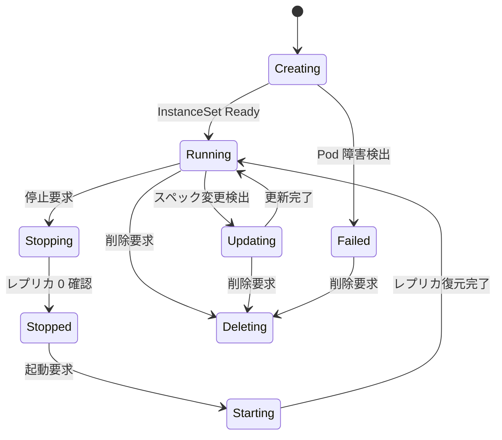

# 第9章 Component コントローラ: ワークロードの生成

> 本章で読むソース:
>
> - [controllers/apps/component/component_controller.go L50-L194](https://github.com/apecloud/kubeblocks/blob/v1.0.2/controllers/apps/component/component_controller.go#L50-L194)
> - [controllers/apps/component/component_plan_builder.go L42-L246](https://github.com/apecloud/kubeblocks/blob/v1.0.2/controllers/apps/component/component_plan_builder.go#L42-L246)
> - [controllers/apps/component/transformer_component_init.go L29-L47](https://github.com/apecloud/kubeblocks/blob/v1.0.2/controllers/apps/component/transformer_component_init.go#L29-L47)
> - [controllers/apps/component/transformer_component_load_resources.go L38-L113](https://github.com/apecloud/kubeblocks/blob/v1.0.2/controllers/apps/component/transformer_component_load_resources.go#L38-L113)
> - [controllers/apps/component/transformer_component_workload.go L51-L100](https://github.com/apecloud/kubeblocks/blob/v1.0.2/controllers/apps/component/transformer_component_workload.go#L51-L100)
> - [controllers/apps/component/transformer_component_workload.go L319-L438](https://github.com/apecloud/kubeblocks/blob/v1.0.2/controllers/apps/component/transformer_component_workload.go#L319-L438)
> - [controllers/apps/component/transformer_component_service.go L54-L98](https://github.com/apecloud/kubeblocks/blob/v1.0.2/controllers/apps/component/transformer_component_service.go#L54-L98)
> - [controllers/apps/component/transformer_component_status.go L54-L102](https://github.com/apecloud/kubeblocks/blob/v1.0.2/controllers/apps/component/transformer_component_status.go#L54-L102)
> - [controllers/apps/component/transformer_component_deletion.go L44-L157](https://github.com/apecloud/kubeblocks/blob/v1.0.2/controllers/apps/component/transformer_component_deletion.go#L44-L157)

## この章の狙い

`Component` コントローラは、KubeBlocks がデータベースクラスタを構成する各コンポーネントの実体リソースを生成する中核である。
`Cluster` コントローラが `Component` オブジェクトを作成するところから始まり、Component コントローラはその `Component` を入力として `InstanceSet`、`Service`、`ConfigMap`、`Secret` といった Kubernetes リソースを实际に構築する。
本章では 18種のトランスフォーマーが直列に並ぶ変換パイプラインを読み、`Component` の仕様から実行時ワークロードがどのように合成されるかを明らかにする。

## 前提

- 第5章の `kubebuilderx` フレームワークと、第6章の graph エンジン（DAG 変換パイプライン）の仕組みを理解していること。
- 第7章の builder パッケージが提供するリソース生成インタフェースの概要を把握していること。
- 第8章の `Cluster` コントローラが `Component` オブジェクトを生成する流れを理解していること。

## 1. コントローラのエントリポイント

`ComponentReconciler` は `Component` オブジェクトを監視する Reconciler である。

controllers/apps/component/component_controller.go L50-L55

```go
type ComponentReconciler struct {
    client.Client
    Scheme   *runtime.Scheme
    Recorder record.EventRecorder
}
```

`Reconcile` メソッドは `componentPlanBuilder` を生成し、トランスフォーマーチェーンを登録して `Build` と `Execute` を実行する。

controllers/apps/component/component_controller.go L110-L193

```go
func (r *ComponentReconciler) Reconcile(ctx context.Context, req ctrl.Request) (ctrl.Result, error) {
    reqCtx := intctrlutil.RequestCtx{
        Ctx:      ctx,
        Req:      req,
        Log:      log.FromContext(ctx).WithValues("component", req.NamespacedName),
        Recorder: r.Recorder,
    }

    reqCtx.Log.V(1).Info("reconcile", "component", req.NamespacedName)

    planBuilder := newComponentPlanBuilder(reqCtx, r.Client)
    if err := planBuilder.Init(); err != nil {
        return intctrlutil.CheckedRequeueWithError(err, reqCtx.Log, "")
    }

    // ... (中略) ...

    plan, errBuild := planBuilder.
        AddTransformer(
            &componentPreTerminateTransformer{},
            &componentDeletionTransformer{},
            &componentMetaTransformer{},
            &componentLoadResourcesTransformer{},
            &componentValidationTransformer{},
            &componentMonitorContainerTransformer{},
            &componentHostNetworkTransformer{},
            &componentServiceTransformer{},
            &componentAccountTransformer{},
            &componentTLSTransformer{},
            &componentVarsTransformer{},
            &componentAccountProvisionTransformer{},
            &componentFileTemplateTransformer{},
            &componentReloadSidecarTransformer{Client: r.Client},
            &componentRestoreTransformer{Client: r.Client},
            &componentRBACTransformer{},
            &componentWorkloadTransformer{Client: r.Client},
            &componentPostProvisionTransformer{},
            &componentStatusTransformer{Client: r.Client},
            &componentNotifierTransformer{},
        ).Build()

    if errExec := plan.Execute(); errExec != nil {
        return requeueError(errExec)
    }
    if errBuild != nil {
        return requeueError(errBuild)
    }
    return intctrlutil.Reconciled()
}
```

`Reconcile` の流れは次の3段階である。

1. `newComponentPlanBuilder` でビルダを生成し、`Init` で `Component` オブジェクトを API サーバから取得する。
2. `AddTransformer` で 20種のトランスフォーマーを登録し、`Build` で DAG を構築する。
3. `plan.Execute` で DAG を逆トポロジー順に走査し、Kubernetes API へリソース操作を投入する。

注目すべきは、`errBuild` と `errExec` を分けて処理している点である。
Build 段階でエラーがあっても Execute を先に実行し、部分成功した DAG の操作を確定させてからエラーを返す。
これにより、トランスフォーマーチェーンの途中で失敗しても、それ之前に変換されたリソース操作は確実に適用される。

## 2. トランスフォーマーチェーンの全体像

登録されるトランスフォーマーは、`Component` のライフサイクルを段階的に構築する。

```mermaid
flowchart TD
    A["Init<br/>Component の取得"] --> B["PreTerminate<br/>削除前ライフサイクルアクション"]
    B --> C["Deletion<br/>削除処理の分岐"]
    C --> D["Meta<br/>Finalizer とラベルの設定"]
    D --> E["LoadResources<br/>CompDef の読み込みと合成"]
    E --> F["Validation<br/>レプリカ数の検証"]
    F --> G["MonitorContainer<br/>モニタリング用サイドカー"]
    G --> H["HostNetwork<br/>ホストネットワークポート割当"]
    H --> I["Service<br/>コンポーネントサービスの生成"]
    I --> J["Account<br/>システムアカウントの準備"]
    J --> K["TLS<br/>TLS 証明書の設定"]
    K --> L["Vars<br/>環境変数とテンプレート変数の解決"]
    L --> M["AccountProvision<br/>アカウントのプロビジョニング"]
    M --> N["FileTemplate<br/>設定ファイルテンプレートのレンダリング"]
    N --> O["ReloadSidecar<br/>設定リロード用サイドカー"]
    O --> P["Restore<br/>バックアップからのリストア"]
    P --> Q["RBAC<br/>ServiceAccount とロールバインディング"]
    Q --> R["Workload<br/>InstanceSet の生成"]
    R --> S["PostProvision<br/>プロビジョニング後アクション"]
    S --> T["Status<br/>コンポーネントステータスの更新"]
    T --> U["Notifier<br/>依存コンポーネントへの通知"]
```



各トランスフォーマーは `graph.Transformer` インタフェースを実装し、`Transform` メソッドで DAG に頂点（Vertex）を追加する。
チェーンの順序には依存関係がある。
例えば `Vars` トランスフォーマーは `LoadResources` が合成した `SynthesizedComponent` を必要とし、`Workload` トランスフォーマーは `RBAC` が設定した `ServiceAccount` を参照する。

### 2.1 Init 段階

`componentPlanBuilder.Init` は API サーバから `Component` オブジェクトを取得し、`componentTransformContext` に格納する。

controllers/apps/component/component_plan_builder.go L91-L101

```go
func (c *componentPlanBuilder) Init() error {
    comp := &appsv1.Component{}
    if err := c.cli.Get(c.transCtx.Context, c.req.NamespacedName, comp); err != nil {
        return err
    }

    c.transCtx.Component = comp
    c.transCtx.ComponentOrig = comp.DeepCopy()
    c.transformers = append(c.transformers, &componentInitTransformer{})
    return nil
}
```

`ComponentOrig` は DeepCopy で保持される。
これはトランスフォーマーが `Component` を変更した際、元の状態との差分を検出するために使われる。

`componentInitTransformer` は DAG のルート頂点を追加し、配置（placement）コンテキストを初期化する。

controllers/apps/component/transformer_component_init.go L33-L47

```go
func (t *componentInitTransformer) Transform(ctx graph.TransformContext, dag *graph.DAG) error {
    transCtx, _ := ctx.(*componentTransformContext)

    rootVertex := &model.ObjectVertex{Obj: transCtx.Component, OriObj: transCtx.ComponentOrig, Action: model.ActionStatusPtr()}
    dag.AddVertex(rootVertex)

    transCtx.Context = appsutil.IntoContext(transCtx.Context, appsutil.Placement(transCtx.Component))

    if !intctrlutil.ObjectAPIVersionSupported(transCtx.Component) {
        return graph.ErrPrematureStop
    }
    return nil
}
```

`ErrPrematureStop` を返すと、以降のトランスフォーマーはスキップされ、DAG の Execute 段階へ直接移行する。
API バージョンが古い `Component` オブジェクトに対して、安全に早期リターンするための仕組みである。

### 2.2 リソースの読み込みと合成

`componentLoadResourcesTransformer` は参照される `ComponentDefinition` を取得し、`SynthesizedComponent` を構築する。

controllers/apps/component/transformer_component_load_resources.go L54-L83

```go
func (t *componentLoadResourcesTransformer) transformForNativeComponent(transCtx *componentTransformContext) error {
    var (
        ctx  = transCtx.Context
        cli  = transCtx.Client
        comp = transCtx.Component
    )
    compDef, err := getNCheckCompDefinition(ctx, cli, comp.Spec.CompDef)
    if err != nil {
        return intctrlutil.NewRequeueError(appsutil.RequeueDuration, err.Error())
    }
    if err = component.UpdateCompDefinitionImages4ServiceVersion(ctx, cli, compDef, comp.Spec.ServiceVersion); err != nil {
        return intctrlutil.NewRequeueError(appsutil.RequeueDuration, err.Error())
    }
    transCtx.CompDef = compDef

    synthesizedComp, err := component.BuildSynthesizedComponent(ctx, transCtx.Client, compDef, comp)
    if err != nil {
        message := fmt.Sprintf("build synthesized component for %s failed: %s", comp.Name, err.Error())
        return intctrlutil.NewRequeueError(appsutil.RequeueDuration, message)
    }
    transCtx.SynthesizeComponent = synthesizedComp

    runningITS, err := t.runningInstanceSetObject(transCtx, synthesizedComp)
    if err != nil {
        return err
    }
    transCtx.RunningWorkload = runningITS

    return nil
}
```

このトランスフォーマーは3つの重要な処理を行う。

1. `getNCheckCompDefinition` で `ComponentDefinition` の世代と可用性を検証する。
2. `BuildSynthesizedComponent` で `ComponentDefinition` と `Component` から `SynthesizedComponent` を合成する。
3. `runningInstanceSetObject` で既存の `InstanceSet` を取得する。

`SynthesizedComponent` は以降の全トランスフォーマーが共有する中間表現である。
`ComponentDefinition` が定義するコンテナ仕様、ライフサイクルアクション、環境変数、ボリュームテンプレートなどが、`Component` のレプリカ数やサービス設定と統合される。

`getNCheckCompDefinition` は `ComponentDefinition` の `ObservedGeneration` と `Phase` を確認し、参照先が最新かつ利用可能であることを保証する。

controllers/apps/component/transformer_component_load_resources.go L85-L100

```go
func getNCheckCompDefinition(ctx context.Context, cli client.Reader, name string) (*appsv1.ComponentDefinition, error) {
    compKey := types.NamespacedName{
        Name: name,
    }
    compDef := &appsv1.ComponentDefinition{}
    if err := cli.Get(ctx, compKey, compDef); err != nil {
        return nil, err
    }
    if compDef.Generation != compDef.Status.ObservedGeneration {
        return nil, fmt.Errorf("the referenced ComponentDefinition is not up to date: %s", compDef.Name)
    }
    if compDef.Status.Phase != appsv1.AvailablePhase {
        return nil, fmt.Errorf("the referenced ComponentDefinition is unavailable: %s", compDef.Name)
    }
    return compDef, nil
}
```

世代が一致しない場合や `Available` 以外の状態の場合は `RequeueError` を返し、後続のリコンシリエーションで再試行する。

## 3. ワークロードトランスフォーマー

`componentWorkloadTransformer` は本章の核心である。
このトランスフォーマーは `SynthesizedComponent` から `InstanceSet` オブジェクトを生成し、DAG 経由で作成または更新する。

controllers/apps/component/transformer_component_workload.go L51-L100

```go
type componentWorkloadTransformer struct {
    client.Client
}

func (t *componentWorkloadTransformer) Transform(ctx graph.TransformContext, dag *graph.DAG) error {
    transCtx, _ := ctx.(*componentTransformContext)
    if isCompDeleting(transCtx.ComponentOrig) {
        return nil
    }

    compDef := transCtx.CompDef
    comp := transCtx.Component
    synthesizeComp := transCtx.SynthesizeComponent

    var runningITS *workloads.InstanceSet
    if transCtx.RunningWorkload != nil {
        runningITS = transCtx.RunningWorkload.(*workloads.InstanceSet)
    }

    protoITS, err := factory.BuildInstanceSet(synthesizeComp, compDef)
    if err != nil {
        return err
    }
    transCtx.ProtoWorkload = protoITS

    if err = t.reconcileWorkload(transCtx.Context, t.Client, synthesizeComp, comp, runningITS, protoITS); err != nil {
        return err
    }

    graphCli, _ := transCtx.Client.(model.GraphClient)
    if runningITS == nil {
        if protoITS != nil {
            if err := setCompOwnershipNFinalizer(comp, protoITS); err != nil {
                return err
            }
            graphCli.Create(dag, protoITS)
            return nil
        }
    } else {
        if protoITS == nil {
            graphCli.Delete(dag, runningITS)
        } else {
            err = t.handleUpdate(transCtx, graphCli, dag, synthesizeComp, comp, runningITS, protoITS)
        }
    }
    return err
}
```

処理は3つの分岐に分かれる。

1. **新規作成**: `runningITS` が nil（既存ワークロードなし）の場合、`protoITS` を DAG に Create 頂点として追加する。
2. **削除**: `protoITS` が nil（ワークロード不要）の場合、`runningITS` を DAG に Delete 頂点として追加する。
3. **更新**: 両方が存在する場合、`handleUpdate` で差分を計算し、必要に応じて Update 頂点を追加する。

`factory.BuildInstanceSet` は `SynthesizedComponent` と `ComponentDefinition` から `InstanceSet` オブジェクトを構築する。
この関数は Pod テンプレート、ボリュームクレームテンプレート、ロール定義、メンバーシップ設定などを統合する。

### 3.1 ワークロードの更新と差分マージ

`handleUpdate` は既存の `InstanceSet` と newly-built の `InstanceSet` を比較し、必要な変更だけを適用する。

controllers/apps/component/transformer_component_workload.go L170-L200

```go
func (t *componentWorkloadTransformer) handleUpdate(transCtx *componentTransformContext, cli model.GraphClient, dag *graph.DAG,
    synthesizedComp *component.SynthesizedComponent, comp *appsv1.Component, runningITS, protoITS *workloads.InstanceSet) error {
    start, stop, err := t.handleWorkloadStartNStop(transCtx, synthesizedComp, runningITS, &protoITS)
    if err != nil {
        return err
    }

    if !(start || stop) {
        if err := t.handleWorkloadUpdate(transCtx, dag, synthesizedComp, comp, runningITS, protoITS); err != nil {
            return err
        }
    }

    objCopy := copyAndMergeITS(runningITS, protoITS)
    if objCopy != nil {
        cli.Update(dag, nil, objCopy, &model.ReplaceIfExistingOption{})
        cli.DependOn(dag, &corev1.ConfigMap{
            ObjectMeta: metav1.ObjectMeta{
                Namespace: synthesizedComp.Namespace,
                Name:      constant.GenerateClusterComponentEnvPattern(synthesizeComp.ClusterName, synthesizedComp.Name),
            },
        })
    }

    return nil
}
```

`handleWorkloadStartNStop` はコンポーネントの停止と起動を処理する。
停止時はレプリカ数を 0 にし、起動時は保存しておいたレプリカ数を復元する。
`handleWorkloadUpdate` はボリューム拡張、水平スケーリング、再設定の各操作を実行する。

`copyAndMergeITS` は2つの `InstanceSet` を比較し、差分がある場合のみ更新オブジェクトを返す。

controllers/apps/component/transformer_component_workload.go L322-L384

```go
func copyAndMergeITS(oldITS, newITS *workloads.InstanceSet) *workloads.InstanceSet {
    itsObjCopy := oldITS.DeepCopy()
    itsProto := newITS

    checkNRollbackProtoImages(itsObjCopy, itsProto)

    if len(itsObjCopy.Annotations) > 0 {
        maps.DeleteFunc(itsObjCopy.Annotations, func(k, v string) bool {
            return strings.HasPrefix(k, "monitor.kubeblocks.io")
        })
    }
    intctrlutil.MergeMetadataMapInplace(itsProto.Annotations, &itsObjCopy.Annotations)
    intctrlutil.MergeMetadataMapInplace(itsProto.Labels, &itsObjCopy.Labels)
    intctrlutil.MergeMetadataMapInplace(itsProto.Spec.Template.Annotations, &itsObjCopy.Spec.Template.Annotations)
    podTemplateCopy := *itsProto.Spec.Template.DeepCopy()
    podTemplateCopy.Annotations = itsObjCopy.Spec.Template.Annotations

    itsObjCopy.Spec.Template = podTemplateCopy
    itsObjCopy.Spec.Replicas = itsProto.Spec.Replicas
    itsObjCopy.Spec.Roles = itsProto.Spec.Roles
    itsObjCopy.Spec.MembershipReconfiguration = itsProto.Spec.MembershipReconfiguration
    // ... (中略) ...
    itsObjCopy.Spec.VolumeClaimTemplates = itsProto.Spec.VolumeClaimTemplates
    itsObjCopy.Spec.PersistentVolumeClaimRetentionPolicy = itsProto.Spec.PersistentVolumeClaimRetentionPolicy
    // ... (中略) ...

    intctrlutil.ResolvePodSpecDefaultFields(oldITS.Spec.Template.Spec, &itsObjCopy.Spec.Template.Spec)

    isSpecUpdated := !reflect.DeepEqual(&oldITS.Spec, &itsObjCopy.Spec)
    isLabelsUpdated := !reflect.DeepEqual(oldITS.Labels, itsObjCopy.Labels)
    isAnnotationsUpdated := !reflect.DeepEqual(oldITS.Annotations, itsObjCopy.Annotations)
    if !isSpecUpdated && !isLabelsUpdated && !isAnnotationsUpdated {
        return nil
    }
    return itsObjCopy
}
```

この関数はフィールドごとに明示的にマージを行う。
全フィールドをコピーするのではなく、更新可能なフィールドを選択的に上書きする。
最後に `reflect.DeepEqual` で差分を検出し、変更がない場合は nil を返して API 呼び出しを回避する。

### 3.2 最適化: イメージのロールバック機構

`copyAndMergeITS` の冒頭で呼ばれる `checkNRollbackProtoImages` は、不要なイメージ更新を防ぐ仕組みである。

controllers/apps/component/transformer_component_workload.go L386-L438

```go
func checkNRollbackProtoImages(itsObj, itsProto *workloads.InstanceSet) {
    if itsObj.Annotations == nil || itsProto.Annotations == nil {
        return
    }

    annotationUpdated := func(key string) bool {
        using, ok1 := itsObj.Annotations[key]
        proto, ok2 := itsProto.Annotations[key]
        if !ok1 || !ok2 {
            return true
        }
        if len(using) == 0 || len(proto) == 0 {
            return true
        }
        return using != proto
    }

    compDefUpdated := func() bool {
        return annotationUpdated(constant.AppComponentLabelKey)
    }

    serviceVersionUpdated := func() bool {
        return annotationUpdated(constant.KBAppServiceVersionKey)
    }

    if compDefUpdated() || serviceVersionUpdated() {
        return
    }

    images := make([]map[string]string, 2)
    for i, cc := range [][]corev1.Container{itsObj.Spec.Template.Spec.InitContainers, itsObj.Spec.Template.Spec.Containers} {
        images[i] = make(map[string]string)
        for _, c := range cc {
            if component.IsKBAgentContainer(&c) {
                continue
            }
            images[i][c.Name] = c.Image
        }
    }
    rollback := func(idx int, c *corev1.Container) {
        if image, ok := images[idx][c.Name]; ok {
            c.Image = image
        }
    }
    for i := range itsProto.Spec.Template.Spec.InitContainers {
        rollback(0, &itsProto.Spec.Template.Spec.InitContainers[i])
    }
    for i := range itsProto.Spec.Template.Spec.Containers {
        rollback(1, &itsProto.Spec.Template.Spec.Containers[i])
    }
}
```

`ComponentDefinition` と `ServiceVersion` のアノテーションが変更されていない場合、proto のイメージを running のイメージに書き戻す。
これにより、レジストリ設定の変更などでイメージタグが再解決されても、定義が更新されない限りワークロードのローリングアップデートが発生しない。
意図しない Pod の再起動を防ぎ、データベースの可用性を維持する効果がある。

## 4. サービスの生成

`componentServiceTransformer` は `SynthesizedComponent` に定義された `ComponentService` から Kubernetes `Service` オブジェクトを生成する。

controllers/apps/component/transformer_component_service.go L59-L98

```go
func (t *componentServiceTransformer) Transform(ctx graph.TransformContext, dag *graph.DAG) error {
    transCtx, _ := ctx.(*componentTransformContext)
    if isCompDeleting(transCtx.ComponentOrig) {
        return nil
    }
    if common.IsCompactMode(transCtx.ComponentOrig.Annotations) {
        transCtx.V(1).Info("Component is in compact mode, no need to create service related objects", "component", client.ObjectKeyFromObject(transCtx.ComponentOrig))
        return nil
    }

    synthesizeComp := transCtx.SynthesizeComponent
    runningServices, err := t.listOwnedServices(transCtx.Context, transCtx.Client, transCtx.Component, synthesizeComp)
    if err != nil {
        return err
    }

    graphCli, _ := transCtx.Client.(model.GraphClient)
    for _, service := range synthesizeComp.ComponentServices {
        if t.skipDefaultHeadlessSvc(synthesizeComp, &service) {
            continue
        }
        services, err := t.buildCompService(transCtx.Component, synthesizeComp, &service)
        if err != nil {
            return err
        }
        for _, svc := range services {
            if err = t.createOrUpdateService(ctx, dag, graphCli, &service, svc, transCtx.ComponentOrig); err != nil {
                return err
            }
            delete(runningServices, svc.Name)
        }
    }

    for svc := range runningServices {
        graphCli.Delete(dag, runningServices[svc], appsutil.InDataContext4G())
    }

    return nil
}
```

このトランスフォーマーは2種類のサービスを生成する。

1. **通常サービス**: `ComponentService` の定義から `ServiceBuilder` を通じて `Service` オブジェクトを構築する。
2. **Pod 単位サービス**: `PodService` フラグが true の場合、各 Pod に対応する個別の `Service` を生成する。

デフォルトの Headless サービスは `InstanceSet` コントローラが管理するため、ここではスキップされる。
既存のサービスから不要になったものを検出し、DAG に Delete 頂点として追加する処理も含まれている。

## 5. ステータスの管理

`componentStatusTransformer` は `InstanceSet` の状態を読み取り、`Component` のステータスを更新する。

controllers/apps/component/transformer_component_status.go L70-L102

```go
func (t *componentStatusTransformer) Transform(ctx graph.TransformContext, dag *graph.DAG) error {
    transCtx, _ := ctx.(*componentTransformContext)
    if isCompDeleting(transCtx.ComponentOrig) {
        return nil
    }

    comp := transCtx.Component
    if transCtx.RunningWorkload == nil {
        transCtx.Logger.Info(fmt.Sprintf("skip reconcile status because underlying workload not found, generation: %d", comp.Generation))
        return nil
    }

    t.init(transCtx, dag)

    workloadGeneration, err := t.workloadGeneration()
    if err != nil {
        return err
    }
    if workloadGeneration == nil || *workloadGeneration >= comp.Status.ObservedGeneration {
        if err = t.reconcileStatus(transCtx); err != nil {
            return err
        }
        if workloadGeneration != nil {
            comp.Status.ObservedGeneration = *workloadGeneration
        }
    }

    graphCli, _ := transCtx.Client.(model.GraphClient)
    if v := graphCli.FindMatchedVertex(dag, comp); v == nil {
        graphCli.Status(dag, transCtx.ComponentOrig, comp)
    }
    return nil
}
```

`reconcileStatus` は `InstanceSet` の Ready 状態、スケーリングの進行状況、ボリューム拡張の状態、Pod の障害を検出し、`Component` のフェーズを決定する。



`Component` のフェーズは Creating、Running、Updating、Failed、Stopping、Stopped、Starting、Deleting の8状態を取り得る。
`isInstanceSetRunning` は `InstanceSet` の `IsInstanceSetReady` を呼び出し、全レプリカが Ready かつ最新世代であることを確認する。

## 6. 削除処理

`componentDeletionTransformer` は `Component` の削除要求を処理する。

controllers/apps/component/transformer_component_deletion.go L48-L81

```go
func (t *componentDeletionTransformer) Transform(ctx graph.TransformContext, dag *graph.DAG) error {
    transCtx, _ := ctx.(*componentTransformContext)
    if transCtx.Component.GetDeletionTimestamp().IsZero() {
        return nil
    }

    graphCli, _ := transCtx.Client.(model.GraphClient)
    comp := transCtx.Component

    clusterName, err := component.GetClusterName(comp)
    if err != nil {
        return intctrlutil.NewRequeueError(appsutil.RequeueDuration, err.Error())
    }

    if comp.Status.Phase != appsv1.DeletingComponentPhase {
        comp.Status.Phase = appsv1.DeletingComponentPhase
        graphCli.Status(dag, comp, transCtx.Component)
        return intctrlutil.NewRequeueError(time.Second*1, "updating component status to deleting")
    }

    compName, err := component.ShortName(clusterName, comp.Name)
    if err != nil {
        return err
    }
    ml := constant.GetCompLabels(clusterName, compName)

    compScaleIn, ok := comp.Annotations[constant.ComponentScaleInAnnotationKey]
    if ok && compScaleIn == "true" {
        return t.handleCompDeleteWhenScaleIn(transCtx, graphCli, dag, comp, ml)
    }
    return t.handleCompDeleteWhenClusterDelete(transCtx, graphCli, dag, comp, ml)
}
```

削除は2つのシナリオで発生する。

1. **スケールイン**: `ComponentScaleInAnnotationKey` アノテーションが true の場合、全サブリーソースを削除する。
2. **クラスタ削除**: `TerminationPolicy` に応じて、Delete または WipeOut の方法でリソースを削除する。

`deleteCompResources` はまずワークロードを削除し、次にその他のサブリーソースを削除する。
ワークロードの削除完了を待ってから次のリコンシリエーションをトリガーする設計になっている。

controllers/apps/component/transformer_component_deletion.go L102-L157

```go
func (t *componentDeletionTransformer) deleteCompResources(transCtx *componentTransformContext, graphCli model.GraphClient,
    dag *graph.DAG, comp *appsv1.Component, matchLabels map[string]string, kinds []client.ObjectList) error {

    workloads, err := model.ReadCacheSnapshot(transCtx, comp, matchLabels, compOwnedWorkloadKinds()...)
    if err != nil {
        return intctrlutil.NewRequeueError(appsutil.RequeueDuration, err.Error())
    }
    if len(workloads) > 0 {
        for _, workload := range workloads {
            graphCli.Delete(dag, workload)
        }
        transCtx.Logger.Info(fmt.Sprintf("wait for the workloads to be deleted: %v", workloads))
        return graph.ErrPrematureStop
    }

    snapshot, err1 := model.ReadCacheSnapshot(transCtx, comp, matchLabels, kinds...)
    if err1 != nil {
        return intctrlutil.NewRequeueError(appsutil.RequeueDuration, err1.Error())
    }
    if len(snapshot) > 0 {
        for _, object := range snapshot {
            if appsutil.IsOwnedByInstanceSet(object) {
                continue
            }
            // ... (中略) ...
            graphCli.Delete(dag, object)
        }
        graphCli.Status(dag, comp, transCtx.Component)
        return intctrlutil.NewRequeueError(time.Second*1, "not all component sub-resources deleted")
    } else {
        if err = notifyDependents4CompDeletion(transCtx, dag); err != nil {
            return intctrlutil.NewRequeueError(appsutil.RequeueDuration, fmt.Sprintf("notify dependent components error: %s", err.Error()))
        }
        graphCli.Delete(dag, comp)
    }

    pm := intctrlutil.GetPortManager()
    if err = pm.ReleaseByPrefix(comp.Name); err != nil {
        return intctrlutil.NewRequeueError(time.Second*1, fmt.Sprintf("release host ports for component %s error: %s", comp.Name, err.Error()))
    }

    return graph.ErrPrematureStop
}
```

削除は段階的に進行する。
まずワークロードを削除し、`ErrPrematureStop` で Build 段階を終了して Execute へ進む。
次のリコンシリエーションでワークロードが削除されたことを確認し、その他のリソースを削除する。
全リソースの削除が完了した後、依存するコンポーネントに通知を送り、`Component` 自身を削除する。

## 7. イベントウォッチとイベントハンドラ

`ComponentReconciler` は `Component` オブジェクトに加え、`InstanceSet`、`Service`、`Secret`、`ConfigMap`、`PVC`、`Restore` の変更も監視する。

controllers/apps/component/component_controller.go L208-L228

```go
func (r *ComponentReconciler) setupWithManager(mgr ctrl.Manager) error {
    b := intctrlutil.NewControllerManagedBy(mgr).
        For(&appsv1.Component{}).
        WithOptions(controller.Options{
            MaxConcurrentReconciles: viper.GetInt(constant.CfgKBReconcileWorkers),
        }).
        Owns(&workloads.InstanceSet{}).
        Owns(&corev1.Service{}).
        Owns(&corev1.Secret{}).
        Owns(&corev1.ConfigMap{}).
        Watches(&dpv1alpha1.Restore{}, handler.EnqueueRequestsFromMapFunc(r.filterComponentResources)).
        Watches(&corev1.PersistentVolumeClaim{}, handler.EnqueueRequestsFromMapFunc(r.filterComponentResources))

    if viper.GetBool(constant.EnableRBACManager) {
        b.Owns(&rbacv1.RoleBinding{}).
            Owns(&rbacv1.Role{}).
            Owns(&corev1.ServiceAccount{})
    }

    return b.Complete(r)
}
```

`Owns` は OwnerReference を介してサブリーソースの変更を監視する。
`Watches` はラベルから `Component` 名を逆引きし、リコンシリエーションをトリガーする。

`filterComponentResources` はオブジェクトのラベルから `Component` を特定する。

controllers/apps/component/component_controller.go L250-L270

```go
func (r *ComponentReconciler) filterComponentResources(ctx context.Context, obj client.Object) []reconcile.Request {
    labels := obj.GetLabels()
    if v, ok := labels[constant.AppManagedByLabelKey]; !ok || v != constant.AppName {
        return []reconcile.Request{}
    }
    if _, ok := labels[constant.AppInstanceLabelKey]; !ok {
        return []reconcile.Request{}
    }
    if _, ok := labels[constant.KBAppComponentLabelKey]; !ok {
        return []reconcile.Request{}
    }
    fullCompName := constant.GenerateClusterComponentName(labels[constant.AppInstanceLabelKey], labels[constant.KBAppComponentLabelKey])
    return []reconcile.Request{
        {
            NamespacedName: types.NamespacedName{
                Namespace: obj.GetNamespace(),
                Name:      fullCompName,
            },
        },
    }
}
```

`AppManagedByLabelKey`、`AppInstanceLabelKey`、`KBAppComponentLabelKey` の3つのラベルから `Component` の完全名を生成し、リコンシリエーションキューに投入する。

## まとめ

Component コントローラは 20種のトランスフォーマーが直列に並ぶ変換パイプラインで構成される。
各トランスフォーマーは `SynthesizedComponent` を入力として、`InstanceSet`、`Service`、`ConfigMap` などの Kubernetes リソースを DAG 上に構築する。
Build 段階で DAG を生成した後、Execute 段階で逆トポロジー順にリソース操作を実行する。
`copyAndMergeITS` は差分マージにより不要な API 呼び出しを回避し、`checkNRollbackProtoImages` は定義変更なしのイメージ更新を抑制する。
削除処理は段階的に進行し、ワークロード削除後にサブリーソースを削除する設計になっている。

## 関連する章

- [第6章 graph エンジン: DAG による変換パイプライン](../part01-controller-base/06-graph-engine.md)
- [第7章 builder: リソース生成の統一インタフェース](../part01-controller-base/07-builder.md)
- [第8章 Cluster コントローラ: コンポーネントの編成](08-cluster-controller.md)
- [第10章 InstanceSet コントローラ: ポッドライフサイクル管理](10-instanceset-controller.md)
- [第17章 Component 合成: Definition から実行時コンポーネントへ](../part04-operations/17-component-synthesis.md)
