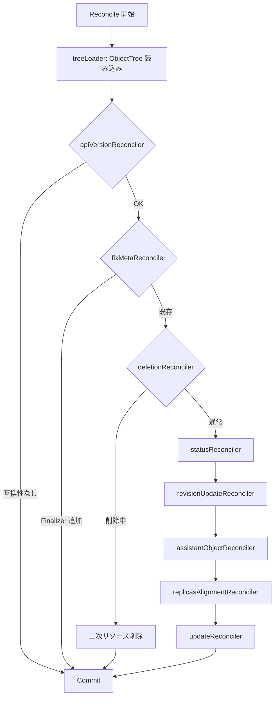
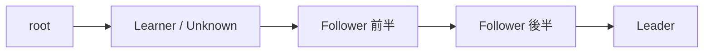

# 第10章 InstanceSet コントローラ: ポッドライフサイクル管理

> 本章で読むソース:
>
> - [controllers/workloads/instanceset_controller.go L20-L98](https://github.com/apecloud/kubeblocks/blob/v1.0.2/controllers/workloads/instanceset_controller.go#L20-L98)
> - [pkg/controller/instanceset/tree_loader.go L37-L93](https://github.com/apecloud/kubeblocks/blob/v1.0.2/pkg/controller/instanceset/tree_loader.go#L37-L93)
> - [pkg/controller/instanceset/reconciler_instance_alignment.go L40-L217](https://github.com/apecloud/kubeblocks/blob/v1.0.2/pkg/controller/instanceset/reconciler_instance_alignment.go#L40-L217)
> - [pkg/controller/instanceset/reconciler_status.go L40-L198](https://github.com/apecloud/kubeblocks/blob/v1.0.2/pkg/controller/instanceset/reconciler_status.go#L40-L198)
> - [pkg/controller/instanceset/update_plan.go L34-L255](https://github.com/apecloud/kubeblocks/blob/v1.0.2/pkg/controller/instanceset/update_plan.go#L34-L255)
> - [pkg/controller/instanceset/reconciler_update.go L45-L224](https://github.com/apecloud/kubeblocks/blob/v1.0.2/pkg/controller/instanceset/reconciler_update.go#L45-L224)
> - [pkg/controller/instanceset/in_place_update_util.go L38-L367](https://github.com/apecloud/kubeblocks/blob/v1.0.2/pkg/controller/instanceset/in_place_update_util.go#L38-L367)

## この章の狙い

`InstanceSet` は KubeBlocks が独自に定義したワークロード CRD であり、`StatefulSet` を拡張してデータベース特有の要件（ロールベースの更新順序、In-Place Update、テンプレートの圧縮保存）を満たす。
本章では `InstanceSetReconciler` の `Reconcile` メソッドから入り、9 段の Reconciler チェインがどのようにポッドのライフサイクルを管理するかを追う。
とくにインスタンスの作成・削除を担う `instanceAlignmentReconciler`、更新順序を DAG で制御する `updatePlan`、In-Place Update の判定機構を詳しく読む。

## 前提

- 第5章 [kubebuilderx: 拡張 Reconciler フレームワーク](../part01-controller-base/05-kubebuilderx.md) で `ObjectTree` と Reconciler チェインの仕組みを理解している。
- 第6章 [graph エンジン: DAG による変換パイプライン](../part01-controller-base/06-graph-engine.md) で DAG の `WalkBFS` を知っている。
- 第4章 [InstanceSet: ポッド集合のワークロード抽象](../part00-crd-overview/04-instanceset.md) で `InstanceSet` の spec 構造を確認している。

## Reconcile パイプライン

`InstanceSetReconciler.Reconcile` は `kubebuilderx.NewController` を起点に、9 個の Reconciler を直列に実行する。

[controllers/workloads/instanceset_controller.go L80-L98](https://github.com/apecloud/kubeblocks/blob/v1.0.2/controllers/workloads/instanceset_controller.go#L80-L98)

```go
func (r *InstanceSetReconciler) Reconcile(ctx context.Context, req ctrl.Request) (ctrl.Result, error) {
	logger := log.FromContext(ctx).WithValues("InstanceSet", req.NamespacedName)

	res, err := kubebuilderx.NewController(ctx, r.Client, req, r.Recorder, logger).
		Prepare(instanceset.NewTreeLoader()).
		Do(instanceset.NewAPIVersionReconciler()).
		Do(instanceset.NewFixMetaReconciler()).
		Do(instanceset.NewDeletionReconciler()).
		Do(instanceset.NewStatusReconciler()).
		Do(instanceset.NewRevisionUpdateReconciler()).
		Do(instanceset.NewAssistantObjectReconciler()).
		Do(instanceset.NewReplicasAlignmentReconciler()).
		Do(instanceset.NewUpdateReconciler()).
		Commit()

	return res, err
}
```

各 Reconciler の役割を下表にまとめる。

| 順序 | Reconciler | 責務 |
|------|-----------|------|
| Prepare | `treeLoader` | `InstanceSet` をルートとする `ObjectTree` を API サーバから読み込む |
| 1 | `apiVersionReconciler` | API バージョンの互換性を検証する |
| 2 | `fixMetaReconciler` | Finalizer が未付与であれば追加する |
| 3 | `deletionReconciler` | 削除要求を受けた二次リソースの先行削除を行う |
| 4 | `statusReconciler` | 現存するポッドからステータスを再計算する |
| 5 | `revisionUpdateReconciler` | spec 変更時に期待リビジョンを status に書き込む |
| 6 | `assistantObjectReconciler` | Headless Service 等の付随オブジェクトを同期する |
| 7 | `replicasAlignmentReconciler` | 期待されるレプリカ数に合わせてポッドを作成・削除する |
| 8 | `updateReconciler` | ローリングアップデートまたは In-Place Update を実行する |

各 Reconciler は `PreCondition` で実行条件を判定し、`ConditionUnsatisfied` を返すとスキップされる。
この設計により、削除中はアライメントをスキップする、spec 未更新時はリビジョン計算を省略する、といった分岐が宣言的に記述されている。



## TreeLoader: オブジェクトツリーの読み込み

`treeLoader` は `InstanceSet` をルートとし、ラベルセレクタで紐づく `Pod`、`PVC`、`Service`、`ConfigMap` を一括取得する。

[pkg/controller/instanceset/tree_loader.go L39-L58](https://github.com/apecloud/kubeblocks/blob/v1.0.2/pkg/controller/instanceset/tree_loader.go#L39-L58)

```go
func (r *treeLoader) Load(ctx context.Context, reader client.Reader, req ctrl.Request,
	recorder record.EventRecorder, logger logr.Logger) (*kubebuilderx.ObjectTree, error) {
	ml := getMatchLabels(req.Name)
	kinds := ownedKinds()
	tree, err := kubebuilderx.ReadObjectTree[*workloads.InstanceSet](ctx, reader, req, ml, kinds...)
	if err != nil {
		return nil, err
	}

	if err = loadCompressedInstanceTemplates(ctx, reader, tree); err != nil {
		return nil, err
	}

	tree.Context = ctx
	tree.EventRecorder = recorder
	tree.Logger = logger
	tree.SetFinalizer(finalizer)

	return tree, err
}
```

`ownedKinds` は読み込むリソース種別を返す。

[pkg/controller/instanceset/tree_loader.go L81-L88](https://github.com/apecloud/kubeblocks/blob/v1.0.2/pkg/controller/instanceset/tree_loader.go#L81-L88)

```go
func ownedKinds() []client.ObjectList {
	return []client.ObjectList{
		&corev1.ServiceList{},
		&corev1.ConfigMapList{},
		&corev1.PodList{},
		&corev1.PersistentVolumeClaimList{},
	}
}
```

`loadCompressedInstanceTemplates` は、`InstanceSet` の annotation に記録された `ConfigMap` 名を解決し、圧縮済みの `InstanceTemplate` 一覧をツリーに追加する。
大量の `InstanceTemplate` を annotation に直接格納すると etcd のサイズ制限に抵触するため、`zstd` で圧縮して別 `ConfigMap` に保存する仕組みである。

## Finalizer の登録

`fixMetaReconciler` は `InstanceSet` に Finalizer が存在しない場合のみ追加し、即座に `Commit` して現在の reconcile を終了する。

[pkg/controller/instanceset/reconciler_fix_meta.go L31-L49](https://github.com/apecloud/kubeblocks/blob/v1.0.2/pkg/controller/instanceset/reconciler_fix_meta.go#L31-L49)

```go
func (r *fixMetaReconciler) PreCondition(tree *kubebuilderx.ObjectTree) *kubebuilderx.CheckResult {
	if tree.GetRoot() == nil || model.IsObjectDeleting(tree.GetRoot()) {
		return kubebuilderx.ConditionUnsatisfied
	}

	if controllerutil.ContainsFinalizer(tree.GetRoot(), finalizer) {
		return kubebuilderx.ConditionUnsatisfied
	}

	return kubebuilderx.ConditionSatisfied
}

func (r *fixMetaReconciler) Reconcile(tree *kubebuilderx.ObjectTree) (kubebuilderx.Result, error) {
	controllerutil.AddFinalizer(tree.GetRoot(), finalizer)
	return kubebuilderx.Commit, nil
}
```

Finalizer の追加は `Commit` を返して即座に API サーバへ書き込まれる。
次の reconcile ループで Finalizer が存在するためこの Reconciler はスキップされ、以降の処理が進む。

## 削除処理

`deletionReconciler` は `DeletionTimestamp` が設定された `InstanceSet` を検出すると、二次リソースを先に削除する。

[pkg/controller/instanceset/reconciler_deletion.go L47-L60](https://github.com/apecloud/kubeblocks/blob/v1.0.2/pkg/controller/instanceset/reconciler_deletion.go#L47-L60)

```go
func (r *deletionReconciler) Reconcile(tree *kubebuilderx.ObjectTree) (kubebuilderx.Result, error) {
	its, _ := tree.GetRoot().(*workloads.InstanceSet)
	pvcRetentionPolicy := its.Spec.PersistentVolumeClaimRetentionPolicy
	retainPVC := pvcRetentionPolicy != nil &&
		pvcRetentionPolicy.WhenDeleted == kbappsv1.RetainPersistentVolumeClaimRetentionPolicyType

	if has, err := r.deleteSecondaryObjects(tree, its, retainPVC); has {
		return kubebuilderx.Continue, err
	}

	tree.DeleteRoot()
	return kubebuilderx.Continue, nil
}
```

`retainPVC` が true の場合、PVC の OwnerReference から `InstanceSet` の参照を外し、ガベージコレクション対象から除外する。
これによりデータボリュームを保持したまま `InstanceSet` だけを削除できる。

## ステータスの再計算

`statusReconciler` はツリー内の全ポッドを走査し、`InstanceSet.Status` の各フィールドを再計算する。

[pkg/controller/instanceset/reconciler_status.go L55-L198](https://github.com/apecloud/kubeblocks/blob/v1.0.2/pkg/controller/instanceset/reconciler_status.go#L55-L198)

```go
func (r *statusReconciler) Reconcile(tree *kubebuilderx.ObjectTree) (kubebuilderx.Result, error) {
	its, _ := tree.GetRoot().(*workloads.InstanceSet)
	pods := tree.List(&corev1.Pod{})
	// ... (中略) ...
	for _, pod := range podList {
		// ... (中略) ...
		if isCreated(pod) {
			notReadyNames.Insert(pod.Name)
			replicas++
		}
		if isImageMatched(pod) && intctrlutil.IsPodReady(pod) {
			readyReplicas++
			notReadyNames.Delete(pod.Name)
			if intctrlutil.IsPodAvailable(pod, its.Spec.MinReadySeconds) {
				availableReplicas++
			} else {
				notAvailableNames.Insert(pod.Name)
			}
		}
		// ... (中略) ...
	}
	its.Status.Replicas = replicas
	its.Status.ReadyReplicas = readyReplicas
	its.Status.AvailableReplicas = availableReplicas
	// ... (中略) ...
```

ステータス計算は5段階で構成される。

1. **サマリの算出**: `Replicas`、`ReadyReplicas`、`AvailableReplicas`、`CurrentReplicas`、`UpdatedReplicas` をポッドの状態から集計する。
2. **テンプレート別ステータス**: `InstanceTemplate` ごとにレプリカ数を集計し `TemplatesStatus` に格納する。
3. **Condition の構築**: `InstanceReady`、`InstanceAvailable`、`InstanceFailure` の3条件を設定する。
4. **メンバーステータス**: ロールが定義されていれば、各ポッドのロールラベルから `MembersStatus` を構築する。
5. **インスタンスステータス**: 各ポッドの設定適用状況を `InstanceStatus` に記録する。

`MinReadySeconds` が設定されており `availableReplicas != readyReplicas` の場合、`RetryAfter(time.Second)` を返して次の reconcile を1秒後に再試行する。
これはポッドが Ready になっても `MinReadySeconds` 経過までは Available と判定されないため、時間経過を待ってから再度ステータスを評価する必要があるからである。

### Condition の構築

`buildReadyCondition` と `buildAvailableCondition` は、条件が満たされていない場合に未充足のポッド名を JSON 配列で `Message` に埋め込む。

[pkg/controller/instanceset/reconciler_status.go L222-L238](https://github.com/apecloud/kubeblocks/blob/v1.0.2/pkg/controller/instanceset/reconciler_status.go#L222-L238)

```go
func buildReadyCondition(its *workloads.InstanceSet, ready bool,
	notReadyNames sets.Set[string]) (*metav1.Condition, error) {
	condition := &metav1.Condition{
		Type:               string(workloads.InstanceReady),
		Status:             metav1.ConditionTrue,
		ObservedGeneration: its.Generation,
		Reason:             workloads.ReasonReady,
	}
	if !ready {
		condition.Status = metav1.ConditionFalse
		condition.Reason = workloads.ReasonNotReady
		message, err := buildConditionMessageWithNames(notReadyNames.UnsortedList())
		if err != nil {
			return nil, err
		}
		condition.Message = string(message)
	}
	return condition, nil
}
```

`buildFailureCondition` は `PodFailed` フェーズのポッド、または `IsPodFailedAndTimedOut` で失敗と判定されたポッドを `InstanceFailure` Condition に記録する。

## リビジョンの更新

`revisionUpdateReconciler` は spec の変更を検出すると、各ポッド名に対応する期待リビジョンを計算して `status.updateRevisions` に書き込む。

[pkg/controller/instanceset/reconciler_revision_update.go L54-L118](https://github.com/apecloud/kubeblocks/blob/v1.0.2/pkg/controller/instanceset/reconciler_revision_update.go#L54-L118)

```go
func (r *revisionUpdateReconciler) Reconcile(tree *kubebuilderx.ObjectTree) (kubebuilderx.Result, error) {
	its, _ := tree.GetRoot().(*workloads.InstanceSet)
	itsExt, err := buildInstanceSetExt(its, tree)
	if err != nil {
		return kubebuilderx.Continue, err
	}

	instanceTemplateList := buildInstanceTemplateExts(itsExt)

	var instanceRevisionList []instanceRevision
	for _, template := range instanceTemplateList {
		// ... (中略) ...
		instanceNames, err := GenerateInstanceNamesFromTemplate(
			its.Name, template.Name, template.Replicas,
			itsExt.its.Spec.OfflineInstances, ordinalList)
		// ... (中略) ...
		revision, err := BuildInstanceTemplateRevision(&template.PodTemplateSpec, its)
		// ... (中略) ...
		for _, name := range instanceNames {
			instanceRevisionList = append(instanceRevisionList,
				instanceRevision{name: name, revision: revision})
		}
	}
	// ... (中略) ...
	its.Status.UpdateRevisions = revisions
	its.Status.ObservedGeneration = its.Generation

	return kubebuilderx.Continue, nil
}
```

`PreCondition` は `IsObjectUpdating`、つまり `observedGeneration < generation` の場合にのみ `ConditionSatisfied` を返す。
これにより spec が変更された reconcile ループでのみ高コストなリビジョン計算が実行される。

`BuildInstanceTemplateRevision` は PodTemplateSpec から In-Place Update 可能なフィールド（イメージ、CPU、メモリ、Toleration 等）を除外したハッシュを生成する。
この設計により、In-Place Update で吸収できる変更はリビジョンの更新を引き起こさない。

[pkg/controller/instanceset/in_place_update_util.go L50-L93](https://github.com/apecloud/kubeblocks/blob/v1.0.2/pkg/controller/instanceset/in_place_update_util.go#L50-L93)

```go
func filterInPlaceFields(src *corev1.PodTemplateSpec) *corev1.PodTemplateSpec {
	template := src.DeepCopy()
	// ... (中略) ...
	template.Labels = nil
	for i := range template.Spec.Containers {
		template.Spec.Containers[i].Image = ""
	}
	for i := range template.Spec.InitContainers {
		template.Spec.InitContainers[i].Image = ""
	}
	template.Spec.ActiveDeadlineSeconds = nil
	template.Spec.Tolerations = nil
	for i := range template.Spec.Containers {
		delete(template.Spec.Containers[i].Resources.Requests, corev1.ResourceCPU)
		delete(template.Spec.Containers[i].Resources.Requests, corev1.ResourceMemory)
		delete(template.Spec.Containers[i].Resources.Limits, corev1.ResourceCPU)
		delete(template.Spec.Containers[i].Resources.Limits, corev1.ResourceMemory)
	}

	return template
}
```

## インスタンスアライメント

`instanceAlignmentReconciler` は期待されるポッド集合と既存のポッド集合の差分を求め、作成と削除を実行する。

### 期待される名前の生成と差分計算

まず `buildInstanceName2TemplateMap` で期待されるポッド名からテンプレートへの写像を構築する。

[pkg/controller/instanceset/reconciler_instance_alignment.go L60-L88](https://github.com/apecloud/kubeblocks/blob/v1.0.2/pkg/controller/instanceset/reconciler_instance_alignment.go#L60-L88)

```go
func (r *instanceAlignmentReconciler) Reconcile(tree *kubebuilderx.ObjectTree) (kubebuilderx.Result, error) {
	its, _ := tree.GetRoot().(*workloads.InstanceSet)
	itsExt, err := buildInstanceSetExt(its, tree)
	if err != nil {
		return kubebuilderx.Continue, err
	}

	nameToTemplateMap, err := buildInstanceName2TemplateMap(itsExt)
	if err != nil {
		return kubebuilderx.Continue, err
	}

	newNameSet := sets.New[string]()
	for name := range nameToTemplateMap {
		newNameSet.Insert(name)
	}
	oldNameSet := sets.New[string]()
	oldInstanceMap := make(map[string]*corev1.Pod)
	oldInstanceList := tree.List(&corev1.Pod{})
	for _, object := range oldInstanceList {
		oldNameSet.Insert(object.GetName())
		pod, _ := object.(*corev1.Pod)
		oldInstanceMap[object.GetName()] = pod
	}
	createNameSet := newNameSet.Difference(oldNameSet)
	deleteNameSet := oldNameSet.Difference(newNameSet)
```

`createNameSet` は新規作成すべきポッド名、`deleteNameSet` は不要になったポッド名である。

### 作成処理と OrdredReady ポリシー

デフォルトでは `OrderedReady` ポリシーが適用され、前のポッドが Available になるまで次のポッドを作成しない。

[pkg/controller/instanceset/reconciler_instance_alignment.go L90-L149](https://github.com/apecloud/kubeblocks/blob/v1.0.2/pkg/controller/instanceset/reconciler_instance_alignment.go#L90-L149)

```go
	isOrderedReady := true
	concurrency := 0
	if its.Spec.PodManagementPolicy == appsv1.ParallelPodManagement {
		concurrency, err = CalculateConcurrencyReplicas(
			its.Spec.ParallelPodManagementConcurrency, int(*its.Spec.Replicas))
		// ... (中略) ...
		isOrderedReady = false
	}
	// ... (中略) ...
	for i, name := range newNameList {
		if _, ok := createNameSet[name]; !ok {
			currentAlignedNameList = append(currentAlignedNameList, name)
			continue
		}
		if !isOrderedReady && concurrency <= 0 {
			break
		}
		predecessor := getPredecessor(i)
		if isOrderedReady && predecessor != nil &&
			!intctrlutil.IsPodAvailable(predecessor, its.Spec.MinReadySeconds) {
			break
		}
		inst, err := buildInstanceByTemplate(name, nameToTemplateMap[name], its, "")
		if err != nil {
			return kubebuilderx.Continue, err
		}
		if err := tree.Add(inst.pod); err != nil {
			return kubebuilderx.Continue, err
		}
		currentAlignedNameList = append(currentAlignedNameList, name)

		if isOrderedReady {
			break
		}
		concurrency--
	}
```

`OrderedReady` では ordinal の小さいポッドから順に1つずつ作成する。
`ParallelPodManagement` では `concurrency` で指定された並列数まで一括作成できる。
`ParallelPodManagementConcurrency` は整数またはパーセンテージで指定され、`CalculateConcurrencyReplicas` が絶対値に変換する。

### 削除処理と PVC の保持ポリシー

削除も同様にポリシーに従う。
`OrderedReady` の場合、削除対象のポッドが Ready でない場合は警告イベントを発行しつつ、1つずつ削除する。

[pkg/controller/instanceset/reconciler_instance_alignment.go L176-L214](https://github.com/apecloud/kubeblocks/blob/v1.0.2/pkg/controller/instanceset/reconciler_instance_alignment.go#L176-L214)

```go
	for _, object := range oldInstanceList {
		pod, _ := object.(*corev1.Pod)
		if _, ok := deleteNameSet[pod.Name]; !ok {
			continue
		}
		// ... (中略) ...
		if err := tree.Delete(pod); err != nil {
			return kubebuilderx.Continue, err
		}

		retentionPolicy := its.Spec.PersistentVolumeClaimRetentionPolicy
		if retentionPolicy == nil ||
			retentionPolicy.WhenScaled != kbappsv1.RetainPersistentVolumeClaimRetentionPolicyType {
			for _, obj := range oldPVCList {
				pvc := obj.(*corev1.PersistentVolumeClaim{})
				if pvc.Labels != nil &&
					pvc.Labels[constant.KBAppPodNameLabelKey] == pod.Name {
					if err := tree.Delete(pvc); err != nil {
						return kubebuilderx.Continue, err
					}
				}
			}
		}

		if isOrderedReady {
			break
		}
		concurrency--
	}
```

スケールイン時に PVC を保持するかどうかは `PersistentVolumeClaimRetentionPolicy.WhenScaled` で制御される。
デフォルトの `Delete` ポリシーではポッド削除時に PVC も削除される。

## ポッドの生成

`buildInstanceByTemplate` はテンプレートから `Pod` と `PVC` を構築する。

[pkg/controller/instanceset/instance_util.go L508-L590](https://github.com/apecloud/kubeblocks/blob/v1.0.2/pkg/controller/instanceset/instance_util.go#L508-L590)

```go
func buildInstanceByTemplate(name string, template *instanceTemplateExt,
	parent *workloads.InstanceSet, revision string) (*instance, error) {
	var err error
	if len(revision) == 0 {
		revision, err = BuildInstanceTemplateRevision(&template.PodTemplateSpec, parent)
		if err != nil {
			return nil, err
		}
	}
	labels := getMatchLabels(parent.Name)
	pod := builder.NewPodBuilder(parent.Namespace, name).
		AddAnnotationsInMap(template.Annotations).
		AddLabelsInMap(template.Labels).
		AddLabelsInMap(labels).
		AddLabels(constant.KBAppPodNameLabelKey, name).
		AddControllerRevisionHashLabel(revision).
		SetPodSpec(*template.Spec.DeepCopy()).
		GetObject()
	pod.Spec.Hostname = pod.Name
	pod.Spec.Subdomain = getHeadlessSvcName(parent.Name)
	// ... (中略) ...
```

ポッド名は `{parent.name}-{template.name}-{ordinal}` の形式で付与される。
`Hostname` と `Subdomain` を設定することで、Headless Service 経由の安定した DNS 名前解決を実現する。

`NodeSelectorOnceAnnotation` が指定されている場合、対応するポッドに `NodeSelector` を設定して特定ノードへのスケジューリングを試みる。
スケジューリング完了後は annotation からエントリが削除される。

## アシスタントオブジェクトの同期

`assistantObjectReconciler` は Headless Service をはじめとする付随リソースを同期する。

[pkg/controller/instanceset/reconciler_assistant_object.go L50-L115](https://github.com/apecloud/kubeblocks/blob/v1.0.2/pkg/controller/instanceset/reconciler_assistant_object.go#L50-L115)

```go
func (a *assistantObjectReconciler) Reconcile(tree *kubebuilderx.ObjectTree) (kubebuilderx.Result, error) {
	its, _ := tree.GetRoot().(*workloads.InstanceSet)

	labels := getMatchLabels(its.Name)
	headlessSelectors := getHeadlessSvcSelector(its)

	headLessSvc := buildHeadlessSvc(*its, labels, headlessSelectors)
	var objects []client.Object
	objects = append(objects, headLessSvc)
	// ... (中略) ...
	newSnapshot := make(map[model.GVKNObjKey]client.Object)
	// ... (中略) ...
	oldSnapshot := make(map[model.GVKNObjKey]client.Object)
	// ... (中略) ...
	createSet := newNameSet.Difference(oldNameSet)
	updateSet := newNameSet.Intersection(oldNameSet)
	deleteSet := oldNameSet.Difference(newNameSet)
	for name := range createSet {
		if err := tree.Add(newSnapshot[name]); err != nil {
			return kubebuilderx.Continue, err
		}
	}
	for name := range updateSet {
		oldObj := oldSnapshot[name]
		newObj := copyAndMerge(oldObj, newSnapshot[name])
		if err := tree.Update(newObj); err != nil {
			return kubebuilderx.Continue, err
		}
	}
	for name := range deleteSet {
		if err := tree.Delete(oldSnapshot[name]); err != nil {
			return kubebuilderx.Continue, err
		}
	}
	return kubebuilderx.Continue, nil
}
```

期待状態スナップショットと現存スナップショットの差分を集合演算で求め、作成・更新・削除の3操作に分類する。
`copyAndMerge` は既存オブジェクトの更新可能フィールドのみをマージし、不変フィールドの変更によるエラーを防ぐ。

## 更新処理

`updateReconciler` はインスタンスのアップデートを制御する。
`OnDelete` 戦略の場合は何もせず終了する。
`RollingUpdate` 戦略の場合、更新可能ポッド数をクォータで制限しながら更新を進める。

[pkg/controller/instanceset/reconciler_update.go L67-L133](https://github.com/apecloud/kubeblocks/blob/v1.0.2/pkg/controller/instanceset/reconciler_update.go#L67-L133)

```go
func (r *updateReconciler) Reconcile(tree *kubebuilderx.ObjectTree) (kubebuilderx.Result, error) {
	its, _ := tree.GetRoot().(*workloads.InstanceSet)
	itsExt, err := buildInstanceSetExt(its, tree)
	if err != nil {
		return kubebuilderx.Continue, err
	}

	nameToTemplateMap, err := buildInstanceName2TemplateMap(itsExt)
	// ... (中略) ...

	// do nothing if update strategy type is 'OnDelete'
	if its.Spec.InstanceUpdateStrategy != nil &&
		its.Spec.InstanceUpdateStrategy.Type == kbappsv1.OnDeleteStrategyType {
		return kubebuilderx.Continue, nil
	}

	// handle 'RollingUpdate'
	rollingUpdateQuota, unavailableQuota, err := r.rollingUpdateQuota(its, oldPodList)
	// ... (中略) ...

	memberUpdateQuota, err := r.memberUpdateQuota(its, oldPodList)
	// ... (中略) ...

	// treat old and Pending pod as a special case
	for _, pod := range oldPodList {
		updatePolicy, _, err := getPodUpdatePolicy(its, pod)
		// ... (中略) ...
		if isPodPending(pod) && updatePolicy != noOpsPolicy {
			err = tree.Delete(pod)
			return kubebuilderx.Continue, err
		}
	}
```

Pending 状態のポッドは特別扱いされ、更新ポリシーに関わらず即座に削除されて次の reconcile で再作成される。
これは Pending ポッドに対して In-Place Update を適用しても意味がないためである。

### 更新クォータの計算

`rollingUpdateQuota` は `MaxUnavailable` から現在の利用不可ポッド数を引いた値を更新上限とする。

[pkg/controller/instanceset/reconciler_update.go L226-L240](https://github.com/apecloud/kubeblocks/blob/v1.0.2/pkg/controller/instanceset/reconciler_update.go#L226-L240)

```go
func (r *updateReconciler) rollingUpdateQuota(its *workloads.InstanceSet,
	podList []*corev1.Pod) (int, int, error) {
	replicas, maxUnavailable, err := parseReplicasNMaxUnavailable(
		its.Spec.InstanceUpdateStrategy, len(podList))
	if err != nil {
		return -1, -1, err
	}
	currentUnavailable := 0
	for _, pod := range podList {
		if !intctrlutil.IsPodAvailable(pod, its.Spec.MinReadySeconds) {
			currentUnavailable++
		}
	}
	unavailable := maxUnavailable - currentUnavailable
	return replicas, unavailable, nil
}
```

`memberUpdateQuota` はロールベースの更新計画を構築し、今回更新できるポッド数を算出する。

[pkg/controller/instanceset/reconciler_update.go L242-L254](https://github.com/apecloud/kubeblocks/blob/v1.0.2/pkg/controller/instanceset/reconciler_update.go#L242-L254)

```go
func (r *updateReconciler) memberUpdateQuota(its *workloads.InstanceSet,
	podList []*corev1.Pod) (int, error) {
	updateCount := len(podList)
	if len(its.Spec.Roles) > 0 {
		plan := NewUpdatePlan(*its, podList, r.isPodOrConfigUpdated)
		podsToBeUpdated, err := plan.Execute()
		if err != nil {
			return -1, err
		}
		updateCount = len(podsToBeUpdated)
	}
	return updateCount, nil
}
```

### 更新ポリシーの判定

`getPodUpdatePolicy` は各ポッドに対して3種類の更新ポリシーのいずれかを返す。

[pkg/controller/instanceset/in_place_update_util.go L288-L349](https://github.com/apecloud/kubeblocks/blob/v1.0.2/pkg/controller/instanceset/in_place_update_util.go#L288-L349)

```go
func getPodUpdatePolicy(its *workloads.InstanceSet, pod *corev1.Pod) (podUpdatePolicy,
	workloads.PodUpdatePolicyType, error) {
	// ... (中略) ...
	itsExt, err := buildInstanceSetExt(its, nil)
	// ... (中略) ...
	inst, err := buildInstanceByTemplate(pod.Name, templateList[index], its, getPodRevision(pod))
	// ... (中略) ...

	specUpdatePolicy := getPodUpdatePolicyInSpec(its, pod, inst.pod)
	if getPodRevision(pod) != updateRevisions[pod.Name] {
		return recreatePolicy, specUpdatePolicy, nil
	}

	basicUpdate := !equalBasicInPlaceFields(pod, inst.pod)
	// ... (中略) ...
	resourceUpdate := !equalResourcesInPlaceFields(pod, inst.pod)
	if resourceUpdate {
		if supportPodVerticalScaling() {
			return inPlaceUpdatePolicy, specUpdatePolicy, nil
		}
		return recreatePolicy, specUpdatePolicy, nil
	}

	if basicUpdate {
		return inPlaceUpdatePolicy, specUpdatePolicy, nil
	}
	return noOpsPolicy, "", nil
}
```

判定ロジックは以下の通りである。

1. ポッドのリビジョンが期待リビジョンと異なる場合は `recreatePolicy`（テンプレート自体が変更された）。
2. リビジョンが一致していてもイメージやリソースが異なる場合は `inPlaceUpdatePolicy`。
3. いずれにも該当しない場合は `noOpsPolicy`（更新不要）。

`inPlaceUpdatePolicy` の場合、`updateReconciler` は `copyAndMerge` で In-Place 可能なフィールドのみをマージしてポッドを更新する。
これによりポッドの再作成なしにイメージやリソースの変更が適用される。

### 更新ループ

各ポッドに対し、更新ポリシーに応じて In-Place Update または再作成を実行する。

[pkg/controller/instanceset/reconciler_update.go L135-L215](https://github.com/apecloud/kubeblocks/blob/v1.0.2/pkg/controller/instanceset/reconciler_update.go#L135-L215)

```go
	updatingPods := 0
	isBlocked := false
	needRetry := false
	for _, pod := range oldPodList {
		if updatingPods >= rollingUpdateQuota || updatingPods >= unavailableQuota {
			break
		}
		if updatingPods >= memberUpdateQuota {
			break
		}
		if canBeUpdated, retry := r.isPodCanBeUpdated(tree, its, pod); !canBeUpdated {
			needRetry = retry
			break
		}

		updatePolicy, specUpdatePolicy, err := getPodUpdatePolicy(its, pod)
		// ... (中略) ...
		if updatePolicy == inPlaceUpdatePolicy {
			newInstance, err := buildInstanceByTemplate(
				pod.Name, nameToTemplateMap[pod.Name], its, getPodRevision(pod))
			// ... (中略) ...
			newPod := copyAndMerge(pod, newInstance.pod)
			// ... (中略) ...
			if !equalResourcesInPlaceFields(pod, newInstance.pod) && supportResizeSubResource {
				err = tree.Update(newPod, kubebuilderx.WithSubResource("resize"))
			} else {
				if err = r.switchover(tree, its, newPod.(*corev1.Pod)); err != nil {
					return kubebuilderx.Continue, err
				}
				err = tree.Update(newPod)
			}
			// ... (中略) ...
			updatingPods++
		} else if updatePolicy == recreatePolicy {
			if !isTerminating(pod) {
				if err = r.switchover(tree, its, pod); err != nil {
					return kubebuilderx.Continue, err
				}
				if err = tree.Delete(pod); err != nil {
					return kubebuilderx.Continue, err
				}
			}
			updatingPods++
		}
		// ... (中略) ...
	}
```

`isPodCanBeUpdated` はポッドが更新可能かチェックする。
イメージが一致しているか、Ready 状態か、Available 状態か、ロールが準備完了かの4条件をすべて満たす必要がある。

`switchover` は再作成の前に `MembershipReconfiguration.Switchover` アクションを呼び出し、リーダーシップの移譲を行う。
これによりデータベースの可用性を保ちながらローリングアップデートを進められる。

## 更新計画: DAG による順序制御

`updatePlan` はロールの優先度に基づいてポッドの更新順序を DAG で表現する。
`MemberUpdateStrategy` には `Serial`、`Parallel`、`BestEffortParallel` の3種類がある。

[pkg/controller/instanceset/update_plan.go L121-L140](https://github.com/apecloud/kubeblocks/blob/v1.0.2/pkg/controller/instanceset/update_plan.go#L121-L140)

```go
func (p *realUpdatePlan) build() {
	root := &model.ObjectVertex{}
	p.dag.AddVertex(root)

	memberUpdateStrategy := getMemberUpdateStrategy(&p.its)

	rolePriorityMap := ComposeRolePriorityMap(p.its.Spec.Roles)
	SortPods(p.pods, rolePriorityMap, false)

	switch memberUpdateStrategy {
	case workloads.SerialUpdateStrategy:
		p.buildSerialUpdatePlan()
	case workloads.ParallelUpdateStrategy:
		p.buildParallelUpdatePlan()
	case workloads.BestEffortParallelUpdateStrategy:
		p.buildBestEffortParallelUpdatePlan(rolePriorityMap)
	}
}
```

### Serial 戦略

全ポッドをロール優先度の低い順に直列に並べる。

[pkg/controller/instanceset/update_plan.go L218-L225](https://github.com/apecloud/kubeblocks/blob/v1.0.2/pkg/controller/instanceset/update_plan.go#L218-L225)

```go
func (p *realUpdatePlan) buildSerialUpdatePlan() {
	preVertex, _ := model.FindRootVertex(p.dag)
	for i := range p.pods {
		vertex := &model.ObjectVertex{Obj: &p.pods[i]}
		p.dag.AddConnect(preVertex, vertex)
		preVertex = vertex
	}
}
```

### Parallel 戦略

全ポッドをルートに直接接続し、並列に更新する。

[pkg/controller/instanceset/update_plan.go L209-L215](https://github.com/apecloud/kubeblocks/blob/v1.0.2/pkg/controller/instanceset/update_plan.go#L209-L215)

```go
func (p *realUpdatePlan) buildParallelUpdatePlan() {
	root, _ := model.FindRootVertex(p.dag)
	for i := range p.pods {
		vertex := &model.ObjectVertex{Obj: &p.pods[i]}
		p.dag.AddConnect(root, vertex)
	}
}
```

### BestEffortParallel 戦略

クォーラムに参加しないロールを先に更新し、フォロワーの半数、残り半数、リーダーの順に更新する。
これにより更新中も残りのフォロワーとリーダーでクォーラムを維持できる。

[pkg/controller/instanceset/update_plan.go L143-L206](https://github.com/apecloud/kubeblocks/blob/v1.0.2/pkg/controller/instanceset/update_plan.go#L143-L206)

```go
func (p *realUpdatePlan) buildBestEffortParallelUpdatePlan(rolePriorityMap map[string]int) {
	currentVertex, _ := model.FindRootVertex(p.dag)
	preVertex := currentVertex

	quorumPriority := math.MaxInt32
	leaderPriority := 0
	for _, role := range p.its.Spec.Roles {
		if rolePriorityMap[role.Name] > leaderPriority {
			leaderPriority = rolePriorityMap[role.Name]
		}
		if role.ParticipatesInQuorum && quorumPriority > rolePriorityMap[role.Name] {
			quorumPriority = rolePriorityMap[role.Name]
		}
	}

	// append unknown, empty and roles that do not participate in quorum
	// ... (中略) ...

	// append 1/2 followers
	// ... (中略) ...

	// append the other 1/2 followers
	// ... (中略) ...

	// append leader
	// ... (中略) ...
}
```



### DAG の巡回と更新対象の選定

`Execute` は `build` で構築した DAG を BFS で巡回し、更新すべきポッドのリストを返す。

[pkg/controller/instanceset/update_plan.go L227-L234](https://github.com/apecloud/kubeblocks/blob/v1.0.2/pkg/controller/instanceset/update_plan.go#L227-L234)

```go
func (p *realUpdatePlan) Execute() ([]*corev1.Pod, error) {
	p.build()
	if err := p.dag.WalkBFS(p.planWalkFunc); err != ErrContinue && err != ErrWait && err != ErrStop {
		return nil, err
	}

	return p.podsToBeUpdated, nil
}
```

`planWalkFunc` は各頂点を評価し、以下のいずれかの判断を下す。

- `ErrContinue`: すでに最新リビジョン。次へ進む。
- `ErrWait`: ポッドが terminating または未 Ready。待機する。
- `ErrStop`: 更新対象として追加。以降の巡回を停止する。

`ErrWait` はポッドが Ready になるまで更新を保留することを意味する。
`ErrStop` は1バッチで更新するポッド数に達したことを意味する。

## 高速化: zstd によるテンプレート圧縮

`InstanceSet` は `InstanceTemplate` が多数存在する場合、それらを `zstd` で圧縮して `ConfigMap` に保存する。

[pkg/controller/instanceset/instance_util.go L69-L80](https://github.com/apecloud/kubeblocks/blob/v1.0.2/pkg/controller/instanceset/instance_util.go#L69-L80)

```go
var (
	reader *zstd.Decoder
	writer *zstd.Encoder
)

func init() {
	var err error
	reader, err = zstd.NewReader(nil)
	runtime.Must(err)
	writer, err = zstd.NewWriter(nil)
	runtime.Must(err)
}
```

`ConfigMap` の `BinaryData` に圧縮データを格納し、`treeLoader` の読み込み時に展開する。

[pkg/controller/instanceset/instance_util.go L836-L860](https://github.com/apecloud/kubeblocks/blob/v1.0.2/pkg/controller/instanceset/instance_util.go#L836-L860)

```go
func getInstanceTemplates(instances []workloads.InstanceTemplate,
	template *corev1.ConfigMap) []workloads.InstanceTemplate {
	if template == nil {
		return instances
	}

	if template.BinaryData == nil {
		return nil
	}
	templateData, ok := template.BinaryData[templateRefDataKey]
	if !ok {
		return nil
	}
	templateByte, err := reader.DecodeAll(templateData, nil)
	if err != nil {
		return nil
	}
	extraTemplates := make([]workloads.InstanceTemplate, 0)
	err = json.Unmarshal(templateByte, &extraTemplates)
	if err != nil {
		return nil
	}

	return append(instances, extraTemplates...)
}
```

`zstd` のデコーダとエンコーダは `init` で1度だけ生成され、以降の reconcile で再利用される。
これにより大量の `InstanceTemplate` を保持する `InstanceSet` でも、annotation サイズを etcd の制限内に収められる。

## 高速化: 並列 reconcile とイベント駆動

`SetupWithManager` では `Pod` と `PVC` の変更を `LabelFinder` で `InstanceSet` にマッピングし、`Watches` で監視する。

[pkg/controller/instanceset/instanceset_controller.go L114-L128](https://github.com/apecloud/kubeblocks/blob/v1.0.2/controllers/workloads/instanceset_controller.go#L114-L128)

```go
func (r *InstanceSetReconciler) setupWithManager(mgr ctrl.Manager, ctx *handler.FinderContext) error {
	itsFinder := handler.NewLabelFinder(&workloads.InstanceSet{}, instanceset.WorkloadsManagedByLabelKey, workloads.InstanceSetKind, instanceset.WorkloadsInstanceLabelKey)
	itsHandler := handler.NewBuilder(ctx).AddFinder(itsFinder).Build()
	return intctrlutil.NewControllerManagedBy(mgr).
		For(&workloads.InstanceSet{}).
		WithOptions(controller.Options{
			MaxConcurrentReconciles: viper.GetInt(constant.CfgKBReconcileWorkers),
		}).
		Watches(&corev1.Pod{}, itsHandler).
		Watches(&corev1.PersistentVolumeClaim{}, itsHandler).
		Owns(&batchv1.Job{}).
		Owns(&corev1.Service{}).
		Owns(&corev1.ConfigMap{}).
		Complete(r)
}
```

`MaxConcurrentReconciles` は設定値から並列数を制御し、複数の `InstanceSet` を同時に reconcile できる。
`Pod` と `PVC` の変更を即座に検知して reconcile をトリガーするため、ポッドのステータス変化に対して遅延なく応答できる。

## まとめ

`InstanceSet` コントローラは9段の Reconciler チェインにより、ポッドのライフサイクルを段階的に管理する。
`treeLoader` が `ObjectTree` を読み込み、`instanceAlignmentReconciler` が期待されるレプリカ数との差分を集合演算で求めて作成・削除を実行する。
`updateReconciler` は `updatePlan` が構築する DAG に基づき、ロール優先度を考慮した順序で更新を行う。
In-Place Update の判定は `filterInPlaceFields` でリビジョンハッシュから除外されたフィールド群（イメージ、CPU、メモリ、Toleration）に対して機能し、ポッドの再作成なしに変更を適用する。
`zstd` 圧縮によるテンプレート保存と、`MaxConcurrentReconciles` による並列処理が、大規模なレプリカ集合での性能を支えている。

## 関連する章

- 第4章 [InstanceSet: ポッド集合のワークロード抽象](../part00-crd-overview/04-instanceset.md): `InstanceSet` CRD の spec 構造
- 第5章 [kubebuilderx: 拡張 Reconciler フレームワーク](../part01-controller-base/05-kubebuilderx.md): `ObjectTree` と Reconciler チェインの仕組み
- 第6章 [graph エンジン: DAG による変換パイプライン](../part01-controller-base/06-graph-engine.md): DAG の `WalkBFS` と頂点操作
- 第7章 [builder: リソース生成の統一インタフェース](../part01-controller-base/07-builder.md): `PodBuilder`、`PVCBuilder` 等のリソース生成
- 第9章 [Component コントローラ: ワークロードの生成](09-component-controller.md): `InstanceSet` を生成する上位コントローラ
