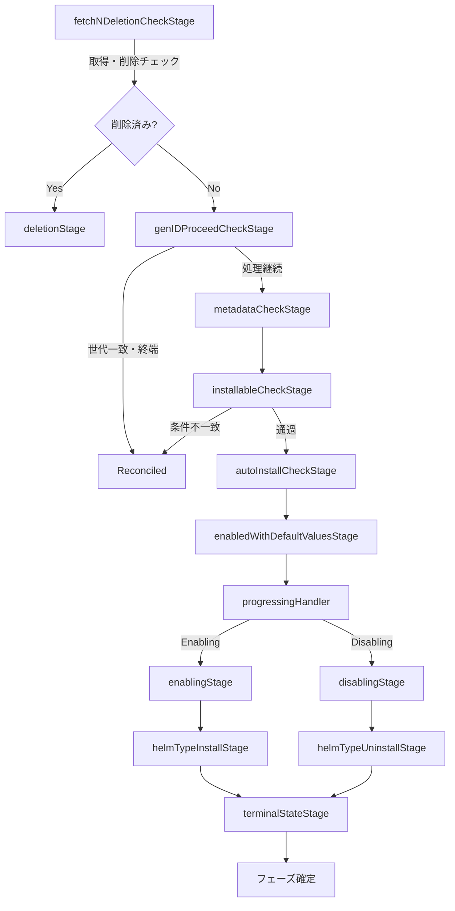
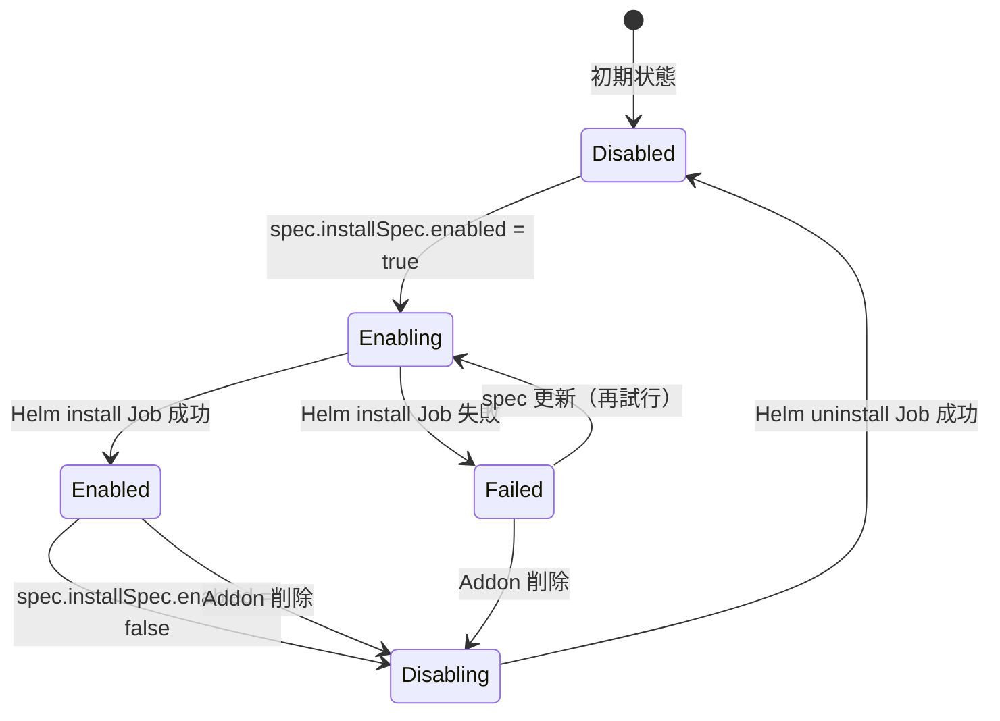

# 第11章 Addon コントローラ: 機能拡張の動的ロード

> 本章で読むソース
>
> - [controllers/extensions/addon_controller.go L46-L163](https://github.com/apecloud/kubeblocks/blob/v1.0.2/controllers/extensions/addon_controller.go#L46-L163)
> - [controllers/extensions/addon_controller_stages.go L50-L170](https://github.com/apecloud/kubeblocks/blob/v1.0.2/controllers/extensions/addon_controller_stages.go#L50-L170)
> - [controllers/extensions/addon_controller_stages.go L172-L293](https://github.com/apecloud/kubeblocks/blob/v1.0.2/controllers/extensions/addon_controller_stages.go#L172-L293)
> - [controllers/extensions/addon_controller_stages.go L531-L699](https://github.com/apecloud/kubeblocks/blob/v1.0.2/controllers/extensions/addon_controller_stages.go#L531-L699)
> - [controllers/extensions/addon_controller_stages.go L839-L876](https://github.com/apecloud/kubeblocks/blob/v1.0.2/controllers/extensions/addon_controller_stages.go#L839-L876)
> - [apis/extensions/v1alpha1/addon_types.go L34-L83](https://github.com/apecloud/kubeblocks/blob/v1.0.2/apis/extensions/v1alpha1/addon_types.go#L34-L83)
> - [apis/extensions/v1alpha1/addon_types.go L86-L103](https://github.com/apecloud/kubeblocks/blob/v1.0.2/apis/extensions/v1alpha1/addon_types.go#L86-L103)
> - [apis/extensions/v1alpha1/addon_types.go L488-L494](https://github.com/apecloud/kubeblocks/blob/v1.0.2/apis/extensions/v1alpha1/addon_types.go#L488-L494)
> - [apis/extensions/v1alpha1/type.go L49-L59](https://github.com/apecloud/kubeblocks/blob/v1.0.2/apis/extensions/v1alpha1/type.go#L49-L59)
> - [controllers/extensions/const.go L22-L58](https://github.com/apecloud/kubeblocks/blob/v1.0.2/controllers/extensions/const.go#L22-L58)

## この章の狙い

`Addon` は KubeBlocks の機能拡張を担う CRD である。
アドオンを有効化すると Helm チャートのインストールが Job として実行され、無効化するとアンインストール Job が走る。
本章では `AddonReconciler` が採用するステージチェーン構造を読み、アドオンのライフサイクルがどのように制御されているかを明らかにする。

## 前提

本章は Kubernetes のコントローラパターン（[第9章](../../kubernetes/kubernetes/part03-controller-manager/09-controller-manager-architecture.md)）と CRD（[第20章](../../kubernetes/kubernetes/part07-extension/20-crd-and-aggregation.md)）を前提とする。
`controller-runtime` の `Reconciler` インタフェースと `Informer`（[第19章](../../kubernetes/kubernetes/part07-extension/19-client-go-and-informer.md)）の知識も必要である。

## Addon CRD のデータモデル

### Addon の spec と status

`Addon` はクラスタースコープの CRD であり、Helm チャートのインストール情報を spec に保持する。

[apis/extensions/v1alpha1/addon_types.go L488-L494](https://github.com/apecloud/kubeblocks/blob/v1.0.2/apis/extensions/v1alpha1/addon_types.go#L488-L494)

```go
type Addon struct {
	metav1.TypeMeta   `json:",inline"`
	metav1.ObjectMeta `json:"metadata,omitempty"`

	Spec   AddonSpec   `json:"spec,omitempty"`
	Status AddonStatus `json:"status,omitempty"`
}
```

`AddonSpec` の主要なフィールドを以下に示す。

[apis/extensions/v1alpha1/addon_types.go L34-L83](https://github.com/apecloud/kubeblocks/blob/v1.0.2/apis/extensions/v1alpha1/addon_types.go#L34-L83)

```go
type AddonSpec struct {
	// Specifies the description of the add-on.
	//
	// +optional
	Description string `json:"description,omitempty"`

	// Defines the type of the add-on. The only valid value is 'helm'.
	//
	// +unionDiscriminator
	// +kubebuilder:validation:Required
	Type AddonType `json:"type"`

	// Indicates the version of the add-on.
	//
	// +optional
	Version string `json:"version,omitempty"`

	// Specifies the provider of the add-on.
	//
	// +optional
	Provider string `json:"provider,omitempty"`

	// Represents the Helm installation specifications. This is only processed
	// when the type is set to 'helm'.
	//
	// +optional
	Helm *HelmTypeInstallSpec `json:"helm,omitempty"`

	// Specifies the default installation parameters.
	//
	// +kubebuilder:validation:Required
	// +kubebuilder:validation:MinItems=1
	DefaultInstallValues []AddonDefaultInstallSpecItem `json:"defaultInstallValues"`

	// Defines the installation parameters.
	//
	// +optional
	InstallSpec *AddonInstallSpec `json:"install,omitempty"`

	// Represents the installable specifications of the add-on. This includes
	// the selector and auto-install settings.
	//
	// +optional
	Installable *InstallableSpec `json:"installable,omitempty"`

	// Specifies the CLI plugin installation specifications.
	//
	// +optional
	CliPlugins []CliPlugin `json:"cliPlugins,omitempty"`
}
```

**`Type`** はアドオンの種類を表し、現バージョンでは `Helm` のみを受け付ける。
**`Helm`** には Helm チャートの URL、インストールオプション、値のマッピング情報を保持する。
**`InstallSpec`** はユーザーが明示的に設定するインストールパラメータであり、`Enabled` フラグで有効化と無効化を切り替える。
**`DefaultInstallValues`** は環境に応じたデフォルト値の候補を保持し、セレクタで条件分岐できる。
**`Installable`** はアドオンがインストール可能かどうかの条件（Kubernetes バージョンやプロバイダのセレクタ）を定義する。

### ステータスとフェーズ

`AddonStatus` は現在のインストール状態を `Phase` で表現する。

[apis/extensions/v1alpha1/addon_types.go L86-L103](https://github.com/apecloud/kubeblocks/blob/v1.0.2/apis/extensions/v1alpha1/addon_types.go#L86-L103)

```go
type AddonStatus struct {
	// Defines the current installation phase of the add-on. It can take one of
	// the following values: `Disabled`, `Enabled`, `Failed`, `Enabling`, `Disabling`.
	//
	// +kubebuilder:validation:Enum={Disabled,Enabled,Failed,Enabling,Disabling}
	Phase AddonPhase `json:"phase,omitempty"`

	// Provides a detailed description of the current state of add-on API installation.
	//
	// +optional
	Conditions []metav1.Condition `json:"conditions,omitempty"`

	// Represents the most recent generation observed for this add-on. It corresponds
	// to the add-on's generation, which is updated on mutation by the API Server.
	//
	// +optional
	ObservedGeneration int64 `json:"observedGeneration,omitempty"`
}
```

フェーズは以下の5状態を取る。

[apis/extensions/v1alpha1/type.go L49-L59](https://github.com/apecloud/kubeblocks/blob/v1.0.2/apis/extensions/v1alpha1/type.go#L49-L59)

```go
const (
	AddonDisabled  AddonPhase = "Disabled"
	AddonEnabled   AddonPhase = "Enabled"
	AddonFailed    AddonPhase = "Failed"
	AddonEnabling  AddonPhase = "Enabling"
	AddonDisabling AddonPhase = "Disabling"
)
```

`Disabled` と `Enabled` が終端状態、`Enabling` と `Disabling` が遷移中間状態、`Failed` がエラー終端状態である。

## AddonReconciler の構造

### リコンサイラ本体

`AddonReconciler` は `client.Client` を埋め込み、`Scheme`、`Recorder`、`RestConfig` を保持する。

[controllers/extensions/addon_controller.go L46-L52](https://github.com/apecloud/kubeblocks/blob/v1.0.2/controllers/extensions/addon_controller.go#L46-L52)

```go
type AddonReconciler struct {
	client.Client
	Scheme     *k8sruntime.Scheme
	Recorder   record.EventRecorder
	RestConfig *rest.Config
}
```

`RestConfig` は失敗した Job のポッドログを取得するために使う。

### SetupWithManager と Job のウォッチ

`SetupWithManager` では `Addon` リソースに加えて `Job` リソースもウォッチ対象に加えている。

[controllers/extensions/addon_controller.go L155-L163](https://github.com/apecloud/kubeblocks/blob/v1.0.2/controllers/extensions/addon_controller.go#L155-L163)

```go
func (r *AddonReconciler) SetupWithManager(mgr ctrl.Manager) error {
	return intctrlutil.NewControllerManagedBy(mgr).
		For(&extensionsv1alpha1.Addon{}).
		Watches(&batchv1.Job{}, handler.EnqueueRequestsFromMapFunc(r.findAddonJobs)).
		WithOptions(controller.Options{
			MaxConcurrentReconciles: viper.GetInt(maxConcurrentReconcilesKey),
		}).
		Complete(r)
}
```

Helm のインストールとアンインストールは Job として非同期に実行される。
Job の完了や失敗を検知するために `Watches` で `Job` リソースの変化を監視し、`findAddonJobs` を通して対応する `Addon` のリコンシレーションキューに投入する。

`MaxConcurrentReconciles` のデフォルト値は CPU コア数の2倍に設定されている。

[controllers/extensions/addon_controller.go L56-L58](https://github.com/apecloud/kubeblocks/blob/v1.0.2/controllers/extensions/addon_controller.go#L56-L58)

```go
func init() {
	viper.SetDefault(maxConcurrentReconcilesKey, runtime.NumCPU()*2)
}
```

この並列度の設定は後述する失敗 Job のログ収集にも影響する。

## ステージチェーンによるリコンシレーション

### ハンドラーチェーンの構造

`AddonReconciler.Reconcile` は単一の長大な処理ではなく、8つのステージをチェーンしたハンドラーパイプラインで構成される。

[controllers/extensions/addon_controller.go L75-L151](https://github.com/apecloud/kubeblocks/blob/v1.0.2/controllers/extensions/addon_controller.go#L75-L151)

```go
func (r *AddonReconciler) Reconcile(ctx context.Context, req ctrl.Request) (ctrl.Result, error) {
	reqCtx := intctrlutil.RequestCtx{
		Ctx:      ctx,
		Req:      req,
		Log:      log.FromContext(ctx).WithValues("addon", req.NamespacedName),
		Recorder: r.Recorder,
	}

	buildStageCtx := func(next ...ctrlerihandler.Handler) stageCtx {
		return stageCtx{
			reqCtx:     &reqCtx,
			reconciler: r,
			next:       ctrlerihandler.Handlers(next).MustOne(),
		}
	}

	// ... 各ステージのビルダ定義 ...

	handlers := ctrlerihandler.Chain(
		fetchNDeletionCheckStageBuilder,
		genIDProceedStageBuilder,
		metadataCheckStageBuilder,
		installableCheckStageBuilder,
		autoInstallCheckStageBuilder,
		enabledAutoValuesStageBuilder,
		progressingStageBuilder,
		terminalStateStageBuilder,
	).Handler("")

	handlers.Handle(ctx)
	res, ok := reqCtx.Ctx.Value(resultValueKey).(*ctrl.Result)
	if ok && res != nil {
		err, ok := reqCtx.Ctx.Value(errorValueKey).(error)
		if ok {
			return *res, err
		}
		return *res, nil
	}

	return ctrl.Result{}, nil
}
```

各ステージは `ctrlerihandler.Handler` インタフェースを実装し、`Chain` で連結される。
あるステージが `setReconciled` や `setRequeueWithErr` を呼ぶと、`process` メソッド内で `res != nil` をチェックして後続の処理をスキップする。
これにより、各ステージは早期リターンの判定だけを行い、次のステージへの遷移は `r.next.Handle(ctx)` で制御する。

### ステージのデータフロー

`stageCtx` は全ステージが共有するコンテキストである。

[controllers/extensions/addon_controller_stages.go L50-L54](https://github.com/apecloud/kubeblocks/blob/v1.0.2/controllers/extensions/addon_controller_stages.go#L50-L54)

```go
type stageCtx struct {
	reqCtx     *intctrlutil.RequestCtx
	reconciler *AddonReconciler
	next       ctrlerihandler.Handler
}
```

`reqCtx` はリクエスト情報とログ、イベントレコーダーを保持する。
`next` はチェーンの次のハンドラーへの参照である。
結果とエラーは `context.Context` の値（`resultValueKey`、`errorValueKey`）を通じてステージ間で受け渡される。

### 各ステージの型定義

8つのステージ型は以下のように定義される。

[controllers/extensions/addon_controller_stages.go L114-L170](https://github.com/apecloud/kubeblocks/blob/v1.0.2/controllers/extensions/addon_controller_stages.go#L114-L170)

```go
type fetchNDeletionCheckStage struct {
	stageCtx
	deletionStage deletionStage
}

type deletionStage struct {
	stageCtx
	disablingStage disablingStage
}

type genIDProceedCheckStage struct {
	stageCtx
}

type metadataCheckStage struct {
	stageCtx
}

type installableCheckStage struct {
	stageCtx
}

type autoInstallCheckStage struct {
	stageCtx
}

type enabledWithDefaultValuesStage struct {
	stageCtx
}

type progressingHandler struct {
	stageCtx
	enablingStage  enablingStage
	disablingStage disablingStage
}
```

`fetchNDeletionCheckStage` は `deletionStage` を内包し、`progressingHandler` は `enablingStage` と `disablingStage` を内包する。
これはステージがネストした呼び出し構造を持つことを示している。

## リコンシレーションの流れ



### 取得と削除の判定

`fetchNDeletionCheckStage` は `Addon` オブジェクトを API サーバーから取得し、削除タイムスタンプの有無を確認する。

[controllers/extensions/addon_controller_stages.go L172-L204](https://github.com/apecloud/kubeblocks/blob/v1.0.2/controllers/extensions/addon_controller_stages.go#L172-L204)

```go
func (r *fetchNDeletionCheckStage) Handle(ctx context.Context) {
	addon := &extensionsv1alpha1.Addon{}
	if err := r.reconciler.Client.Get(ctx, r.reqCtx.Req.NamespacedName, addon); err != nil {
		res, err := intctrlutil.CheckedRequeueWithError(err, r.reqCtx.Log, "")
		r.updateResultNErr(&res, err)
		return
	}
	r.reqCtx.UpdateCtxValue(operandValueKey, addon)

	if !addon.GetDeletionTimestamp().IsZero() || !addon.Spec.InstallSpec.GetEnabled() {
		recordEvent := func() {
			r.reconciler.Event(addon, corev1.EventTypeWarning, "Addon is used by some clusters",
				"Addon is used by cluster, please check")
		}
		if res, err := intctrlutil.ValidateReferenceCR(*r.reqCtx, r.reconciler.Client, addon,
			constant.ClusterDefLabelKey, recordEvent, &appsv1.ClusterList{}); res != nil || err != nil {
			r.updateResultNErr(res, err)
			return
		}
	}
	res, err := intctrlutil.HandleCRDeletion(*r.reqCtx, r.reconciler, addon, addonFinalizerName,
		func() (*ctrl.Result, error) {
			r.deletionStage.Handle(ctx)
			return r.deletionStage.doReturn()
		})
	if res != nil || err != nil {
		r.updateResultNErr(res, err)
		return
	}
	r.next.Handle(ctx)
}
```

削除対象の `Addon` が `Cluster` から参照されていないかを `ValidateReferenceCR` で確認する。
参照が残っている場合は警告イベントを発行して処理を中断する。
参照がなければ `HandleCRDeletion` によりファイナライザ処理に入り、`deletionStage` へ委譲する。

### 世代の一致チェック

`genIDProceedCheckStage` は `Addon` の `Generation` と `ObservedGeneration` を比較する。

[controllers/extensions/addon_controller_stages.go L206-L228](https://github.com/apecloud/kubeblocks/blob/v1.0.2/controllers/extensions/addon_controller_stages.go#L206-L228)

```go
func (r *genIDProceedCheckStage) Handle(ctx context.Context) {
	r.process(func(addon *extensionsv1alpha1.Addon) {
		switch addon.Status.Phase {
		case extensionsv1alpha1.AddonEnabled, extensionsv1alpha1.AddonDisabled:
			if addon.Generation == addon.Status.ObservedGeneration {
				res, err := r.reconciler.deleteExternalResources(*r.reqCtx, addon)
				if res != nil || err != nil {
					r.updateResultNErr(res, err)
					return
				}
				r.setReconciled()
				return
			}
		case extensionsv1alpha1.AddonFailed:
			if addon.Generation == addon.Status.ObservedGeneration {
				r.setReconciled()
				return
			}
		}
	})
	r.next.Handle(ctx)
}
```

`Enabled` や `Disabled` の終端状態で世代が一致していれば、spec に変更がないことを意味する。
この場合は外部リソースのクリーンアップだけ行ってリコンシレーションを終了する。
世代が不一致であれば spec が更新されたことを意味し、後続のステージで再処理を行う。

### インストール可能性のチェック

`installableCheckStage` はアドオンが現在の Kubernetes 環境にインストール可能かを判定する。

[controllers/extensions/addon_controller_stages.go L295-L363](https://github.com/apecloud/kubeblocks/blob/v1.0.2/controllers/extensions/addon_controller_stages.go#L295-L363)

```go
func (r *installableCheckStage) Handle(ctx context.Context) {
	r.process(func(addon *extensionsv1alpha1.Addon) {
		if err := checkAddonSpec(addon); err != nil {
			setAddonErrorConditions(ctx, &r.stageCtx, addon, true, true, AddonCheckError, err.Error())
			r.setReconciled()
			return
		}

		check, err := checkAnnotationsConstraint(ctx, r.reconciler, addon)
		if err != nil {
			res, err := intctrlutil.CheckedRequeueWithError(err, r.reqCtx.Log, "")
			r.updateResultNErr(&res, err)
			return
		}
		if !check {
			r.setReconciled()
			return
		}

		if addon.Spec.Installable == nil {
			return
		}
		if addon.Spec.InstallSpec != nil {
			return
		}
		// ... セレクタの照合 ...
		for _, s := range addon.Spec.Installable.Selectors {
			if s.MatchesFromConfig() {
				continue
			}
			patch := client.MergeFrom(addon.DeepCopy())
			addon.Status.ObservedGeneration = addon.Generation
			addon.Status.Phase = extensionsv1alpha1.AddonDisabled
			meta.SetStatusCondition(&addon.Status.Conditions, metav1.Condition{
				Type:    extensionsv1alpha1.ConditionTypeChecked,
				Status:  metav1.ConditionFalse,
				Reason:  InstallableRequirementUnmatched,
				Message: "spec.installable.selectors has no matching requirement.",
			})
			if err := r.reconciler.Status().Patch(ctx, addon, patch); err != nil {
				r.setRequeueWithErr(err, "")
				return
			}
			r.setReconciled()
			return
		}
	})
	r.next.Handle(ctx)
}
```

チェックは3段階で構成される。
1つ目は `checkAddonSpec` による spec の妥当性検証である。
2つ目は `checkAnnotationsConstraint` による KubeBlocks バージョンの制約チェックである。
3つ目は `Installable.Selectors` の各要件を `MatchesFromConfig` で照合する処理である。
セレクタは Kubernetes バージョン（`KubeVersion`）、Git バージョン（`KubeGitVersion`）、プロバイダ（`KubeProvider`）を評価する。
いずれかの要件が満たされない場合、アドオンは `Disabled` に設定される。

### 自動インストールとデフォルト値

`autoInstallCheckStage` は `Installable.AutoInstall` が `true` のアドオンを自動的に有効化する。

[controllers/extensions/addon_controller_stages.go L365-L379](https://github.com/apecloud/kubeblocks/blob/v1.0.2/controllers/extensions/addon_controller_stages.go#L365-L379)

```go
func (r *autoInstallCheckStage) Handle(ctx context.Context) {
	r.process(func(addon *extensionsv1alpha1.Addon) {
		if addon.Spec.Installable == nil || !addon.Spec.Installable.AutoInstall {
			return
		}
		if addon.Spec.InstallSpec != nil {
			return
		}
		enabledAddonWithDefaultValues(ctx, &r.stageCtx, addon, AddonAutoInstall,
			"Addon enabled auto-install")
	})
	r.next.Handle(ctx)
}
```

`enabledWithDefaultValuesStage` は `InstallSpec` が未設定のときにデフォルト値を適用する。

[controllers/extensions/addon_controller_stages.go L381-L394](https://github.com/apecloud/kubeblocks/blob/v1.0.2/controllers/extensions/addon_controller_stages.go#L381-L394)

```go
func (r *enabledWithDefaultValuesStage) Handle(ctx context.Context) {
	r.process(func(addon *extensionsv1alpha1.Addon) {
		if addon.Spec.InstallSpec.HasSetValues() || addon.Spec.InstallSpec.IsDisabled() {
			return
		}
		if v, ok := addon.Annotations[AddonDefaultIsEmpty]; ok && v == trueVal {
			return
		}
		enabledAddonWithDefaultValues(ctx, &r.stageCtx, addon, AddonSetDefaultValues,
			"Addon enabled with default values")
	})
	r.next.Handle(ctx)
}
```

`enabledAddonWithDefaultValues` 関数は `DefaultInstallValues` のリストから現在の環境に一致するエントリを選択し、`InstallSpec` にコピーする。

[controllers/extensions/addon_controller_stages.go L1006-L1038](https://github.com/apecloud/kubeblocks/blob/v1.0.2/controllers/extensions/addon_controller_stages.go#L1006-L1038)

```go
func enabledAddonWithDefaultValues(ctx context.Context, stageCtx *stageCtx,
	addon *extensionsv1alpha1.Addon, reason, message string) {
	setInstallSpec := func(di *extensionsv1alpha1.AddonDefaultInstallSpecItem) {
		addon.Spec.InstallSpec = di.AddonInstallSpec.DeepCopy()
		addon.Spec.InstallSpec.Enabled = true
		if addon.Annotations == nil {
			addon.Annotations = map[string]string{}
		}
		if di.AddonInstallSpec.IsEmpty() {
			addon.Annotations[AddonDefaultIsEmpty] = trueVal
		}
		if err := stageCtx.reconciler.Client.Update(ctx, addon); err != nil {
			stageCtx.setRequeueWithErr(err, "")
			return
		}
		stageCtx.reconciler.Event(addon, corev1.EventTypeNormal, reason, message)
		stageCtx.setReconciled()
	}

	for _, di := range addon.Spec.GetSortedDefaultInstallValues() {
		if len(di.Selectors) == 0 {
			setInstallSpec(&di)
			return
		}
		for _, s := range di.Selectors {
			if !s.MatchesFromConfig() {
				continue
			}
			setInstallSpec(&di)
			return
		}
	}
}
```

`GetSortedDefaultInstallValues` はセレクタ付きのエントリを先に並べる。
セレクタが一致する最初のエントリが見つかり次第、そのデフォルト値を `InstallSpec` に設定してリコンシレーションを終了する。
この設計により、環境固有のデフォルト値がフォールバックより優先される。

### 進行ハンドラ: Enabling と Disabling の分岐

`progressingHandler` は `InstallSpec.Enabled` の値に応じて Enabling か Disabling の分岐を判定する。

[controllers/extensions/addon_controller_stages.go L396-L456](https://github.com/apecloud/kubeblocks/blob/v1.0.2/controllers/extensions/addon_controller_stages.go#L396-L456)

```go
func (r *progressingHandler) Handle(ctx context.Context) {
	r.enablingStage.stageCtx = r.stageCtx
	r.disablingStage.stageCtx = r.stageCtx
	r.process(func(addon *extensionsv1alpha1.Addon) {
		patchPhase := func(phase extensionsv1alpha1.AddonPhase, reason string) {
			patch := client.MergeFrom(addon.DeepCopy())
			addon.Status.Phase = phase
			addon.Status.ObservedGeneration = addon.Generation
			if err := r.reconciler.Status().Patch(ctx, addon, patch); err != nil {
				r.setRequeueWithErr(err, "")
				return
			}
			r.reconciler.Event(addon, corev1.EventTypeNormal, reason,
				fmt.Sprintf("Progress to %s phase", phase))
			r.setReconciled()
		}

		if !addon.Spec.InstallSpec.GetEnabled() {
			if addon.Status.Phase == "" {
				return
			}
			if addon.Status.Phase != extensionsv1alpha1.AddonDisabling {
				patchPhase(extensionsv1alpha1.AddonDisabling, DisablingAddon)
				return
			}
			r.disablingStage.Handle(ctx)
			return
		}
		if addon.Status.Phase != extensionsv1alpha1.AddonEnabling {
			if addon.Status.Phase == extensionsv1alpha1.AddonFailed {
				// 失敗したインストール Job のクリーンアップ
				mgrNS := viper.GetString(constant.CfgKeyCtrlrMgrNS)
				key := client.ObjectKey{Namespace: mgrNS, Name: getInstallJobName(addon)}
				installJob := &batchv1.Job{}
				if err := r.reconciler.Get(ctx, key, installJob); client.IgnoreNotFound(err) != nil {
					r.setRequeueWithErr(err, "")
					return
				} else if err == nil && installJob.GetDeletionTimestamp().IsZero() {
					if err = r.reconciler.Delete(ctx, installJob); err != nil {
						r.setRequeueWithErr(err, "")
						return
					}
				}
			}
			patchPhase(extensionsv1alpha1.AddonEnabling, EnablingAddon)
			return
		}
		r.enablingStage.Handle(ctx)
	})
	r.next.Handle(ctx)
}
```

`Enabled` が `false` で現在のフェーズが空でなければ `Disabling` に遷移する。
`Enabled` が `true` で現在のフェーズが `Enabling` でなければ、`Failed` の場合は既存のインストール Job を削除してから `Enabling` に遷移する。
すでに `Enabling` であれば `enablingStage` へ委譲して Helm インストールの実際の処理に進む。

## Helm Job によるインストールとアンインストール

### Helm インストール Job の作成

`enablingStage` はアドオンタイプに応じて `helmTypeInstallStage` を呼び出す。
`helmTypeInstallStage` は Helm のインストール Job を作成し、その完了をポーリングする。

[controllers/extensions/addon_controller_stages.go L531-L573](https://github.com/apecloud/kubeblocks/blob/v1.0.2/controllers/extensions/addon_controller_stages.go#L531-L573)

```go
func (r *helmTypeInstallStage) Handle(ctx context.Context) {
	r.process(func(addon *extensionsv1alpha1.Addon) {
		mgrNS := viper.GetString(constant.CfgKeyCtrlrMgrNS)
		key := client.ObjectKey{
			Namespace: mgrNS,
			Name:      getInstallJobName(addon),
		}

		helmInstallJob := &batchv1.Job{}
		if err := r.reconciler.Get(ctx, key, helmInstallJob); client.IgnoreNotFound(err) != nil {
			r.setRequeueWithErr(err, "")
			return
		} else if err == nil {
			if helmInstallJob.Status.Succeeded > 0 {
				return
			}
			if helmInstallJob.Status.Active > 0 {
				r.setRequeueAfter(time.Second, fmt.Sprintf("running Helm install job %s", key.Name))
				return
			}
			if helmInstallJob.Status.Failed > 0 {
				setAddonErrorConditions(ctx, &r.stageCtx, addon, true, true, InstallationFailed,
					fmt.Sprintf("Installation failed, do inspect error from jobs.batch %s", key.String()))
				if viper.GetInt(maxConcurrentReconcilesKey) > 1 {
					if err := logFailedJobPodToCondError(ctx, &r.stageCtx, addon,
						key.Name, InstallationFailedLogs); err != nil {
						r.setRequeueWithErr(err, "")
						return
					}
				}
				return
			}
			r.setRequeueAfter(time.Second, "")
			return
		}
		// ... Job の作成処理 ...
```

Job がすでに存在する場合は、その状態に応じて分岐する。
`Succeeded > 0` なら成功、`Active > 0` なら1秒後の再キュー、`Failed > 0` ならエラー状態への遷移である。
Job が存在しなければ新規に作成する。

Job の作成処理では Helm チャートの取得方法に応じて2つのパスがある。
`ChartLocationURL` が `file://` で始まる場合、ローカルのチャートイメージを InitContainer で共有ボリュームにコピーしてからインストールする。
それ以外の場合はリモート URL から直接チャートを取得する。

[controllers/extensions/addon_controller_stages.go L592-L607](https://github.com/apecloud/kubeblocks/blob/v1.0.2/controllers/extensions/addon_controller_stages.go#L592-L607)

```go
helmContainer := &helmInstallJob.Spec.Template.Spec.Containers[0]
helmContainer.Args = append([]string{
	"upgrade",
	"--install",
	"$(RELEASE_NAME)",
	chartsPath,
	"--namespace",
	"$(RELEASE_NS)",
}, viper.GetStringSlice(addonHelmInstallOptKey)...)

installValues := addon.Spec.Helm.BuildMergedValues(addon.Spec.InstallSpec)
if err = addon.Spec.Helm.BuildContainerArgs(helmContainer, installValues); err != nil {
	r.setRequeueWithErr(err, "")
	return
}
```

`BuildMergedValues` は `InstallSpec` のパラメータ（レプリカ数、ストレージクラス、リソース要求等）を Helm の値に変換する。
`BuildContainerArgs` は変換された値を `--set` や `--set-json` のコマンドライン引数としてコンテナに設定する。

### Helm アンインストール Job

`helmTypeUninstallStage` は `helm delete` を実行する Job を作成する。

[controllers/extensions/addon_controller_stages.go L701-L811](https://github.com/apecloud/kubeblocks/blob/v1.0.2/controllers/extensions/addon_controller_stages.go#L701-L811)

```go
func (r *helmTypeUninstallStage) Handle(ctx context.Context) {
	r.process(func(addon *extensionsv1alpha1.Addon) {
		key := client.ObjectKey{
			Namespace: viper.GetString(constant.CfgKeyCtrlrMgrNS),
			Name:      getUninstallJobName(addon),
		}
		helmUninstallJob := &batchv1.Job{}
		if err := r.reconciler.Get(ctx, key, helmUninstallJob); client.IgnoreNotFound(err) != nil {
			r.setRequeueWithErr(err, "")
			return
		} else if err == nil {
			if helmUninstallJob.Status.Succeeded > 0 {
				return
			}
			// ... Active, Failed の処理 ...
		}

		helmSecrets := &corev1.SecretList{}
		if err := r.reconciler.List(ctx, helmSecrets, client.MatchingLabels{
			"name":  getHelmReleaseName(addon),
			"owner": "helm",
		}); err != nil {
			r.setRequeueWithErr(err, "")
			return
		}
		releaseExist := false
		for _, s := range helmSecrets.Items {
			if string(s.Type) == "helm.sh/release.v1" {
				releaseExist = true
				break
			}
		}

		if !releaseExist {
			return
		}

		helmUninstallJob, err = createHelmJobProto(addon)
		// ... Job の作成 ...
		helmUninstallJob.Spec.Template.Spec.Containers[0].Args = append([]string{
			"delete",
			"$(RELEASE_NAME)",
			"--namespace",
			"$(RELEASE_NS)",
		}, viper.GetStringSlice(addonHelmUninstallOptKey)...)
		if err := r.reconciler.Create(ctx, helmUninstallJob); err != nil {
			r.setRequeueWithErr(err, "")
			return
		}
		r.setRequeueAfter(time.Second, "")
	})
	r.next.Handle(ctx)
}
```

アンインストール Job を作成する前に、Helm リリースの Secret（`helm.sh/release.v1` タイプ）の存在を確認する。
リリースが存在しなければ Job を作成せず、即座に完了とみなす。
リリースが存在すれば `helm delete` を実行する Job を作成する。

### 終端状態への遷移

`terminalStateStage` はインストールまたはアンインストールの完了を受けて、最終的なフェーズを設定する。

[controllers/extensions/addon_controller_stages.go L839-L876](https://github.com/apecloud/kubeblocks/blob/v1.0.2/controllers/extensions/addon_controller_stages.go#L839-L876)

```go
func (r *terminalStateStage) Handle(ctx context.Context) {
	r.process(func(addon *extensionsv1alpha1.Addon) {
		patchPhaseNCondition := func(phase extensionsv1alpha1.AddonPhase, reason string) {
			patch := client.MergeFrom(addon.DeepCopy())
			addon.Status.Phase = phase
			addon.Status.ObservedGeneration = addon.Generation

			meta.SetStatusCondition(&addon.Status.Conditions, metav1.Condition{
				Type:    extensionsv1alpha1.ConditionTypeSucceed,
				Status:  metav1.ConditionTrue,
				Reason:  reason,
			})

			if err := r.reconciler.Status().Patch(ctx, addon, patch); err != nil {
				r.setRequeueWithErr(err, "")
				return
			}
			r.reconciler.Event(addon, corev1.EventTypeNormal, reason,
				fmt.Sprintf("Progress to %s phase", phase))
			r.setReconciled()
		}

		switch addon.Status.Phase {
		case "", extensionsv1alpha1.AddonDisabling:
			patchPhaseNCondition(extensionsv1alpha1.AddonDisabled, AddonDisabled)
			return
		case extensionsv1alpha1.AddonEnabling:
			patchPhaseNCondition(extensionsv1alpha1.AddonEnabled, AddonEnabled)
			return
		}
	})
	r.next.Handle(ctx)
}
```

`Enabling` であれば `Enabled` に、`Disabling` や初期状態であれば `Disabled` に遷移する。
`ObservedGeneration` を更新することで、次回以降の `genIDProceedCheckStage` で世代一致と判定され、不要な再処理がスキップされる。

## ステータス遷移の全体像



## 削除時のリソースクリーンアップ

`Addon` が削除されるとき、`deleteExternalResources` がインストール Job とアンインストール Job を削除する。

[controllers/extensions/addon_controller.go L196-L226](https://github.com/apecloud/kubeblocks/blob/v1.0.2/controllers/extensions/addon_controller.go#L196-L226)

```go
func (r *AddonReconciler) deleteExternalResources(reqCtx intctrlutil.RequestCtx,
	addon *extensionsv1alpha1.Addon) (*ctrl.Result, error) {
	if addon.Annotations != nil && addon.Annotations[NoDeleteJobs] == trueVal {
		return nil, nil
	}
	deleteJobIfExist := func(jobName string) error {
		key := client.ObjectKey{
			Namespace: viper.GetString(constant.CfgKeyCtrlrMgrNS),
			Name:      jobName,
		}
		job := &batchv1.Job{}
		if err := r.Get(reqCtx.Ctx, key, job); err != nil {
			return client.IgnoreNotFound(err)
		}
		if !job.DeletionTimestamp.IsZero() {
			return nil
		}
		if err := r.Delete(reqCtx.Ctx, job); err != nil {
			return client.IgnoreNotFound(err)
		}
		return nil
	}
	for _, j := range []string{getInstallJobName(addon), getUninstallJobName(addon)} {
		if err := deleteJobIfExist(j); err != nil {
			return nil, err
		}
	}
	if err := r.cleanupJobPods(reqCtx); err != nil {
		return nil, err
	}
	return nil, nil
}
```

`NoDeleteJobs` アノテーションが設定されている場合はクリーンアップをスキップする。
設定されていなければ `install-<name>-addon` と `uninstall-<name>-addon` の2つの Job を削除し、残存するポッドも `cleanupJobPods` で一括削除する。

## 最適化: 並列リコンシレーションによるログ収集

`AddonReconciler` のデフォルトの `MaxConcurrentReconciles` は CPU コア数の2倍に設定されている。
この並列度は Helm Job の失敗時にポッドログを `Condition` に記録するかどうかの判定に使われる。

[controllers/extensions/addon_controller_stages.go L557-L569](https://github.com/apecloud/kubeblocks/blob/v1.0.2/controllers/extensions/addon_controller_stages.go#L557-L569)

```go
if helmInstallJob.Status.Failed > 0 {
	setAddonErrorConditions(ctx, &r.stageCtx, addon, true, true, InstallationFailed,
		fmt.Sprintf("Installation failed, do inspect error from jobs.batch %s", key.String()))
	if viper.GetInt(maxConcurrentReconcilesKey) > 1 {
		if err := logFailedJobPodToCondError(ctx, &r.stageCtx, addon,
			key.Name, InstallationFailedLogs); err != nil {
			r.setRequeueWithErr(err, "")
			return
		}
	}
	return
}
```

`logFailedJobPodToCondError` は失敗したポッドのログを API サーバーから取得し、`Condition` のメッセージに埋め込む。
この処理はポッドのログ API を呼び出す追加の I/O を伴う。
`MaxConcurrentReconciles > 1` の場合にのみ実行されるのは、単一ゴルーチンでこの I/O 待ちが発生すると他のアドオンのリコンシレーションもブロックされるためである。
並列度が高い環境ではログ収集の待ち時間が他のリコンシレーションで吸収されるため、デバッグ情報の収集が実質的なコスト増なしに可能になる。

## Helm Job の共通プロトタイプ

インストール Job とアンインストール Job は `createHelmJobProto` で共通のテンプレートから生成される。

[controllers/extensions/addon_controller_stages.go L904-L1004](https://github.com/apecloud/kubeblocks/blob/v1.0.2/controllers/extensions/addon_controller_stages.go#L904-L1004)

```go
func createHelmJobProto(addon *extensionsv1alpha1.Addon) (*batchv1.Job, error) {
	ttl := time.Minute * 5
	if jobTTL := viper.GetString(constant.CfgKeyAddonJobTTL); jobTTL != "" {
		var err error
		if ttl, err = time.ParseDuration(jobTTL); err != nil {
			return nil, err
		}
	}
	ttlSec := int32(ttl.Seconds())
	backoffLimit := int32(3)
	container := corev1.Container{
		Name:            getJobMainContainerName(addon),
		Image:           viper.GetString(constant.KBToolsImage),
		ImagePullPolicy: corev1.PullPolicy(viper.GetString(constant.CfgAddonJobImgPullPolicy)),
		Command:         []string{"helm"},
		Env: []corev1.EnvVar{
			{Name: "RELEASE_NAME", Value: getHelmReleaseName(addon)},
			{Name: "RELEASE_NS", Value: viper.GetString(constant.CfgKeyCtrlrMgrNS)},
			{Name: "CHART", Value: addon.Spec.Helm.ChartLocationURL},
		},
	}
	// ... Job テンプレートの構築 ...
}
```

`TTLSecondsAfterFinished` はデフォルト5分に設定されており、完了した Job は Kubernetes の TTL コントローラによって自動的に削除される。
`BackoffLimit` は3に設定されており、Helm コマンドの失敗時に最大3回まで再試行する。
Job のポッドには KubeBlocks のマネージャと同じ `Toleration`、`Affinity`、`NodeSelector` が継承される。
これにより、マネージャポッドがスケジュール可能なノードに Helm Job も配置され、ネットワークポリシーやリソース制約の面で一貫性が保たれる。

## まとめ

`AddonReconciler` は8つのステージをチェーンしたハンドラーパイプラインでリコンシレーションを構成する。
各ステージは早期リターンの判定を行い、処理を続行する場合は `r.next.Handle(ctx)` で次のステージに委譲する。
この構造により、削除チェック、世代比較、インストール可能性の検証、自動インストール、デフォルト値の適用、インストールとアンインストールの進行、終端状態の設定がそれぞれ独立した関心事として分離されている。
Helm のインストールとアンインストールは Kubernetes の Job リソースとして実行され、`Watches` によるイベント駆動で完了を検知する。
並列リコンシレーションの活用の結果、失敗 Job のログ収集がブロッキングなしに実行される点が、このコントローラの最適化の特徴である。

## 関連する章

- [第8章 Cluster コントローラ: コンポーネントの編成](08-cluster-controller.md)
- [第9章 Component コントローラ: ワークロードの生成](09-component-controller.md)
- [第10章 InstanceSet コントローラ: ポッドライフサイクル管理](10-instanceset-controller.md)
- [第19章 client-go と Informer](../../kubernetes/kubernetes/part07-extension/19-client-go-and-informer.md)
- [第20章 CRD と Aggregation](../../kubernetes/kubernetes/part07-extension/20-crd-and-aggregation.md)
