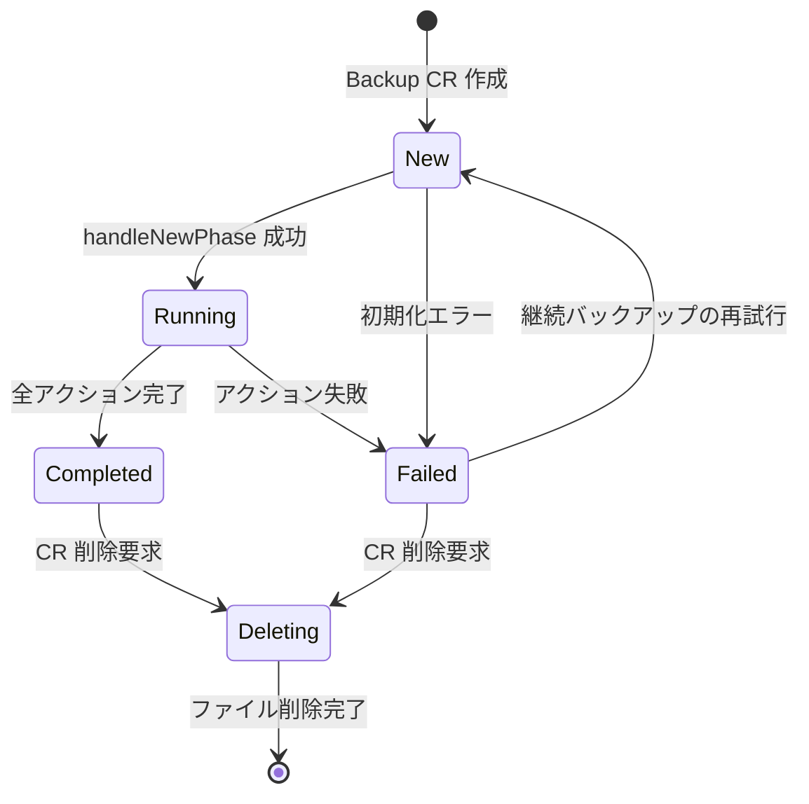
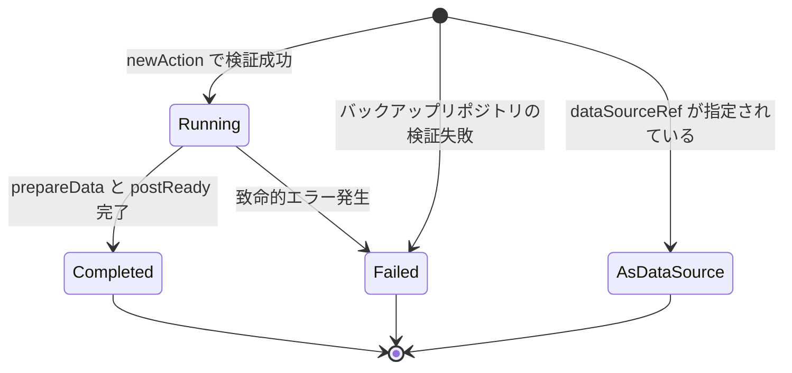
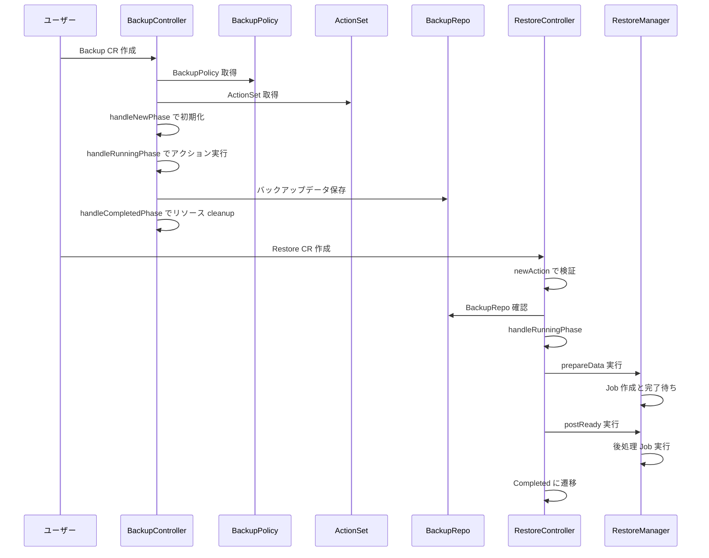

# 第12章 Backup と Restore の CRD とコントローラ

> 本章で読むソース
>
> - [apis/dataprotection/v1alpha1/backup_types.go L26-L88](https://github.com/apecloud/kubeblocks/blob/v1.0.2/apis/dataprotection/v1alpha1/backup_types.go#L26-L88)
> - [apis/dataprotection/v1alpha1/backup_types.go L236-L267](https://github.com/apecloud/kubeblocks/blob/v1.0.2/apis/dataprotection/v1alpha1/backup_types.go#L236-L267)
> - [apis/dataprotection/v1alpha1/backup_types.go L381-L453](https://github.com/apecloud/kubeblocks/blob/v1.0.2/apis/dataprotection/v1alpha1/backup_types.go#L381-L453)
> - [apis/dataprotection/v1alpha1/restore_types.go L26-L98](https://github.com/apecloud/kubeblocks/blob/v1.0.2/apis/dataprotection/v1alpha1/restore_types.go#L26-L98)
> - [apis/dataprotection/v1alpha1/restore_types.go L135-L183](https://github.com/apecloud/kubeblocks/blob/v1.0.2/apis/dataprotection/v1alpha1/restore_types.go#L135-L183)
> - [apis/dataprotection/v1alpha1/restore_types.go L460-L492](https://github.com/apecloud/kubeblocks/blob/v1.0.2/apis/dataprotection/v1alpha1/restore_types.go#L460-L492)
> - [apis/dataprotection/v1alpha1/types.go L190-L233](https://github.com/apecloud/kubeblocks/blob/v1.0.2/apis/dataprotection/v1alpha1/types.go#L190-L233)
> - [controllers/dataprotection/backup_controller.go L64-L166](https://github.com/apecloud/kubeblocks/blob/v1.0.2/controllers/dataprotection/backup_controller.go#L64-L166)
> - [controllers/dataprotection/backup_controller.go L260-L321](https://github.com/apecloud/kubeblocks/blob/v1.0.2/controllers/dataprotection/backup_controller.go#L260-L321)
> - [controllers/dataprotection/backup_controller.go L570-L681](https://github.com/apecloud/kubeblocks/blob/v1.0.2/controllers/dataprotection/backup_controller.go#L570-L681)
> - [controllers/dataprotection/restore_controller.go L55-L112](https://github.com/apecloud/kubeblocks/blob/v1.0.2/controllers/dataprotection/restore_controller.go#L55-L112)
> - [controllers/dataprotection/restore_controller.go L221-L357](https://github.com/apecloud/kubeblocks/blob/v1.0.2/controllers/dataprotection/restore_controller.go#L221-L357)

## この章の狙い

本章では KubeBlocks のデータ保護を担う `Backup` と `Restore` の CRD 定義およびコントローラを読む。
`Backup` はバックアップのライフサイクルを、`Restore` はリストアの2段階実行をモデル化する。
両 CRD の仕様と状態遷移、およびコントローラのフェーズディスパッチの仕組みを理解し、データ保護パイプライン全体の構造を把握することが本章の目的である。

## 前提

- 第8章 [Cluster コントローラ](../part02-main-controllers/08-cluster-controller.md) でコントローラパターンの基礎を読んでいる。
- 第13章 [DataProtection の Action フレームワーク](13-action-framework.md) で `ActionSet` の仕組みを学ぶが、本章では `ActionSet` を参照する箇所にとどまる。
- Kubernetes の CRD と Informer の基礎は [kubernetes 第20章](../../kubernetes/kubernetes/part07-extension/20-crd-and-aggregation.md) と [第19章](../../kubernetes/kubernetes/part07-extension/19-client-go-and-informer.md) を参照する。

## 12.1 Backup CRD のデータモデル

### 12.1.1 BackupSpec の構造

`BackupSpec` はバックアップの期望状態を定義する。
`BackupPolicyName` で参照するポリシー名を、`BackupMethod` で実行するバックアップ手法の名を指定する。

[apis/dataprotection/v1alpha1/backup_types.go L26-L88](https://github.com/apecloud/kubeblocks/blob/v1.0.2/apis/dataprotection/v1alpha1/backup_types.go#L26-L88)

```go
type BackupSpec struct {
	// ... (中略) ...
	BackupPolicyName string `json:"backupPolicyName"`

	// ... (中略) ...
	BackupMethod string `json:"backupMethod"`

	// ... (中略) ...
	DeletionPolicy BackupDeletionPolicy `json:"deletionPolicy,omitempty"`

	// ... (中略) ...
	RetentionPeriod RetentionPeriod `json:"retentionPeriod,omitempty"`

	// ... (中略) ...
	ParentBackupName string `json:"parentBackupName,omitempty"`

	// ... (中略) ...
	Parameters []ParameterPair `json:"parameters,omitempty"`
}
```

各フィールドの役割を整理する。

- `BackupPolicyName`: 適用する `BackupPolicy` の名前。作成後は変更できない。
- `BackupMethod`: ポリシー内で使用するバックアップ手法の名前。こちらも不変。
- `DeletionPolicy`: バックアップ CR 削除時のデータ保持方針。`Delete`（既定値）はリポジトリ上のデータも消す。`Retain` は物理スナップショットを残す。
- `RetentionPeriod`: バックアップの保持期間。`30d` や `6mo` などの表記を受け付ける。期限を過ぎたバックアップはガベージコレクションの対象になる。
- `ParentBackupName`: 増分または差分バックアップの親バックアップ名。
- `Parameters`: `ActionSet` の `parametersSchema` に合致する名前と値のペアのリスト。

`DeletionPolicy` は列挙型で定義される。

[apis/dataprotection/v1alpha1/backup_types.go L236-L243](https://github.com/apecloud/kubeblocks/blob/v1.0.2/apis/dataprotection/v1alpha1/backup_types.go#L236-L243)

```go
type BackupDeletionPolicy string

const (
	BackupDeletionPolicyDelete BackupDeletionPolicy = "Delete"
	BackupDeletionPolicyRetain BackupDeletionPolicy = "Retain"
)
```

### 12.1.2 BackupStatus とライフサイクルフェーズ

`BackupStatus` はバックアップの実行結果を記録する。

[apis/dataprotection/v1alpha1/backup_types.go L91-L213](https://github.com/apecloud/kubeblocks/blob/v1.0.2/apis/dataprotection/v1alpha1/backup_types.go#L91-L213)

```go
type BackupStatus struct {
	// ... (中略) ...
	FormatVersion string `json:"formatVersion,omitempty"`

	// ... (中略) ...
	Phase BackupPhase `json:"phase,omitempty"`

	// ... (中略) ...
	Expiration *metav1.Time `json:"expiration,omitempty"`

	// ... (中略) ...
	StartTimestamp *metav1.Time `json:"startTimestamp,omitempty"`

	// ... (中略) ...
	CompletionTimestamp *metav1.Time `json:"completionTimestamp,omitempty"`

	// ... (中略) ...
	Duration *metav1.Duration `json:"duration,omitempty"`

	// ... (中略) ...
	TotalSize string `json:"totalSize,omitempty"`

	// ... (中略) ...
	FailureReason string `json:"failureReason,omitempty"`

	// ... (中略) ...
	BackupRepoName string `json:"backupRepoName,omitempty"`

	// ... (中略) ...
	Path string `json:"path,omitempty"`

	// ... (中略) ...
	KopiaRepoPath string `json:"kopiaRepoPath,omitempty"`

	// ... (中略) ...
	PersistentVolumeClaimName string `json:"persistentVolumeClaimName,omitempty"`

	// ... (中略) ...
	TimeRange *BackupTimeRange `json:"timeRange,omitempty"`

	// ... (中略) ...
	Target *BackupStatusTarget `json:"target,omitempty"`

	// ... (中略) ...
	Targets []BackupStatusTarget `json:"targets,omitempty"`

	// ... (中略) ...
	BackupMethod *BackupMethod `json:"backupMethod,omitempty"`

	// ... (中略) ...
	EncryptionConfig *EncryptionConfig `json:"encryptionConfig,omitempty"`

	// ... (中略) ...
	Actions []ActionStatus `json:"actions,omitempty"`

	// ... (中略) ...
	VolumeSnapshots []VolumeSnapshotStatus `json:"volumeSnapshots,omitempty"`

	// ... (中略) ...
	ParentBackupName string `json:"parentBackupName,omitempty"`

	// ... (中略) ...
	BaseBackupName string `json:"baseBackupName,omitempty"`

	// ... (中略) ...
	Extras []map[string]string `json:"extras,omitempty"`
}
```

バックアップのライフサイクルは `BackupPhase` で表現される。

[apis/dataprotection/v1alpha1/backup_types.go L245-L267](https://github.com/apecloud/kubeblocks/blob/v1.0.2/apis/dataprotection/v1alpha1/backup_types.go#L245-L267)

```go
type BackupPhase string

const (
	// ... (中略) ...
	BackupPhaseNew BackupPhase = "New"

	// ... (中略) ...
	BackupPhaseRunning BackupPhase = "Running"

	// ... (中略) ...
	BackupPhaseCompleted BackupPhase = "Completed"

	// ... (中略) ...
	BackupPhaseFailed BackupPhase = "Failed"

	// ... (中略) ...
	BackupPhaseDeleting BackupPhase = "Deleting"
)
```

状態遷移を Mermaid で示す。



`New` から `Running` への遷移は `handleNewPhase` で初期化が成功したときに起こる。
`Running` から `Completed` への遷移はすべてのアクションが完了したとき、`Failed` はアクションのいずれかが失敗したときに遷移する。
`Deleting` は CR の削除要求を受けたときに設定され、バックアップファイルとボリュームスナップショットの削除後にファイナライザが外れて CR が消える。

### 12.1.3 ActionStatus とターゲット情報

`ActionStatus` は各バックアップアクションの実行状況を記録する。

[apis/dataprotection/v1alpha1/backup_types.go L269-L330](https://github.com/apecloud/kubeblocks/blob/v1.0.2/apis/dataprotection/v1alpha1/backup_types.go#L269-L330)

```go
type ActionStatus struct {
	// ... (中略) ...
	Name string `json:"name,omitempty"`

	// ... (中略) ...
	TargetPodName string `json:"targetPodName,omitempty"`

	// ... (中略) ...
	Phase ActionPhase `json:"phase,omitempty"`

	// ... (中略) ...
	StartTimestamp *metav1.Time `json:"startTimestamp,omitempty"`

	// ... (中略) ...
	CompletionTimestamp *metav1.Time `json:"completionTimestamp,omitempty"`

	// ... (中略) ...
	FailureReason string `json:"failureReason,omitempty"`

	// ... (中略) ...
	ActionType ActionType `json:"actionType,omitempty"`

	// ... (中略) ...
	AvailableReplicas *int32 `json:"availableReplicas,omitempty"`

	// ... (中略) ...
	ObjectRef *corev1.ObjectReference `json:"objectRef,omitempty"`

	// ... (中略) ...
	TotalSize string `json:"totalSize,omitempty"`

	// ... (中略) ...
	TimeRange *BackupTimeRange `json:"timeRange,omitempty"`

	// ... (中略) ...
	VolumeSnapshots []VolumeSnapshotStatus `json:"volumeSnapshots,omitempty"`
}
```

`ActionType` は `Job` か `StatefulSet` のいずれかを取る。

[apis/dataprotection/v1alpha1/backup_types.go L381-L387](https://github.com/apecloud/kubeblocks/blob/v1.0.2/apis/dataprotection/v1alpha1/backup_types.go#L381-L387)

```go
type ActionType string

const (
	ActionTypeJob         ActionType = "Job"
	ActionTypeStatefulSet ActionType = "StatefulSet"
	ActionTypeNone        ActionType = ""
)
```

バックアップはターゲットポッドに対して `Job` または `StatefulSet` を起動してデータを取得する。
各アクションは個別に状態を持ち、コントローラはそれらをまとめて全体のフェーズを判定する。

### 12.1.4 Backup オブジェクトとヘルパーメソッド

`Backup` 型は Kubernetes の CRD オブジェクトとして登録される。

[apis/dataprotection/v1alpha1/backup_types.go L406-L412](https://github.com/apecloud/kubeblocks/blob/v1.0.2/apis/dataprotection/v1alpha1/backup_types.go#L406-L412)

```go
type Backup struct {
	metav1.TypeMeta   `json:",inline"`
	metav1.ObjectMeta `json:"metadata,omitempty"`

	Spec   BackupSpec   `json:"spec,omitempty"`
	Status BackupStatus `json:"status,omitempty"`
}
```

ヘルパーメソッド `GetStartTime` と `GetEndTime` は、PITR（Point-in-Time Recovery）向けに `TimeRange` を優先して返す。

[apis/dataprotection/v1alpha1/backup_types.go L427-L445](https://github.com/apecloud/kubeblocks/blob/v1.0.2/apis/dataprotection/v1alpha1/backup_types.go#L427-L445)

```go
func (r *Backup) GetStartTime() *metav1.Time {
	s := r.Status
	if s.TimeRange != nil && s.TimeRange.Start != nil {
		return s.TimeRange.Start
	}
	return s.StartTimestamp
}

func (r *Backup) GetEndTime() *metav1.Time {
	s := r.Status
	if s.TimeRange != nil && s.TimeRange.End != nil {
		return s.TimeRange.End
	}
	return s.CompletionTimestamp
}
```

継続的バックアップでは `StartTimestamp` と `CompletionTimestamp` が実行の開始と終了を表すのに対し、`TimeRange` は回復可能なデータの時間範囲を示す。
この2つを区別することで、PITR 時に任意の時点への復元が可能かどうかを判定できる。

## 12.2 Restore CRD のデータモデル

### 12.2.1 RestoreSpec の構造

`RestoreSpec` はリストアの期望状態を定義する。
`Backup` との主な違いは、リストアが2段階（`prepareData` と `postReady`）で構成される点である。

[apis/dataprotection/v1alpha1/restore_types.go L26-L98](https://github.com/apecloud/kubeblocks/blob/v1.0.2/apis/dataprotection/v1alpha1/restore_types.go#L26-L98)

```go
type RestoreSpec struct {
	// ... (中略) ...
	Backup BackupRef `json:"backup"`

	// ... (中略) ...
	RestoreTime string `json:"restoreTime,omitempty"`

	// ... (中略) ...
	Resources *RestoreKubeResources `json:"resources,omitempty"`

	// ... (中略) ...
	PrepareDataConfig *PrepareDataConfig `json:"prepareDataConfig,omitempty"`

	// ... (中略) ...
	ServiceAccountName string `json:"serviceAccountName,omitempty"`

	// ... (中略) ...
	ReadyConfig *ReadyConfig `json:"readyConfig,omitempty"`

	// ... (中略) ...
	Env []corev1.EnvVar `json:"env,omitempty" patchStrategy:"merge" patchMergeKey:"name"`

	// ... (中略) ...
	ContainerResources corev1.ResourceRequirements `json:"containerResources,omitempty"`

	// ... (中略) ...
	BackoffLimit *int32 `json:"backoffLimit,omitempty"`

	// ... (中略) ...
	Parameters []ParameterPair `json:"parameters,omitempty"`
}
```

各フィールドの役割を整理する。

- `Backup`: 復元元バックアップの名前と名前空間。`SourceTargetName` でソースターゲットを指定できる。
- `RestoreTime`: PITR の場合に復元する時点。`2024-01-01T00:00:00Z` 形式。
- `Resources`: 復元する Kubernetes リソースの指定。
- `PrepareDataConfig`: データ準備フェーズの設定。PVC の復元方法やスケジューリングを指定する。
- `ReadyConfig`: データ準備完了後の後処理フェーズの設定。Job アクションや Exec アクションを指定する。
- `Env`: バックアップおよび `ActionSet` の環境変数とマージされる追加の環境変数。優先順位は `Restore env > Backup env > ActionSet env`。

### 12.2.2 2段階のリストア構成

リストアは `prepareData` と `postReady` の2段階で実行される。

`PrepareDataConfig` はデータ準備フェーズの設定を保持する。

[apis/dataprotection/v1alpha1/restore_types.go L135-L183](https://github.com/apecloud/kubeblocks/blob/v1.0.2/apis/dataprotection/v1alpha1/restore_types.go#L135-L183)

```go
type PrepareDataConfig struct {

	// ... (中略) ...
	RequiredPolicyForAllPodSelection *RequiredPolicyForAllPodSelection `json:"requiredPolicyForAllPodSelection,omitempty"`

	// ... (中略) ...
	DataSourceRef *VolumeConfig `json:"dataSourceRef,omitempty"`

	// ... (中略) ...
	RestoreVolumeClaims []RestoreVolumeClaim `json:"volumeClaims,omitempty"`

	// ... (中略) ...
	RestoreVolumeClaimsTemplate *RestoreVolumeClaimsTemplate `json:"volumeClaimsTemplate,omitempty"`

	// ... (中略) ...
	VolumeClaimRestorePolicy VolumeClaimRestorePolicy `json:"volumeClaimRestorePolicy"`

	// ... (中略) ...
	SchedulingSpec SchedulingSpec `json:"schedulingSpec,omitempty"`
}
```

`VolumeClaimRestorePolicy` は PVC の復元方式を指定する。

[apis/dataprotection/v1alpha1/types.go L228-L233](https://github.com/apecloud/kubeblocks/blob/v1.0.2/apis/dataprotection/v1alpha1/types.go#L228-L233)

```go
type VolumeClaimRestorePolicy string

const (
	VolumeClaimRestorePolicyParallel VolumeClaimRestorePolicy = "Parallel"
	VolumeClaimRestorePolicySerial   VolumeClaimRestorePolicy = "Serial"
)
```

`Parallel` は複数の PVC を並列で復元する。
`Serial` は1つずつ順番に復元する。

`ReadyConfig` はデータ準備完了後の後処理を定義する。

[apis/dataprotection/v1alpha1/restore_types.go L185-L207](https://github.com/apecloud/kubeblocks/blob/v1.0.2/apis/dataprotection/v1alpha1/restore_types.go#L185-L207)

```go
type ReadyConfig struct {
	// ... (中略) ...
	JobAction *JobAction `json:"jobAction,omitempty"`

	// ... (中略) ...
	ExecAction *ExecAction `json:"execAction,omitempty"`

	// ... (中略) ...
	ConnectionCredential *ConnectionCredential `json:"connectionCredential,omitempty"`

	// ... (中略) ...
	ReadinessProbe *ReadinessProbe `json:"readinessProbe,omitempty"`
}
```

`JobAction` は Kubernetes Job を起動して後処理を実行する。
`ExecAction` は既存のポッド内でコマンドを実行する。

### 12.2.3 RestoreStatus とフェーズ

`RestoreStatus` はリストアの実行状況を記録する。

[apis/dataprotection/v1alpha1/restore_types.go L461-L492](https://github.com/apecloud/kubeblocks/blob/v1.0.2/apis/dataprotection/v1alpha1/restore_types.go#L461-L492)

```go
type RestoreStatus struct {
	// ... (中略) ...
	Phase RestorePhase `json:"phase,omitempty"`

	// ... (中略) ...
	StartTimestamp *metav1.Time `json:"startTimestamp,omitempty"`

	// ... (中略) ...
	CompletionTimestamp *metav1.Time `json:"completionTimestamp,omitempty"`

	// ... (中略) ...
	Duration *metav1.Duration `json:"duration,omitempty"`

	// ... (中略) ...
	Actions RestoreStatusActions `json:"actions,omitempty"`

	// ... (中略) ...
	Conditions []metav1.Condition `json:"conditions,omitempty"`
}
```

`RestorePhase` は `types.go` で定義される。

[apis/dataprotection/v1alpha1/types.go L193-L199](https://github.com/apecloud/kubeblocks/blob/v1.0.2/apis/dataprotection/v1alpha1/types.go#L193-L199)

```go
type RestorePhase string

const (
	RestorePhaseRunning      RestorePhase = "Running"
	RestorePhaseCompleted    RestorePhase = "Completed"
	RestorePhaseFailed       RestorePhase = "Failed"
	RestorePhaseAsDataSource RestorePhase = "AsDataSource"
)
```

`AsDataSource` は `dataSourceRef` を使った復元で、リストアが PVC のデータソースとして機能する特殊なフェーズである。



`Restore` の状態遷移は `Backup` より単純である。
初期フェーズで `Backup` リポジトリの存在確認と検証を行い、成功すれば `Running` へ遷移する。
`Running` では `prepareData` と `postReady` の2段階を順に処理し、両方が完了すれば `Completed` になる。

## 12.3 Backup コントローラのフェーズディスパッチ

### 12.3.1 BackupReconciler の構造

`BackupReconciler` は `Backup` CR のリコンサイラである。

[controllers/dataprotection/backup_controller.go L64-L70](https://github.com/apecloud/kubeblocks/blob/v1.0.2/controllers/dataprotection/backup_controller.go#L64-L70)

```go
type BackupReconciler struct {
	client.Client
	Scheme     *k8sruntime.Scheme
	Recorder   record.EventRecorder
	RestConfig *rest.Config
	clock      clock.RealClock
}
```

`SetupWithManager` で `Backup` をメインリソースとし、`StatefulSet`、`Job`、`Pod`、`VolumeSnapshot` を監視対象に登録する。

[controllers/dataprotection/backup_controller.go L149-L166](https://github.com/apecloud/kubeblocks/blob/v1.0.2/controllers/dataprotection/backup_controller.go#L149-L166)

```go
func (r *BackupReconciler) SetupWithManager(mgr ctrl.Manager) error {
	b := intctrlutil.NewControllerManagedBy(mgr).
		For(&dpv1alpha1.Backup{}).
		WithOptions(controller.Options{
			MaxConcurrentReconciles: viper.GetInt(dptypes.CfgDataProtectionReconcileWorkers),
		}).
		Owns(&appsv1.StatefulSet{}).
		Owns(&batchv1.Job{}).
		Watches(&corev1.Pod{}, handler.EnqueueRequestsFromMapFunc(r.filterBackupPods)).
		Watches(&batchv1.Job{}, handler.EnqueueRequestsFromMapFunc(r.parseBackupJob))

	if dputils.SupportsVolumeSnapshotV1() {
		b.Owns(&vsv1.VolumeSnapshot{}, builder.Predicates{})
	} else {
		b.Owns(&vsv1beta1.VolumeSnapshot{}, builder.Predicates{})
	}
	return b.Complete(r)
}
```

`MaxConcurrentReconciles` に設定値を渡すことで、バックアップリコンサイラが並列に動作するワーカー数を制御している。
データベースのバックアップはクラスタ数に比例して増加するため、並列度の制御は重要な最適化ポイントである。

### 12.3.2 Reconcile メソッドのフェーズディスパッチ

`Reconcile` メソッドは現在のフェーズに応じてハンドラを呼び分ける。

[controllers/dataprotection/backup_controller.go L91-L146](https://github.com/apecloud/kubeblocks/blob/v1.0.2/controllers/dataprotection/backup_controller.go#L91-L146)

```go
func (r *BackupReconciler) Reconcile(ctx context.Context, req ctrl.Request) (ctrl.Result, error) {
	reqCtx := intctrlutil.RequestCtx{
		Ctx:      ctx,
		Req:      req,
		Log:      log.FromContext(ctx).WithValues("backup", req.NamespacedName),
		Recorder: r.Recorder,
	}

	backup := &dpv1alpha1.Backup{}
	if err := r.Client.Get(reqCtx.Ctx, reqCtx.Req.NamespacedName, backup); err != nil {
		return intctrlutil.CheckedRequeueWithError(err, reqCtx.Log, "")
	}

	// ... (中略) ...

	if !backup.GetDeletionTimestamp().IsZero() && backup.Status.Phase != dpv1alpha1.BackupPhaseDeleting {
		patch := client.MergeFrom(backup.DeepCopy())
		backup.Status.Phase = dpv1alpha1.BackupPhaseDeleting
		if err := r.Client.Status().Patch(reqCtx.Ctx, backup, patch); err != nil {
			return intctrlutil.RequeueWithError(err, reqCtx.Log, "")
		}
	}

	switch backup.Status.Phase {
	case "", dpv1alpha1.BackupPhaseNew:
		return r.handleNewPhase(reqCtx, backup)
	case dpv1alpha1.BackupPhaseRunning:
		return r.handleRunningPhase(reqCtx, backup)
	case dpv1alpha1.BackupPhaseCompleted:
		return r.handleCompletedPhase(reqCtx, backup)
	case dpv1alpha1.BackupPhaseDeleting:
		return r.handleDeletingPhase(reqCtx, backup)
	case dpv1alpha1.BackupPhaseFailed:
		if backup.Labels[dptypes.BackupTypeLabelKey] == string(dpv1alpha1.BackupTypeContinuous) {
			if backup.Status.StartTimestamp.IsZero() {
				return r.handleNewPhase(reqCtx, backup)
			}
			return r.handleRunningPhase(reqCtx, backup)
		}
		return intctrlutil.Reconciled()
	default:
		return intctrlutil.Reconciled()
	}
}
```

処理の流れを整理する。

1. `Backup` CR を取得する。存在しなければリターンする。
2. `SkipReconciliationAnnotationKey` アノテーションが `true` であればスキップする。
3. 削除タイムスタンプが設定されており、かつフェーズが `Deleting` でなければ `Deleting` に更新する。
4. フェーズに応じてハンドラを呼び出す。

`Failed` フェーズの継続的バックアップは特別扱いされる。
`StartTimestamp` が未設定であれば `New` フェーズのハンドラから再試行し、設定済みであれば `Running` フェーズのハンドラで継続する。
これは継続的バックアップが一時的なエラーから自動復帰するための仕組みである。

### 12.3.3 handleNewPhase の処理

`handleNewPhase` はバックアップの初期化を行う。

[controllers/dataprotection/backup_controller.go L294-L321](https://github.com/apecloud/kubeblocks/blob/v1.0.2/controllers/dataprotection/backup_controller.go#L294-L321)

```go
func (r *BackupReconciler) handleNewPhase(
	reqCtx intctrlutil.RequestCtx,
	backup *dpv1alpha1.Backup) (ctrl.Result, error) {

	request, err := r.prepareBackupRequest(reqCtx, backup)
	if err != nil {
		return r.updateStatusIfFailed(reqCtx, backup.DeepCopy(), backup, err)
	}

	if err = r.recordBackupStatusTargets(reqCtx, request); err != nil {
		return r.updateStatusIfFailed(reqCtx, backup, request.Backup, err)
	}
	backupStatusCopy := request.Backup.Status.DeepCopy()
	if wait, err := PatchBackupObjectMeta(backup, request); err != nil {
		return r.updateStatusIfFailed(reqCtx, backup, request.Backup, err)
	} else if wait {
		return intctrlutil.Reconciled()
	}
	request.Backup.Status = *backupStatusCopy
	if err = r.patchBackupStatus(backup, request); err != nil {
		return r.updateStatusIfFailed(reqCtx, backup, request.Backup, err)
	}
	return intctrlutil.Reconciled()
}
```

処理の流れを整理する。

1. `prepareBackupRequest` で `BackupPolicy` と `ActionSet` を取得し、リクエストオブジェクトを構築する。
2. `recordBackupStatusTargets` でバックアップのターゲットポッド情報を記録する。
3. `PatchBackupObjectMeta` でラベル、アノテーション、ファイナライザを設定する。
4. `patchBackupStatus` でステータスを更新し、フェーズを `Running` に遷移する。

`prepareBackupRequest` はバックアップポリシーとバックアップメソッドの解決、`ActionSet` の取得、パラメータの検証、暗号化設定の確認、バックアップタイプ別の追加処理を行う。

### 12.3.4 handleRunningPhase の処理

`handleRunningPhase` はバックアップアクションの実行状況を監視し、完了または失敗を判定する。

[controllers/dataprotection/backup_controller.go L570-L681](https://github.com/apecloud/kubeblocks/blob/v1.0.2/controllers/dataprotection/backup_controller.go#L570-L681)

```go
func (r *BackupReconciler) handleRunningPhase(
	reqCtx intctrlutil.RequestCtx,
	backup *dpv1alpha1.Backup) (ctrl.Result, error) {
	restoreInProgress, err := r.checkRestoreInProgress(reqCtx, backup)
	if err != nil {
		return RecorderEventAndRequeue(reqCtx, r.Recorder, backup, err)
	}
	if restoreInProgress {
		msg := "backup job is delayed because restore is in progress"
		r.Recorder.Event(backup, corev1.EventTypeWarning, "RestoreInProgress", msg)
		return intctrlutil.Requeue(reqCtx.Log, msg)
	}

	if backup.Labels[dptypes.BackupTypeLabelKey] == string(dpv1alpha1.BackupTypeContinuous) {
		if completed, err := r.checkIsCompletedDuringRunning(reqCtx, backup); err != nil {
			return RecorderEventAndRequeue(reqCtx, r.Recorder, backup, err)
		} else if completed {
			return intctrlutil.Reconciled()
		}
	}
	request, err := r.prepareBackupRequest(reqCtx, backup)
	// ... (中略) ...
	var (
		existFailedAction bool
		waiting           bool
		actionCtx         = action.ActionContext{
			Ctx:              reqCtx.Ctx,
			Client:           r.Client,
			Recorder:         r.Recorder,
			Scheme:           r.Scheme,
			RestClientConfig: r.RestConfig,
		}
		targets = dputils.GetBackupTargets(request.BackupPolicy, request.BackupMethod)
	)
	for i := range targets {
		// ... (中略) ...
		actions, err := request.BuildActions()
		// ... (中略) ...
		for targetPodName, acts := range actions {
		targetPodBackupActions:
			for _, act := range acts {
				status, err := act.Execute(actionCtx)
				// ... (中略) ...
				mergeActionStatus(request, status)
				switch status.Phase {
				case dpv1alpha1.ActionPhaseCompleted:
					updateBackupStatusByActionStatus(&request.Status)
					continue
				case dpv1alpha1.ActionPhaseFailed:
					existFailedAction = true
					break targetPodBackupActions
				case dpv1alpha1.ActionPhaseRunning:
					waiting = true
					break targetPodBackupActions
				}
			}
		}
	}
	// ... (中略) ...
}
```

処理の流れを整理する。

1. `checkRestoreInProgress` でリストアが実行中かどうかを確認する。リストア中はバックアップジョブを遅延させる。
2. 継続的バックアップの場合、`checkIsCompletedDuringRunning` で完了条件をチェックする。
3. 各ターゲットに対してアクションを構築し、実行する。
4. アクションの状態に応じて `Completed`、`Failed`、`Running` を判定する。
5. すべてのアクションが完了すれば `BackupPhaseCompleted` に遷移する。

`checkRestoreInProgress` は `Cluster` のアノテーションに `RestoreFromBackupAnnotationKey` が存在するかどうかでリストア中かを判定する。
これにより、リストア実行中にバックアップが走ってデータを壊すのを防ぐ。

### 12.3.5 handleDeletingPhase の処理

`handleDeletingPhase` はバックアップの削除処理を行う。

[controllers/dataprotection/backup_controller.go L260-L292](https://github.com/apecloud/kubeblocks/blob/v1.0.2/controllers/dataprotection/backup_controller.go#L260-L292)

```go
func (r *BackupReconciler) handleDeletingPhase(reqCtx intctrlutil.RequestCtx, backup *dpv1alpha1.Backup) (ctrl.Result, error) {
	if err := r.deleteRelatedBackups(reqCtx, backup); err != nil {
		return intctrlutil.RequeueWithError(err, reqCtx.Log, "")
	}

	if err := r.deleteExternalResources(reqCtx, backup); err != nil {
		return intctrlutil.RequeueWithError(err, reqCtx.Log, "")
	}

	if backup.Spec.DeletionPolicy == dpv1alpha1.BackupDeletionPolicyRetain {
		r.Recorder.Event(backup, corev1.EventTypeWarning, "Retain", "can not delete the backup if deletionPolicy is Retain")
		return intctrlutil.Reconciled()
	}

	if cleaned, err := r.waitForBackupPodsDeleted(reqCtx, backup); err != nil {
		return intctrlutil.RequeueWithError(err, reqCtx.Log, "")
	} else if !cleaned {
		return intctrlutil.Reconciled()
	}

	if err := r.deleteVolumeSnapshots(reqCtx, backup); err != nil {
		return intctrlutil.RequeueWithError(err, reqCtx.Log, "")
	}

	if err := r.deleteBackupFiles(reqCtx, backup); err != nil {
		return intctrlutil.RequeueWithError(err, reqCtx.Log, "")
	}
	return intctrlutil.Reconciled()
}
```

処理の流れを整理する。

1. `deleteRelatedBackups` で増分バックアップの子バックアップを削除する。
2. `deleteExternalResources` で関連する `Job` と `StatefulSet` を削除する。
3. `DeletionPolicy` が `Retain` であれば、バックアップファイルを残して処理を終了する。
4. バックアップ用ポッドの削除完了を待つ。
5. `deleteVolumeSnapshots` でボリュームスナップショットを削除する。
6. `deleteBackupFiles` でバックアップリポジトリ上のファイルを削除する。

## 12.4 Restore コントローラの2段階実行

### 12.4.1 RestoreReconciler の構造

`RestoreReconciler` は `Restore` CR のリコンサイラである。

[controllers/dataprotection/restore_controller.go L55-L59](https://github.com/apecloud/kubeblocks/blob/v1.0.2/controllers/dataprotection/restore_controller.go#L55-L59)

```go
type RestoreReconciler struct {
	client.Client
	Scheme   *runtime.Scheme
	Recorder record.EventRecorder
}
```

`SetupWithManager` で `Restore` をメインリソースとし、`Job` と `Pod` を監視対象に登録する。

[controllers/dataprotection/restore_controller.go L104-L112](https://github.com/apecloud/kubeblocks/blob/v1.0.2/controllers/dataprotection/restore_controller.go#L104-L112)

```go
func (r *RestoreReconciler) SetupWithManager(mgr ctrl.Manager) error {
	return intctrlutil.NewControllerManagedBy(mgr).
		For(&dpv1alpha1.Restore{}).
		Owns(&batchv1.Job{}).
		Watches(&batchv1.Job{}, handler.EnqueueRequestsFromMapFunc(r.parseRestoreJob)).
		Watches(&corev1.Pod{}, handler.EnqueueRequestsFromMapFunc(r.parseRestorePod)).
		Complete(r)
}
```

### 12.4.2 Reconcile メソッドのフェーズディスパッチ

`Reconcile` メソッドはファイナライザの処理とフェーズディスパッチを行う。

[controllers/dataprotection/restore_controller.go L68-L101](https://github.com/apecloud/kubeblocks/blob/v1.0.2/controllers/dataprotection/restore_controller.go#L68-L101)

```go
func (r *RestoreReconciler) Reconcile(ctx context.Context, req ctrl.Request) (ctrl.Result, error) {
	reqCtx := intctrlutil.RequestCtx{
		Ctx:      ctx,
		Req:      req,
		Log:      log.FromContext(ctx).WithValues("restore", req.NamespacedName),
		Recorder: r.Recorder,
	}

	restore := &dpv1alpha1.Restore{}
	if err := r.Client.Get(reqCtx.Ctx, reqCtx.Req.NamespacedName, restore); err != nil {
		return intctrlutil.CheckedRequeueWithError(err, reqCtx.Log, "")
	}

	res, err := intctrlutil.HandleCRDeletion(reqCtx, r, restore, dptypes.DataProtectionFinalizerName, func() (*ctrl.Result, error) {
		return nil, r.deleteExternalResources(reqCtx, restore)
	})
	if res != nil {
		return *res, err
	}

	switch restore.Status.Phase {
	case "":
		return r.newAction(reqCtx, restore)
	case dpv1alpha1.RestorePhaseRunning:
		return r.handleRunningPhase(reqCtx, restore)
	case dpv1alpha1.RestorePhaseCompleted:
		if err = r.deleteExternalResources(reqCtx, restore); err != nil {
			return intctrlutil.RequeueWithError(err, reqCtx.Log, "")
		}
	}
	return intctrlutil.Reconciled()
}
```

`Backup` コントローラと異なり、`Restore` は初期フェーズが空文字列で表現される。
`HandleCRDeletion` でファイナライザの処理を行い、その後にフェーズディスパッチを行う。

### 12.4.3 newAction での初期化

`newAction` はリストアの初期化を行う。

[controllers/dataprotection/restore_controller.go L221-L292](https://github.com/apecloud/kubeblocks/blob/v1.0.2/controllers/dataprotection/restore_controller.go#L221-L292)

```go
func (r *RestoreReconciler) newAction(reqCtx intctrlutil.RequestCtx, restore *dpv1alpha1.Restore) (ctrl.Result, error) {
	oldRestore := restore.DeepCopy()
	patch := client.MergeFrom(oldRestore)
	// ... (中略) ...
	waitBackupRepo := false
	repoName, err := CheckBackupRepoForRestore(reqCtx, r.Client, restore)
	switch {
	case intctrlutil.IsTargetError(err, intctrlutil.ErrorTypeFatal):
		// ... (中略) ...
		restore.Status.Phase = dpv1alpha1.RestorePhaseFailed
		restore.Status.CompletionTimestamp = &metav1.Time{Time: time.Now()}
		// ... (中略) ...
	case intctrlutil.IsTargetError(err, dperrors.ErrorTypeWaitForBackupRepoPreparation):
		// ... (中略) ...
		waitBackupRepo = true
		// ... (中略) ...
	// ... (中略) ...
	}
	// ... (中略) ...
	if restore.Spec.PrepareDataConfig != nil && restore.Spec.PrepareDataConfig.DataSourceRef != nil {
		restore.Status.Phase = dpv1alpha1.RestorePhaseAsDataSource
	} else {
		err := r.validateAndBuildMGR(reqCtx, dprestore.NewRestoreManager(restore, r.Recorder, r.Scheme, r.Client))
		switch {
		case intctrlutil.IsTargetError(err, intctrlutil.ErrorTypeFatal):
			restore.Status.Phase = dpv1alpha1.RestorePhaseFailed
			// ... (中略) ...
		case err != nil:
			return RecorderEventAndRequeue(reqCtx, r.Recorder, restore, err)
		default:
			restore.Status.StartTimestamp = &metav1.Time{Time: time.Now()}
			restore.Status.Phase = dpv1alpha1.RestorePhaseRunning
			r.Recorder.Event(restore, corev1.EventTypeNormal, dprestore.ReasonRestoreStarting, "start to restore")
		}
	}
	// ... (中略) ...
}
```

処理の流れを整理する。

1. `CheckBackupRepoForRestore` でバックアップリポジトリの存在と準備状況を確認する。
2. リポジトリが未準備の場合は待機する。致命的エラーの場合は `Failed` に遷移する。
3. `dataSourceRef` が指定されている場合は `AsDataSource` フェーズに遷移する。
4. それ以外の場合は `validateAndBuildMGR` で検証とマネージャの構築を行い、成功すれば `Running` に遷移する。

### 12.4.4 HandleRestoreActions の2段階処理

`handleRunningPhase` は `HandleRestoreActions` を呼び出し、2段階のリストアを実行する。

[controllers/dataprotection/restore_controller.go L333-L357](https://github.com/apecloud/kubeblocks/blob/v1.0.2/controllers/dataprotection/restore_controller.go#L333-L357)

```go
func (r *RestoreReconciler) HandleRestoreActions(reqCtx intctrlutil.RequestCtx, restoreMgr *dprestore.RestoreManager) error {
	reqCtx.Log.V(1).Info("start to prepare data", "restore", reqCtx.Req.NamespacedName)
	isCompleted, err := r.prepareData(reqCtx, restoreMgr)
	if err != nil {
		return err
	}
	if !isCompleted {
		return nil
	}
	reqCtx.Log.V(1).Info("start to restore data after ready", "restore", reqCtx.Req.NamespacedName)
	isCompleted, err = r.postReady(reqCtx, restoreMgr)
	if err != nil {
		return err
	}
	if isCompleted {
		restoreMgr.Restore.Status.Phase = dpv1alpha1.RestorePhaseCompleted
		restoreMgr.Restore.Status.CompletionTimestamp = &metav1.Time{Time: time.Now()}
		restoreMgr.Restore.Status.Duration = dprestore.GetRestoreDuration(restoreMgr.Restore.Status)
		r.Recorder.Event(restoreMgr.Restore, corev1.EventTypeNormal, dprestore.ReasonRestoreCompleted, "restore completed.")
	}
	return nil
}
```

処理の流れを整理する。

1. `prepareData` でデータ準備フェーズを実行する。
2. 完了しなければリターンする。次のリコンサイクルで再開する。
3. `postReady` で後処理フェーズを実行する。
4. 両方が完了すれば `Completed` に遷移する。

## 12.5 バックアップとリストアの全体フロー

`Backup` と `Restore` の関係性を Mermaid で示す。



## 12.6 最適化の工夫

### 12.6.1 並列リコンサイラワーカー

`BackupReconciler` の `SetupWithManager` では `MaxConcurrentReconciles` に設定値を渡している。

[controllers/dataprotection/backup_controller.go L152-L154](https://github.com/apecloud/kubeblocks/blob/v1.0.2/controllers/dataprotection/backup_controller.go#L152-L154)

```go
WithOptions(controller.Options{
	MaxConcurrentReconciles: viper.GetInt(dptypes.CfgDataProtectionReconcileWorkers),
}).
```

バックアップはクラスタの数に比例して増加するリソースである。
ワーカー数を設定で制御できることで、大規模環境でのリコンサイクルの遅延を防ぐ。
これは controller-runtime の標準的な最適化機構であり、バックアップのように数が多い CRD では特に重要である。

### 12.6.2 リストア中のバックアップ遅延

`handleRunningPhase` では `checkRestoreInProgress` でリストア実行中かをチェックし、リストア中であればバックアップジョブを遅延させる。

[controllers/dataprotection/backup_controller.go L573-L581](https://github.com/apecloud/kubeblocks/blob/v1.0.2/controllers/dataprotection/backup_controller.go#L573-L581)

```go
restoreInProgress, err := r.checkRestoreInProgress(reqCtx, backup)
if err != nil {
	return RecorderEventAndRequeue(reqCtx, r.Recorder, backup, err)
}
if restoreInProgress {
	msg := "backup job is delayed because restore is in progress"
	r.Recorder.Event(backup, corev1.EventTypeWarning, "RestoreInProgress", msg)
	return intctrlutil.Requeue(reqCtx.Log, msg)
}
```

リストア中にバックアップが実行されると、データの整合性が損なわれる可能性がある。
このチェックにより、リストア完了後にバックアップが実行されることが保証される。

## まとめ

本章では `Backup` と `Restore` の CRD とコントローラを読んだ。

- `Backup` CRD は `BackupSpec` でポリシーと手法を指定し、`BackupStatus` でライフサイクルフェーズを管理する。
- `BackupReconciler` はフェーズディスパッチにより `New`、`Running`、`Completed`、`Deleting`、`Failed` の各状態を処理する。
- `Restore` CRD は `prepareData` と `postReady` の2段階でリストアを実行する。
- `RestoreReconciler` は初期化時にバックアップリポジトリの存在を確認し、`Running` フェーズで2段階のアクションを順次実行する。
- 並列リコンサイラワーカーとリストア中のバックアップ遅延が最適化の工夫である。

## 関連する章

- [第13章 DataProtection の Action フレームワーク](13-action-framework.md): `ActionSet` の仕組みとバックアップアクションの実装詳細。
- [第8章 Cluster コントローラ](../part02-main-controllers/08-cluster-controller.md): `Cluster` CRD とコントローラの基礎。
- [kubernetes 第19章 client-go と Informer](../../kubernetes/kubernetes/part07-extension/19-client-go-and-informer.md): Informer と WorkQueue の基礎。
