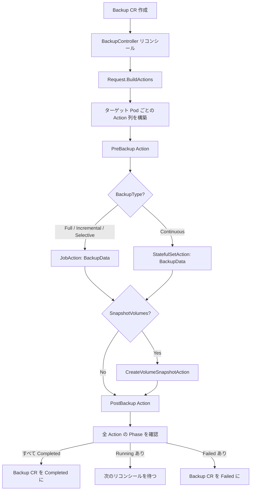

# 第13章 DataProtection の Action フレームワーク

> 本章で読むソース:
>
> - [pkg/dataprotection/action/action.go L33-L51](https://github.com/apecloud/kubeblocks/blob/v1.0.2/pkg/dataprotection/action/action.go#L33-L51)
> - [pkg/dataprotection/action/action_job.go L39-L139](https://github.com/apecloud/kubeblocks/blob/v1.0.2/pkg/dataprotection/action/action_job.go#L39-L139)
> - [pkg/dataprotection/action/action_exec.go L35-L111](https://github.com/apecloud/kubeblocks/blob/v1.0.2/pkg/dataprotection/action/action_exec.go#L35-L111)
> - [pkg/dataprotection/action/action_create_vs.go L44-L279](https://github.com/apecloud/kubeblocks/blob/v1.0.2/pkg/dataprotection/action/action_create_vs.go#L44-L279)
> - [pkg/dataprotection/action/action_stateful.go L42-L217](https://github.com/apecloud/kubeblocks/blob/v1.0.2/pkg/dataprotection/action/action_stateful.go#L42-L217)
> - [pkg/dataprotection/action/builder_status.go L29-L110](https://github.com/apecloud/kubeblocks/blob/v1.0.2/pkg/dataprotection/action/builder_status.go#L29-L110)
> - [pkg/dataprotection/backup/request.go L53-L597](https://github.com/apecloud/kubeblocks/blob/v1.0.2/pkg/dataprotection/backup/request.go#L53-L597)
> - [pkg/dataprotection/backup/deleter.go L60-L394](https://github.com/apecloud/kubeblocks/blob/v1.0.2/pkg/dataprotection/backup/deleter.go#L60-L394)

## この章の狙い

第12章では `Backup` と `Restore` の CRD 構造とコントローラの全体像を見た。
本章では、バックアップの実際の作業を担う Action フレームワークの内部に入る。
`Action` インタフェースを中心に、4種類の実装（`JobAction`、`ExecAction`、`CreateVolumeSnapshotAction`、`StatefulSetAction`）がどのように整理されているかを追う。
さらに `backup` パッケージの `Request` 型が `ActionSet` CRD から具体的な Action の列を構築する過程と、`Deleter` によるバックアップファイルの削除フローを確認する。

## 前提

- 第12章で `Backup`、`BackupPolicy`、`ActionSet` の CRD 構造とコントローラの概要を読んでいる。
- Kubernetes の `Job`、`StatefulSet`、`VolumeSnapshot` の基本を理解している。

## Action インタフェース

Action フレームワークの中心は `Action` インタフェースである。

[pkg/dataprotection/action/action.go L33-L51](https://github.com/apecloud/kubeblocks/blob/v1.0.2/pkg/dataprotection/action/action.go#L33-L51)

```go
type Action interface {
	// Execute executes the action.
	Execute(actCtx ActionContext) (*dpv1alpha1.ActionStatus, error)

	// GetName returns the Name of the action.
	GetName() string

	// Type returns the type of the action.
	Type() dpv1alpha1.ActionType
}

type ActionContext struct {
	Ctx      context.Context
	Client   client.Client
	Recorder record.EventRecorder

	Scheme           *runtime.Scheme
	RestClientConfig *rest.Config
}
```

`Action` は3つのメソッドを持つ。
`Execute` は Action の本体を実行し、`ActionStatus` を返す。
`GetName` は Action の名前、`Type` は `ActionType`（`Job`、`StatefulSet`、空文字列のいずれか）を返す。
`ActionContext` は `context.Context`、`client.Client`、`record.EventRecorder`、`runtime.Scheme`、`rest.Config` を束ねた構造体で、Action の実行に必要な依存をまとめて受け渡す役割を持つ。

`ActionType` の定義は `backup_types.go` にある。

[pkg/dataprotection/action/action.go L33-L42](https://github.com/apecloud/kubeblocks/blob/v1.0.2/pkg/dataprotection/action/action.go#L33-L42)

```go
type Action interface {
	Execute(actCtx ActionContext) (*dpv1alpha1.ActionStatus, error)
	GetName() string
	Type() dpv1alpha1.ActionType
}
```

このインタフェースを満たす具象型は4つ存在する。
表13-1に整理する。

| 型名 | `Type()` の戻り値 | 用途 |
|------|-------------------|------|
| `JobAction` | `ActionTypeJob` | Kubernetes Job を作成してコマンドを実行 |
| `ExecAction` | `ActionTypeJob`（継承） | Pod への `kubectl exec` を Job 経由で実行 |
| `CreateVolumeSnapshotAction` | `ActionTypeNone` | CSI VolumeSnapshot を作成 |
| `StatefulSetAction` | `ActionTypeStatefulSet` | 継続的バックアップ用の StatefulSet を作成・更新 |

## JobAction: バッチジョブの実行

`JobAction` は Kubernetes の `batchv1.Job` を作成し、その完了を監視する Action である。
バックアップのデータ取得（`BackupData`）やポストバックアップ処理など、ほとんどの処理が `JobAction` を経由する。

[pkg/dataprotection/action/action_job.go L39-L53](https://github.com/apecloud/kubeblocks/blob/v1.0.2/pkg/dataprotection/action/action_job.go#L39-L53)

```go
type JobAction struct {
	Name string
	Owner client.Object
	ObjectMeta metav1.ObjectMeta
	PodSpec *corev1.PodSpec
	BackOffLimit *int32
}
```

`Execute` メソッドの処理は3段階に分かれる。

[pkg/dataprotection/action/action_job.go L63-L124](https://github.com/apecloud/kubeblocks/blob/v1.0.2/pkg/dataprotection/action/action_job.go#L63-L124)

```go
func (j *JobAction) Execute(actCtx ActionContext) (*dpv1alpha1.ActionStatus, error) {
	sb := newStatusBuilder(j)
	handleErr := func(err error) (*dpv1alpha1.ActionStatus, error) {
		return sb.withErr(err).build(), err
	}
	// ... (中略) ...
	key := client.ObjectKey{Namespace: j.ObjectMeta.Namespace, Name: j.ObjectMeta.Name}
	original := batchv1.Job{}
	exists, err := ctrlutil.CheckResourceExists(actCtx.Ctx, actCtx.Client, key, &original)
	// ... (中略) ...
	if exists {
		_, finishedType, msg := utils.IsJobFinished(&original)
		switch finishedType {
		case batchv1.JobComplete:
			return sb.phase(dpv1alpha1.ActionPhaseCompleted).completionTimestamp(nil).build(), nil
		case batchv1.JobFailed:
			return sb.phase(dpv1alpha1.ActionPhaseFailed).completionTimestamp(nil).reason(msg).build(), nil
		}
		return handleErr(nil) // job is running
	}
	// job doesn't exist, create it
	job := &batchv1.Job{...}
	controllerutil.AddFinalizer(job, types.DataProtectionFinalizerName)
	// ... (中略) ...
	return handleErr(client.IgnoreAlreadyExists(actCtx.Client.Create(actCtx.Ctx, job)))
}
```

まず `CheckResourceExists` で Job の存在を確認する。
すでに Job が存在する場合は `IsJobFinished` で完了状態を調べ、`JobComplete` なら `ActionPhaseCompleted`、`JobFailed` なら `ActionPhaseFailed` を返す。
どちらでもない場合は Job が実行中とみなし、`Running` 状態の `ActionStatus` を返す。
Job が存在しない場合は新規に作成する。
このとき `client.IgnoreAlreadyExists` でラップしているため、並列に作成が走っても安全である。

### 冪等性の確保

`JobAction` の `Execute` は、呼び出しのたびに Job の存在チェックを行う。
コントローラのリコンシールループでは同じ `Execute` が繰り返し呼ばれる可能性があるが、Job がすでに存在すれば作成をスキップし、状態のポーリングに徹する。
この design により、ネットワークの遅延やコントローラの再起動があっても、同じ Job が二重に作成されることはない。

## ExecAction: Pod へのコマンド実行

`ExecAction` は `JobAction` を埋め込み、ターゲット Pod に `kubectl exec` でコマンドを送る Action である。

[pkg/dataprotection/action/action_exec.go L35-L63](https://github.com/apecloud/kubeblocks/blob/v1.0.2/pkg/dataprotection/action/action_exec.go#L35-L63)

```go
type ExecAction struct {
	JobAction
	PodName string
	Namespace string
	Command []string
	Container string
	ServiceAccountName string
	Timeout metav1.Duration
}

func (e *ExecAction) Execute(ctx ActionContext) (*dpv1alpha1.ActionStatus, error) {
	if err := e.validate(); err != nil {
		return nil, err
	}
	e.JobAction.PodSpec = e.buildPodSpec()
	return e.JobAction.Execute(ctx)
}
```

`ExecAction` は直接 Pod に exec するのではなく、`kubectl exec` を実行する Job を作成する。
これはバックアップのコンテキスト（セキュリティ、監査、リトライ）を Job の仕組みで統一的に扱うためである。

`buildPodSpec` で構築される PodSpec は、`kubectl` を使ってターゲット Pod の指定コンテナでコマンドを実行する。

[pkg/dataprotection/action/action_exec.go L78-L109](https://github.com/apecloud/kubeblocks/blob/v1.0.2/pkg/dataprotection/action/action_exec.go#L78-L109)

```go
func (e *ExecAction) buildPodSpec() *corev1.PodSpec {
	container := &corev1.Container{
		Name:            e.Name,
		Image:           viper.GetString(constant.KBToolsImage),
		ImagePullPolicy: corev1.PullPolicy(viper.GetString(constant.KBImagePullPolicy)),
		Command:         []string{"kubectl"},
		Args: append([]string{
			"-n",
			e.Namespace,
			"exec",
			e.PodName,
			"-c",
			e.Container,
			"--",
		}, e.Command...),
	}
	intctrlutil.InjectZeroResourcesLimitsIfEmpty(container)
	return &corev1.PodSpec{
		RestartPolicy:      corev1.RestartPolicyNever,
		ServiceAccountName: e.ServiceAccountName,
		Containers:         []corev1.Container{*container},
		Volumes:            []corev1.Volume{},
		Tolerations: []corev1.Toleration{
			{
				Operator: corev1.TolerationOpExists,
			},
		},
		Affinity:     &corev1.Affinity{},
		NodeSelector: map[string]string{},
	}
}
```

`TolerationOpExists` の Toleration を設定することで、どのノードにもスケジュールできる。
これはバックアップ対象の Pod が存在するノードに限らず、クラスター内の任意のノードで exec 用 Job を実行できるようにするためである。

## CreateVolumeSnapshotAction: ボリュームスナップショットの作成

`CreateVolumeSnapshotAction` は CSI の `VolumeSnapshot` CRD を作成し、スナップショットの完了を待つ Action である。

[pkg/dataprotection/action/action_create_vs.go L44-L63](https://github.com/apecloud/kubeblocks/blob/v1.0.2/pkg/dataprotection/action/action_create_vs.go#L44-L63)

```go
type CreateVolumeSnapshotAction struct {
	Name string
	TargetName string
	Index int
	TargetPodName string
	Owner client.Object
	ObjectMeta metav1.ObjectMeta
	PersistentVolumeClaimWrappers []PersistentVolumeClaimWrapper
}
```

`Execute` メソッドは、`PersistentVolumeClaimWrappers` の各 PVC に対して `VolumeSnapshot` を作成し、`ensureVolumeSnapshotReady` で `ReadyToUse` をポーリングする。

[pkg/dataprotection/action/action_create_vs.go L88-L153](https://github.com/apecloud/kubeblocks/blob/v1.0.2/pkg/dataprotection/action/action_create_vs.go#L88-L153)

```go
func (c *CreateVolumeSnapshotAction) Execute(actCtx ActionContext) (*dpv1alpha1.ActionStatus, error) {
	sb := newStatusBuilder(c)
	handleErr := func(err error) (*dpv1alpha1.ActionStatus, error) {
		return sb.withErr(err).build(), err
	}
	// ... (中略) ...
	for _, w := range c.PersistentVolumeClaimWrappers {
		key := client.ObjectKey{
			Namespace: w.PersistentVolumeClaim.Namespace,
			Name:      utils.GetBackupVolumeSnapshotName(prefix, w.VolumeName, c.Index),
		}
		if err = c.createVolumeSnapshotIfNotExist(actCtx, &w.PersistentVolumeClaim, key); err != nil {
			return handleErr(err)
		}
		ok, snap, err = ensureVolumeSnapshotReady(actCtx.Ctx, actCtx.Client, key)
		// ... (中略) ...
	}
	if !completed {
		return sb.startTimestamp(&snap.CreationTimestamp).build(), nil
	}
	return sb.phase(dpv1alpha1.ActionPhaseCompleted).
		totalSize(totalSize.String()).
		volumeSnapshots(volumeSnapshots).
		timeRange(snap.Status.CreationTime, snap.Status.CreationTime).
		build(), nil
}
```

全 PVC のスナップショットが `ReadyToUse` になるまで `completed` は `false` のまま、`Running` 状態の `ActionStatus` を返す。
すべて完了すると `TotalSize` と `VolumeSnapshots` の一覧を詰めた `Completed` 状態を返す。

`VolumeSnapshot` の作成には CSI ドライバの対応が必須である。
`isVolumeSnapshotConfigError` 関数は、CSI が VolumeSnapshot に対応していない場合のエラーメッセージを検知して即座に失敗させる。

[pkg/dataprotection/action/action_create_vs.go L267-L277](https://github.com/apecloud/kubeblocks/blob/v1.0.2/pkg/dataprotection/action/action_create_vs.go#L267-L277)

```go
func isVolumeSnapshotConfigError(snap *vsv1.VolumeSnapshot) bool {
	if snap.Status == nil || snap.Status.Error == nil || snap.Status.Error.Message == nil {
		return false
	}
	for _, errMsg := range configVolumeSnapshotError {
		if strings.Contains(*snap.Status.Error.Message, errMsg) {
			return true
		}
	}
	return false
}
```

## StatefulSetAction: 継続的バックアップのワークロード

`StatefulSetAction` は `BackupTypeContinuous` のバックアップ用に `StatefulSet` を作成・更新する Action である。

[pkg/dataprotection/action/action_stateful.go L42-L63](https://github.com/apecloud/kubeblocks/blob/v1.0.2/pkg/dataprotection/action/action_stateful.go#L42-L63)

```go
type StatefulSetAction struct {
	Name string
	Backup *dpv1alpha1.Backup
	ObjectMeta metav1.ObjectMeta
	Replicas   *int32
	PodSpec *corev1.PodSpec
	ActionSet *dpv1alpha1.ActionSet
}
```

`Execute` メソッドは StatefulSet の存在有無で分岐する。

[pkg/dataprotection/action/action_stateful.go L65-L114](https://github.com/apecloud/kubeblocks/blob/v1.0.2/pkg/dataprotection/action/action_stateful.go#L65-L114)

```go
func (s *StatefulSetAction) Execute(ctx ActionContext) (actionStatus *dpv1alpha1.ActionStatus, err error) {
	defer func() {
		if err != nil {
			err = intctrlutil.NewErrorf(intctrlutil.ErrorTypeRequeue, "%s", err.Error())
		}
	}()
	sts := &appsv1.StatefulSet{}
	exists, err := intctrlutil.CheckResourceExists(ctx.Ctx, ctx.Client, client.ObjectKey{
		Namespace: s.ObjectMeta.Namespace,
		Name:      s.ObjectMeta.Name,
	}, sts)
	// ... (中略) ...
	_ = s.injectContinuousEnvForPodSpec(ctx, s.PodSpec)
	s.PodSpec.RestartPolicy = corev1.RestartPolicyAlways
	if !exists {
		if err = s.createStatefulSet(ctx, s.PodSpec); err != nil {
			return nil, err
		}
		return &dpv1alpha1.ActionStatus{
			Name:           s.Name,
			Phase:          dpv1alpha1.ActionPhaseRunning,
			ActionType:     s.Type(),
			StartTimestamp: &metav1.Time{Time: time.Now()},
		}, nil
	}
	sts.Spec.Replicas = s.Replicas
	sts.Spec.Template.Spec = *s.PodSpec
	if err = ctx.Client.Update(ctx.Ctx, sts); err != nil {
		return nil, err
	}
	// ... (中略) ...
}
```

存在しなければ `createStatefulSet` で新規作成し、`Running` を返す。
すでに存在する場合は `Replicas` と `PodSpec` を更新する。
`defer` でエラーを `ErrorTypeRequeue` にラップしているため、コントローラはリコンシールを再スケジュールする。

### 継続的バックアップの環境変数注入

`injectContinuousEnvForPodSpec` は `BackupSchedule` から Cron 式を読み取り、アーカイブの送信間隔を環境変数として PodSpec に注入する。

[pkg/dataprotection/action/action_stateful.go L175-L207](https://github.com/apecloud/kubeblocks/blob/v1.0.2/pkg/dataprotection/action/action_stateful.go#L175-L207)

```go
func (s *StatefulSetAction) getIntervalSeconds(cronExpression string) string {
	if strings.HasPrefix(cronExpression, "TZ=") || strings.HasPrefix(cronExpression, "CRON_TZ=") {
		i := strings.Index(cronExpression, " ")
		cronExpression = strings.TrimSpace(cronExpression[i:])
	}
	var interval = "60"
	if strings.HasPrefix(cronExpression, "@") {
		return interval + "s"
	}
	fields := strings.Fields(cronExpression)
loop:
	for i, v := range fields {
		switch i {
		case 0:
			if strings.HasPrefix(v, "*/") {
				m, _ := strconv.Atoi(strings.ReplaceAll(v, "*/", ""))
				interval = strconv.Itoa(m * 60)
				break loop
			}
		case 1:
			if strings.HasPrefix(v, "*/") {
				m, _ := strconv.Atoi(strings.ReplaceAll(v, "*/", ""))
				interval = strconv.Itoa(m * 60 * 60)
				break loop
			}
		default:
			break loop
		}
	}
	return interval + "s"
}
```

Cron 式の分フィールド（`*/5` など）から秒数を計算し、`DP_ARCHIVE_INTERVAL` 環境変数として設定する。
これにより、バックアップ用の Pod はスケジューリングの間隔に合わせて WAL や binlog を送信する。

## statusBuilder: 状態構築の統一

`statusBuilder` は `ActionStatus` を段階的に構築するビルダーである。

[pkg/dataprotection/action/builder_status.go L29-L110](https://github.com/apecloud/kubeblocks/blob/v1.0.2/pkg/dataprotection/action/builder_status.go#L29-L110)

```go
type statusBuilder struct {
	status *dpv1alpha1.ActionStatus
}

func newStatusBuilder(a Action) *statusBuilder {
	sb := &statusBuilder{
		status: &dpv1alpha1.ActionStatus{
			Name:       a.GetName(),
			ActionType: a.Type(),
			Phase:      dpv1alpha1.ActionPhaseRunning,
		},
	}
	return sb.startTimestamp(nil)
}

func (b *statusBuilder) phase(phase dpv1alpha1.ActionPhase) *statusBuilder {
	b.status.Phase = phase
	return b
}

func (b *statusBuilder) withErr(err error) *statusBuilder {
	if err == nil {
		return b
	}
	b.status.FailureReason = err.Error()
	b.status.Phase = dpv1alpha1.ActionPhaseFailed
	return b
}

func (b *statusBuilder) build() *dpv1alpha1.ActionStatus {
	return b.status
}
```

各 Action の `Execute` は `newStatusBuilder` でビルダーを生成し、`phase`、`totalSize`、`volumeSnapshots`、`withErr` などのメソッドをチェーンして最終的に `build` で取り出す。
このパターンにより、Action の種類にかかわらず `ActionStatus` の構築方法が統一される。
デフォルトの Phase は `Running` で、エラー発生時は `withErr` が自動的に `Failed` に切り替える。

## Request.BuildActions: Action パイプラインの構築

`backup` パッケージの `Request` 型は、`ActionSet` CRD の定義から実際の Action オブジェクトの列を構築する。

[pkg/dataprotection/backup/request.go L83-L127](https://github.com/apecloud/kubeblocks/blob/v1.0.2/pkg/dataprotection/backup/request.go#L83-L127)

```go
func (r *Request) BuildActions() (map[string][]action.Action, error) {
	var actions = map[string][]action.Action{}
	for i := range r.TargetPods {
		var podActions []action.Action
		// 1. build pre-backup actions
		if err := r.buildPreBackupActions(&podActions, r.TargetPods[i], i); err != nil {
			return nil, err
		}
		// 2. build backup data action
		backupDataAction, err := r.buildBackupDataAction(r.TargetPods[i], ...)
		// ... (中略) ...
		podActions = appendIgnoreNil(podActions, backupDataAction)
		// 3. build create volume snapshot action
		createVolumeSnapshotAction, err := r.buildCreateVolumeSnapshotAction(...)
		// ... (中略) ...
		podActions = appendIgnoreNil(podActions, createVolumeSnapshotAction)
		// 4. build post-backup actions
		if err = r.buildPostBackupActions(&podActions, r.TargetPods[i], i); err != nil {
			return nil, err
		}
		actions[r.TargetPods[i].Name] = podActions
	}
	return actions, nil
}
```

`BuildActions` はターゲット Pod ごとに以下の4段階の Action を順序立てて構築する。

1. **PreBackup**: `ActionSet.Spec.Backup.PreBackup` に定義された Action（`Exec` または `Job`）
2. **BackupData**: `ActionSet.Spec.Backup.BackupData` に定義されたデータ取得 Action。バックアップタイプによって `JobAction` か `StatefulSetAction` かを選択する
3. **CreateVolumeSnapshot**: `BackupMethod.SnapshotVolumes` が有効な場合に `CreateVolumeSnapshotAction` を構築
4. **PostBackup**: `ActionSet.Spec.Backup.PostBackup` に定義された Action

戻り値は `map[string][]action.Action` であり、キーはターゲット Pod の名前である。
コントローラはこのマップをPod 単位で順次実行していく。

### BackupData Action の分岐

`buildBackupDataAction` は `BackupType` によって生成する Action の型を切り替える。

[pkg/dataprotection/backup/request.go L167-L208](https://github.com/apecloud/kubeblocks/blob/v1.0.2/pkg/dataprotection/backup/request.go#L167-L208)

```go
func (r *Request) buildBackupDataAction(targetPod *corev1.Pod, name string) (action.Action, error) {
	if !r.backupActionSetExists() ||
		r.ActionSet.Spec.Backup.BackupData == nil {
		return nil, nil
	}

	backupDataAct := r.ActionSet.Spec.Backup.BackupData
	switch r.ActionSet.Spec.BackupType {
	case dpv1alpha1.BackupTypeFull, dpv1alpha1.BackupTypeIncremental, dpv1alpha1.BackupTypeSelective:
		podSpec, err := r.BuildJobActionPodSpec(targetPod, BackupDataContainerName, &backupDataAct.JobActionSpec)
		// ... (中略) ...
		r.InjectManagerContainer(podSpec, backupDataAct.SyncProgress, r.buildSyncProgressCommand())
		return &action.JobAction{...}, nil
	case dpv1alpha1.BackupTypeContinuous:
		podSpec, err := r.BuildJobActionPodSpec(r.TargetPods[0], BackupDataContainerName, &backupDataAct.JobActionSpec)
		// ... (中略) ...
		r.InjectManagerContainer(podSpec, backupDataAct.SyncProgress, r.buildContinuousSyncProgressCommand())
		return &action.StatefulSetAction{...}, nil
	}
	return nil, fmt.Errorf("unsupported backup type %s", r.ActionSet.Spec.BackupType)
}
```

`Full`、`Incremental`、`Selective` は一度きりの Job で実行するため `JobAction` を選ぶ。
`Continuous` は長期間稼働する必要があるため `StatefulSetAction` を選ぶ。
いずれの場合も `InjectManagerContainer` で進捗同期用のサイドカーを注入する。

### Manager コンテナによる進捗同期

`InjectManagerContainer` はバックアップ Pod にサイドカーコンテナを追加し、バックアップの進捗を `Backup` CR のステータスに反映する。

[pkg/dataprotection/backup/request.go L569-L593](https://github.com/apecloud/kubeblocks/blob/v1.0.2/pkg/dataprotection/backup/request.go#L569-L593)

```go
func (r *Request) InjectManagerContainer(podSpec *corev1.PodSpec,
	sync *dpv1alpha1.SyncProgress, command string) {

	container := podSpec.Containers[0].DeepCopy()
	container.Name = managerContainerName
	container.Image = viper.GetString(constant.KBToolsImage)
	// ... (中略) ...
	container.Command = []string{"sh", "-c"}

	checkIntervalSeconds := int32(5)
	if sync != nil && sync.IntervalSeconds != nil && *sync.IntervalSeconds > 0 {
		checkIntervalSeconds = *sync.IntervalSeconds
	}
	container.Env = append(container.Env,
		corev1.EnvVar{
			Name:  dptypes.DPCheckInterval,
			Value: fmt.Sprintf("%d", checkIntervalSeconds)},
	)
	container.Args = []string{command}
	podSpec.Containers = append(podSpec.Containers, *container)
}
```

Manager コンテナは `buildSyncProgressCommand` または `buildContinuousSyncProgressCommand` が生成するシェルスクリプトを実行する。
このスクリプトはバックアップデータコンテナが出力した `backup.info` ファイルを監視し、見つけたら `kubectl patch` で `Backup` CR のステータスを更新する。
継続的バックアップ用のスクリプトは差分検出によって同じ内容を繰り返しパッチしない最適化が施されている。

## Deleter: バックアップファイルの削除

`Deleter` は `Backup` CR の削除時に、バックアップリポジトリ上の実ファイルと `VolumeSnapshot` を掃除する。

[pkg/dataprotection/backup/deleter.go L60-L67](https://github.com/apecloud/kubeblocks/blob/v1.0.2/pkg/dataprotection/backup/deleter.go#L60-L67)

```go
type Deleter struct {
	ctrlutil.RequestCtx
	Client               client.Client
	Scheme               *runtime.Scheme
	WorkerServiceAccount string
	actionSet *dpv1alpha1.ActionSet
}
```

`DeleteBackupFiles` メソッドは以下の手順で進む。

[pkg/dataprotection/backup/deleter.go L72-L164](https://github.com/apecloud/kubeblocks/blob/v1.0.2/pkg/dataprotection/backup/deleter.go#L72-L164)

```go
func (d *Deleter) DeleteBackupFiles(backup *dpv1alpha1.Backup) (DeletionStatus, error) {
	backupMethod := backup.Status.BackupMethod
	if backupMethod != nil && boolptr.IsSetToTrue(backupMethod.SnapshotVolumes) {
		return DeletionStatusSucceeded, nil
	}
	jobKey := BuildDeleteBackupFilesJobKey(backup, false)
	job := &batchv1.Job{}
	exists, err := ctrlutil.CheckResourceExists(d.Ctx, d.Client, jobKey, job)
	// ... (中略) ...
	if exists {
		_, finishedType, _ := utils.IsJobFinished(job)
		switch finishedType {
		case batchv1.JobComplete:
			return DeletionStatusSucceeded, nil
		case batchv1.JobFailed:
			return DeletionStatusFailed, ...
		}
		return DeletionStatusDeleting, nil
	}
	// ... (中略) ...
	preDeleteAction, err := d.getPreDeleteAction(backup.Status.BackupMethod)
	// ... (中略) ...
	return DeletionStatusDeleting, d.createDeleteBackupFilesJob(jobKey, backup, backupRepo, legacyPVCName)
}
```

`VolumeSnapshot` -only のバックアップはファイル削除が不要なので即座に `Succeeded` を返す。
そうでなければ削除用 Job の存在を確認し、完了していれば結果を返す。
Job が未存在の場合は `PreDeleteBackup`（`ActionSet` で定義可能な削除前処理）を実行してから、本削除の Job を作成する。

削除スクリプトは `datasafed rm -r` でバックアップディレクトリを削除した後、空ディレクトリを葉から根に向かって辿って掃除する。

[pkg/dataprotection/backup/deleter.go L166-L221](https://github.com/apecloud/kubeblocks/blob/v1.0.2/pkg/dataprotection/backup/deleter.go#L166-L221)

```go
func (d *Deleter) buildDeleteBackupFilesScript(backupPath string) string {
	deleteScript := fmt.Sprintf(`
set -x
export PATH="$PATH:$%s"
targetPath="%s"
echo "removing backup files in ${targetPath}"
DATASAFED_KOPIA_MAINTENANCE=true datasafed rm -r "${targetPath}"
# remove empty dirs from leaf to root
function rmdirs() {
	# ... (中略) ...
}
# ... (中略) ...
	`, dptypes.DPDatasafedBinPath, backupPath)
	return deleteScript
}
```

Kopia リポジトリを使っている場合は、リポジトリ自体が空になったときにストレージ上から削除する追加の処理も行われる。

### パス検証による誤削除の防止

`DeleteBackupFiles` はバックアップファイルパスにバックアップ名が含まれているかを検証する。

[pkg/dataprotection/backup/deleter.go L129-L138](https://github.com/apecloud/kubeblocks/blob/v1.0.2/pkg/dataprotection/backup/deleter.go#L129-L138)

```go
backupFilePath := backup.Status.Path
if backupFilePath == "" || (!strings.Contains(backupFilePath, backup.Name)) {
	d.Log.Info("skip deleting backup files because backup file path is invalid",
		"backupFilePath", backupFilePath, "backup", backup.Name)
	return DeletionStatusSucceeded, nil
}
```

過去バージョンで `FilePath` フィールドの形式が変更されていた際に、誤って他のバックアップのファイルを削除する事故を防ぐための安全装置である。
パスが空であるか、またはバックアップ名を含まない場合は、削除を実行せずに `Succeeded` を返す。

## Action の実行フロー

バックアップの開始から完了までの Action 実行フローを図13-1に示す。



コントローラはリコンシールのたびに `BuildActions` で Action 列を再構築し、各 Action の `Execute` を順次呼ぶ。
各 `Execute` は冪等であり、すでにリソースが存在すれば状態のポーリングのみを行う。
全 Action が `Completed` になってはじめて `Backup` CR の Phase が `Completed` に遷移する。

## まとめ

Action フレームワークは `Action` インタフェースと4つの具象型（`JobAction`、`ExecAction`、`CreateVolumeSnapshotAction`、`StatefulSetAction`）で構成される。
`Request.BuildActions` が `ActionSet` CRD の定義にもとづいて Action の列を構築し、コントローラがそれを Pod 単位で順次実行する。
各 Action の `Execute` は冪等に設計されており、Job や VolumeSnapshot の存在チェックを経て、作成または状態ポーリングを行う。
`Deleter` はバックアップ削除時にファイルとスナップショットを掃除し、パス検証によって誤削除を防ぐ。

## 関連する章

- [第12章 Backup と Restore の CRD とコントローラ](12-backup-restore.md)
- [第14章 OpsRequest: データベース運用操作](../part04-operations/14-opsrequest.md)
