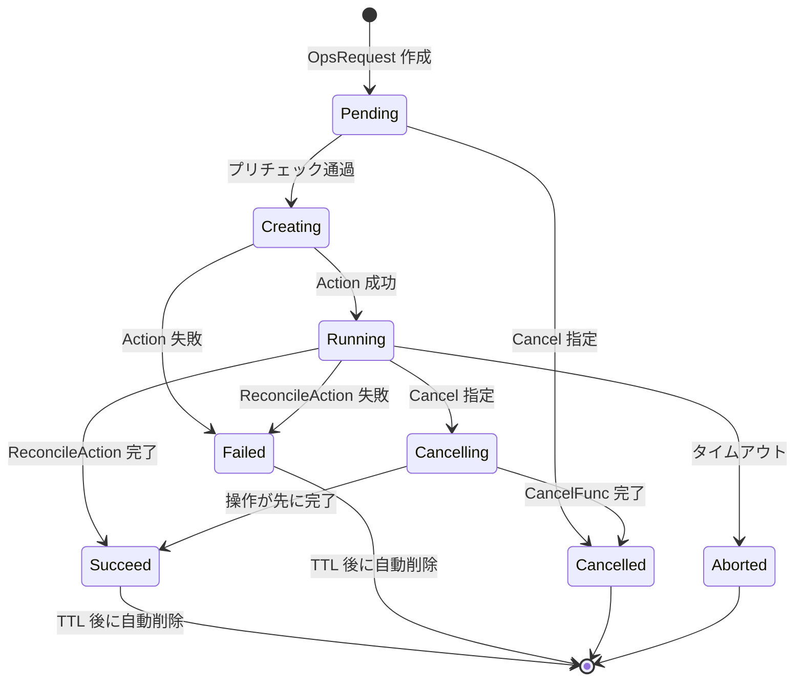

# 第14章 OpsRequest: データベース運用操作

> 本章で読むソース
>
> - [apis/operations/v1alpha1/opsrequest_types.go L32-L36](https://github.com/apecloud/kubeblocks/blob/v1.0.2/apis/operations/v1alpha1/opsrequest_types.go#L32-L36)
> - [apis/operations/v1alpha1/opsrequest_types.go L73-L75](https://github.com/apecloud/kubeblocks/blob/v1.0.2/apis/operations/v1alpha1/opsrequest_types.go#L73-L75)
> - [apis/operations/v1alpha1/opsrequest_types.go L104-L106](https://github.com/apecloud/kubeblocks/blob/v1.0.2/apis/operations/v1alpha1/opsrequest_types.go#L104-L106)
> - [apis/operations/v1alpha1/opsrequest_types.go L108-L115](https://github.com/apecloud/kubeblocks/blob/v1.0.2/apis/operations/v1alpha1/opsrequest_types.go#L108-L115)
> - [apis/operations/v1alpha1/opsrequest_types.go L186-L201](https://github.com/apecloud/kubeblocks/blob/v1.0.2/apis/operations/v1alpha1/opsrequest_types.go#L186-L201)
> - [apis/operations/v1alpha1/opsrequest_types.go L930-L942](https://github.com/apecloud/kubeblocks/blob/v1.0.2/apis/operations/v1alpha1/opsrequest_types.go#L930-L942)
> - [apis/operations/v1alpha1/opsrequest_types.go L955-L977](https://github.com/apecloud/kubeblocks/blob/v1.0.2/apis/operations/v1alpha1/opsrequest_types.go#L955-L977)
> - [apis/operations/v1alpha1/opsrequest_types.go L1148-L1166](https://github.com/apecloud/kubeblocks/blob/v1.0.2/apis/operations/v1alpha1/opsrequest_types.go#L1148-L1166)
> - [apis/operations/v1alpha1/type.go L43-L57](https://github.com/apecloud/kubeblocks/blob/v1.0.2/apis/operations/v1alpha1/type.go#L43-L57)
> - [apis/operations/v1alpha1/type.go L73-L93](https://github.com/apecloud/kubeblocks/blob/v1.0.2/apis/operations/v1alpha1/type.go#L73-L93)
> - [apis/operations/v1alpha1/type.go L118-L132](https://github.com/apecloud/kubeblocks/blob/v1.0.2/apis/operations/v1alpha1/type.go#L118-L132)
> - [apis/operations/v1alpha1/opsdefinition_types.go L26-L37](https://github.com/apecloud/kubeblocks/blob/v1.0.2/apis/operations/v1alpha1/opsdefinition_types.go#L26-L37)
> - [apis/operations/v1alpha1/opsdefinition_types.go L61-L75](https://github.com/apecloud/kubeblocks/blob/v1.0.2/apis/operations/v1alpha1/opsdefinition_types.go#L61-L75)
> - [apis/operations/v1alpha1/opsdefinition_types.go L260-L264](https://github.com/apecloud/kubeblocks/blob/v1.0.2/apis/operations/v1alpha1/opsdefinition_types.go#L260-L264)
> - [apis/operations/v1alpha1/opsdefinition_types.go L285-L303](https://github.com/apecloud/kubeblocks/blob/v1.0.2/apis/operations/v1alpha1/opsdefinition_types.go#L285-L303)
> - [controllers/operations/opsrequest_controller.go L58-L62](https://github.com/apecloud/kubeblocks/blob/v1.0.2/controllers/operations/opsrequest_controller.go#L58-L62)
> - [controllers/operations/opsrequest_controller.go L72-L89](https://github.com/apecloud/kubeblocks/blob/v1.0.2/controllers/operations/opsrequest_controller.go#L72-L89)
> - [controllers/operations/opsrequest_controller.go L92-L107](https://github.com/apecloud/kubeblocks/blob/v1.0.2/controllers/operations/opsrequest_controller.go#L92-L107)
> - [controllers/operations/opsrequest_controller.go L181-L199](https://github.com/apecloud/kubeblocks/blob/v1.0.2/controllers/operations/opsrequest_controller.go#L181-L199)
> - [controllers/operations/opsrequest_controller.go L590-L608](https://github.com/apecloud/kubeblocks/blob/v1.0.2/controllers/operations/opsrequest_controller.go#L590-L608)
> - [pkg/operations/type.go L34-L50](https://github.com/apecloud/kubeblocks/blob/v1.0.2/pkg/operations/type.go#L34-L50)
> - [pkg/operations/type.go L52-L73](https://github.com/apecloud/kubeblocks/blob/v1.0.2/pkg/operations/type.go#L52-L73)
> - [pkg/operations/ops_manager.go L38-L50](https://github.com/apecloud/kubeblocks/blob/v1.0.2/pkg/operations/ops_manager.go#L38-L50)
> - [pkg/operations/ops_manager.go L53-L103](https://github.com/apecloud/kubeblocks/blob/v1.0.2/pkg/operations/ops_manager.go#L53-L103)
> - [pkg/operations/ops_manager.go L154-L197](https://github.com/apecloud/kubeblocks/blob/v1.0.2/pkg/operations/ops_manager.go#L154-L197)
> - [pkg/operations/queue_util.go L37-L37](https://github.com/apecloud/kubeblocks/blob/v1.0.2/pkg/operations/queue_util.go#L37-L37)
> - [pkg/operations/queue_util.go L92-L147](https://github.com/apecloud/kubeblocks/blob/v1.0.2/pkg/operations/queue_util.go#L92-L147)
> - [pkg/operations/queue_util.go L150-L163](https://github.com/apecloud/kubeblocks/blob/v1.0.2/pkg/operations/queue_util.go#L150-L163)

## この章の狙い

KubeBlocks ではデータベースに対する運用操作（スケール、アップグレード、再起動、バックアップ等）を `OpsRequest` という CRD に抽象化している。
本章では `OpsRequest` のデータモデル、状態遷移、コントローラの処理フロー、そして `OpsManager` によるプラグインアーキテクチャを読み解く。
あわせて、Annotation ベースのキュー機構が運用操作の直列性をどのように制御しているかを明らかにする。

## 前提

本章は Kubernetes のコントローラパターン（[第9章](../../kubernetes/kubernetes/part03-controller-manager/09-controller-manager-architecture.md)）と CRD（[第20章](../../kubernetes/kubernetes/part07-extension/20-crd-and-aggregation.md)）を前提とする。
`controller-runtime` の `Reconciler` インタフェースと `Informer`（[第19章](../../kubernetes/kubernetes/part07-extension/19-client-go-and-informer.md)）の知識も必要である。
`Cluster` CRD の概要は[第3章](../part00-crd-overview/03-cluster-and-component.md)を参照されたい。

## OpsRequest CRD のデータモデル

### OpsRequest の spec

`OpsRequestSpec` は操作の種類と対象クラスタを指定する。

[apis/operations/v1alpha1/opsrequest_types.go L32-L36](https://github.com/apecloud/kubeblocks/blob/v1.0.2/apis/operations/v1alpha1/opsrequest_types.go#L32-L36)

```go
type OpsRequestSpec struct {
	// Specifies the name of the Cluster resource that this operation is targeting.
	//
	// +kubebuilder:validation:XValidation:rule="self == oldSelf",message="forbidden to update spec.clusterName"
	ClusterName string `json:"clusterName,omitempty"`
```

[apis/operations/v1alpha1/opsrequest_types.go L73-L75](https://github.com/apecloud/kubeblocks/blob/v1.0.2/apis/operations/v1alpha1/opsrequest_types.go#L73-L75)

```go
	// +kubebuilder:validation:Required
	// +kubebuilder:validation:XValidation:rule="self == oldSelf",message="forbidden to update spec.type"
	Type OpsType `json:"type"`
```

[apis/operations/v1alpha1/opsrequest_types.go L104-L106](https://github.com/apecloud/kubeblocks/blob/v1.0.2/apis/operations/v1alpha1/opsrequest_types.go#L104-L106)

```go
	// Exactly one of its members must be set.
	SpecificOpsRequest `json:",inline"`
}
```

`ClusterName` は操作対象の `Cluster` を指す。
`Type` は操作の種類を表し、一度設定すると変更できない（`XValidation:rule="self == oldSelf"`）。
`Cancel` は実行中の操作のキャンセル要求に使う。
`Force` はプリチェックを迂回しての強制実行に使う。
`TTLSecondsAfterSucceed` は成功後の自動削除までの待機秒数である。
`SpecificOpsRequest` は操作種別ごとのパラメータをインラインで埋め込む。

### 操作種別 `OpsType`

[apis/operations/v1alpha1/type.go L73-L93](https://github.com/apecloud/kubeblocks/blob/v1.0.2/apis/operations/v1alpha1/type.go#L73-L93)

```go
// OpsType defines operation types.
// +enum
// +kubebuilder:validation:Enum={Upgrade,VerticalScaling,VolumeExpansion,HorizontalScaling,Restart,Reconfiguring,Start,Stop,Expose,Switchover,Backup,Restore,RebuildInstance,Custom}
type OpsType string

const (
	VerticalScalingType   OpsType = "VerticalScaling"
	HorizontalScalingType OpsType = "HorizontalScaling"
	VolumeExpansionType   OpsType = "VolumeExpansion"
	UpgradeType           OpsType = "Upgrade"
	ReconfiguringType     OpsType = "Reconfiguring"
	SwitchoverType        OpsType = "Switchover"
	RestartType           OpsType = "Restart" // RestartType the restart operation is a special case of the rolling update operation.
	StopType              OpsType = "Stop"    // StopType the stop operation will delete all pods in a cluster concurrently.
	StartType             OpsType = "Start"   // StartType the start operation will start the pods which is deleted in stop operation.
	ExposeType            OpsType = "Expose"
	BackupType            OpsType = "Backup"
	RestoreType           OpsType = "Restore"
	RebuildInstanceType   OpsType = "RebuildInstance" // RebuildInstance rebuilding an instance is very useful when a node is offline or an instance is unrecoverable.
	CustomType            OpsType = "Custom"          // use opsDefinition
)
```

14種類の操作種別が定義されている。
`Restart` はローリングアップデートの特殊ケースであり、`Stop` はクラスタ内の全ポッドを並列に削除する。
`Custom` は `OpsDefinition` で定義した任意の操作を実行する。

### `SpecificOpsRequest`: 種別ごとのパラメータ

`SpecificOpsRequest` は各操作種別に対応するフィールドを1つだけ設定する構造体である。

[apis/operations/v1alpha1/opsrequest_types.go L108-L115](https://github.com/apecloud/kubeblocks/blob/v1.0.2/apis/operations/v1alpha1/opsrequest_types.go#L108-L115)

```go
type SpecificOpsRequest struct {
	// Specifies the desired new version of the Cluster.
	//
	// Note: This field is immutable once set.
	//
	// +optional
	// +kubebuilder:validation:XValidation:rule="self == oldSelf",message="forbidden to update spec.upgrade"
	Upgrade *Upgrade `json:"upgrade,omitempty"`
```

[apis/operations/v1alpha1/opsrequest_types.go L186-L201](https://github.com/apecloud/kubeblocks/blob/v1.0.2/apis/operations/v1alpha1/opsrequest_types.go#L186-L201)

```go
	VerticalScalingList []VerticalScaling `json:"verticalScaling,omitempty"  patchStrategy:"merge,retainKeys" patchMergeKey:"componentName"`

	// Lists Reconfigure objects, each specifying a Component and its configuration updates.
	//
	// +kubebuilder:validation:XValidation:rule="self == oldSelf",message="forbidden to update spec.reconfigure"
	// +optional
	// +patchMergeKey=componentName
	// +patchStrategy=merge,retainKeys
	// +listType=map
	// +listMapKey=componentName
	Reconfigures []Reconfigure `json:"reconfigures,omitempty"  patchStrategy:"merge,retainKeys" patchMergeKey:"componentName"`

	// Lists Expose objects, each specifying a Component and its services to be exposed.
	//
	// +optional
	ExposeList []Expose `json:"expose,omitempty"`
```

各フィールドは `omitempty` で定義され、ちょうど1つだけが設定されることを想定する。
`VerticalScalingList` はコンポーネントごとのリソース要求を保持する。
`SwitchoverList` はフェイルオーバー対象のインスタンス名を保持する。

### `OpsRequestStatus`: 状態と進捗

[apis/operations/v1alpha1/opsrequest_types.go L930-L942](https://github.com/apecloud/kubeblocks/blob/v1.0.2/apis/operations/v1alpha1/opsrequest_types.go#L930-L942)

```go
// OpsRequestStatus represents the observed state of an OpsRequest.
type OpsRequestStatus struct {
	// Records the cluster generation after the OpsRequest action has been handled.
	// +optional
	ClusterGeneration int64 `json:"clusterGeneration,omitempty"`

	// Represents the phase of the OpsRequest.
	// Possible values include "Pending", "Creating", "Running", "Cancelling", "Cancelled", "Failed", "Succeed".
	Phase OpsPhase `json:"phase,omitempty"`

	// Represents the progress of the OpsRequest.
	// +kubebuilder:validation:Pattern:=`^(\d+|\-)/(\d+|\-)$`
	// +kubebuilder:default=-/-
	Progress string `json:"progress"`
```

[apis/operations/v1alpha1/opsrequest_types.go L955-L977](https://github.com/apecloud/kubeblocks/blob/v1.0.2/apis/operations/v1alpha1/opsrequest_types.go#L955-L977)

```go
	// Records the time when the OpsRequest started processing.
	// +optional
	StartTimestamp metav1.Time `json:"startTimestamp,omitempty"`

	// Records the time when the OpsRequest was completed.
	// +optional
	CompletionTimestamp metav1.Time `json:"completionTimestamp,omitempty"`

	// Records the time when the OpsRequest was cancelled.
	// +optional
	CancelTimestamp metav1.Time `json:"cancelTimestamp,omitempty"`

	// Describes the detailed status of the OpsRequest.
	// Possible condition types include "Cancelled", "WaitForProgressing", "Validated", "Succeed", "Failed", "Restarting",
	// "VerticalScaling", "HorizontalScaling", "VolumeExpanding", "Reconfigure", "Switchover", "Stopping", "Starting",
	// "VersionUpgrading", "Exposing", "Backup", "InstancesRebuilding", "CustomOperation".
	// +optional
	// +patchMergeKey=type
	// +patchStrategy=merge
	// +listType=map
	// +listMapKey=type
	Conditions []metav1.Condition `json:"conditions,omitempty"`
}
```

`Phase` は後述する状態遷移の現在値を保持する。
`Progress` は `完了数/全体数` の形式で進捗を表す（例: `3/5`）。
`StartTimestamp` は操作開始時刻を記録し、タイムアウト判定に使う。
`Conditions` は `Succeed`、`Failed`、`Cancelled` 等のイベントごとの詳細を保持する。

### 状態フェーズ `OpsPhase`

[apis/operations/v1alpha1/type.go L43-L57](https://github.com/apecloud/kubeblocks/blob/v1.0.2/apis/operations/v1alpha1/type.go#L43-L57)

```go
// OpsPhase defines opsRequest phase.
// +enum
// +kubebuilder:validation:Enum={Pending,Creating,Running,Cancelling,Cancelled,Aborted,Failed,Succeed}
type OpsPhase string

const (
	OpsPendingPhase    OpsPhase = "Pending"
	OpsCreatingPhase   OpsPhase = "Creating"
	OpsRunningPhase    OpsPhase = "Running"
	OpsCancellingPhase OpsPhase = "Cancelling"
	OpsSucceedPhase    OpsPhase = "Succeed"
	OpsCancelledPhase  OpsPhase = "Cancelled"
	OpsFailedPhase     OpsPhase = "Failed"
	OpsAbortedPhase    OpsPhase = "Aborted"
)
```

8つのフェーズが定義されている。
`Pending` はキュー待ち、`Creating` は実行開始準備、`Running` は操作実行中を表す。
終端状態は `Succeed`、`Cancelled`、`Failed`、`Aborted` の4種類である。

## OpsRequest の状態遷移



`Pending` から `Creating` への遷移でプリチェックとキュー待機が行われる。
`Creating` で `OpsHandler.Action` が呼ばれ、成功すれば `Running` に遷移する。
`Running` では `OpsHandler.ReconcileAction` がループし、操作の完了を監視する。
`spec.timeoutSeconds` を超えると `Aborted` へ遷移する。

## コントローラの処理フロー

### `OpsRequestReconciler` の構造

[controllers/operations/opsrequest_controller.go L58-L62](https://github.com/apecloud/kubeblocks/blob/v1.0.2/controllers/operations/opsrequest_controller.go#L58-L62)

```go
// OpsRequestReconciler reconciles a OpsRequest object
type OpsRequestReconciler struct {
	client.Client
	Scheme   *runtime.Scheme
	Recorder record.EventRecorder
}
```

`OpsRequestReconciler` は `controller-runtime` の標準的な `Reconciler` 構造体である。
`Client` は API サーバへのアクセスに使い、`Recorder` は Kubernetes イベントの発行に使う。

### `Reconcile` メソッドとステージチェーン

[controllers/operations/opsrequest_controller.go L72-L89](https://github.com/apecloud/kubeblocks/blob/v1.0.2/controllers/operations/opsrequest_controller.go#L72-L89)

```go
func (r *OpsRequestReconciler) Reconcile(ctx context.Context, req ctrl.Request) (ctrl.Result, error) {
	reqCtx := intctrlutil.RequestCtx{
		Ctx:      ctx,
		Req:      req,
		Log:      log.FromContext(ctx).WithValues("opsRequest", req.NamespacedName),
		Recorder: r.Recorder,
	}
	reqCtx.Log.Info("reconcile", "opsRequest", req.NamespacedName)
	opsCtrlHandler := &opsControllerHandler{}
	return opsCtrlHandler.Handle(reqCtx, &operations.OpsResource{Recorder: r.Recorder},
		r.fetchOpsRequest,
		r.fetchCluster,
		r.handleDeletion,
		r.addClusterLabelAndSetOwnerReference,
		r.handleCancelSignal,
		r.handleOpsRequestByPhase,
	)
}
```

`Reconcile` は6つのステージ関数を順に実行する。
各ステージは `(*ctrl.Result, error)` を返し、非 nil の `Result` か非 nil の `error` が返るとそこでチェーンが中断される。
このパターンにより、前処理の失敗が後段の処理に波及するのを防いでいる。

### `opsControllerHandler.Handle`: ステージ実行器

[controllers/operations/opsrequest_controller.go L590-L608](https://github.com/apecloud/kubeblocks/blob/v1.0.2/controllers/operations/opsrequest_controller.go#L590-L608)

```go
type opsRequestStep func(reqCtx intctrlutil.RequestCtx, opsRes *operations.OpsResource) (*ctrl.Result, error)

type opsControllerHandler struct {
}

func (h *opsControllerHandler) Handle(reqCtx intctrlutil.RequestCtx,
	opsRes *operations.OpsResource,
	steps ...opsRequestStep) (ctrl.Result, error) {
	for _, step := range steps {
		res, err := step(reqCtx, opsRes)
		if res != nil {
			return *res, err
		}
		if err != nil {
			return intctrlutil.RequeueWithError(err, reqCtx.Log, "")
		}
	}
	return intctrlutil.Reconciled()
}
```

`Handle` は可変長引数の `opsRequestStep` を先頭から順に呼び出す。
いずれかのステップが `Result` を返せばそこで終了し、`error` のみであれば `RequeueWithError` で再キューする。
全ステップが nil を返した場合のみ `Reconciled()` を返す。
この設計により、ステージの追加・順序変更が容易になっている。

### `handleOpsRequestByPhase`: フェーズごとの分岐

[controllers/operations/opsrequest_controller.go L181-L199](https://github.com/apecloud/kubeblocks/blob/v1.0.2/controllers/operations/opsrequest_controller.go#L181-L199)

```go
// handleOpsRequestByPhase handles the OpsRequest by its phase.
func (r *OpsRequestReconciler) handleOpsRequestByPhase(reqCtx intctrlutil.RequestCtx, opsRes *operations.OpsResource) (*ctrl.Result, error) {
	switch opsRes.OpsRequest.Status.Phase {
	case "":
		// update status.phase to pending
		if err := operations.PatchOpsStatus(reqCtx.Ctx, r.Client, opsRes, opsv1alpha1.OpsPendingPhase,
			opsv1alpha1.NewWaitForProcessingCondition(opsRes.OpsRequest)); err != nil {
			return intctrlutil.ResultToP(intctrlutil.CheckedRequeueWithError(err, reqCtx.Log, ""))
		}
		return intctrlutil.ResultToP(intctrlutil.Reconciled())
	case opsv1alpha1.OpsPendingPhase, opsv1alpha1.OpsCreatingPhase:
		return r.doOpsRequestAction(reqCtx, opsRes)
	case opsv1alpha1.OpsRunningPhase, opsv1alpha1.OpsCancellingPhase:
		return r.reconcileStatusDuringRunningOrCanceling(reqCtx, opsRes)
	case opsv1alpha1.OpsSucceedPhase:
		return r.handleSucceedOpsRequest(reqCtx, opsRes.OpsRequest)
	default:
		return r.handleUnsuccessfulCompletionOpsRequest(reqCtx, opsRes)
	}
}
```

フェーズが空であれば `Pending` に初期化する。
`Pending` または `Creating` であれば `doOpsRequestAction` で実際の操作を開始する。
`Running` または `Cancelling` であれば `reconcileStatusDuringRunningOrCanceling` で完了を監視する。
`Succeed` であれば TTL に基づく自動削除を処理する。

### `SetupWithManager`: Watch 対象のリソース

[controllers/operations/opsrequest_controller.go L92-L107](https://github.com/apecloud/kubeblocks/blob/v1.0.2/controllers/operations/opsrequest_controller.go#L92-L107)

```go
// SetupWithManager sets up the controller with the Manager.
func (r *OpsRequestReconciler) SetupWithManager(mgr ctrl.Manager) error {
	return intctrlutil.NewControllerManagedBy(mgr).
		For(&opsv1alpha1.OpsRequest{}).
		WithOptions(controller.Options{
			MaxConcurrentReconciles: viper.GetInt(constant.CfgKBReconcileWorkers) / 2,
		}).
		Watches(&appsv1.Cluster{}, handler.EnqueueRequestsFromMapFunc(r.parseRunningOpsRequests)).
		Watches(&workloads.InstanceSet{}, handler.EnqueueRequestsFromMapFunc(r.parseRunningOpsRequestsForInstanceSet)).
		Watches(&dpv1alpha1.Backup{}, handler.EnqueueRequestsFromMapFunc(r.parseBackupOpsRequest)).
		Watches(&corev1.PersistentVolumeClaim{}, handler.EnqueueRequestsFromMapFunc(r.parseVolumeExpansionOpsRequest)).
		Watches(&corev1.Pod{}, handler.EnqueueRequestsFromMapFunc(r.parsePod)).
		Owns(&batchv1.Job{}).
		Owns(&dpv1alpha1.Restore{}).
		Owns(&parametersv1alpha1.Parameter{}).
		Complete(r)
}
```

`OpsRequest` 自身に加え、`Cluster`、`InstanceSet`、`Backup`、`PVC`、`Pod` の変更も監視する。
これは操作の進捗がこれらのリソースの状態変化に依存するためである。
`VolumeExpansion` は PVC のサイズ変化を監視して完了を判定し、`Backup` は `Backup` リソースの完了イベントを監視する。
`MaxConcurrentReconciles` を全体のワーカー数の半分に制限しているのは、運用操作がクラスタ全体のリソースに影響を与えるため、コントローラの占有を防ぐ目的がある。

## OpsManager: プラグインアーキテクチャ

### `OpsHandler` インタフェース

[pkg/operations/type.go L34-L50](https://github.com/apecloud/kubeblocks/blob/v1.0.2/pkg/operations/type.go#L34-L50)

```go
type OpsHandler interface {
	// Action The action duration should be short. if it fails, it will be reconciled by the OpsRequest controller.
	// Do not patch OpsRequest status in this function with k8s client, just modify the status of ops.
	// The opsRequest controller will patch it to the k8s apiServer.
	Action(reqCtx intctrlutil.RequestCtx, cli client.Client, opsResource *OpsResource) error

	// ReconcileAction loops till the operation is completed.
	// return OpsRequest.status.phase and requeueAfter time.
	ReconcileAction(reqCtx intctrlutil.RequestCtx, cli client.Client, opsResource *OpsResource) (opsv1alpha1.OpsPhase, time.Duration, error)

	// ActionStartedCondition appends to OpsRequest.status.conditions when start performing Action function
	ActionStartedCondition(reqCtx intctrlutil.RequestCtx, cli client.Client, opsRes *OpsResource) (*metav1.Condition, error)

	// SaveLastConfiguration saves last configuration to the OpsRequest.status.lastConfiguration,
	// and this method will be executed together when opsRequest in running.
	SaveLastConfiguration(reqCtx intctrlutil.RequestCtx, cli client.Client, opsResource *OpsResource) error
}
```

`OpsHandler` は各操作種別が実装するインタフェースである。
`Action` は操作の開始処理（リソースのパッチ、Job の作成等）を行う。
`ReconcileAction` は操作の完了を監視し、終端状態に達するまでループする。
`SaveLastConfiguration` は操作前の設定を `status.lastConfiguration` に保存する。
このインタフェースを介すことで、コントローラ本体の改変なしに新しい操作種別を追加できる。

### `OpsBehaviour`: 振る舞いの定義

[pkg/operations/type.go L52-L73](https://github.com/apecloud/kubeblocks/blob/v1.0.2/pkg/operations/type.go#L52-L73)

```go
type OpsBehaviour struct {
	FromClusterPhases []appsv1.ClusterPhase

	// ToClusterPhase indicates that the cluster will enter this phase during the operation.
	// All opsRequest with ToClusterPhase are mutually exclusive.
	ToClusterPhase appsv1.ClusterPhase

	// CancelFunc this function defines the cancel action and does not patch/update the opsRequest by client-go in here.
	// only update the opsRequest object, then opsRequest controller will update uniformly.
	CancelFunc func(reqCtx intctrlutil.RequestCtx, cli client.Client, opsResource *OpsResource) error

	// IsClusterCreation indicates whether the opsRequest will create a new cluster.
	IsClusterCreation bool

	// QueueByCluster indicates that the operation is queued for execution within the cluster-wide scope.
	QueueByCluster bool

	// QueueWithSelf indicates that the operation is queued for execution within opsType scope.
	QueueBySelf bool

	OpsHandler OpsHandler
}
```

`OpsBehaviour` は操作種別のメタ情報を保持する。
`FromClusterPhases` は操作が許可されるクラスタのフェーズ群である。
`ToClusterPhase` は操作中にクラスタが遷移するフェーズであり、空でなければ他の操作と排他になる。
`QueueByCluster` はクラスタ単位のキューイング、`QueueBySelf` は同種別内でのキューイングを表す。
`CancelFunc` はキャンセル時の処理を定義する。

### `OpsManager`: 操作の登録とディスパッチ

[pkg/operations/ops_manager.go L38-L50](https://github.com/apecloud/kubeblocks/blob/v1.0.2/pkg/operations/ops_manager.go#L38-L50)

```go
var (
	opsManagerOnce sync.Once
	opsManager     *OpsManager
)

// RegisterOps registers operation with OpsType and OpsBehaviour
func (opsMgr *OpsManager) RegisterOps(opsType opsv1alpha1.OpsType, opsBehaviour OpsBehaviour) {
	opsManager.OpsMap[opsType] = opsBehaviour
	opsv1alpha1.OpsRequestBehaviourMapper[opsType] = opsv1alpha1.OpsRequestBehaviour{
		FromClusterPhases: opsBehaviour.FromClusterPhases,
		ToClusterPhase:    opsBehaviour.ToClusterPhase,
	}
}
```

`OpsManager` はシングルトンであり、`sync.Once` で初期化を保証する。
各操作種別は `init` 関数で `RegisterOps` を呼び、自身の `OpsHandler` を登録する。
`OpsMap` は `OpsType` をキーとするマップであり、`Do` と `Reconcile` のディスパッチに使う。

### `OpsManager.Do`: 操作の実行

[pkg/operations/ops_manager.go L53-L103](https://github.com/apecloud/kubeblocks/blob/v1.0.2/pkg/operations/ops_manager.go#L53-L103)

```go
// Do the entry function for handling OpsRequest
func (opsMgr *OpsManager) Do(reqCtx intctrlutil.RequestCtx, cli client.Client, opsRes *OpsResource) (*ctrl.Result, error) {
	var (
		opsBehaviour OpsBehaviour
		err          error
		ok           bool
		opsRequest   = opsRes.OpsRequest
	)
	if opsBehaviour, ok = opsMgr.OpsMap[opsRequest.Spec.Type]; !ok || opsBehaviour.OpsHandler == nil {
		return &ctrl.Result{}, PatchOpsHandlerNotSupported(reqCtx.Ctx, cli, opsRes)
	}

	if opsRequest.Spec.Type == opsv1alpha1.CustomType {
		err = initOpsDefAndValidate(reqCtx, cli, opsRes)
	} else {
		// validate OpsRequest.spec
		err = opsRequest.ValidateOps(reqCtx.Ctx, cli, opsRes.Cluster)
	}
	if err != nil {
		return &ctrl.Result{}, patchValidateErrorCondition(reqCtx.Ctx, cli, opsRes, err.Error())
	}

	if opsRequest.Status.Phase == opsv1alpha1.OpsPendingPhase {
		if opsRequest.Spec.Cancel {
			return &ctrl.Result{}, PatchOpsStatus(reqCtx.Ctx, cli, opsRes, opsv1alpha1.OpsCancelledPhase)
		}
		if err = opsMgr.doPreConditionAndTransPhaseToCreating(reqCtx, cli, opsRes, opsBehaviour); intctrlutil.IsTargetError(err, intctrlutil.ErrorTypeFatal) {
			return &ctrl.Result{}, patchValidateErrorCondition(reqCtx.Ctx, cli, opsRes, err.Error())
		} else if err != nil {
			if _, ok := err.(*WaitForClusterPhaseErr); ok {
				return intctrlutil.ResultToP(intctrlutil.RequeueAfter(time.Second, reqCtx.Log, "wait cluster to a right phase"))
			}
			return nil, err
		}
		return intctrlutil.ResultToP(intctrlutil.Reconciled())
	}

	if err = updateHAConfigIfNecessary(reqCtx, cli, opsRes.OpsRequest, "false"); err != nil {
		return nil, err
	}
	if err = opsBehaviour.OpsHandler.Action(reqCtx, cli, opsRes); err != nil {
		// patch the status.phase to Failed when the error is Fatal, which means the operation is failed and there is no need to retry
		if intctrlutil.IsTargetError(err, intctrlutil.ErrorTypeFatal) {
			return &ctrl.Result{}, patchFatalFailErrorCondition(reqCtx.Ctx, cli, opsRes, err)
		}
		if intctrlutil.IsTargetError(err, intctrlutil.ErrorTypeNeedWaiting) {
			return intctrlutil.ResultToP(intctrlutil.Reconciled())
		}
		return nil, err
	}
	return nil, nil
}
```

`Do` は `Pending` フェーズの `OpsRequest` を受け取り、バリデーション、キューイング、プリチェックを経て `Creating` へ遷移させる。
すでに `Creating` 以降であれば `OpsHandler.Action` を呼び出す。
`Action` がエラーを返さなければ、コントローラは `status.phase` を `Running` に更新する。

### `OpsManager.Reconcile`: 完了の監視

[pkg/operations/ops_manager.go L154-L197](https://github.com/apecloud/kubeblocks/blob/v1.0.2/pkg/operations/ops_manager.go#L154-L197)

```go
// Reconcile entry function when OpsRequest.status.phase is Running.
// loops till the operation is completed.
func (opsMgr *OpsManager) Reconcile(reqCtx intctrlutil.RequestCtx, cli client.Client, opsRes *OpsResource) (time.Duration, error) {
	var (
		opsBehaviour    OpsBehaviour
		ok              bool
		err             error
		requeueAfter    time.Duration
		opsRequestPhase opsv1alpha1.OpsPhase
		opsRequest      = opsRes.OpsRequest
	)

	if opsBehaviour, ok = opsMgr.OpsMap[opsRes.OpsRequest.Spec.Type]; !ok || opsBehaviour.OpsHandler == nil {
		return 0, PatchOpsHandlerNotSupported(reqCtx.Ctx, cli, opsRes)
	}
	opsRes.ToClusterPhase = opsBehaviour.ToClusterPhase
	if opsRequest.Spec.Type == opsv1alpha1.CustomType {
		err = initOpsDefAndValidate(reqCtx, cli, opsRes)
		if intctrlutil.IsTargetError(err, intctrlutil.ErrorTypeFatal) {
			return requeueAfter, opsMgr.handleOpsCompleted(reqCtx, cli, opsRes, opsv1alpha1.OpsFailedPhase,
				opsv1alpha1.NewCancelFailedCondition(opsRequest, err), opsv1alpha1.NewValidateFailedCondition(opsv1alpha1.ReasonValidateFailed, err.Error()))
		}
		if err != nil {
			return requeueAfter, err
		}
	}
	if opsRequestPhase, requeueAfter, err = opsBehaviour.OpsHandler.ReconcileAction(reqCtx, cli, opsRes); err != nil &&
		!isOpsRequestFailedPhase(opsRequestPhase) {
		if intctrlutil.IsTargetError(err, intctrlutil.ErrorTypeFatal) {
			return requeueAfter, opsMgr.handleOpsCompleted(reqCtx, cli, opsRes, opsv1alpha1.OpsFailedPhase,
				opsv1alpha1.NewCancelFailedCondition(opsRequest, err), opsv1alpha1.NewFailedCondition(opsRequest, err))
		}
		// if the opsRequest phase is not failed, skipped
		return requeueAfter, err
	}
	switch opsRequestPhase {
	case opsv1alpha1.OpsSucceedPhase:
		return 0, opsMgr.handleOpsCompleted(reqCtx, cli, opsRes, opsRequestPhase,
			opsv1alpha1.NewCancelSucceedCondition(opsRequest.Name), opsv1alpha1.NewSucceedCondition(opsRequest))
	case opsv1alpha1.OpsFailedPhase:
		return 0, opsMgr.handleOpsCompleted(reqCtx, cli, opsRes, opsRequestPhase,
			opsv1alpha1.NewCancelFailedCondition(opsRequest, err), opsv1alpha1.NewFailedCondition(opsRequest, err))
	default:
		return opsMgr.checkAndHandleOpsTimeout(reqCtx, cli, opsRes, requeueAfter)
	}
}
```

`Reconcile` は `OpsHandler.ReconcileAction` を呼び、返されたフェーズに応じて完了処理またはタイムアウト判定を行う。
`ReconcileAction` が `Succeed` を返せば `handleOpsCompleted` で `Succeed` へ遷移し、キューからデキューする。
タイムアウト判定は `spec.timeoutSeconds` と `status.startTimestamp` から計算される。

## `OpsDefinition`: カスタム操作の拡張

### `OpsDefinitionSpec` の構造

[apis/operations/v1alpha1/opsdefinition_types.go L26-L37](https://github.com/apecloud/kubeblocks/blob/v1.0.2/apis/operations/v1alpha1/opsdefinition_types.go#L26-L37)

```go
// OpsDefinitionSpec defines the desired state of OpsDefinition.
type OpsDefinitionSpec struct {
	// Specifies the preconditions that must be met to run the actions for the operation.
	// if set, it will check the condition before the Component runs this operation.
	// Example:
	// ```yaml
	//  preConditions:
	//  - rule:
	//      expression: '{{ eq .component.status.phase "Running" }}'
	//      message: Component is not in Running status.
	// ```
	// +optional
	PreConditions []PreCondition `json:"preConditions,omitempty"`
```

[apis/operations/v1alpha1/opsdefinition_types.go L61-L75](https://github.com/apecloud/kubeblocks/blob/v1.0.2/apis/operations/v1alpha1/opsdefinition_types.go#L61-L75)

```go
	// Specifies the schema for validating the data types and value ranges of parameters in OpsActions before their usage.
	//
	// +optional
	ParametersSchema *ParametersSchema `json:"parametersSchema,omitempty"`

	// Specifies a list of OpsAction where each customized action is executed sequentially.
	//
	// +kubebuilder:validation:MinItems=1
	// +patchMergeKey=name
	// +patchStrategy=merge,retainKeys
	// +listType=map
	// +listMapKey=name
	// +kubebuilder:validation:Required
	Actions []OpsAction `json:"actions" patchStrategy:"merge,retainKeys" patchMergeKey:"name"`
}
```

`OpsDefinition` はユーザーが独自に定義するカスタム操作の仕様である。
`PreConditions` は実行条件を Go テンプレート式で記述する。
`PodInfoExtractors` は既存のポッドから環境変数やボリュームを抽出し、操作実行コンテナに注入する。
`ParametersSchema` は OpenAPI v3 スキーマでパラメータのバリデーションを定義する。
`Actions` は逐次実行されるカスタムアクションの列である。

### `OpsAction`: アクションの3種類

[apis/operations/v1alpha1/opsdefinition_types.go L260-L264](https://github.com/apecloud/kubeblocks/blob/v1.0.2/apis/operations/v1alpha1/opsdefinition_types.go#L260-L264)

```go
type OpsAction struct {
	// Specifies the name of the OpsAction.
	// +kubebuilder:validation:MaxLength=20
	// +kubebuilder:validation:Required
	Name string `json:"name"`
```

[apis/operations/v1alpha1/opsdefinition_types.go L285-L303](https://github.com/apecloud/kubeblocks/blob/v1.0.2/apis/operations/v1alpha1/opsdefinition_types.go#L285-L303)

```go
	// Specifies the configuration for a 'workload' action.
	// This action leads to the creation of a K8s workload, such as a Pod or Job, to execute specified tasks.
	//
	// +optional
	Workload *OpsWorkloadAction `json:"workload,omitempty"`

	// Specifies the configuration for a 'exec' action.
	// It creates a Pod and invokes a 'kubectl exec' to run command inside a specified container with the target Pod.
	// +optional
	Exec *OpsExecAction `json:"exec,omitempty"`

	// Specifies the configuration for a 'resourceModifier' action.
	// This action allows for modifications to existing K8s objects.
	//
	// Note: This feature has not been implemented yet.
	//
	// +optional
	ResourceModifier *OpsResourceModifierAction `json:"resourceModifier,omitempty"`
}
```

`OpsAction` は3種類の実行方法のいずれかをとる。
`workload` は Job または Pod を作成してスクリプトを実行する。
`exec` は既存のコンテナ内で `kubectl exec` によりコマンドを実行する。
`resourceModifier` は JSON Patch で Kubernetes オブジェクトを変更する（未実装）。
`FailurePolicy` に `Ignore` を指定すれば、アクションの失敗を無視して続行できる。

## Annotation ベースのキュー機構

### キューの仕組み

KubeBlocks は `Cluster` の Annotation に `OpsRequest` のキューを保持する。
これにより、複数クラスタにまたがる操作の直列性を、外部の分散ロックを使わずに実現している。

[pkg/operations/queue_util.go L37-L37](https://github.com/apecloud/kubeblocks/blob/v1.0.2/pkg/operations/queue_util.go#L37-L37)

```go
const opsRequestQueueLimitSize = 20
```

[pkg/operations/queue_util.go L92-L147](https://github.com/apecloud/kubeblocks/blob/v1.0.2/pkg/operations/queue_util.go#L92-L147)

```go
// enqueueOpsRequestToClusterAnnotation adds the OpsRequest Annotation to Cluster.metadata.Annotations to acquire the lock.
func enqueueOpsRequestToClusterAnnotation(ctx context.Context, cli client.Client, opsRes *OpsResource, opsBehaviour OpsBehaviour) (*opsv1alpha1.OpsRecorder, error) {
	var (
		opsRequestSlice []opsv1alpha1.OpsRecorder
		err             error
	)
	if !opsBehaviour.QueueByCluster && !opsBehaviour.QueueBySelf {
		return nil, nil
	}
	// if the running opsRequest is deleted, do not enqueue the opsRequest to cluster annotation.
	if !opsRes.OpsRequest.DeletionTimestamp.IsZero() {
		return nil, nil
	}
	if opsRequestSlice, err = opsutil.GetOpsRequestSliceFromCluster(opsRes.Cluster); err != nil {
		return nil, err
	}

	inQueue := func() bool {
		if opsRes.OpsRequest.Force() && !opsRes.OpsRequest.Spec.EnqueueOnForce {
			return false
		}
		return existOtherRunningOps(opsRequestSlice, opsRes.OpsRequest.Spec.Type, opsBehaviour)
	}

	index, opsRecorder := GetOpsRecorderFromSlice(opsRequestSlice, opsRes.OpsRequest.Name)
	switch index {
	case -1:
		// if not exists but reach the queue limit size, throw an error
		if len(opsRequestSlice) >= opsRequestQueueLimitSize {
			return nil, intctrlutil.NewFatalError(fmt.Sprintf("The opsRequest queue is limited to a size of %d", opsRequestQueueLimitSize))
		}
		// if not exists, enqueue
		if opsRequestSlice == nil {
			opsRequestSlice = make([]opsv1alpha1.OpsRecorder, 0)
		}
		opsRecorder = opsv1alpha1.OpsRecorder{
			Name:        opsRes.OpsRequest.Name,
			Type:        opsRes.OpsRequest.Spec.Type,
			QueueBySelf: opsBehaviour.QueueBySelf,
			// check if the opsRequest should be in the queue.
			InQueue: inQueue(),
		}
		opsRequestSlice = append(opsRequestSlice, opsRecorder)
	default:
		if !opsRecorder.InQueue {
			// the opsRequest is already running.
			return &opsRecorder, nil
		}
		if !opsRes.OpsRequest.Spec.Force && existOtherRunningOps(opsRequestSlice, opsRecorder.Type, opsBehaviour) {
			// if exists other running opsRequest, return.
			return &opsRecorder, nil
		}
		// mark to handle the next opsRequest
		opsRequestSlice[index].InQueue = false
	}
	return &opsRecorder, opsutil.UpdateClusterOpsAnnotations(ctx, cli, opsRes.Cluster, opsRequestSlice)
}
```

`OpsRecorder` は `Name`、`Type`、`InQueue`、`QueueBySelf` の4フィールドを持つ。
`InQueue` が `true` の場合は待ち状態、`false` の場合は実行中を表す。
キューの上限は20件である。

### `QueueByCluster` と `QueueBySelf` の違い

[pkg/operations/queue_util.go L150-L163](https://github.com/apecloud/kubeblocks/blob/v1.0.2/pkg/operations/queue_util.go#L150-L163)

```go
// existOtherRunningOps checks if exists other running opsRequest.
func existOtherRunningOps(opsRecorderSlice []opsv1alpha1.OpsRecorder, opsType opsv1alpha1.OpsType, opsBehaviour OpsBehaviour) bool {
	for i := range opsRecorderSlice {
		if opsBehaviour.QueueByCluster && opsRecorderSlice[i].QueueBySelf {
			continue
		}
		if opsBehaviour.QueueBySelf && opsRecorderSlice[i].Type != opsType {
			continue
		}
		if !opsRecorderSlice[i].InQueue {
			return true
		}
	}
	return false
}
```

`QueueByCluster` はクラスタ内のあらゆる操作と排他になる。
`QueueBySelf` は同種別の操作とのみ排他になる。
`VerticalScaling` は `QueueByCluster` であり、他の全操作と直列化される。
`Reconfiguring` は `QueueBySelf` であり、異なる種別の操作とは並列に実行できる。
この2段階のキューイングにより、競合する操作は直列に、独立した操作は並列に実行される。

### キューの高速化: Annotation による非ロック直列化

このキュー機構の最適化ポイントは、Annotation を使った非ロック型の直列制御にある。
従来の分散ロック（etcd の Lease やリーダー選挙）は取得・解放の往復でレイテンシが発生する。
Annotation の更新は Kubernetes の API サーバに対する1回の PATCH で済み、楽観的ロック（`ResourceVersion` による競合検出）が組み込みである。
これにより、ロック取得のための追加ラウンドトリップなしに操作の直列性を実現している。

## `OpsRequest` のライフサイクル管理

### `OpsRequest` CRD 定義

[apis/operations/v1alpha1/opsrequest_types.go L1148-L1166](https://github.com/apecloud/kubeblocks/blob/v1.0.2/apis/operations/v1alpha1/opsrequest_types.go#L1148-L1166)

```go
// +genclient
// +k8s:openapi-gen=true
// +kubebuilder:object:root=true
// +kubebuilder:subresource:status
// +kubebuilder:resource:categories={kubeblocks},shortName=ops
// +kubebuilder:printcolumn:name="TYPE",type="string",JSONPath=".spec.type",description="Operation request type."
// +kubebuilder:printcolumn:name="CLUSTER",type="string",JSONPath=".spec.clusterName",description="Operand cluster."
// +kubebuilder:printcolumn:name="STATUS",type="string",JSONPath=".status.phase",description="Operation status phase."
// +kubebuilder:printcolumn:name="PROGRESS",type="string",JSONPath=".status.progress",description="Operation processing progress."
// +kubebuilder:printcolumn:name="AGE",type="date",JSONPath=".metadata.creationTimestamp"

// OpsRequest is the Schema for the opsrequests API
type OpsRequest struct {
	metav1.TypeMeta   `json:",inline"`
	metav1.ObjectMeta `json:"metadata,omitempty"`

	Spec   OpsRequestSpec   `json:"spec,omitempty"`
	Status OpsRequestStatus `json:"status,omitempty"`
}
```

`OpsRequest` はネームスペーススコープの CRD であり、短縮名 `ops` でアクセスできる。
`kubectl get ops` で一覧でき、`TYPE`、`CLUSTER`、`STATUS`、`PROGRESS` が表示される。

### 完了後の自動削除

コントローラは `Succeed` 後に `spec.ttlSecondsAfterSucceed` 秒を経過すると `OpsRequest` を自動削除する。
失敗時（`Failed`、`Cancelled`、`Aborted`）は `spec.ttlSecondsAfterUnsuccessfulCompletion` が使われる。
これにより、完了した `OpsRequest` がクラスタ内に蓄積し続けるのを防いでいる。

### キャンセル処理

`spec.cancel` を `true` に設定すると、`handleCancelSignal` が呼び出される。
`Pending` 状態であれば即座に `Cancelled` へ遷移する。
`Running` 状態であれば `OpsBehaviour.CancelFunc` が実行され、`Cancelling` を経て `Cancelled` へ遷移する。
`Cancel` は不可逆であり、一度 `true` にすると元に戻せない（`XValidation` で制御）。

## まとめ

`OpsRequest` はデータベース運用操作を統一的に扱う CRD であり、14種類の操作種別をサポートする。
コントローラは6段階のステージチェーンでリコンサイトルを構成し、`OpsManager` のプラグインアーキテクチャによって新しい操作種別を容易に追加できる。
Annotation ベースのキュー機構は `QueueByCluster` と `QueueBySelf` の2段階の排他制御により、競合する操作の直列化と独立操作の並列化を実現している。
`OpsDefinition` を使えば、ユーザーは Go コードを書かずに YAML だけでカスタム操作を定義できる。

## 関連する章

- [第3章 Cluster と Component の仕様](../part00-crd-overview/03-cluster-and-component.md): `Cluster` CRD のデータモデル
- [第8章 Cluster コントローラ](../part02-main-controllers/08-cluster-controller.md): `Cluster` のリコンサイトル
- [第15章 パラメータ管理と動的再設定](15-parameter-management.md): `Reconfiguring` 操作の詳細
- [第16章 kbagent: ライフサイクルアクション実行エージェント](16-kbagent.md): `OpsAction` の実行基盤
