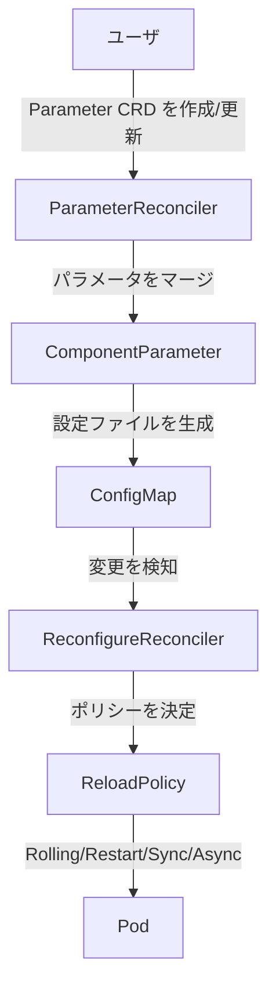
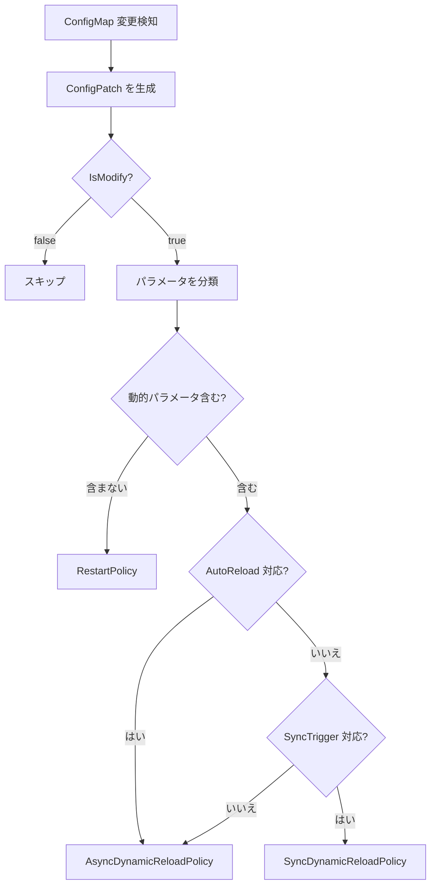

# 第15章 パラメータ管理と動的再設定

> 本章で読むソース
>
> - [controllers/parameters/parameter_controller.go L47-L82](https://github.com/apecloud/kubeblocks/blob/v1.0.2/controllers/parameters/parameter_controller.go#L47-L82)
> - [controllers/parameters/reconfigure_controller.go L53-L163](https://github.com/apecloud/kubeblocks/blob/v1.0.2/controllers/parameters/reconfigure_controller.go#L53-L163)
> - [controllers/parameters/reconfigure_policy.go L67-L250](https://github.com/apecloud/kubeblocks/blob/v1.0.2/controllers/parameters/reconfigure_policy.go#L67-L250)
> - [controllers/parameters/rolling_upgrade_policy.go L41-L215](https://github.com/apecloud/kubeblocks/blob/v1.0.2/controllers/parameters/rolling_upgrade_policy.go#L41-L215)
> - [controllers/parameters/restart_policy.go L35-L103](https://github.com/apecloud/kubeblocks/blob/v1.0.2/controllers/parameters/restart_policy.go#L35-L103)
> - [controllers/parameters/sync_upgrade_policy.go L36-L127](https://github.com/apecloud/kubeblocks/blob/v1.0.2/controllers/parameters/sync_upgrade_policy.go#L36-L127)
> - [controllers/parameters/policy_util.go L245-L392](https://github.com/apecloud/kubeblocks/blob/v1.0.2/controllers/parameters/policy_util.go#L245-L392)
> - [controllers/parameters/config_annotation.go L81-L205](https://github.com/apecloud/kubeblocks/blob/v1.0.2/controllers/parameters/config_annotation.go#L81-L205)
> - [controllers/parameters/revision.go L36-L128](https://github.com/apecloud/kubeblocks/blob/v1.0.2/controllers/parameters/revision.go#L36-L128)
> - [pkg/configuration/core/config_patch.go L27-L103](https://github.com/apecloud/kubeblocks/blob/v1.0.2/pkg/configuration/core/config_patch.go#L27-L103)
> - [pkg/configuration/core/config.go L147-L233](https://github.com/apecloud/kubeblocks/blob/v1.0.2/pkg/configuration/core/config.go#L147-L233)

## この章の狙い

データベースエンジンの動作を決めるのはパラメータである。
KubeBlocks は `Parameter` CRD を通じて、ユーザが宣言的にパラメータを変更できる仕組みを提供する。
本章では、パラメータの変更要求が ConfigMap の更新を経て、どのようにrunning pod へ反映されるかを追う。
とくに「静的パラメータの再起動」「動的パラメータのオンライン反映」という2つの経路を、ポリシー選択のロジックから解説する。

## 前提

- `Cluster`、`Component`、`ComponentDefinition` の CRD 構造（第3章、第8章）
- `InstanceSet` のポッドライフサイクル管理（第10章）
- `ConfigMap` がデータベースの設定ファイルとしてマウントされる仕組み（第9章）

## パラメータ管理の全体像

KubeBlocks のパラメータ管理は3層で構成される。

1. **`Parameter` CRD**: クラスタ全体に対するパラメータ変更要求を表現する。
2. **`ComponentParameter` CRD**: コンポーネントごとに、設定テンプレートと ConfigMap の関係を管理する。
3. **`ReconfigureReconciler`**: ConfigMap の変更を検知し、running pod への反映を実行する。



`ParameterReconciler` は変更要求を受け取り、対象コンポーネントの `ComponentParameter` にパラメータをマージする。
`ComponentParameter` を管理するコントローラは、テンプレートとパラメータを統合して ConfigMap を更新する。
ConfigMap の変更を `ReconfigureReconciler` が検知し、適切なポリシーで pod に反映する。

## ParameterReconciler: 変更要求の受け付け

`ParameterReconciler` は `Parameter` CRD を監視する。

[controllers/parameters/parameter_controller.go L47-L82](https://github.com/apecloud/kubeblocks/blob/v1.0.2/controllers/parameters/parameter_controller.go#L47-L82)

```go
type ParameterReconciler struct {
    client.Client
    Scheme   *runtime.Scheme
    Recorder record.EventRecorder
}

func (r *ParameterReconciler) Reconcile(ctx context.Context, req ctrl.Request) (ctrl.Result, error) {
    // ...
    parameter := &parametersv1alpha1.Parameter{}
    if err := r.Client.Get(reqCtx.Ctx, reqCtx.Req.NamespacedName, parameter); err != nil {
        return intctrlutil.CheckedRequeueWithError(err, reqCtx.Log, "")
    }

    res, err := intctrlutil.HandleCRDeletion(reqCtx, r, parameter, constant.ConfigFinalizerName, nil)
    if res != nil {
        return *res, err
    }
    return r.reconcile(reqCtx, parameter)
}
```

`Reconcile` メソッドは `Parameter` オブジェクトを取得し、削除処理または `reconcile` を呼び出す。
`reconcile` は対象クラスタを取得し、各コンポーネントごとに `handleComponent` を実行する。

[controllers/parameters/parameter_controller.go L115-L153](https://github.com/apecloud/kubeblocks/blob/v1.0.2/controllers/parameters/parameter_controller.go#L115-L153)

```go
func (r *ParameterReconciler) reconcile(reqCtx intctrlutil.RequestCtx, parameter *parametersv1alpha1.Parameter) (ctrl.Result, error) {
    var cluster appsv1.Cluster
    clusterKey := client.ObjectKey{
        Namespace: parameter.GetNamespace(),
        Name:      parameter.Spec.ClusterName,
    }
    if err := r.Client.Get(reqCtx.Ctx, clusterKey, &cluster); err != nil {
        return intctrlutil.CheckedRequeueWithError(err, reqCtx.Log, "")
    }
    // ...
    rctxs, params, err := r.generateParameterTaskContext(reqCtx, parameter, &cluster)
    // ...
    for i, rctx := range rctxs {
        if err := r.handleComponent(rctx, params[i], parameter); err != nil {
            return r.fail(reqCtx, parameter, err)
        }
    }
    finished := syncParameterStatus(&parameter.Status)
    return updateParameterStatus(reqCtx, r.Client, parameter, patch, finished)
}
```

`generateParameterTaskContext` は `ComponentParameters` の各エントリに対して、対象コンポーネントを解決し `ReconcileContext` を構築する。
`handleComponent` はパイプライン構造で、パラメータの分類、テンプレート更新、ConfigMap へのマージ、ステータス更新を順に実行する。

[controllers/parameters/parameter_controller.go L92-L113](https://github.com/apecloud/kubeblocks/blob/v1.0.2/controllers/parameters/parameter_controller.go#L92-L113)

```go
func (r *ParameterReconciler) handleComponent(rctx *ReconcileContext, updatedParameters parametersv1alpha1.ComponentParameters, parameter *parametersv1alpha1.Parameter) error {
    configmaps, err := resolveComponentRefConfigMap(rctx)
    if err != nil {
        return err
    }

    handles := []reconfigureReconcileHandle{
        prepareResources,
        syncComponentParameterStatus,
        classifyParameters(updatedParameters, configmaps),
        updateCustomTemplates,
        updateParameters,
        updateComponentParameterStatus(configmaps),
    }

    for _, handle := range handles {
        if err := handle(rctx, parameter); err != nil {
            return err
        }
    }
    return nil
}
```

`classifyParameters` はユーザ指定のパラメータを、どの設定ファイルに属するかで分類する。
`updateParameters` は分類結果を `ComponentParameter` の spec にマージする。
このマージ結果が `ComponentParameterReconciler` によって ConfigMap へ反映される。

## ComponentParameterReconciler: ConfigMap の生成

`ComponentParameterReconciler` は `ComponentParameter` CRD を監視し、設定テンプレートとユーザ指定パラメータを統合した ConfigMap を生成する。

[controllers/parameters/componentparameter_controller.go L48-L97](https://github.com/apecloud/kubeblocks/blob/v1.0.2/controllers/parameters/componentparameter_controller.go#L48-L97)

```go
type ComponentParameterReconciler struct {
    client.Client
    Scheme   *runtime.Scheme
    Recorder record.EventRecorder
}

func (r *ComponentParameterReconciler) SetupWithManager(mgr ctrl.Manager, multiClusterMgr multicluster.Manager) error {
    builder := intctrlutil.NewControllerManagedBy(mgr).
        For(&parametersv1alpha1.ComponentParameter{}).
        WithOptions(controller.Options{
            MaxConcurrentReconciles: viper.GetInt(constant.CfgKBReconcileWorkers) / 4,
        }).
        Owns(&corev1.ConfigMap{})
    // ...
    return builder.Complete(r)
}
```

`Owns(&corev1.ConfigMap{})` により、このコントローラが生成した ConfigMap の変更もイベントとして受け取る。
`reconcile` メソッドは `generateReconcileTasks` でタスクを生成し、各タスクが ConfigMap の作成または更新を行う。

[controllers/parameters/reconcile_task.go L109-L137](https://github.com/apecloud/kubeblocks/blob/v1.0.2/controllers/parameters/reconcile_task.go#L109-L137)

```go
func NewTask(item parametersv1alpha1.ConfigTemplateItemDetail, status *parametersv1alpha1.ConfigTemplateItemDetailStatus) Task {
    return Task{
        Name: item.Name,
        Do: func(resource *Task, taskCtx *TaskContext, revision string) error {
            if item.ConfigSpec == nil {
                return core.MakeError("not found config spec: %s", item.Name)
            }
            if err := resource.ConfigMap(item.Name).Complete(); err != nil {
                if apierrors.IsNotFound(err) {
                    return syncImpl(taskCtx, resource, item, status, revision, nil)
                }
                return err
            }
            configMap := resource.ConfigMapObj
            switch intctrlutil.GetUpdatedParametersReconciledPhase(configMap, item, status) {
            default:
                return syncStatus(configMap, status)
            case parametersv1alpha1.CInitPhase,
                parametersv1alpha1.CPendingPhase,
                parametersv1alpha1.CMergeFailedPhase:
                return syncImpl(taskCtx, resource, item, status, revision, configMap)
            case parametersv1alpha1.CCreatingPhase:
                return nil
            }
        },
        Status: status,
    }
}
```

`syncImpl` はテンプレートの再レンダリングとパラメータのマージを実行し、結果を ConfigMap に適用する。

[controllers/parameters/reconcile_task.go L139-L194](https://github.com/apecloud/kubeblocks/blob/v1.0.2/controllers/parameters/reconcile_task.go#L139-L194)

```go
func syncImpl(taskCtx *TaskContext, fetcher *Task, item parametersv1alpha1.ConfigTemplateItemDetail,
    status *parametersv1alpha1.ConfigTemplateItemDetailStatus, revision string, configMap *corev1.ConfigMap) (err error) {
    // ...
    if intctrlutil.IsRerender(configMap, item) {
        if baseConfig, err = configctrl.RerenderParametersTemplate(reconcileCtx, item, taskCtx.configRender, taskCtx.paramsDefs); err != nil {
            return failStatus(err)
        }
        updatedConfig = baseConfig
    }
    if len(item.ConfigFileParams) != 0 {
        if updatedConfig, err = configctrl.ApplyParameters(item, baseConfig, taskCtx.configRender, taskCtx.paramsDefs); err != nil {
            return failStatus(err)
        }
    }
    if err = mergeAndApplyConfig(fetcher.ResourceCtx, updatedConfig, configMap, fetcher.ComponentParameterObj, item, revision); err != nil {
        return failStatus(err)
    }
    status.Message = nil
    status.Phase = parametersv1alpha1.CMergedPhase
    status.UpdateRevision = revision
    return nil
}
```

`RerenderParametersTemplate` はテンプレート変数を解決して設定ファイルのベースを生成する。
`ApplyParameters` はユーザ指定のパラメータをベースにマージする。
`mergeAndApplyConfig` は期待される ConfigMap と既存の ConfigMap を比較し、差分があれば Patch で更新する。

## ReconfigureReconciler: ConfigMap 変更の検知と反映

`ReconfigureReconciler` は設定用 ConfigMap の変更を監視し、running pod への反映を担当する。

[controllers/parameters/reconfigure_controller.go L53-L163](https://github.com/apecloud/kubeblocks/blob/v1.0.2/controllers/parameters/reconfigure_controller.go#L53-L163)

```go
type ReconfigureReconciler struct {
    client.Client
    Scheme   *runtime.Scheme
    Recorder record.EventRecorder
}

func (r *ReconfigureReconciler) Reconcile(ctx context.Context, req ctrl.Request) (ctrl.Result, error) {
    // ...
    config := &corev1.ConfigMap{}
    if err := r.Client.Get(reqCtx.Ctx, reqCtx.Req.NamespacedName, config, inDataContextUnspecified()); err != nil {
        return intctrlutil.CheckedRequeueWithError(err, reqCtx.Log, "")
    }
    if model.IsObjectDeleting(config) {
        return intctrlutil.Reconciled()
    }
    if !checkConfigurationObject(config) {
        return intctrlutil.Reconciled()
    }
    // ...
    isAppliedConfigs, err := checkAndApplyConfigsChanged(r.Client, reqCtx, config)
    if err != nil {
        return intctrlutil.CheckedRequeueWithError(err, reqCtx.Log, ...)
    }
    if isAppliedConfigs {
        return updateConfigPhase(r.Client, reqCtx, config, parametersv1alpha1.CFinishedPhase, configurationNoChangedMessage)
    }
    // ...
    return r.sync(reqCtx, config, resources)
}
```

`checkConfigurationObject` は ConfigMap が設定用ラベルを持っているかを確認する。
`checkAndApplyConfigsChanged` は `last-applied-configuration` アノテーションと比較し、実際のデータ変更があるかを判定する。
変更がなければスキップし、あれば `sync` で反映処理に進む。

### コンフィグパッチの生成

`sync` メソッドは `createConfigPatch` を呼び、前回適用した設定と新しい設定の差分を計算する。

[controllers/parameters/config_util.go L62-L79](https://github.com/apecloud/kubeblocks/blob/v1.0.2/controllers/parameters/config_util.go#L62-L79)

```go
func createConfigPatch(cfg *corev1.ConfigMap, configRender *parametersv1alpha1.ParamConfigRenderer, paramsDefs map[string]*parametersv1alpha1.ParametersDefinition) (*core.ConfigPatchInfo, bool, error) {
    if configRender == nil || len(configRender.Spec.Configs) == 0 {
        return nil, true, nil
    }
    lastConfig, err := getLastVersionConfig(cfg)
    if err != nil {
        return nil, false, core.WrapError(err, "failed to get last version data. config[%v]", client.ObjectKeyFromObject(cfg))
    }

    patch, restart, err := core.CreateConfigPatch(lastConfig, cfg.Data, configRender.Spec, true)
    if err != nil {
        return nil, false, err
    }
    if !restart {
        restart = cfgcm.NeedRestart(paramsDefs, patch)
    }
    return patch, restart, nil
}
```

`getLastVersionConfig` は ConfigMap の `last-applied-configuration` アノテーションから前回設定を取り出す。
`CreateConfigPatch` は新旧の設定をパーサで読み込み、追加・削除・更新の3カテゴリに分類する。

[pkg/configuration/core/config_patch.go L27-L91](https://github.com/apecloud/kubeblocks/blob/v1.0.2/pkg/configuration/core/config_patch.go#L27-L91)

```go
func CreateMergePatch(oldVersion, newVersion interface{}, option CfgOption) (*ConfigPatchInfo, error) {
    ok, err := compareWithConfig(oldVersion, newVersion, option)
    if err != nil {
        return nil, err
    } else if ok {
        return &ConfigPatchInfo{IsModify: false}, err
    }

    old, err := NewConfigLoader(withOption(option, oldVersion))
    if err != nil {
        return nil, WrapError(err, "failed to create config: [%s]", oldVersion)
    }
    new, err := NewConfigLoader(withOption(option, newVersion))
    if err != nil {
        return nil, WrapError(err, "failed to create config: [%s]", oldVersion)
    }
    return difference(old.cfgWrapper, new.cfgWrapper)
}

func difference(base *cfgWrapper, target *cfgWrapper) (*ConfigPatchInfo, error) {
    fromOMap := util.ToSet(base.indexer)
    fromNMap := util.ToSet(target.indexer)

    addSet := util.Difference(fromNMap, fromOMap)
    deleteSet := util.Difference(fromOMap, fromNMap)
    updateSet := util.Difference(fromOMap, deleteSet)

    reconfigureInfo := &ConfigPatchInfo{
        IsModify:     false,
        AddConfig:    make(map[string]interface{}, addSet.Length()),
        DeleteConfig: make(map[string]interface{}, deleteSet.Length()),
        UpdateConfig: make(map[string][]byte, updateSet.Length()),
        Target:       target,
        LastVersion:  base,
    }
    // ... 各セットについてパッチを生成
    return reconfigureInfo, nil
}
```

`difference` はファイル名の集合演算で追加・削除を求め、更新ファイルは JSON Patch で差分を取る。
`ConfigPatchInfo` の `IsModify` フラグが false の場合、変更なしと判断して再設定をスキップする。

### 設定ファイル形式の抽象化

`cfgWrapper` は INI、YAML、JSON、XML など複数形式の設定ファイルを統一的に扱う。

[pkg/configuration/core/config.go L147-L157](https://github.com/apecloud/kubeblocks/blob/v1.0.2/pkg/configuration/core/config.go#L147-L157)

```go
type cfgWrapper struct {
	// name is config name
	name string
	// volumeName string

	// fileCount
	fileCount int
	// indexer   map[string]*viper.Viper
	indexer map[string]unstructured.ConfigObject
	v       []unstructured.ConfigObject
}
```

`NewConfigLoader` は `CfgOption.Type` に応じて `loaderProvider` から適切なローダを選ぶ。
`CfgCmType` のローダは ConfigMap の各エントリをファイル名をキーにしてパースし、`indexer` に格納する。
これにより、差分計算はファイル形式に依存せず `unstructured.ConfigObject` のインタフェース üzerinden行える。

## ReloadPolicy: 反映方策の選択

変更されたパラメータを running pod に反映する方法は、パラメータの性質によって異なる。
KubeBlocks は4つの `ReloadPolicy` を提供する。

[controllers/parameters/reconfigure_policy.go L67-L73](https://github.com/apecloud/kubeblocks/blob/v1.0.2/controllers/parameters/reconfigure_policy.go#L67-L73)

```go
type reconfigurePolicy interface {
    Upgrade(rctx reconfigureContext) (ReturnedStatus, error)
    GetPolicyName() string
}
```

| ポリシー | 概要 |
|---|---|
| `RestartPolicy` | コンテナを再起動して設定を反映 |
| `RollingPolicy` | ローリングアップデートで1つずつ再起動 |
| `SyncDynamicReloadPolicy` | gRPC でオンライン反映を同期的に実行 |
| `AsyncDynamicReloadPolicy` | データベース側のファイル監視に任せる（待機不要） |

ポリシーの選択は `genReconfigureActionTasks` が担当する。

[controllers/parameters/policy_util.go L294-L334](https://github.com/apecloud/kubeblocks/blob/v1.0.2/controllers/parameters/policy_util.go#L294-L334)

```go
func genReconfigureActionTasks(templateSpec *appsv1.ComponentFileTemplate, rctx *ReconcileContext, patch *core.ConfigPatchInfo, restart bool) ([]ReloadAction, error) {
    var tasks []ReloadAction
    if patch == nil || rctx.ConfigRender == nil {
        return []ReloadAction{buildRestartTask(templateSpec, rctx)}, nil
    }
    // ...
    for key, jsonPatch := range patch.UpdateConfig {
        pd, ok := rctx.ParametersDefs[key]
        if !ok || pd.Spec.ReloadAction == nil {
            continue
        }
        configFormat := intctrlutil.GetComponentConfigDescription(&rctx.ConfigRender.Spec, key)
        if configFormat == nil || configFormat.FileFormatConfig == nil {
            continue
        }
        policy, err := resolveReloadActionPolicy(string(jsonPatch), configFormat.FileFormatConfig, &pd.Spec)
        if err != nil {
            return nil, err
        }
        if needReloadAction(pd, policy) {
            tasks = append(tasks, buildReloadActionTask(policy, templateSpec, rctx, pd, configFormat, patch))
        }
    }
    if len(tasks) == 0 {
        return []ReloadAction{buildRestartTask(templateSpec, rctx)}, nil
    }
    return tasks, nil
}
```

各更新ファイルについて `ParametersDefinition` の `ReloadAction` と変更パラメータの動的/静的を判定し、方策を決める。

[controllers/parameters/policy_util.go L267-L290](https://github.com/apecloud/kubeblocks/blob/v1.0.2/controllers/parameters/policy_util.go#L267-L290)

```go
func resolveReloadActionPolicy(jsonPatch string, format *parametersv1alpha1.FileFormatConfig,
    pd *parametersv1alpha1.ParametersDefinitionSpec) (parametersv1alpha1.ReloadPolicy, error) {
    var policy = parametersv1alpha1.NonePolicy
    dynamicUpdate, err := core.CheckUpdateDynamicParameters(format, pd, jsonPatch)
    if err != nil {
        return policy, err
    }
    switch {
    case !dynamicUpdate && intctrlutil.NeedDynamicReloadAction(pd):
        policy = parametersv1alpha1.DynamicReloadAndRestartPolicy
    case !dynamicUpdate:
        policy = parametersv1alpha1.RestartPolicy
    case cfgcm.IsAutoReload(pd.ReloadAction):
        policy = parametersv1alpha1.AsyncDynamicReloadPolicy
    case enableSyncTrigger(pd.ReloadAction):
        policy = parametersv1alpha1.SyncDynamicReloadPolicy
    default:
        policy = parametersv1alpha1.AsyncDynamicReloadPolicy
    }
    return policy, nil
}
```

判定の優先順位は次の通りである。

1. 変更されたパラメータがすべて静的なら `RestartPolicy`。
2. 動的パラメータを含み、かつホットリロードの仕組みがあるなら `SyncDynamicReloadPolicy`。
3. それ以外（データベース側がファイル変更を自動検知する）は `AsyncDynamicReloadPolicy`。



## RestartPolicy: 全ポッドの一斉再起動

`RestartPolicy` は `InstanceSet` のアノテーションを更新し、ポッドのローリング再起動を促す。

[controllers/parameters/restart_policy.go L41-L103](https://github.com/apecloud/kubeblocks/blob/v1.0.2/controllers/parameters/restart_policy.go#L41-L103)

```go
func (s *restartPolicy) Upgrade(rctx reconfigureContext) (ReturnedStatus, error) {
    rctx.Log.V(1).Info("simple policy begin....")
    return restartAndVerifyComponent(rctx, GetInstanceSetRollingUpgradeFuncs())
}

func restartAndVerifyComponent(rctx reconfigureContext, funcs RollingUpgradeFuncs) (ReturnedStatus, error) {
    var (
        newVersion = rctx.getTargetVersionHash()
        configKey  = rctx.generateConfigIdentifier()
        retStatus  = ESRetry
        progress   = core.NotStarted
    )
    // ...
    objs := make([]client.Object, 0)
    for _, unit := range rctx.InstanceSetUnits {
        objs = append(objs, &unit)
    }
    if obj, err := funcs.RestartComponent(rctx.Client, rctx.RequestCtx, configKey, newVersion, objs, recordEvent); err != nil {
        // ...
        return makeReturnedStatus(ESFailedAndRetry), err
    }
    pods, err := funcs.GetPodsFunc(rctx)
    if err != nil {
        return makeReturnedStatus(ESFailedAndRetry), err
    }
    if len(pods) != 0 {
        progress = CheckReconfigureUpdateProgress(pods, configKey, newVersion)
    }
    if len(pods) == int(progress) {
        // ...
        if comp.Status.Phase != appsv1.RunningComponentPhase {
            retStatus = ESRetry
        } else {
            retStatus = ESNone
        }
    }
    return makeReturnedStatus(retStatus, withExpected(int32(len(pods))), withSucceed(progress)), nil
}
```

`RestartComponent` は `InstanceSet` の PodTemplate のアノテーションに設定バージョンを書き込む。
これにより `InstanceSet` コントローラがローリングアップデートを開始する。
`CheckReconfigureUpdateProgress` は各ポッドのアノテーションと期待バージョンを比較し、更新済みポッド数を数える。

## RollingUpgradePolicy: 安全な逐次再起動

`RollingUpgradePolicy` は `maxUnavailable` に基づく逐次再起動を実装する。

[controllers/parameters/rolling_upgrade_policy.go L52-L108](https://github.com/apecloud/kubeblocks/blob/v1.0.2/controllers/parameters/rolling_upgrade_policy.go#L52-L108)

```go
func (r *rollingUpgradePolicy) Upgrade(rctx reconfigureContext) (ReturnedStatus, error) {
    return performRollingUpgrade(rctx, GetInstanceSetRollingUpgradeFuncs())
}

func performRollingUpgrade(rctx reconfigureContext, funcs RollingUpgradeFuncs) (ReturnedStatus, error) {
    pods, err := funcs.GetPodsFunc(rctx)
    if err != nil {
        return makeReturnedStatus(ESFailedAndRetry), err
    }
    var (
        rollingReplicas = rctx.maxRollingReplicas()
        configKey       = rctx.generateConfigIdentifier()
        configVersion   = rctx.getTargetVersionHash()
    )
    if !canPerformUpgrade(pods, rctx) {
        return makeReturnedStatus(ESRetry), nil
    }
    podStatus := classifyPodByStats(pods, rctx.getTargetReplicas(), rctx.podMinReadySeconds())
    updateWindow := markDynamicSwitchWindow(pods, podStatus, configKey, configVersion, rollingReplicas)
    if !canSafeUpdatePods(updateWindow) {
        return makeReturnedStatus(ESRetry), nil
    }
    podsToUpgrade := updateWindow.getPendingUpgradePods()
    if len(podsToUpgrade) == 0 {
        return makeReturnedStatus(ESNone, ...), nil
    }
    for _, pod := range podsToUpgrade {
        if podStatus.isUpdating(&pod) {
            continue
        }
        if err := funcs.RestartContainerFunc(&pod, rctx.Ctx, rctx.ContainerNames, rctx.ReconfigureClientFactory); err != nil {
            return makeReturnedStatus(ESFailedAndRetry), err
        }
        if err := updatePodLabelsWithConfigVersion(&pod, configKey, configVersion, rctx.Client, rctx.Ctx); err != nil {
            return makeReturnedStatus(ESFailedAndRetry), err
        }
    }
    return makeReturnedStatus(ESRetry, ...), nil
}
```

`switchWindow` は未更新のポッド範囲を `[begin, end)` で表現する。
`canSafeUpdatePods` はウィンドウより前のポッドがすべて Ready であることを確認し、可用性を保ちながら逐次再起動する。
`maxRollingReplicas` は `InstanceSet` の `maxUnavailable` から同時再起動数を計算する。

[controllers/parameters/reconfigure_policy.go L152-L189](https://github.com/apecloud/kubeblocks/blob/v1.0.2/controllers/parameters/reconfigure_policy.go#L152-L189)

```go
func (param *reconfigureContext) maxRollingReplicas() int32 {
	var (
		defaultRolling int32 = 1
		r              int32
		replicas       = param.getTargetReplicas()
	)

	if param.SynthesizedComponent == nil {
		return defaultRolling
	}

	var maxUnavailable *intstr.IntOrString
	for _, its := range param.InstanceSetUnits {
		if its.Spec.InstanceUpdateStrategy != nil && its.Spec.InstanceUpdateStrategy.RollingUpdate != nil {
			maxUnavailable = its.Spec.InstanceUpdateStrategy.RollingUpdate.MaxUnavailable
		}
		if maxUnavailable != nil {
			break
		}
	}

	if maxUnavailable == nil {
		return defaultRolling
	}

	v, isPercentage, err := intctrlutil.GetIntOrPercentValue(maxUnavailable)
	if err != nil {
		param.Log.Error(err, "failed to get maxUnavailable!")
		return defaultRolling
	}

	if isPercentage {
		r = int32(math.Floor(float64(v) * float64(replicas) / 100))
	} else {
		r = util.Safe2Int32(min(v, param.getTargetReplicas()))
	}
	return max(r, defaultRolling)
}
```

`maxUnavailable` がパーセント指定の場合はレプリカ数から絶対値を算出し、最低1つは保証する。

## SyncDynamicReloadPolicy: gRPC によるオンライン反映

`SyncDynamicReloadPolicy` は pod 内の config-manager サイドカーに gRPC で接続し、パラメータを直接送信する。

[controllers/parameters/sync_upgrade_policy.go L46-L58](https://github.com/apecloud/kubeblocks/blob/v1.0.2/controllers/parameters/sync_upgrade_policy.go#L46-L58)

```go
func (o *syncPolicy) Upgrade(rctx reconfigureContext) (ReturnedStatus, error) {
    updatedParameters := generateOnlineUpdateParams(rctx.Patch, rctx.ParametersDef, *rctx.ConfigDescription)
    if len(updatedParameters) == 0 {
        return makeReturnedStatus(ESNone), nil
    }
    funcs := GetInstanceSetRollingUpgradeFuncs()
    pods, err := funcs.GetPodsFunc(rctx)
    if err != nil {
        return makeReturnedStatus(ESFailedAndRetry), err
    }
    return sync(rctx, updatedParameters, pods, funcs)
}
```

`generateOnlineUpdateParams` はパッチから動的パラメータのみを抽出する。
`sync` は各ポッドに対して `OnlineUpdatePodFunc` を呼び出す。

[controllers/parameters/policy_util.go L101-L125](https://github.com/apecloud/kubeblocks/blob/v1.0.2/controllers/parameters/policy_util.go#L101-L125)

```go
func commonOnlineUpdateWithPod(pod *corev1.Pod, ctx context.Context, createClient createReconfigureClient, configSpec string, configFile string, updatedParams map[string]string) error {
    address, err := resolveReloadServerGrpcURL(pod)
    if err != nil {
        return err
    }
    client, err := createClient(address)
    if err != nil {
        return err
    }
    response, err := client.OnlineUpgradeParams(ctx, &cfgproto.OnlineUpgradeParamsRequest{
        ConfigSpec: configSpec,
        Params:     updatedParameters,
        ConfigFile: ptr.To(configFile),
    })
    if err != nil {
        return err
    }
    errMessage := response.GetErrMessage()
    if errMessage != "" {
        return core.MakeError("%s", errMessage)
    }
    return nil
}
```

pod の IP と gRPC ポートからアドレスを生成し、`OnlineUpgradeParams` RPC を送信する。
再起動が不要なため、データベースの稼働を止めずにパラメータを変更できる。

## AsyncDynamicReloadPolicy: 待機不要の非同期反映

`AsyncDynamicReloadPolicy` は KubeBlocks 側では何もせず、データベース側のファイル監視機構にすべてを委ねる。

[controllers/parameters/reconfigure_policy.go L204-L211](https://github.com/apecloud/kubeblocks/blob/v1.0.2/controllers/parameters/reconfigure_policy.go#L204-L211)

```go
func (receiver AutoReloadPolicy) Upgrade(params reconfigureContext) (ReturnedStatus, error) {
    _ = params
    return makeReturnedStatus(ESNone), nil
}
```

ConfigMap が更新されるとボリュームマウント経由でファイルが書き換わり、データベースがそれを検知してリロードする。
KubeBlocks は即座に `ESNone` を返して完了する。

## 設定バージョンの追跡

各 ConfigMap はアノテーションに設定バージョンを持ち、変更の追跡とガベージコレクションを実現する。

[controllers/parameters/revision.go L36-L92](https://github.com/apecloud/kubeblocks/blob/v1.0.2/controllers/parameters/revision.go#L36-L92)

```go
type ConfigurationRevision struct {
    Revision    int64
    StrRevision string
    Phase       parametersv1alpha1.ParameterPhase
    Result      intctrlutil.Result
}

const revisionHistoryLimit = 10

func RetrieveRevision(annotations map[string]string) []ConfigurationRevision {
    var revisions []ConfigurationRevision
    var revisionPrefix = constant.LastConfigurationRevisionPhase + "-"
    for key, value := range annotations {
        if !strings.HasPrefix(key, revisionPrefix) {
            continue
        }
        revision, err := parseRevision(strings.TrimPrefix(key, revisionPrefix), value)
        if err == nil {
            revisions = append(revisions, revision)
        }
    }
    sort.SliceStable(revisions, func(i, j int) bool {
        return revisions[i].Revision < revisions[j].Revision
    })
    return revisions
}

func GcRevision(annotations map[string]string) []ConfigurationRevision {
    revisions := RetrieveRevision(annotations)
    if len(revisions) <= revisionHistoryLimit {
        return nil
    }
    return revisions[0 : len(revisions)-revisionHistoryLimit]
}
```

リビジョンは `last-configuration-revision-{N}` の形式でアノテーションに保存される。
`GcRevision` は最新10件を超えた古いリビジョンを削除する。
これにより、アノテーションの肥大化を防ぎつつ、直近の変更履歴を保持する。

[controllers/parameters/config_annotation.go L102-L132](https://github.com/apecloud/kubeblocks/blob/v1.0.2/controllers/parameters/config_annotation.go#L102-L132)

```go
func updateConfigPhaseWithResult(cli client.Client, ctx intctrlutil.RequestCtx, config *corev1.ConfigMap, result intctrlutil.Result) (ctrl.Result, error) {
    revision, ok := config.ObjectMeta.Annotations[constant.ConfigurationRevision]
    if !ok || revision == "" {
        return intctrlutil.Reconciled()
    }
    patch := client.MergeFrom(config.DeepCopy())
    // ...
    if result.Failed && !result.Retry {
        config.ObjectMeta.Annotations[constant.DisableUpgradeInsConfigurationAnnotationKey] = strconv.FormatBool(true)
    }
    GcConfigRevision(config)
    if _, ok := config.ObjectMeta.Annotations[core.GenerateRevisionPhaseKey(revision)]; !ok || isReconciledResult(result) {
        result.Revision = revision
        b, _ := json.Marshal(result)
        config.ObjectMeta.Annotations[core.GenerateRevisionPhaseKey(revision)] = string(b)
    }
    if err := cli.Patch(ctx.Ctx, config, patch, inDataContextUnspecified()); err != nil {
        return intctrlutil.RequeueWithError(err, ctx.Log, "")
    }
    if result.Retry {
        return intctrlutil.RequeueAfter(ConfigReconcileInterval, ctx.Log, "")
    }
    return intctrlutil.Reconciled()
}
```

`DisableUpgradeInsConfigurationAnnotationKey` は失敗時にリトライを抑制する安全装置である。
`ConfigReconcileInterval`（1秒）ごとに再キューし、ポッドの更新状況を監視する。

## ExecStatus による状態管理

ポリシーの実行結果は `ExecStatus` で表現される。

[controllers/parameters/reconfigure_policy.go L51-L59](https://github.com/apecloud/kubeblocks/blob/v1.0.2/controllers/parameters/reconfigure_policy.go#L51-L59)

```go
type ExecStatus string

const (
    ESNone           ExecStatus = "None"
    ESRetry          ExecStatus = "Retry"
    ESFailed         ExecStatus = "Failed"
    ESNotSupport     ExecStatus = "NotSupport"
    ESFailedAndRetry ExecStatus = "FailedAndRetry"
)
```

| 状態 | 意味 |
|---|---|
| `ESNone` | 完了。再キュー不要 |
| `ESRetry` | 進行中。次回のリコンサイトで継続 |
| `ESFailed` | 失敗。再キューしない |
| `ESFailedAndRetry` | 失敗。再キューしてリトライ |

`ReconfigureReconciler` は `performUpgrade` で各タスクを実行し、`ReturnedStatus` に応じて ConfigMap のフェーズを更新する。

[controllers/parameters/reconfigure_controller.go L237-L269](https://github.com/apecloud/kubeblocks/blob/v1.0.2/controllers/parameters/reconfigure_controller.go#L237-L269)

```go
func (r *ReconfigureReconciler) performUpgrade(rctx *ReconcileContext, reloadTasks []ReloadAction) (ctrl.Result, error) {
    var err error
    var returnedStatus ReturnedStatus
    var reloadType string
    for _, task := range reloadTasks {
        reloadType = task.ReloadType()
        returnedStatus, err = task.ExecReload()
        if err != nil || returnedStatus.Status != ESNone {
            return r.status(rctx, returnedStatus, reloadType, err)
        }
    }
    return r.succeed(rctx, reloadType, returnedStatus)
}
```

## 最適化: 差分ベースのスキップ判定

`ReconfigureReconciler` の最適化で特徴的なのは、`last-applied-configuration` アノテーションによる差分スキップである。

[controllers/parameters/config_annotation.go L135-L149](https://github.com/apecloud/kubeblocks/blob/v1.0.2/controllers/parameters/config_annotation.go#L135-L149)

```go
func checkAndApplyConfigsChanged(client client.Client, ctx intctrlutil.RequestCtx, cm *corev1.ConfigMap) (bool, error) {
    annotations := cm.GetAnnotations()
    configData, err := json.Marshal(cm.Data)
    if err != nil {
        return false, err
    }
    lastConfig, ok := annotations[constant.LastAppliedConfigAnnotationKey]
    if !ok {
        return updateAppliedConfigs(client, ctx, cm, configData, core.ReconfigureCreatedPhase, nil)
    }
    return lastConfig == string(configData), nil
}
```

ConfigMap の `.data` を JSON にシリアライズし、前回適用分と文字列比較する。
一致すれば再設定をスキップするため、ConfigMap のメタデータ変更だけでリコンサイトが走る場合でも無駄なポリシー実行を避けられる。
さらに `CreateMergePatch` では `compareWithConfig` で高速パスを設け、バイト列や文字列の同一性で即時リターンする。

[pkg/configuration/core/config_patch_option.go L27-L47](https://github.com/apecloud/kubeblocks/blob/v1.0.2/pkg/configuration/core/config_patch_option.go#L27-L47)

```go
func compareWithConfig(left, right interface{}, option CfgOption) (bool, error) {
    switch option.Type {
    case CfgRawType:
        if !typeMatch([]byte{}, left, right) {
            return false, MakeError("invalid []byte data type!")
        }
        return bytes.Equal(left.([]byte), right.([]byte)), nil
    case CfgLocalType:
        if !typeMatch("", left, right) {
            return false, MakeError("invalid string data type!")
        }
        return left.(string) == right.(string), nil
    case CfgCmType, CfgTplType:
        if !typeMatch(&ConfigResource{}, left, right) {
            return false, MakeError("invalid data type!")
        }
        return left.(*ConfigResource) == right.(*ConfigResource), nil
    // ...
    }
}
```

`bytes.Equal` と文字列比較は O(n) だが、パーサを通さないため定数倍が小さい。
変更がない場合、全体の処理時間の大半を占めるパーサ呼び出しと集合演算を完全に省略できる。

## まとめ

KubeBlocks のパラメータ管理は、`Parameter` → `ComponentParameter` → `ConfigMap` → `ReconfigureReconciler` という4段階のパイプラインで構成される。
`ParameterReconciler` は変更要求を `ComponentParameter` にマージし、`ComponentParameterReconciler` がテンプレートと統合して ConfigMap を生成する。
`ReconfigureReconciler` は ConfigMap の変更を差分検知し、パラメータの性質（静的/動的）に応じて4つのポリシーから最適な反映方法を選択する。
設定バージョンのアノテーション管理により、進行状況の追跡とリビジョンのガベージコレクションを実現している。

## 関連する章

- [第8章 Cluster コントローラ](../part02-main-controllers/08-cluster-controller.md): クラスタ全体の reconciliation
- [第9章 Component コントローラ](../part02-main-controllers/09-component-controller.md): コンポーネントの生成と設定
- [第10章 InstanceSet コントローラ](../part02-main-controllers/10-instanceset-controller.md): ポッドのローリングアップデート機構
- [第14章 OpsRequest](14-opsrequest.md): 宣言的なデータベース運用操作
