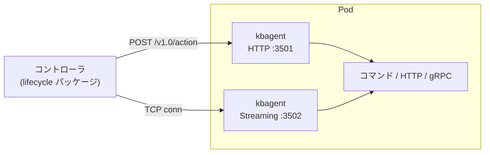
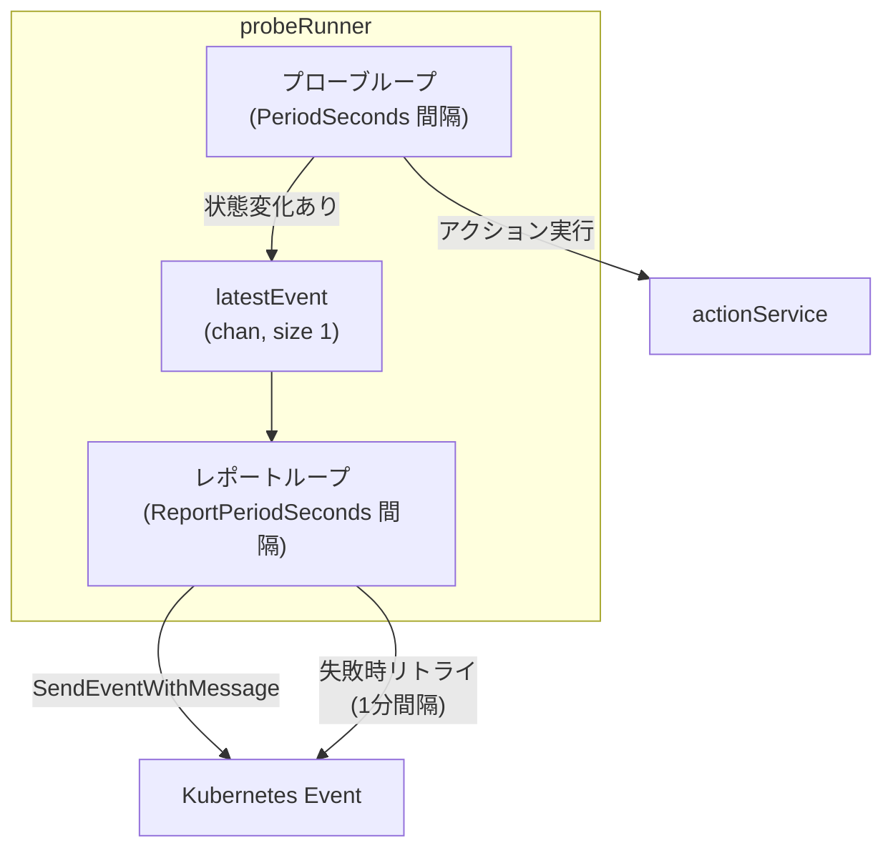

# 第16章 kbagent: ライフサイクルアクション実行エージェント

> 本章で読むソース
>
> - [cmd/kbagent/main.go L20-L96](https://github.com/apecloud/kubeblocks/blob/v1.0.2/cmd/kbagent/main.go#L20-L96)
> - [pkg/kbagent/setup.go L38-L231](https://github.com/apecloud/kubeblocks/blob/v1.0.2/pkg/kbagent/setup.go#L38-L231)
> - [pkg/kbagent/server/http_server.go L41-L160](https://github.com/apecloud/kubeblocks/blob/v1.0.2/pkg/kbagent/server/http_server.go#L41-L160)
> - [pkg/kbagent/service/service.go L31-L65](https://github.com/apecloud/kubeblocks/blob/v1.0.2/pkg/kbagent/service/service.go#L31-L65)
> - [pkg/kbagent/service/action.go L37-L157](https://github.com/apecloud/kubeblocks/blob/v1.0.2/pkg/kbagent/service/action.go#L37-L157)
> - [pkg/kbagent/service/action_utils.go L53-L184](https://github.com/apecloud/kubeblocks/blob/v1.0.2/pkg/kbagent/service/action_utils.go#L53-L184)
> - [pkg/kbagent/service/probe.go L48-L293](https://github.com/apecloud/kubeblocks/blob/v1.0.2/pkg/kbagent/service/probe.go#L48-L293)
> - [pkg/kbagent/service/streaming.go L40-L113](https://github.com/apecloud/kubeblocks/blob/v1.0.2/pkg/kbagent/service/streaming.go#L40-L113)
> - [pkg/kbagent/proto/proto.go L26-L141](https://github.com/apecloud/kubeblocks/blob/v1.0.2/pkg/kbagent/proto/proto.go#L26-L141)
> - [pkg/kbagent/client/http_client.go L38-L103](https://github.com/apecloud/kubeblocks/blob/v1.0.2/pkg/kbagent/client/http_client.go#L38-L103)
> - [pkg/controller/lifecycle/lifecycle.go L32-L82](https://github.com/apecloud/kubeblocks/blob/v1.0.2/pkg/controller/lifecycle/lifecycle.go#L32-L82)
> - [pkg/controller/lifecycle/kbagent.go L46-L420](https://github.com/apecloud/kubeblocks/blob/v1.0.2/pkg/controller/lifecycle/kbagent.go#L46-L420)

## この章の狙い

KubeBlocks はデータベースのライフサイクル（プロビジョニング後の初期化、終了前のクリーンアップ、ロール遷移、メンバの参加と脱退、設定再読込）をデータベースエンジン側で実行する必要がある。
本章で読む `kbagent` は、各 Pod にサイドカーとして配置され、コントローラからの HTTP リクエストを受けて Pod 内でコマンドを実行するエージェントである。
コントローラ側の `lifecycle` パッケージが `Lifecycle` インタフェースを通じて `kbagent` を呼び出す一連の流れを追い、エージェントの起動方式、サービス層、アクション実行機構を明らかにする。

## 前提

- 第1章で読んだ `Cluster`、`Component`、`ComponentDefinition` の関係を前提とする。
- `ComponentDefinition` の `LifecycleActions` フィールドに定義されたアクションを、`kbagent` が Pod 内で実行する。
- Kubernetes の Pod 内には `kbagent` コンテナがサイドカーとして注入される。

## 1. アーキテクチャ概観

`kbagent` は Pod 内で動作する軽量な HTTP サーバである。
コントローラは Pod IP とポートを使って HTTP POST を送り、`kbagent` が Pod 内でコマンドを実行するか、あるいは Pod 内のローカルエンドポイントへ HTTP/gRPC リクエストを転送する。



アーキテクチャの核は3層である。

1. **クライアント層**（`pkg/kbagent/client/`）: コントローラ側から Pod 内の `kbagent` へ HTTP で接続する。
2. **サーバ層**（`pkg/kbagent/server/`）: Pod 内でリクエストを受け付ける HTTP サーバとストリーミングサーバ。
3. **サービス層**（`pkg/kbagent/service/`）: アクション、プローブ、ストリーミングの3種サービスがリクエストを処理する。

## 2. 起動方式: サーバモードとワーカーモード

`kbagent` は1つのバイナリで2つの動作モードを使い分ける。
`cmd/kbagent/main.go` で `--server` フラグ（デフォルト `true`）を解釈し、`kbagent.Launch` に渡す。

pkg/kbagent/setup.go L129-L141:

```go
func Launch(logger logr.Logger, config server.Config) (bool, error) {
	envVars := util.EnvL2M(os.Environ())

	// initialize kb-agent
	services, err := initialize(logger, envVars)
	if err != nil {
		return false, errors.Wrap(err, "init action handlers failed")
	}
	if config.Server {
		return true, runAsServer(logger, config, services)
	}
	return false, runAsWorker(logger, services, envVars)
}
```

サーバモード（`config.Server == true`）は HTTP サーバとストリーミングサーバを起動し、シグナルを待ってブロックする。
ワーカーモード（`config.Server == false`）はタスクを順に実行して終了する。

### 2.1 サーバモードの起動

`runAsServer` はまず全サービスの `Start()` を呼び、次に HTTP サーバとストリーミングサーバをノンブロッキングで起動する。

pkg/kbagent/setup.go L203-L231:

```go
func runAsServer(logger logr.Logger, config server.Config, services []service.Service) error {
	if config.Port == config.StreamingPort {
		return errors.New("HTTP port and streaming port are the same")
	}

	// start all services first
	for i := range services {
		if err := services[i].Start(); err != nil {
			logger.Error(err, fmt.Sprintf("start service %s failed", services[i].Kind()))
			return err
		}
		logger.Info(fmt.Sprintf("service %s started...", services[i].Kind()))
	}

	// start the HTTP server
	httpServer := server.NewHTTPServer(logger, config, services)
	err := httpServer.StartNonBlocking()
	if err != nil {
		return errors.Wrap(err, "failed to start the HTTP server")
	}

	// start the streaming server
	streamingServer := server.NewStreamingServer(logger, config, streamingService(services))
	err = streamingServer.StartNonBlocking()
	if err != nil {
		return errors.Wrap(err, "failed to start the streaming server")
	}
	return nil
}
```

HTTP サーバはデフォルトで `0.0.0.0:3501` をリッスンする。
ストリーミングサーバは `0.0.0.0:3502` をリッスンする。

### 2.2 設定の受け渡し

アクションとプローブの定義は、Pod 生成時に環境変数として注入される。
`BuildEnv4Server` はアクションとプローブの配列を JSON にシリアライズし、`KB_AGENT_ACTION`、`KB_AGENT_PROBE`、`KB_AGENT_STREAMING` という環境変数に格納する。
起動時に `initialize` がこれらの環境変数を読み、JSON をデシリアライズしてサービスオブジェクトを生成する。
この設計により、コントローラは Pod を作成する時点で環境変数に全アクション定義を埋め込み、`kbagent` は外部依存なしに自己設定できる。

## 3. サービス層

`service.New` は3つのサービスを一括で生成する。

pkg/kbagent/service/service.go L42-L56:

```go
func New(logger logr.Logger, actions []proto.Action, probes []proto.Probe, streaming []string) ([]Service, error) {
	sa, err := newActionService(logger, actions)
	if err != nil {
		return nil, err
	}
	sp, err := newProbeService(logger, sa, probes)
	if err != nil {
		return nil, err
	}
	ss, err := newStreamingService(logger, sa, streaming)
	if err != nil {
		return nil, err
	}
	return []Service{sa, sp, ss}, nil
}
```

`Service` インタフェースは `Kind()`、`URI()`、`Start()`、`HandleConn()`、`HandleRequest()` を定める。

| サービス | URI | 用途 |
|---|---|---|
| `Action` | `/v1.0/action` | コマンド実行、HTTP 転送、gRPC 呼び出し |
| `Probe` | `/v1.0/probe` | ロールプローブの定期実行と結果報告 |
| `Streaming` | `/v1.0/streaming` | データ転送などストリーミング処理 |

### 3.1 Action サービス

`actionService` はリクエストされたアクション名で定義を検索し、3種類の実行方式のいずれかに委譲する。

pkg/kbagent/service/action.go L115-L131:

```go
func (s *actionService) handleRequest(ctx context.Context, req *proto.ActionRequest) ([]byte, error) {
	action, ok := s.actions[req.Action]
	if !ok {
		return nil, errors.Wrapf(proto.ErrNotDefined, "%s is not defined", req.Action)
	}
	if action.Exec == nil && action.HTTP == nil && action.GRPC == nil {
		return nil, errors.Wrapf(proto.ErrBadRequest, "%s is invalid", req.Action)
	}
	if err := checkReconfigure(ctx, req); err != nil {
		return nil, err
	}
	if req.NonBlocking == nil || !*req.NonBlocking {
		return blockingCallAction(ctx, action, req.Parameters, &action.TimeoutSeconds)
	}
	return s.handleRequestNonBlocking(ctx, req, action)
}
```

| 方式 | 構造体 | 動作 |
|---|---|---|
| `Exec` | `ExecAction` | Pod 内でコマンドをフォークして実行 |
| `HTTP` | `HTTPAction` | Pod 内のローカルエンドポイントへ HTTP リクエスト |
| `GRPC` | `GRPCAction` | gRPC リフレクションで動的にメソッドを解決して呼び出し |

`nonBlockingCallActionX` は3方式の振り分けを行い、共通のタイムアウト機構を適用する。

pkg/kbagent/service/action_utils.go L175-L184:

```go
func actionCallTimeoutContext(ctx context.Context, timeout *int32) (context.Context, context.CancelFunc) {
	switch {
	case ptr.Deref(timeout, 0) == 0:
		return context.WithTimeout(ctx, defaultActionCallTimeout)
	case *timeout > 0:
		return context.WithTimeout(ctx, min(time.Duration(*timeout)*time.Second, maxActionCallTimeout))
	default:
		return ctx, func() {}
	}
}
```

タイムアウト未指定時はデフォルト30秒、指定時は最大60秒を上限として `context.WithTimeout` を適用する。

アクションのリクエストボディや HTTP ヘッダには Go の `text/template` 構文が使える。
`renderTemplateData` はパラメータと環境変数をマージし、テンプレートを展開する。
`missingkey=error` オプションにより、テンプレート内の変数が未定義であれば即座にエラーとなる。

### 3.2 Probe サービス

`probeService` は起動時にプローブごとの `probeRunner` を生成し、それぞれが独立したゴルーチンで定期実行を開始する。

pkg/kbagent/service/probe.go L83-L95:

```go
func (s *probeService) Start() error {
	for name := range s.probes {
		runner := &probeRunner{
			logger:               s.logger.WithValues("probe", name),
			actionService:        s.actionService,
			latestEvent:          make(chan proto.ProbeEvent, 1),
			sendEventWithMessage: s.sendEventWithMessage,
		}
		go runner.run(s.probes[name])
		s.runners[name] = runner
	}
	return nil
}
```

`probeRunner` はプローブループとレポートループの2つのループを持つ。



プローブループは `PeriodSeconds` 間隔でアクションを実行し、成功回数と失敗回数をカウントする。
成功閾値（`SuccessThreshold`）に達すると成功イベントを、失敗閾値（`FailureThreshold`）に達すると失敗イベントを送る。
`latestEvent` チャネルはバッファサイズ1で、最新のイベントのみを保持する。

### 3.3 Streaming サービス

`streamingService` は TCP 接続を受け、ハンドシェイクとして `ActionRequest` を JSON で受信してから、対応するアクションをストリーミングで実行する。
ストリーミング実行ではアクションの標準出力をそのまま TCP 接続に書き込む。
これにより、データダンプのような大量の出力を伴う処理を、バッファリングなしで相手に転送できる。

## 4. HTTP サーバの実装

HTTP サーバは `fasthttp` を使って構築される。
ルータは各サービスの `URI()` に対して POST ハンドラを登録する。

pkg/kbagent/server/http_server.go L115-L149:

```go
func (s *httpServer) router() fasthttp.RequestHandler {
	router := fasthttprouter.New()
	for i := range s.services {
		s.registerService(router, s.services[i])
	}
	return router.Handler
}

func (s *httpServer) dispatcher(svc service.Service) func(*fasthttp.RequestCtx) {
	return func(reqCtx *fasthttp.RequestCtx) {
		ctx := context.Background()
		body := reqCtx.PostBody()

		output, err := svc.HandleRequest(ctx, body)
		statusCode := fasthttp.StatusOK
		if err != nil {
			statusCode = fasthttp.StatusInternalServerError
		}
		httpRespond(reqCtx, statusCode, output, err)
		if s.config.Logging {
			s.logger.Info("HTTP API Called",
				"user-agent", string(reqCtx.Request.Header.UserAgent()),
				"method", string(reqCtx.Method()),
				"path", string(reqCtx.Path()),
				"status code", statusCode,
				"cost", time.Since(reqCtx.Time()).Milliseconds(),
			)
		}
	}
}
```

ディスパッチャはリクエストボディをそのまま `svc.HandleRequest` に渡し、結果を JSON で返す。

## 5. コントローラからの呼び出し

コントローラ側は `pkg/controller/lifecycle/` パッケージで `Lifecycle` インタフェースを定義する。

pkg/controller/lifecycle/lifecycle.go L38-L60:

```go
type Lifecycle interface {
	PostProvision(ctx context.Context, cli client.Reader, opts *Options) error
	PreTerminate(ctx context.Context, cli client.Reader, opts *Options) error
	RoleProbe(ctx context.Context, cli client.Reader, opts *Options) ([]byte, error)
	Switchover(ctx context.Context, cli client.Reader, opts *Options, candidate string) error
	MemberJoin(ctx context.Context, cli client.Reader, opts *Options) error
	MemberLeave(ctx context.Context, cli client.Reader, opts *Options) error
	Reconfigure(ctx context.Context, cli client.Reader, opts *Options, args map[string]string) error
	AccountProvision(ctx context.Context, cli client.Reader, opts *Options, statement, user, password string) error
	UserDefined(ctx context.Context, cli client.Reader, opts *Options, name string, action *appsv1.Action, args map[string]string) error
}
```

### 5.1 アクション呼び出しの流れ

各メソッドは `checkedCallAction` を経由してアクションを実行する。

pkg/controller/lifecycle/kbagent.go L143-L152:

```go
func (a *kbagent) checkedCallAction(ctx context.Context, cli client.Reader, spec *appsv1.Action, lfa lifecycleAction, opts *Options) ([]byte, error) {
	if !spec.Defined() {
		return nil, errors.Wrap(ErrActionNotDefined, lfa.name())
	}
	if err := a.precondition(ctx, cli, spec); err != nil {
		return nil, err
	}
	return a.callAction(ctx, cli, spec, lfa, opts)
}
```

処理の流れは以下の順序である。

1. アクションが `ComponentDefinition` に定義されているか確認する。
2. 事前条件（`PreCondition`）をチェックする。
3. パラメータを構築する。
4. 対象 Pod を選択する。
5. 各 Pod の `kbagent` に HTTP でリクエストを送る。

### 5.2 事前条件チェック

`precondition` はアクション実行前にリソースの準備状態を検証する。

| 事前条件 | 検査対象 | 判定基準 |
|---|---|---|
| `Immediately` | なし | 即座に実行 |
| `RuntimeReady` | `InstanceSet` | `IsInstancesReady()` が true |
| `ComponentReady` | `Component` | `Phase == Running` |
| `ClusterReady` | `Cluster` | `Phase == Running` |

### 5.3 Pod 選択とパラメータ

`SelectTargetPods` は `TargetPodSelector` に応じて実行対象の Pod を決める。

| セレクタ | 動作 |
|---|---|
| `AnyReplica` | ランダムに1 Pod を選択 |
| `AllReplicas` | 全 Pod で順に実行 |
| `RoleSelector` | `kb-role` ラベルが一致する Pod を選択 |

各ライフサイクルアクションは固有の環境変数を生成する。
`switchover` は `KB_SWITCHOVER_CANDIDATE_NAME`、`KB_SWITCHOVER_CURRENT_FQDN` などを提供する。
`memberJoin` は `KB_JOIN_MEMBER_POD_FQDN` を、`accountProvision` は `KB_ACCOUNT_NAME`、`KB_ACCOUNT_PASSWORD` を提供する。

### 5.4 エラーの分類

`kbagent` サーバ側はエラーを文字列コード（`notDefined`、`preconditionFailed`、`timedOut` 等）に変換してレスポンスに埋め込む。
コントローラ側は `formatError` でそれを Go のエラー型に復元する。
コントローラ側とエージェント側で同じエラー分類を共有することで、リモート実行のエラーをローカルのエラー型として扱える。

## 6. クライアント層

`pkg/kbagent/client/` の `httpClient` はコントローラから `kbagent` へ接続する。

pkg/kbagent/client/http_client.go L51-L72:

```go
func (c *httpClient) Action(ctx context.Context, req proto.ActionRequest) (proto.ActionResponse, error) {
	rsp := proto.ActionResponse{}

	dryRun, ok := ctx.Value(constant.DryRunContextKey).(bool)
	if ok && dryRun {
		return rsp, nil
	}

	data, err := json.Marshal(req)
	if err != nil {
		return rsp, err
	}

	url := fmt.Sprintf(urlTemplate, c.host, c.port, proto.ServiceAction.URI)
	payload, err := c.request(ctx, http.MethodPost, url, bytes.NewReader(data))
	if err != nil {
		return rsp, err
	}

	defer payload.Close()
	return decode(payload, &rsp)
}
```

`DryRun` コンテキストキーがセットされていれば、実際には HTTP リクエストを送らずに空のレスポンスを返す。

## 7. 高速化の工夫: 非同期アクション実行と重複排除

`actionService` はノンブロッキングアクションに対して重複実行を防ぐ機構を持つ。

pkg/kbagent/service/action.go L133-L157:

```go
func (s *actionService) handleRequestNonBlocking(ctx context.Context, req *proto.ActionRequest, action *proto.Action) ([]byte, error) {
	s.mutex.Lock()
	defer s.mutex.Unlock()

	running, ok := s.runningActions[req.Action]
	if !ok {
		resultChan, err := nonBlockingCallAction(ctx, action, req.Parameters, &action.TimeoutSeconds)
		if err != nil {
			return nil, err
		}
		running = &runningAction{
			resultChan: resultChan,
		}
		s.runningActions[req.Action] = running
	}
	result := gather(running.resultChan)
	if result == nil {
		return nil, proto.ErrInProgress
	}
	delete(s.runningActions, req.Action)
	if (*result).err != nil {
		return nil, (*result).err
	}
	return (*result).stdout.Bytes(), nil
}
```

同じアクションが同時に複数回リクエストされた場合、2回目以降は `ErrInProgress` を返して即座に拒否する。
すでに実行中であれば結果チャネルを共有し、完了すれば結果を取得してマッピングから削除する。
この設計により、プローブのレポート要求やコントローラの再試行が同じアクションを重複実行することを防ぎ、リソースの無駄を抑制する。

加えて、HTTP クライアントと gRPC 接続は `sync.Map` ベースの `clientCache` で再利用される。
`httpClient()` は `clientCache` から HTTP クライアントを取得または生成し、`grpcClientConnection()` も同様に gRPC 接続をキャッシュする。
これにより、アクションが呼ばれるたびに TCP 接続を確立するオーバーヘッドがなくなり、Keep-Alive による接続再利用でレイテンシを抑えられる。

## まとめ

`kbagent` は Pod 内で動作するサイドカーエージェントであり、コントローラからの HTTP リクエストを受けてライフサイクルアクションを実行する。
アーキテクチャはクライアント層、サーバ層、サービス層の3層で構成される。
サーバモードでは HTTP サーバ（`fasthttp`）とストリーミングサーバを起動し、ワーカーモードではタスクを順次実行する。
アクションは `Exec`、`HTTP`、`GRPC` の3方式で実行され、テンプレート展開とタイムアウト管理を共通で備える。
コントローラ側の `lifecycle` パッケージは `Lifecycle` インタフェースを通じて、事前条件チェック、Pod 選択、パラメータ構築、HTTP 呼び出しを一貫して処理する。
ノンブロッキングアクションの重複排除と HTTP/gRPC 接続キャッシュが、アクション実行のオーバーヘッドを抑える。

## 関連する章

- [第15章 パラメータ管理と動的再設定](15-parameter-management.md): `Reconfigure` アクションで設定変更を適用する文脈。
- [第17章 Component 合成](17-component-synthesis.md): `ComponentDefinition` から実行時コンポーネントを合成し、ライフサイクルアクションを解決する。
- [第14章 OpsRequest と運用操作](14-opsrequest.md): `OpsRequest` がライフサイクルアクションをトリガする入口。
