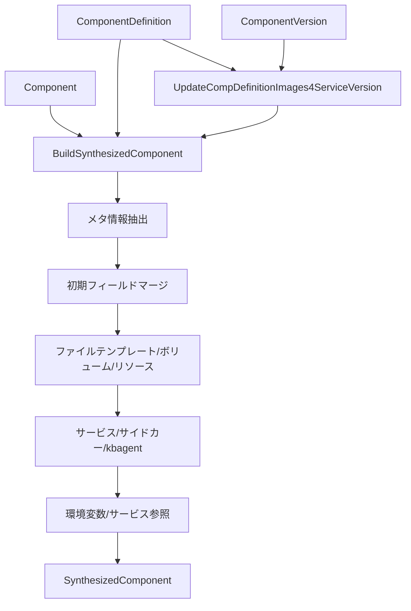

# 第17章 Component 合成: Definition から実行時コンポーネントへ

> 本章で読むソース:
>
> - [pkg/controller/component/synthesize_component.go L50-L166](https://github.com/apecloud/kubeblocks/blob/v1.0.2/pkg/controller/component/synthesize_component.go#L50-L166)
> - [pkg/controller/component/synthesize_component.go L228-L331](https://github.com/apecloud/kubeblocks/blob/v1.0.2/pkg/controller/component/synthesize_component.go#L228-L331)
> - [pkg/controller/component/synthesize_component.go L333-L512](https://github.com/apecloud/kubeblocks/blob/v1.0.2/pkg/controller/component/synthesize_component.go#L333-L512)
> - [pkg/controller/component/component_version.go L38-L101](https://github.com/apecloud/kubeblocks/blob/v1.0.2/pkg/controller/component/component_version.go#L38-L101)
> - [pkg/controller/component/component_version.go L103-L295](https://github.com/apecloud/kubeblocks/blob/v1.0.2/pkg/controller/component/component_version.go#L103-L295)
> - [pkg/controller/component/type.go L31-L87](https://github.com/apecloud/kubeblocks/blob/v1.0.2/pkg/controller/component/type.go#L31-L87)

## この章の狙い

`ComponentDefinition` はデータベースエンジンのひな形を定義し、`Component` はクラスタ内の個別インスタンスを宣言する。
両者は別々の CRD として存在するため、コントローラが実際にワークロードを生成するには、これらを 1つの `SynthesizedComponent` に統合する必要がある。
本章では `BuildSynthesizedComponent` 関数を起点に、定義層と実行層がどのように合成されるかを読み解く。
あわせて `ComponentVersion` によるイメージ解決の仕組みも扱う。

## 前提

- 第2章で `ComponentDefinition` と `Component` の CRD 構造を把握していること。
- 第9章で Component コントローラのトランスフォーマーパイプラインの概要を理解していること。
- `SynthesizedComponent` がトランスフォーマーチェーンの入力として使われることを知っていること。

## 1. SynthesizedComponent 型

`SynthesizedComponent` は `ComponentDefinition` と `Component` の双方から字段を取り出し、1つの構造体にまとめたものである。
この型が存在する理由を、まずは型定義から確認する。

pkg/controller/component/type.go L31-L80

```go
type SynthesizedComponent struct {
    Namespace                        string            `json:"namespace,omitempty"`
    ClusterName                      string            `json:"clusterName,omitempty"`
    ClusterUID                       string            `json:"clusterUID,omitempty"`
    Comp2CompDefs                    map[string]string `json:"comp2CompDefs,omitempty"`
    CompDef2CompCnt                  map[string]int32  `json:"compDef2CompCnt,omitempty"`
    Name                             string            `json:"name,omitempty"`
    FullCompName                     string            `json:"fullCompName,omitempty"`
    Generation                       string
    CompDefName                      string `json:"compDefName,omitempty"`
    ServiceKind                      string
    ServiceVersion                   string                                 `json:"serviceVersion,omitempty"`
    Replicas                         int32                                  `json:"replicas"`
    Resources                        corev1.ResourceRequirements            `json:"resources,omitempty"`
    PodSpec                          *corev1.PodSpec                        `json:"podSpec,omitempty"`
    // ... (中略) ...
    VolumeClaimTemplates             []corev1.PersistentVolumeClaimTemplate `json:"volumeClaimTemplates,omitempty"`
    FileTemplates                    []SynthesizedFileTemplate
    Roles                            []kbappsv1.ReplicaRole                 `json:"roles,omitempty"`
    LifecycleActions                 *kbappsv1.ComponentLifecycleActions `json:"lifecycleActions,omitempty"`
    ComponentServices                []kbappsv1.ComponentService         `json:"componentServices,omitempty"`
    Stop                             *bool
}
```

`PodSpec` は `ComponentDefinition` のランタイム定義をそのまま保持し、`Replicas` や `Resources` は `Component` のユーザー指定値を保持する。
このように「定義由来の字段」と「実行時指定の字段」が 1つの構造体に同居するのが `SynthesizedComponent` の特徴である。

ファイルテンプレートを表す `SynthesizedFileTemplate` も定義されている。

pkg/controller/component/type.go L82-L87

```go
type SynthesizedFileTemplate struct {
    kbappsv1.ComponentFileTemplate
    Config      bool
    Variables   map[string]string
    Reconfigure *kbappsv1.Action
}
```

`Config` フィールドは、このテンプレートが設定ファイル（`Configs`）由来かスクリプト（`Scripts`）由来かを区別する。
`Variables` には `Component` 側から渡された上書き変数が格納される。

## 2. 合成関数の全体像

`BuildSynthesizedComponent` は合成パイプラインのエントリポイントである。

pkg/controller/component/synthesize_component.go L50-L166

```go
func BuildSynthesizedComponent(ctx context.Context, cli client.Reader,
    compDef *appsv1.ComponentDefinition, comp *appsv1.Component) (*SynthesizedComponent, error) {
    if compDef == nil || comp == nil {
        return nil, nil
    }

    clusterName, err := GetClusterName(comp)
    if err != nil {
        return nil, err
    }
    clusterUID, err := GetClusterUID(comp)
    if err != nil {
        return nil, err
    }
    compName, err := ShortName(clusterName, comp.Name)
    if err != nil {
        return nil, err
    }
    comp2CompDef, err := BuildComp2CompDefs(ctx, cli, comp.Namespace, clusterName)
    if err != nil {
        return nil, err
    }
    compDef2CompCnt, err := buildCompDef2CompCount(ctx, cli, comp.Namespace, clusterName)
    if err != nil {
        return nil, err
    }
    // ... (中略) ...
    return synthesizeComp, nil
}
```

処理は大きく 3つの段階に分かれる。

1. メタ情報の抽出（クラスタ名、UID、コンポーネント短縮名、コンポーネント間マッピング）。
2. `SynthesizedComponent` の初期化（`ComponentDefinition` と `Component` の字段をマージ）。
3. 追加ビルドステップ（ボリューム、サイドカー、kbagent、サービス参照など）。

各段階を順に読む。

## 3. メタ情報の抽出

合成の第一段階は、`Component` オブジェクトからメタ情報を取り出すことである。

`GetClusterName` は `Component` のラベルからクラスタ名を取得する。

pkg/controller/component/component.go L49-L51

```go
func GetClusterName(comp *appsv1.Component) (string, error) {
    return getCompLabelValue(comp, constant.AppInstanceLabelKey)
}
```

`ShortName` はフルネームからクラスタ名のプレフィックスを除去し、コンポーネント固有の短縮名を得る。

pkg/controller/component/component.go L41-L47

```go
func ShortName(clusterName, compName string) (string, error) {
    name, found := strings.CutPrefix(compName, fmt.Sprintf("%s-", clusterName))
    if !found {
        return "", fmt.Errorf("the component name has no cluster name as prefix: %s", compName)
    }
    return name, nil
}
```

`BuildComp2CompDefs` はクラスタ内の全 `Component` を列挙し、コンポーネント名から `ComponentDefinition` 名へのマッピングを構築する。

pkg/controller/component/synthesize_component.go L168-L191

```go
func BuildComp2CompDefs(ctx context.Context, cli client.Reader, namespace, clusterName string) (map[string]string, error) {
    if cli == nil {
        return nil, nil // for test
    }

    labels := constant.GetClusterLabels(clusterName)
    comps, err := listObjWithLabelsInNamespace(ctx, cli, generics.ComponentSignature, namespace, labels)
    if err != nil {
        return nil, err
    }

    mapping := make(map[string]string)
    for _, comp := range comps {
        if len(comp.Spec.CompDef) == 0 {
            continue
        }
        compName, err1 := ShortName(clusterName, comp.Name)
        if err1 != nil {
            return nil, err1
        }
        mapping[compName] = comp.Spec.CompDef
    }
    return mapping, nil
}
```

このマッピングは、あるコンポーネントが同じクラスタ内の別コンポーネントを参照する場面（サービス参照など）で使われる。

## 4. 初期フィールドのマージ

メタ情報を得た後、関数は `SynthesizedComponent` のリテラルを構築する。
ここでの核心は、どの字段が `ComponentDefinition` 由来で、どの字段が `Component` 由来かを明確に分離している点にある。

pkg/controller/component/synthesize_component.go L78-L119

```go
    compDefObj := compDef.DeepCopy()
    synthesizeComp := &SynthesizedComponent{
        Namespace:                        comp.Namespace,
        ClusterName:                      clusterName,
        ClusterUID:                       clusterUID,
        Comp2CompDefs:                    comp2CompDef,
        CompDef2CompCnt:                  compDef2CompCnt,
        Name:                             compName,
        FullCompName:                     comp.Name,
        Generation:                       strconv.FormatInt(comp.Generation, 10),
        CompDefName:                      compDef.Name,
        ServiceKind:                      compDefObj.Spec.ServiceKind,
        ServiceVersion:                   comp.Spec.ServiceVersion,
        Labels:                           comp.Labels,
        StaticLabels:                     compDef.Spec.Labels,
        DynamicLabels:                    comp.Spec.Labels,
        // ... (中略) ...
        PodSpec:                          &compDef.Spec.Runtime,
        Replicas:                         comp.Spec.Replicas,
        Resources:                        comp.Spec.Resources,
        PodUpdatePolicy:                  getPodUpdatePolicy(comp, compDef),
        PodUpgradePolicy:                 getPodUpgradePolicy(comp, compDef),
    }
```

注目すべき点を整理する。

- `ServiceKind` は `ComponentDefinition` から取る。エンジン種別は定義層で決まる不変値である。
- `ServiceVersion` は `Component` から取る。同じ定義を使ってもバージョンはユーザーが切り替えられる。
- `PodSpec` は `ComponentDefinition` の `Runtime` をそのまま参照する。以降のビルドステップでこの `PodSpec` に変更为える。
- `StaticLabels` と `DynamicLabels` を分けて保持するのは、後段のラベルマージで両者の優先順位を明確にするためである。

## 5. PodUpdatePolicy の解決

`getPodUpdatePolicy` と `getPodUpgradePolicy` は、`ComponentDefinition` と `Component` の両方に存在しうるポッド更新方針を解決する。

pkg/controller/component/synthesize_component.go L485-L494

```go
func getPodUpdatePolicy(comp *appsv1.Component, compDef *appsv1.ComponentDefinition) appsv1.PodUpdatePolicyType {
    policy := compDef.Spec.PodUpdatePolicy
    if policy != nil && *policy == appsv1.ReCreatePodUpdatePolicyType {
        return appsv1.ReCreatePodUpdatePolicyType
    }
    if comp.Spec.PodUpdatePolicy != nil {
        return *comp.Spec.PodUpdatePolicy
    }
    return appsv1.PreferInPlacePodUpdatePolicyType // default
}
```

定義側で `ReCreate` が指定されていれば、それを強制する。
定義側が `ReCreate` でない場合に限って、ユーザー側の指定を採用する。
どちらも未指定なら `PreferInPlace` をデフォルトとする。
この優先順位により、データベースエンジンが安全性を理由に `ReCreate` を要求する場合、ユーザーがそれを緩和できない仕組みになっている。

## 6. ファイルテンプレートの構築

`buildFileTemplates` は `ComponentDefinition` の `Configs` と `Scripts` を `SynthesizedFileTemplate` の列に変換する。

pkg/controller/component/synthesize_component.go L430-L439

```go
func buildFileTemplates(synthesizedComp *SynthesizedComponent, compDef *appsv1.ComponentDefinition, comp *appsv1.Component) {
    templates := make([]SynthesizedFileTemplate, 0)
    for _, tpl := range compDef.Spec.Configs {
        templates = append(templates, synthesizeFileTemplate(comp, tpl, true))
    }
    for _, tpl := range compDef.Spec.Scripts {
        templates = append(templates, synthesizeFileTemplate(comp, tpl, false))
    }
    synthesizedComp.FileTemplates = templates
}
```

`synthesizeFileTemplate` は `Component` 側の `Configs` から同名のエントリを探し、変数や `ConfigMap` 名で上書きする。

pkg/controller/component/synthesize_component.go L441-L476

```go
func synthesizeFileTemplate(comp *appsv1.Component, tpl appsv1.ComponentFileTemplate, config bool) SynthesizedFileTemplate {
    merge := func(tpl SynthesizedFileTemplate, utpl appsv1.ClusterComponentConfig) SynthesizedFileTemplate {
        tpl.Variables = utpl.Variables
        if utpl.ConfigMap != nil {
            tpl.Namespace = comp.Namespace
            tpl.Template = utpl.ConfigMap.Name
        }
        tpl.Reconfigure = utpl.Reconfigure
        // ... (中略) ...
        return tpl
    }

    stpl := SynthesizedFileTemplate{
        ComponentFileTemplate: tpl,
        Config:                config,
    }
    if config {
        for _, utpl := range comp.Spec.Configs {
            if utpl.Name != nil && *utpl.Name == tpl.Name {
                return merge(stpl, utpl)
            }
        }
        return merge(stpl, appsv1.ClusterComponentConfig{})
    }
    return stpl
}
```

設定テンプレート（`config=true`）はユーザー指定とマージされるが、スクリプトテンプレート（`config=false`）は定義の内容がそのまま使われる。
この非対称性は、スクリプトがエンジン固有の内部ロジックであり、ユーザーが差し替えるべきでないという設計判断による。

## 7. ボリュームと PVC の構築

ボリューム関連の処理は 3つの関数に分かれて担当される。

`buildVolumeClaimTemplates` は `Component` の PVC テンプレートをコア API の型に変換し、削除時の保持ポリシーにデフォルト値を設定する。

pkg/controller/component/synthesize_component.go L250-L263

```go
func buildVolumeClaimTemplates(synthesizeComp *SynthesizedComponent, comp *appsv1.Component) {
    if comp.Spec.VolumeClaimTemplates != nil {
        synthesizeComp.VolumeClaimTemplates = intctrlutil.ToCoreV1PVCTs(comp.Spec.VolumeClaimTemplates)
    }
    if comp.Spec.PersistentVolumeClaimRetentionPolicy != nil {
        synthesizeComp.PVCRetentionPolicy = *comp.Spec.PersistentVolumeClaimRetentionPolicy
    }
    if len(synthesizeComp.PVCRetentionPolicy.WhenDeleted) == 0 {
        synthesizeComp.PVCRetentionPolicy.WhenDeleted = defaultPVCRetentionPolicy.WhenDeleted
    }
    if len(synthesizeComp.PVCRetentionPolicy.WhenScaled) == 0 {
        synthesizeComp.PVCRetentionPolicy.WhenScaled = defaultPVCRetentionPolicy.WhenScaled
    }
}
```

`mergeUserDefinedVolumes` は、`PodSpec` 既存のボリュームと `Component` が追加するボリュームを統合する。
このとき名前の重複を検出し、エラーを返す。

pkg/controller/component/synthesize_component.go L265-L299

```go
func mergeUserDefinedVolumes(synthesizedComp *SynthesizedComponent, comp *appsv1.Component) error {
    if comp == nil {
        return nil
    }
    volumes := sets.New[string]()
    for _, vols := range [][]corev1.Volume{synthesizedComp.PodSpec.Volumes, comp.Spec.Volumes} {
        for _, vol := range vols {
            if volumes.Has(vol.Name) {
                return fmt.Errorf("duplicated volume %s", vol.Name)
            }
            volumes.Insert(vol.Name)
        }
    }
    // ... (中略) ...
    synthesizedComp.PodSpec.Volumes = append(synthesizedComp.PodSpec.Volumes, comp.Spec.Volumes...)
    return nil
}
```

`buildVolumeMounts` はコンテナの `VolumeMount` を走査し、対応するボリュームが存在しなければ `emptyDir` を自動追加する。
ファイルテンプレートが管理するボリュームは除外される。
ファイルテンプレート用のボリュームは別のトランスフォーマーが `ConfigMap` や `Secret` で充填するため、ここで `emptyDir` を作ると競合する。

pkg/controller/component/synthesize_component.go L301-L331

```go
func buildVolumeMounts(synthesizedComp *SynthesizedComponent) {
    templateVolumes := sets.New[string]()
    for _, tpl := range synthesizedComp.FileTemplates {
        templateVolumes.Insert(tpl.VolumeName)
    }

    podSpec := synthesizedComp.PodSpec
    for _, cc := range []*[]corev1.Container{&podSpec.Containers, &podSpec.InitContainers} {
        volumes := podSpec.Volumes
        for _, c := range *cc {
            for _, v := range c.VolumeMounts {
                if templateVolumes.Has(v.Name) {
                    continue
                }
                createFn := func(_ string) corev1.Volume {
                    return corev1.Volume{
                        Name: v.Name,
                        VolumeSource: corev1.VolumeSource{
                            EmptyDir: &corev1.EmptyDirVolumeSource{},
                        },
                    }
                }
                volumes = intctrlutil.CreateVolumeIfNotExist(volumes, v.Name, createFn)
            }
        }
        podSpec.Volumes = volumes
    }
    synthesizedComp.PodSpec = podSpec
}
```

## 8. 共有メモリのサイズ制限

`limitSharedMemoryVolumeSize` は、`emptyDir`（`medium=Memory`）のサイズをメモリのリクエストまたは上限に合わせて制限する。

pkg/controller/component/synthesize_component.go L333-L358

```go
func limitSharedMemoryVolumeSize(synthesizeComp *SynthesizedComponent, comp *appsv1.Component) {
    shm := defaultShmQuantity
    if comp.Spec.Resources.Limits != nil {
        if comp.Spec.Resources.Limits.Memory().Cmp(shm) > 0 {
            shm = *comp.Spec.Resources.Limits.Memory()
        }
    }
    if comp.Spec.Resources.Requests != nil {
        if comp.Spec.Resources.Requests.Memory().Cmp(shm) > 0 {
            shm = *comp.Spec.Resources.Requests.Memory()
        }
    }
    for i, vol := range synthesizeComp.PodSpec.Volumes {
        if vol.EmptyDir == nil {
            continue
        }
        if vol.EmptyDir.Medium != corev1.StorageMediumMemory {
            continue
        }
        if vol.EmptyDir.SizeLimit != nil && !vol.EmptyDir.SizeLimit.IsZero() {
            continue
        }
        synthesizeComp.PodSpec.Volumes[i].EmptyDir.SizeLimit = &shm
    }
}
```

デフォルトの共有メモリは 64Mi である。
コンテナのメモリ上限またはリクエストがこれより大きければ、そちらに合わせて拡大する。
すでに `SizeLimit` が明示されていれば変更しない。

この処理は、データベースが `/dev/shm` を共有メモリ領域として使うケースに対応する。
Kubernetes のデフォルトでは `/dev/shm` が 64Mi に制限されるため、メモリを多く使うデータベースエンジンではここがボトルネックになる。
リソース指定に合わせて自動的に拡張することで、ユーザーが手動で `emptyDir` のサイズを調整する手間を省いている。

## 9. サイドカーと kbagent コンテナの注入

合成パイプラインの後半では、`PodSpec` に追加コンテナを注入する。

`buildSidecars` は `Component` の `Sidecars` 指定に従い、`SidecarDefinition` を参照してコンテナを構築する。
各サイドカーについて、コンテナ、環境変数、設定、スクリプトの 4段階でビルドを行う。

pkg/controller/component/sidecar.go L32-L58

```go
func buildSidecars(ctx context.Context, cli client.Reader, synthesizedComp *SynthesizedComponent, comp *appsv1.Component) error {
    for _, sidecar := range comp.Spec.Sidecars {
        if err := buildSidecar(ctx, cli, synthesizedComp, comp, sidecar); err != nil {
            return err
        }
    }
    return nil
}

func buildSidecar(ctx context.Context, cli client.Reader,
    synthesizedComp *SynthesizedComponent, comp *appsv1.Component, sidecar appsv1.Sidecar) error {
    sidecarDef, err := getNCheckSidecarDefinition(ctx, cli, sidecar.SidecarDef)
    if err != nil {
        return err
    }
    for _, builder := range []func(*SynthesizedComponent, *appsv1.SidecarDefinition, *appsv1.Component) error{
        buildSidecarContainers,
        buildSidecarVars,
        buildSidecarConfigs,
        buildSidecarScripts,
    } {
        if err := builder(synthesizedComp, sidecarDef, comp); err != nil {
            return err
        }
    }
    return nil
}
```

次いで `buildKBAgentContainer` が `kbagent` コンテナを注入する。
`LifecycleActions` が 1つも定義されていなければ `kbagent` は注入されない。
不要なサイドカーコンテナを起動しないことで、ポッドのメモリ消費と起動時間を抑えている。
kbagent の詳細は第16章を参照。

## 10. サービス参照と環境変数

`buildServiceReferences` は `ComponentDefinition` の `ServiceRefDeclarations` と `Component` の `ServiceRefs` を突き合わせ、接続先の `ServiceDescriptor` を解決する。

pkg/controller/component/service_reference.go L38-L44

```go
func buildServiceReferences(ctx context.Context, cli client.Reader,
    synthesizedComp *SynthesizedComponent, compDef *appsv1.ComponentDefinition, comp *appsv1.Component) error {
    if err := buildServiceReferencesWithoutResolve(ctx, cli, synthesizedComp, compDef, comp); err != nil {
        return err
    }
    return resolveServiceReferences(ctx, cli, synthesizedComp)
}
```

まず宣言とバインドを照合し、続いて接続先を API サーバから取得して解決する。
解決結果は `SynthesizedComponent.ServiceReferences` に格納され、後段のトランスフォーマーが環境変数や `ConfigMap` の生成に使う。

`mergeUserDefinedEnv` は `Component` のユーザー定義環境変数を全コンテナに追加する。

pkg/controller/component/synthesize_component.go L228-L248

```go
func mergeUserDefinedEnv(synthesizedComp *SynthesizedComponent, comp *appsv1.Component) error {
    if comp == nil || len(comp.Spec.Env) == 0 {
        return nil
    }

    vars := sets.New[string]()
    for _, v := range comp.Spec.Env {
        if vars.Has(v.Name) {
            return fmt.Errorf("duplicated user-defined env var %s", v.Name)
        }
        vars.Insert(v.Name)
    }

    for i := range synthesizedComp.PodSpec.InitContainers {
        synthesizedComp.PodSpec.InitContainers[i].Env = append(synthesizedComp.PodSpec.InitContainers[i].Env, comp.Spec.Env...)
    }
    for i := range synthesizedComp.PodSpec.Containers {
        synthesizedComp.PodSpec.Containers[i].Env = append(synthesizedComp.PodSpec.Containers[i].Env, comp.Spec.Env...)
    }
    return nil
}
```

重複する環境変数名があれば即座にエラーにする。
これは `ComponentDefinition` 側が定義済みの変数をユーザーが誤って上書きする事故を防ぐためである。

## 12. ComponentVersion によるイメージ解決

`ComponentVersion` は `ComponentDefinition` が使うコンテナイメージをバージョン付きで管理する CRD である。
`UpdateCompDefinitionImages4ServiceVersion` は、指定された `serviceVersion` に合致するイメージを `ComponentVersion` から探して `ComponentDefinition` のコンテナイメージを書き換える。

pkg/controller/component/component_version.go L91-L101

```go
func UpdateCompDefinitionImages4ServiceVersion(ctx context.Context, cli client.Reader,
    compDef *appsv1.ComponentDefinition, serviceVersion string) error {
    compVersions, err := CompatibleCompVersions4Definition(ctx, cli, compDef)
    if err != nil {
        return err
    }
    if len(compVersions) == 0 {
        return nil
    }
    return resolveImagesWithCompVersions(compDef, compVersions, serviceVersion)
}
```

`CompatibleCompVersions4Definition` はラベルで絞り込んだ `ComponentVersion` を列挙し、すべて `Available` かつ最新世代であることを確認する。

pkg/controller/component/component_version.go L39-L63

```go
func CompatibleCompVersions4Definition(ctx context.Context, cli client.Reader, compDef *appsv1.ComponentDefinition) ([]*appsv1.ComponentVersion, error) {
    compVersionList := &appsv1.ComponentVersionList{}
    labels := client.MatchingLabels{
        compDef.Name: compDef.Name,
    }
    if err := cli.List(ctx, compVersionList, labels); err != nil {
        return nil, err
    }

    if len(compVersionList.Items) == 0 {
        return nil, nil
    }

    compVersions := make([]*appsv1.ComponentVersion, 0)
    for i, compVersion := range compVersionList.Items {
        if compVersion.Generation != compVersion.Status.ObservedGeneration {
            return nil, fmt.Errorf("the matched ComponentVersion is not up to date: %s", compVersion.Name)
        }
        if compVersion.Status.Phase != appsv1.AvailablePhase {
            return nil, fmt.Errorf("the matched ComponentVersion is unavailable: %s", compVersion.Name)
        }
        compVersions = append(compVersions, &compVersionList.Items[i])
    }
    return compVersions, nil
}
```

`resolveImagesWithCompVersions` は次の手順でイメージを解決する。

1. `covertImagesFromCompDefinition` で `ComponentDefinition` 内の既存イメージを収集する。
2. `findMatchedImagesFromCompVersions` で `ComponentVersion` の `Releases` から `serviceVersion` に合致するイメージを探す。
3. `checkNMergeImages` で両者を統合する。`ComponentVersion` 側に見つかったイメージを優先し、なければ `ComponentDefinition` 側のイメージをそのまま使う。
4. コンテナとライフサイクルアクションのそれぞれについて、解決済みのイメージで書き換える。

pkg/controller/component/component_version.go L103-L140

```go
func resolveImagesWithCompVersions(compDef *appsv1.ComponentDefinition,
    compVersions []*appsv1.ComponentVersion, serviceVersion string) error {
    appsInDef := covertImagesFromCompDefinition(compDef)
    appsInVer, err := findMatchedImagesFromCompVersions(compVersions, serviceVersion)
    if err != nil {
        return err
    }

    apps := checkNMergeImages(serviceVersion, appsInDef, appsInVer)

    // コンテナとライフサイクルアクションのイメージを解決済みのもので書き換える
    // ... (中略) ...
    return nil
}
```

## 13. サービスバージョンの比較

`CompareServiceVersion` はセマンティックバージョンの major.minor.patch を比較する。

pkg/controller/component/component_version.go L66-L88

```go
func CompareServiceVersion(required, provided string) (bool, error) {
    if len(required) == 0 {
        return true, nil
    }
    rv, err1 := version.ParseSemantic(required)
    if err1 != nil {
        return false, err1
    }
    pv, err2 := version.ParseSemantic(provided)
    if err2 != nil {
        return false, err2
    }
    ret, _ := rv.WithPreRelease("").Compare(pv.WithPreRelease("").String())
    if ret != 0 {
        return false, nil
    }
    if len(rv.PreRelease()) == 0 {
        return true, nil
    }
    ret, _ = rv.Compare(provided)
    return ret == 0, nil
}
```

まず pre-release を除去して major.minor.patch を比較する。
これらが一致すれば、pre-release 未指定のときは true を返す。
required 側に pre-release がある場合に限って、完全一致で再比較する。
この 2段階の比較により、`"8.0"` を指定すれば `8.0.31` や `8.0.32-debian` にマッチし、`"8.0.31-rc1"` を指定すれば厳密に一致するバージョンだけが採用される。

## 14. 合成パイプラインの全体図

以上の処理をデータフローとして整理する。



`ComponentVersion` によるイメージ解決は合成の前段で実行され、解決後の `ComponentDefinition` が `BuildSynthesizedComponent` に渡される。

## 15. 最適化: リスト結果の再利用とラベル絞り込み

`BuildComp2CompDefs` はクラスタ内の全 `Component` をラベルで絞り込んで列挙する。

pkg/controller/component/synthesize_component.go L168-L191

```go
func BuildComp2CompDefs(ctx context.Context, cli client.Reader, namespace, clusterName string) (map[string]string, error) {
    if cli == nil {
        return nil, nil
    }

    labels := constant.GetClusterLabels(clusterName)
    comps, err := listObjWithLabelsInNamespace(ctx, cli, generics.ComponentSignature, namespace, labels)
    // ... (中略) ...
}
```

API サーバへの問い合わせをラベルセレクタで絞ることで、不要なオブジェクトの転送を避けている。
クラスタ内のコンポーネント数が増えた場合でも、API サーバ側でフィルタリングされるため、クライアント側のメモリ使用量は対象クラスタのコンポーネント数に比例する。
これは Informer のキャッシュを直接参照するのではなく `client.Reader` を明示的に使っている点にも表れており、合成関数が常に最新の状態を API サーバから取得する設計選択による。

## まとめ

`BuildSynthesizedComponent` は `ComponentDefinition`（エンジンのひな形）と `Component`（クラスタ内の個別宣言）を 1つの `SynthesizedComponent` に統合する関数である。
合成はメタ情報抽出、フィールドマージ、追加ビルドステップの 3段階で進行する。
追加ビルドステップではファイルテンプレート、ボリューム、リソース、サービス、サイドカー、kbagent、環境変数、サービス参照の順に処理を行う。
`ComponentVersion` はイメージのバージョン解決を担い、`serviceVersion` のセマンティック比較によって柔軟なバージョンマッチングを実現する。
`SynthesizedComponent` は以降のトランスフォーマーチェーンに渡され、`InstanceSet` や `Service` といった Kubernetes リソースの生成に使われる。

## 関連する章

- [第2章 ComponentDefinition と Component の CRD 構造](../part00-crd-overview/02-definitions.md)
- [第3章 Cluster と Component の仕様](../part00-crd-overview/03-cluster-and-component.md)
- [第9章 Component コントローラ: ワークロードの生成](../part02-main-controllers/09-component-controller.md)
- [第16章 kbagent: ライフサイクルアクション実行エージェント](16-kbagent.md)
