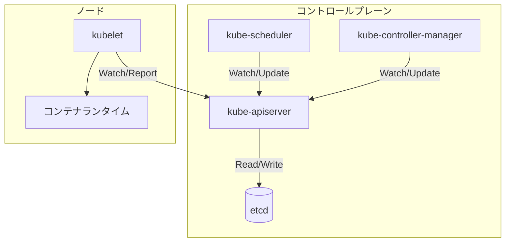
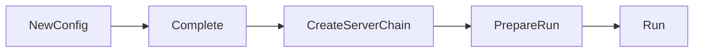
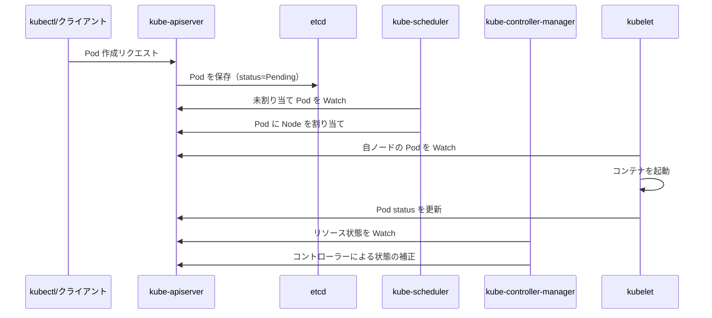

# 第1章 Kubernetes の全体像

> 本章で読むソース
>
> - [cmd/kube-apiserver/apiserver.go](https://github.com/kubernetes/kubernetes/blob/v1.36.2/cmd/kube-apiserver/apiserver.go)
> - [cmd/kube-scheduler/scheduler.go](https://github.com/kubernetes/kubernetes/blob/v1.36.2/cmd/kube-scheduler/scheduler.go)
> - [cmd/kube-controller-manager/controller-manager.go](https://github.com/kubernetes/kubernetes/blob/v1.36.2/cmd/kube-controller-manager/controller-manager.go)
> - [cmd/kubelet/kubelet.go](https://github.com/kubernetes/kubernetes/blob/v1.36.2/cmd/kubelet/kubelet.go)

## この章の狙い

Kubernetes は多数のバイナリが協調してクラスターを管理する。
本章では各コンポーネントのエントリーポイントを読み、全体像を把握する。
後の章で kube-apiserver の内部構造を詳しく扱うため、まずは各バイナリの役割と起動の共通パターンを理解する。

## 前提

読者は Kubernetes の基本的な概念（Pod、Node、リソース）を知っているものとする。
Go の文法、特に goroutine と interface の基礎に慣れていることを想定する。

## 4つの主要コンポーネント

Kubernetes のコントロールプレーンとノードは、それぞれ独立したプロセスとして動作する。

- **kube-apiserver**: クラスターの唯一のエントリーポイント。すべての REST 操作を受け付け、etcd とやり取りする。
- **kube-scheduler**: 未割り当ての Pod を監視し、ノードに割り当てる。
- **kube-controller-manager**: 各種コントローラーを束ね、望ましい状態を維持する。
- **kubelet**: 各ノードで動き、PodSpec に従ってコンテナを起動・監視する。



各コンポーネントは API サーバーを経由してのみ etcd のデータにアクセスする。
この設計により、すべての状態遷移が API サーバーのバリデーションとアダミッション制御を通過する。

## エントリーポイントの共通パターン

4つのバイナリの `main` 関数は、驚くほど似た構造を持つ。

### kube-apiserver

[cmd/kube-apiserver/apiserver.go L32-L36](https://github.com/kubernetes/kubernetes/blob/v1.36.2/cmd/kube-apiserver/apiserver.go#L32-L36)

```go
func main() {
	command := app.NewAPIServerCommand()
	code := cli.Run(command)
	os.Exit(code)
}
```

### kube-scheduler

[cmd/kube-scheduler/scheduler.go L29-L33](https://github.com/kubernetes/kubernetes/blob/v1.36.2/cmd/kube-scheduler/scheduler.go#L29-L33)

```go
func main() {
	command := app.NewSchedulerCommand()
	code := cli.Run(command)
	os.Exit(code)
}
```

### kube-controller-manager

[cmd/kube-controller-manager/controller-manager.go L34-L38](https://github.com/kubernetes/kubernetes/blob/v1.36.2/cmd/kube-controller-manager/controller-manager.go#L34-L38)

```go
func main() {
	command := app.NewControllerManagerCommand()
	code := cli.Run(command)
	os.Exit(code)
}
```

### kubelet

[cmd/kubelet/kubelet.go L35-L39](https://github.com/kubernetes/kubernetes/blob/v1.36.2/cmd/kubelet/kubelet.go#L35-L39)

```go
func main() {
	command := app.NewKubeletCommand(context.Background())
	code := cli.Run(command)
	os.Exit(code)
}
```

すべての `main` 関数は同じ3ステップを踏む。

1. `app.New*Command()` で `*cobra.Command` を生成する。
2. `cli.Run(command)` でコマンドを実行する。
3. `os.Exit(code)` で終了コードを返す。

この統一パターンは、`k8s.io/component-base/cli` パッケージが提供する `cli.Run` に依存している。
`cli.Run` はシグナルハンドリング、ログの初期化、エラーハンドリングを共通化し、各コンポーネントはビジネスロジックの構築に集中できる。

## import の共通性

各バイナリの import ブロックには、同じパターンが並ぶ。

```go
import (
	"k8s.io/component-base/cli"
	_ "k8s.io/component-base/logs/json/register"          // for JSON log format registration
	_ "k8s.io/component-base/metrics/prometheus/clientgo" // load all the prometheus client-go plugins
	_ "k8s.io/component-base/metrics/prometheus/version"  // for version metric registration
)
```

ブランクインポート（`_`）で副作用のみを利用するモジュールが4つある。

- **logs/json/register**: JSON 形式のログ出力を有効化する。
- **metrics/prometheus/clientgo**: Prometheus メトリクスを client-go レベルで登録する。
- **metrics/prometheus/version**: バージョン情報をメトリクスとして公開する。

これらは `init()` 関数内でグローバルな登録を行うため、import するだけで機能が有効になる。

## kube-apiserver の起動フロー

kube-apiserver は4つのコンポーネントの中で最も複雑な起動シーケンスを持つ。

[cmd/kube-apiserver/app/server.go L70-L145](https://github.com/kubernetes/kubernetes/blob/v1.36.2/cmd/kube-apiserver/app/server.go#L70-L145) の `NewAPIServerCommand` は cobra.Command を構築する。

```go
func NewAPIServerCommand() *cobra.Command {
	s := options.NewServerRunOptions()
	ctx := genericapiserver.SetupSignalContext()
	// ...
	cmd := &cobra.Command{
		Use: "kube-apiserver",
		Long: `The Kubernetes API server validates and configures data
for the api objects which include pods, services, replicationcontrollers, and
others. The API Server services REST operations and provides the frontend to the
cluster's shared state through which all other components interact.`,
		SilenceUsage: true,
		// ...
	}
	// ...
}
```

`RunE` コールバックは以下の順で処理を進める。

1. `s.Complete(ctx)` でオプションを補完する。
2. `completedOptions.Validate()` で妥当性を検証する。
3. `Run(ctx, completedOptions)` でサーバーを起動する。

`Run` 関数（L148-L173）はさらに以下の4段階を経る。

```go
func Run(ctx context.Context, opts options.CompletedOptions) error {
	klog.Infof("Version: %+v", utilversion.Get())
	config, err := NewConfig(opts)
	// ...
	completed, err := config.Complete()
	// ...
	server, err := CreateServerChain(completed)
	// ...
	prepared, err := server.PrepareRun()
	// ...
	return prepared.Run(ctx)
}
```



`CreateServerChain` は3つのサーバーを委譲チェーンでつなぐ。
この詳細は第3章で扱う。

## kubelet の起動フロー

kubelet は他のコンポーネントと異なり、`context.Background()` を `NewKubeletCommand` に渡す。

[cmd/kubelet/kubelet.go L36](https://github.com/kubernetes/kubernetes/blob/v1.36.2/cmd/kubelet/kubelet.go#L36)

```go
command := app.NewKubeletCommand(context.Background())
```

kubelet の `NewKubeletCommand`（cmd/kubelet/app/server.go L142-L329）は、cobra の `DisableFlagParsing: true` を設定する。
これは kubelet 独自のフラッグ優先順位ルール（コマンドラインフラッグ > 設定ファイル）を実現するためである。

`RunE` コールバックは以下の処理を行う。

1. フラグの手動パース。
2. 設定ファイルの読み込み（`loadConfigFile`）。
3. ドロップイン設定のマージ（`mergeKubeletConfigurations`）。
4. フラグの再パースによる優先順位の適用（`kubeletConfigFlagPrecedence`）。
5. `Run(ctx, kubeletServer, kubeletDeps, utilfeature.DefaultFeatureGate)` の呼び出し。

`Run` 関数（L542-L961）は `RunKubelet`（L1234-L1288）を呼び出し、最終的に `startKubelet`（L1290-L1304）で kubelet のメインループを起動する。

```go
func startKubelet(ctx context.Context, k kubelet.Bootstrap, podCfg *config.PodConfig, kubeCfg *kubeletconfiginternal.KubeletConfiguration, kubeDeps *kubelet.Dependencies, enableServer bool) {
	go k.Run(ctx, podCfg.Updates())
	if enableServer {
		go k.ListenAndServe(ctx, kubeCfg, kubeDeps.TLSConfig, kubeDeps.Auth, kubeDeps.TracerProvider)
	}
	// ...
}
```

kubelet は複数の goroutine を同時に起動し、Pod の同期、HTTP サーバー、Pod リソース API を並行して動作させる。

## cli.Run の内部

`cli.Run` は `k8s.io/component-base/cli` パッケージで定義される。
この関数は cobra.Command を受け取り、以下の処理を行う。

1. シグナルハンドリングの設定（SIGTERM、SIGINT で context をキャンセル）。
2. ログの初期化。
3. コマンドの実行とエラーハンドリング。
4. 終了コードの返却。

すべてのコンポーネントが同じ `cli.Run` を使うことで、シグナルハンドリングやログ出力の一貫性が保たれる。
開発者は新しいコンポーネントを追加する際、起動の骨組みを再利用できる。

### SetupSignalContext

kube-apiserver の `NewAPIServerCommand` では `genericapiserver.SetupSignalContext()` が呼ばれる。

```go
ctx := genericapiserver.SetupSignalContext()
```

この関数は SIGTERM と SIGINT を捕捉し、キャンセル可能な `context.Context` を返す。
シグナルを受信すると context がキャンセルされ、サーバーのグレースフルシャットダウンが開始される。
2回目のシグナル受信は即座にプロセスを終了させる（force shutdown）。

kubelet は `context.Background()` を渡す代わりに、`RunE` コールバック内で `genericapiserver.SetupSignalContext()` を呼び出す。

```go
// set up signal context for kubelet shutdown
ctx := genericapiserver.SetupSignalContext()
```

この違いは、kubelet がフラッグパースの段階では context を必要としないためである。

## コンポーネント間の関係



すべてのコンポーネントは kube-apiserver を経由して通信する。
直接の RPC は存在しない。
この設計は、各コンポーネントの独立性を高め、部分的な障害にも耐性を持たせる。

## 最適化の工夫: ブランクインポートによる登録パターン

Kubernetes のコンポーネントは、プラグイン的な拡張を `init()` 関数とブランクインポートで実現する。
このパターンは、コンパイル時にどの機能を組み込むかを決められるため、ランタイムオーバーヘッドがゼロである。
各プラグインは自身の `init()` でグローバルレジストリにエントリを追加し、本体のコードはインターフェース経由で利用する。
この設計により、新機能の追加が既存コードの変更を伴わず、バイナリサイズも必要な分だけに抑えられる。

## まとめ

本章では Kubernetes を構成する4つの主要バイナリのエントリーポイントを読んだ。
すべてのコンポーネントは `cobra.Command` と `cli.Run` という共通の枠組みで起動する。
kube-apiserver が唯一の API 入口として機能し、他のコンポーネントはすべて API サーバー経由で状態を監視・更新する。
このアーキテクチャが、Kubernetes の宣言的な制御と疎結合なコンポーネント設計の基盤となっている。

## 関連する章

- [第2章 起動とブートストラップ](02-startup.md): kube-apiserver と kubelet の起動詳細を扱う。
- [第3章 kube-apiserver のアーキテクチャ](../part01-apiserver/03-apiserver-architecture.md): API サーバーの内部構造を詳しく解説する。
