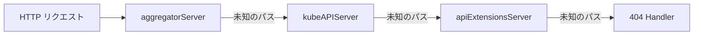
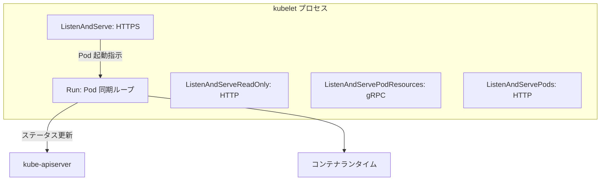
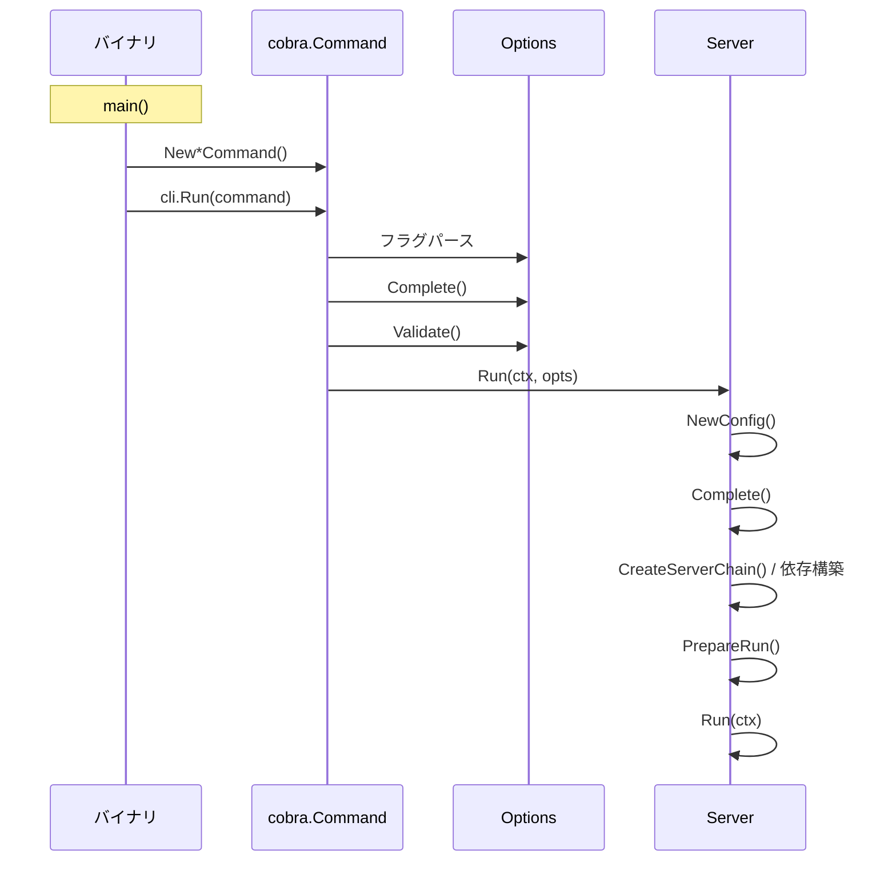

# 第2章 起動とブートストラップ

> 本章で読むソース
>
> - [cmd/kube-apiserver/app/server.go L1-L310](https://github.com/kubernetes/kubernetes/blob/v1.36.2/cmd/kube-apiserver/app/server.go#L1-L310)
> - [cmd/kubelet/app/server.go L1-L1450](https://github.com/kubernetes/kubernetes/blob/v1.36.2/cmd/kubelet/app/server.go#L1-L1450)

## この章の狙い

kube-apiserver と kubelet の起動シーケンスを追い、サーバーチェーンの構築と初期化の仕組みを理解する。
第1章で見た `Run` 関数の内訳を、コードレベルで確認する。

## 前提

第1章を読み、各バイナリのエントリーポイントの共通パターンを把握していること。

## kube-apiserver の起動

### NewAPIServerCommand から Run まで

[cmd/kube-apiserver/app/server.go L70-L145](https://github.com/kubernetes/kubernetes/blob/v1.36.2/cmd/kube-apiserver/app/server.go#L70-L145) の `NewAPIServerCommand` は cobra.Command を構築する。

```go
func NewAPIServerCommand() *cobra.Command {
	s := options.NewServerRunOptions()
	ctx := genericapiserver.SetupSignalContext()
	featureGate := s.GenericServerRunOptions.ComponentGlobalsRegistry.FeatureGateFor(basecompatibility.DefaultKubeComponent)

	cmd := &cobra.Command{
		Use: "kube-apiserver",
		Long: `The Kubernetes API server validates and configures data
for the api objects which include pods, services, replicationcontrollers, and
others. The API Server services REST operations and provides the frontend to the
cluster's shared state through which all other components interact.`,
		SilenceUsage: true,
		// ...
	}
	// ...
}
```

`SetupSignalContext()` は SIGTERM と SIGINT を捕捉してキャンセル可能な context を返す。
これにより、シグナル受信時にサーバーがグレースフルシャットダウンできる。

### Run 関数の4段階

[cmd/kube-apiserver/app/server.go L148-L173](https://github.com/kubernetes/kubernetes/blob/v1.36.2/cmd/kube-apiserver/app/server.go#L148-L173) の `Run` 関数は4段階の初期化を行う。

```go
func Run(ctx context.Context, opts options.CompletedOptions) error {
	klog.Infof("Version: %+v", utilversion.Get())

	klog.InfoS("Golang settings", "GOGC", os.Getenv("GOGC"), "GOMAXPROCS", os.Getenv("GOMAXPROCS"), "GOTRACEBACK", os.Getenv("GOTRACEBACK"))

	config, err := NewConfig(opts)
	if err != nil {
		return err
	}
	completed, err := config.Complete()
	if err != nil {
		return err
	}
	server, err := CreateServerChain(completed)
	if err != nil {
		return err
	}

	prepared, err := server.PrepareRun()
	if err != nil {
		return err
	}

	return prepared.Run(ctx)
}
```

1. **NewConfig**: コマンドラインオプションから内部設定を構築する。
2. **Complete**: 設定の欠落値を補完し、実行可能な状態にする。
3. **CreateServerChain**: 3つの API サーバーを委譲チェーンでつなぐ。
4. **PrepareRun と Run**: HTTP ハンドラーを準備し、リッスンを開始する。

### CreateServerChain による委譲チェーン

[cmd/kube-apiserver/app/server.go L176-L197](https://github.com/kubernetes/kubernetes/blob/v1.36.2/cmd/kube-apiserver/app/server.go#L176-L197) の `CreateServerChain` は、3つのサーバーを作成順に連結する。

```go
func CreateServerChain(config CompletedConfig) (*aggregatorapiserver.APIAggregator, error) {
	notFoundHandler := notfoundhandler.New(config.KubeAPIs.ControlPlane.Generic.Serializer, genericapifilters.NoMuxAndDiscoveryIncompleteKey)
	apiExtensionsServer, err := config.ApiExtensions.New(genericapiserver.NewEmptyDelegateWithCustomHandler(notFoundHandler))
	if err != nil {
		return nil, err
	}
	crdAPIEnabled := config.ApiExtensions.GenericConfig.MergedResourceConfig.ResourceEnabled(apiextensionsv1.SchemeGroupVersion.WithResource("customresourcedefinitions"))

	kubeAPIServer, err := config.KubeAPIs.New(apiExtensionsServer.GenericAPIServer)
	if err != nil {
		return nil, err
	}

	// aggregator comes last in the chain
	aggregatorServer, err := controlplaneapiserver.CreateAggregatorServer(config.Aggregator, kubeAPIServer.ControlPlane.GenericAPIServer, apiExtensionsServer.Informers.Apiextensions().V1().CustomResourceDefinitions(), crdAPIEnabled, apiVersionPriorities)
	if err != nil {
		return nil, err
	}

	return aggregatorServer, nil
}
```

サーバーの生成順序は以下の通りである。

1. **apiExtensionsServer**: CRD（Custom Resource Definition）を扱う。最も内側の委譲先。
2. **kubeAPIServer**: コア API リソースを扱う。apiExtensionsServer を委譲先とする。
3. **aggregatorServer**: API アグリゲーション（APIExtensionServer の集合体）を扱う。最も外側。



リクエストは外側から内側へ流れる。
aggregatorServer は登録済みの aggregated API のパスを処理し、未知のパスは kubeAPIServer に委譲する。
kubeAPIServer も同様に、コア API を処理し、未知のパスを apiExtensionsServer に渡す。

この委譲パターンは `DelegationTarget` インターフェースで実現される。
各サーバーは「次の委譲先」を保持し、自身が処理できないリクエストをフォールディングする。

### buildServiceResolver

[cmd/kube-apiserver/app/server.go L283-L310](https://github.com/kubernetes/kubernetes/blob/v1.36.2/cmd/kube-apiserver/app/server.go#L283-L310) の `buildServiceResolver` は、Webhook や aggregated API の接続先を解決する。

```go
func buildServiceResolver(enabledAggregatorRouting bool, hostname string, informer clientgoinformers.SharedInformerFactory) (webhook.ServiceResolver, error) {
	if testServiceResolver != nil {
		return testServiceResolver, nil
	}

	endpointSliceGetter, err := proxy.NewEndpointSliceIndexerGetter(informer.Discovery().V1().EndpointSlices())
	if err != nil {
		return nil, err
	}

	var serviceResolver webhook.ServiceResolver
	if enabledAggregatorRouting {
		serviceResolver = aggregatorapiserver.NewEndpointServiceResolver(
			informer.Core().V1().Services().Lister(),
			endpointSliceGetter,
		)
	} else {
		serviceResolver = aggregatorapiserver.NewClusterIPServiceResolver(
			informer.Core().V1().Services().Lister(),
		)
	}

	// resolve kubernetes.default.svc locally
	if localHost, err := url.Parse(hostname); err == nil {
		serviceResolver = aggregatorapiserver.NewLoopbackServiceResolver(serviceResolver, localHost)
	}
	return serviceResolver, nil
}
```

`kubernetes.default.svc` は API サーバー自身を指す。
`NewLoopbackServiceResolver` でラップすることで、API サーバーは自分自身への接続をループバックで解決する。
これにより、外部のロードバランサーを経由せずに自己参照できる。

## kubelet の起動

### フラグパースの特殊性

kubelet は他のコンポーネントと異なり、`DisableFlagParsing: true` を設定する（[cmd/kubelet/app/server.go L180](https://github.com/kubernetes/kubernetes/blob/v1.36.2/cmd/kubelet/app/server.go#L180)）。

```go
// The Kubelet has special flag parsing requirements to enforce flag precedence rules,
// so we do all our parsing manually in Run, below.
// DisableFlagParsing=true provides the full set of flags passed to the kubelet in the
// `args` arg to Run, without Cobra's interference.
DisableFlagParsing: true,
```

これは、コマンドラインフラッグを設定ファイルより優先させるためである。
`RunE` コールバック内で以下の順序でパースを行う。

1. `cleanFlagSet.Parse(args)` で手動パース。
2. `loadConfigFile` で設定ファイルを読み込み。
3. `mergeKubeletConfigurations` でドロップイン設定をマージ。
4. `kubeletConfigFlagPrecedence` でフラッグを再パースし、優先順位を適用。

### Run 関数の全体像

[cmd/kubelet/app/server.go L542-L961](https://github.com/kubernetes/kubernetes/blob/v1.36.2/cmd/kubelet/app/server.go#L542-L961) の `Run` 関数は、kubelet の起動に必要なすべての依存関係を構築する。

主な処理は以下の通りである。

1. **ホスト名の解決**: `nodeutil.GetHostname` でノード名を決定する。
2. **クライアントの構築**: API サーバーへの接続用クライアントを生成する。
3. **認証の構築**: `BuildAuth` で認証プロバイダーを初期化する。
4. **CRI の初期化**: `kubelet.PreInitRuntimeService` でコンテナランタイムとの接続を確立する。
5. **cgroup ドライバーの取得**: `getCgroupDriverFromCRI` で CRI から cgroup ドライバーを取得する。
6. **ContainerManager の構築**: `cm.NewContainerManager` でリソース管理を初期化する。
7. **RunKubelet の呼び出し**: 実際の kubelet を起動する。

### RunKubelet と startKubelet

[cmd/kubelet/app/server.go L1234-L1288](https://github.com/kubernetes/kubernetes/blob/v1.36.2/cmd/kubelet/app/server.go#L1234-L1288) の `RunKubelet` は kubelet インスタンスの生成と起動を行う。

```go
func RunKubelet(ctx context.Context, kubeServer *options.KubeletServer, kubeDeps *kubelet.Dependencies) error {
	logger := klog.FromContext(ctx)
	hostname, err := nodeutil.GetHostname(kubeServer.HostnameOverride)
	if err != nil {
		return err
	}
	nodeName := types.NodeName(hostname)
	// ...
	k, err := createAndInitKubelet(ctx,
		kubeServer,
		kubeDeps,
		hostname,
		nodeName,
		nodeIPs)
	if err != nil {
		return fmt.Errorf("failed to create kubelet: %w", err)
	}
	// ...
	startKubelet(ctx, k, podCfg, &kubeServer.KubeletConfiguration, kubeDeps, kubeServer.EnableServer)
	logger.Info("Started kubelet")
	return nil
}
```

`startKubelet`（[cmd/kubelet/app/server.go L1290-L1304](https://github.com/kubernetes/kubernetes/blob/v1.36.2/cmd/kubelet/app/server.go#L1290-L1304)）は複数の goroutine を起動する。

```go
func startKubelet(ctx context.Context, k kubelet.Bootstrap, podCfg *config.PodConfig, kubeCfg *kubeletconfiginternal.KubeletConfiguration, kubeDeps *kubelet.Dependencies, enableServer bool) {
	// start the kubelet
	go k.Run(ctx, podCfg.Updates())

	// start the kubelet server
	if enableServer {
		go k.ListenAndServe(ctx, kubeCfg, kubeDeps.TLSConfig, kubeDeps.Auth, kubeDeps.TracerProvider)
	}
	if kubeCfg.ReadOnlyPort > 0 {
		go k.ListenAndServeReadOnly(ctx, netutils.ParseIPSloppy(kubeCfg.Address), uint(kubeCfg.ReadOnlyPort), kubeDeps.TracerProvider)
	}

	go k.ListenAndServePodResources(ctx)
	go k.ListenAndServePods(ctx)
}
```

- `k.Run`: Pod 同期のメインループ。
- `k.ListenAndServe`: 認証付きの HTTPS サーバー。
- `k.ListenAndServeReadOnly`: 読み取り専用の HTTP サーバー。
- `k.ListenAndServePodResources`: gRPC による Pod リソース情報 API。
- `k.ListenAndServePods`: Pod 一覧の HTTP API。



## 起動シーケンスの比較



kube-apiserver は `CreateServerChain` で3つのサーバーを連結するのに対し、kubelet は `createAndInitKubelet` で単一の kubelet インスタンスを生成する。
この違いは、API サーバーが複数の API グループを委譲で統合するのに対し、kubelet は単一のノードエージェントとして動作することに対応する。

## 最適化の工夫: 委譲チェーンによるリクエストルーティング

`CreateServerChain` の委譲パターンは、リクエストのルーティングを効率的にする。
各サーバーは自身が処理するパスを把握しており、未知のパスのみを次の委譲先に渡す。
これにより、正規表現による大域的なパスマッチングが不要になり、O(1) のパス判定でリクエストを振り分けられる。
各サーバーの起動時にパスが登録されるため、起動後に新しいパスが追加されることはない。

## まとめ

本章では kube-apiserver と kubelet の起動シーケンスをコードレベルで追った。
kube-apiserver は3つのサーバーを委譲チェーンで連結し、外側から内側へリクエストを流す。
kubelet は複数の goroutine を起動し、Pod 同期、HTTP/gRPC サーバーを並行して動作させる。
両者とも `Complete` パターンで設定を補完し、`Validate` で整合性を確認してから起動する。

## 関連する章

- [第1章 Kubernetes の全体像](01-overview.md): 各コンポーネントの役割とエントリーポイント。
- [第3章 kube-apiserver のアーキテクチャ](../part01-apiserver/03-apiserver-architecture.md): API サーバーの内部構造。
