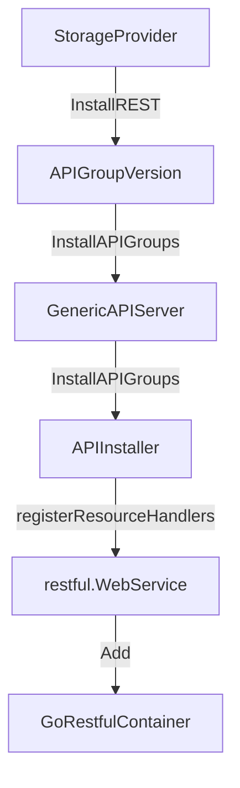
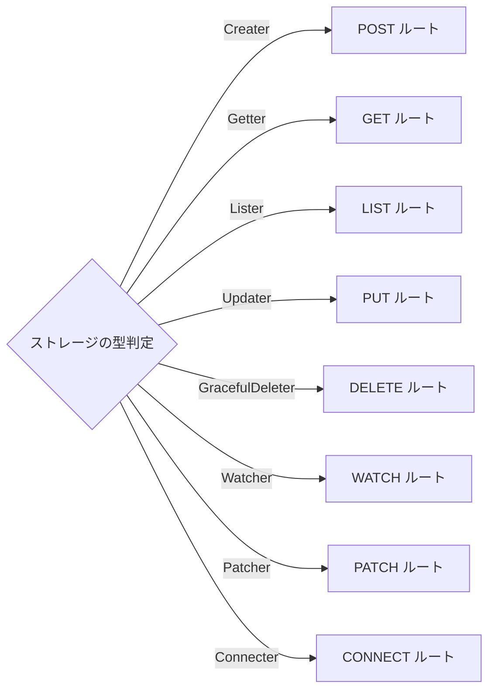
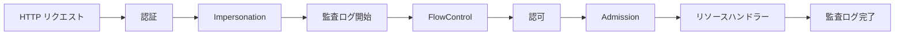

# 第3章 kube-apiserver のアーキテクチャ

> 本章で読むソース
>
> - [pkg/controlplane/instance.go L1-L533](https://github.com/kubernetes/kubernetes/blob/v1.36.2/pkg/controlplane/instance.go#L1-L533)
> - [staging/src/k8s.io/apiserver/pkg/server/genericapiserver.go L1-L1101](https://github.com/kubernetes/kubernetes/blob/v1.36.2/staging/src/k8s.io/apiserver/pkg/server/genericapiserver.go#L1-L1101)

## この章の狙い

kube-apiserver の内部構造を、`Instance` 構造体と `GenericAPIServer` の2層で理解する。
API グループの登録、ハンドラーチェーンの構築、リクエスト処理の全体像を把握する。

## 前提

第1章と第2章を読み、kube-apiserver の起動フローと委譲チェーンを把握していること。

## Instance 構造体

[pkg/controlplane/instance.go L204-L207](https://github.com/kubernetes/kubernetes/blob/v1.36.2/pkg/controlplane/instance.go#L204-L207) の `Instance` は kube-apiserver の最上位のインスタンスを表す。

```go
// Instance contains state for a Kubernetes cluster api server instance.
type Instance struct {
	ControlPlane *controlplaneapiserver.Server
}
```

`Instance` は `controlplaneapiserver.Server` を保持する。
この `Server` が `GenericAPIServer` を内包し、Kubernetes 固有の API リソース登録とコントローラーの起動を担う。

### Config と CompletedConfig

[pkg/controlplane/instance.go L182-L195](https://github.com/kubernetes/kubernetes/blob/v1.36.2/pkg/controlplane/instance.go#L182-L195) に `Config` と `CompletedConfig` が定義される。

```go
// Config defines configuration for the master
type Config struct {
	ControlPlane controlplaneapiserver.Config
	Extra
}

type completedConfig struct {
	ControlPlane controlplaneapiserver.CompletedConfig
	*Extra
}

// CompletedConfig embeds a private pointer that cannot be instantiated outside of this package
type CompletedConfig struct {
	*completedConfig
}
```

`Extra`（L132-L179）は kube-apiserver 固有の設定を保持する。

```go
type Extra struct {
	EndpointReconcilerConfig EndpointReconcilerConfig
	KubeletClientConfig      kubeletclient.KubeletClientConfig
	ServiceIPRange net.IPNet
	APIServerServiceIP net.IP
	SecondaryServiceIPRange net.IPNet
	SecondaryAPIServerServiceIP net.IP
	APIServerServicePort int
	ServiceNodePortRange      utilnet.PortRange
	KubernetesServiceNodePort int
	MasterCount int
	MasterEndpointReconcileTTL time.Duration
	EndpointReconcilerType reconcilers.Type
	RepairServicesInterval time.Duration
}
```

`Complete` メソッド（L256-L311）は未設定のフィールドにデフォルト値を補完する。

```go
func (c *Config) Complete() CompletedConfig {
	// ...
	if cfg.Extra.EndpointReconcilerConfig.Interval == 0 {
		cfg.Extra.EndpointReconcilerConfig.Interval = DefaultEndpointReconcilerInterval
	}
	if cfg.Extra.MasterEndpointReconcileTTL == 0 {
		cfg.Extra.MasterEndpointReconcileTTL = DefaultEndpointReconcilerTTL
	}
	if cfg.Extra.EndpointReconcilerConfig.Reconciler == nil {
		cfg.Extra.EndpointReconcilerConfig.Reconciler = c.createEndpointReconciler()
	}
	// ...
	return CompletedConfig{&cfg}
}
```

`CompletedConfig` はプライベートな `completedConfig` を埋め込み、外部パッケージからの再構築を防ぐ。
これは「一度 Complete したら変更できない」という不変条件を型で保証するパターンである。

### Instance の生成

[pkg/controlplane/instance.go L317-L385](https://github.com/kubernetes/kubernetes/blob/v1.36.2/pkg/controlplane/instance.go#L317-L385) の `New` メソッドは `Instance` を構築する。

```go
func (c CompletedConfig) New(delegationTarget genericapiserver.DelegationTarget) (*Instance, error) {
	if reflect.DeepEqual(c.Extra.KubeletClientConfig, kubeletclient.KubeletClientConfig{}) {
		return nil, fmt.Errorf("Master.New() called with empty config.KubeletClientConfig")
	}

	cp, err := c.ControlPlane.New(controlplaneapiserver.KubeAPIServer, delegationTarget)
	if err != nil {
		return nil, err
	}

	s := &Instance{
		ControlPlane: cp,
	}

	client, err := kubernetes.NewForConfig(c.ControlPlane.Generic.LoopbackClientConfig)
	if err != nil {
		return nil, err
	}

	restStorageProviders, err := c.StorageProviders(client)
	if err != nil {
		return nil, err
	}

	if err := s.ControlPlane.InstallAPIs(restStorageProviders...); err != nil {
		return nil, err
	}
	// ...
}
```

`New` は以下の手順を踏む。

1. `ControlPlane.New` で `controlplaneapiserver.Server` を生成する。
2. `StorageProviders` で REST ストレージプロバイダーの一覧を構築する。
3. `InstallAPIs` で各プロバイダーの API をインストールする。
4. `PostStartHook` で `kubernetesServiceCtrl` を起動する。

### StorageProviders の構築

[pkg/controlplane/instance.go L387-L446](https://github.com/kubernetes/kubernetes/blob/v1.36.2/pkg/controlplane/instance.go#L387-L446) の `StorageProviders` は、すべての API リソースグループのストレージプロバイダーを返す。

```go
func (c CompletedConfig) StorageProviders(client *kubernetes.Clientset) ([]controlplaneapiserver.RESTStorageProvider, error) {
	legacyRESTStorageProvider, err := corerest.New(corerest.Config{
		GenericConfig: *c.ControlPlane.NewCoreGenericConfig(),
		Proxy: corerest.ProxyConfig{
			Transport:           c.ControlPlane.Extra.ProxyTransport,
			KubeletClientConfig: c.Extra.KubeletClientConfig,
		},
		Services: corerest.ServicesConfig{
			ClusterIPRange:          c.Extra.ServiceIPRange,
			SecondaryClusterIPRange: c.Extra.SecondaryServiceIPRange,
			NodePortRange:           c.Extra.ServiceNodePortRange,
			IPRepairInterval:        c.Extra.RepairServicesInterval,
		},
	}, c.ControlPlane.Generic.Authorization.Authorizer)
	// ...
	providers := []controlplaneapiserver.RESTStorageProvider{
		legacyRESTStorageProvider,
		apiserverinternalrest.StorageProvider{},
		authenticationrest.RESTStorageProvider{...},
		authorizationrest.RESTStorageProvider{...},
		autoscalingrest.RESTStorageProvider{},
		batchrest.RESTStorageProvider{},
		certificatesrest.RESTStorageProvider{...},
		coordinationrest.RESTStorageProvider{},
		discoveryrest.StorageProvider{},
		networkingrest.RESTStorageProvider{},
		noderest.RESTStorageProvider{},
		policyrest.RESTStorageProvider{},
		rbacrest.RESTStorageProvider{...},
		schedulingrest.RESTStorageProvider{},
		storagerest.RESTStorageProvider{},
		svmrest.RESTStorageProvider{},
		flowcontrolrest.RESTStorageProvider{...},
		appsrest.StorageProvider{},
		admissionregistrationrest.RESTStorageProvider{...},
		eventsrest.RESTStorageProvider{...},
		resourcerest.RESTStorageProvider{...},
	}
	// ...
	return providers, nil
}
```

このリストの順序は Discovery の表示順序に影響する。
コメント（L406-L411）が説明するように、同じ名前のリソースが複数グループに存在する場合、このリストの順序で優先度が決まる。

## GenericAPIServer 構造体

[staging/src/k8s.io/apiserver/pkg/server/genericapiserver.go L109-L308](https://github.com/kubernetes/kubernetes/blob/v1.36.2/staging/src/k8s.io/apiserver/pkg/server/genericapiserver.go#L109-L308) の `GenericAPIServer` は、API サーバーの共通基盤である。

```go
// GenericAPIServer contains state for a Kubernetes cluster api server.
type GenericAPIServer struct {
	// discoveryAddresses is used to build cluster IPs for discovery.
	discoveryAddresses discovery.Addresses

	// LoopbackClientConfig is a config for a privileged loopback connection to the API server
	LoopbackClientConfig *restclient.Config

	// minRequestTimeout is how short the request timeout can be.  This is used to build the RESTHandler
	minRequestTimeout time.Duration

	// ShutdownTimeout is the timeout used for server shutdown. This specifies the timeout before server
	// gracefully shutdown returns.
	ShutdownTimeout time.Duration

	// legacyAPIGroupPrefixes is used to set up URL parsing for authorization and for validating requests
	// to InstallLegacyAPIGroup
	legacyAPIGroupPrefixes sets.String

	// admissionControl is used to build the RESTStorage that backs an API Group.
	admissionControl admission.Interface

	// SecureServingInfo holds configuration of the TLS server.
	SecureServingInfo *SecureServingInfo

	// Handler holds the handlers being used by this API server
	Handler *APIServerHandler

	// DiscoveryGroupManager serves /apis in an unaggregated form.
	DiscoveryGroupManager discovery.GroupManager

	// AggregatedDiscoveryGroupManager serves /apis in an aggregated form.
	AggregatedDiscoveryGroupManager discoveryendpoint.ResourceManager

	// Authorizer determines whether a user is allowed to make a certain request.
	Authorizer authorizer.Authorizer

	// EquivalentResourceRegistry provides information about resources equivalent to a given resource,
	// and the kind associated with a given resource.
	EquivalentResourceRegistry runtime.EquivalentResourceRegistry

	// delegationTarget is the next delegate in the chain. This is never nil.
	delegationTarget DelegationTarget

	// NonLongRunningRequestWaitGroup allows you to wait for all chain
	// handlers associated with non long-running requests
	// to complete while the server is shuting down.
	NonLongRunningRequestWaitGroup *utilwaitgroup.SafeWaitGroup
	// WatchRequestWaitGroup allows us to wait for all chain
	// handlers associated with active watch requests to
	// complete while the server is shuting down.
	WatchRequestWaitGroup *utilwaitgroup.RateLimitedSafeWaitGroup

	// ShutdownDelayDuration allows to block shutdown for some time, e.g. until endpoints pointing to this API server
	// have converged on all node. During this time, the API server keeps serving, /healthz will return 200,
	// but /readyz will return failure.
	ShutdownDelayDuration time.Duration

	// The limit on the request body size that would be accepted and decoded in a write request.
	// 0 means no limit.
	maxRequestBodyBytes int64

	// APIServerID is the ID of this API server
	APIServerID string

	// EffectiveVersion determines which apis and features are available
	// based on when the api/feature lifecyle.
	EffectiveVersion basecompatibility.EffectiveVersion

	// FeatureGate is a way to plumb feature gate through if you have them.
	FeatureGate featuregate.FeatureGate

	// lifecycleSignals provides access to the various signals that happen during the life cycle of the apiserver.
	lifecycleSignals lifecycleSignals

	// destroyFns contains a list of functions that should be called on shutdown to clean up resources.
	destroyFns []func()

	// ShutdownSendRetryAfter dictates when to initiate shutdown of the HTTP
	// Server during the graceful termination of the apiserver.
	ShutdownSendRetryAfter bool

	// ShutdownWatchTerminationGracePeriod, if set to a positive value,
	// is the maximum duration the apiserver will wait for all active
	// watch request(s) to drain.
	ShutdownWatchTerminationGracePeriod time.Duration
}
```

`GenericAPIServer` は Kubernetes 固有のロジックを含まない、汎用の API サーバー基盤である。
認証、認可、監査、ヘルスチェック、OpenAPI、グレースフルシャットダウンなどの機能を統合する。

### DelegationTarget インターフェース

[staging/src/k8s.io/apiserver/pkg/server/genericapiserver.go L310-L341](https://github.com/kubernetes/kubernetes/blob/v1.36.2/staging/src/k8s.io/apiserver/pkg/server/genericapiserver.go#L310-L341) は委譲チェーンのインターフェースを定義する。

```go
type DelegationTarget interface {
	UnprotectedHandler() http.Handler
	PostStartHooks() map[string]postStartHookEntry
	PreShutdownHooks() map[string]preShutdownHookEntry
	HealthzChecks() []healthz.HealthChecker
	ListedPaths() []string
	NextDelegate() DelegationTarget
	PrepareRun() preparedGenericAPIServer
	MuxAndDiscoveryCompleteSignals() map[string]<-chan struct{}
	Destroy()
}
```

各サーバーは `NextDelegate()` で次の委譲先を返し、チェーンをたどれる。
`UnprotectedHandler()` は認証チェーンを通過しなかった場合のフォールバックハンドラーを返す。

### PrepareRun による最終準備

[staging/src/k8s.io/apiserver/pkg/server/genericapiserver.go L444-L482](https://github.com/kubernetes/kubernetes/blob/v1.36.2/staging/src/k8s.io/apiserver/pkg/server/genericapiserver.go#L444-L482) の `PrepareRun` はサーバーの起動前準備を行う。

```go
func (s *GenericAPIServer) PrepareRun() preparedGenericAPIServer {
	s.delegationTarget.PrepareRun()

	if s.openAPIConfig != nil && !s.skipOpenAPIInstallation {
		s.OpenAPIVersionedService, s.StaticOpenAPISpec = routes.OpenAPI{
			Config: s.openAPIConfig,
		}.InstallV2(s.Handler.GoRestfulContainer, s.Handler.NonGoRestfulMux)
	}

	if s.openAPIV3Config != nil && !s.skipOpenAPIInstallation {
		s.OpenAPIV3VersionedService = routes.OpenAPI{
			V3Config: s.openAPIV3Config,
		}.InstallV3(s.Handler.GoRestfulContainer, s.Handler.NonGoRestfulMux)
	}

	s.installHealthz()
	s.installLivez()

	readinessStopCh := s.lifecycleSignals.ShutdownInitiated.Signaled()
	err := s.addReadyzShutdownCheck(readinessStopCh)
	// ...
	s.installReadyz()
	// ...
	return preparedGenericAPIServer{s}
}
```

`PrepareRun` は再帰的に委譲チェーンをたどり、各サーバーにヘルスチェックと OpenAPI をインストールする。
`preparedGenericAPIServer` はプライベートなラッパーで、`PrepareRun` を呼ばずに `Run` を呼べないことを型で保証する。

## API リソースの登録フロー



`StorageProvider` は REST ストレージを生成し、`APIGroupVersion` に渡す。
`APIInstaller`（[staging/src/k8s.io/apiserver/pkg/endpoints/installer.go L62-L66](https://github.com/kubernetes/kubernetes/blob/v1.36.2/staging/src/k8s.io/apiserver/pkg/endpoints/installer.go#L62-L66)）は各リソースの CRUD ハンドラーを `restful.WebService` に登録する。

```go
type APIInstaller struct {
	group             *APIGroupVersion
	prefix            string
	minRequestTimeout time.Duration
}
```

`Install` メソッド（L195-L222）はパスをソートし、決定論的な順序でリソースを登録する。

```go
func (a *APIInstaller) Install() ([]metav1.APIResource, []*storageversion.ResourceInfo, *restful.WebService, []error) {
	var apiResources []metav1.APIResource
	var resourceInfos []*storageversion.ResourceInfo
	var errors []error
	ws := a.newWebService()

	paths := make([]string, len(a.group.Storage))
	var i int = 0
	for path := range a.group.Storage {
		paths[i] = path
		i++
	}
	sort.Strings(paths)
	for _, path := range paths {
		apiResource, resourceInfo, err := a.registerResourceHandlers(path, a.group.Storage[path], ws)
		// ...
	}
	return apiResources, resourceInfos, ws, errors
}
```

`registerResourceHandlers`（L287-L699）は、ストレージがどのインターフェースを実装しているかで利用可能な verb を判定し、対応するルート（パスとハンドラーの組み合わせ）を生成する。



各 verb に対応するハンドラーは `handlers` パッケージの関数が担当する。
例えば `MethodGet` には `handlers.GetResource` が、`MethodWatch` には `handlers.WatchResource` が割り当てられる。

## ハンドラーチェーン

`GenericAPIServer` の `Handler` フィールドは `APIServerHandler` 型である。
これは複数の HTTP ハンドラーを保持し、リクエストを順次処理する。



各フィルターは `http.Handler` をラップし、次のハンドラーを呼び出す Chain of Responsibility パターンを構成する。
認証と認可は `genericapifilters` パッケージで実装され、Admission は `admission` パッケージのプラグインチェーンで処理される。

## APIGroupInfo 構造体

[staging/src/k8s.io/apiserver/pkg/server/genericapiserver.go L72-L99](https://github.com/kubernetes/kubernetes/blob/v1.36.2/staging/src/k8s.io/apiserver/pkg/server/genericapiserver.go#L72-L99) の `APIGroupInfo` は API グループの登録情報を保持する。

```go
type APIGroupInfo struct {
	PrioritizedVersions []schema.GroupVersion
	VersionedResourcesStorageMap map[string]map[string]rest.Storage
	OptionsExternalVersion *schema.GroupVersion
	MetaGroupVersion *schema.GroupVersion
	Scheme *runtime.Scheme
	NegotiatedSerializer runtime.NegotiatedSerializer
	ParameterCodec runtime.ParameterCodec
	StaticOpenAPISpec map[string]*spec.Schema
}
```

`VersionedResourcesStorageMap` は `version -> resource -> storage` の3層マップである。
例えば `v1 -> pods -> RESTStorage` のように、各バージョンの各リソースに対応するストレージが登録される。

## デフォルトの API バージョン設定

[pkg/controlplane/instance.go L448-L533](https://github.com/kubernetes/kubernetes/blob/v1.36.2/pkg/controlplane/instance.go#L448-L533) は、デフォルトで有効・無効にする API バージョンを定義する。

```go
var (
	genericStableAPIGroupVersionsEnabledByDefault = []schema.GroupVersion{
		admissionregistrationv1.SchemeGroupVersion,
		apiv1.SchemeGroupVersion,
		authenticationv1.SchemeGroupVersion,
		authorizationapiv1.SchemeGroupVersion,
		certificatesapiv1.SchemeGroupVersion,
		coordinationapiv1.SchemeGroupVersion,
		eventsv1.SchemeGroupVersion,
		rbacv1.SchemeGroupVersion,
		flowcontrolv1.SchemeGroupVersion,
	}
	stableAPIGroupVersionsEnabledByDefault = []schema.GroupVersion{
		appsv1.SchemeGroupVersion,
		autoscalingapiv1.SchemeGroupVersion,
		autoscalingapiv2.SchemeGroupVersion,
		batchapiv1.SchemeGroupVersion,
		discoveryv1.SchemeGroupVersion,
		networkingapiv1.SchemeGroupVersion,
		nodev1.SchemeGroupVersion,
		policyapiv1.SchemeGroupVersion,
		resourcev1.SchemeGroupVersion,
		storageapiv1.SchemeGroupVersion,
		schedulingapiv1.SchemeGroupVersion,
	}
	// ... alpha と beta は明示的に無効化
)
```

安定版（GA）はデフォルトで有効、alpha と beta は明示的に無効化される。
`DefaultAPIResourceConfigSource`（L524-L533）はこれらをまとめて `ResourceConfig` を構築する。

## 最適化の工夫: 決定論的なパス登録

`APIInstaller.Install` はパスを `sort.Strings` でソートしてから登録する。
これにより Swagger/OpenAPI の出力が安定し、クライアントのキャッシュが有効に機能する。
また、同じ名前が複数グループに存在する場合の優先順位が、リストの順序で決まる（L406-L411 のコメント参照）。
この決定論性は、クラスターのアップグレード時にも Discovery 出力が変わらないことを保証し、kubectl などのクライアントが混乱しない。

## まとめ

本章では kube-apiserver の内部構造を2層で読んだ。
`Instance` は Kubernetes 固有の API リソース登録とエンドポイント reconcile を担い、`GenericAPIServer` は認証・認可・監査などの汎用機能を提供する。
`CreateServerChain` で構築された委譲チェーンは、外側のサーバーから内側へリクエストを流す。
`APIInstaller` は各リソースの CRUD ハンドラーを生成し、`restful.WebService` に登録する。

## 関連する章

- [第2章 起動とブートストラップ](../part00-intro/02-startup.md): 起動シーケンスの詳細。
- [第4章 etcd ストレージと Cacher](04-etcd-and-cacher.md): ストレージ層の実装。
- [第5章 API リクエスト処理](05-api-request-processing.md): リクエストがハンドラーに到達するまでの流れ。
