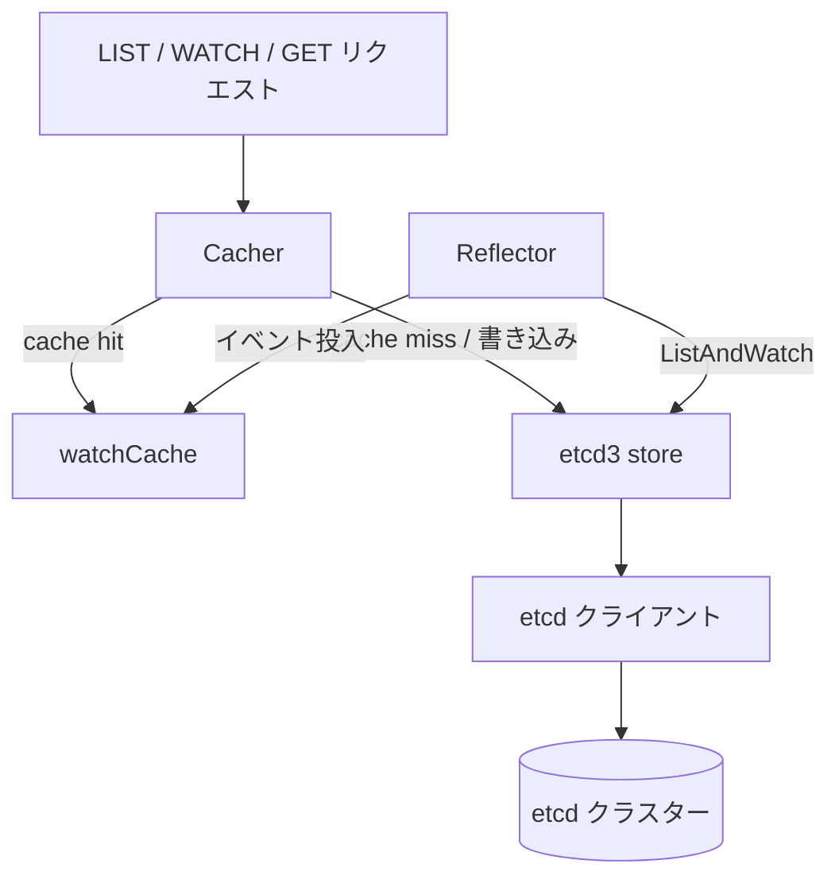
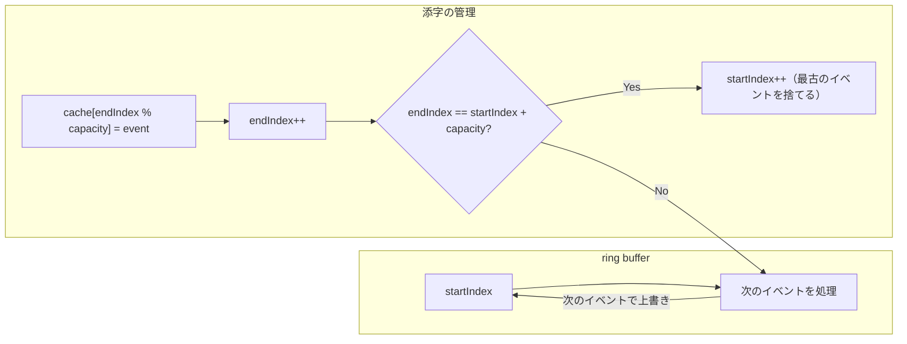
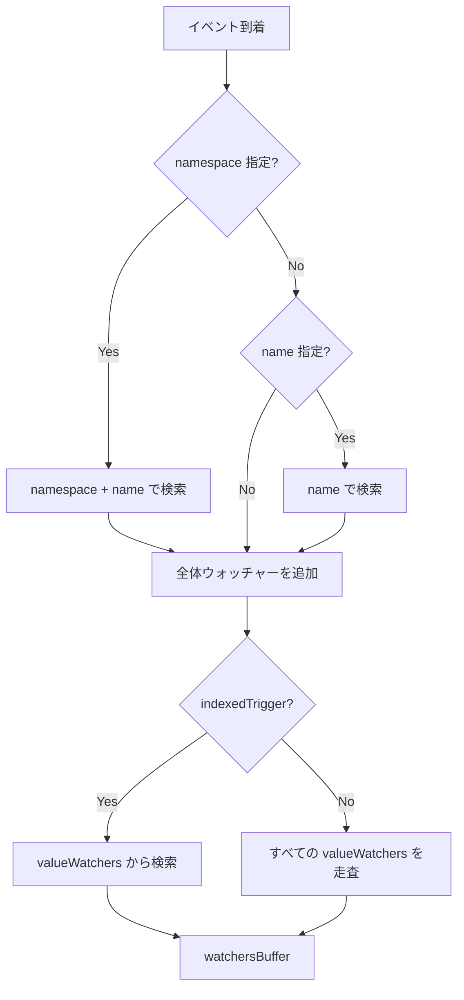

# 第4章 etcd ストレージと Cacher

> 本章で読むソース
>
> - [staging/src/k8s.io/apiserver/pkg/storage/cacher/cacher.go L1-L1477](https://github.com/kubernetes/kubernetes/blob/v1.36.2/staging/src/k8s.io/apiserver/pkg/storage/cacher/cacher.go#L1-L1477)
> - [staging/src/k8s.io/apiserver/pkg/storage/cacher/watch_cache.go L1-L957](https://github.com/kubernetes/kubernetes/blob/v1.36.2/staging/src/k8s.io/apiserver/pkg/storage/cacher/watch_cache.go#L1-L957)
> - [staging/src/k8s.io/apiserver/pkg/storage/etcd3/store.go L1-L1138](https://github.com/kubernetes/kubernetes/blob/v1.36.2/staging/src/k8s.io/apiserver/pkg/storage/etcd3/store.go#L1-L1138)
> - [staging/src/k8s.io/apiserver/pkg/storage/etcd3/watcher.go L1-L775](https://github.com/kubernetes/kubernetes/blob/v1.36.2/staging/src/k8s.io/apiserver/pkg/storage/etcd3/watcher.go#L1-L775)

## この章の狙い

kube-apiserver のストレージ層を2層構造で理解する。
最下層の etcd3 ストアがどのようにデータを読み書きし、その上の Cacher がどのように読み性能を最適化するかをコードレベルで追う。
特に WatchCache の ring buffer 構造、bookmark イベント、etcd watcher の管理に焦点を当てる。

## 前提

第3章を読み、`GenericAPIServer` と `Instance` の構造を把握していること。
etcd がキーバリューストアであり、MVCC（Multi-Version Concurrency Control）に基づく revision でデータを管理することを理解していること。

## ストレージの2層構造



`Cacher` は `storage.Interface` を実装し、LIST/WATCH/GET をキャッシュから提供する。
書き込み（Create/Update/Delete）は直接 etcd3 ストアに委譲する。
`Reflector` が etcd を監視してキャッシュを最新状態に保つ。

## etcd3 ストア

### store 構造体

[staging/src/k8s.io/apiserver/pkg/storage/etcd3/store.go L80-L98](https://github.com/kubernetes/kubernetes/blob/v1.36.2/staging/src/k8s.io/apiserver/pkg/storage/etcd3/store.go#L80-L98) の `store` は etcd と直接通信する。

```go
type store struct {
	client             *kubernetes.Client
	codec              runtime.Codec
	versioner          storage.Versioner
	transformer        value.Transformer
	pathPrefix         string
	groupResource      schema.GroupResource
	watcher            *watcher
	leaseManager       *leaseManager
	decoder            Decoder
	listErrAggrFactory func() ListErrorAggregator

	resourcePrefix string
	newListFunc    func() runtime.Object
	compactor      Compactor

	collectorMux          sync.RWMutex
	resourceSizeEstimator *resourceSizeEstimator
}
```

主要なフィールドの役割は以下の通りである。

- **client**: etcd の Kubernetes 用クライアント。`OptimisticPut`、`OptimisticDelete` などの楽観的ロック操作を提供する。
- **codec**: オブジェクトのエンコード・デコードを行う。
- **transformer**: 保存時の暗号化・復号を行う。
- **versioner**: リソースバージョンの管理を行う。
- **leaseManager**: TTL 付きオブジェクト用の etcd リースを管理する。

### Get 操作

[staging/src/k8s.io/apiserver/pkg/storage/etcd3/store.go L238-L271](https://github.com/kubernetes/kubernetes/blob/v1.36.2/staging/src/k8s.io/apiserver/pkg/storage/etcd3/store.go#L238-L271) の `Get` は etcd から単一オブジェクトを取得する。

```go
func (s *store) Get(ctx context.Context, key string, opts storage.GetOptions, out runtime.Object) error {
	preparedKey, err := s.prepareKey(key, false)
	if err != nil {
		return err
	}
	startTime := time.Now()
	getResp, err := s.client.Kubernetes.Get(ctx, preparedKey, kubernetes.GetOptions{})
	metrics.RecordEtcdRequest("get", s.groupResource, err, startTime)
	if err != nil {
		return err
	}
	if err = s.validateMinimumResourceVersion(opts.ResourceVersion, uint64(getResp.Revision)); err != nil {
		return err
	}

	if getResp.KV == nil {
		if opts.IgnoreNotFound {
			return runtime.SetZeroValue(out)
		}
		return storage.NewKeyNotFoundError(preparedKey, 0)
	}

	data, _, err := s.transformer.TransformFromStorage(ctx, getResp.KV.Value, authenticatedDataString(preparedKey))
	if err != nil {
		return storage.NewInternalError(err)
	}

	err = s.decoder.Decode(data, out, getResp.KV.ModRevision)
	if err != nil {
		recordDecodeError(s.groupResource, preparedKey)
		return err
	}
	return nil
}
```

`Get` は以下のステップを踏む。

1. キーを準備する（プレフィックスの付与）。
2. etcd からデータを取得し、メトリクスを記録する。
3. リソースバージョンの最小値を検証する。
4. `transformer.TransformFromStorage` で復号する。
5. `decoder.Decode` でオブジェクトにデコードする。

### Create 操作

[staging/src/k8s.io/apiserver/pkg/storage/etcd3/store.go L274-L339](https://github.com/kubernetes/kubernetes/blob/v1.36.2/staging/src/k8s.io/apiserver/pkg/storage/etcd3/store.go#L274-L339) の `Create` は etcd の楽観的ロックで排他制御を行う。

```go
func (s *store) Create(ctx context.Context, key string, obj, out runtime.Object, ttl uint64) error {
	// ...
	if version, err := s.versioner.ObjectResourceVersion(obj); err == nil && version != 0 {
		return storage.ErrResourceVersionSetOnCreate
	}
	if err := s.versioner.PrepareObjectForStorage(obj); err != nil {
		return fmt.Errorf("PrepareObjectForStorage failed: %v", err)
	}
	data, err := runtime.Encode(s.codec, obj)
	// ...
	newData, err := s.transformer.TransformToStorage(ctx, data, authenticatedDataString(preparedKey))
	// ...
	txnResp, err := s.client.Kubernetes.OptimisticPut(ctx, preparedKey, newData, 0, kubernetes.PutOptions{LeaseID: lease})
	// ...
	if !txnResp.Succeeded {
		return storage.NewKeyExistsError(preparedKey, 0)
	}
	// ...
}
```

`OptimisticPut` の第4引数 `0` は「revision 0 のときのみ作成」を意味する。
つまり、キーが既に存在する場合はトランザクションが失敗し、`KeyExistsError` を返す。
これにより、compare-and-swap のセマンティクスが実現される。

### GuaranteedUpdate 操作

`GuaranteedUpdate`（[L462-L499](https://github.com/kubernetes/kubernetes/blob/v1.36.2/staging/src/k8s.io/apiserver/pkg/storage/etcd3/store.go#L462-L499)）は、読み取り・変更・書き込みのアトミックな更新を保証する。
`tryUpdate` 関数を受け取り、現在の状態を渡して新しい状態を計算させる。
etcd のトランザクションで「期待する revision と一致する場合のみ書き込む」を実現し、競合時は再試行する。

## etcd watcher

### watcher 構造体

[staging/src/k8s.io/apiserver/pkg/storage/etcd3/watcher.go L72-L82](https://github.com/kubernetes/kubernetes/blob/v1.36.2/staging/src/k8s.io/apiserver/pkg/storage/etcd3/watcher.go#L72-L82) の `watcher` は etcd の watch チャネルを管理する。

```go
type watcher struct {
	client                   *clientv3.Client
	codec                    runtime.Codec
	newFunc                  func() runtime.Object
	objectType               string
	groupResource            schema.GroupResource
	versioner                storage.Versioner
	transformer              value.Transformer
	getCurrentStorageRV      func(context.Context) (uint64, error)
	getResourceSizeEstimator func() *resourceSizeEstimator
}
```

### watchChan 構造体

[staging/src/k8s.io/apiserver/pkg/storage/etcd3/watcher.go L84-L97](https://github.com/kubernetes/kubernetes/blob/v1.36.2/staging/src/k8s.io/apiserver/pkg/storage/etcd3/watcher.go#L84-L97) の `watchChan` は `watch.Interface` を実装する。

```go
type watchChan struct {
	watcher                  *watcher
	key                      string
	initialRev               int64
	recursive                bool
	progressNotify           bool
	internalPred             storage.SelectionPredicate
	ctx                      context.Context
	cancel                   context.CancelFunc
	incomingEventChan        chan *event
	resultChan               chan watch.Event
	getResourceSizeEstimator func() *resourceSizeEstimator
}
```

`incomingEventChan` は etcd から受信した生イベントを保持するバッファ（サイズ100）である。
`resultChan` はフィルター済みイベントをクライアントに送信するバッファ（サイズ100）である。

### Watch の開始

`Watch`（[L106-L128](https://github.com/kubernetes/kubernetes/blob/v1.36.2/staging/src/k8s.io/apiserver/pkg/storage/etcd3/watcher.go#L106-L128)）は watch チャネルを生成してバックグラウンドで実行する。
`wc.run` は `startWatching` と `processEvents` を並行して実行する。

### startWatching の処理

`startWatching`（[L355-L438](https://github.com/kubernetes/kubernetes/blob/v1.36.2/staging/src/k8s.io/apiserver/pkg/storage/etcd3/watcher.go#L355-L438)）は2つのフェーズを持つ。

1. **sync フェーズ**: `forceInitialEvents` が true の場合、既存オブジェクトをリストして `incomingEventChan` に投入する。
2. **watch フェーズ**: etcd の `Watch` API で変更ストリームを開き、イベントを逐次投入する。

`sync` メソッド（L271-L326）はページングで既存オブジェクトを取得し、各オブジェクトを `queueEvent` で投入する。
`getResp.Kvs[i] = nil` で早期にメモリを解放し、大きなリストのデコード時のメモリ使用量を抑える。

### 並行デコード

[staging/src/k8s.io/apiserver/pkg/storage/etcd3/watcher.go L440-L490](https://github.com/kubernetes/kubernetes/blob/v1.36.2/staging/src/k8s.io/apiserver/pkg/storage/etcd3/watcher.go#L440-L490) では、`ConcurrentWatchObjectDecode` feature gate が有効な場合、イベントのデコードを並行化する。

```go
func (wc *watchChan) processEvents(wg *sync.WaitGroup) {
	if utilfeature.DefaultFeatureGate.Enabled(features.ConcurrentWatchObjectDecode) {
		wc.concurrentProcessEvents(wg)
	} else {
		wg.Add(1)
		go wc.serialProcessEvents(wg)
	}
}
```

`serialProcessEvents`（L449-L470）は `incomingEventChan` から順次イベントを取り出し、`transform` でデコードして `resultChan` に送る。
`concurrentProcessEvents`（L472-L490）は `processEventConcurrency`（=10）のワーカーで並行デコードする。

## Cacher

### Cacher 構造体

[staging/src/k8s.io/apiserver/pkg/storage/cacher/cacher.go L258-L344](https://github.com/kubernetes/kubernetes/blob/v1.36.2/staging/src/k8s.io/apiserver/pkg/storage/cacher/cacher.go#L258-L344) の `Cacher` はキャッシュ層の中心である。

```go
type Cacher struct {
	incomingHWM storage.HighWaterMark
	incoming chan watchCacheEvent

	resourcePrefix string

	sync.RWMutex

	ready *ready

	storage storage.Interface

	objectType reflect.Type
	groupResource schema.GroupResource

	watchCache *watchCache
	reflector  *cache.Reflector

	versioner storage.Versioner

	newFunc func() runtime.Object
	newListFunc func() runtime.Object

	indexedTrigger *indexedTriggerFunc
	watcherIdx int
	watchers   indexedWatchers

	dispatchTimeoutBudget timeBudget

	stopLock sync.RWMutex
	stopped  bool
	stopCh   chan struct{}
	stopWg   sync.WaitGroup

	clock clock.Clock
	timer *time.Timer

	dispatching bool
	watchersBuffer []*cacheWatcher
	blockedWatchers []*cacheWatcher
	watchersToStop []*cacheWatcher
	bookmarkWatchers *watcherBookmarkTimeBuckets
	expiredBookmarkWatchers []*cacheWatcher
	compactor               *compactor
}
```

`Cacher` のコメント（L258-L262）が説明するように、WATCH と LIST リクエストを内部キャッシュから処理し、バックグラウンドでストレージの状態に基づいてキャッシュを更新する。

### Cacher の初期化

`NewCacherFromConfig`（[L349-L484](https://github.com/kubernetes/kubernetes/blob/v1.36.2/staging/src/k8s.io/apiserver/pkg/storage/cacher/cacher.go#L349-L484)）は Cacher を構築する。

初期化の重要なポイントは以下の通りである。

1. **watchCache の生成**: `processEvent` をコールバックとして渡し、イベント受信時に Cacher に通知する。
2. **Reflector の設定**: `storageWatchListPageSize`（=10000）でページングし、etcd からの初期リストを効率的に取得する。
3. **dispatchEvents の起動**: バックグラウンド goroutine でイベントのディスパッチを開始する。
4. **startCaching の起動**: `Reflector.ListAndWatch` を開始し、キャッシュの初期化を行う。

`MaxInternalErrorRetryDuration`（=30秒）は etcd のリーダー喪失時の再試行上限である。
3サイクル以内にリーダーが再選出されるケースが多いため、全ウォッチャーの再接続による負荷スパイクを防ぐ。

### startCaching と Reflector

`startCaching`（[L486-L502](https://github.com/kubernetes/kubernetes/blob/v1.36.2/staging/src/k8s.io/apiserver/pkg/storage/cacher/cacher.go#L486-L502)）は Reflector を介して etcd と同期する。

`Reflector.ListAndWatch` は以下の2ステップを実行する。

1. **List**: etcd から全オブジェクトを取得し、`watchCache.Replace` を呼ぶ。
2. **Watch**: etcd の watch チャネルを開き、変更イベントを逐次 `watchCache` に投入する。

`SetOnReplace` で登録したコールバックは、初期リスト完了時に `ready` を true に設定する。
これにより、Cacher がリクエストを処理できる状態になったことを示す。
エラー発生時は `ready` をエラー状態にし、次の再試行を待つ。

### processEvent と dispatchEvents

Cacher の `processEvent`（[L878-L884](https://github.com/kubernetes/kubernetes/blob/v1.36.2/staging/src/k8s.io/apiserver/pkg/storage/cacher/cacher.go#L878-L884)）は、watchCache から呼び出されるコールバックである。
イベントは `incoming` チャネル（バッファ100）経由で `dispatchEvents`（[L886-L945](https://github.com/kubernetes/kubernetes/blob/v1.36.2/staging/src/k8s.io/apiserver/pkg/storage/cacher/cacher.go#L886-L945)）に送られる。

`dispatchEvents` は2種類のイベントを処理する。

1. **通常イベント**: `incoming` チャネルから取り出し、`dispatchEvent` で各ウォッチャーに配信する。
2. **ブックマークイベント**: 約1秒間隔（ジッター付き）でタイマーから生成し、現在の `lastProcessedResourceVersion` を通知する。

ストレージ層から来たブックマークは意図的に無視する（L914-L923 のコメント参照）。
これは etcd からのブックマークが非常に高頻度で届く可能性があり、下流に伝播させるとシステム全体に過負荷をかけるためである。

## WatchCache

### watchCache 構造体

`watchCache`（[L89-L164](https://github.com/kubernetes/kubernetes/blob/v1.36.2/staging/src/k8s.io/apiserver/pkg/storage/cacher/watch_cache.go#L89-L164)）は「sliding window」の実装である。

コメント（L111-L113）が説明するように、`cache` は環状バッファ（cyclic buffer）である。
現在のコンテンツは `[startIndex%capacity, endIndex%capacity)` に格納され、要素数は `endIndex - startIndex` である。

主要なフィールド:

- **cache**: `watchCacheEvent` の配列。環状バッファとして使用。
- **startIndex/endIndex**: バッファの開始・終了位置。
- **store**: 現在の状態を保持するインデックス付きストア。LIST 用に使用。
- **resourceVersion**: 現在のリソースバージョン。
- **eventFreshDuration**: イベントを保持する最小期間。

### ring buffer の動作



`updateCache`（L360-L369）は ring buffer にイベントを追加する。

```go
func (w *watchCache) updateCache(event *watchCacheEvent) {
	w.resizeCacheLocked(event.RecordTime)
	if w.isCacheFullLocked() {
		// Cache is full - remove the oldest element.
		w.startIndex++
		w.removedEventSinceRelist = true
	}
	w.cache[w.endIndex%w.capacity] = event
	w.endIndex++
}
```

`isCacheFullLocked`（L393-L395）はバッファが満杯かどうかを判定する。

```go
func (w *watchCache) isCacheFullLocked() bool {
	return w.endIndex == w.startIndex+w.capacity
}
```

### 動的リサイズ

[staging/src/k8s.io/apiserver/pkg/storage/cacher/watch_cache.go L374-L411](https://github.com/kubernetes/kubernetes/blob/v1.36.2/staging/src/k8s.io/apiserver/pkg/storage/cacher/watch_cache.go#L374-L411) の `resizeCacheLocked` はイベントの頻度に応じてバッファサイズを動的に変更する。

```go
func (w *watchCache) resizeCacheLocked(eventTime time.Time) {
	if w.isCacheFullLocked() && eventTime.Sub(w.cache[w.startIndex%w.capacity].RecordTime) < w.eventFreshDuration {
		capacity := min(w.capacity*2, w.upperBoundCapacity)
		if capacity > w.capacity {
			w.doCacheResizeLocked(capacity)
		}
		return
	}
	if w.isCacheFullLocked() && eventTime.Sub(w.cache[(w.endIndex-w.capacity/4)%w.capacity].RecordTime) > w.eventFreshDuration {
		capacity := max(w.capacity/2, w.lowerBoundCapacity)
		if capacity < w.capacity {
			w.doCacheResizeLocked(capacity)
		}
		return
	}
}
```

リサイズのルールは以下の通りである。

- **2倍に拡大**: バッファが満杯で、かつ最古のイベントが `eventFreshDuration` 以内の場合。イベントの churn が高いことを意味する。
- **半分に縮小**: バッファが満杯で、かつ最近1/4のイベントが `eventFreshDuration` を超えている場合。イベントの churn が低いことを意味する。

初期容量は `defaultLowerBoundCapacity`（=100）、上限は `defaultUpperBoundCapacity`（=100*1024=102400）である。

### processEvent によるイベント処理

`processEvent`（[L283-L357](https://github.com/kubernetes/kubernetes/blob/v1.36.2/staging/src/k8s.io/apiserver/pkg/storage/cacher/watch_cache.go#L283-L357)）は各イベントを処理する。

重要な設計は以下の通りである。

1. **PrevObject の記録**: `store.Get` で前の状態を取得し、`PrevObject` に保存する。これにより、上位層で「ラベルが変更された」ような差分フィルタリングが可能になる。
2. **ロックの最小化**: `updateCache` と `store` の更新はロック内で行うが、`eventHandler` の呼び出しはロック外で行う（L348-L354 のコメント参照）。
3. **条件変数の通知**: `w.cond.Broadcast()` で、リソースバージョンの更新を待っている LIST リクエストを起こす。

### waitUntilFreshAndBlock

`waitUntilFreshAndBlock`（[L449-L490](https://github.com/kubernetes/kubernetes/blob/v1.36.2/staging/src/k8s.io/apiserver/pkg/storage/cacher/watch_cache.go#L449-L490)）は、キャッシュが指定されたリソースバージョンまで追いつくまでブロックする。

`blockTimeout`（=3秒）以内にキャッシュが追いつかない場合、`TooLargeResourceVersionError` を返す。
クライアントは1秒後に再試行することを促される（`resourceVersionTooHighRetrySeconds` = 1）。

`resourceVersion == 0` の場合は待機をスキップする（L464 のコメント参照）。
これは「任意の古い結果でよい」ことを意味し、最も一般的なケースである。
タイムアウト用の goroutine を起動しないことで、リソースバージョン0のリクエスト（最も頻度が高い）のオーバーヘッドを削減する。

## Bookmark イベント

### Bookmark の目的

Bookmark イベントは、現在のリソースバージョンをクライアントに通知するための空のイベントである。
クライアントは Bookmark を受信することで、「少なくともこのリソースバージョンまで処理済み」であることを確認できる。

### Cacher での Bookmark 生成

[staging/src/k8s.io/apiserver/pkg/storage/cacher/cacher.go L929-L940](https://github.com/kubernetes/kubernetes/blob/v1.36.2/staging/src/k8s.io/apiserver/pkg/storage/cacher/cacher.go#L929-L940) で、Cacher は約1秒間隔で Bookmark event を生成し、期限切れの watcher を走査する。

```go
case <-bookmarkTimer.C():
	bookmarkTimer.Reset(wait.Jitter(time.Second, 0.25))
	bookmarkEvent := &watchCacheEvent{
		Type:            watch.Bookmark,
		Object:          c.newFunc(),
		ResourceVersion: lastProcessedResourceVersion,
	}
	if err := c.versioner.UpdateObject(bookmarkEvent.Object, bookmarkEvent.ResourceVersion); err != nil {
		klog.Errorf("failure to set resourceVersion to %d on bookmark event %+v", bookmarkEvent.ResourceVersion, bookmarkEvent.Object)
		continue
	}
	c.dispatchEvent(bookmarkEvent)
```

`defaultBookmarkFrequency` は1分であり、各 watcher の次回 Bookmark 送信時刻はこの値を基準に再登録される。
1秒のタイマーは Bookmark event を生成して期限切れ watcher を走査する周期である。

### watcherBookmarkTimeBuckets

[staging/src/k8s.io/apiserver/pkg/storage/cacher/cacher.go L196-L249](https://github.com/kubernetes/kubernetes/blob/v1.36.2/staging/src/k8s.io/apiserver/pkg/storage/cacher/cacher.go#L196-L249) の `watcherBookmarkTimeBuckets` は、各ウォッチャーの Bookmark 送信タイミングを秒単位のバケットで管理する。

```go
type watcherBookmarkTimeBuckets struct {
	watchersBuckets   map[int64][]*cacheWatcher
	createTime        time.Time
	startBucketID     int64
	clock             clock.Clock
	bookmarkFrequency time.Duration
}
```

`addWatcherThreadUnsafe`（L220-L236）はウォッチャーを次の Bookmark 送信時刻のバケットに追加する。
`popExpiredWatchersThreadUnsafe`（L238-L249）は期限切れのバケットからウォッチャーを取り出す。

コメント（L196-L198）が説明するように、高精度は不要であるため、秒単位のバケットで管理する。
これにより、Bookmark 送信のオーバーヘッドを最小限に抑えられる。

## indexedWatchers による効率的なイベント配信

### indexedWatchers 構造体

`indexedWatchers`（[L143-L194](https://github.com/kubernetes/kubernetes/blob/v1.36.2/staging/src/k8s.io/apiserver/pkg/storage/cacher/cacher.go#L143-L194)）は、ウォッチャーを効率的に検索するためのインデックスである。

- **allWatchers**: `namespacedName`（名前空間と名前の組み合わせ）でインデックス化されたウォッチャー。
- **valueWatchers**: トリガー値（例えばノード名）でインデックス化されたウォッチャー。

### startDispatching

`startDispatching`（[L1065-L1135](https://github.com/kubernetes/kubernetes/blob/v1.36.2/staging/src/k8s.io/apiserver/pkg/storage/cacher/cacher.go#L1065-L1135)）は、イベントに関連するウォッチャーを選択する。

以下の順序でウォッチャーを集める。

1. **名前空間と名前で絞り込み**: イベントの `metadata.namespace` と `metadata.name` に一致するウォッチャー。
2. **名前空間のみで絞り込み**: `metadata.namespace` に一致するウォッチャー。
3. **名前で絞り込み**: `metadata.name` に一致するウォッチャー。
4. **全体ウォッチャー**: スコープ指定のないウォッチャー。
5. **トリガー値で絞り込み**: `indexedTrigger` が定義されている場合、トリガー値に一致するウォッチャー。



## 最適化の工夫: CachingObject によるレイジーデコード

[staging/src/k8s.io/apiserver/pkg/storage/cacher/cacher.go L947-L976](https://github.com/kubernetes/kubernetes/blob/v1.36.2/staging/src/k8s.io/apiserver/pkg/storage/cacher/cacher.go#L947-L976) の `setCachingObjects` は、イベント配信時に `cachingObject` でオブジェクトをラップする。

```go
func setCachingObjects(event *watchCacheEvent, versioner storage.Versioner) {
	switch event.Type {
	case watch.Added, watch.Modified:
		if object, err := newCachingObject(event.Object); err == nil {
			event.Object = object
		} else {
			klog.Errorf("couldn't create cachingObject from: %#v", event.Object)
		}
	case watch.Deleted:
		if object, err := newCachingObject(event.PrevObject); err == nil {
			updateResourceVersion(object, versioner, event.ResourceVersion)
			event.PrevObject = object
		} else {
			klog.Errorf("couldn't create cachingObject from: %#v", event.Object)
		}
	}
}
```

`cachingObject` はシリアライズ結果を遅延キャッシュするラッパーである。
複数のウォッチャーが同じオブジェクトを異なる形式（JSON、Protobuf）でエンコードする場合、最初のエンコード結果を再利用できる。
これにより、N 人のウォッチャーに対するエンコードコストが O(N) から O(1) に削減される。

コメント（L992-L997）が説明するように、メモリ使用量を増やすトレードオフがあるため、キャッシュはイベント配信後に破棄される。

## まとめ

本章では Kubernetes のストレージ層を2層構造で読んだ。
etcd3 ストアは楽観的ロックによるアトミックな更新と、トランザクションによる競合制御を提供する。
Cacher は Reflector を介して etcd と同期し、watchCache の ring buffer に変更履歴を保持する。
`indexedWatchers` による効率的なウォッチャー検索、`cachingObject` によるレイジーデコード、動的リサイズする ring buffer が、読み性能を最適化する。

## 関連する章

- [第3章 kube-apiserver のアーキテクチャ](03-apiserver-architecture.md): API サーバーの全体構造。
- [第5章 API リクエスト処理](05-api-request-processing.md): リクエストがストレージに到達するまでの流れ。
