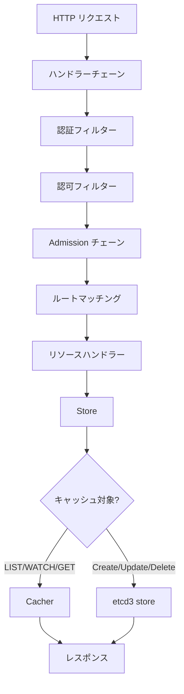
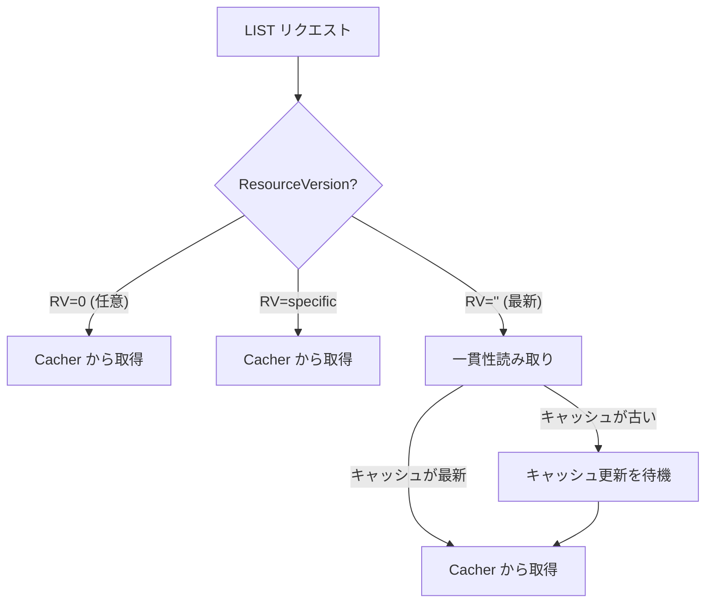
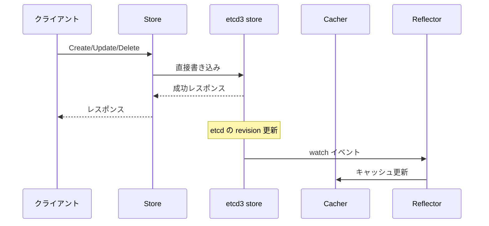

# 第5章 API リクエスト処理

> 本章で読むソース
>
> - [staging/src/k8s.io/apiserver/pkg/endpoints/installer.go L1-L1352](https://github.com/kubernetes/kubernetes/blob/v1.36.2/staging/src/k8s.io/apiserver/pkg/endpoints/installer.go#L1-L1352)
> - [staging/src/k8s.io/apiserver/pkg/registry/generic/registry/store.go L1-L1741](https://github.com/kubernetes/kubernetes/blob/v1.36.2/staging/src/k8s.io/apiserver/pkg/registry/generic/registry/store.go#L1-L1741)

## この章の狙い

API リクエストが HTTP ハンドラーに到達してからストレージ層に到達するまでの流れを追う。
`APIInstaller` によるルート登録、`Store` による CRUD 操作、そして Cacher と etcd の使い分けを理解する。

## 前提

第3章と第4章を読み、`GenericAPIServer` の構造とストレージ層の2層構造を把握していること。

## リクエストの全体フロー



ハンドラーチェーンは認証、認可、Admission を順次処理し、最後にリソース固有のハンドラーに到達する。
`Store` はリクエストの種別に応じて Cacher または etcd3 ストアに委譲する。

## APIInstaller によるルート登録

### Install メソッド

[staging/src/k8s.io/apiserver/pkg/endpoints/installer.go L195-L222](https://github.com/kubernetes/kubernetes/blob/v1.36.2/staging/src/k8s.io/apiserver/pkg/endpoints/installer.go#L195-L222) の `Install` はリソースごとにハンドラーを登録する。

```go
func (a *APIInstaller) Install() ([]metav1.APIResource, []*storageversion.ResourceInfo, *restful.WebService, []error) {
	var apiResources []metav1.APIResource
	var resourceInfos []*storageversion.ResourceInfo
	var errors []error
	ws := a.newWebService()

	paths := make([]string, len(a.group.Storage))
	var i int = 0
	for path := range a.group.Storage {
		paths[i] = path
		i++
	}
	sort.Strings(paths)
	for _, path := range paths {
		apiResource, resourceInfo, err := a.registerResourceHandlers(path, a.group.Storage[path], ws)
		if err != nil {
			errors = append(errors, fmt.Errorf("error in registering resource: %s, %v", path, err))
		}
		if apiResource != nil {
			apiResources = append(apiResources, *apiResource)
		}
		if resourceInfo != nil {
			resourceInfos = append(resourceInfos, resourceInfo)
		}
	}
	return apiResources, resourceInfos, ws, errors
}
```

パスをソートしてから登録することで、Swagger/OpenAPI の出力が決定論的になる。

### registerResourceHandlers による verb 判定

[staging/src/k8s.io/apiserver/pkg/endpoints/installer.go L287-L597](https://github.com/kubernetes/kubernetes/blob/v1.36.2/staging/src/k8s.io/apiserver/pkg/endpoints/installer.go#L287-L597) の `registerResourceHandlers` は、ストレージが実装するインターフェースをタイプアサーションで判定する。

```go
func (a *APIInstaller) registerResourceHandlers(path string, storage rest.Storage, ws *restful.WebService) (*metav1.APIResource, *storageversion.ResourceInfo, error) {
	// ...
	creater, isCreater := storage.(rest.Creater)
	namedCreater, isNamedCreater := storage.(rest.NamedCreater)
	lister, isLister := storage.(rest.Lister)
	getter, isGetter := storage.(rest.Getter)
	getterWithOptions, isGetterWithOptions := storage.(rest.GetterWithOptions)
	gracefulDeleter, isGracefulDeleter := storage.(rest.GracefulDeleter)
	collectionDeleter, isCollectionDeleter := storage.(rest.CollectionDeleter)
	updater, isUpdater := storage.(rest.Updater)
	patcher, isPatcher := storage.(rest.Patcher)
	watcher, isWatcher := storage.(rest.Watcher)
	connecter, isConnecter := storage.(rest.Connecter)
	// ...
}
```

各インターフェースの実装有無に応じて、サポートする verb が決まる。
例えば `rest.Getter` を実装していれば GET ルートが登録され、`rest.Watcher` を実装していれば WATCH ルートが登録される。

### アクションの生成

[staging/src/k8s.io/apiserver/pkg/endpoints/installer.go L500-L597](https://github.com/kubernetes/kubernetes/blob/v1.36.2/staging/src/k8s.io/apiserver/pkg/endpoints/installer.go#L500-L597) で、名前空間スコープに応じてパスを生成する。

名前空間スコープのリソースの場合:

```go
namespaceParam := ws.PathParameter("namespace", "object name and auth scope, such as for teams and projects").DataType("string")
namespacedPath := namespaceParamName + "/{namespace}/" + resource
// ...
actions = appendIf(actions, action{request.MethodList, resourcePath, resourceParams, namer, false}, isLister)
actions = appendIf(actions, action{request.MethodPost, resourcePath, resourceParams, namer, false}, isCreater)
actions = appendIf(actions, action{request.MethodDeleteCollection, resourcePath, resourceParams, namer, false}, isCollectionDeleter)
actions = appendIf(actions, action{request.MethodWatchList, "watch/" + resourcePath, resourceParams, namer, false}, allowWatchList)

actions = appendIf(actions, action{request.MethodGet, itemPath, nameParams, namer, false}, isGetter)
actions = appendIf(actions, action{request.MethodPut, itemPath, nameParams, namer, false}, isUpdater)
actions = appendIf(actions, action{request.MethodPatch, itemPath, nameParams, namer, false}, isPatcher)
actions = appendIf(actions, action{request.MethodDelete, itemPath, nameParams, namer, false}, isGracefulDeleter)
actions = appendIf(actions, action{request.MethodWatch, "watch/" + itemPath, nameParams, namer, false}, isWatcher)
actions = appendIf(actions, action{request.MethodConnect, itemPath, nameParams, namer, false}, isConnecter)
```

生成されるパスの例:

| verb | パス |
|------|------|
| LIST | `/api/v1/namespaces/{namespace}/pods` |
| CREATE | `/api/v1/namespaces/{namespace}/pods` |
| GET | `/api/v1/namespaces/{namespace}/pods/{name}` |
| UPDATE | `/api/v1/namespaces/{namespace}/pods/{name}` |
| DELETE | `/api/v1/namespaces/{namespace}/pods/{name}` |
| WATCH | `/api/v1/watch/namespaces/{namespace}/pods/{name}` |
| WATCHLIST | `/api/v1/watch/namespaces/{namespace}/pods` |

## Store 構造体

### Store の定義

[staging/src/k8s.io/apiserver/pkg/registry/generic/registry/store.go L101-L250](https://github.com/kubernetes/kubernetes/blob/v1.36.2/staging/src/k8s.io/apiserver/pkg/registry/generic/registry/store.go#L101-L250) の `Store` は CRUD 操作の汎用実装である。

```go
type Store struct {
	NewFunc func() runtime.Object
	NewListFunc func() runtime.Object
	DefaultQualifiedResource schema.GroupResource
	SingularQualifiedResource schema.GroupResource
	KeyRootFunc func(ctx context.Context) string
	KeyFunc func(ctx context.Context, name string) (string, error)
	ObjectNameFunc func(obj runtime.Object) (string, error)
	TTLFunc func(obj runtime.Object, existing uint64, update bool) (uint64, error)
	PredicateFunc func(label labels.Selector, field fields.Selector) storage.SelectionPredicate
	EnableGarbageCollection bool
	DeleteCollectionWorkers int
	Decorator func(runtime.Object)
	CreateStrategy rest.RESTCreateStrategy
	BeginCreate BeginCreateFunc
	AfterCreate AfterCreateFunc
	UpdateStrategy rest.RESTUpdateStrategy
	BeginUpdate BeginUpdateFunc
	AfterUpdate AfterUpdateFunc
	DeleteStrategy rest.RESTDeleteStrategy
	AfterDelete AfterDeleteFunc
	ReturnDeletedObject bool
	ShouldDeleteDuringUpdate func(ctx context.Context, key string, obj, existing runtime.Object) bool
	TableConvertor rest.TableConvertor
	ResetFieldsStrategy rest.ResetFieldsStrategy
	Storage DryRunnableStorage
	StorageVersioner runtime.GroupVersioner
	ReadinessCheckFunc func() error
	DestroyFunc func()
	corruptObjDeleter rest.GracefulDeleter
}
```

`Store` は `rest.StandardStorage` を実装し（L253）、CRUD の共通ロジックを提供する。
リソース固有の振る舞いは `Strategy` インターフェースで注入される。

### Strategy パターン

`Store` は以下の Strategy を受け取る。

- **CreateStrategy**: 作成時のバリデーション、名前生成、デフォルト値設定。
- **UpdateStrategy**: 更新時のバリデーション、許可するフィールドの変更判定。
- **DeleteStrategy**: 削除時のバリデーション。

これにより、`Store` の本体はリソース非依存の共通ロジックに徹し、リソース固有のルールは Strategy に委ねられる。

## Store の CRUD 操作

### List 操作

[staging/src/k8s.io/apiserver/pkg/registry/generic/registry/store.go L369-L433](https://github.com/kubernetes/kubernetes/blob/v1.36.2/staging/src/k8s.io/apiserver/pkg/registry/generic/registry/store.go#L369-L433) の `List` と `ListPredicate` はリストリクエストを処理する。

```go
func (e *Store) List(ctx context.Context, options *metainternalversion.ListOptions) (runtime.Object, error) {
	label := labels.Everything()
	if options != nil && options.LabelSelector != nil {
		label = options.LabelSelector
	}
	field := fields.Everything()
	if options != nil && options.FieldSelector != nil {
		field = options.FieldSelector
	}
	out, err := e.ListPredicate(ctx, e.PredicateFunc(label, field), options)
	if err != nil {
		return nil, err
	}
	if e.Decorator != nil {
		e.Decorator(out)
	}
	return out, nil
}
```

`ListPredicate`（L390-L433）はストレージオプションを構築し、`Storage.GetList` を呼び出す。

```go
func (e *Store) ListPredicate(ctx context.Context, p storage.SelectionPredicate, options *metainternalversion.ListOptions) (runtime.Object, error) {
	if options == nil {
		options = &metainternalversion.ListOptions{ResourceVersion: ""}
	}
	p.Limit = options.Limit
	p.Continue = options.Continue
	// ...
	list := e.NewListFunc()
	qualifiedResource := e.qualifiedResourceFromContext(ctx)
	storageOpts := storage.ListOptions{
		ResourceVersion:      options.ResourceVersion,
		ResourceVersionMatch: options.ResourceVersionMatch,
		Predicate:            p,
		Recursive:            true,
	}

	if name, ok := p.MatchesSingle(); ok {
		if key, err := e.KeyFunc(ctx, name); err == nil {
			storageOpts.Recursive = false
			err := e.Storage.GetList(ctx, key, storageOpts, list)
			return list, storeerr.InterpretListError(err, qualifiedResource)
		}
	}

	err := e.Storage.GetList(ctx, e.KeyRootFunc(ctx), storageOpts, list)
	return list, storeerr.InterpretListError(err, qualifiedResource)
}
```

`MatchesSingle` が単一オブジェクトを指している場合、`Recursive` を false にして単一キーの取得に最適化する。
これにより、`/api/v1/namespaces/default/pods?fieldSelector=metadata.name=my-pod` のようなリクエストが、リストではなく単一 GET として処理される。

### Create 操作

[staging/src/k8s.io/apiserver/pkg/registry/generic/registry/store.go L454-L483](https://github.com/kubernetes/kubernetes/blob/v1.36.2/staging/src/k8s.io/apiserver/pkg/registry/generic/registry/store.go#L454-L483) の `Create` は新規オブジェクトを作成する。

```go
func (e *Store) Create(ctx context.Context, obj runtime.Object, createValidation rest.ValidateObjectFunc, options *metav1.CreateOptions) (runtime.Object, error) {
	if utilfeature.DefaultFeatureGate.Enabled(features.RetryGenerateName) && needsNameGeneration(obj) {
		return e.createWithGenerateNameRetry(ctx, obj, createValidation, options)
	}

	return e.create(ctx, obj, createValidation, options)
}
```

`generateName` が指定されている場合、`createWithGenerateNameRetry`（L475-L483）は最大8回まで作成を再試行する。

```go
func (e *Store) createWithGenerateNameRetry(ctx context.Context, obj runtime.Object, createValidation rest.ValidateObjectFunc, options *metav1.CreateOptions) (resultObj runtime.Object, err error) {
	for i := 0; i < maxNameGenerationCreateAttempts; i++ {
		resultObj, err = e.create(ctx, obj.DeepCopyObject(), createValidation, options)
		if err == nil || !apierrors.IsAlreadyExists(err) {
			return resultObj, err
		}
	}
	return resultObj, err
}
```

コメント（L441-L447）が説明するように、8回の再試行で100万回の生成名に対して衝突確率0.1%以下を保てる。

### Update 操作

Store の `Update` は `GuaranteedUpdate` を介して etcd の楽観的ロックを利用する。
`tryUpdate` 関数内で現在のオブジェクトを受け取り、新しいオブジェクトを返す。
etcd のトランザクションが失敗した場合（競合発生）、`GuaranteedUpdate` は自動的に再試行する。

## Cacher と etcd の使い分け

### 読み取りリクエスト

Cacher が有効なリソースの場合、LIST/WATCH/GET は Cacher 経由で処理される。



Cacher の `GetList`（[staging/src/k8s.io/apiserver/pkg/storage/cacher/cacher.go L748-L851](https://github.com/kubernetes/kubernetes/blob/v1.36.2/staging/src/k8s.io/apiserver/pkg/storage/cacher/cacher.go#L748-L851)）は、リソースバージョンに応じて以下の動作をする。

- **RV="0"**: 任意の古い結果でよい。キャッシュから即座に返す。
- **RV=specific**: 指定された RV までキャッシュが追いつくまで待機する。
- **RV=""**: 一貫性読み取り。現在の RV を取得し、キャッシュが追いつくまで待機する。

### 書き込みリクエスト

Create/Update/Delete は常に etcd3 ストアに直接送られる。
Cacher の Reflector が etcd の変更を監視し、自動的にキャッシュが更新される。



この非同期更新により、書き込み直後の LIST で最新のデータが見えない場合がある。
これは「eventual consistency」の特性であり、Kubernetes の設計上許容されている。
クライアントは `resourceVersion` を指定することで、特定のバージョンを待機できる。

## RequestScope とハンドラー

### RequestScope の構築

[staging/src/k8s.io/apiserver/pkg/endpoints/installer.go L659-L686](https://github.com/kubernetes/kubernetes/blob/v1.36.2/staging/src/k8s.io/apiserver/pkg/endpoints/installer.go#L659-L686) で、各ルートに `RequestScope` が構築される。

```go
reqScope := handlers.RequestScope{
	Serializer:      a.group.Serializer,
	ParameterCodec:  a.group.ParameterCodec,
	Creater:         a.group.Creater,
	Convertor:       a.group.Convertor,
	Defaulter:       a.group.Defaulter,
	Typer:           a.group.Typer,
	UnsafeConvertor: a.group.UnsafeConvertor,
	Authorizer:      a.group.Authorizer,

	EquivalentResourceMapper: a.group.EquivalentResourceRegistry,

	TableConvertor: tableProvider,

	Resource:    a.group.GroupVersion.WithResource(resource),
	Subresource: subresource,
	Kind:        fqKindToRegister,

	AcceptsGroupVersionDelegate: gvAcceptor,

	HubGroupVersion: schema.GroupVersion{Group: fqKindToRegister.Group, Version: runtime.APIVersionInternal},

	MetaGroupVersion: metav1.SchemeGroupVersion,

	MaxRequestBodyBytes: a.group.MaxRequestBodyBytes,
}
```

`RequestScope` はリクエスト処理に必要なすべてのコンポーネントを保持する。
シリアライザー、型変換器、デフォルター、認可インターフェースなどが含まれる。

### ハンドラーへのルーティング

各 verb に対応するハンドラーは `handlers` パッケージに定義される。

| verb | ハンドラー |
|------|-----------|
| GET | `handlers.GetResource` |
| LIST | `handlers.ListResource` |
| CREATE | `handlers.CreateResource` |
| UPDATE | `handlers.UpdateResource` |
| PATCH | `handlers.PatchResource` |
| DELETE | `handlers.DeleteResource` |
| WATCH | `handlers.WatchResource` |

各ハンドラーは `RequestScope` から必要なコンポーネントを取り出し、リクエストを処理する。

## 最適化の工夫: 単一オブジェクトの LIST 最適化

`ListPredicate`（L422-L429）の最適化は興味深い。

```go
if name, ok := p.MatchesSingle(); ok {
	if key, err := e.KeyFunc(ctx, name); err == nil {
		storageOpts.Recursive = false
		err := e.Storage.GetList(ctx, key, storageOpts, list)
		return list, storeerr.InterpretListError(err, qualifiedResource)
	}
}
```

フィールドセレクターで単一オブジェクトが指定されている場合、`Recursive` を false にする。
これにより、etcd のプレフィックススキャンではなく単一キーの取得が実行される。
etcd 側ではキーのプレフィックス検索が O(log N + K)（N は全キー数、K はマッチ数）であるのに対し、単一キー取得は O(log N) で済む。
大量の Pod が存在する名前空間で、特定の Pod だけを LIST する場合に効果的である。

## まとめ

本章では API リクエストの処理フローを追った。
`APIInstaller` はストレージのインターフェースを判定して CRUD ルートを登録し、`Store` は Strategy パターンでリソース固有のロジックを注入する。
LIST/WATCH/GET は Cacher 経由で処理され、Create/Update/Delete は etcd に直接書き込まれる。
`RequestScope` は各リクエストに必要なコンポーネントを保持し、ハンドラーに渡される。

## 関連する章

- [第3章 kube-apiserver のアーキテクチャ](03-apiserver-architecture.md): API サーバーの全体構造。
- [第4章 etcd ストレージと Cacher](04-etcd-and-cacher.md): ストレージ層の詳細。
