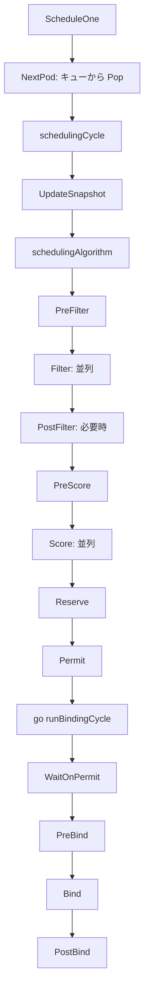
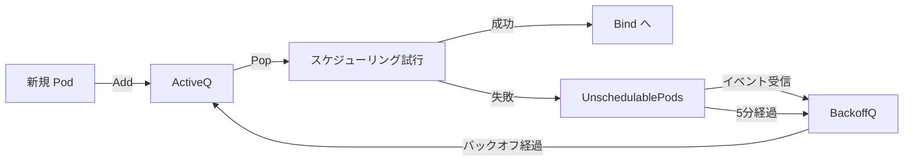

# 第6章 kube-scheduler の全体像

> 本章で読むソース
>
> - [pkg/scheduler/scheduler.go L66-L125](https://github.com/kubernetes/kubernetes/blob/v1.36.2/pkg/scheduler/scheduler.go#L66-L125)
> - [pkg/scheduler/scheduler.go L276-L468](https://github.com/kubernetes/kubernetes/blob/v1.36.2/pkg/scheduler/scheduler.go#L276-L468)
> - [pkg/scheduler/schedule_one.go L65-L96](https://github.com/kubernetes/kubernetes/blob/v1.36.2/pkg/scheduler/schedule_one.go#L65-L96)
> - [pkg/scheduler/schedule_one.go L98-L252](https://github.com/kubernetes/kubernetes/blob/v1.36.2/pkg/scheduler/schedule_one.go#L98-L252)
> - [pkg/scheduler/schedule_one.go L567-L624](https://github.com/kubernetes/kubernetes/blob/v1.36.2/pkg/scheduler/schedule_one.go#L567-L624)
> - [pkg/scheduler/eventhandlers.go L53-L141](https://github.com/kubernetes/kubernetes/blob/v1.36.2/pkg/scheduler/eventhandlers.go#L53-L141)
> - [pkg/scheduler/backend/queue/scheduling_queue.go L96-L225](https://github.com/kubernetes/kubernetes/blob/v1.36.2/pkg/scheduler/backend/queue/scheduling_queue.go#L96-L225)
> - [pkg/scheduler/backend/cache/cache.go L59-L105](https://github.com/kubernetes/kubernetes/blob/v1.36.2/pkg/scheduler/backend/cache/cache.go#L59-L105)

## この章の狙い

kube-scheduler は Kubernetes クラスタにおいて Pod をどの Node で動作させるか決定するコンポーネントである。
本章ではスケジューラの全体構造を把握し、Pod がキューに投入されてから Bind されるまでの一連の流れを追う。
具体的には `Scheduler` 構造体の初期化、`scheduleOne` によるスケジューリングパイプライン、`SchedulingQueue` の3状態、そして `Cache` と `Snapshot` による一貫性保証の仕組みを明らかにする。

## 前提

第5章までで API サーバーの処理と Informer の仕組みを理解していることを前提とする。
スケジューラは Informer 経由で Node や Pod の状態変化を受け取り、内部キャッシュを構築する。

## Scheduler 構造体

スケジューラの中心となる `Scheduler` 構造体は、スケジューリングに必要なすべてのコンポーネントを保持する。

[pkg/scheduler/scheduler.go L68-L125](https://github.com/kubernetes/kubernetes/blob/v1.36.2/pkg/scheduler/scheduler.go#L68-L125)

```go
type Scheduler struct {
	// It is expected that changes made via Cache will be observed
	// by NodeLister and Algorithm.
	Cache internalcache.Cache

	Extenders []fwk.Extender

	// NextPod should be a function that blocks until the next pod
	// is available. We don't use a channel for this, because scheduling
	// a pod may take some amount of time and we don't want pods to get
	// stale while they sit in a channel.
	NextPod func(logger klog.Logger) (*framework.QueuedPodInfo, error)

	// FailureHandler is called upon a scheduling failure.
	FailureHandler FailureHandlerFn

	// SchedulePod tries to schedule the given pod to one of the nodes in the node list.
	// Return a struct of ScheduleResult with the name of suggested host on success,
	// otherwise will return a FitError with reasons.
	SchedulePod func(ctx context.Context, fwk framework.Framework, state fwk.CycleState, podInfo *framework.QueuedPodInfo) (ScheduleResult, error)

	// Close this to shut down the scheduler.
	StopEverything <-chan struct{}

	// SchedulingQueue holds pods to be scheduled
	SchedulingQueue internalqueue.SchedulingQueue

	// ... (中略) ...

	// Profiles are the scheduling profiles.
	Profiles profile.Map

	client clientset.Interface

	nodeInfoSnapshot *internalcache.Snapshot

	percentageOfNodesToScore int32

	nextStartNodeIndex int
}
```

`Cache` はクラスタの状態をメモリ上に保持する内部キャッシュである。
`SchedulingQueue` はスケジューリング待ちの Pod を格納する優先度付きキューである。
`Profiles` はスケジューリングプロファイルのマップであり、複数のスケジューラ名に対応する異なるプラグイン構成を保持する。
`nodeInfoSnapshot` は各スケジューリングサイクルの開始時に Cache から作成されるスナップショットである。
`nextStartNodeIndex` はノードの評価開始位置を記録し、すべてのノードが均等に評価されるようにする。

## Scheduler の初期化

`Scheduler.New` 関数はスケジューラの全コンポーネントを組み立てる。

[pkg/scheduler/scheduler.go L276-L468](https://github.com/kubernetes/kubernetes/blob/v1.36.2/pkg/scheduler/scheduler.go#L276-L468)

```go
func New(ctx context.Context,
	client clientset.Interface,
	informerFactory informers.SharedInformerFactory,
	dynInformerFactory dynamicinformer.DynamicSharedInformerFactory,
	recorderFactory profile.RecorderFactory,
	opts ...Option) (*Scheduler, error) {

	// ... (中略) ...

	registry := frameworkplugins.NewInTreeRegistry()
	if err := registry.Merge(options.frameworkOutOfTreeRegistry); err != nil {
		return nil, err
	}

	// ... (中略) ...

	schedulerCache := internalcache.New(ctx, apiDispatcher, feature.DefaultFeatureGate.Enabled(features.GenericWorkload))

	profiles, err := profile.NewMap(ctx, options.profiles, registry, recorderFactory,
		frameworkruntime.WithComponentConfigVersion(options.componentConfigVersion),
		frameworkruntime.WithClientSet(client),
		// ... (中略) ...
	)

	// ... (中略) ...

	podQueue := internalqueue.NewSchedulingQueue(
		profiles[options.profiles[0].SchedulerName].QueueSortFunc(),
		informerFactory,
		// ... (中略) ...
	)

	sched := &Scheduler{
		Cache:            schedulerCache,
		client:           client,
		nodeInfoSnapshot: snapshot,
		// ... (中略) ...
		SchedulingQueue:    podQueue,
		Profiles:           profiles,
	}
	sched.NextPod = podQueue.Pop
	sched.applyDefaultHandlers()

	if err = addAllEventHandlers(sched, informerFactory, dynInformerFactory, ...); err != nil {
		return nil, fmt.Errorf("adding event handlers: %w", err)
	}

	return sched, nil
}
```

初期化の要点は以下の通りである。

1. ツリー内プラグインレジストリを作成し、ツリー外プラグインとマージする。
2. スケジューラキャッシュを生成する。
3. 設定プロファイルに従って `profile.Map` を構築し、各プロファイルごとにプラグインを初期化する。
4. 優先度付きスケジューリングキューを生成する。
5. `Scheduler` 構造体を作成し、`NextPod` にキューの `Pop` 関数を設定する。
6. Informer のイベントハンドラを登録する。

イベントハンドラの登録は `addAllEventHandlers` で行われ、Pod・Node・PV・PVC などのリソース変化をスケジューラキャッシュとキューに反映する。

## イベントハンドラ

スケジューラは Informer 経由でクラスタの状態変化を受信する。
イベントハンドラはキャッシュの更新とキューの再配置を担う。

[pkg/scheduler/eventhandlers.go L53-L66](https://github.com/kubernetes/kubernetes/blob/v1.36.2/pkg/scheduler/eventhandlers.go#L53-L66)

```go
func (sched *Scheduler) addNodeToCache(obj interface{}) {
	evt := fwk.ClusterEvent{Resource: fwk.Node, ActionType: fwk.Add}
	defer metrics.EventHandlingLatency.ObserveSince(time.Now(), evt.Label())()
	logger := sched.logger
	node, ok := obj.(*v1.Node)
	if !ok {
		utilruntime.HandleErrorWithLogger(logger, nil, "Cannot convert to *v1.Node", "obj", obj)
		return
	}

	logger.V(3).Info("Add event for node", "node", klog.KObj(node))
	nodeInfo := sched.Cache.AddNode(logger, node)
	sched.SchedulingQueue.MoveAllToActiveOrBackoffQueue(logger, evt, nil, node, preCheckForNode(logger, nodeInfo))
}
```

Node の追加イベントでは、キャッシュに Node を追加した上で、スケジューリングキューに対して `MoveAllToActiveOrBackoffQueue` を呼び出す。
これにより、新しい Node の追加によってスケジュール可能になった Pod がアクティブキューに再配置される。

Pod の追加イベントはもう少し複雑である。

[pkg/scheduler/eventhandlers.go L128-L141](https://github.com/kubernetes/kubernetes/blob/v1.36.2/pkg/scheduler/eventhandlers.go#L128-L141)

```go
func (sched *Scheduler) addPod(obj interface{}) {
	logger := sched.logger
	pod, ok := obj.(*v1.Pod)
	if !ok {
		utilruntime.HandleErrorWithLogger(logger, nil, "Cannot convert to *v1.Pod", "obj", obj)
		return
	}

	if assignedPod(pod) {
		sched.addAssignedPodToCache(pod)
	} else if responsibleForPod(pod, sched.Profiles) {
		sched.addPodToSchedulingQueue(pod)
	}
}
```

割り当て済みの Pod（`NodeName` が設定済み）はキャッシュに追加される。
未割り当てでスケジューラが責任を持つ Pod はスケジューリングキューに追加される。
この振り分けにより、スケジューラは自身が担当する Pod のみをキューに入れる。

## scheduleOne のパイプライン

スケジューラのメインループは `ScheduleOne` メソッドである。
このメソッドはキューから Pod を1つ取り出し、スケジューリングパイプラインを実行する。

[pkg/scheduler/schedule_one.go L65-L96](https://github.com/kubernetes/kubernetes/blob/v1.36.2/pkg/scheduler/schedule_one.go#L65-L96)

```go
// ScheduleOne does the entire scheduling workflow for a single scheduling entity (either a pod or a pod group).
// It is serialized on the scheduling algorithm's host fitting.
func (sched *Scheduler) ScheduleOne(ctx context.Context) {
	logger := klog.FromContext(ctx)
	podInfo, err := sched.NextPod(logger)
	if err != nil {
		utilruntime.HandleErrorWithLogger(logger, err, "Error while retrieving next pod from scheduling queue")
		return
	}
	// pod could be nil when schedulerQueue is closed
	if podInfo == nil || podInfo.Pod == nil {
		return
	}
	if sched.genericWorkloadEnabled && podInfo.Pod.Spec.SchedulingGroup != nil {
		podGroupInfo, err := sched.podGroupInfoForPod(ctx, podInfo)
		// ... (中略) ...
		sched.scheduleOnePodGroup(ctx, podGroupInfo)
	} else {
		sched.scheduleOnePod(ctx, podInfo)
	}
}
```

`NextPod` はキューの `Pop` 関数であり、キューに Pod が投入されるまでブロッキングする。
Pod を取り出したら `scheduleOnePod` が個別 Pod のスケジューリングを実行する。

`scheduleOnePod` はスケジューリングサイクルとバインディングサイクルに分割されている。

[pkg/scheduler/schedule_one.go L98-L148](https://github.com/kubernetes/kubernetes/blob/v1.36.2/pkg/scheduler/schedule_one.go#L98-L148)

```go
func (sched *Scheduler) scheduleOnePod(ctx context.Context, podInfo *framework.QueuedPodInfo) {
	logger := klog.FromContext(ctx)
	pod := podInfo.Pod
	// ... (中略) ...

	// Synchronously attempt to find a fit for the pod.
	start := time.Now()
	state := framework.NewCycleState()
	// ... (中略) ...

	schedulingCycleCtx, cancel := context.WithCancel(ctx)
	defer cancel()

	scheduleResult, assumedPodInfo, status := sched.schedulingCycle(schedulingCycleCtx, state, fwk, podInfo, start, podsToActivate)
	if !status.IsSuccess() {
		sched.FailureHandler(schedulingCycleCtx, fwk, assumedPodInfo, status, scheduleResult.nominatingInfo, start)
		return
	}

	// bind the pod to its host asynchronously (we can do this b/c of the assumption step above).
	go sched.runBindingCycle(ctx, state, fwk, scheduleResult, assumedPodInfo, start, podsToActivate)
}
```

スケジューリングサイクルは同期的に実行され、Pod に適した Node を見つけて Reserve まで行う。
バインディングサイクルは非同期のゴルーチンで実行される。
これは Assume の仕組みにより、バインディングの完了を待たずに次の Pod のスケジューリングを開始できるためである。



## スケジューリングサイクル

`schedulingCycle` はスナップショットの更新から始まる。

[pkg/scheduler/schedule_one.go L174-L198](https://github.com/kubernetes/kubernetes/blob/v1.36.2/pkg/scheduler/schedule_one.go#L174-L198)

```go
func (sched *Scheduler) schedulingCycle(
	ctx context.Context,
	state fwk.CycleState,
	schedFramework framework.Framework,
	podInfo *framework.QueuedPodInfo,
	start time.Time,
	podsToActivate *framework.PodsToActivate,
) (ScheduleResult, *framework.QueuedPodInfo, *fwk.Status) {
	if err := sched.Cache.UpdateSnapshot(klog.FromContext(ctx), sched.nodeInfoSnapshot); err != nil {
		return ScheduleResult{nominatingInfo: clearNominatedNode}, podInfo, fwk.AsStatus(err)
	}

	scheduleResult, status := sched.schedulingAlgorithm(ctx, state, schedFramework, podInfo, start)
	if !status.IsSuccess() {
		return scheduleResult, podInfo, status
	}

	assumedPodInfo, status := sched.prepareForBindingCycle(ctx, state, schedFramework, podInfo, podsToActivate, scheduleResult)
	if !status.IsSuccess() {
		return ScheduleResult{nominatingInfo: clearNominatedNode}, assumedPodInfo, status
	}

	return scheduleResult, assumedPodInfo, nil
}
```

まず `Cache.UpdateSnapshot` を呼び、最新のスナップショットを `nodeInfoSnapshot` に展開する。
次に `schedulingAlgorithm` で Filter と Score を実行する。
最後に `prepareForBindingCycle` で Assume と Reserve を行う。

## スケジューリングアルゴリズム

`schedulingAlgorithm` は Filter 段階と Score 段階を実行し、最適な Node を選定する。

[pkg/scheduler/schedule_one.go L254-L310](https://github.com/kubernetes/kubernetes/blob/v1.36.2/pkg/scheduler/schedule_one.go#L254-L310)

```go
func (sched *Scheduler) schedulingAlgorithm(
	ctx context.Context,
	state fwk.CycleState,
	schedFramework framework.Framework,
	podInfo *framework.QueuedPodInfo,
	start time.Time,
) (ScheduleResult, *fwk.Status) {
	// ... (中略) ...

	scheduleResult, err := sched.SchedulePod(ctx, schedFramework, state, podInfo)
	if err != nil {
		// ... (中略) ...

		// Run PostFilter plugins to attempt to make the pod schedulable in a future scheduling cycle.
		result, status := schedFramework.RunPostFilterPlugins(ctx, state, pod, fitError.Diagnosis.NodeToStatus)
		// ... (中略) ...
	}
	return scheduleResult, nil
}
```

`SchedulePod` はデフォルトで `schedulePod` メソッドが割り当てられる。

[pkg/scheduler/schedule_one.go L567-L624](https://github.com/kubernetes/kubernetes/blob/v1.36.2/pkg/scheduler/schedule_one.go#L567-L624)

```go
func (sched *Scheduler) schedulePod(ctx context.Context, fwk framework.Framework, state fwk.CycleState, podInfo *framework.QueuedPodInfo) (result ScheduleResult, err error) {
	pod := podInfo.Pod
	// ... (中略) ...

	feasibleNodes, diagnosis, nodeHint, err := sched.findNodesThatFitPod(ctx, fwk, state, podInfo)
	if err != nil {
		return result, err
	}

	if len(feasibleNodes) == 0 {
		return result, &framework.FitError{
			Pod:         pod,
			NumAllNodes: sched.nodeInfoSnapshot.NumNodesInPlacement(),
			Diagnosis:   diagnosis,
		}
	}

	// When only one node after predicate, just use it.
	if len(feasibleNodes) == 1 {
		node := feasibleNodes[0].Node().Name
		// ... (中略) ...
		return ScheduleResult{
			SuggestedHost:  node,
			EvaluatedNodes: 1 + diagnosis.NodeToStatus.Len(),
			FeasibleNodes:  1,
		}, nil
	}

	priorityList, err := prioritizeNodes(ctx, sched.Extenders, fwk, state, pod, feasibleNodes)
	// ... (中略) ...

	sortedPrioritizedNodes := newSortedNodeScores(priorityList)
	node := sortedPrioritizedNodes.Pop()

	return ScheduleResult{
		SuggestedHost:  node,
		EvaluatedNodes: len(feasibleNodes) + diagnosis.NodeToStatus.Len(),
		FeasibleNodes:  len(feasibleNodes),
	}, err
}
```

`findNodesThatFitPod` は PreFilter プラグインを実行した後、Filter プラグインを並列実行して条件を満たすノードを収集する。
条件を満たすノードが1つだけなら Score を省略して即座に返す。
複数のノードが条件を満たせば `prioritizeNodes` で Score プラグインを並列実行し、最高得点のノードを選ぶ。

## SchedulingQueue の3状態

スケジューリングキュー `PriorityQueue` は3つのサブキューで構成される。

[pkg/scheduler/backend/queue/scheduling_queue.go L17-L26](https://github.com/kubernetes/kubernetes/blob/v1.36.2/pkg/scheduler/backend/queue/scheduling_queue.go#L17-L26)

```go
// This file contains structures that implement scheduling queue types.
// Scheduling queues hold pods waiting to be scheduled. This file implements a
// priority queue which has two sub queues and a additional data structure,
// namely: activeQ, backoffQ and unschedulablePods.
// - activeQ holds pods that are being considered for scheduling.
// - backoffQ holds pods that moved from unschedulablePods and will move to
//   activeQ when their backoff periods complete.
// - unschedulablePods holds pods that were already attempted for scheduling and
//   are currently determined to be unschedulable.
```

```go
type PriorityQueue struct {
	*nominator

	stop  chan struct{}
	clock clock.WithTicker

	lock sync.RWMutex

	podMaxInUnschedulablePodsDuration time.Duration

	activeQ  activeQueuer
	backoffQ backoffQueuer
	// unschedulablePods holds pods that have been tried and determined unschedulable.
	unschedulablePods *unschedulablePods
	moveRequestCycle int64

	// ... (中略) ...
}
```

**Active** キューはスケジューリング対象の Pod を保持する優先度付きヒープである。
**Backoff** キューはスケジュールに失敗した Pod が一定時間のバックオフ後に Active に戻るまで待機するキューである。
**Unschedulable** はスケジュール不能と判定された Pod を保持する。
クラスタ状態の変化によって再スケジュールの可能性が生じたとき、Unschedulable から Backoff あるいは Active へ移動する。



この3状態の遷移は、スケジューラがクラスタ状態の変化に効率的に反応するための仕組みである。
すべての失敗 Pod を即座に再試行すると無駄な計算が発生する。
バックオフとイベント駆動の再配置により、計算コストを抑えつつチャンスを逃さない。

## Cache と Snapshot による一貫性保証

スケジューラのキャッシュ `cacheImpl` はクラスタの Node と Pod の状態をメモリ上に保持する。

[pkg/scheduler/backend/cache/cache.go L59-L84](https://github.com/kubernetes/kubernetes/blob/v1.36.2/pkg/scheduler/backend/cache/cache.go#L59-L84)

```go
type cacheImpl struct {
	stop   <-chan struct{}
	period time.Duration

	// This mutex guards all fields within this cache struct.
	mu sync.RWMutex
	// a set of assumed pod keys.
	// The key could further be used to get an entry in podStates.
	assumedPods sets.Set[string]
	// a map from pod key to podState.
	podStates map[string]*podState
	nodes     map[string]*nodeInfoListItem
	// headNode points to the most recently updated NodeInfo in "nodes". It is the
	// head of the linked list.
	headNode *nodeInfoListItem
	nodeTree *nodeTree
	// A map from image name to its ImageStateSummary.
	imageStates map[string]*fwk.ImageStateSummary
}
```

キャッシュは `assumedPods` で Assume 状態の Pod を追跡する。
Assume とは、Bind が完了する前に Pod が特定 Node に割り当てられることを前提としてキャッシュに反映する仕組みである。

`UpdateSnapshot` はキャッシュからスナップショットを作成する。

[pkg/scheduler/backend/cache/cache.go L184-L196](https://github.com/kubernetes/kubernetes/blob/v1.36.2/pkg/scheduler/backend/cache/cache.go#L184-L196)

```go
// UpdateSnapshot takes a snapshot of cached NodeInfo map. This is called at
// beginning of every scheduling cycle.
// The snapshot only includes Nodes that are not deleted at the time this function is called.
// nodeInfo.Node() is guaranteed to be not nil for all the nodes in the snapshot.
// This function tracks generation number of NodeInfo and updates only the
// entries of an existing snapshot that have changed after the snapshot was taken.
func (cache *cacheImpl) UpdateSnapshot(logger klog.Logger, nodeSnapshot *Snapshot) error {
	cache.mu.Lock()
	defer cache.mu.Unlock()
	// ... (中略) ...
```

スナップショットは世代番号で管理され、前回以降に変更された Node のみを更新する。
これにより、毎サイクルの全 Node コピーを避けている。

## 最適化: percentageOfNodesToScore による評価ノード数の制限

スケジューラは全ノードを評価する必要がない場合がある。
`numFeasibleNodesToFind` は評価すべきノード数の上限を計算する。

[pkg/scheduler/schedule_one.go L862-L890](https://github.com/kubernetes/kubernetes/blob/v1.36.2/pkg/scheduler/schedule_one.go#L862-L890)

```go
func (sched *Scheduler) numFeasibleNodesToFind(percentageOfNodesToScore *int32, numAllNodes int32) (numNodes int32) {
	if numAllNodes < minFeasibleNodesToFind {
		return numAllNodes
	}

	// ... (中略) ...

	if percentage == 0 {
		percentage = int32(50) - numAllNodes/125
		if percentage < minFeasibleNodesPercentageToFind {
			percentage = minFeasibleNodesPercentageToFind
		}
	}

	numNodes = numAllNodes * percentage / 100
	if numNodes < minFeasibleNodesToFind {
		return minFeasibleNodesToFind
	}

	return numNodes
}
```

ノード数が100未満の場合は全ノードを評価する。
100以上の場合はデフォルトで `50 - numAllNodes/125` パーセントのノードを評価する。
これにより大規模クラスタでもスケジューリング遅延がノード数に比例して増大しない。
さらに `findNodesThatPassFilters` では十分な数の実行可能ノードが見つかった時点で探索を打ち切る早期終了機構も備わっている。

[pkg/scheduler/schedule_one.go L811-L833](https://github.com/kubernetes/kubernetes/blob/v1.36.2/pkg/scheduler/schedule_one.go#L811-L833)

```go
	checkNode := func(i int) {
		// We check the nodes starting from where we left off in the previous scheduling cycle,
		// this is to make sure all nodes have the same chance of being examined across pods.
		nodeInfo := nodes[(sched.nextStartNodeIndex+i)%numAllNodes]
		status := schedFramework.RunFilterPluginsWithNominatedPods(ctx, state, pod, nodeInfo)
		// ... (中略) ...
		if status.IsSuccess() {
			length := atomic.AddInt32(&feasibleNodesLen, 1)
			if length > numNodesToFind {
				cancel(errors.New("findNodesThatPassFilters has found enough nodes"))
				atomic.AddInt32(&feasibleNodesLen, -1)
			} else {
				feasibleNodes[length-1] = nodeInfo
			}
		}
		// ... (中略) ...
	}
```

`nextStartNodeIndex` は前回の評価位置から再開することで、特定のノードが常に後回しにされることを防ぐ。
このローテーショニングはスコアリングの公平性を保つ工夫である。

## まとめ

kube-scheduler は Informer 経由でクラスタ状態を受信し、キャッシュとキューを維持する。
`ScheduleOne` はキューから Pod を取り出し、スケジューリングサイクル（Filter, Score, Reserve, Permit）とバインディングサイクル（PreBind, Bind, PostBind）を実行する。
スケジューリングキューは Active, Backoff, Unschedulable の3状態で Pod を管理し、イベント駆動で再配置する。
キャッシュとスナップショットの分離により、並行するバインディングサイクルとスケジューリングサイクルの一貫性を保つ。

## 関連する章

- [第7章 スケジューリングフレームワーク](07-scheduling-framework.md)
- [第8章 スケジューリングプラグイン](08-scheduling-plugins.md)
