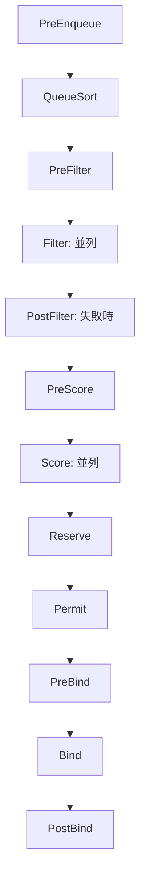
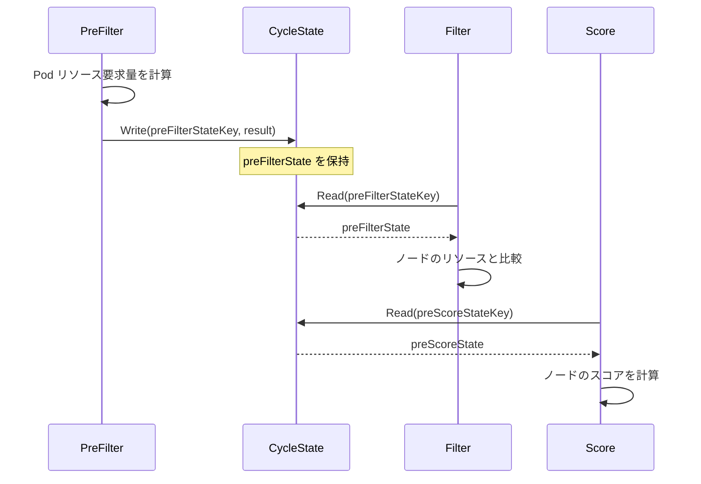

# 第7章 スケジューリングフレームワーク

> 本章で読むソース
>
> - [pkg/scheduler/framework/interface.go L174-L308](https://github.com/kubernetes/kubernetes/blob/v1.36.2/pkg/scheduler/framework/interface.go#L174-L308)
> - [pkg/scheduler/framework/runtime/framework.go L56-L112](https://github.com/kubernetes/kubernetes/blob/v1.36.2/pkg/scheduler/framework/runtime/framework.go#L56-L112)
> - [pkg/scheduler/framework/runtime/framework.go L322-L505](https://github.com/kubernetes/kubernetes/blob/v1.36.2/pkg/scheduler/framework/runtime/framework.go#L322-L505)
> - [pkg/scheduler/framework/runtime/framework.go L916-L993](https://github.com/kubernetes/kubernetes/blob/v1.36.2/pkg/scheduler/framework/runtime/framework.go#L916-L993)
> - [pkg/scheduler/framework/runtime/framework.go L1089-L1254](https://github.com/kubernetes/kubernetes/blob/v1.36.2/pkg/scheduler/framework/runtime/framework.go#L1089-L1254)
> - [pkg/scheduler/framework/runtime/framework.go L1333-L1430](https://github.com/kubernetes/kubernetes/blob/v1.36.2/pkg/scheduler/framework/runtime/framework.go#L1333-L1430)
> - [pkg/scheduler/framework/types.go L165-L214](https://github.com/kubernetes/kubernetes/blob/v1.36.2/pkg/scheduler/framework/types.go#L165-L214)

## この章の狙い

スケジューリングフレームワークはプラグインベースの拡張機構であり、スケジューリングの各段階を Extension Point として公開する。
本章では `Framework` インターフェース、`frameworkImpl` によるプラグインライフサイクル管理、`CycleState` によるサイクル間データ受け渡し、そして `NodeInfo` の構造を明らかにする。

## 前提

第6章でスケジューラの全体像とスケジューリングパイプラインを把握していることを前提とする。

## Extension Points

スケジューリングフレームワークは Pod のスケジューリング過程を複数の Extension Point に分割する。
各 Extension Point に対してプラグインを登録し、カスタマイズが可能である。

[pkg/scheduler/framework/interface.go L174-L308](https://github.com/kubernetes/kubernetes/blob/v1.36.2/pkg/scheduler/framework/interface.go#L174-L308)

```go
type Framework interface {
	fwk.Handle

	// PreEnqueuePlugins returns the registered preEnqueue plugins.
	PreEnqueuePlugins() []fwk.PreEnqueuePlugin

	// EnqueueExtensions returns the registered Enqueue extensions.
	EnqueueExtensions() []fwk.EnqueueExtensions

	// QueueSortFunc returns the function to sort pods in scheduling queue
	QueueSortFunc() fwk.LessFunc

	// RunPreFilterPlugins runs the set of configured PreFilter plugins.
	RunPreFilterPlugins(ctx context.Context, state fwk.CycleState, pod *v1.Pod) (*fwk.PreFilterResult, *fwk.Status, sets.Set[string])

	// RunPostFilterPlugins runs the set of configured PostFilter plugins.
	RunPostFilterPlugins(ctx context.Context, state fwk.CycleState, pod *v1.Pod, filteredNodeStatusMap fwk.NodeToStatusReader) (*fwk.PostFilterResult, *fwk.Status)

	// RunPreBindPlugins runs the set of configured PreBind plugins.
	RunPreBindPlugins(ctx context.Context, state fwk.CycleState, pod *v1.Pod, nodeName string) *fwk.Status

	// RunPostBindPlugins runs the set of configured PostBind plugins.
	RunPostBindPlugins(ctx context.Context, state fwk.CycleState, pod *v1.Pod, nodeName string)

	// RunReservePluginsReserve runs the Reserve method of the set of configured Reserve plugins.
	RunReservePluginsReserve(ctx context.Context, state fwk.CycleState, pod *v1.Pod, nodeName string) *fwk.Status

	// RunReservePluginsUnreserve runs the Unreserve method of the set of configured Reserve plugins.
	RunReservePluginsUnreserve(ctx context.Context, state fwk.CycleState, pod *v1.Pod, nodeName string)

	// RunPermitPlugins runs the set of configured Permit plugins.
	RunPermitPlugins(ctx context.Context, state fwk.CycleState, pod *v1.Pod, nodeName string) (pluginsWaitTime map[string]time.Duration, status *fwk.Status)

	// RunBindPlugins runs the set of configured Bind plugins.
	RunBindPlugins(ctx context.Context, state fwk.CycleState, pod *v1.Pod, nodeName string) *fwk.Status

	// HasFilterPlugins returns true if at least one Filter plugin is defined.
	HasFilterPlugins() bool

	// HasPostFilterPlugins returns true if at least one PostFilter plugin is defined.
	HasPostFilterPlugins() bool

	// HasScorePlugins returns true if at least one Score plugin is defined.
	HasScorePlugins() bool

	// ... (中略) ...
}
```

Extension Point は以下の順序で呼び出される。



各 Extension Point の役割をまとめる。

- **PreEnqueue**: Pod をキューに入れる前の事前チェック
- **QueueSort**: キュー内の Pod の並び順を決定
- **PreFilter**: 事前検証と状態の事前計算
- **Filter**: 各ノードに対して実行可能かを判定（並列実行）
- **PostFilter**: すべてのノードが不適格だった場合にプリエンプションを試行
- **PreScore**: スコアリングの事前計算
- **Score**: 各ノードにスコアを付与（並列実行）
- **Reserve**: リソースの仮確保
- **Permit**: バインド前の最終許可判定（待機も可能）
- **PreBind**: バインド前の準備作業（ボリュームバインドなど）
- **Bind**: API サーバーへのバインド要求
- **PostBind**: バインド完了後の後処理

## frameworkImpl によるプラグインライフサイクル管理

`frameworkImpl` は `Framework` インターフェースの実装体であり、プラグインの初期化と呼び出しを管理する。

[pkg/scheduler/framework/runtime/framework.go L56-L112](https://github.com/kubernetes/kubernetes/blob/v1.36.2/pkg/scheduler/framework/runtime/framework.go#L56-L112)

```go
// frameworkImpl is the component responsible for initializing and running scheduler
// plugins.
type frameworkImpl struct {
	registry                  Registry
	snapshotSharedLister      fwk.SharedLister
	waitingPods               *waitingPodsMap
	podsInPreBind             *podsInPreBindMap
	scorePluginWeight         map[string]int
	preEnqueuePlugins         []fwk.PreEnqueuePlugin
	enqueueExtensions         []fwk.EnqueueExtensions
	queueSortPlugins          []fwk.QueueSortPlugin
	preFilterPlugins          []fwk.PreFilterPlugin
	filterPlugins             []fwk.FilterPlugin
	postFilterPlugins         []fwk.PostFilterPlugin
	preScorePlugins           []fwk.PreScorePlugin
	scorePlugins              []fwk.ScorePlugin
	reservePlugins            []fwk.ReservePlugin
	preBindPlugins            []fwk.PreBindPlugin
	bindPlugins               []fwk.BindPlugin
	postBindPlugins           []fwk.PostBindPlugin
	permitPlugins             []fwk.PermitPlugin
	batchablePlugins          []fwk.SignPlugin
	podGroupPostFilterPlugins []framework.PodGroupPostFilterPlugin

	// ... (中略) ...

	// pluginsMap contains all plugins, by name.
	pluginsMap map[string]fwk.Plugin

	// ... (中略) ...

	profileName              string
	percentageOfNodesToScore *int32

	extenders []fwk.Extender
	fwk.PodNominator
	fwk.PodActivator
	apiDispatcher *apidispatcher.APIDispatcher
	apiCacher     fwk.APICacher

	parallelizer fwk.Parallelizer
}
```

各 Extension Point ごとにプラグインのスライスを持ち、設定に従って順番に呼び出す。
`pluginsMap` は名前でプラグインを検索するためのマップである。

## NewFramework による初期化

`NewFramework` は設定プロファイルに基づいてプラグインを初期化する。

[pkg/scheduler/framework/runtime/framework.go L322-L505](https://github.com/kubernetes/kubernetes/blob/v1.36.2/pkg/scheduler/framework/runtime/framework.go#L322-L505)

```go
func NewFramework(ctx context.Context, r Registry, profile *config.KubeSchedulerProfile, opts ...Option) (framework.Framework, error) {
	options := defaultFrameworkOptions(ctx.Done())
	for _, opt := range opts {
		opt(&options)
	}

	// ... (中略) ...

	f := &frameworkImpl{
		registry:             r,
		snapshotSharedLister: options.snapshotSharedLister,
		// ... (中略) ...
		parallelizer:         options.parallelizer,
		logger:               logger,
	}

	// ... (中略) ...

	f.pluginsMap = make(map[string]fwk.Plugin)
	for name, factory := range r {
		// initialize only needed plugins.
		if !pg.Has(name) {
			continue
		}

		args := pluginConfig[name]
		// ... (中略) ...
		p, err := factory(ctx, args, f)
		if err != nil {
			return nil, fmt.Errorf("initializing plugin %q: %w", name, err)
		}
		f.pluginsMap[name] = p

		f.fillEnqueueExtensions(p)
	}

	// initialize plugins per individual extension points
	for _, e := range f.getExtensionPoints(profile.Plugins) {
		if err := updatePluginList(e.slicePtr, *e.plugins, f.pluginsMap); err != nil {
			return nil, err
		}
	}

	// initialize multiPoint plugins to their expanded extension points
	if len(profile.Plugins.MultiPoint.Enabled) > 0 {
		if err := f.expandMultiPointPlugins(logger, profile); err != nil {
			return nil, err
		}
	}

	if len(f.queueSortPlugins) != 1 {
		return nil, fmt.Errorf("only one queue sort plugin required for profile with scheduler name %q, but got %d", profile.SchedulerName, len(f.queueSortPlugins))
	}
	if len(f.bindPlugins) == 0 {
		return nil, fmt.Errorf("at least one bind plugin is needed for profile with scheduler name %q", profile.SchedulerName)
	}

	// ... (中略) ...

	return f, nil
}
```

初期化の要点は以下の通りである。

1. レジストリから必要なプラグインファクトリを探し、インスタンス化する。
2. 各 Extension Point に対応するプラグインスライスへ登録する。
3. MultiPoint プラグインを展開する。
4. QueueSort プラグインが1つ、Bind プラグインが少なくとも1つ必要であることを検証する。
5. スコアプラグインの重みを検証する。

`getExtensionPoints` は設定とプラグインスライスを対応付ける。

[pkg/scheduler/framework/runtime/framework.go L125-L142](https://github.com/kubernetes/kubernetes/blob/v1.36.2/pkg/scheduler/framework/runtime/framework.go#L125-L142)

```go
func (f *frameworkImpl) getExtensionPoints(plugins *config.Plugins) []extensionPoint {
	return []extensionPoint{
		{&plugins.PreFilter, &f.preFilterPlugins},
		{&plugins.Filter, &f.filterPlugins},
		{&plugins.PostFilter, &f.postFilterPlugins},
		{&plugins.Reserve, &f.reservePlugins},
		{&plugins.PreScore, &f.preScorePlugins},
		{&plugins.Score, &f.scorePlugins},
		{&plugins.PreBind, &f.preBindPlugins},
		{&plugins.Bind, &f.bindPlugins},
		{&plugins.PostBind, &f.postBindPlugins},
		{&plugins.Permit, &f.permitPlugins},
		{&plugins.PreEnqueue, &f.preEnqueuePlugins},
		{&plugins.QueueSort, &f.queueSortPlugins},
		{&plugins.PlacementGenerate, &f.placementGeneratePlugins},
		{&plugins.PlacementScore, &f.placementScorePlugins},
	}
}
```

## RunPreFilterPlugins の動作

PreFilter は各プラグインを順次実行し、Pod の事前検証と状態の事前計算を行う。

[pkg/scheduler/framework/runtime/framework.go L916-L993](https://github.com/kubernetes/kubernetes/blob/v1.36.2/pkg/scheduler/framework/runtime/framework.go#L916-L993)

```go
func (f *frameworkImpl) RunPreFilterPlugins(ctx context.Context, state fwk.CycleState, pod *v1.Pod) (_ *fwk.PreFilterResult, status *fwk.Status, _ sets.Set[string]) {
	startTime := time.Now()
	skipPlugins := sets.New[string]()
	defer func() {
		state.SetSkipFilterPlugins(skipPlugins)
		metrics.FrameworkExtensionPointDuration.WithLabelValues(metrics.PreFilter, status.Code().String(), f.profileName).Observe(metrics.SinceInSeconds(startTime))
	}()
	nodes, err := f.SnapshotSharedLister().NodeInfos().List()
	if err != nil {
		return nil, fwk.AsStatus(fmt.Errorf("getting all nodes: %w", err)), nil
	}
	var result *fwk.PreFilterResult
	pluginsWithNodes := sets.New[string]()
	// ... (中略) ...
	for _, pl := range f.preFilterPlugins {
		// ... (中略) ...
		r, s := f.runPreFilterPlugin(ctx, pl, state, pod, nodes)
		if s.IsSkip() {
			skipPlugins.Insert(pl.Name())
			continue
		}
		if !s.IsSuccess() {
			s.SetPlugin(pl.Name())
			if s.Code() == fwk.UnschedulableAndUnresolvable {
				return nil, s, nil
			}
			if s.Code() == fwk.Unschedulable {
				returnStatus = s
				continue
			}
			return nil, fwk.AsStatus(fmt.Errorf("running PreFilter plugin %q: %w", pl.Name(), s.AsError())).WithPlugin(pl.Name()), nil
		}
		if !r.AllNodes() {
			pluginsWithNodes.Insert(pl.Name())
		}
		result = result.Merge(r)
		// ... (中略) ...
	}
	return result, returnStatus, pluginsWithNodes
}
```

`UnschedulableAndUnresolvable` が返ると即座にサイクルを中断する。
`Unschedulable` は PostFilter（プリエンプション）の可能性があるため、すべての PreFilter を実行してから返す。
`Skip` を返したプラグインは Filter の実行を省略される。

## RunFilterPlugins と RunFilterPluginsWithNominatedPods

Filter は各ノードに対してプラグインを順次実行する。
ノードごとの呼び出しは `findNodesThatPassFilters` で並列化される。

[pkg/scheduler/framework/runtime/framework.go L1089-L1126](https://github.com/kubernetes/kubernetes/blob/v1.36.2/pkg/scheduler/framework/runtime/framework.go#L1089-L1126)

```go
func (f *frameworkImpl) RunFilterPlugins(
	ctx context.Context,
	state fwk.CycleState,
	pod *v1.Pod,
	nodeInfo fwk.NodeInfo,
) *fwk.Status {
	// ... (中略) ...

	for _, pl := range f.filterPlugins {
		if state.GetSkipFilterPlugins().Has(pl.Name()) {
			continue
		}
		// ... (中略) ...
		if status := f.runFilterPlugin(ctx, pl, state, pod, nodeInfo); !status.IsSuccess() {
			if !status.IsRejected() {
				status = fwk.AsStatus(fmt.Errorf("running %q filter plugin: %w", pl.Name(), status.AsError()))
			}
			status.SetPlugin(pl.Name())
			return status
		}
	}

	return nil
}
```

1つのプラグインでも失敗すれば即座にそのノードは不適格となる。

`RunFilterPluginsWithNominatedPods` は nominated Pod を考慮して2パスでフィルタを実行する。

[pkg/scheduler/framework/runtime/framework.go L1209-L1254](https://github.com/kubernetes/kubernetes/blob/v1.36.2/pkg/scheduler/framework/runtime/framework.go#L1209-L1254)

```go
func (f *frameworkImpl) RunFilterPluginsWithNominatedPods(ctx context.Context, state fwk.CycleState, pod *v1.Pod, info fwk.NodeInfo) *fwk.Status {
	var status *fwk.Status

	podsAdded := false
	// ... (中略) ...
	// We consider only equal or higher priority pods in the first pass, because
	// those are the current "pod" must yield to them and not take a space opened
	// for running them.
	// ... (中略) ...
	logger := klog.FromContext(ctx)
	logger = klog.LoggerWithName(logger, "FilterWithNominatedPods")
	ctx = klog.NewContext(ctx, logger)
	for i := 0; i < 2; i++ {
		stateToUse := state
		nodeInfoToUse := info
		if i == 0 {
			var err error
			podsAdded, stateToUse, nodeInfoToUse, err = addGENominatedPods(ctx, f, pod, state, info)
			if err != nil {
				return fwk.AsStatus(err)
			}
		} else if !podsAdded || !status.IsSuccess() {
			break
		}

		status = f.RunFilterPlugins(ctx, stateToUse, pod, nodeInfoToUse)
		if !status.IsSuccess() && !status.IsRejected() {
			return status
		}
	}

	return status
}
```

1パス目は同優先度以上の nominated Pod をノードに追加してフィルタを実行する。
2パス目は nominated Pod を追加せずに実行する。
リソースや InterPod アンチアフィニティは nominated Pod がいる場合に失敗しやすい。
Pod アフィニティは nominated Pod がいない場合に失敗しやすい。
両方のパスで合格したノードのみが安全にスケジューリング可能と判断される。

## RunScorePlugins の並列実行

Score プラグインはノードごとに並列で実行される。

[pkg/scheduler/framework/runtime/framework.go L1333-L1394](https://github.com/kubernetes/kubernetes/blob/v1.36.2/pkg/scheduler/framework/runtime/framework.go#L1333-L1394)

```go
func (f *frameworkImpl) RunScorePlugins(ctx context.Context, state fwk.CycleState, pod *v1.Pod, nodes []fwk.NodeInfo) (ns []fwk.NodePluginScores, status *fwk.Status) {
	// ... (中略) ...
	allNodePluginScores := make([]fwk.NodePluginScores, len(nodes))
	numPlugins := len(f.scorePlugins)
	plugins := make([]fwk.ScorePlugin, 0, numPlugins)
	pluginToNodeScores := make(map[string]fwk.NodeScoreList, numPlugins)
	for _, pl := range f.scorePlugins {
		if state.GetSkipScorePlugins().Has(pl.Name()) {
			continue
		}
		plugins = append(plugins, pl)
		pluginToNodeScores[pl.Name()] = make(fwk.NodeScoreList, len(nodes))
	}
	ctx, cancel := context.WithCancel(ctx)
	defer cancel()
	errCh := parallelize.NewResultChannel[error]()

	if len(plugins) > 0 {
		// ... (中略) ...
		// Run Score methods for each node in parallel.
		f.Parallelizer().Until(ctx, len(nodes), func(index int) {
			nodeInfo := nodes[index]
			nodeName := nodeInfo.Node().Name
			// ... (中略) ...
			for _, pl := range plugins {
				// ... (中略) ...
				s, status := f.runScorePlugin(ctx, pl, state, pod, nodeInfo)
				if !status.IsSuccess() {
					err := fmt.Errorf("plugin %q failed with: %w", pl.Name(), status.AsError())
					errCh.SendWithCancel(err, cancel)
					return
				}
				pluginToNodeScores[pl.Name()][index] = fwk.NodeScore{
					Name:  nodeName,
					Score: s,
				}
			}
		}, metrics.Score)
		// ... (中略) ...
	}
```

`Parallelizer().Until` は指定された並列度でノードごとに Score プラグインを実行する。
各ノードのスコアは `pluginToNodeScores` マップに蓄積され、後で重み付き合計が計算される。

## CycleState によるサイクル間データ受け渡し

`CycleState` は1つのスケジューリングサイクル内でプラグイン間でデータをやり取りするための仕組みである。
各プラグインは PreFilter で計算した結果を `CycleState` に書き込み、Filter や Score でそれを読み取る。

`CycleState` の使い方を `NodeResourcesFit` プラグインで確認する。

PreFilter で Pod のリソース要求量を計算して `CycleState` に書き込む。

```go
// PreFilter invoked at the prefilter extension point.
func (f *Fit) PreFilter(ctx context.Context, cycleState fwk.CycleState, pod *v1.Pod, nodes []fwk.NodeInfo) (*fwk.PreFilterResult, *fwk.Status) {
	// ... (中略) ...
	result := computePodResourceRequest(pod, ResourceRequestsOptions{EnablePodLevelResources: f.enablePodLevelResources})

	cycleState.Write(preFilterStateKey, result)
	return nil, nil
}
```

Filter で `CycleState` から事前計算結果を読み取り、ノードのリソースと比較する。

```go
func (f *Fit) Filter(ctx context.Context, cycleState fwk.CycleState, pod *v1.Pod, nodeInfo fwk.NodeInfo) *fwk.Status {
	s, err := getPreFilterState(cycleState)
	if err != nil {
		return fwk.AsStatus(err)
	}
	// ... (中略) ...
	insufficientResources := fitsRequest(s, nodeInfo, f.ignoredResources, f.ignoredResourceGroups, draManager, opts)
	// ... (中略) ...
}
```

このパターンにより、同じ計算をノードごとに繰り返す必要がなくなる。



## NodeInfo の構造

`NodeInfo` はノードレベルの集約情報である。

[pkg/scheduler/framework/types.go L165-L214](https://github.com/kubernetes/kubernetes/blob/v1.36.2/pkg/scheduler/framework/types.go#L165-L214)

```go
type NodeInfo struct {
	// Overall node information.
	node *v1.Node

	// Pods running on the node.
	Pods []fwk.PodInfo

	// The subset of pods with affinity.
	PodsWithAffinity []fwk.PodInfo

	// The subset of pods with required anti-affinity.
	PodsWithRequiredAntiAffinity []fwk.PodInfo

	// Ports allocated on the node.
	UsedPorts fwk.HostPortInfo

	// Total requested resources of all pods on this node.
	Requested *Resource
	// Total requested resources with minimum value applied.
	NonZeroRequested *Resource
	// We store allocatedResources as int64, to avoid conversions and accessing map.
	Allocatable *Resource

	// ImageStates holds the entry of an image if and only if this image is on the node.
	ImageStates map[string]*fwk.ImageStateSummary

	// PVCRefCounts contains a mapping of PVC names to the number of pods on the node using it.
	PVCRefCounts map[string]int

	// Whenever NodeInfo changes, generation is bumped.
	Generation int64

	// DeclaredFeatures is a set of features published by the node
	DeclaredFeatures ndf.FeatureSet
}
```

`NodeInfo` はノード上の全 Pod のリソース要求量の合計（`Requested`）、ゼロリクエスト Pod に最小値を適用した合計（`NonZeroRequested`）、ノードの割り当て可能リソース（`Allocatable`）を保持する。
`PodsWithAffinity` と `PodsWithRequiredAntiAffinity` はアフィニティ制約の判定を高速化するためのインデックスである。
`Generation` は変更のたびにインクリメントされ、スナップショットの差分更新を可能にする。

## 最適化: Generation によるスナップショットの差分更新

`NodeInfo` の `Generation` フィールドはスナップショットの差分更新を可能にする。
`UpdateSnapshot` では `headNode` からたどって世代番号が新しいノードのみを更新する。

[pkg/scheduler/backend/cache/cache.go L221-L261](https://github.com/kubernetes/kubernetes/blob/v1.36.2/pkg/scheduler/backend/cache/cache.go#L221-L261)

```go
	// Start from the head of the NodeInfo doubly linked list and update snapshot
	// of NodeInfos updated after the last snapshot.
	for node := cache.headNode; node != nil; node = node.next {
		if node.info.Generation <= snapshotGeneration {
			// all the nodes are updated before the existing snapshot. We are done.
			break
		}
		if np := node.info.Node(); np != nil {
			existing, ok := nodeSnapshot.nodeInfoMap[np.Name]
			if !ok {
				updateAllLists = true
				existing = &framework.NodeInfo{}
				nodeSnapshot.nodeInfoMap[np.Name] = existing
			}
			clone := node.info.SnapshotConcrete()
			// ... (中略) ...
			// We need to preserve the original pointer of the NodeInfo struct since it
			// is used in the NodeInfoList, which we may not update.
			*existing = *clone
		}
	}
```

 doubly linked list の `headNode` は最も最近更新されたノードを指す。
世代番号がスナップショット世代以下のノードは変更されていないため、走査を打ち切れる。
これにより大規模クラスタでも毎サイクルの全ノードコピーを回避し、変更があったノードのみを O(変更数) で更新する。

## まとめ

スケジューリングフレームワークは Extension Point を中心にプラグインを管理する。
`frameworkImpl` は設定に基づいてプラグインを初期化し、各 Extension Point で適切な順序で呼び出す。
`CycleState` は PreFilter で計算した状態を Filter や Score で再利用する仕組みであり、冗長計算を排除する。
`NodeInfo` の `Generation` と doubly linked list による差分更新は、スナップショット作成のコストを大幅に削減する。

## 関連する章

- [第6章 kube-scheduler の全体像](06-scheduler-overview.md)
- [第8章 スケジューリングプラグイン](08-scheduling-plugins.md)
