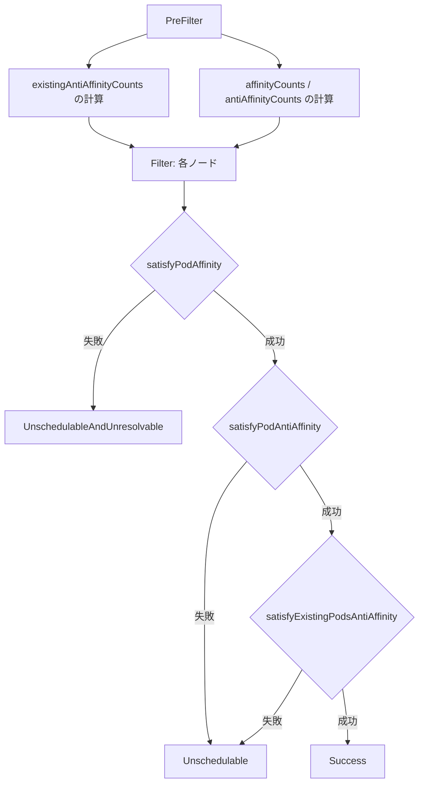

# 第8章 スケジューリングプラグイン

> 本章で読むソース
>
> - [pkg/scheduler/framework/plugins/noderesources/fit.go L44-L105](https://github.com/kubernetes/kubernetes/blob/v1.36.2/pkg/scheduler/framework/plugins/noderesources/fit.go#L44-L105)
> - [pkg/scheduler/framework/plugins/noderesources/fit.go L334-L347](https://github.com/kubernetes/kubernetes/blob/v1.36.2/pkg/scheduler/framework/plugins/noderesources/fit.go#L334-L347)
> - [pkg/scheduler/framework/plugins/noderesources/fit.go L612-L697](https://github.com/kubernetes/kubernetes/blob/v1.36.2/pkg/scheduler/framework/plugins/noderesources/fit.go#L612-L697)
> - [pkg/scheduler/framework/plugins/volumebinding/volume_binding.go L70-L88](https://github.com/kubernetes/kubernetes/blob/v1.36.2/pkg/scheduler/framework/plugins/volumebinding/volume_binding.go#L70-L88)
> - [pkg/scheduler/framework/plugins/volumebinding/binder.go L127-L196](https://github.com/kubernetes/kubernetes/blob/v1.36.2/pkg/scheduler/framework/plugins/volumebinding/binder.go#L127-L196)
> - [pkg/scheduler/framework/plugins/interpodaffinity/plugin.go L39-L53](https://github.com/kubernetes/kubernetes/blob/v1.36.2/pkg/scheduler/framework/plugins/interpodaffinity/plugin.go#L39-L53)
> - [pkg/scheduler/framework/plugins/interpodaffinity/filtering.go L350-L431](https://github.com/kubernetes/kubernetes/blob/v1.36.2/pkg/scheduler/framework/plugins/interpodaffinity/filtering.go#L350-L431)
> - [pkg/scheduler/framework/preemption/preemption.go L44-L85](https://github.com/kubernetes/kubernetes/blob/v1.36.2/pkg/scheduler/framework/preemption/preemption.go#L44-L85)
> - [pkg/scheduler/framework/preemption/preemption.go L103-L170](https://github.com/kubernetes/kubernetes/blob/v1.36.2/pkg/scheduler/framework/preemption/preemption.go#L103-L170)

## この章の狙い

本章では Kubernetes に組み込まれた主要なスケジューリングプラグインのソースコードを読む。
`NodeResourcesFit` によるリソースベースのフィルタとスコアリング、`VolumeBinding` によるストレージ制約の評価、`InterPodAffinity` による Pod 間の配置制約、そしてプリエンプションによる低優先度 Pod の退避機構を扱う。

## 前提

第6章でスケジューリングパイプライン、第7章で Extension Point と `CycleState` の仕組みを理解していることを前提とする。

## NodeResourcesFit: CPU とメモリのフィルタ

`NodeResourcesFit` はノードのリソースが Pod の要求を満たすかを判定するプラグインである。
PreFilter, Filter, PreScore, Score の4つの Extension Point を実装する。

[pkg/scheduler/framework/plugins/noderesources/fit.go L44-L105](https://github.com/kubernetes/kubernetes/blob/v1.36.2/pkg/scheduler/framework/plugins/noderesources/fit.go#L44-L105)

```go
var _ fwk.PreFilterPlugin = &Fit{}
var _ fwk.FilterPlugin = &Fit{}
var _ fwk.EnqueueExtensions = &Fit{}
var _ fwk.PreScorePlugin = &Fit{}
var _ fwk.ScorePlugin = &Fit{}
var _ fwk.SignPlugin = &Fit{}
var _ fwk.PlacementScorePlugin = &Fit{}

// ... (中略) ...

// Fit is a plugin that checks if a node has sufficient resources.
type Fit struct {
	ignoredResources                              sets.Set[string]
	ignoredResourceGroups                         sets.Set[string]
	enableInPlacePodVerticalScaling               bool
	enableSidecarContainers                       bool
	enableSchedulingQueueHint                     bool
	enablePodLevelResources                       bool
	enableDRAExtendedResource                     bool
	enableInPlacePodLevelResourcesVerticalScaling bool
	handle                                        fwk.Handle
	*resourceAllocationScorer
	placementScorer *resourceAllocationScorer
}
```

### PreFilter: リソース要求量の事前計算

PreFilter では Pod のリソース要求量を計算して `CycleState` に保存する。

[pkg/scheduler/framework/plugins/noderesources/fit.go L334-L347](https://github.com/kubernetes/kubernetes/blob/v1.36.2/pkg/scheduler/framework/plugins/noderesources/fit.go#L334-L347)

```go
// PreFilter invoked at the prefilter extension point.
func (f *Fit) PreFilter(ctx context.Context, cycleState fwk.CycleState, pod *v1.Pod, nodes []fwk.NodeInfo) (*fwk.PreFilterResult, *fwk.Status) {
	if !f.enableSidecarContainers && hasRestartableInitContainer(pod) {
		return nil, fwk.NewStatus(fwk.UnschedulableAndUnresolvable, "Pod has a restartable init container and the SidecarContainers feature is disabled")
	}
	result := computePodResourceRequest(pod, ResourceRequestsOptions{EnablePodLevelResources: f.enablePodLevelResources})

	cycleState.Write(preFilterStateKey, result)
	return nil, nil
}
```

`computePodResourceRequest` は init コンテナと通常コンテナのリソースを統合して Pod 全体の要求量を算出する。
init コンテナは逐次実行されるため各リソース次元の最大値を取り、通常コンテナは並列実行されるため合計を取る。

### Filter: リソースの適合判定

Filter では `CycleState` から読み取った要求量とノードの空きリソースを比較する。

[pkg/scheduler/framework/plugins/noderesources/fit.go L612-L648](https://github.com/kubernetes/kubernetes/blob/v1.36.2/pkg/scheduler/framework/plugins/noderesources/fit.go#L612-L648)

```go
// Filter invoked at the filter extension point.
// Checks if a node has sufficient resources, such as cpu, memory, gpu, opaque int resources etc to run a pod.
// It returns a list of insufficient resources, if empty, then the node has all the resources requested by the pod.
func (f *Fit) Filter(ctx context.Context, cycleState fwk.CycleState, pod *v1.Pod, nodeInfo fwk.NodeInfo) *fwk.Status {
	s, err := getPreFilterState(cycleState)
	if err != nil {
		return fwk.AsStatus(err)
	}

	// ... (中略) ...

	insufficientResources := fitsRequest(s, nodeInfo, f.ignoredResources, f.ignoredResourceGroups, draManager, opts)

	if len(insufficientResources) != 0 {
		// We will keep all failure reasons.
		failureReasons := make([]string, 0, len(insufficientResources))
		statusCode := fwk.Unschedulable
		for i := range insufficientResources {
			failureReasons = append(failureReasons, insufficientResources[i].Reason)

			if insufficientResources[i].Unresolvable {
				statusCode = fwk.UnschedulableAndUnresolvable
			}
		}

		return fwk.NewStatus(statusCode, failureReasons...)
	}
	return nil
}
```

`fitsRequest` は Pod 数上限、CPU、メモリ、エフェメラルストレージ、拡張リソースの適合を判定する。

[pkg/scheduler/framework/plugins/noderesources/fit.go L678-L697](https://github.com/kubernetes/kubernetes/blob/v1.36.2/pkg/scheduler/framework/plugins/noderesources/fit.go#L678-L697)

```go
func fitsRequest(podRequest *preFilterState, nodeInfo fwk.NodeInfo, ignoredExtendedResources, ignoredResourceGroups sets.Set[string], draManager fwk.SharedDRAManager, opts ResourceRequestsOptions) []InsufficientResource {
	insufficientResources := make([]InsufficientResource, 0, 4)

	allowedPodNumber := nodeInfo.GetAllocatable().GetAllowedPodNumber()
	if len(nodeInfo.GetPods())+1 > allowedPodNumber {
		insufficientResources = append(insufficientResources, InsufficientResource{
			ResourceName: v1.ResourcePods,
			Reason:       "Too many pods",
			Requested:    1,
			Used:         int64(len(nodeInfo.GetPods())),
			Capacity:     int64(allowedPodNumber),
		})
	}

	if podRequest.MilliCPU == 0 &&
		podRequest.Memory == 0 &&
		podRequest.EphemeralStorage == 0 &&
		len(podRequest.ScalarResources) == 0 {
		return insufficientResources
	}
```

`Unresolvable` フラグはプリエンプションで解決可能かを判定する。
ノードの総容量が Pod の要求量を下回る場合は解決不能と判断される。

### Score: 3つのスコアリング戦略

`NodeResourcesFit` は Filter だけでなく Score も実装し、リソース割り当て率に基づいてノードを評価する。
3つの戦略が用意されている。

[pkg/scheduler/framework/plugins/noderesources/fit.go L64-L90](https://github.com/kubernetes/kubernetes/blob/v1.36.2/pkg/scheduler/framework/plugins/noderesources/fit.go#L64-L90)

```go
var nodeResourceStrategyTypeMap = map[config.ScoringStrategyType]scorer{
	config.LeastAllocated: func(strategy *config.ScoringStrategy) *resourceAllocationScorer {
		resources := strategy.Resources
		return &resourceAllocationScorer{
			Name:      string(config.LeastAllocated),
			scorer:    leastResourceScorer(resources),
			resources: resources,
		}
	},
	config.MostAllocated: func(strategy *config.ScoringStrategy) *resourceAllocationScorer {
		resources := strategy.Resources
		return &resourceAllocationScorer{
			Name:      string(config.MostAllocated),
			scorer:    mostResourceScorer(resources),
			resources: resources,
		}
	},
	config.RequestedToCapacityRatio: func(strategy *config.ScoringStrategy) *resourceAllocationScorer {
		resources := strategy.Resources
		return &resourceAllocationScorer{
			Name:      string(config.RequestedToCapacityRatio),
			scorer:    requestedToCapacityRatioScorer(resources, strategy.RequestedToCapacityRatio.Shape),
			resources: resources,
		}
	},
}
```

**LeastAllocated** は割り当て率が低いノードを優先し、リソースを分散させる。
**MostAllocated** は割り当て率が高いノードを優先し、リソースを詰め込む。
**RequestedToCapacityRatio** はリクエストと容量の比率をシェイプ関数で評価する。
デフォルトは `LeastAllocated` であり、クラスタ全体に Pod を均等に配置する方向に働く。

## VolumeBinding: PV と PVC のバインド制約評価

`VolumeBinding` は PersistentVolumeClaim のバインドと動的プロビジョニングをスケジューリングに統合するプラグインである。
PreFilter, Filter, Reserve, PreBind, PreScore, Score を実装する。

[pkg/scheduler/framework/plugins/volumebinding/volume_binding.go L70-L88](https://github.com/kubernetes/kubernetes/blob/v1.36.2/pkg/scheduler/framework/plugins/volumebinding/volume_binding.go#L70-L88)

```go
// VolumeBinding is a plugin that binds pod volumes in scheduling.
// In the Filter phase, pod binding cache is created for the pod and used in
// Reserve and PreBind phases.
type VolumeBinding struct {
	Binder      SchedulerVolumeBinder
	PVCLister   corelisters.PersistentVolumeClaimLister
	classLister storagelisters.StorageClassLister
	scorer      volumeCapacityScorer
	fts         feature.Features
}

var _ fwk.PreFilterPlugin = &VolumeBinding{}
var _ fwk.FilterPlugin = &VolumeBinding{}
var _ fwk.ReservePlugin = &VolumeBinding{}
var _ fwk.PreBindPlugin = &VolumeBinding{}
var _ fwk.PreScorePlugin = &VolumeBinding{}
var _ fwk.ScorePlugin = &VolumeBinding{}
var _ fwk.EnqueueExtensions = &VolumeBinding{}
var _ fwk.SignPlugin = &VolumeBinding{}
```

### SchedulerVolumeBinder インターフェース

ボリュームバインドの核心は `SchedulerVolumeBinder` インターフェースに集約される。

[pkg/scheduler/framework/plugins/volumebinding/binder.go L127-L196](https://github.com/kubernetes/kubernetes/blob/v1.36.2/pkg/scheduler/framework/plugins/volumebinding/binder.go#L127-L196)

```go
// SchedulerVolumeBinder is used by the scheduler VolumeBinding plugin to
// handle PVC/PV binding and dynamic provisioning. The binding decisions are
// integrated into the pod scheduling workflow so that the PV NodeAffinity is
// also considered along with the pod's other scheduling requirements.
//
// This integrates into the existing scheduler workflow as follows:
//  1. The scheduler takes a Pod off the scheduler queue and processes it serially:
//     a. Invokes all pre-filter plugins for the pod. GetPodVolumeClaims() is invoked
//        here, pod volume information will be saved in current scheduling cycle state for later use.
//     b. Invokes all filter plugins, parallelized across nodes.  FindPodVolumes() is invoked here.
//     c. Invokes all score plugins.  Future/TBD
//     d. Selects the best node for the Pod.
//     e. Invokes all reserve plugins. AssumePodVolumes() is invoked here.
//     f. Asynchronously bind volumes and pod in a separate goroutine
//        BindPodVolumes() is called first in PreBind phase.
//  2. Once all the assume operations are done in e), the scheduler processes the next Pod in the scheduler queue
//     while the actual binding operation occurs in the background.
type SchedulerVolumeBinder interface {
	GetPodVolumeClaims(logger klog.Logger, pod *v1.Pod) (podVolumeClaims *PodVolumeClaims, err error)

	FindPodVolumes(logger klog.Logger, pod *v1.Pod, podVolumeClaims *PodVolumeClaims, node *v1.Node) (podVolumes *PodVolumes, reasons ConflictReasons, err error)

	AssumePodVolumes(logger klog.Logger, assumedPod *v1.Pod, nodeName string, podVolumes *PodVolumes) (allFullyBound bool, err error)

	RevertAssumedPodVolumes(podVolumes *PodVolumes)

	BindPodVolumes(ctx context.Context, assumedPod *v1.Pod, podVolumes *PodVolumes) error
}
```

スケジューリングの各段階でボリューム関連の処理が呼び出される。

1. **PreFilter**: `GetPodVolumeClaims` で Pod の PVC を分類する。
2. **Filter**: `FindPodVolumes` で各ノードに対してバインド可能な PV の存在を確認する。
3. **Reserve**: `AssumePodVolumes` でバインドをメモリ上で前提とする。
4. **PreBind**: `BindPodVolumes` で実際の API 呼び出しを実行し、PV コントローラによるバインド完了を待機する。

### FindPodVolumes の処理

`FindPodVolumes` はノードに対してバインド可能なボリュームがあるかを判定する。

[pkg/scheduler/framework/plugins/volumebinding/binder.go L280-L387](https://github.com/kubernetes/kubernetes/blob/v1.36.2/pkg/scheduler/framework/plugins/volumebinding/binder.go#L280-L387)

```go
func (b *volumeBinder) FindPodVolumes(logger klog.Logger, pod *v1.Pod, podVolumeClaims *PodVolumeClaims, node *v1.Node) (podVolumes *PodVolumes, reasons ConflictReasons, err error) {
	podVolumes = &PodVolumes{}

	// ... (中略) ...

	unboundVolumesSatisfied := true
	boundVolumesSatisfied := true
	sufficientStorage := true
	boundPVsFound := true
	// ... (中略) ...

	// Check PV node affinity on bound volumes
	if len(podVolumeClaims.boundClaims) > 0 {
		boundVolumesSatisfied, boundPVsFound, err = b.checkBoundClaims(logger, podVolumeClaims.boundClaims, node, pod)
		if err != nil {
			return
		}
	}

	// Find matching volumes and node for unbound claims
	if len(podVolumeClaims.unboundClaimsDelayBinding) > 0 {
		// ... (中略) ...

		// Find matching volumes
		if len(claimsToFindMatching) > 0 {
			var unboundClaims []*v1.PersistentVolumeClaim
			unboundVolumesSatisfied, staticBindings, unboundClaims, err = b.findMatchingVolumes(logger, pod, claimsToFindMatching, podVolumeClaims.unboundVolumesDelayBinding, node)
			if err != nil {
				return
			}
			claimsToProvision = append(claimsToProvision, unboundClaims...)
		}

		// Check for claims to provision.
		if len(claimsToProvision) > 0 {
			unboundVolumesSatisfied, sufficientStorage, dynamicProvisions, err = b.checkVolumeProvision(logger, pod, claimsToProvision, node)
			if err != nil {
				return
			}
		}
	}

	return
}
```

バインド済みの PVC に対しては PV のノードアフィニティとノードの一致を確認する。
バインド未完了の PVC に対しては利用可能な PV のマッチングと動的プロビジョニングの容量確認を行う。
この処理は Filter 段階でノードごとに並列実行される。

## InterPodAffinity: Pod 間の配置制約

`InterPodAffinity` は Pod 間のアフィニティとアンチアフィニティの制約を評価する。
PreFilter, Filter, PreScore, Score を実装する。

[pkg/scheduler/framework/plugins/interpodaffinity/plugin.go L39-L53](https://github.com/kubernetes/kubernetes/blob/v1.36.2/pkg/scheduler/framework/plugins/interpodaffinity/plugin.go#L39-L53)

```go
var _ fwk.PreFilterPlugin = &InterPodAffinity{}
var _ fwk.FilterPlugin = &InterPodAffinity{}
var _ fwk.PreScorePlugin = &InterPodAffinity{}
var _ fwk.ScorePlugin = &InterPodAffinity{}
var _ fwk.EnqueueExtensions = &InterPodAffinity{}
var _ fwk.SignPlugin = &InterPodAffinity{}

// InterPodAffinity is a plugin that checks inter pod affinity
type InterPodAffinity struct {
	parallelizer              fwk.Parallelizer
	args                      config.InterPodAffinityArgs
	sharedLister              fwk.SharedLister
	nsLister                  listersv1.NamespaceLister
	enableSchedulingQueueHint bool
}
```

### PreFilter: トポロジーカウントの事前計算

PreFilter ではクラスタ内の既存 Pod とのマッチング結果を事前に計算する。

[pkg/scheduler/framework/plugins/interpodaffinity/filtering.go L273-L309](https://github.com/kubernetes/kubernetes/blob/v1.36.2/pkg/scheduler/framework/plugins/interpodaffinity/filtering.go#L273-L309)

```go
func (pl *InterPodAffinity) PreFilter(ctx context.Context, cycleState fwk.CycleState, pod *v1.Pod, allNodes []fwk.NodeInfo) (*fwk.PreFilterResult, *fwk.Status) {
	var nodesWithRequiredAntiAffinityPods []fwk.NodeInfo
	var err error
	if nodesWithRequiredAntiAffinityPods, err = pl.sharedLister.NodeInfos().HavePodsWithRequiredAntiAffinityList(); err != nil {
		return nil, fwk.AsStatus(fmt.Errorf("failed to list NodeInfos with pods with affinity: %w", err))
	}

	s := &preFilterState{}

	if s.podInfo, err = framework.NewPodInfo(pod); err != nil {
		return nil, fwk.NewStatus(fwk.UnschedulableAndUnresolvable, fmt.Sprintf("parsing pod: %+v", err))
	}

	// ... (中略) ...

	s.existingAntiAffinityCounts = pl.getExistingAntiAffinityCounts(ctx, pod, s.namespaceLabels, nodesWithRequiredAntiAffinityPods)
	s.affinityCounts, s.antiAffinityCounts = pl.getIncomingAffinityAntiAffinityCounts(ctx, s.podInfo, allNodes)

	if len(s.existingAntiAffinityCounts) == 0 && len(s.podInfo.GetRequiredAffinityTerms()) == 0 && len(s.podInfo.GetRequiredAntiAffinityTerms()) == 0 {
		return nil, fwk.NewStatus(fwk.Skip)
	}

	cycleState.Write(preFilterStateKey, s)
	return nil, nil
}
```

`existingAntiAffinityCounts` は既存 Pod のアンチアフィニティルールが入力 Pod にマッチするトポロジー対の数を記録する。
`affinityCounts` は入力 Pod のアフィニティルールにマッチする既存 Pod のトポロジー対の数を記録する。
`antiAffinityCounts` は入力 Pod のアンチアフィニティルールにマッチする既存 Pod の数を記録する。

### Filter: 3つの制約チェック

Filter では PreFilter で計算したカウントを使い、ノードの適合を判定する。

[pkg/scheduler/framework/plugins/interpodaffinity/filtering.go L350-L431](https://github.com/kubernetes/kubernetes/blob/v1.36.2/pkg/scheduler/framework/plugins/interpodaffinity/filtering.go#L350-L431)

```go
// Checks if scheduling the pod onto this node would break any anti-affinity
// terms indicated by the existing pods.
func satisfyExistingPodsAntiAffinity(state *preFilterState, nodeInfo fwk.NodeInfo) bool {
	if len(state.existingAntiAffinityCounts) > 0 {
		for topologyKey, topologyValue := range nodeInfo.Node().Labels {
			tp := topologyPair{key: topologyKey, value: topologyValue}
			if state.existingAntiAffinityCounts[tp] > 0 {
				return false
			}
		}
	}
	return true
}

// Checks if the node satisfies the incoming pod's anti-affinity rules.
func satisfyPodAntiAffinity(state *preFilterState, nodeInfo fwk.NodeInfo) bool {
	if len(state.antiAffinityCounts) > 0 {
		for _, term := range state.podInfo.GetRequiredAntiAffinityTerms() {
			if topologyValue, ok := nodeInfo.Node().Labels[term.TopologyKey]; ok {
				tp := topologyPair{key: term.TopologyKey, value: topologyValue}
				if state.antiAffinityCounts[tp] > 0 {
					return false
				}
			}
		}
	}
	return true
}

// Checks if the node satisfies the incoming pod's affinity rules.
func satisfyPodAffinity(state *preFilterState, nodeInfo fwk.NodeInfo) bool {
	podsExist := true
	for _, term := range state.podInfo.GetRequiredAffinityTerms() {
		if topologyValue, ok := nodeInfo.Node().Labels[term.TopologyKey]; ok {
			tp := topologyPair{key: term.TopologyKey, value: topologyValue}
			if state.affinityCounts[tp] <= 0 {
				podsExist = false
			}
		} else {
			return false
		}
	}

	if !podsExist {
		if len(state.affinityCounts) == 0 && podMatchesAllAffinityTerms(state.podInfo.GetRequiredAffinityTerms(), state.podInfo.GetPod()) {
			return true
		}
		return false
	}
	return true
}

// Filter invoked at the filter extension point.
func (pl *InterPodAffinity) Filter(ctx context.Context, cycleState fwk.CycleState, pod *v1.Pod, nodeInfo fwk.NodeInfo) *fwk.Status {

	state, err := getPreFilterState(cycleState)
	if err != nil {
		return fwk.AsStatus(err)
	}

	if !satisfyPodAffinity(state, nodeInfo) {
		return fwk.NewStatus(fwk.UnschedulableAndUnresolvable, ErrReasonAffinityRulesNotMatch)
	}

	if !satisfyPodAntiAffinity(state, nodeInfo) {
		return fwk.NewStatus(fwk.Unschedulable, ErrReasonAntiAffinityRulesNotMatch)
	}

	if !satisfyExistingPodsAntiAffinity(state, nodeInfo) {
		return fwk.NewStatus(fwk.Unschedulable, ErrReasonExistingAntiAffinityRulesNotMatch)
	}

	return nil
}
```

Filter の判定は3段階である。

1. `satisfyPodAffinity`: 入力 Pod のアフィニティルールを満たす Pod が対象トポロジーに存在するか。
2. `satisfyPodAntiAffinity`: 入力 Pod のアンチアフィニティルールに違反する Pod が対象トポロジーに存在しないか。
3. `satisfyExistingPodsAntiAffinity`: 既存 Pod のアンチアフィニティルールに入力 Pod が違反しないか。

アフィニティの自己一致（`podMatchesAllAffinityTerms`）は、同じアフィニティルールを持つ Pod 同士がクラスタに存在しない場合に、最初の Pod がスケジュールできるようにする例外処理である。



## プリエンプション: 低優先度 Pod の退避

プリエンプションは高優先度 Pod をスケジュールできるように、低優先度 Pod を退避させる仕組みである。
PostFilter Extension Point で実行される。

### Interface と Evaluator

プリエンプションのロジックは `Interface` と `Evaluator` に分離されている。

[pkg/scheduler/framework/preemption/preemption.go L44-L85](https://github.com/kubernetes/kubernetes/blob/v1.36.2/pkg/scheduler/framework/preemption/preemption.go#L44-L85)

```go
type Interface interface {
	GetOffsetAndNumCandidates(nodes int32) (int32, int32)
	CandidatesToVictimsMap(candidates []Candidate) map[string]*extenderv1.Victims
	PodEligibleToPreemptOthers(ctx context.Context, pod *v1.Pod, nominatedNodeStatus *fwk.Status) (bool, string)
	SelectVictimsOnNode(ctx context.Context, state fwk.CycleState,
		pod *v1.Pod, nodeInfo fwk.NodeInfo, pdbs []*policy.PodDisruptionBudget) ([]*v1.Pod, int, *fwk.Status)
	OrderedScoreFuncs(ctx context.Context, nodesToVictims map[string]*extenderv1.Victims) []func(node string) int64
}

type Evaluator struct {
	PluginName string
	Handler    fwk.Handle
	PodLister  corelisters.PodLister
	PdbLister  policylisters.PodDisruptionBudgetLister

	Interface
	executor *Executor
}
```

`Interface` はプリエンプションの戦略を定義する。
`Evaluator` はその戦略を使って実際の評価と実行を行う。

### Preempt の処理フロー

`Preempt` メソッドはプリエンプションの全体フローを制御する。

[pkg/scheduler/framework/preemption/preemption.go L103-L170](https://github.com/kubernetes/kubernetes/blob/v1.36.2/pkg/scheduler/framework/preemption/preemption.go#L103-L170)

```go
func (ev *Evaluator) Preempt(ctx context.Context, state fwk.CycleState, pod *v1.Pod, m fwk.NodeToStatusReader) (*fwk.PostFilterResult, *fwk.Status) {
	logger := klog.FromContext(ctx)

	// 0) Fetch the latest version of <pod>.
	podNamespace, podName := pod.Namespace, pod.Name
	pod, err := ev.PodLister.Pods(pod.Namespace).Get(pod.Name)
	if err != nil {
		logger.Error(err, "Could not get the updated preemptor pod object", "pod", klog.KRef(podNamespace, podName))
		return nil, fwk.AsStatus(err)
	}

	// 1) Ensure the preemptor is eligible to preempt other pods.
	nominatedNodeStatus := m.Get(pod.Status.NominatedNodeName)
	if ok, msg := ev.PodEligibleToPreemptOthers(ctx, pod, nominatedNodeStatus); !ok {
		logger.V(5).Info("Pod is not eligible for preemption", "pod", klog.KObj(pod), "reason", msg)
		return nil, fwk.NewStatus(fwk.Unschedulable, msg)
	}

	// 2) Find all preemption candidates.
	allNodes, err := ev.Handler.SnapshotSharedLister().NodeInfos().List()
	if err != nil {
		return nil, fwk.AsStatus(err)
	}
	candidates, nodeToStatusMap, err := ev.findCandidates(ctx, state, allNodes, pod, m)
	if err != nil && len(candidates) == 0 {
		return nil, fwk.AsStatus(err)
	}

	// Return a FitError only when there are no candidates that fit the pod.
	if len(candidates) == 0 {
		logger.V(2).Info("No preemption candidate is found; preemption is not helpful for scheduling", "pod", klog.KObj(pod))
		// ... (中略) ...
		return framework.NewPostFilterResultWithNominatedNode(""), fwk.NewStatus(fwk.Unschedulable, fitError.Error())
	}

	// 3) Interact with registered Extenders to filter out some candidates if needed.
	candidates, status := ev.callExtenders(logger, pod, candidates)
	if !status.IsSuccess() {
		return nil, status
	}

	// 4) Find the best candidate.
	bestCandidate := ev.SelectCandidate(ctx, candidates)
	if bestCandidate == nil || len(bestCandidate.Name()) == 0 {
		return nil, fwk.NewStatus(fwk.Unschedulable, "no candidate node for preemption")
	}

	logger.V(2).Info("the target node for the preemption is determined", "node", bestCandidate.Name(), "pod", klog.KObj(pod))

	// 5) Actuate the preemption.
	if status := ev.executor.actuatePodPreemption(ctx, bestCandidate.Name(), bestCandidate.Victims(), pod, ev.PluginName); !status.IsSuccess() {
		return nil, status
	}

	return framework.NewPostFilterResultWithNominatedNode(bestCandidate.Name()), fwk.NewStatus(fwk.Success)
}
```

プリエンプションのフローは以下の5段階である。

1. Pod の最新バージョンを取得する。
2. `PodEligibleToPreemptOthers` でプリエンプションの適格性を確認する。
3. `findCandidates` でプリエンプション候補ノードを見つける。
4. Extender との連携後、`SelectCandidate` で最良の候補を選ぶ。
5. `actuatePodPreemption` で実際に低優先度 Pod を退避させる。

### findCandidates: 候補ノードの選定

`findCandidates` は `Unschedulable` ステータスのノードを抽出し、それぞれでドライランのプリエンプションを実行する。

[pkg/scheduler/framework/preemption/preemption.go L172-L196](https://github.com/kubernetes/kubernetes/blob/v1.36.2/pkg/scheduler/framework/preemption/preemption.go#L172-L196)

```go
func (ev *Evaluator) findCandidates(ctx context.Context, state fwk.CycleState, allNodes []fwk.NodeInfo, pod *v1.Pod, m fwk.NodeToStatusReader) ([]Candidate, *framework.NodeToStatus, error) {
	if len(allNodes) == 0 {
		return nil, nil, errors.New("no nodes available")
	}
	logger := klog.FromContext(ctx)
	// Get a list of nodes with failed predicates (Unschedulable) that may be satisfied by removing pods from the node.
	potentialNodes, err := m.NodesForStatusCode(ev.Handler.SnapshotSharedLister().NodeInfos(), fwk.Unschedulable)
	if err != nil {
		return nil, nil, err
	}
	if len(potentialNodes) == 0 {
		logger.V(3).Info("Preemption will not help schedule pod on any node", "pod", klog.KObj(pod))
		return nil, framework.NewDefaultNodeToStatus(), nil
	}

	pdbs, err := getPodDisruptionBudgets(ev.PdbLister)
	if err != nil {
		return nil, nil, err
	}

	offset, candidatesNum := ev.GetOffsetAndNumCandidates(int32(len(potentialNodes)))
	return ev.DryRunPreemption(ctx, state, pod, potentialNodes, pdbs, offset, candidatesNum)
}
```

`UnschedulableAndUnresolvable` のノードはプリエンプションで解決できないため対象外である。
`Unschedulable` のノードのみが候補となり、`DryRunPreemption` で各ノード上の犠牲 Pod をシミュレーションする。

## 最適化: topologyToMatchedTermCountList によるパフォーマンス改善

`InterPodAffinity` の PreFilter ではトポロジーカウントの計算に `topologyToMatchedTermCountList` を使用する。
これはマップではなくスライスで中間結果を保持する最適化である。

[pkg/scheduler/framework/plugins/interpodaffinity/filtering.go L144-L162](https://github.com/kubernetes/kubernetes/blob/v1.36.2/pkg/scheduler/framework/plugins/interpodaffinity/filtering.go#L144-L162)

```go
// topologyToMatchedTermCountList is a slice of topologyPairCount.
// The use of slice improves the performance of PreFilter,
// especially due to faster iteration when merging than with topologyToMatchedTermCount.
type topologyToMatchedTermCountList []topologyPairCount

type topologyPairCount struct {
	topologyPair topologyPair
	count        int64
}

func (m *topologyToMatchedTermCountList) append(node *v1.Node, tk string, value int64) {
	if tv, ok := node.Labels[tk]; ok {
		pair := topologyPair{key: tk, value: tv}
		*m = append(*m, topologyPairCount{
			topologyPair: pair,
			count:        value,
		})
	}
}
```

各ノードの処理結果をスライスに蓄積し、最後にマージする。
マップへの逐次書き込みはロック競合やハッシュ計算のオーバーヘッドがある。
スライスへの追記は並列処理との相性が良く、マージも線形走査で済む。
`getExistingAntiAffinityCounts` では `atomic.AddInt32` でインデックスを管理し、ロックフリーで並列に結果を蓄積する。

[pkg/scheduler/framework/plugins/interpodaffinity/filtering.go L204-L228](https://github.com/kubernetes/kubernetes/blob/v1.36.2/pkg/scheduler/framework/plugins/interpodaffinity/filtering.go#L204-L228)

```go
func (pl *InterPodAffinity) getExistingAntiAffinityCounts(ctx context.Context, pod *v1.Pod, nsLabels labels.Set, nodes []fwk.NodeInfo) topologyToMatchedTermCount {
	antiAffinityCountsList := make([]topologyToMatchedTermCountList, len(nodes))
	index := int32(-1)
	processNode := func(i int) {
		nodeInfo := nodes[i]
		node := nodeInfo.Node()

		antiAffinityCounts := make(topologyToMatchedTermCountList, 0)
		for _, existingPod := range nodeInfo.GetPodsWithRequiredAntiAffinity() {
			antiAffinityCounts.appendWithAntiAffinityTerms(existingPod.GetRequiredAntiAffinityTerms(), pod, nsLabels, node, 1)
		}
		if len(antiAffinityCounts) != 0 {
			antiAffinityCountsList[atomic.AddInt32(&index, 1)] = antiAffinityCounts
		}
	}
	pl.parallelizer.Until(ctx, len(nodes), processNode, pl.Name())

	result := make(topologyToMatchedTermCount)
	// Traditional for loop is slightly faster in this case than its "for range" equivalent.
	for i := 0; i <= int(index); i++ {
		result.mergeWithList(antiAffinityCountsList[i])
	}

	return result
}
```

ノードごとの処理は完全に独立しており、スライスへの書き込みも各インデックスに対して1回だけである。
このため `atomic.AddInt32` だけで並行性を保証でき、ミューテックスが不要である。

## まとめ

`NodeResourcesFit` はリソース要求量の事前計算とノードの空きリソースの比較により、CPU やメモリの適合を判定する。
スコアリング戦略は `LeastAllocated`, `MostAllocated`, `RequestedToCapacityRatio` の3種類から選択可能である。
`VolumeBinding` は PV/PVC のバインドと動的プロビジョニングをスケジューリングパイプラインに統合し、ストレージ制約を Node の選定に反映する。
`InterPodAffinity` はトポロジーカウントの事前計算により、Filter 段階での判定を O(1) に近づける。
プリエンプションは `Unschedulable` ステータスのノードを候補としてドライランを実行し、最も被害の少ないノードを選択する。

## 関連する章

- [第6章 kube-scheduler の全体像](06-scheduler-overview.md)
- [第7章 スケジューリングフレームワーク](07-scheduling-framework.md)
