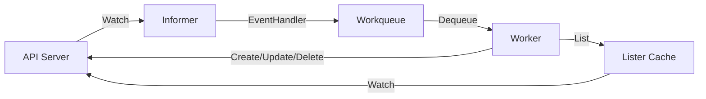
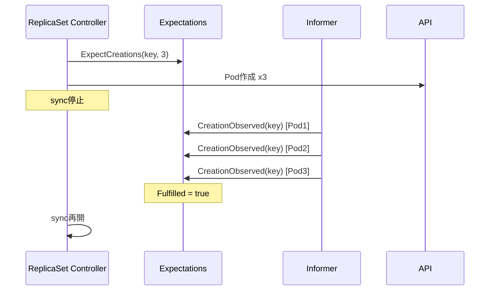

# 第9章 kube-controller-manager のアーキテクチャ

> 本章で読むソース
>
> - [cmd/kube-controller-manager/app/controllermanager.go L1-L878](https://github.com/kubernetes/kubernetes/blob/v1.36.2/cmd/kube-controller-manager/app/controllermanager.go#L1-L878)
> - [cmd/kube-controller-manager/app/controller_descriptor.go L1-L249](https://github.com/kubernetes/kubernetes/blob/v1.36.2/cmd/kube-controller-manager/app/controller_descriptor.go#L1-L249)
> - [cmd/kube-controller-manager/app/core.go L1-L1075](https://github.com/kubernetes/kubernetes/blob/v1.36.2/cmd/kube-controller-manager/app/core.go#L1-L1075)
> - [pkg/controller/controller_utils.go L61-L227](https://github.com/kubernetes/kubernetes/blob/v1.36.2/pkg/controller/controller_utils.go#L61-L227)

## この章の狙い

kube-controller-manager は40種以上のコントローラを単一プロセスにまとめて実行するデーモンである。
本章では、プロセス全体の起動フロー、`ControllerDescriptor` による宣言的なコントローラ登録機構、informer と workqueue を組み合わせたイベント駆動ループ、そして expectations 機構による informer の遅延対策を読む。
これにより、以降の章で扱う個別コントローラ（ReplicaSet、Deployment、StatefulSet、Job、CronJob、DaemonSet）が共通基盤の上でどのように構築されているかを理解する。

## 前提

- 第1章で Kubernetes の全体像を把握している。
- 第6章で informer の基本構造（Lister、Indexer、EventHandler）を読んでいる。
- Go の goroutine、channel、sync パッケージの基礎知識がある。

## コントローラマネージャの起動フロー

### cobra コマンドのエントリポイント

`NewControllerManagerCommand` が cobra.Command を組み立てる。

[cmd/kube-controller-manager/app/controllermanager.go L108-L187](https://github.com/kubernetes/kubernetes/blob/v1.36.2/cmd/kube-controller-manager/app/controllermanager.go#L108-L187)

```go
func NewControllerManagerCommand() *cobra.Command {
    s, err := options.NewKubeControllerManagerOptions()
    // ...
    cmd := &cobra.Command{
        Use: kubeControllerManager,
        Long: `The Kubernetes controller manager is a daemon that embeds
the core control loops shipped with Kubernetes. ...`,
        RunE: func(cmd *cobra.Command, args []string) error {
            // ...
            ctx := context.Background()
            c, err := s.Config(ctx, KnownControllers(), ControllersDisabledByDefault(), ControllerAliases())
            // ...
            return Run(ctx, c.Complete())
        },
    }
    // ...
}
```

`RunE` の中で `KnownControllers()`、`ControllersDisabledByDefault()`、`ControllerAliases()` をオプション構築に渡している。
これらはすべて `NewControllerDescriptors()` から導出される。

### Run 関数の全体像

`Run` 関数はイベントブロードキャスタの起動、configz の登録、ヘルスチェックの構築、HTTP サーバの起動、そしてリーダー選出を経てコントローラの起動に進む。

[cmd/kube-controller-manager/app/controllermanager.go L198-L298](https://github.com/kubernetes/kubernetes/blob/v1.36.2/cmd/kube-controller-manager/app/controllermanager.go#L198-L298)

```go
func Run(ctx context.Context, c *config.CompletedConfig) error {
    // ...
    c.EventBroadcaster.StartStructuredLogging(0)
    c.EventBroadcaster.StartRecordingToSink(&v1core.EventSinkImpl{Interface: c.Client.CoreV1().Events("")})
    // ...
    run := func(ctx context.Context, controllerDescriptors map[string]*ControllerDescriptor) error {
        controllerContext, err := CreateControllerContext(ctx, c, rootClientBuilder, clientBuilder)
        // ...
        controllers, err := BuildControllers(ctx, controllerContext, controllerDescriptors, unsecuredMux, healthzHandler)
        // ...
        controllerContext.InformerFactory.Start(stopCh)
        close(controllerContext.InformersStarted)
        if len(controllers) > 0 {
            if !RunControllers(ctx, controllerContext, controllers, ControllerStartJitter, c.ControllerShutdownTimeout) {
                return errors.New("controller shutdown timeout reached")
            }
        }
        return nil
    }
    // ...
}
```

起動の順序は重要である。
まず `CreateControllerContext` で共有 InformerFactory を構築し、次に `BuildControllers` で全コントローラを初期化する。
その後 `InformerFactory.Start` で informer を起動し、`InformersStarted` チャネルを close してから `RunControllers` で各コントローラの Run を呼び出す。
この順序により、コントローラの Run が動き出す時点では informer のキャッシュが既に同期されている。

### リーダー選出

本番環境では複数の kube-controller-manager が並行して動作するが、実際にコントローラを回すのはリーダー1つだけである。

[cmd/kube-controller-manager/app/controllermanager.go L300-L305](https://github.com/kubernetes/kubernetes/blob/v1.36.2/cmd/kube-controller-manager/app/controllermanager.go#L300-L305)

```go
if !c.ComponentConfig.Generic.LeaderElection.LeaderElect {
    controllerDescriptors := NewControllerDescriptors()
    controllerDescriptors[names.ServiceAccountTokenController] = saTokenControllerDescriptor
    return run(ctx, controllerDescriptors)
}
```

リーダー選出が有効な場合は `leaderElectAndRun` の中で `leaderelection.RunOrDie` を呼び、Lease オブジェクトをロックとして取得したインスタンスだけが `run` を実行する。

[cmd/kube-controller-manager/app/controllermanager.go L838-L867](https://github.com/kubernetes/kubernetes/blob/v1.36.2/cmd/kube-controller-manager/app/controllermanager.go#L838-L867)

```go
func leaderElectAndRun(ctx context.Context, c *config.CompletedConfig, lockIdentity string, ...) {
    rl, err := resourcelock.NewFromKubeconfig(resourceLock, ...)
    // ...
    leaderelection.RunOrDie(ctx, leaderelection.LeaderElectionConfig{
        Lock:            rl,
        LeaseDuration:   c.ComponentConfig.Generic.LeaderElection.LeaseDuration.Duration,
        RenewDeadline:   c.ComponentConfig.Generic.LeaderElection.RenewDeadline.Duration,
        RetryPeriod:     c.ComponentConfig.Generic.LeaderElection.RetryPeriod.Duration,
        Callbacks:       callbacks,
        // ...
    })
}
```

## ControllerDescriptor による宣言的登録

### ControllerDescriptor 構造体

v1.36.2 では各コントローラのメタデータを `ControllerDescriptor` にカプセル化する。

[cmd/kube-controller-manager/app/controller_descriptor.go L50-L58](https://github.com/kubernetes/kubernetes/blob/v1.36.2/cmd/kube-controller-manager/app/controller_descriptor.go#L50-L58)

```go
type ControllerDescriptor struct {
    name                      string
    constructor               ControllerConstructor
    requiredFeatureGates      []featuregate.Feature
    aliases                   []string
    isDisabledByDefault       bool
    isCloudProviderController bool
    requiresSpecialHandling   bool
}
```

`name` はコントローラの正規名、`constructor` は実体を生成する関数、`requiredFeatureGates` は有効化に必要なフィーチャゲートのリスト、`aliases` は後方互換性のための別名、`isDisabledByDefault` はデフォルト無効かどうか、`isCloudProviderController` はクラウドプロバイダ由来のコントローラかどうか、`requiresSpecialHandling` は ServiceAccountTokenController のような特殊な初期化が必要かどうかを示す。

### コントローラの登録

`NewControllerDescriptors` 関数が全コントローラのマップを構築する。

[cmd/kube-controller-manager/app/controller_descriptor.go L148-L249](https://github.com/kubernetes/kubernetes/blob/v1.36.2/cmd/kube-controller-manager/app/controller_descriptor.go#L148-L249)

```go
func NewControllerDescriptors() map[string]*ControllerDescriptor {
    controllers := map[string]*ControllerDescriptor{}
    aliases := sets.NewString()
    register := func(controllerDesc *ControllerDescriptor) {
        // ...バリデーション...
        controllers[name] = controllerDesc
    }
    register(newServiceAccountTokenControllerDescriptor(nil))
    register(newEndpointsControllerDescriptor())
    register(newEndpointSliceControllerDescriptor())
    // ...
    register(newReplicaSetControllerDescriptor())
    register(newDeploymentControllerDescriptor())
    register(newStatefulSetControllerDescriptor())
    register(newDaemonSetControllerDescriptor())
    register(newJobControllerDescriptor())
    register(newCronJobControllerDescriptor())
    // ... (40種以上)
    return controllers
}
```

各 `new*ControllerDescriptor` 関数は `core.go` や他のファイルに定義される。
たとえば DaemonSet の場合は次のようになる。

`register` 内の無名関数は名前重複、エイリアス重複、コンストラクタ未設定をチェックし、問題があれば panic を起こす。
これにより、起動時に設定ミスを即座に検出できる。

### BuildController での生成

`BuildController` はフィーチャゲートの確認とクラウドプロバイダコントローラのスキップを行った上でコンストラクタを呼び出す。

[cmd/kube-controller-manager/app/controller_descriptor.go L93-L113](https://github.com/kubernetes/kubernetes/blob/v1.36.2/cmd/kube-controller-manager/app/controller_descriptor.go#L93-L113)

```go
func (r *ControllerDescriptor) BuildController(ctx context.Context, controllerCtx ControllerContext) (Controller, error) {
    // ...
    for _, featureGate := range r.GetRequiredFeatureGates() {
        if !utilfeature.DefaultFeatureGate.Enabled(featureGate) {
            logger.Info("Controller is disabled by a feature gate", ...)
            return nil, nil
        }
    }
    if r.IsCloudProviderController() {
        logger.Info("Skipping a cloud provider controller", ...)
        return nil, nil
    }
    ctx = klog.NewContext(ctx, klog.LoggerWithName(logger, controllerName))
    return r.GetControllerConstructor()(ctx, controllerCtx, controllerName)
}
```

フィーチャゲートが無効、あるいはクラウドプロバイダコントローラの場合は `nil, nil` を返す。
呼び出し側の `BuildControllers` は `ctrl == nil` のときにスキップする。

### BuildControllers での起動順序

`BuildControllers` はまず ServiceAccountTokenController を最初に初期化する。

[cmd/kube-controller-manager/app/controllermanager.go L666-L696](https://github.com/kubernetes/kubernetes/blob/v1.36.2/cmd/kube-controller-manager/app/controllermanager.go#L666-L696)

```go
// Always start the SA token controller first using a full-power client, since it needs to mint tokens for the rest
// If this fails, just return here and fail since other controllers won't be able to get credentials.
if serviceAccountTokenControllerDescriptor, ok := controllerDescriptors[names.ServiceAccountTokenController]; ok {
    if err := buildController(serviceAccountTokenControllerDescriptor); err != nil {
        return nil, err
    }
}
// ...
for _, controllerDesc := range controllerDescriptors {
    if controllerDesc.RequiresSpecialHandling() {
        continue
    }
    if !controllerCtx.IsControllerEnabled(controllerDesc) {
        logger.Info("Warning: controller is disabled", ...)
        continue
    }
    if err := buildController(controllerDesc); err != nil {
        return nil, err
    }
}
```

ServiceAccountTokenController がトークンを発行してからでないと、他のコントローラが API サーバーと通信するための認証情報を得られない。
この依存関係をコードが明示している。

### RunControllers での並行起動

`RunControllers` は全コントローラを goroutine で並行起動する。

[cmd/kube-controller-manager/app/controllermanager.go L710-L806](https://github.com/kubernetes/kubernetes/blob/v1.36.2/cmd/kube-controller-manager/app/controllermanager.go#L710-L806)

```go
func RunControllers(ctx context.Context, ...) bool {
    // ...
    for _, controller := range controllers {
        go func() {
            defer wg.Done()
            time.Sleep(wait.Jitter(controllerCtx.ComponentConfig.Generic.ControllerStartInterval.Duration, controllerStartJitterMaxFactor))
            // ...
            controller.Run(ctx)
        }()
    }
    wg.Wait()
    // ...
}
```

各コントローラの起動前に `wait.Jitter` でランダムな遅延を入れる。
これは全コントローラが一斉に informer のリソースを要求するのを避け、API サーバーへの負荷を平準化するためである。

## ControllerContext の構築

`CreateControllerContext` はコントローラ群が共有するリソースをまとめる。

[cmd/kube-controller-manager/app/controllermanager.go L527-L613](https://github.com/kubernetes/kubernetes/blob/v1.36.2/cmd/kube-controller-manager/app/controllermanager.go#L527-L613)

```go
func CreateControllerContext(ctx context.Context, s *config.CompletedConfig, ...) (ControllerContext, error) {
    trim := func(obj interface{}) (interface{}, error) {
        if accessor, err := meta.Accessor(obj); err == nil {
            if accessor.GetManagedFields() != nil {
                accessor.SetManagedFields(nil)
            }
        }
        return obj, nil
    }
    // ...
    sharedInformers := informers.NewSharedInformerFactoryWithOptions(versionedClient, ResyncPeriod(s)(), informers.WithTransform(trim), ...)
    // ...
}
```

Informer の transform 関数で `ManagedFields` を削除している。
ManagedFields は API サーバーが各フィールドの最終更新者を追跡するために保持するデータであり、コントローラ側では不要である。
インメモリで保持するオブジェクトから取り除くことで、メモリ使用量を削減する。

`ControllerContext` 構造体は `InformerFactory`、`ComponentConfig`、`RESTMapper`、`InformersStarted` チャネルなどを保持する。

[cmd/kube-controller-manager/app/controllermanager.go L462-L498](https://github.com/kubernetes/kubernetes/blob/v1.36.2/cmd/kube-controller-manager/app/controllermanager.go#L462-L498)

```go
// ControllerContext defines the context object for controller
type ControllerContext struct {
    // ClientBuilder will provide a client for this controller to use
    ClientBuilder clientbuilder.ControllerClientBuilder
    // InformerFactory gives access to informers for the controller.
    InformerFactory informers.SharedInformerFactory
    ObjectOrMetadataInformerFactory informerfactory.InformerFactory
    // ComponentConfig provides access to init options for a given controller
    ComponentConfig kubectrlmgrconfig.KubeControllerManagerConfiguration
    // DeferredDiscoveryRESTMapper is a RESTMapper that will defer
    // initialization of the RESTMapper until the first mapping is
    // requested.
    RESTMapper *restmapper.DeferredDiscoveryRESTMapper
    // InformersStarted is closed after all of the controllers have been initialized and are running.
    InformersStarted chan struct{}
    // ResyncPeriod generates a duration each time it is invoked
    ResyncPeriod func() time.Duration
    // ControllerManagerMetrics provides a proxy to set controller manager specific metrics.
    ControllerManagerMetrics *controllersmetrics.ControllerManagerMetrics
    // GraphBuilder gives an access to dependencyGraphBuilder which keeps tracks of resources in the cluster
    GraphBuilder *garbagecollector.GraphBuilder
}
```

## Informer と Workqueue のパターン

### 共通パターン

各コントローラは同じパターンに従う。

1. Informer の EventHandler でオブジェクトの変化を検知し、workqueue にキーを投入する。
2. worker goroutine がキューからキーを取り出し、syncHandler を呼び出す。
3. syncHandler は Lister から最新状態を読み、期待状態と実状態の差分を計算して API サーバーに反映する。



このパターンは「レベルトリガ」と呼ばれる。
エッジ（差分）ではなく現在の状態（レベル）を読み、目的状態との差分を計算する。
これにより、イベントの取りこぼしや順序の入れ替わりに対して耐性を持つ。

### ResyncPeriod のジッター

`ResyncPeriod` は informer の定期リフレッシュ間隔を返す。

[cmd/kube-controller-manager/app/controllermanager.go L189-L196](https://github.com/kubernetes/kubernetes/blob/v1.36.2/cmd/kube-controller-manager/app/controllermanager.go#L189-L196)

```go
func ResyncPeriod(c *config.CompletedConfig) func() time.Duration {
    return func() time.Duration {
        factor := rand.Float64() + 1
        return time.Duration(float64(c.ComponentConfig.Generic.MinResyncPeriod.Nanoseconds()) * factor)
    }
}
```

コントローラごとにリフレッシュのタイミングがずれるため、API サーバーへの LIST リクエストが集中しない。

## Expectations 機構

### 問題

コントローラが Pod を作成した直後、informer の watch イベントがまだ届いていないことがある。
この状態で次の sync が走ると「Pod が足りない」と判断して余分に作成してしまう。

### 解決策

expectations は「このコントローラがあと N 個の作成（または削除）イベントを見るはずだ」という期待値を記録する。
期待が満たされるか、TTL（5分）が経過するまで、sync はスキップされる。

[pkg/controller/controller_utils.go L61-L72](https://github.com/kubernetes/kubernetes/blob/v1.36.2/pkg/controller/controller_utils.go#L61-L72)

```go
const (
    // If a watch drops a delete event for a pod, it'll take this long
    // before a dormant controller waiting for those packets is woken up anyway. It is
    // specifically targeted at the case where some problem prevents an update
    // of expectations, without it the controller could stay asleep forever. This should
    // be set based on the expected latency of watch events.
    //
    // Currently a controller can service (create *and* observe the watch events for said
    // creation) about 10 pods a second, so it takes about 1 min to service
    // 500 pods. Just creation is limited to 20qps, and watching happens with ~10-30s
    // latency/pod at the scale of 3000 pods over 100 nodes.
    ExpectationsTimeout = 5 * time.Minute
```

`ControllerExpectationsInterface` は期待値の操作を提供する。

[pkg/controller/controller_utils.go L151-L166](https://github.com/kubernetes/kubernetes/blob/v1.36.2/pkg/controller/controller_utils.go#L151-L166)

```go
type ControllerExpectationsInterface interface {
    GetExpectations(controllerKey string) (*ControlleeExpectations, bool, error)
    SatisfiedExpectations(logger klog.Logger, controllerKey string) bool
    DeleteExpectations(logger klog.Logger, controllerKey string)
    SetExpectations(logger klog.Logger, controllerKey string, add, del int) error
    ExpectCreations(logger klog.Logger, controllerKey string, adds int) error
    ExpectDeletions(logger klog.Logger, controllerKey string, dels int) error
    CreationObserved(logger klog.Logger, controllerKey string)
    DeletionObserved(logger klog.Logger, controllerKey string)
    RaiseExpectations(logger klog.Logger, controllerKey string, add, del int)
    LowerExpectations(logger klog.Logger, controllerKey string, add, del int)
}
```

`SatisfiedExpectations` は期待が満たされたか、期限切れかどうかを判定する。

[pkg/controller/controller_utils.go L192-L220](https://github.com/kubernetes/kubernetes/blob/v1.36.2/pkg/controller/controller_utils.go#L192-L220)

```go
func (r *ControllerExpectations) SatisfiedExpectations(logger klog.Logger, controllerKey string) bool {
    if exp, exists, err := r.GetExpectations(controllerKey); exists {
        if exp.Fulfilled() {
            logger.V(4).Info("Controller expectations fulfilled", ...)
            return true
        } else if exp.isExpired() {
            logger.V(4).Info("Controller expectations expired", ...)
            return true
        } else {
            logger.V(4).Info("Controller still waiting on expectations", ...)
            return false
        }
    }
    // ...
    return true
}
```

### 動作の流れ

ReplicaSet コントローラを例にとる。

1. `manageReplicas` で Pod を N 個作成する必要が生じたとき、`ExpectCreations(rsKey, N)` を呼ぶ。
2. informer が Pod 作成イベントを受信するたびに `CreationObserved(rsKey)` が呼ばれ、カウンタが減る。
3. カウンタが 0 になる（`Fulfilled`）か、5分経過する（`isExpired`）と、次の sync が実行される。



この機構は、watch イベントの遅延による過剰な Pod 作成を防ぐ。

## 最適化: slowStartBatch による段階的スケールアップ

コントローラが多数の Pod を一度に作成するとき、`slowStartBatch` を使ってバッチサイズを指数的に増やす。

[pkg/controller/replicaset/replica_set.go L876-L911](https://github.com/kubernetes/kubernetes/blob/v1.36.2/pkg/controller/replicaset/replica_set.go#L876-L911)

```go
func slowStartBatch(count int, initialBatchSize int, fn func() error) (int, error) {
    remaining := count
    successes := 0
    for batchSize := min(remaining, initialBatchSize); batchSize > 0; batchSize = min(2*batchSize, remaining) {
        errCh := make(chan error, batchSize)
        var wg sync.WaitGroup
        wg.Add(batchSize)
        for i := 0; i < batchSize; i++ {
            go func() {
                defer wg.Done()
                if err := fn(); err != nil {
                    errCh <- err
                }
            }()
        }
        wg.Wait()
        curSuccesses := batchSize - len(errCh)
        successes += curSuccesses
        if len(errCh) > 0 {
            return successes, <-errCh
        }
        remaining -= batchSize
    }
    return successes, nil
}
```

初期バッチサイズは 1 で始まり、成功するたびに倍増する（1, 2, 4, 8, ...）。
途中で失敗すると即座に終了し、残りの作成は次の sync に委ねられる。
これにより、クォータ超過やリソース不足で大量の API コールが失敗するのを防ぐ。

## まとめ

kube-controller-manager は `ControllerDescriptor` による宣言的登録、`ControllerContext` による共有リソース管理、informer と workqueue のレベルトリガパターン、expectations による watch 遅延対策という4つの機構で構成される。
個別のコントローラはこの共通基盤の上で、固有の調停ロジックを実装する。

## 関連する章

- [第10章 主要コントローラ（ReplicaSet, Deployment, StatefulSet）](10-workload-controllers.md)
- [第11章 主要コントローラ（Job, CronJob, DaemonSet）](11-batch-and-daemon-controllers.md)
- [第19章 client-go と Informer](../part07-extension/19-client-go-and-informer.md)
