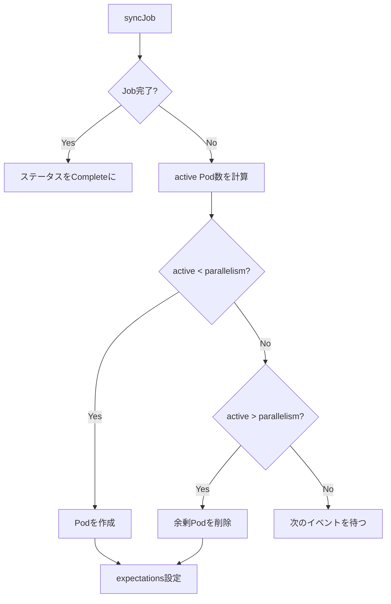
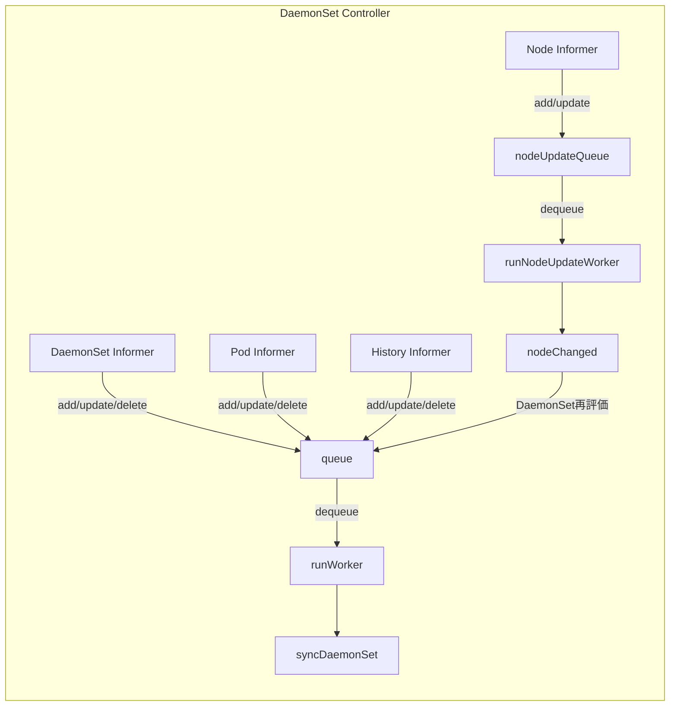

# 第11章 主要コントローラ（Job, CronJob, DaemonSet）

> 本章で読むソース
>
> - [pkg/controller/job/job_controller.go L1-L2304](https://github.com/kubernetes/kubernetes/blob/v1.36.2/pkg/controller/job/job_controller.go#L1-L2304)
> - [pkg/controller/cronjob/cronjob_controllerv2.go L1-L784](https://github.com/kubernetes/kubernetes/blob/v1.36.2/pkg/controller/cronjob/cronjob_controllerv2.go#L1-L784)
> - [pkg/controller/daemon/daemon_controller.go L1-L1557](https://github.com/kubernetes/kubernetes/blob/v1.36.2/pkg/controller/daemon/daemon_controller.go#L1-L1557)

## この章の狙い

バッチ処理とノードレベルのデーモンを担う3つのコントローラを読む。
Job は完了 semantics を持つ Pod を管理し、CronJob はスケジュールに基づいて Job を生成する。
DaemonSet は各ノードに1つずつ Pod を配置する。
いずれも第9章の共通パターン（informer、workqueue、expectations）を基盤としつつ、固有の調停ロジックを実装する。

## 前提

- 第9章で kube-controller-manager の起動フローと expectations 機構を理解している。
- 第10章で ReplicaSet コントローラのパターン（manageReplicas、slowStartBatch）を読んでいる。
- Job、CronJob、DaemonSet の API 仕様を知っている。

## Job コントローラ

### 構造体

`Controller` は Job と Pod の informer を監視し、Job の完了状態を管理する。

[pkg/controller/job/job_controller.go L89-L156](https://github.com/kubernetes/kubernetes/blob/v1.36.2/pkg/controller/job/job_controller.go#L89-L156)

```go
type Controller struct {
    kubeClient clientset.Interface
    podControl controller.PodControlInterface
    updateStatusHandler func(ctx context.Context, job *batch.Job) (*batch.Job, error)
    patchJobHandler     func(ctx context.Context, job *batch.Job, patch []byte) error
    syncHandler         func(ctx context.Context, jobKey string) error
    podStoreSynced cache.InformerSynced
    jobStoreSynced cache.InformerSynced
    expectations controller.ControllerExpectationsInterface
    finalizerExpectations *uidTrackingExpectations
    jobLister batchv1listers.JobLister
    podStore corelisters.PodLister
    podIndexer cache.Indexer
    queue workqueue.TypedRateLimitingInterface[string]
    orphanQueue workqueue.TypedRateLimitingInterface[orphanPodKey]
    broadcaster record.EventBroadcaster
    recorder    record.EventRecorder
    clock clock.WithTicker
    podBackoffStore *backoffStore
    finishedJobExpectations sync.Map
    consistencyStore consistencyutil.ConsistencyStore
}
```

Job コントローラの特徴は2つのキューを持つことである。
`queue` は Job の調停用、`orphanQueue` は孤立した Pod のファイナライザクリーンアップ用である。

### Tracking Finalizer

Job コントローラは Pod に `batch.JobTrackingFinalizer` を付けて、Pod の完了を確実に追跡する。

[pkg/controller/job/job_controller.go L858-L906](https://github.com/kubernetes/kubernetes/blob/v1.36.2/pkg/controller/job/job_controller.go#L858-L906)

```go
func (jm *Controller) getPodsForJob(ctx context.Context, j *batch.Job) ([]*v1.Pod, error) {
    // ...
    cm := controller.NewPodControllerRefManager(jm.podControl, j, selector, controllerKind, canAdoptFunc, batch.JobTrackingFinalizer)
    pods, err = cm.ClaimPods(ctx, pods)
    // ...
    for i, p := range pods {
        adopted := true
        for _, r := range p.OwnerReferences {
            if r.UID == j.UID {
                adopted = false
                break
            }
        }
        if adopted && !hasJobTrackingFinalizer(p) {
            pods[i] = p.DeepCopy()
            pods[i].Finalizers = append(p.Finalizers, batch.JobTrackingFinalizer)
        }
    }
    return pods, err
}
```

Pod を adopt する際にトラッキングファイナライザを追加する。
これにより、Pod が削除される前にコントローラが完了状態を記録する機会が保証される。

### syncJob

[pkg/controller/job/job_controller.go L908-L949](https://github.com/kubernetes/kubernetes/blob/v1.36.2/pkg/controller/job/job_controller.go#L908-L949)

```go
func (jm *Controller) syncJob(ctx context.Context, key string) (rErr error) {
    startTime := jm.clock.Now()
    // ...
    if err := jm.consistencyStore.EnsureReady(jobNamespacedName); err != nil {
        // ...
        return err
    }
    sharedJob, err := jm.jobLister.Jobs(ns).Get(name)
    if err != nil {
        if apierrors.IsNotFound(err) {
            logger.V(4).Info("Job has been deleted", "key", key)
            jm.expectations.DeleteExpectations(logger, key)
            jm.finalizerExpectations.deleteExpectations(logger, key)
            jm.consistencyStore.Clear(jobNamespacedName, "")
            // ...
        }
    }
    // ...
}
```

`consistencyStore.EnsureReady` で、前回の書き込みが informer に反映されるまで sync を遅延する。
これは第10章の ReplicaSet で見た consistencyStore と同じ仕組みである。

### 並列度制御

Job は `.spec.parallelism` で同時実行 Pod 数を制御する。
`syncJob` の中で active Pod 数を計算し、parallelism との差分に応じて Pod を作成・削除する。



### バッチ同期と指数バックオフ

Job コントローラは Pod イベントをバッチ処理するために `enqueueSyncJobBatched` を使う。

[pkg/controller/job/job_controller.go L682-L718](https://github.com/kubernetes/kubernetes/blob/v1.36.2/pkg/controller/job/job_controller.go#L682-L718)

```go
func (jm *Controller) enqueueSyncJobBatched(logger klog.Logger, obj interface{}) {
    jm.enqueueSyncJobInternal(logger, obj, SyncJobBatchPeriod)
}

func (jm *Controller) enqueueSyncJobInternal(logger klog.Logger, obj interface{}, delay time.Duration) {
    key, err := controller.KeyFunc(obj)
    // ...
    jm.queue.AddAfter(key, delay)
}
```

`SyncJobBatchPeriod`（1秒）の遅延でキューに入れる。
多数の Pod イベントが短時間に届いても、1秒以内に1回だけ sync すればよい。

Pod 失敗時には指数バックオフで再作成を遅延する。

[pkg/controller/job/job_controller.go L69-L87](https://github.com/kubernetes/kubernetes/blob/v1.36.2/pkg/controller/job/job_controller.go#L69-L87)

```go
var (
    // syncJobBatchPeriod is the batch period for controller sync invocations for a Job. Exported for tests.
    SyncJobBatchPeriod = time.Second
    // DefaultJobApiBackOff is the default API backoff period. Exported for tests.
    DefaultJobApiBackOff = time.Second
    // MaxJobApiBackOff is the max API backoff period. Exported for tests.
    MaxJobApiBackOff = time.Minute
    // DefaultJobPodFailureBackOff is the default pod failure backoff period. Exported for tests.
    DefaultJobPodFailureBackOff = 10 * time.Second
    // MaxJobPodFailureBackOff is the max  pod failure backoff period. Exported for tests.
    MaxJobPodFailureBackOff = 10 * time.Minute
    // MaxUncountedPods is the maximum size the slices in
    // .status.uncountedTerminatedPods should have to keep their representation
    // roughly below 20 KB. Exported for tests
    MaxUncountedPods = 500
    // MaxPodCreateDeletePerSync is the maximum number of pods that can be
    // created or deleted in a single sync call. Exported for tests.
    MaxPodCreateDeletePerSync = 500
)
```

API 呼び出しのバックオフは最大1分、Pod 失敗時のバックオフは最大10分である。
これにより、一時的な障害が連続する場合に API サーバーを過負荷にしない。

## CronJob コントローラ

### 構造体

`ControllerV2` は `DelayingQueue` を使うリファクタリング版である。

[pkg/controller/cronjob/cronjob_controllerv2.go L61-L81](https://github.com/kubernetes/kubernetes/blob/v1.36.2/pkg/controller/cronjob/cronjob_controllerv2.go#L61-L81)

```go
type ControllerV2 struct {
    queue workqueue.TypedRateLimitingInterface[string]
    kubeClient  clientset.Interface
    recorder    record.EventRecorder
    broadcaster record.EventBroadcaster
    jobControl     jobControlInterface
    cronJobControl cjControlInterface
    jobLister     batchv1listers.JobLister
    cronJobLister batchv1listers.CronJobLister
    jobListerSynced     cache.InformerSynced
    cronJobListerSynced cache.InformerSynced
    now func() time.Time
}
```

`now` 関数を注入可能にすることで、テストで時間を制御できる。

### syncCronJob

[pkg/controller/cronjob/cronjob_controllerv2.go L422-L549](https://github.com/kubernetes/kubernetes/blob/v1.36.2/pkg/controller/cronjob/cronjob_controllerv2.go#L422-L549)

```go
func (jm *ControllerV2) syncCronJob(
    ctx context.Context,
    cronJob *batchv1.CronJob,
    jobs []*batchv1.Job) (*time.Duration, bool, error) {

    now := jm.now()
    updateStatus := false
    childrenJobs := make(map[types.UID]bool)
    for _, j := range jobs {
        childrenJobs[j.ObjectMeta.UID] = true
        found := inActiveList(cronJob, j.ObjectMeta.UID)
        if !found && !jobutil.IsJobFinished(j) {
            // ...未登録のJobを発見...
        } else if jobutil.IsJobFinished(j) {
            if found {
                deleteFromActiveList(cronJob, j.ObjectMeta.UID)
                updateStatus = true
            }
            // ...LastSuccessfulTime更新...
        }
    }
    // ...
    sched, err := parsers.ParseCronScheduleWithPanicRecovery(formatSchedule(cronJob, jm.recorder))
    // ...
    scheduledTime, err := nextScheduleTime(logger, cronJob, now, sched, jm.recorder)
    // ...
}
```

syncCronJob の処理は以下の通り。

1. 既存の Job を走査し、Active リストの整合性を取る。
2. 完了した Job を Active から削除し、LastSuccessfulTime を更新する。
3. cron スケジュールを解析し、次の実行時刻を計算する。
4. 未処理の実行時刻があれば Job を作成する。

### 同時実行ポリシー

[pkg/controller/cronjob/cronjob_controllerv2.go L573-L601](https://github.com/kubernetes/kubernetes/blob/v1.36.2/pkg/controller/cronjob/cronjob_controllerv2.go#L573-L601)

```go
if cronJob.Spec.ConcurrencyPolicy == batchv1.ForbidConcurrent && len(cronJob.Status.Active) > 0 {
    // ...
    logger.V(4).Info("Not starting job because prior execution is still running and concurrency policy is Forbid", ...)
    t := nextScheduleTimeDuration(cronJob, now, sched)
    return t, updateStatus, nil
}
if cronJob.Spec.ConcurrencyPolicy == batchv1.ReplaceConcurrent {
    for _, j := range cronJob.Status.Active {
        // ...実行中のJobを削除...
        if !deleteJob(logger, cronJob, j, jm.jobControl, jm.recorder) {
            return nil, updateStatus, fmt.Errorf("could not replace job %s/%s", j.Namespace, j.Name)
        }
        updateStatus = true
    }
}
```

- **Forbid**: 実行中の Job があるときは次をスキップする。
- **Replace**: 実行中の Job を削除してから新しく作成する。
- **Allow**（デフォルト）: 無制限に並行実行を許可する。

### 次回のスケジュール時刻計算と再キュー

`nextScheduleTimeDuration` は次の実行時刻までの時間を計算し、`queue.AddAfter` で正確なタイミングで wake up する。

[pkg/controller/cronjob/cronjob_controllerv2.go L176-L186](https://github.com/kubernetes/kubernetes/blob/v1.36.2/pkg/controller/cronjob/cronjob_controllerv2.go#L176-L186)

```go
func (jm *ControllerV2) processNextWorkItem(ctx context.Context) bool {
    key, quit := jm.queue.Get()
    // ...
    requeueAfter, err := jm.sync(ctx, key)
    switch {
    case err != nil:
        utilruntime.HandleError(...)
        jm.queue.AddRateLimited(key)
    case requeueAfter != nil:
        jm.queue.Forget(key)
        jm.queue.AddAfter(key, *requeueAfter)
    }
    return true
}
```

sync が `requeueAfter` を返すと、次のスケジュール時刻まで正確にスリープする。
これにより、不要なポーリングを避け、スケジュール時刻ちょうどに Job を起動できる。

## DaemonSet コントローラ

### 構造体

`DaemonSetsController` は DaemonSet、Pod、Node、ControllerRevision の4つの informer を監視する。

[pkg/controller/daemon/daemon_controller.go L101-L155](https://github.com/kubernetes/kubernetes/blob/v1.36.2/pkg/controller/daemon/daemon_controller.go#L101-L155)

```go
type DaemonSetsController struct {
    kubeClient clientset.Interface
    eventBroadcaster record.EventBroadcaster
    eventRecorder    record.EventRecorder
    podControl controller.PodControlInterface
    crControl  controller.ControllerRevisionControlInterface
    burstReplicas int
    syncHandler func(ctx context.Context, dsKey string) error
    enqueueDaemonSet func(ds *apps.DaemonSet)
    expectations controller.ControllerExpectationsInterface
    dsLister appslisters.DaemonSetLister
    dsStoreSynced cache.InformerSynced
    historyLister appslisters.ControllerRevisionLister
    historyStoreSynced cache.InformerSynced
    podLister corelisters.PodLister
    podIndexer cache.Indexer
    podStoreSynced cache.InformerSynced
    nodeLister corelisters.NodeLister
    nodeStoreSynced cache.InformerSynced
    queue workqueue.TypedRateLimitingInterface[string]
    nodeUpdateQueue workqueue.TypedRateLimitingInterface[string]
    failedPodsBackoff *flowcontrol.Backoff
    consistencyStore consistencyutil.ConsistencyStore
}
```

`nodeUpdateQueue` はノードの変化を処理する専用のキューである。
ノードのラベルやテイントが変わると DaemonSet の配置対象が変わるため、DaemonSet の再評価が必要になる。

### syncDaemonSet

[pkg/controller/daemon/daemon_controller.go L1267-L1368](https://github.com/kubernetes/kubernetes/blob/v1.36.2/pkg/controller/daemon/daemon_controller.go#L1267-L1368)

```go
func (dsc *DaemonSetsController) syncDaemonSet(ctx context.Context, key string) error {
    // ...
    if err := dsc.consistencyStore.EnsureReady(dsNamespacedName); err != nil {
        // ...
        return err
    }
    ds, err := dsc.dsLister.DaemonSets(namespace).Get(name)
    // ...
    nodeList, err := dsc.nodeLister.List(labels.Everything())
    // ...
    cur, old, err := dsc.constructHistory(ctx, ds)
    // ...
    hash := cur.Labels[apps.DefaultDaemonSetUniqueLabelKey]
    if !dsc.expectations.SatisfiedExpectations(logger, dsKey) {
        return dsc.updateDaemonSetStatus(ctx, ds, nodeList, hash, false)
    }
    err = dsc.updateDaemonSet(ctx, ds, nodeList, hash, dsKey, old)
    statusErr := dsc.updateDaemonSetStatus(ctx, ds, nodeList, hash, true)
    // ...
}
```

1. 全ノードを取得する。
2. ControllerRevision から履歴を構築し、現在のハッシュを得る。
3. expectations が満たされていなければステータス更新のみで終了する。
4. `updateDaemonSet` で各ノードへの Pod 配置を調停する。

### NodeShouldRunDaemonPod

各ノードで DaemonSet の Pod を実行すべきかを判定する。

[pkg/controller/daemon/daemon_controller.go L1370-L1401](https://github.com/kubernetes/kubernetes/blob/v1.36.2/pkg/controller/daemon/daemon_controller.go#L1370-L1401)

```go
func NodeShouldRunDaemonPod(logger klog.Logger, node *v1.Node, ds *apps.DaemonSet) (bool, bool) {
    pod := NewPod(ds, node.Name)
    if !(ds.Spec.Template.Spec.NodeName == "" || ds.Spec.Template.Spec.NodeName == node.Name) {
        return false, false
    }
    taints := node.Spec.Taints
    fitsNodeName, fitsNodeAffinity, fitsTaints := predicates(logger, pod, node, taints)
    if !fitsNodeName || !fitsNodeAffinity {
        return false, false
    }
    if !fitsTaints {
        _, hasUntoleratedTaint := v1helper.FindMatchingUntoleratedTaint(logger, taints, pod.Spec.Tolerations, func(t *v1.Taint) bool {
            return t.Effect == v1.TaintEffectNoExecute
        }, ...)
        return false, !hasUntoleratedTaint
    }
    return true, true
}
```

戻り値の2つの boolean は `shouldRun`（新規配置すべきか）と `shouldContinueRunning`（既存 Pod が継続すべきか）を表す。
NodeAffinity、Taint/Toleration、NodeName の一致をチェックする。

### 2つのキュー

DaemonSet コントローラは `queue` と `nodeUpdateQueue` の2つのキューを持つ。



ノードの変化は `nodeUpdateQueue` で受け取り、影響を受ける DaemonSet を特定してから `queue` に投入する。
これにより、ノードの頻繁な更新が直接 DaemonSet の sync を引き起こすのを避け、処理をバッチ化できる。

### FailedPodsBackoff

DaemonSet は失敗した Pod の再作成に指数バックオフを適用する。

[pkg/controller/daemon/daemon_controller.go L152-L153](https://github.com/kubernetes/kubernetes/blob/v1.36.2/pkg/controller/daemon/daemon_controller.go#L152-L153)

```go
failedPodsBackoff *flowcontrol.Backoff
```

`failedPodsBackoff` は `flowcontrol.Backoff` 型で、ノードごとに失敗回数を追跡し、再作成の間隔を指数的に増やす。
`BackoffGCInterval`（1分）ごとにガベージコレクションが走る。

[pkg/controller/daemon/daemon_controller.go L386-L388](https://github.com/kubernetes/kubernetes/blob/v1.36.2/pkg/controller/daemon/daemon_controller.go#L386-L388)

```go
wg.Go(func() {
    wait.Until(dsc.failedPodsBackoff.GC, BackoffGCInterval, ctx.Done())
})
```

## 最適化: Job のバッチ同期による API 負荷低減

Job コントローラは Pod イベントを即座に処理せず、`SyncJobBatchPeriod`（1秒）のバッチウィンドウにまとめる。

[pkg/controller/job/job_controller.go L70-L71](https://github.com/kubernetes/kubernetes/blob/v1.36.2/pkg/controller/job/job_controller.go#L70-L71)

```go
	// syncJobBatchPeriod is the batch period for controller sync invocations for a Job. Exported for tests.
	SyncJobBatchPeriod = time.Second
```

大規模な Job（数千 Pod）では、Pod の作成・完了が同時に多数発生する。
各 Pod イベントごとに sync すると、API サーバーへの書き込みが Pod 数に比例してしまう。
1秒のバッチウィンドウを設けることで、多数の Pod イベントを1回の sync にまとめる。
これにより API 呼び出しを大幅に削減しつつ、1秒という十分な低遅延で応答性を保つ。

## まとめ

Job はトラッキングファイナライザと指数バックオフで Pod 完了を確実に追跡する。
CronJob は cron スケジュールに基づいて Job を生成し、`DelayingQueue` で正確なタイミングで起動する。
DaemonSet は NodeAffinity と Taint/Toleration を評価して各ノードに Pod を配置し、2つのキューでノード変化への効率的な対応を実現する。
3つとも第9章の共通パターン（informer、workqueue、expectations、consistencyStore）を基盤としている。

## 関連する章

- [第9章 kube-controller-manager のアーキテクチャ](09-controller-manager-architecture.md)
- [第10章 主要コントローラ（ReplicaSet, Deployment, StatefulSet）](10-workload-controllers.md)
