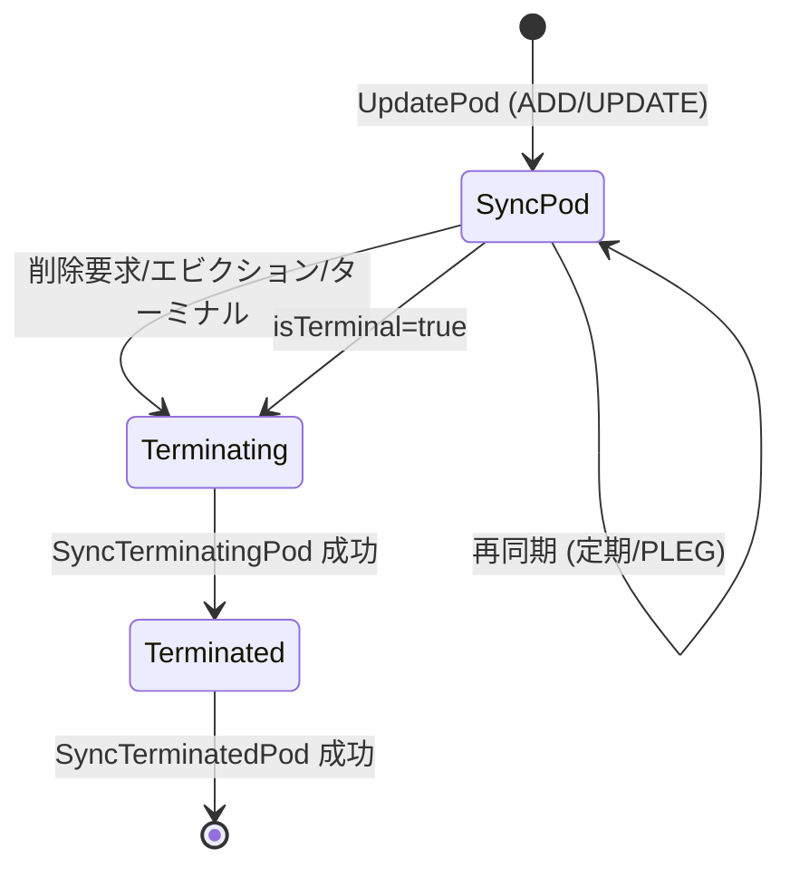

# 第12章 kubelet のアーキテクチャとメインループ

> 本章で読むソース
>
> - [pkg/kubelet/kubelet.go L1192-L1590（Kubelet 構造体）](https://github.com/kubernetes/kubernetes/blob/v1.36.2/pkg/kubelet/kubelet.go#L1192-L1590)
> - [pkg/kubelet/kubelet.go L1849-L1968（Run メソッド）](https://github.com/kubernetes/kubernetes/blob/v1.36.2/pkg/kubelet/kubelet.go#L1849-L1968)
> - [pkg/kubelet/kubelet.go L2620-L2815（syncLoop, syncLoopIteration）](https://github.com/kubernetes/kubernetes/blob/v1.36.2/pkg/kubelet/kubelet.go#L2620-L2815)
> - [pkg/kubelet/pod_workers.go L562-L612（podWorkers 構造体）](https://github.com/kubernetes/kubernetes/blob/v1.36.2/pkg/kubelet/pod_workers.go#L562-L612)
> - [pkg/kubelet/pod_workers.go L751-L995（UpdatePod）](https://github.com/kubernetes/kubernetes/blob/v1.36.2/pkg/kubelet/pod_workers.go#L751-L995)
> - [pkg/kubelet/pod_workers.go L1231-L1363（podWorkerLoop）](https://github.com/kubernetes/kubernetes/blob/v1.36.2/pkg/kubelet/pod_workers.go#L1231-L1363)
> - [pkg/kubelet/pleg/generic.go L52-L85（GenericPLEG 構造体）](https://github.com/kubernetes/kubernetes/blob/v1.36.2/pkg/kubelet/pleg/generic.go#L52-L85)
> - [pkg/kubelet/pleg/generic.go L292-L330（Relist）](https://github.com/kubernetes/kubernetes/blob/v1.36.2/pkg/kubelet/pleg/generic.go#L292-L330)

## この章の狙い

kubelet は各ノードで動作し、Pod のライフサイクルを管理するエージェントである。本章では Kubelet 構造体の全体像を把握し、`Run` メソッドから `syncLoop` を経て `syncLoopIteration` に至るメインループの構造を読む。ついで Pod ごとのゴルーチンを管理する PodWorkers と、コンテナランタイムの状態変化を検出する PLEG（Pod Lifecycle Event Generator）の仕組みを読み、kubelet のイベント駆動アーキテクチャを理解する。

## 前提

第0部で Kubernetes の全体像を把握していること。特に kubelet が API サーバーと通信して Pod を受け取る流れ（第2章）を理解していることを前提とする。

## Kubelet 構造体の全体像

`Kubelet` 構造体は kubelet プロセスの全状態を保持する。

[pkg/kubelet/kubelet.go L1192-L1590](https://github.com/kubernetes/kubernetes/blob/v1.36.2/pkg/kubelet/kubelet.go#L1192-L1590)

```go
// Kubelet is the main kubelet implementation.
type Kubelet struct {
    kubeletConfiguration kubeletconfiginternal.KubeletConfiguration
    hostname string
    nodeName        types.NodeName
    // ... (中略) ...
    podManager kubepod.Manager
    podWorkers PodWorkers
    evictionManager eviction.Manager
    probeManager prober.Manager
    secretManager secret.Manager
    configMapManager configmap.Manager
    volumeManager volumemanager.VolumeManager
    statusManager status.Manager
    allocationManager allocation.Manager
    // ... (中略) ...
    pleg pleg.PodLifecycleEventGenerator
    eventedPleg pleg.PodLifecycleEventGenerator
    // ... (中略) ...
    containerManager cm.ContainerManager
    // ... (中略) ...
}
```

構造体のフィールドは大きく分けて以下のグループに分類できる。

- **Pod の管理**: `podManager`（希望状態の保持）、`podWorkers`（Pod ごとのゴルーチン管理）
- **ライフサイクル**: `pleg`（コンテナ状態の変化検出）、`probeManager`（ヘルスチェック）
- **リソース管理**: `volumeManager`（ボリュームの attach/mount）、`containerManager`（cgroup、CPU、メモリ、デバイスの管理）
- **API サーバー連携**: `statusManager`（Pod ステータスの報告）、`nodeLeaseController`（Node リースの更新）
- **キャッシュ**: `secretManager`、`configMapManager`（Pod から参照される Secret と ConfigMap のキャッシュ）

各マネージャは独立したゴルーチンを持ち、非同期に動作する。kubelet 全体は単一のイベントループ（`syncLoop`）でイベントを配線し、各マネージャが並列に処理を進める構造である。

## Run メソッドによる起動シーケンス

kubelet の起動は `Run` メソッドが起点となる。

[pkg/kubelet/kubelet.go L1849-L1968](https://github.com/kubernetes/kubernetes/blob/v1.36.2/pkg/kubelet/kubelet.go#L1849-L1968)

```go
func (kl *Kubelet) Run(ctx context.Context, updates <-chan kubetypes.PodUpdate) {
    // ... (中略) ...
    if err := kl.initializeModules(ctx); err != nil {
        // ...
        os.Exit(1)
    }
    // ... (中略) ...
    // Start volume manager
    go kl.volumeManager.Run(ctx, kl.sourcesReady)
    // ... (中略) ...
    // Start the pod lifecycle event generator.
    kl.pleg.Start()
    // ... (中略) ...
    kl.syncLoop(ctx, updates, kl)
}
```

`Run` は以下の順序でコンポーネントを起動する。

1. `initializeModules` でメトリクス、ファイルシステムディレクトリ、イメージマネージャ、OOM ウォッチャなどを起動する。
2. `volumeManager.Run` を別ゴルーチンで開始する。
3. API サーバーが存在すれば `syncNodeStatus`（定期ステータス報告）、`fastStatusUpdateOnce`（初期高速報告）、`nodeLeaseController.Run`（Node リースの更新）を起動する。
4. `pleg.Start` で Pod Lifecycle Event Generator を起動する。
5. 最後に `syncLoop` を呼び、これがメインループとして戻ってこない。

起動順序には依存関係がある。PLEG はコンテナランタイムが動作している必要があるため、`initializeRuntimeDependentModules` で cAdvisor や ContainerManager の起動を済ませてからでなければならない。

## syncLoop と syncLoopIteration

`syncLoop` は kubelet のメインイベントループである。

[pkg/kubelet/kubelet.go L2620-L2661](https://github.com/kubernetes/kubernetes/blob/v1.36.2/pkg/kubelet/kubelet.go#L2620-L2661)

```go
func (kl *Kubelet) syncLoop(ctx context.Context, updates <-chan kubetypes.PodUpdate, handler SyncHandler) {
    logger := klog.FromContext(ctx)
    logger.Info("Starting kubelet main sync loop")
    syncTicker := time.NewTicker(time.Second)
    defer syncTicker.Stop()
    housekeepingTicker := time.NewTicker(housekeepingPeriod)
    defer housekeepingTicker.Stop()
    plegCh := kl.pleg.Watch()
    // ... (中略) ...
    for {
        if err := kl.runtimeState.runtimeErrors(); err != nil {
            // ... exponential backoff ...
            continue
        }
        duration = base
        kl.syncLoopMonitor.Store(kl.clock.Now())
        if !kl.syncLoopIteration(ctx, updates, handler, syncTicker.C, housekeepingTicker.C, plegCh) {
            break
        }
        kl.syncLoopMonitor.Store(kl.clock.Now())
    }
}
```

`syncLoop` は無限ループで `syncLoopIteration` を呼び出し続ける。ランタイムにエラーがある場合は指数バックオフで待機し、正常な場合のみイテレーションを進める。

`syncLoopIteration` は複数のチャネルを `select` で監視し、最初に到着したイベントを処理する。

[pkg/kubelet/kubelet.go L2695-L2815](https://github.com/kubernetes/kubernetes/blob/v1.36.2/pkg/kubelet/kubelet.go#L2695-L2815)

```go
func (kl *Kubelet) syncLoopIteration(ctx context.Context, configCh <-chan kubetypes.PodUpdate, handler SyncHandler,
    syncCh <-chan time.Time, housekeepingCh <-chan time.Time, plegCh <-chan *pleg.PodLifecycleEvent) bool {
    select {
    case u, open := <-configCh:
        // ... ADD/UPDATE/REMOVE/RECONCILE/DELETE のディスパッチ ...
    case e := <-plegCh:
        if isSyncPodWorthy(e) {
            if pod, ok := kl.podManager.GetPodByUID(e.ID); ok {
                handler.HandlePodSyncs(ctx, []*v1.Pod{pod})
            }
        }
        // ... ContainerDied の場合のクリーンアップ ...
    case <-syncCh:
        podsToSync := kl.getPodsToSync()
        handler.HandlePodSyncs(ctx, podsToSync)
    case update := <-kl.livenessManager.Updates():
        // ... ライブネスプローブ失敗時の同期 ...
    case update := <-kl.readinessManager.Updates():
        // ... レディネスプローブ結果の処理 ...
    case update := <-kl.startupManager.Updates():
        // ... スタートアッププローブ結果の処理 ...
    case update := <-kl.containerManager.Updates():
        // ... デバイスリソース更新の処理 ...
    case <-housekeepingCh:
        handler.HandlePodCleanups(ctx)
    }
    return true
}
```

各チャネルの役割は以下の通りである。

- **configCh**: API サーバー、ファイル、HTTP からの Pod 設定変更を受け取る。ADD/UPDATE/REMOVE/RECONCILE/DELETE に分けてハンドラへディスパッチする。
- **plegCh**: PLEG が検出したコンテナ状態の変化を受け取る。イベントが同期に値するものであれば `HandlePodSyncs` を呼ぶ。
- **syncCh**: 1秒ごとの定期同期。`getPodsToSync` でバックオフキューから取り出すべき Pod のリストを取得し、一括で同期する。
- **livenessManager/readinessManager/startupManager**: プローブの結果を受け取り、必要に応じて Pod の再同期をトリガーする。
- **containerManager.Updates**: デバイスマネージャからのリソース更新通知を受け取る。
- **housekeepingCh**: 2秒ごとのハウスキーピング。不要になった Pod のクリーンアップを実行する。

`select` の case は疑似乱数順で評価されるため、複数のチャネルに同時にイベントがある場合の処理順序は決定的ではない。これは特定のイベント種別が飢餓しないようにする設計である。

## PodWorkers による Pod ごとのゴルーチン管理

`podWorkers` は Pod ごとに専用のゴルーチンを起動し、各 Pod のライフサイクル状態機械を駆動する。

[pkg/kubelet/pod_workers.go L562-L612](https://github.com/kubernetes/kubernetes/blob/v1.36.2/pkg/kubelet/pod_workers.go#L562-L612)

```go
type podWorkers struct {
    podLock sync.Mutex
    podsSynced bool
    podUpdates map[types.UID]chan struct{}
    podSyncStatuses map[types.UID]*podSyncStatus
    startedStaticPodsByFullname map[string]types.UID
    waitingToStartStaticPodsByFullname map[string][]types.UID
    workQueue queue.WorkQueue
    podSyncer podSyncer
    // ... (中略) ...
    backOffPeriod time.Duration
    resyncInterval time.Duration
    podCache kubecontainer.ROCache
    allocationManager allocation.Manager
    clock clock.PassiveClock
}
```

`podUpdates` は Pod UID をキーとし、値は対応するゴルーチンに通知するためのチャネルである。各 Pod に対して1つのチャネルが存在し、更新があるたびにシグナルを送る。

### UpdatePod による更新の通知

`HandlePodAdditions` や `HandlePodUpdates` などのハンドラは最終的に `UpdatePod` を呼び出す。

[pkg/kubelet/pod_workers.go L751-L989](https://github.com/kubernetes/kubernetes/blob/v1.36.2/pkg/kubelet/pod_workers.go#L751-L989)

```go
func (p *podWorkers) UpdatePod(ctx context.Context, options UpdatePodOptions) {
    // ... (中略) ...
    p.podLock.Lock()
    defer p.podLock.Unlock()

    // ... (中略) ...

    // start the pod worker goroutine if it doesn't exist
    podUpdates, exists := p.podUpdates[uid]
    if !exists {
        podUpdates = make(chan struct{}, 1)
        p.podUpdates[uid] = podUpdates
        // ... (中略) ...
        go func() {
            defer runtime.HandleCrash()
            defer logger.V(3).Info("Pod worker has stopped", "podUID", uid)
            p.podWorkerLoop(ctx, uid, outCh)
        }()
    }

    // notify the pod worker there is a pending update
    status.pendingUpdate = &options
    status.working = true
    select {
    case podUpdates <- struct{}{}:
    default:
    }
    // ... (中略) ...
}
```

`UpdatePod` は以下の処理を行う。

1. Pod の状態（`podSyncStatus`）を初期化または取得する。
2. 終了要求（DeletionTimestamp、ターミナルフェーズ、エビクション、Kill 要求）があれば `terminatingAt` を設定する。
3. ゴルーチンが未存在であれば新規に起動する。
4. `pendingUpdate` に最新の更新を格納し、チャネルにシグナルを送る。

チャネルはバッファサイズ1のチャネルである。すでにシグナルがある場合は `default` で落とす。これは最新の更新のみを保持すればよいという設計に基づいている。中間状態をすべて処理するのではなく、最後の状態に収束すればよい（level-triggered な設計）。

### podWorkerLoop による状態機械の駆動

各 Pod のゴルーチンは `podWorkerLoop` で状態機械を駆動する。

[pkg/kubelet/pod_workers.go L1231-L1363](https://github.com/kubernetes/kubernetes/blob/v1.36.2/pkg/kubelet/pod_workers.go#L1231-L1363)

```go
func (p *podWorkers) podWorkerLoop(parentCtx context.Context, podUID types.UID, podUpdates <-chan struct{}) {
    var lastSyncTime time.Time
    for range podUpdates {
        ctx, update, canStart, canEverStart, ok := p.startPodSync(parentCtx, podUID)
        if !ok {
            continue
        }
        if !canEverStart {
            return
        }
        if !canStart {
            continue
        }
        // ... (中略) ...
        switch {
        case update.WorkType == TerminatedPod:
            err = p.podSyncer.SyncTerminatedPod(ctx, update.Options.Pod, status)
        case update.WorkType == TerminatingPod:
            // ... (中略) ...
            err = p.podSyncer.SyncTerminatingPod(ctx, update.Options.Pod, status, gracePeriod, podStatusFn)
        default:
            isTerminal, postSync, err = p.podSyncer.SyncPod(ctx, update.Options.UpdateType, update.Options.Pod, update.Options.MirrorPod, status)
        }
        // ... (中略) ...
        switch {
        case update.WorkType == TerminatedPod:
            p.completeTerminated(logger, podUID)
            return
        case update.WorkType == TerminatingPod:
            p.completeTerminating(logger, podUID)
            phaseTransition = true
        case isTerminal:
            p.completeSync(logger, podUID)
            phaseTransition = true
        }
        p.completeWork(logger, podUID, phaseTransition, err)
    }
}
```

`podWorkerLoop` は3つのフェーズを順に処理する。

1. **Sync（setup）**: `SyncPod` を呼び、Pod のコンテナを起動・再起動する。
2. **Terminating**: `SyncTerminatingPod` を呼び、実行中のコンテナをすべて停止する。
3. **Terminated**: `SyncTerminatedPod` を呼び、ボリュームや cgroup などのリソースを解放する。

Terminated フェーズが完了するとゴルーチンは終了する。その後 `SyncKnownPods` で一定時間後にクリーンアップされる。



## PLEG（Pod Lifecycle Event Generator）

PLEG はコンテナランタイムを定期的にポーリングし、Pod の状態変化を検出してイベントを生成する。

[pkg/kubelet/pleg/generic.go L52-L85](https://github.com/kubernetes/kubernetes/blob/v1.36.2/pkg/kubelet/pleg/generic.go#L52-L85)

```go
type GenericPLEG struct {
    runtime kubecontainer.Runtime
    eventChannel chan *PodLifecycleEvent
    podRecords podRecords
    relistTime atomic.Value
    cache kubecontainer.Cache
    clock clock.Clock
    podsToReinspect sync.Map
    stopCh chan struct{}
    relistLock sync.Mutex
    relistDuration *RelistDuration
    // ... (中略) ...
    relistRequests chan relistRequest
    globalRelistTimer clock.Timer
}
```

`GenericPLEG` の核心は `Relist` メソッドである。

[pkg/kubelet/pleg/generic.go L292-L330](https://github.com/kubernetes/kubernetes/blob/v1.36.2/pkg/kubelet/pleg/generic.go#L292-L330)

```go
func (g *GenericPLEG) Relist() {
    g.relistLock.Lock()
    defer g.relistLock.Unlock()
    // ... (中略) ...
    podList, err := g.runtime.GetPods(ctx, true)
    if err != nil {
        g.logger.Error(err, "GenericPLEG: Unable to retrieve pods")
        return
    }
    g.updateRelistTime(timestamp)
    pods := kubecontainer.Pods(podList)
    g.podRecords.setCurrent(pods)
    for pid := range g.podRecords {
        g.reconcilePodRecord(ctx, pid)
    }
    g.cache.UpdateTime(timestamp)
}
```

`Relist` は以下の手順で動作する。

1. `runtime.GetPods(ctx, true)` でコンテナランタイムから全 Pod の一覧を取得する。
2. 取得結果を `podRecords` の current に設定する。
3. 各 Pod について `reconcilePodRecord` を呼び、旧状態と比較してイベントを生成する。
4. イベントを `eventChannel` に送信する。

`reconcilePodRecord` は旧 Pod レコードと新 Pod レコードのコンテナ状態を比較し、状態遷移に応じて `ContainerStarted`、`ContainerDied`、`ContainerRemoved` などのイベントを生成する。

### workerLoopIteration による優先制御

PLEG の `workerLoopIteration` はグローバルリリストと単一 Pod リリストの優先度を制御する。

[pkg/kubelet/pleg/generic.go L195-L229](https://github.com/kubernetes/kubernetes/blob/v1.36.2/pkg/kubelet/pleg/generic.go#L195-L229)

```go
func (g *GenericPLEG) workerLoopIteration() bool {
    // First priority: stopCh
    select {
    case <-g.stopCh:
        return false
    default:
    }
    // Second priority: global Relist
    select {
    case <-g.globalRelistTimer.C():
        g.Relist()
        g.globalRelistTimer.Reset(g.relistDuration.RelistPeriod)
        return true
    default:
    }
    // Fallback: blocking select
    select {
    case <-g.stopCh:
        return false
    case <-g.globalRelistTimer.C():
        g.Relist()
        g.globalRelistTimer.Reset(g.relistDuration.RelistPeriod)
    case req := <-g.relistRequests:
        if req.timestamp.After(g.getRelistTime()) {
            g.relistPod(req.podUID)
        }
    }
    return true
}
```

グローバルリリスト（全 Pod の一覧取得）が最優先され、それがなければ単一 Pod のリリストを処理する。ノンブロッキングな `select` で優先順位を実現している。

### 最適化: リストの差分比較によるイベント生成

PLEG の最適化は、毎回全コンテナの状態を問い合わせるのではなく、前回のスナップショットとの差分のみをイベントとして送出する点にある。`podRecords` に前回状態を保持し、`reconcilePodRecord` で新旧を比較することで、状態変化のあった Pod についてのみ `GetPodStatus` を呼びキャッシュを更新する。これにより、数百 Pod が動作するノードでもランタイムへの問い合わせ量を最小化している。

## まとめ

kubelet のアーキテクチャは以下の3層で構成される。

1. **syncLoop（イベントループ）**: 複数のチャネルからのイベントを `select` で受け取り、ハンドラへディスパッチする。
2. **PodWorkers（Pod ごとのゴルーチン）**: 各 Pod に専用のゴルーチンを割り当て、3フェーズの状態機械（Sync/Terminating/Terminated）を逐次駆動する。
3. **PLEG（イベント生成）**: コンテナランタイムを定期ポーリングし、差分を検出してイベントチャネルへ流す。

この構造により、kubelet はイベント駆動で Pod の状態変化に反応しつつ、各 Pod の処理を独立したゴルーチンで並列に実行できる。

## 関連する章

- [第13章 Pod ライフサイクルと CRI](13-pod-lifecycle-and-cri.md): PodWorkers が呼び出す `SyncPod`、`SyncTerminatingPod`、`SyncTerminatedPod` の実装を読む。
- [第14章 ボリューム管理とリソース管理](14-volume-and-resource-management.md): `SyncTerminatedPod` が解放するボリュームと cgroup の管理機構を読む。
