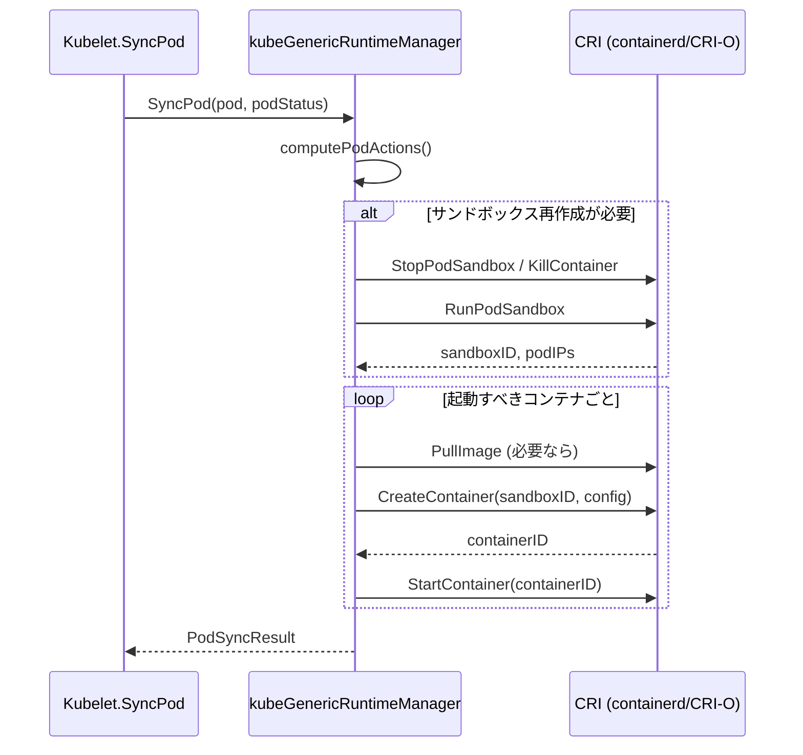

# 第13章 Pod ライフサイクルと CRI

> 本章で読むソース
>
> - [pkg/kubelet/kubelet.go L1970-L2287（Kubelet.SyncPod）](https://github.com/kubernetes/kubernetes/blob/v1.36.2/pkg/kubelet/kubelet.go#L1970-L2287)
> - [pkg/kubelet/kubelet.go L2289-L2408（Kubelet.SyncTerminatingPod）](https://github.com/kubernetes/kubernetes/blob/v1.36.2/pkg/kubelet/kubelet.go#L2289-L2408)
> - [pkg/kubelet/kubelet.go L2458-L2525（Kubelet.SyncTerminatedPod）](https://github.com/kubernetes/kubernetes/blob/v1.36.2/pkg/kubelet/kubelet.go#L2458-L2525)
> - [pkg/kubelet/kuberuntime/kuberuntime_manager.go L114-L204（kubeGenericRuntimeManager 構造体）](https://github.com/kubernetes/kubernetes/blob/v1.36.2/pkg/kubelet/kuberuntime/kuberuntime_manager.go#L114-L204)
> - [pkg/kubelet/kuberuntime/kuberuntime_manager.go L1175-L1386（computePodActions）](https://github.com/kubernetes/kubernetes/blob/v1.36.2/pkg/kubelet/kuberuntime/kuberuntime_manager.go#L1175-L1386)
> - [pkg/kubelet/kuberuntime/kuberuntime_manager.go L1450-L1796（kubeGenericRuntimeManager.SyncPod）](https://github.com/kubernetes/kubernetes/blob/v1.36.2/pkg/kubelet/kuberuntime/kuberuntime_manager.go#L1450-L1796)
> - [staging/src/k8s.io/cri-api/pkg/apis/services.go L1-L146（RuntimeService インタフェース）](https://github.com/kubernetes/kubernetes/blob/v1.36.2/staging/src/k8s.io/cri-api/pkg/apis/services.go#L1-L146)
> - [staging/src/k8s.io/cri-client/pkg/remote_runtime.go L47-L59（remoteRuntimeService 構造体）](https://github.com/kubernetes/kubernetes/blob/v1.36.2/staging/src/k8s.io/cri-client/pkg/remote_runtime.go#L47-L59)

## この章の狙い

kubelet が Pod を実際に起動・停止する仕組みを読む。Pod は3フェーズのライフサイクル（SyncPod, SyncTerminatingPod, SyncTerminatedPod）を経て完了する。各フェーズで kubelet が何を責任を持ち、コンテナランタイムとの境界（CRI）がどこにあるかを明らかにする。

## 前提

第12章で PodWorkers の状態機械と `syncLoop` の構造を理解していることを前提とする。

## Pod の3フェーズライフサイクル

kubelet の `Kubelet` 構造体は `podSyncer` インタフェースを通じて3つのメソッドを実装する。

### SyncPod: Pod の設定とコンテナ起動

`SyncPod` は Pod を実行状態に収束させるトランザクションスクリプトである。

[pkg/kubelet/kubelet.go L1970-L2019](https://github.com/kubernetes/kubernetes/blob/v1.36.2/pkg/kubelet/kubelet.go#L1970-L2019)

```go
// SyncPod is the transaction script for the sync of a single pod (setting up)
// a pod. This method is reentrant and expected to converge a pod towards the
// desired state of the spec. The reverse (teardown) is handled in
// SyncTerminatingPod and SyncTerminatedPod.
//
// The workflow is:
//   - If the pod is being created, record pod worker start latency
//   - Call generateAPIPodStatus to prepare an v1.PodStatus for the pod
//   - If the pod is being seen as running for the first time, record pod
//     start latency
//   - Update the status of the pod in the status manager
//   - Stop the pod's containers if it should not be running due to soft
//     admission
//   - Ensure any background tracking for a runnable pod is started
//   - Create a mirror pod if the pod is a static pod, and does not
//     already have a mirror pod
//   - Create the data directories for the pod if they do not exist
//   - Wait for volumes to attach/mount
//   - Fetch the pull secrets for the pod
//   - Call the container runtime's SyncPod callback
//   - Update the traffic shaping for the pod's ingress and egress limits
func (kl *Kubelet) SyncPod(ctx context.Context, updateType kubetypes.SyncPodType, pod, mirrorPod *v1.Pod, podStatus *kubecontainer.PodStatus) (isTerminal bool, postSync func(), err error) {
```

`SyncPod` の処理は以下の順序で進む。

1. Pod ステータスを生成し、`statusManager` に設定する。
2. Static Pod であればミラー Pod を作成する。
3. Pod 用のデータディレクトリを作成する。
4. `volumeManager.WaitForAttachAndMount` でボリュームの attach/mount が完了するまで待機する。
5. イメージの pull secret を取得する。
6. `kubeGenericRuntimeManager.SyncPod` を呼び、コンテナランタイムにコンテナの起動を指示する。

このメソッドは冪等（reentrant）であり、複数回呼ばれても最終的に期望状態に収束する。

### SyncTerminatingPod: コンテナの停止

Pod が削除要求を受けたとき、またはターミナルフェーズに遷移したときに呼ばれる。

[pkg/kubelet/kubelet.go L2289-L2408](https://github.com/kubernetes/kubernetes/blob/v1.36.2/pkg/kubelet/kubelet.go#L2289-L2408)

```go
func (kl *Kubelet) SyncTerminatingPod(ctx context.Context, pod *v1.Pod, podStatus *kubecontainer.PodStatus, gracePeriod *int64, podStatusFn func(*v1.PodStatus)) (err error) {
    // ... (中略) ...
    apiPodStatus := kl.generateAPIPodStatus(ctx, pod, podStatus, false)
    if podStatusFn != nil {
        podStatusFn(&apiPodStatus)
    }
    kl.statusManager.SetPodStatus(logger, pod, apiPodStatus)
    // ... (中略) ...
    kl.probeManager.StopLivenessAndStartup(pod)
    p := kubecontainer.ConvertPodStatusToRunningPod(kl.getRuntime().Type(), podStatus)
    if err := kl.killPod(ctx, pod, p, gracePeriod); err != nil {
        // ...
        return fmt.Errorf("error killing terminating pod: %w", err)
    }
    kl.probeManager.RemovePod(pod)
    // ... (中略) ...
    // NOTE: resources must be unprepared AFTER all containers have stopped
    // and BEFORE the pod status is changed on the API server
    if utilfeature.DefaultFeatureGate.Enabled(features.DynamicResourceAllocation) {
        if err := kl.UnprepareDynamicResources(ctx, pod); err != nil {
            return err
        }
    }
    apiPodStatus = kl.generateAPIPodStatus(ctx, pod, stoppedPodStatus, true)
    kl.statusManager.SetPodStatus(logger, pod, apiPodStatus)
    return nil
}
```

`SyncTerminatingPod` は以下の処理を行う。

1. Pod ステータスを生成し、プローブを停止する。
2. `killPod` を呼び、実行中の全コンテナをグレースピリオド付きで停止する。
3. 停止後にコンテナが確実にゼロであることを検証する（CRI 違反の検出）。
4. Dynamic Resource Allocation のリソースを解放する。
5. 最終的な Pod ステータスを `statusManager` に設定する。

このメソッドが成功すると、Pod には実行中のコンテナが一つも存在しないことが保証される。

### SyncTerminatedPod: リソースの解放

全コンテナ停止後に呼ばれる。ボリューム、cgroup、Secret/ConfigMap などのリソースを解放する。

[pkg/kubelet/kubelet.go L2458-L2525](https://github.com/kubernetes/kubernetes/blob/v1.36.2/pkg/kubelet/kubelet.go#L2458-L2525)

```go
func (kl *Kubelet) SyncTerminatedPod(ctx context.Context, pod *v1.Pod, podStatus *kubecontainer.PodStatus) error {
    // ... (中略) ...
    apiPodStatus := kl.generateAPIPodStatus(ctx, pod, podStatus, true)
    kl.statusManager.SetPodStatus(logger, pod, apiPodStatus)
    // volumes are unmounted after the pod worker reports ShouldPodRuntimeBeRemoved
    if err := kl.volumeManager.WaitForUnmount(ctx, pod); err != nil {
        return err
    }
    // ... (中略) ...
    if kl.secretManager != nil {
        kl.secretManager.UnregisterPod(pod)
    }
    if kl.configMapManager != nil {
        kl.configMapManager.UnregisterPod(pod)
    }
    // remove any cgroups in the hierarchy for pods that are no longer running.
    if kl.cgroupsPerQOS {
        pcm := kl.containerManager.NewPodContainerManager()
        name, _ := pcm.GetPodContainerName(pod)
        if err := pcm.Destroy(logger, name); err != nil {
            return err
        }
    }
    kl.usernsManager.Release(logger, pod.UID)
    kl.statusManager.TerminatePod(logger, pod)
    return nil
}
```

`SyncTerminatedPod` は以下のリソースを解放する。

- ボリュームの unmount（`volumeManager.WaitForUnmount`）
- Secret/ConfigMap の登録解除
- cgroup の削除（`containerManager.NewPodContainerManager().Destroy`）
- User namespace の解放

## CRI（Container Runtime Interface）の概要

CRI は kubelet とコンテナランタイム（containerd、CRI-O など）の間の抽象化レイヤである。gRPC プロトコルで通信し、kubelet がランタイムの実装に依存せずに済むようにする。

### RuntimeService インタフェース

CRI の中心は `RuntimeService` インタフェースである。

[staging/src/k8s.io/cri-api/pkg/apis/services.go L114-L128](https://github.com/kubernetes/kubernetes/blob/v1.36.2/staging/src/k8s.io/cri-api/pkg/apis/services.go#L114-L128)

```go
// RuntimeService interface should be implemented by a container runtime.
// The methods should be thread-safe.
type RuntimeService interface {
    RuntimeVersioner
    ContainerManager
    PodSandboxManager
    ContainerStatsManager

    UpdateRuntimeConfig(ctx context.Context, runtimeConfig *runtimeapi.RuntimeConfig) error
    Status(ctx context.Context, verbose bool) (*runtimeapi.StatusResponse, error)
    RuntimeConfig(ctx context.Context) (*runtimeapi.RuntimeConfigResponse, error)
    Close(ctx context.Context) error
}
```

`RuntimeService` は4つのサブインタフェースを合成する。

- **RuntimeVersioner**: ランタイムのバージョン情報を取得する。
- **ContainerManager**: コンテナの作成・開始・停止・削除・一覧取得・ステータス取得を行う。
- **PodSandboxManager**: Pod レベルのサンドボックスの作成・停止・削除を行う。
- **ContainerStatsManager**: コンテナと Pod の統計情報を取得する。

### PodSandbox と Container の2層モデル

CRI は Pod を「PodSandbox」と「Container」の2層でモデル化する。

[staging/src/k8s.io/cri-api/pkg/apis/services.go L69-L91](https://github.com/kubernetes/kubernetes/blob/v1.36.2/staging/src/k8s.io/cri-api/pkg/apis/services.go#L69-L91)

```go
type PodSandboxManager interface {
    RunPodSandbox(ctx context.Context, config *runtimeapi.PodSandboxConfig, runtimeHandler string) (string, error)
    StopPodSandbox(ctx context.Context, podSandboxID string) error
    RemovePodSandbox(ctx context.Context, podSandboxID string) error
    PodSandboxStatus(ctx context.Context, podSandboxID string, verbose bool) (*runtimeapi.PodSandboxStatusResponse, error)
    ListPodSandbox(ctx context.Context, filter *runtimeapi.PodSandboxFilter) ([]*runtimeapi.PodSandbox, error)
    PortForward(ctx context.Context, request *runtimeapi.PortForwardRequest) (*runtimeapi.PortForwardResponse, error)
    UpdatePodSandboxResources(ctx context.Context, request *runtimeapi.UpdatePodSandboxResourcesRequest) (*runtimeapi.UpdatePodSandboxResourcesResponse, error)
}
```

PodSandbox は Pod の名前空間（ネットワーク名前空間など）を表現する。コンテナはこのサンドボックスに参加する形で起動される。

[staging/src/k8s.io/cri-api/pkg/apis/services.go L34-L65](https://github.com/kubernetes/kubernetes/blob/v1.36.2/staging/src/k8s.io/cri-api/pkg/apis/services.go#L34-L65)

```go
type ContainerManager interface {
    CreateContainer(ctx context.Context, podSandboxID string, config *runtimeapi.ContainerConfig, sandboxConfig *runtimeapi.PodSandboxConfig) (string, error)
    StartContainer(ctx context.Context, containerID string) error
    StopContainer(ctx context.Context, containerID string, timeout int64) error
    RemoveContainer(ctx context.Context, containerID string) error
    ListContainers(ctx context.Context, filter *runtimeapi.ContainerFilter) ([]*runtimeapi.Container, error)
    ContainerStatus(ctx context.Context, containerID string, verbose bool) (*runtimeapi.ContainerStatusResponse, error)
    // ... (中略) ...
}
```

コンテナのライフサイクルは `CreateContainer` → `StartContainer` → `StopContainer` → `RemoveContainer` の4段階である。

### remoteRuntimeService: gRPC クライアント

`remoteRuntimeService` は `RuntimeService` の gRPC 実装である。

[staging/src/k8s.io/cri-client/pkg/remote_runtime.go L47-L59](https://github.com/kubernetes/kubernetes/blob/v1.36.2/staging/src/k8s.io/cri-client/pkg/remote_runtime.go#L47-L59)

```go
// remoteRuntimeService is a gRPC implementation of internalapi.RuntimeService.
type remoteRuntimeService struct {
    timeout       time.Duration
    runtimeClient runtimeapi.RuntimeServiceClient
    logReduction *logreduction.LogReduction
    conn         *grpc.ClientConn
    useStreaming atomic.Bool
}
```

Unix ドメインソケット経由でコンテナランタイムと通信する。`useStreaming` は一覧操作にストリーミング RPC を使うかどうかを示す。

## kubeGenericRuntimeManager による CRI 抽象化

`kubeGenericRuntimeManager` は kubelet 内部の構造体で、CRI を通じてコンテナランタイムを操作する。

[pkg/kubelet/kuberuntime/kuberuntime_manager.go L114-L204](https://github.com/kubernetes/kubernetes/blob/v1.36.2/pkg/kubelet/kuberuntime/kuberuntime_manager.go#L114-L204)

```go
type kubeGenericRuntimeManager struct {
    runtimeName string
    recorder    record.EventRecorderLogger
    osInterface kubecontainer.OSInterface
    machineInfo *cadvisorapi.MachineInfo
    containerGC *containerGC
    runner kubecontainer.HandlerRunner
    runtimeHelper kubecontainer.RuntimeHelper
    livenessManager  proberesults.Manager
    readinessManager proberesults.Manager
    startupManager   proberesults.Manager
    // ... (中略) ...
    runtimeService internalapi.RuntimeService
    imageService   internalapi.ImageManagerService
    versionCache *cache.ObjectCache
    containerManager cm.ContainerManager
    internalLifecycle cm.InternalContainerLifecycle
    logManager logs.ContainerLogManager
    runtimeClassManager *runtimeclass.Manager
    // ... (中略) ...
}
```

この構造体が `runtimeService` と `imageService` を通じて CRI を呼び出す。kubelet の `Kubelet` 構造体も `runtimeService` を保持し、ログ管理、EventedPLEG、ContainerManager、CRI stats など複数の構成要素に直接渡している。

## computePodActions による差分計算

`computePodActions` は Pod の現在状態と期望状態を比較し、実行すべきアクションの集合を計算する。

[pkg/kubelet/kuberuntime/kuberuntime_manager.go L1175-L1264](https://github.com/kubernetes/kubernetes/blob/v1.36.2/pkg/kubelet/kuberuntime/kuberuntime_manager.go#L1175-L1264)

```go
func (m *kubeGenericRuntimeManager) computePodActions(ctx context.Context, pod *v1.Pod, podStatus *kubecontainer.PodStatus, restartAllContainers bool) podActions {
    createPodSandbox, attempt, sandboxID := runtimeutil.PodSandboxChanged(pod, podStatus)
    changes := podActions{
        KillPod:           createPodSandbox,
        CreateSandbox:     createPodSandbox,
        SandboxID:         sandboxID,
        Attempt:           attempt,
        ContainersToStart: []int{},
        ContainersToKill:  make(map[kubecontainer.ContainerID]containerToKillInfo),
    }
    // ... (中略) ...
    if createPodSandbox {
        // ... (中略) ...
        if len(pod.Spec.InitContainers) != 0 {
            changes.InitContainersToStart = []int{0}
            return changes
        }
        changes.ContainersToStart = containersToStart
        return changes
    }
    // ... (中略) ...
}
```

`computePodActions` は以下の判定を行う。

1. **サンドボックスの再作成が必要か**: `PodSandboxChanged` でサンドボックスの状態変化を検出する。再作成が必要であれば既存のコンテナをすべて kill する。
2. **Init コンテナの起動**: サンドボックスを新規作成する場合、Init コンテナがあれば最初の1つだけを起動対象とする。
3. **通常コンテナの起動/kill**: 各コンテナについて、存在しない場合は起動が必要かを判定する。実行中のコンテナは、仕様変更・ライブネスプローブ失敗・スタートアッププローブ失敗の場合に kill 対象となる。

[pkg/kubelet/kuberuntime/kuberuntime_manager.go L1293-L1374](https://github.com/kubernetes/kubernetes/blob/v1.36.2/pkg/kubelet/kuberuntime/kuberuntime_manager.go#L1293-L1374)

```go
for idx, container := range pod.Spec.Containers {
    containerStatus := podStatus.FindContainerStatusByName(container.Name)
    // ... (中略) ...
    if containerStatus == nil || containerStatus.State != kubecontainer.ContainerStateRunning {
        if kubecontainer.ShouldContainerBeRestarted(logger, &container, pod, podStatus) {
            changes.ContainersToStart = append(changes.ContainersToStart, idx)
            // ... (中略) ...
        }
        continue
    }
    // The container is running, but kill the container if any of the following condition is met.
    if _, _, changed := containerChanged(&container, containerStatus); changed {
        message = fmt.Sprintf("Container %s definition changed", container.Name)
        restart = true
    } else if liveness, found := m.livenessManager.Get(containerStatus.ID); found && liveness == proberesults.Failure {
        message = fmt.Sprintf("Container %s failed liveness probe", container.Name)
    }
    // ... (中略) ...
}
```

この差分計算により、kubelet は毎回ゼロから Pod を構築するのではなく、現在状態から期望状態への最小限の操作だけを決定する。

## SyncPod の実行フロー（kuberuntime レベル）

`kubeGenericRuntimeManager.SyncPod` は `computePodActions` の結果に基づいて実際の CRI 呼び出しを行う。

[pkg/kubelet/kuberuntime/kuberuntime_manager.go L1439-L1450](https://github.com/kubernetes/kubernetes/blob/v1.36.2/pkg/kubelet/kuberuntime/kuberuntime_manager.go#L1439-L1450)

```go
// SyncPod syncs the running pod into the desired pod by executing following steps:
//
//  1. Compute sandbox and container changes.
//  2. Kill pod sandbox if necessary.
//  3. Kill any containers that should not be running.
//  4. Create sandbox if necessary.
//  5. Invoke OnPodSandboxReady to notify Kubelet to update pod status.
//  6. Create ephemeral containers.
//  7. Create init containers.
//  8. Resize running containers (if InPlacePodVerticalScaling==true)
//  9. Create normal containers.
func (m *kubeGenericRuntimeManager) SyncPod(ctx context.Context, pod *v1.Pod, podStatus *kubecontainer.PodStatus, pullSecrets []v1.Secret, backOff *flowcontrol.Backoff, restartAllContainers bool) (result kubecontainer.PodSyncResult) {
```

処理は9つのステップで構成される。

1. `computePodActions` で差分を計算する。
2. サンドボックスの変更が必要であれば既存 Pod を kill する。
3. 起動すべきでないコンテナを kill する。
4. 必要に応じて新しい PodSandbox を作成する（`RunPodSandbox` CRI 呼び出し）。
5. サンドボックスの準備完了を kubelet に通知する。
6. Ephemeral コンテナを起動する。
7. Init コンテナを順に起動する。
8. In-place リサイズが必要なコンテナのリソースを更新する。
9. 通常コンテナを起動する。



### 最適化: Exponential Backoff によるコンテナ再起動の制御

`SyncPod` 内の `start` 関数は `doBackOff` を呼び、コンテナの連続再起動に指数バックオフを適用する。

[pkg/kubelet/kuberuntime/kuberuntime_manager.go L1687-L1696](https://github.com/kubernetes/kubernetes/blob/v1.36.2/pkg/kubelet/kuberuntime/kuberuntime_manager.go#L1687-L1696)

```go
start := func(ctx context.Context, typeName, metricLabel string, spec *startSpec) error {
    startContainerResult := kubecontainer.NewSyncResult(kubecontainer.StartContainer, spec.container.Name)
    result.AddSyncResult(startContainerResult)
    isInBackOff, msg, err := m.doBackOff(ctx, pod, spec.container, podStatus, backOff)
    if isInBackOff {
        startContainerResult.Fail(err, msg)
        logger.V(4).Info("Backing Off restarting container in pod", "containerType", typeName, "container", spec.container.Name, "pod", klog.KObj(pod))
        return err
    }
    // ... (中略) ...
}
```

コンテナが繰り返しクラッシュする場合、即座に再起動するのではなくバックオフ期間を設ける。これにより、ランタイムへの負荷を抑制しつつ、ログのスパムを防ぐ。バックオフは `flowcontrol.Backoff` で管理され、成功時にリセットされる。

## まとめ

Pod のライフサイクルは3フェーズで構成される。

1. **SyncPod**: `computePodActions` で差分を計算し、CRI 経由でサンドボックスとコンテナを起動する。冪等な処理で、呼び出されるたびに期望状態に収束する。
2. **SyncTerminatingPod**: 全コンテナをグレースピリオド付きで停止し、CRI 違反がないことを検証する。
3. **SyncTerminatedPod**: ボリューム、cgroup、Secret/ConfigMap などのリソースを解放する。

CRI は gRPC ベースの抽象化レイヤであり、kubelet は `kubeGenericRuntimeManager` を主要な経路としてコンテナランタイムと通信する。これにより containerd や CRI-O など異なるランタイムを同一のコードで扱える。

## 関連する章

- [第12章 kubelet のアーキテクチャとメインループ](12-kubelet-architecture.md): PodWorkers が SyncPod を呼び出すまでの流れ。
- [第14章 ボリューム管理とリソース管理](14-volume-and-resource-management.md): SyncTerminatedPod が解放するボリュームと cgroup の管理機構。
