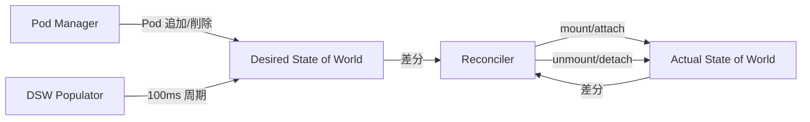

# 第14章 ボリューム管理とリソース管理

> 本章で読むソース
>
> - [pkg/kubelet/volumemanager/volume_manager.go L94-L284（VolumeManager インタフェースと volumeManager 構造体）](https://github.com/kubernetes/kubernetes/blob/v1.36.2/pkg/kubelet/volumemanager/volume_manager.go#L94-L284)
> - [pkg/kubelet/volumemanager/volume_manager.go L298-L317（Run メソッド）](https://github.com/kubernetes/kubernetes/blob/v1.36.2/pkg/kubelet/volumemanager/volume_manager.go#L298-L317)
> - [pkg/kubelet/volumemanager/cache/desired_state_of_world.go L45-L80（DesiredStateOfWorld インタフェース）](https://github.com/kubernetes/kubernetes/blob/v1.36.2/pkg/kubelet/volumemanager/cache/desired_state_of_world.go#L45-L80)
> - [pkg/kubelet/volumemanager/cache/actual_state_of_world.go L40-L80（ActualStateOfWorld インタフェース）](https://github.com/kubernetes/kubernetes/blob/v1.36.2/pkg/kubelet/volumemanager/cache/actual_state_of_world.go#L40-L80)
> - [pkg/kubelet/volumemanager/reconciler/reconciler.go L26-L69（reconciler の Run と reconcile）](https://github.com/kubernetes/kubernetes/blob/v1.36.2/pkg/kubelet/volumemanager/reconciler/reconciler.go#L26-L69)
> - [pkg/kubelet/volumemanager/reconciler/reconciler_common.go L126-L192（reconciler 構造体と unmountVolumes/mountOrAttachVolumes）](https://github.com/kubernetes/kubernetes/blob/v1.36.2/pkg/kubelet/volumemanager/reconciler/reconciler_common.go#L126-L192)
> - [pkg/kubelet/volumemanager/populator/desired_state_of_world_populator.go L123-L176（desiredStateOfWorldPopulator）](https://github.com/kubernetes/kubernetes/blob/v1.36.2/pkg/kubelet/volumemanager/populator/desired_state_of_world_populator.go#L123-L176)
> - [pkg/kubelet/cm/container_manager_linux.go L102-L142（containerManagerImpl 構造体）](https://github.com/kubernetes/kubernetes/blob/v1.36.2/pkg/kubelet/cm/container_manager_linux.go#L102-L142)
> - [pkg/kubelet/cm/container_manager_linux.go L640-L735（Start メソッド）](https://github.com/kubernetes/kubernetes/blob/v1.36.2/pkg/kubelet/cm/container_manager_linux.go#L640-L735)
> - [pkg/kubelet/cm/qos_container_manager_linux.go L50-L153（QOSContainerManager）](https://github.com/kubernetes/kubernetes/blob/v1.36.2/pkg/kubelet/cm/qos_container_manager_linux.go#L50-L153)

## この章の狙い

kubelet が Pod のボリュームをどのように管理し、ノードのリソース（cgroup、CPU、メモリ）をどのように割り当てるかを読む。VolumeManager の Desired/Actual State と Reconciler の仕組み、そして ContainerManager による cgroup 階層と QoS クラス別のリソース管理を理解する。

## 前提

第12章で kubelet のメインループと PodWorkers の構造を理解していること。第13章で `SyncPod` が `volumeManager.WaitForAttachAndMount` を呼ぶこと、`SyncTerminatedPod` が `volumeManager.WaitForUnmount` を呼ぶことを確認していること。

## VolumeManager の全体像

`VolumeManager` は Pod が参照するボリュームの attach/mount/unmount/detach を管理する。

[pkg/kubelet/volumemanager/volume_manager.go L94-L97](https://github.com/kubernetes/kubernetes/blob/v1.36.2/pkg/kubelet/volumemanager/volume_manager.go#L94-L97)

```go
// VolumeManager runs a set of asynchronous loops that figure out which volumes
// need to be attached/mounted/unmounted/detached based on the pods scheduled on
// this node and makes it so.
type VolumeManager interface {
```

`volumeManager` 構造体は2つの状態キャッシュと、それらを調整する2つの非同期ループを持つ。

[pkg/kubelet/volumemanager/volume_manager.go L242-L284](https://github.com/kubernetes/kubernetes/blob/v1.36.2/pkg/kubelet/volumemanager/volume_manager.go#L242-L284)

```go
type volumeManager struct {
    kubeClient clientset.Interface
    volumePluginMgr *volume.VolumePluginMgr
    // desiredStateOfWorld is a data structure containing the desired state of
    // the world according to the volume manager: i.e. what volumes should be
    // attached and which pods are referencing the volumes).
    desiredStateOfWorld cache.DesiredStateOfWorld
    // actualStateOfWorld is a data structure containing the actual state of
    // the world according to the manager: i.e. which volumes are attached to
    // this node and what pods the volumes are mounted to.
    actualStateOfWorld cache.ActualStateOfWorld
    operationExecutor operationexecutor.OperationExecutor
    reconciler reconciler.Reconciler
    desiredStateOfWorldPopulator populator.DesiredStateOfWorldPopulator
    // ... (中略) ...
}
```

### Desired State of World と Actual State of World

VolumeManager の設計は Desired State of World（DSW）と Actual State of World（ASW）の2つのキャッシュを中心に構成される。

**DesiredStateOfWorld** は「どのボリュームがどの Pod にマウントされるべきか」を保持する。

[pkg/kubelet/volumemanager/cache/desired_state_of_world.go L45-L53](https://github.com/kubernetes/kubernetes/blob/v1.36.2/pkg/kubelet/volumemanager/cache/desired_state_of_world.go#L45-L53)

```go
// DesiredStateOfWorld defines a set of thread-safe operations for the kubelet
// volume manager's desired state of the world cache.
// This cache contains volumes->pods i.e. a set of all volumes that should be
// attached to this node and the pods that reference them and should mount the
// volume.
// Note: This is distinct from the DesiredStateOfWorld implemented by the
// attach/detach controller. They both keep track of different objects. This
// contains kubelet volume manager specific state.
type DesiredStateOfWorld interface {
```

**ActualStateOfWorld** は「どのボリュームが実際にどの Pod にマウントされているか」を保持する。

[pkg/kubelet/volumemanager/cache/actual_state_of_world.go L40-L64](https://github.com/kubernetes/kubernetes/blob/v1.36.2/pkg/kubelet/volumemanager/cache/actual_state_of_world.go#L40-L64)

```go
// ActualStateOfWorld defines a set of thread-safe operations for the kubelet
// volume manager's actual state of the world cache.
// This cache contains volumes->pods i.e. a set of all volumes attached to this
// node and the pods that the manager believes have successfully mounted the
// volume.
// Note: This is distinct from the ActualStateOfWorld implemented by the
// attach/detach controller. They both keep track of different objects. This
// contains kubelet volume manager specific state.
type ActualStateOfWorld interface {
	// ActualStateOfWorld must implement the methods required to allow
	// operationexecutor to interact with it.
	operationexecutor.ActualStateOfWorldMounterUpdater

	// ActualStateOfWorld must implement the methods required to allow
	// operationexecutor to interact with it.
	operationexecutor.ActualStateOfWorldAttacherUpdater

	// AddPodToVolume adds the given pod to the given volume in the cache
	// indicating the specified volume has been successfully mounted to the
	// specified pod.
	// If a pod with the same unique name already exists under the specified
	// volume, reset the pod's remountRequired value.
	// If a volume with the name volumeName does not exist in the list of
	// attached volumes, an error is returned.
	AddPodToVolume(operationexecutor.MarkVolumeOpts) error
	// ... (中略) ...
}
```

DSW は `desiredStateOfWorldPopulator` が Pod マネージャから読み取って更新し、ASW は Reconciler が attach/mount 操作を完了したときに更新する。

### 3つの非同期ループ

VolumeManager の `Run` メソッドは2つの非同期ループを起動する。

[pkg/kubelet/volumemanager/volume_manager.go L298-L317](https://github.com/kubernetes/kubernetes/blob/v1.36.2/pkg/kubelet/volumemanager/volume_manager.go#L298-L317)

```go
func (vm *volumeManager) Run(ctx context.Context, sourcesReady config.SourcesReady) {
    logger := klog.FromContext(ctx)
    defer runtime.HandleCrashWithContext(ctx)
    if vm.kubeClient != nil {
        go vm.volumePluginMgr.Run(ctx.Done())
    }
    go vm.desiredStateOfWorldPopulator.Run(ctx, sourcesReady)
    logger.V(2).Info("The desired_state_of_world populator starts")
    logger.Info("Starting Kubelet Volume Manager")
    go vm.reconciler.Run(ctx, ctx.Done())
    metrics.Register(vm.actualStateOfWorld, vm.desiredStateOfWorld, vm.volumePluginMgr)
    <-ctx.Done()
    logger.Info("Shutting down Kubelet Volume Manager")
}
```

1. **desiredStateOfWorldPopulator**: 100ミリ秒ごとに Pod マネージャを走査し、DSW に Pod とボリュームの対応を追加・削除する。
2. **reconciler**: 100ミリ秒ごとに DSW と ASW を比較し、差分を埋める attach/mount/unmount/detach 操作を実行する。

### Reconciler の調整ロジック

Reconciler の `reconcile` メソッドは DSW と ASW の差分を埋める。

[pkg/kubelet/volumemanager/reconciler/reconciler.go L33-L69](https://github.com/kubernetes/kubernetes/blob/v1.36.2/pkg/kubelet/volumemanager/reconciler/reconciler.go#L33-L69)

```go
func (rc *reconciler) reconcile(ctx context.Context) {
    logger := klog.FromContext(ctx)
    readyToUnmount := rc.readyToUnmount()
    if readyToUnmount {
        // Unmounts are triggered before mounts so that a volume that was
        // referenced by a pod that was deleted and is now referenced by another
        // pod is unmounted from the first pod before being mounted to the new
        // pod.
        rc.unmountVolumes(logger)
    }
    // Next we mount required volumes. This function could also trigger
    // attach if kubelet is responsible for attaching volumes.
    rc.mountOrAttachVolumes(logger)
    if readyToUnmount {
        rc.unmountDetachDevices(logger)
        rc.cleanOrphanVolumes(logger)
    }
    // ... (中略) ...
}
```

Reconciler は以下の順序で処理を行う。

1. **unmountVolumes**: DSW から削除された Pod のボリュームを unmount する。unmount が先に行われるのは、あるボリュームが削除された Pod から新しい Pod に受け渡される場合に、先に unmount を完了させてから新しい Pod に mount するためである。
2. **mountOrAttachVolumes**: DSW に存在するが ASW にまだ mount されていないボリュームを attach/mount する。
3. **unmountDetachDevices**: ASW に存在するが DSW に存在しないデバイスを detach する。



### 最適化: unmount を優先する設計

Reconciler が unmount を mount より先に処理するのは意図的な設計である。コメントに「a volume that was referenced by a pod that was deleted and is now referenced by another pod is unmounted from the first pod before being mounted to the new pod」とある。これにより、同じボリュームが異なる Pod で使われる場合の競合を防ぐ。

## ContainerManager による cgroup 管理

`containerManagerImpl` はノード全体のリソース管理を統括する。

[pkg/kubelet/cm/container_manager_linux.go L102-L142](https://github.com/kubernetes/kubernetes/blob/v1.36.2/pkg/kubelet/cm/container_manager_linux.go#L102-L142)

```go
type containerManagerImpl struct {
    sync.RWMutex
    cadvisorInterface cadvisor.Interface
    mountUtil         mount.Interface
    NodeConfig
    status Status
    systemContainers []*systemContainer
    periodicTasks []func()
    subsystems *CgroupSubsystems
    nodeInfo   *v1.Node
    cgroupManager CgroupManager
    capacity v1.ResourceList
    internalCapacity v1.ResourceList
    cgroupRoot CgroupName
    recorder record.EventRecorder
    qosContainerManager QOSContainerManager
    deviceManager devicemanager.Manager
    cpuManager cpumanager.Manager
    memoryManager memorymanager.Manager
    topologyManager topologymanager.Manager
    draManager *dra.Manager
    kubeClient clientset.Interface
    resourceUpdates chan resourceupdates.Update
}
```

`containerManagerImpl` は以下のサブマネージャを統括する。

- **QOSContainerManager**: QoS クラス別の cgroup 階層を管理する。
- **cpumanager.Manager**: CPU ピンニング（CPU affinity）を管理する。
- **memorymanager.Manager**: メモリの NUMA ノード割り当てを管理する。
- **topologymanager.Manager**: CPU/メモリ/デバイスのトポロジ整合性を調整する。
- **devicemanager.Manager**: デバイスプラグイン経由で報告されたデバイスの割り当てを管理する。

### Start による初期化

`Start` メソッドは各サブマネージャを初期化する。

[pkg/kubelet/cm/container_manager_linux.go L640-L735](https://github.com/kubernetes/kubernetes/blob/v1.36.2/pkg/kubelet/cm/container_manager_linux.go#L640-L735)

```go
func (cm *containerManagerImpl) Start(ctx context.Context, node *v1.Node,
    activePods ActivePodsFunc,
    getNode GetNodeFunc,
    sourcesReady config.SourcesReady,
    podStatusProvider status.PodStatusProvider,
    runtimeService internalapi.RuntimeService,
    localStorageCapacityIsolation bool) error {
    // ... (中略) ...
    // Initialize CPU manager
    err := cm.cpuManager.Start(ctx, cpumanager.ActivePodsFunc(activePods), sourcesReady, podStatusProvider, runtimeService, containerMap.Clone())
    if err != nil {
        return fmt.Errorf("start cpu manager error: %w", err)
    }
    // Initialize memory manager
    err = cm.memoryManager.Start(ctx, memorymanager.ActivePodsFunc(activePods), sourcesReady, podStatusProvider, runtimeService, containerMap.Clone())
    if err != nil {
        return fmt.Errorf("start memory manager error: %w", err)
    }
    // ... (中略) ...
    // Starts device manager.
    if err := cm.deviceManager.Start(klog.FromContext(ctx), devicemanager.ActivePodsFunc(activePods), sourcesReady, containerMap.Clone(), containerRunningSet); err != nil {
        return err
    }
    return nil
}
```

起動順序は DRA → CPU Manager → Memory Manager → Device Manager である。各マネージャは既存のコンテナの状態を復元し、Pod の再スケジューリング時に正しいリソース割り当てを維持する。

## QoS クラス別の cgroup 階層

kubelet は Pod の QoS クラス（Guaranteed, Burstable, BestEffort）に応じて cgroup 階層を構築する。

[pkg/kubelet/cm/qos_container_manager_linux.go L88-L153](https://github.com/kubernetes/kubernetes/blob/v1.36.2/pkg/kubelet/cm/qos_container_manager_linux.go#L88-L153)

```go
func (m *qosContainerManagerImpl) Start(ctx context.Context, getNodeAllocatable func() v1.ResourceList, activePods ActivePodsFunc) error {
    // ... (中略) ...
    // Top level for Qos containers are created only for Burstable
    // and Best Effort classes
    qosClasses := map[v1.PodQOSClass]CgroupName{
        v1.PodQOSBurstable:  NewCgroupName(rootContainer, strings.ToLower(string(v1.PodQOSBurstable))),
        v1.PodQOSBestEffort: NewCgroupName(rootContainer, strings.ToLower(string(v1.PodQOSBestEffort))),
    }
    // Create containers for both qos classes
    for qosClass, containerName := range qosClasses {
        resourceParameters := &ResourceConfig{}
        if qosClass == v1.PodQOSBestEffort {
            minShares := uint64(MinShares)
            resourceParameters.CPUShares = &minShares
        }
        containerConfig := &CgroupConfig{
            Name:               containerName,
            ResourceParameters: resourceParameters,
        }
        // ... (中略) ...
    }
    m.qosContainersInfo = QOSContainersInfo{
        Guaranteed: rootContainer,
        Burstable:  qosClasses[v1.PodQOSBurstable],
        BestEffort: qosClasses[v1.PodQOSBestEffort],
    }
    // ... (中略) ...
    go wait.Until(func() {
        err := m.UpdateCgroups(logger)
        if err != nil {
            logger.Info("Failed to reserve QoS requests", "err", err)
        }
    }, periodicQOSCgroupUpdateInterval, wait.NeverStop)
    return nil
}
```

cgroup 階層は以下の構造を持つ。

```text
<kubelet-cgroup-root>/
  kubepods/                  (Guaranteed Pod 用)
  kubepods/burstable/        (Burstable Pod 用)
  kubepods/besteffort/       (BestEffort Pod 用)
```

- **Guaranteed**: `requests == limits` の Pod。ルート cgroup 直下に配置される。
- **Burstable**: `requests < limits` または一部のリソースのみ requests を持つ Pod。`burstable/` 以下に配置される。
- **BestEffort**: requests も limits も設定されていない Pod。`besteffort/` 以下に配置され、CPU シェアは最小値（2）に設定される。

`UpdateCgroups` は定期的に各 QoS 階層の CPU シェアとメモリ予約を再計算する。Burstable 階層の CPU シェアは現在動作している Burstable Pod の CPU リクエストの合計に基づいて動的に計算される。

### CPU とメモリの割り当て

CPU Manager と Memory Manager は Pod のトポロジアロケーションを管理する。

CPU Manager は `static` ポリシーの場合、Guaranteed Pod に対して特定の CPU コアを専用に割り当てる（CPU ピンニング）。Memory Manager は同様に NUMA ノード単位のメモリ割り当てを管理する。

TopologyManager は CPU Manager、Memory Manager、Device Manager からのヒントを集約し、すべてのリソースが同じ NUMA ノードに配置されるように調整する。これにより NUMA ノードを跨ぐアクセスによるパフォーマンス劣化を防ぐ。

### 最適化: CFS クォータによる CPU ハードキャッピング

`validateSystemRequirements` は cgroup v1 で `cpu.cfs_quota_us` と `cpu.cfs_period_us` の存在を確認する。

[pkg/kubelet/cm/container_manager_linux.go L153-L204](https://github.com/kubernetes/kubernetes/blob/v1.36.2/pkg/kubelet/cm/container_manager_linux.go#L153-L204)

```go
func validateSystemRequirements(logger klog.Logger, mountUtil mount.Interface) (features, error) {
    // ... (中略) ...
    if cgroups.IsCgroup2UnifiedMode() {
        f.cpuHardcapping = true
        return f, nil
    }
    expectedCgroups := sets.New("cpu", "cpuacct", "cpuset", "memory")
    // ... (中略) ...
    periodExists, err := utilpath.Exists(utilpath.CheckFollowSymlink, path.Join(cpuMountPoint, "cpu.cfs_period_us"))
    // ... (中略) ...
    quotaExists, err := utilpath.Exists(utilpath.CheckFollowSymlink, path.Join(cpuMountPoint, "cpu.cfs_quota_us"))
    // ... (中略) ...
    if quotaExists && periodExists {
        f.cpuHardcapping = true
    }
    return f, nil
}
```

cgroup v2 では常にハードキャッピングが有効となる。cgroup v1 では CFS クォータが利用可能な場合にのみ `cpuHardcapping` が有効になる。これが有効であれば kubelet はコンテナの CPU リミットを `cpu.cfs_quota_us` で強制できる。無効な場合は CPU シェア（`cpu.shares`）によるソフトな制限にフォールバックする。

## まとめ

kubelet のリソース管理は2つの独立したシステムで構成される。

**VolumeManager** は Desired/Actual State の差分調整（reconciliation）パターンでボリュームのライフサイクルを管理する。Populator が DSW を更新し、Reconciler が DSW と ASW の差分を埋める attach/mount/unmount/detach 操作を非同期に実行する。

**ContainerManager** は cgroup 階層を QoS クラスごとに構築し、CPU Manager、Memory Manager、TopologyManager、Device Manager が協調して Pod のリソース割り当てを管理する。TopologyManager は NUMA トポロジの整合性を保証し、クロス NUMA アクセスによるパフォーマンス劣化を防ぐ。

## 関連する章

- [第12章 kubelet のアーキテクチャとメインループ](12-kubelet-architecture.md): VolumeManager が `Run` で起動される流れ。
- [第13章 Pod ライフサイクルと CRI](13-pod-lifecycle-and-cri.md): `SyncPod` が `WaitForAttachAndMount` を呼び、`SyncTerminatedPod` が `WaitForUnmount` を呼ぶ流れ。
- [第6部 ストレージ](../part06-storage/17-pv-pvc-and-attach-detach.md): PV/PVC の管理と Attach/Detach コントローラ。
