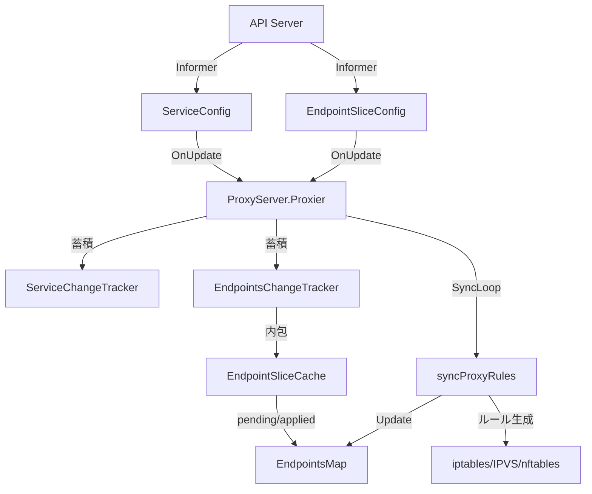

# 第15章 kube-proxy のアーキテクチャ

> 本章で読むソース
>
> - [cmd/kube-proxy/app/server.go L1-L703](https://github.com/kubernetes/kubernetes/blob/v1.36.2/cmd/kube-proxy/app/server.go#L1-L703)
> - [cmd/kube-proxy/app/server_linux.go L129-L298](https://github.com/kubernetes/kubernetes/blob/v1.36.2/cmd/kube-proxy/app/server_linux.go#L129-L298)
> - [pkg/proxy/types.go L1-L65](https://github.com/kubernetes/kubernetes/blob/v1.36.2/pkg/proxy/types.go#L1-L65)
> - [pkg/proxy/endpointslicecache.go L1-L344](https://github.com/kubernetes/kubernetes/blob/v1.36.2/pkg/proxy/endpointslicecache.go#L1-L344)
> - [pkg/proxy/endpointschangetracker.go L1-L291](https://github.com/kubernetes/kubernetes/blob/v1.36.2/pkg/proxy/endpointschangetracker.go#L1-L291)

## この章の狙い

kube-proxy は全ノードで動作し、Service オブジェクトの ClusterIP 宛のトラフィックをバックエンドの Pod へ転送する。
本章では `ProxyServer` の初期化流程、プロキシモードの選択、そして EndpointSlice の変更追跡機構を読む。
第16章で各モード（iptables・IPVS・nftables）のルール生成の詳細に入る。

## 前提

- Service と EndpointSlice の API リソース（第1部参照）
- Linux の netfilter フレームワークの概要

## ProxyServer 構造体

`ProxyServer` は kube-proxy プロセス全体を表現する。

[cmd/kube-proxy/app/server.go L161-L180](https://github.com/kubernetes/kubernetes/blob/v1.36.2/cmd/kube-proxy/app/server.go#L161-L180)

```go
type ProxyServer struct {
    Config *kubeproxyconfig.KubeProxyConfiguration

    Client          clientset.Interface
    Broadcaster     events.EventBroadcaster
    Recorder        events.EventRecorder
    NodeRef         *v1.ObjectReference
    HealthzServer   *healthcheck.ProxyHealthServer
    NodeName        string
    PrimaryIPFamily v1.IPFamily
    NodeIPs         map[v1.IPFamily]net.IP
    flagz           flagz.Reader

    podCIDRs    []string // only used for LocalModeNodeCIDR
    NodeManager *proxy.NodeManager

    Proxier proxy.Provider
}
```

`Config` はコマンドラインフラグや設定ファイルから読み込んだ `KubeProxyConfiguration` を保持する。
`Proxier` は `proxy.Provider` インターフェースの実体であり、選択されたプロキシモード（iptables・IPVS・nftables）に応じたルール生成を担当する。

## Provider インターフェース

`proxy.Provider` はすべての Proxier 実装が満たすべき契約である。

[pkg/proxy/types.go L27-L40](https://github.com/kubernetes/kubernetes/blob/v1.36.2/pkg/proxy/types.go#L27-L40)

```go
// Provider is the interface provided by proxier implementations.
type Provider interface {
    config.EndpointSliceHandler
    config.ServiceHandler
    config.NodeTopologyHandler
    config.ServiceCIDRHandler

    // Sync immediately synchronizes the Provider's current state to proxy rules.
    Sync()
    // SyncLoop runs periodic work.
    // This is expected to run as a goroutine or as the main loop of the app.
    // It does not return.
    SyncLoop()
}
```

`config.EndpointSliceHandler` と `config.ServiceHandler` は Informer からイベントを受け取るためのハンドラである。
`Sync()` は蓄積された変更を即座にルールへ反映する。
`SyncLoop()` は定期的に同期を実行するゴルーチンとして動作する。

## newProxyServer による初期化

`newProxyServer` は `ProxyServer` の各フィールドを構築する。

[cmd/kube-proxy/app/server.go L182-L293](https://github.com/kubernetes/kubernetes/blob/v1.36.2/cmd/kube-proxy/app/server.go#L182-L293)

```go
func newProxyServer(ctx context.Context, config *kubeproxyconfig.KubeProxyConfiguration, master string, initOnly bool, flagzReader flagz.Reader) (*ProxyServer, error) {
    // ...
    s.NodeName, err = nodeutil.GetHostname(config.HostnameOverride)
    // ...
    s.Client, err = createClient(ctx, config.ClientConnection, master)
    // ...
    s.NodeManager, err = proxy.NewNodeManager(ctx, s.Client, s.Config.ConfigSyncPeriod.Duration,
        s.NodeName, s.Config.DetectLocalMode == kubeproxyconfig.LocalModeNodeCIDR)
    // ...
    s.PrimaryIPFamily, s.NodeIPs = detectNodeIPs(ctx, rawNodeIPs, config.BindAddress)
    // ...
    s.Proxier, err = s.createProxier(ctx, config, dualStackSupported, initOnly)
    // ...
}
```

初期化の顺序は次のとおりである。

1. ノード名の解決（`nodeutil.GetHostname`）
2. API サーバーへのクライアント生成（`createClient`）
3. `NodeManager` の作成（Node Informer の管理）
4. ノード IP とプライマリ IP ファミリの検出（`detectNodeIPs`）
5. IP ファミリのサポート状況確認（`platformCheckSupported`）
6. `createProxier` による Proxier の生成

`detectNodeIPs` は `--bind-address`、Node オブジェクトのアドレス、フォールバックのループバックの順序でノード IP を決定する。

[cmd/kube-proxy/app/server.go L665-L702](https://github.com/kubernetes/kubernetes/blob/v1.36.2/cmd/kube-proxy/app/server.go#L665-L702)

```go
func detectNodeIPs(ctx context.Context, rawNodeIPs []net.IP, bindAddress string) (v1.IPFamily, map[v1.IPFamily]net.IP) {
    // ...
    primaryFamily := v1.IPv4Protocol
    nodeIPs := map[v1.IPFamily]net.IP{
        v1.IPv4Protocol: net.IPv4(127, 0, 0, 1),
        v1.IPv6Protocol: net.IPv6loopback,
    }
    if len(rawNodeIPs) > 0 {
        if !netutils.IsIPv4(rawNodeIPs[0]) {
            primaryFamily = v1.IPv6Protocol
        }
        nodeIPs[primaryFamily] = rawNodeIPs[0]
        // ...
    }
    // If a bindAddress is passed, override the primary IP
    bindIP := netutils.ParseIPSloppy(bindAddress)
    if bindIP != nil && !bindIP.IsUnspecified() {
        // ...
    }
    // ...
}
```

## createProxier によるモード選択

`createProxier` はプラットフォーム固有のファイル（Linux では `server_linux.go`）に定義される。

[cmd/kube-proxy/app/server_linux.go L129-L298](https://github.com/kubernetes/kubernetes/blob/v1.36.2/cmd/kube-proxy/app/server_linux.go#L129-L298)

```go
func (s *ProxyServer) createProxier(ctx context.Context, config *proxyconfigapi.KubeProxyConfiguration, dualStack, initOnly bool) (proxy.Provider, error) {
    // ...
    if config.Mode == proxyconfigapi.ProxyModeIPTables {
        logger.Info("Using iptables Proxier")
        // ...
    } else if config.Mode == proxyconfigapi.ProxyModeIPVS {
        // ...
        logger.Info("Using ipvs Proxier")
        message := "The ipvs proxier is now deprecated and may be removed in a future release. Please use 'nftables' instead."
        logger.Error(nil, message)
        // ...
    } else if config.Mode == proxyconfigapi.ProxyModeNFTables {
        logger.Info("Using nftables Proxier")
        // ...
    }
    return proxier, nil
}
```

設定の `Mode` フィールドにもとづいて3つのモードから1つを選ぶ。
IPVS モードは非推奨であり、nftables への移行が推奨されている。
いずれのモードも、デュアルスタック対応の場合は `NewDualStackProxier` が `MetaProxier` を介して IPv4/IPv6 の2つの Proxier を束ねる。

## Run メソッド

`Run` は ProxyServer のメインループを起動する。

[cmd/kube-proxy/app/server.go L534-L646](https://github.com/kubernetes/kubernetes/blob/v1.36.2/cmd/kube-proxy/app/server.go#L534-L646)

```go
func (s *ProxyServer) Run(ctx context.Context) error {
    // ...
    serveHealthz(ctx, s.HealthzServer, healthzErrCh)
    serveMetrics(ctx, s.Config.MetricsBindAddress, s.Config.Mode, s.Config.EnableProfiling, s.flagz, metricsErrCh)
    // ...
    serviceConfig := config.NewServiceConfig(ctx, serviceInformerFactory.Core().V1().Services(), s.Config.ConfigSyncPeriod.Duration)
    serviceConfig.RegisterEventHandler(s.Proxier)
    go serviceConfig.Run(ctx.Done())

    endpointSliceConfig := config.NewEndpointSliceConfig(ctx, endpointSliceInformerFactory.Discovery().V1().EndpointSlices(), s.Config.ConfigSyncPeriod.Duration)
    endpointSliceConfig.RegisterEventHandler(s.Proxier)
    go endpointSliceConfig.Run(ctx.Done())
    // ...
    // Birth Cry after the birth is successful
    s.birthCry()

    go s.Proxier.SyncLoop()
    // ...
}
```

`Run` が行う処理は次のとおりである。

1. ヘルスチェックサーバーとメトリクスサーバーの起動
2. Service・EndpointSlice の Informer を作成し、Proxier をイベントハンドラとして登録
3. NodeTopology の Informer 登録
4. `birthCry()` による Starting イベントの発行
5. `Proxier.SyncLoop()` のゴルーチン起動

Informers はヘッドレスサービス（`clusterIP: None`）や `service.kubernetes.io/headless` ラベル付きのサービスを除外する。
これらのサービスは DNS で直接解決されるため、kube-proxy の転送ルールを必要としない。

## EndpointSliceCache

`EndpointSliceCache` は EndpointSlice の変更を一時的に蓄積し、Proxier がルールを同期する際にまとめて取り出せるようにする。

[pkg/proxy/endpointslicecache.go L34-L49](https://github.com/kubernetes/kubernetes/blob/v1.36.2/pkg/proxy/endpointslicecache.go#L34-L49)

```go
// EndpointSliceCache is used as a cache of EndpointSlice information.
type EndpointSliceCache struct {
    // lock protects trackerByServiceMap.
    lock sync.Mutex

    // trackerByServiceMap is the basis of this cache. It contains endpoint
    // slice trackers grouped by service name and endpoint slice name. The first
    // key represents a namespaced service name while the second key represents
    // an endpoint slice name. Since endpoints can move between slices, we
    // require slice specific caching to prevent endpoints being removed from
    // the cache when they may have just moved to a different slice.
    trackerByServiceMap map[types.NamespacedName]*endpointSliceTracker

    makeEndpointInfo makeEndpointFunc
    nodeName         string
}
```

キャッシュはサービスごとに `endpointSliceTracker` を保持する。
各トラッカーは `applied`（すでに Proxier に適用済み）と `pending`（まだ未適用）の2つのマップを持つ。

[pkg/proxy/endpointslicecache.go L51-L67](https://github.com/kubernetes/kubernetes/blob/v1.36.2/pkg/proxy/endpointslicecache.go#L51-L67)

```go
// endpointSliceTracker keeps track of EndpointSlices as they have been applied
// by a proxier along with any pending EndpointSlices that have been updated
// in this cache but not yet applied by a proxier.
type endpointSliceTracker struct {
    applied endpointSliceDataByName
    pending endpointSliceDataByName
}

// endpointSliceDataByName groups endpointSliceData by the names of the
// corresponding EndpointSlices.
type endpointSliceDataByName map[string]*endpointSliceData

// endpointSliceData contains information about a single EndpointSlice update or removal.
type endpointSliceData struct {
    endpointSlice *discovery.EndpointSlice
    remove        bool
}
```

### updatePending による変更の蓄積

Informer から EndpointSlice の更新を受信すると、`updatePending` が呼び出される。

[pkg/proxy/endpointslicecache.go L94-L118](https://github.com/kubernetes/kubernetes/blob/v1.36.2/pkg/proxy/endpointslicecache.go#L94-L118)

```go
// updatePending updates a pending slice in the cache.
func (cache *EndpointSliceCache) updatePending(endpointSlice *discovery.EndpointSlice, remove bool) bool {
    serviceKey, sliceKey, err := endpointSliceCacheKeys(endpointSlice)
    if err != nil {
        klog.ErrorS(err, "Error getting endpoint slice cache keys")
        return false
    }

    esData := &endpointSliceData{endpointSlice, remove}

    cache.lock.Lock()
    defer cache.lock.Unlock()

    if _, ok := cache.trackerByServiceMap[serviceKey]; !ok {
        cache.trackerByServiceMap[serviceKey] = newEndpointSliceTracker()
    }

    changed := cache.esDataChanged(serviceKey, sliceKey, esData)

    if changed {
        cache.trackerByServiceMap[serviceKey].pending[sliceKey] = esData
    }

    return changed
}
```

`esDataChanged` は既存の `applied` や `pending` との差分を `reflect.DeepEqual` で比較し、実質的な変更がある場合のみ `true` を返す。
これにより、同じ内容の重複更新を除外する。

### checkoutChanges による変更の取り出し

Proxier の `syncProxyRules` が呼ばれると、`checkoutChanges` で pending 状態の変更を一括で取り出す。

[pkg/proxy/endpointslicecache.go L120-L155](https://github.com/kubernetes/kubernetes/blob/v1.36.2/pkg/proxy/endpointslicecache.go#L120-L155)

```go
// checkoutChanges returns a map of all endpointsChanges that are
// pending and then marks them as applied.
func (cache *EndpointSliceCache) checkoutChanges() map[types.NamespacedName]*endpointsChange {
    changes := make(map[types.NamespacedName]*endpointsChange)

    cache.lock.Lock()
    defer cache.lock.Unlock()

    for serviceNN, esTracker := range cache.trackerByServiceMap {
        if len(esTracker.pending) == 0 {
            continue
        }

        change := &endpointsChange{}

        change.previous = cache.getEndpointsMap(serviceNN, esTracker.applied)

        for name, sliceData := range esTracker.pending {
            if sliceData.remove {
                delete(esTracker.applied, name)
            } else {
                esTracker.applied[name] = sliceData
            }

            delete(esTracker.pending, name)
            if len(esTracker.applied) == 0 && len(esTracker.pending) == 0 {
                delete(cache.trackerByServiceMap, serviceNN)
            }
        }

        change.current = cache.getEndpointsMap(serviceNN, esTracker.applied)
        changes[serviceNN] = change
    }

    return changes
}
```

pending から applied へ移動することで、次回以降の同期では同じ変更を再処理しない。
`previous` と `current` の両方を返すことで、Proxier 側は差分のみを処理できる。

## EndpointsChangeTracker

`EndpointsChangeTracker` は `EndpointSliceCache` を内包し、ネットワークプログラミング遅延の計測も担当する。

[pkg/proxy/endpointschangetracker.go L31-L56](https://github.com/kubernetes/kubernetes/blob/v1.36.2/pkg/proxy/endpointschangetracker.go#L31-L56)

```go
// EndpointsChangeTracker carries state about uncommitted changes to an arbitrary number of
// Endpoints, keyed by their namespace and name.
type EndpointsChangeTracker struct {
    // lock protects lastChangeTriggerTimes
    lock sync.Mutex

    // processEndpointsMapChange is invoked by the apply function on every change.
    // This function should not modify the EndpointsMaps, but just use the changes for
    // any Proxier-specific cleanup.
    processEndpointsMapChange processEndpointsMapChangeFunc

    // addressType is the type of EndpointSlice this proxy tracks
    addressType discovery.AddressType

    // endpointSliceCache holds a simplified version of endpoint slices.
    endpointSliceCache *EndpointSliceCache

    // lastChangeTriggerTimes maps from the Service's NamespacedName to the times of
    // the triggers that caused its EndpointSlice objects to change. Used to calculate
    // the network-programming-latency metric.
    lastChangeTriggerTimes map[types.NamespacedName][]time.Time
    // trackerStartTime is the time when the EndpointsChangeTracker was created, so
    // we can avoid generating network-programming-latency metrics for changes that
    // occurred before that.
    trackerStartTime time.Time
}
```

`lastChangeTriggerTimes` は EndpointSlice の変更トリガー時刻を保持する。
`network-programming-latency` メトリクスは、Endpoints Controller が変更をトリガーしてから kube-proxy がルールを適用するまでの遅延を計測する。

### EndpointSliceUpdate

[pkg/proxy/endpointschangetracker.go L77-L116](https://github.com/kubernetes/kubernetes/blob/v1.36.2/pkg/proxy/endpointschangetracker.go#L77-L116)

```go
func (ect *EndpointsChangeTracker) EndpointSliceUpdate(endpointSlice *discovery.EndpointSlice, removeSlice bool) bool {
    if endpointSlice.AddressType != ect.addressType {
        klog.V(4).InfoS("Ignoring unsupported EndpointSlice", "endpointSlice", klog.KObj(endpointSlice), "type", endpointSlice.AddressType, "expected", ect.addressType)
        return false
    }
    // ...
    changeNeeded := ect.endpointSliceCache.updatePending(endpointSlice, removeSlice)

    if changeNeeded {
        metrics.EndpointChangesPending.Inc()
        // In case of Endpoints deletion, the LastChangeTriggerTime annotation is
        // by-definition coming from the time of last update, which is not what
        // we want to measure. So we simply ignore it in this cases.
        if removeSlice {
            delete(ect.lastChangeTriggerTimes, namespacedName)
        } else if t := getLastChangeTriggerTime(endpointSlice.Annotations); !t.IsZero() && t.After(ect.trackerStartTime) {
            ect.lastChangeTriggerTimes[namespacedName] =
                append(ect.lastChangeTriggerTimes[namespacedName], t)
        }
    }

    return changeNeeded
}
```

アドレスタイプが一致しない EndpointSlice（IPv4 Proxier に IPv6 の Slice など）は無視する。
変更が必要と判定された場合、`EndpointsLastChangeTriggerTime` アノテーションからトリガー時刻を抽出して保持する。

### EndpointsMap の更新

`EndpointsMap.Update` はトラッカーから変更を取り出し、`unmerge` と `merge` で現在のエンドポイントマップを更新する。

[pkg/proxy/endpointschangetracker.go L193-L235](https://github.com/kubernetes/kubernetes/blob/v1.36.2/pkg/proxy/endpointschangetracker.go#L193-L235)

```go
func (em EndpointsMap) Update(ect *EndpointsChangeTracker) UpdateEndpointsMapResult {
    // ...
    changes := ect.checkoutChanges()
    for nn, change := range changes {
        if ect.processEndpointsMapChange != nil {
            ect.processEndpointsMapChange(change.previous, change.current)
        }
        result.UpdatedServices.Insert(nn)

        em.unmerge(change.previous)
        em.merge(change.current)

        // result.ConntrackCleanupRequired should be true if any one of the UDP
        // ServicePort changed endpoint. Once true, we don't update the value.
        if result.ConntrackCleanupRequired {
            continue
        }
        // Check if the changed service had any UDP ServicePort
        for svcPort := range change.previous {
            if svcPort.NamespacedName == nn && svcPort.Protocol == v1.ProtocolUDP {
                result.ConntrackCleanupRequired = true
                break
            }
        }
        // ...
    }
    // ...
}
```

UDP プロトコルのエンドポイントが変更された場合、conntrack エントリのクリーンアップが必要になる。
これは UDP がコネクションレスプロトコルであり、古いバックエンド宛の conntrack エントリが残るとトラフィックが誤った宛先に転送されるためである。

## エンドポイントのソートによる決定性

`endpointsMapFromEndpointInfo` はエンドポイントを IP 文字列でソートする。

[pkg/proxy/endpointslicecache.go L289-L310](https://github.com/kubernetes/kubernetes/blob/v1.36.2/pkg/proxy/endpointslicecache.go#L289-L310)

```go
func endpointsMapFromEndpointInfo(endpointInfoBySP map[ServicePortName]map[string]Endpoint) EndpointsMap {
    endpointsMap := EndpointsMap{}

    // transform endpointInfoByServicePort into an endpointsMap with sorted IPs.
    for svcPortName, endpointSet := range endpointInfoBySP {
        if len(endpointSet) > 0 {
            endpointsMap[svcPortName] = []Endpoint{}
            for _, endpointInfo := range endpointSet {
                endpointsMap[svcPortName] = append(endpointsMap[svcPortName], endpointInfo)

            }
            // Ensure endpoints are always returned in the same order to simplify diffing.
            sort.Sort(byEndpoint(endpointsMap[svcPortName]))

            klog.V(3).InfoS("Setting endpoints for service port name", "portName", svcPortName, "endpoints", formatEndpointsList(endpointsMap[svcPortName]))
        }
    }

    return endpointsMap
}
```

コメントに「Ensure endpoints are always returned in the same order to simplify diffing」とあるとおり、ソートによってエンドポイントの順序を安定させる。
これにより、Proxier が iptables ルールを生成する際の差分計算が単純化され、不要なルールの書き換えを抑制できる。

## 全体のデータフロー



## まとめ

kube-proxy の `ProxyServer` は Informer から Service と EndpointSlice の変更イベントを受け取り、`EndpointsChangeTracker` と `ServiceChangeTracker` に変更を蓄積する。
`EndpointSliceCache` は pending と applied の2層構造で差分を管理し、`syncProxyRules` で一括して取り出す。
エンドポイントのソートはルールの差分計算を安定させる。
`ProxyServer.Run` はヘルスチェック、メトリクス、Informers、`SyncLoop` を起動して、ノード上のネットワークルールの同期を継続する。

## 関連する章

- [第16章 iptables/IPVS/nftables モード](16-proxy-modes.md)
- [第3章 kube-apiserver のアーキテクチャ](../part01-apiserver/03-apiserver-architecture.md)
