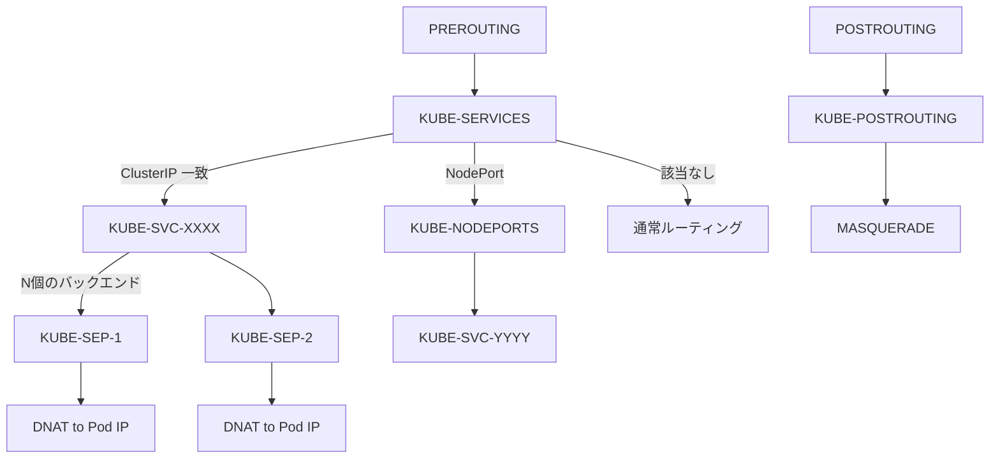
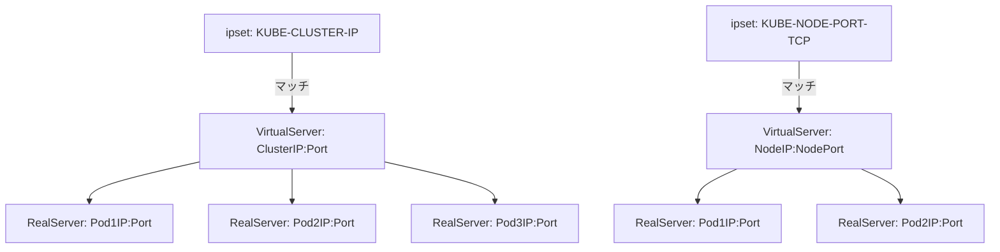
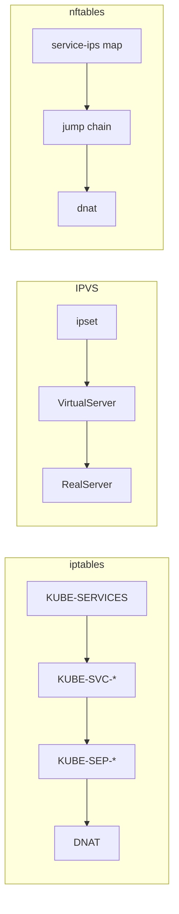

# 第16章 iptables/IPVS/nftables モード

> 本章で読むソース
>
> - [pkg/proxy/iptables/proxier.go L1-L1490](https://github.com/kubernetes/kubernetes/blob/v1.36.2/pkg/proxy/iptables/proxier.go#L1-L1490)
> - [pkg/proxy/ipvs/proxier.go L1-L1790](https://github.com/kubernetes/kubernetes/blob/v1.36.2/pkg/proxy/ipvs/proxier.go#L1-L1790)
> - [pkg/proxy/nftables/proxier.go L1-L1836](https://github.com/kubernetes/kubernetes/blob/v1.36.2/pkg/proxy/nftables/proxier.go#L1-L1836)

## この章の狙い

kube-proxy は3つのプロキシモードを提供する。
本章では各モードの Proxier 構造体、チェーン構成、ルール同期の仕組みを比較する。

## 前提

- 第15章の `ProxyServer` と `Provider` インターフェース
- Linux netfilter の基本（チェーン、テーブル、ルール）
- IPVS（IP Virtual Server）の概要

## iptables モード

### Proxier 構造体

[pkg/proxy/iptables/proxier.go L132-L209](https://github.com/kubernetes/kubernetes/blob/v1.36.2/pkg/proxy/iptables/proxier.go#L132-L209)

```go
// Proxier is an iptables-based proxy
type Proxier struct {
    // ipFamily defines the IP family which this proxier is tracking.
    ipFamily v1.IPFamily

    // endpointsChanges and serviceChanges contains all changes to endpoints and
    // services that happened since iptables was synced. For a single object,
    // changes are accumulated, i.e. previous is state from before all of them,
    // current is state after applying all of those.
    endpointsChanges *proxy.EndpointsChangeTracker
    serviceChanges   *proxy.ServiceChangeTracker

    mu             sync.Mutex // protects the following fields
    svcPortMap     proxy.ServicePortMap
    endpointsMap   proxy.EndpointsMap
    topologyLabels map[string]string
    // ...
    syncRunner           *runner.BoundedFrequencyRunner // governs calls to syncProxyRules
    syncPeriod           time.Duration
    // ...
    // The following buffers are used to reuse memory and avoid allocations
    // that are significantly impacting performance.
    iptablesData             *bytes.Buffer
    existingFilterChainsData *bytes.Buffer
    filterChains             proxyutil.LineBuffer
    filterRules              proxyutil.LineBuffer
    natChains                proxyutil.LineBuffer
    natRules                 proxyutil.LineBuffer

    // largeClusterMode is set at the beginning of syncProxyRules if we are
    // going to end up outputting "lots" of iptables rules and so we need to
    // optimize for performance over debuggability.
    largeClusterMode bool
    // ...
}
```

`syncRunner` は `BoundedFrequencyRunner` であり、最小同期間隔と最大同期間隔の範囲内で同期頻度を制御する。
`iptablesData` などのバッファは再利用され、メモリアロケーションを抑える。

### チェーン構成

iptables モードは複数のカスタムチェーンを使用する。

[pkg/proxy/iptables/proxier.go L53-L87](https://github.com/kubernetes/kubernetes/blob/v1.36.2/pkg/proxy/iptables/proxier.go#L53-L87)

```go
const (
    // the services chain
    kubeServicesChain utiliptables.Chain = "KUBE-SERVICES"

    // the external services chain
    kubeExternalServicesChain utiliptables.Chain = "KUBE-EXTERNAL-SERVICES"

    // the nodeports chain
    kubeNodePortsChain utiliptables.Chain = "KUBE-NODEPORTS"

    // the kubernetes postrouting chain
    kubePostroutingChain utiliptables.Chain = "KUBE-POSTROUTING"

    // kubeMarkMasqChain is the mark-for-masquerade chain
    kubeMarkMasqChain utiliptables.Chain = "KUBE-MARK-MASQ"

    // the kubernetes forward chain
    kubeForwardChain utiliptables.Chain = "KUBE-FORWARD"

    // kubeProxyFirewallChain is the kube-proxy firewall chain
    kubeProxyFirewallChain utiliptables.Chain = "KUBE-PROXY-FIREWALL"

    // kube proxy canary chain is used for monitoring rule reload
    kubeProxyCanaryChain utiliptables.Chain = "KUBE-PROXY-CANARY"

    // ...

    // largeClusterEndpointsThreshold is the number of endpoints at which
    // we switch into "large cluster mode" and optimize for iptables
    // performance over iptables debuggability
    largeClusterEndpointsThreshold = 1000
)
```

トラフィックの経路は次のとおりである。



各 Service に対して `KUBE-SVC-<ハッシュ>` チェーンが、各エンドポイントに対して `KUBE-SEP-<ハッシュ>` チェーンが作成される。
チェーン名はサービス名とプロトコルから SHA256 ハッシュを計算して生成される。

### syncProxyRules の流れ

[pkg/proxy/iptables/proxier.go L638-L737](https://github.com/kubernetes/kubernetes/blob/v1.36.2/pkg/proxy/iptables/proxier.go#L638-L737)

```go
func (proxier *Proxier) syncProxyRules() (retryError error) {
    proxier.mu.Lock()
    defer proxier.mu.Unlock()

    // don't sync rules till we've received services and endpoints
    if !proxier.isInitialized() {
        proxier.logger.V(2).Info("Not syncing iptables until Services and Endpoints have been received from master")
        return
    }

    // Keep track of how long syncs take.
    start := time.Now()

    doFullSync := proxier.needFullSync ||
        // Avoid regular full syncs for large clusters.
        ((time.Since(proxier.lastFullSync) > proxyutil.FullSyncPeriod) && !proxier.largeClusterMode)
    // ...
    serviceUpdateResult := proxier.svcPortMap.Update(proxier.serviceChanges)
    endpointUpdateResult := proxier.endpointsMap.Update(proxier.endpointsChanges)
    // ...
    // Reset all buffers used later.
    // This is to avoid memory reallocations and thus improve performance.
    proxier.filterChains.Reset()
    proxier.filterRules.Reset()
    proxier.natChains.Reset()
    proxier.natRules.Reset()
    // ...
}
```

フル同期と部分同期の2種類がある。
フル同期ではジャンプルールの確保や nfacct カウンターの作成を含む。
部分同期は変更があったサービスに対応するルールのみを更新する。

### 最適化: largeClusterMode

エンドポイント数が `largeClusterEndpointsThreshold`（1000）を超えると、`largeClusterMode` が有効になる。
このモードではコメントの出力を抑制し、iptables-restore のパフォーマンスを優先する。
大規模クラスタでは数万のエンドポイントが存在するため、デバッグ情報の削減が同期時間に直結する。

## IPVS モード

### Proxier 構造体

[pkg/proxy/ipvs/proxier.go L160-L249](https://github.com/kubernetes/kubernetes/blob/v1.36.2/pkg/proxy/ipvs/proxier.go#L160-L249)

```go
// Proxier is an ipvs-based proxy
type Proxier struct {
    // the ipfamily on which this proxy is operating on.
    ipFamily v1.IPFamily
    // endpointsChanges and serviceChanges contains all changes to endpoints and
    // services that happened since last syncProxyRules call.
    endpointsChanges *proxy.EndpointsChangeTracker
    serviceChanges   *proxy.ServiceChangeTracker

    mu             sync.Mutex // protects the following fields
    svcPortMap     proxy.ServicePortMap
    endpointsMap   proxy.EndpointsMap
    // ...
    syncRunner           *runner.BoundedFrequencyRunner // governs calls to syncProxyRules
    // ...
    iptables       utiliptables.Interface
    ipvs           utilipvs.Interface
    ipset          utilipset.Interface
    conntrack      conntrack.Interface
    // ...
    ipsetList map[string]*IPSet
    // ...
    gracefuldeleteManager *GracefulTerminationManager
    // ...
}
```

IPVS モードは iptables・ipset・IPVS の3つのカーネル機能を組み合わせる。
`ipvs` インターフェースは IPVS の VirtualServer と RealServer を操作し、`ipset` はアドレスセットを管理する。

### sysctl の設定

IPVS モードは起動時に複数の sysctl を設定する。

[pkg/proxy/ipvs/proxier.go L97-L106](https://github.com/kubernetes/kubernetes/blob/v1.36.2/pkg/proxy/ipvs/proxier.go#L97-L106)

```go
// In IPVS proxy mode, the following flags need to be set
const (
    sysctlVSConnTrack             = "net/ipv4/vs/conntrack"
    sysctlConnReuse               = "net/ipv4/vs/conn_reuse_mode"
    sysctlExpireNoDestConn        = "net/ipv4/vs/expire_nodest_conn"
    sysctlExpireQuiescentTemplate = "net/ipv4/vs/expire_quiescent_template"
    sysctlForward                 = "net/ipv4/ip_forward"
    sysctlArpIgnore               = "net/ipv4/conf/all/arp_ignore"
    sysctlArpAnnounce             = "net/ipv4/conf/all/arp_announce"
)
```

`net/ipv4/vs/conntrack=1` は IPVS 内でのコネクション追跡を有効にする。
`net/ipv4/vs/expire_nodest_conn=1` は宛先が消えたコネクションを自動的に expire させる。

### IPVS のデータモデル

IPVS モードでは各 Service を VirtualServer として登録し、各エンドポイントを RealServer として登録する。



IPVS は L4 ロードバランサであり、パケットの宛先を書き換える。
iptables は IPVS へのトラフィック誘導と MASQUERADE のみに使用される。

### syncProxyRules の流れ

[pkg/proxy/ipvs/proxier.go L674-L773](https://github.com/kubernetes/kubernetes/blob/v1.36.2/pkg/proxy/ipvs/proxier.go#L674-L773)

```go
func (proxier *Proxier) syncProxyRules() (retryError error) {
    proxier.mu.Lock()
    defer proxier.mu.Unlock()

    if !proxier.isInitialized() {
        proxier.logger.V(2).Info("Not syncing ipvs rules until Services and Endpoints have been received from master")
        return
    }
    // ...
    _ = proxier.svcPortMap.Update(proxier.serviceChanges)
    endpointUpdateResult := proxier.endpointsMap.Update(proxier.endpointsChanges)
    // ...
    // Reset all buffers used later.
    // This is to avoid memory reallocations and thus improve performance.
    proxier.natChains.Reset()
    proxier.natRules.Reset()
    proxier.filterChains.Reset()
    proxier.filterRules.Reset()

    // Write table headers.
    proxier.filterChains.Write("*filter")
    proxier.natChains.Write("*nat")

    proxier.createAndLinkKubeChain()

    // make sure dummy interface exists in the system where ipvs Proxier will bind service address on it
    _, err := proxier.netlinkHandle.EnsureDummyDevice(defaultDummyDevice)
    // ...
    // make sure ip sets exists in the system.
    for _, set := range proxier.ipsetList {
        if err := ensureIPSet(set); err != nil {
            return
        }
        set.resetEntries()
    }
    // ...
}
```

IPVS モードは `kube-ipvs0` というダミーインターフェースに ClusterIP をバインドする。
これにより、カーネルの IPVS モジュールがパケットをインターセプトできる。

### 最適化: GracefulTerminationManager

IPVS モードは `GracefulTerminationManager` を持つ。
エンドポイントが削除されたとき、IPVS は既存コネクションが完了するまで RealServer の weight を 0 に下げて待機する。
これにより、バックエンドの Pod が終了する際に接続が途切れるのを防ぐ。

## nftables モード

### Proxier 構造体

[pkg/proxy/nftables/proxier.go L137-L201](https://github.com/kubernetes/kubernetes/blob/v1.36.2/pkg/proxy/nftables/proxier.go#L137-L201)

```go
// Proxier is an nftables-based proxy
type Proxier struct {
    // ipFamily defines the IP family which this proxier is tracking.
    ipFamily v1.IPFamily

    // endpointsChanges and serviceChanges contains all changes to endpoints and
    // services that happened since nftables was synced.
    endpointsChanges *proxy.EndpointsChangeTracker
    serviceChanges   *proxy.ServiceChangeTracker

    mu             sync.Mutex // protects the following fields
    svcPortMap     proxy.ServicePortMap
    endpointsMap   proxy.EndpointsMap
    // ...
    syncRunner           *runner.BoundedFrequencyRunner // governs calls to syncProxyRules
    syncPeriod           time.Duration
    flushed              bool

    // These are effectively const and do not need the mutex to be held.
    nftables       knftables.Interface
    masqueradeAll  bool
    masqueradeMark string
    masqueradeRule string
    conntrack      conntrack.Interface
    // ...
    // staleChains contains information about chains to be deleted later
    staleChains map[string]time.Time
    // ...
    clusterIPs          *nftElementStorage
    serviceIPs          *nftElementStorage
    firewallIPs         *nftElementStorage
    noEndpointServices  *nftElementStorage
    noEndpointNodePorts *nftElementStorage
    serviceNodePorts    *nftElementStorage
    hairpinConnections  *nftElementStorage
}
```

nftables モードは `knftables` ライブラリを使用して nftables のトランザクションを構築する。
`nftElementStorage` は set や map の要素を追加・削除するための差分管理機構である。

### テーブルとチェーン構成

[pkg/proxy/nftables/proxier.go L55-L98](https://github.com/kubernetes/kubernetes/blob/v1.36.2/pkg/proxy/nftables/proxier.go#L55-L98)

```go
const (
    // Our nftables table. All of our rules/sets/maps are created inside this table,
    // so they don't need any "kube-" or "kube-proxy-" prefix of their own.
    kubeProxyTable = "kube-proxy"

    // base chains
    filterPreroutingPreDNATChain = "filter-prerouting-pre-dnat"
    filterOutputPreDNATChain     = "filter-output-pre-dnat"
    filterInputChain             = "filter-input"
    filterForwardChain           = "filter-forward"
    filterOutputChain            = "filter-output"
    natPreroutingChain           = "nat-prerouting"
    natOutputChain               = "nat-output"
    natPostroutingChain          = "nat-postrouting"

    // service dispatch
    servicesChain       = "services"
    serviceIPsMap       = "service-ips"
    serviceNodePortsMap = "service-nodeports"

    // set of IPs that accept NodePort traffic
    nodePortIPsSet = "nodeport-ips"

    // set of active ClusterIPs.
    clusterIPsSet = "cluster-ips"
    // ...
)
```

nftables モードは `kube-proxy` という単一のテーブル内にすべてのルールを配置する。
`service-ips` はマップ型で、ClusterIP からジャンプ先のチェーンへのマッピングを保持する。

### トランザクションによるルール適用

[pkg/proxy/nftables/proxier.go L1062-L1161](https://github.com/kubernetes/kubernetes/blob/v1.36.2/pkg/proxy/nftables/proxier.go#L1062-L1161)

```go
func (proxier *Proxier) syncProxyRules() (retryError error) {
    proxier.mu.Lock()
    defer proxier.mu.Unlock()

    if !proxier.isInitialized() {
        proxier.logger.V(2).Info("Not syncing nftables until Services and Endpoints have been received from master")
        return
    }
    // ...
    doFullSync := proxier.needFullSync || (time.Since(proxier.lastFullSync) > proxyutil.FullSyncPeriod)
    // ...
    serviceUpdateResult := proxier.svcPortMap.Update(proxier.serviceChanges)
    endpointUpdateResult := proxier.endpointsMap.Update(proxier.endpointsChanges)
    // ...
    // If there are sufficiently-stale chains left over from previous transactions,
    // try to delete them now.
    if len(proxier.staleChains) > 0 {
        oneSecondAgo := start.Add(-time.Second)
        tx := proxier.nftables.NewTransaction()
        deleted := 0
        for chain, modtime := range proxier.staleChains {
            if modtime.Before(oneSecondAgo) {
                tx.Delete(&knftables.Chain{
                    Name: chain,
                })
                delete(proxier.staleChains, chain)
                deleted++
            }
        }
        // ...
    }

    // Now start the actual syncing transaction
    tx := proxier.nftables.NewTransaction()
    if doFullSync {
        proxier.setupNFTables(tx)
    }
    // ...
}
```

nftables モードの最大の特徴はトランザクションである。
すべてのルール変更を1つのトランザクションにまとめて `nft` コマンドに送信する。
トランザクションはアトミックに適用されるため、ルールの途中状態が存在しない。

### 最適化: 部分同期と staleChains

nftables モードは iptables モードと同様に部分同期をサポートする。
さらに、削除すべきチェーンは即座に削除せず `staleChains` に記録し、1秒経過してから削除する。
これは、チェーンが再利用される可能性がある場合に、削除と再作成のオーバーヘッドを避けるためである。

## 3モードの比較



| 項目 | iptables | IPVS | nftables |
|------|----------|------|----------|
| ルール適用 | iptables-restore | netlink + iptables | nft トランザクション |
| 転送方式 | DNAT ルール | カーネル L4 LB | DNAT ルール |
| 大規模性能 | ルール数に比例 | O(1) ルックアップ | set/map で効率化 |
| 部分同期 | サポート | サポート | サポート |
| デュアルスタック | MetaProxier | MetaProxier | MetaProxier |

## まとめ

iptables モードはチェーンの階層構造でトラフィックを転送し、`largeClusterMode` で大規模クラスタの性能を最適化する。
IPVS モードはカーネルの L4 ロードバランサを使用し、VirtualServer/RealServer のモデルで O(1) のパケット転送を実現する。
nftables モードはトランザクションによるアトミックなルール適用と、set/map を使った効率的なマッチングを提供する。
3モードすべてが `BoundedFrequencyRunner` による同期頻度制御と、バッファ再利用によるメモリアロケーションの削減を実装している。

## 関連する章

- [第15章 kube-proxy のアーキテクチャ](15-kube-proxy-architecture.md)
- [第14章 ボリューム管理とリソース管理](../part04-kubelet/14-volume-and-resource-management.md)
