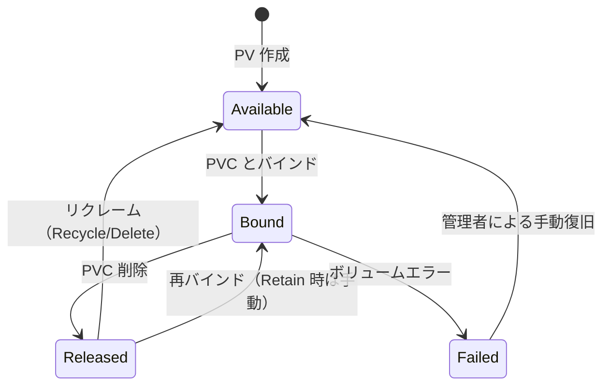
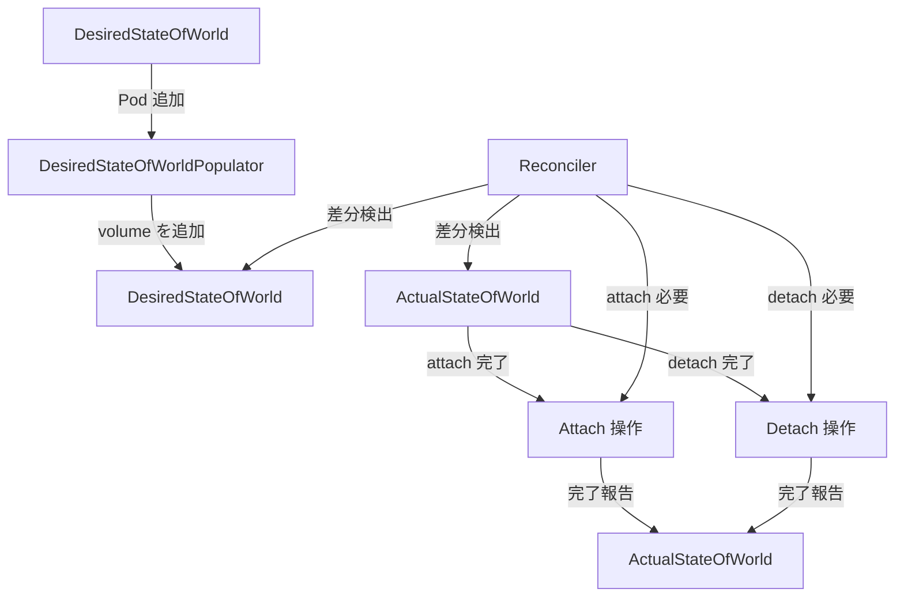

# 第17章 PV/PVC 管理と Attach/Detach

> 本章で読むソース
>
> - [pkg/controller/volume/persistentvolume/pv_controller.go L1-L2024](https://github.com/kubernetes/kubernetes/blob/v1.36.2/pkg/controller/volume/persistentvolume/pv_controller.go#L1-L2024)
> - [pkg/controller/volume/attachdetach/attach_detach_controller.go L1-L883](https://github.com/kubernetes/kubernetes/blob/v1.36.2/pkg/controller/volume/attachdetach/attach_detach_controller.go#L1-L883)
> - [pkg/controller/volume/attachdetach/cache/actual_state_of_world.go L1-L741](https://github.com/kubernetes/kubernetes/blob/v1.36.2/pkg/controller/volume/attachdetach/cache/actual_state_of_world.go#L1-L741)
> - [pkg/controller/volume/attachdetach/cache/desired_state_of_world.go L1-L417](https://github.com/kubernetes/kubernetes/blob/v1.36.2/pkg/controller/volume/attachdetach/cache/desired_state_of_world.go#L1-L417)

## この章の狙い

Kubernetes の永続ストレージ管理は2つのコントローラが担う。
`PersistentVolumeController` は PV と PVC のバインディングを管理し、`AttachDetachController` はボリュームのノードへのアタッチとデタッチを管理する。
本章では両者の状態遷移と、Desired/Actual State による差分解決の仕組みを読む。

## 前提

- PV・PVC の API リソース（第1部参照）
- コントローラパターン（第3部参照）
- Informer と workqueue の仕組み（第19章で詳述）

## PersistentVolumeController

### 設計思想

`PersistentVolumeController` のコードは「スペースシャトルスタイル」と呼ばれる冗長な記述で書かれている。

[pkg/controller/volume/persistentvolume/pv_controller.go L62-L94](https://github.com/kubernetes/kubernetes/blob/v1.36.2/pkg/controller/volume/persistentvolume/pv_controller.go#L62-L94)

```go
// ==================================================================
// PLEASE DO NOT ATTEMPT TO SIMPLIFY THIS CODE.
// KEEP THE SPACE SHUTTLE FLYING.
// ==================================================================
//
// This controller is intentionally written in a very verbose style. You will
// notice:
//
// 1. Every 'if' statement has a matching 'else' (exception: simple error
//    checks for a client API call)
// 2. Things that may seem obvious are commented explicitly
//
// We call this style 'space shuttle style'. Space shuttle style is meant to
// ensure that every branch and condition is considered and accounted for -
// the same way code is written at NASA for applications like the space
// shuttle.
```

このスタイルは、すべての分岐を明示的に扱い、見落としを防ぐことを目的とする。
PV と PVC のバインディングは双方向のポインタで表現され、トランザクションレスなシステムでの整合性保証が複雑である。

### 構造体

[pkg/controller/volume/persistentvolume/pv_controller.go L140-L230](https://github.com/kubernetes/kubernetes/blob/v1.36.2/pkg/controller/volume/persistentvolume/pv_controller.go#L140-L230)

```go
// PersistentVolumeController is a controller that synchronizes
// PersistentVolumeClaims and PersistentVolumes. It starts two
// cache.Controllers that watch PersistentVolume and PersistentVolumeClaim
// changes.
type PersistentVolumeController struct {
    volumeLister       corelisters.PersistentVolumeLister
    volumeListerSynced cache.InformerSynced
    claimLister        corelisters.PersistentVolumeClaimLister
    claimListerSynced  cache.InformerSynced
    classLister        storagelisters.StorageClassLister
    classListerSynced  cache.InformerSynced
    // ...

    // Cache of the last known version of volumes and claims. This cache is
    // thread safe as long as the volumes/claims there are not modified, they
    // must be cloned before any modification. These caches get updated both by
    // "xxx added/updated/deleted" events from etcd and by the controller when
    // it saves newer version to etcd.
    // Why local cache: binding a volume to a claim generates 4 events, roughly
    // in this order (depends on goroutine ordering):
    // - volume.Spec update
    // - volume.Status update
    // - claim.Spec update
    // - claim.Status update
    // With these caches, the controller can check that it has already saved
    // volume.Status and claim.Spec+Status and does not need to do anything
    // when e.g. volume.Spec update event arrives before all the other events.
    volumes persistentVolumeOrderedIndex
    claims  cache.Store

    // Work queues of claims and volumes to process. Every queue should have
    // exactly one worker thread, especially syncClaim() is not reentrant.
    // Two syncClaims could bind two different claims to the same volume or one
    // claim to two volumes. The controller would recover from this (due to
    // version errors in API server and other checks in this controller),
    // however overall speed of multi-worker controller would be lower than if
    // it runs single thread only.
    claimQueue  workqueue.TypedRateLimitingInterface[string]
    volumeQueue workqueue.TypedRateLimitingInterface[string]
    // ...
}
```

ローカルキャッシュを持つ理由は、バインディング時に生成される4つのイベントによる競合を避けるためである。
workqueue はシングルスレッドで処理され、`syncClaim` の再入性を防ぐ。

### PV の状態遷移

PV は4つのフェーズを取る。



- **Available**: どの PVC にもバインドされていない
- **Bound**: PVC にバインド済み
- **Released**: PVC が削除されたが、まだリクレーム処理が完了していない
- **Failed**: ボリュームにエラーが発生した

### syncClaim

`syncClaim` は PVC の同期エントリーポイントである。

[pkg/controller/volume/persistentvolume/pv_controller.go L232-L257](https://github.com/kubernetes/kubernetes/blob/v1.36.2/pkg/controller/volume/persistentvolume/pv_controller.go#L232-L257)

```go
// syncClaim is the main controller method to decide what to do with a claim.
// It's invoked by appropriate cache.Controller callbacks when a claim is
// created, updated or periodically synced. We do not differentiate between
// these events.
// For easier readability, it was split into syncUnboundClaim and syncBoundClaim
// methods.
func (ctrl *PersistentVolumeController) syncClaim(ctx context.Context, claim *v1.PersistentVolumeClaim) error {
    logger := klog.FromContext(ctx)
    logger.V(4).Info("Synchronizing PersistentVolumeClaim", "PVC", klog.KObj(claim), "claimStatus", getClaimStatusForLogging(claim))

    // Set correct "migrated-to" annotations on PVC and update in API server if
    // necessary
    newClaim, err := ctrl.updateClaimMigrationAnnotations(ctx, claim)
    if err != nil {
        // Nothing was saved; we will fall back into the same
        // condition in the next call to this method
        return err
    }

    claim = newClaim

    if !metav1.HasAnnotation(claim.ObjectMeta, storagehelpers.AnnBindCompleted) {
        return ctrl.syncUnboundClaim(ctx, claim)
    } else {
        return ctrl.syncBoundClaim(ctx, claim)
    }
}
```

`AnnBindCompleted` アノテーションの有無で未バインドと既バインドを分岐する。

### syncUnboundClaim

[pkg/controller/volume/persistentvolume/pv_controller.go L330-L349](https://github.com/kubernetes/kubernetes/blob/v1.36.2/pkg/controller/volume/persistentvolume/pv_controller.go#L330-L349)

```go
// syncUnboundClaim is the main controller method to decide what to do with an
// unbound claim.
func (ctrl *PersistentVolumeController) syncUnboundClaim(ctx context.Context, claim *v1.PersistentVolumeClaim) error {
    // This is a new PVC that has not completed binding
    // OBSERVATION: pvc is "Pending"
    logger := klog.FromContext(ctx)
    if claim.Spec.VolumeName == "" {
        // User did not care which PV they get.
        delayBinding, err := storagehelpers.IsDelayBindingMode(claim, ctrl.classLister)
        if err != nil {
            return err
        }

        // [Unit test set 1]
        volume, err := ctrl.volumes.findBestMatchForClaim(claim, delayBinding)
        // ...
    }
    // ...
}
```

`findBestMatchForClaim` は既存の PV から最適なものを探す。
見つからない場合、動的プロビジョニングが有効なら新しいボリュームを作成する。

### checkVolumeSatisfyClaim

PV と PVC の適合性を判定する。

[pkg/controller/volume/persistentvolume/pv_controller.go L259-L303](https://github.com/kubernetes/kubernetes/blob/v1.36.2/pkg/controller/volume/persistentvolume/pv_controller.go#L259-L303)

```go
// checkVolumeSatisfyClaim checks if the volume requested by the claim satisfies the requirements of the claim
func checkVolumeSatisfyClaim(volume *v1.PersistentVolume, claim *v1.PersistentVolumeClaim) error {
    requestedQty := claim.Spec.Resources.Requests[v1.ResourceName(v1.ResourceStorage)]
    requestedSize := requestedQty.Value()

    // check if PV's DeletionTimeStamp is set, if so, return error.
    if volume.ObjectMeta.DeletionTimestamp != nil {
        return fmt.Errorf("the volume is marked for deletion %q", volume.Name)
    }

    volumeQty := volume.Spec.Capacity[v1.ResourceStorage]
    volumeSize := volumeQty.Value()
    if volumeSize < requestedSize {
        return fmt.Errorf("requested PV is too small")
    }

    requestedClass := storagehelpers.GetPersistentVolumeClaimClass(claim)
    if storagehelpers.GetPersistentVolumeClass(volume) != requestedClass {
        return fmt.Errorf("storageClassName does not match")
    }
    // ...
    if !storagehelpers.CheckAccessModes(claim, volume) {
        return fmt.Errorf("incompatible accessMode")
    }

    return nil
}
```

容量、ストレージクラス、ボリュームモード、アクセスモードの適合性を確認する。

## AttachDetachController

### 役割

`AttachDetachController` は kube-controller-manager 内で動作し、ボリュームのノードへのアタッチとデタッチを管理する。

[pkg/controller/volume/attachdetach/attach_detach_controller.go L96-L100](https://github.com/kubernetes/kubernetes/blob/v1.36.2/pkg/controller/volume/attachdetach/attach_detach_controller.go#L96-L100)

```go
// AttachDetachController defines the operations supported by this controller.
type AttachDetachController interface {
    Run(ctx context.Context)
    GetDesiredStateOfWorld() cache.DesiredStateOfWorld
}
```

### 構造体

[pkg/controller/volume/attachdetach/attach_detach_controller.go L238-L299](https://github.com/kubernetes/kubernetes/blob/v1.36.2/pkg/controller/volume/attachdetach/attach_detach_controller.go#L238-L299)

```go
type attachDetachController struct {
    // kubeClient is the kube API client used by volumehost to communicate with
    // the API server.
    kubeClient clientset.Interface
    // ...
    // desiredStateOfWorld is a data structure containing the desired state of
    // the world according to this controller: i.e. what nodes the controller
    // is managing, what volumes it wants be attached to these nodes, and which
    // pods are scheduled to those nodes referencing the volumes.
    desiredStateOfWorld cache.DesiredStateOfWorld

    // actualStateOfWorld is a data structure containing the actual state of
    // the world according to this controller: i.e. which volumes are attached
    // to which nodes.
    actualStateOfWorld cache.ActualStateOfWorld

    // attacherDetacher is used to start asynchronous attach and operations
    attacherDetacher operationexecutor.OperationExecutor

    // reconciler is used to run an asynchronous periodic loop to reconcile the
    // ...
}
```

### DesiredStateOfWorld と ActualStateOfWorld

Attach/Detach Controller は2つの状態データ構造を管理する。

`DesiredStateOfWorld` は Pod のスケジューリング結果から計算される、あるべき状態である。

[pkg/controller/volume/attachdetach/cache/desired_state_of_world.go L36-L45](https://github.com/kubernetes/kubernetes/blob/v1.36.2/pkg/controller/volume/attachdetach/cache/desired_state_of_world.go#L36-L45)

```go
// DesiredStateOfWorld defines a set of thread-safe operations supported on
// the attach/detach controller's desired state of the world cache.
// This cache contains nodes->volumes->pods where nodes are all the nodes
// managed by the attach/detach controller, volumes are all the volumes that
// should be attached to the specified node, and pods are the pods that
// reference the volume and are scheduled to that node.
// Note: This is distinct from the DesiredStateOfWorld implemented by the
// kubelet volume manager. They both keep track of different objects. This
// contains attach/detach controller specific state.
type DesiredStateOfWorld interface {
```

`ActualStateOfWorld` は実際にどのボリュームがどのノードにアタッチされているかを追跡する。

[pkg/controller/volume/attachdetach/cache/actual_state_of_world.go L40-L63](https://github.com/kubernetes/kubernetes/blob/v1.36.2/pkg/controller/volume/attachdetach/cache/actual_state_of_world.go#L40-L63)

```go
// ActualStateOfWorld defines a set of thread-safe operations supported on
// the attach/detach controller's actual state of the world cache.
// This cache contains volumes->nodes i.e. a set of all volumes and the nodes
// the attach/detach controller believes are successfully attached.
// Note: This is distinct from the ActualStateOfWorld implemented by the kubelet
// volume manager. They both keep track of different objects. This contains
// attach/detach controller specific state.
type ActualStateOfWorld interface {
	// ActualStateOfWorld must implement the methods required to allow
	// operationexecutor to interact with it.
	operationexecutor.ActualStateOfWorldAttacherUpdater

	// AddVolumeNode adds the given volume and node to the underlying store.
	// If attached is set to true, it indicates the specified volume is already
	// attached to the specified node. If attached set to false, it means that
	// the volume is not confirmed to be attached to the node yet.
	// A unique volume name is generated from the volumeSpec and returned on
	// success.
	// If volumeSpec is not an attachable volume plugin, an error is returned.
	// If no volume with the name volumeName exists in the store, the volume is
	// added.
	// If no node with the name nodeName exists in list of attached nodes for
	// the specified volume, the node is added.
	AddVolumeNode(logger klog.Logger, uniqueName v1.UniqueVolumeName, volumeSpec *volume.Spec, nodeName types.NodeName, devicePath string, attached bool) (v1.UniqueVolumeName, error)
	// ...
}
```

### Reconciler による差分解決

Reconciler は DesiredStateOfWorld と ActualStateOfWorld の差分を解決する。



Reconciler のループ周期はデフォルトで100ミリ秒である。

[pkg/controller/volume/attachdetach/attach_detach_controller.go L87-L94](https://github.com/kubernetes/kubernetes/blob/v1.36.2/pkg/controller/volume/attachdetach/attach_detach_controller.go#L87-L94)

```go
// DefaultTimerConfig is the default configuration of Attach/Detach controller
// timers.
var DefaultTimerConfig = TimerConfig{
    ReconcilerLoopPeriod:                              100 * time.Millisecond,
    ReconcilerMaxWaitForUnmountDuration:               6 * time.Minute,
    DesiredStateOfWorldPopulatorLoopSleepPeriod:       1 * time.Minute,
    DesiredStateOfWorldPopulatorListPodsRetryDuration: 3 * time.Minute,
}
```

`ReconcilerMaxWaitForUnmountDuration` は6分であり、ボリュームのアンマウントがこの時間内に完了しない場合、強制的にデタッチする。

### 初期化

[pkg/controller/volume/attachdetach/attach_detach_controller.go L102-L194](https://github.com/kubernetes/kubernetes/blob/v1.36.2/pkg/controller/volume/attachdetach/attach_detach_controller.go#L102-L194)

```go
func NewAttachDetachController(
    ctx context.Context,
    kubeClient clientset.Interface,
    podInformer coreinformers.PodInformer,
    nodeInformer coreinformers.NodeInformer,
    // ...
) (AttachDetachController, error) {
    // ...
    adc.desiredStateOfWorld = cache.NewDesiredStateOfWorld(&adc.volumePluginMgr)
    adc.actualStateOfWorld = cache.NewActualStateOfWorld(&adc.volumePluginMgr)
    adc.attacherDetacher =
        operationexecutor.NewOperationExecutor(operationexecutor.NewOperationGenerator(
            kubeClient,
            &adc.volumePluginMgr,
            recorder,
            blkutil))
    // ...
    adc.reconciler = reconciler.NewReconciler(
        timerConfig.ReconcilerLoopPeriod,
        timerConfig.ReconcilerMaxWaitForUnmountDuration,
        reconcilerSyncDuration,
        disableReconciliationSync,
        disableForceDetachOnTimeout,
        adc.desiredStateOfWorld,
        adc.actualStateOfWorld,
        adc.attacherDetacher,
        adc.nodeStatusUpdater,
        adc.nodeLister,
        recorder)
    // ...
}
```

Pod Informer のイベントハンドラは `podAdd`、`podUpdate`、`podDelete` で DesiredStateOfWorld を更新する。

### 最適化: Pod PVC インデクサ

Attach/Detach Controller は Pod を PVC のキーでインデックスする。

[pkg/controller/volume/attachdetach/attach_detach_controller.go L208-L212](https://github.com/kubernetes/kubernetes/blob/v1.36.2/pkg/controller/volume/attachdetach/attach_detach_controller.go#L208-L212)

```go
// This custom indexer will index pods by its PVC keys. Then we don't need
// to iterate all pods every time to find pods which reference given PVC.
if err := common.AddPodPVCIndexerIfNotPresent(adc.podIndexer); err != nil {
    return nil, fmt.Errorf("could not initialize attach detach controller: %w", err)
}
```

このインデクサにより、特定の PVC を参照する Pod を探す際に全 Pod を走査する必要がなくなる。
大規模クラスタでは数千の Pod が存在するため、インデックスによる O(1) 参照は性能上重要である。

## まとめ

`PersistentVolumeController` は PV と PVC の双方向ポインタを管理し、スペースシャトルスタイルの網羅的な分岐でバインディングの整合性を保証する。
ローカルキャッシュは4つのイベント生成による競合を防ぐ。
`AttachDetachController` は DesiredStateOfWorld と ActualStateOfWorld の2層構造で状態を管理し、Reconciler が100ミリ秒周期で差分を解決する。
Pod PVC インデクサは参照 Pod の検索を O(1) に最適化する。

## 関連する章

- [第18章 CSI 連携](18-csi-integration.md)
- [第14章 ボリューム管理とリソース管理](../part04-kubelet/14-volume-and-resource-management.md)
- [第9章 kube-controller-manager のアーキテクチャ](../part03-controller-manager/09-controller-manager-architecture.md)
