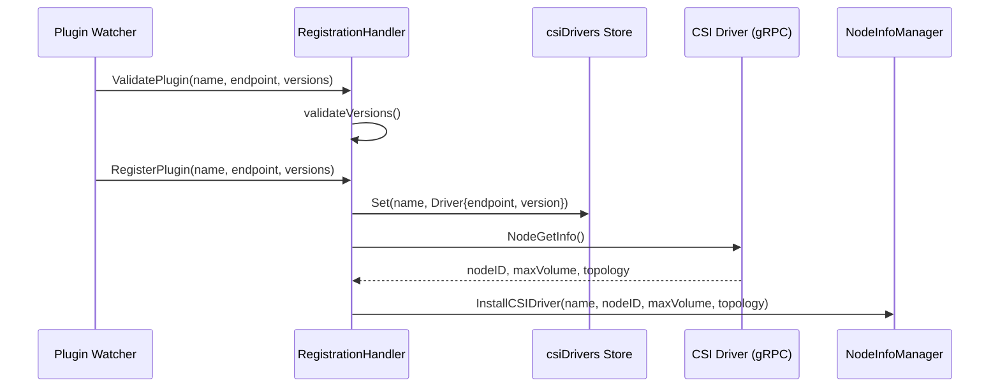
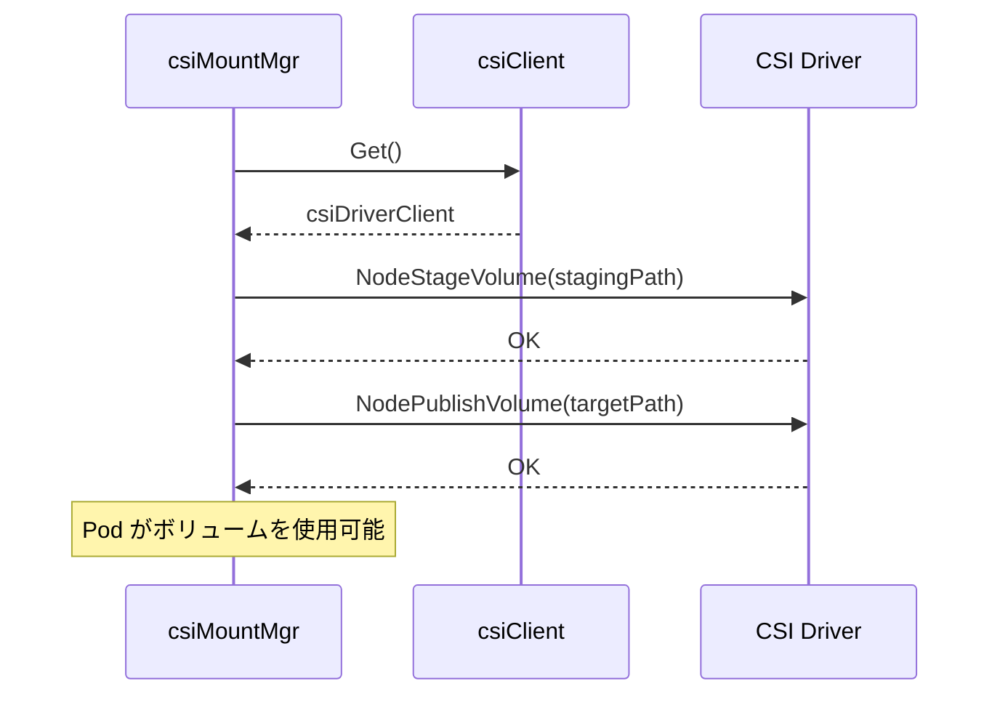
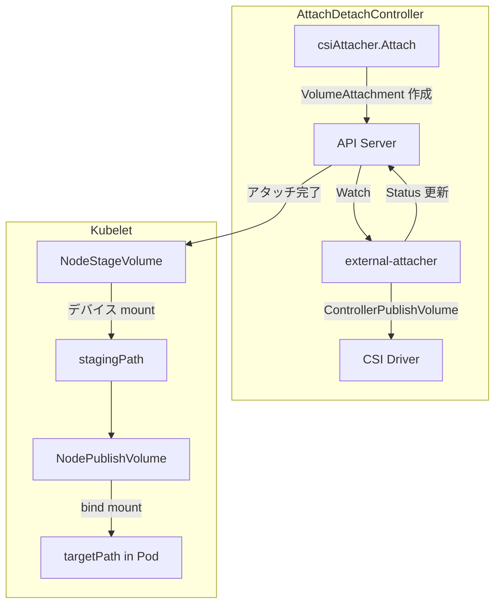

# 第18章 CSI 連携

> 本章で読むソース
>
> - [pkg/volume/csi/csi_plugin.go L1-L999](https://github.com/kubernetes/kubernetes/blob/v1.36.2/pkg/volume/csi/csi_plugin.go#L1-L999)
> - [pkg/volume/csi/csi_client.go L1-L736](https://github.com/kubernetes/kubernetes/blob/v1.36.2/pkg/volume/csi/csi_client.go#L1-L736)
> - [pkg/volume/csi/csi_attacher.go L1-L662](https://github.com/kubernetes/kubernetes/blob/v1.36.2/pkg/volume/csi/csi_attacher.go#L1-L662)
> - [pkg/volume/csi/csi_mounter.go L1-L625](https://github.com/kubernetes/kubernetes/blob/v1.36.2/pkg/volume/csi/csi_mounter.go#L1-L625)

## この章の狙い

Container Storage Interface（CSI）は、ストレージプロバイダが Kubernetes 本体とは独立してプラグインを提供する仕組みである。
本章では CSI プラグインの登録、gRPC 通信、アタッチとマウントの4つの側面からソースコードを読む。

## 前提

- 第17章の PV/PVC と Attach/Detach Controller
- gRPC の基本概念
- CSI 仕様の概要（Node/Controller/Identity サービス）

## CSI プラグインの登録

### csiPlugin 構造体

`csiPlugin` は Kubernetes 組み込みの CSI プラグインである。

[pkg/volume/csi/csi_plugin.go L66-L72](https://github.com/kubernetes/kubernetes/blob/v1.36.2/pkg/volume/csi/csi_plugin.go#L66-L72)

```go
type csiPlugin struct {
    host                      volume.VolumeHost
    csiDriverLister           storagelisters.CSIDriverLister
    csiDriverInformer         cache.SharedIndexInformer
    serviceAccountTokenGetter func(namespace, name string, tr *authenticationv1.TokenRequest) (*authenticationv1.TokenRequest, error)
    volumeAttachmentLister    storagelisters.VolumeAttachmentLister
}
```

`csiDriverLister` は CSIDriver オブジェクトの読み取りに使用し、`volumeAttachmentLister` は VolumeAttachment の状態確認に使用する。

### RegistrationHandler

CSI ドライバの登録は kubelet の plugin watcher 経由で行われる。

[pkg/volume/csi/csi_plugin.go L85-L101](https://github.com/kubernetes/kubernetes/blob/v1.36.2/pkg/volume/csi/csi_plugin.go#L85-L101)

```go
// RegistrationHandler is the handler which is fed to the pluginwatcher API.
type RegistrationHandler struct {
    csiPlugin *csiPlugin
}

// TODO (verult) consider using a struct instead of global variables
// csiDrivers map keep track of all registered CSI drivers on the node and their
// corresponding sockets
var csiDrivers = &DriversStore{}

// PluginHandler is the plugin registration handler passed to the
// pluginwatcher module in kubelet
var PluginHandler = &RegistrationHandler{}
```

`csiDrivers` はグローバルなドライバーストアであり、ノード上で登録されたすべての CSI ドライバのソケットエンドポイントを保持する。

### ValidatePlugin と RegisterPlugin

[pkg/volume/csi/csi_plugin.go L103-L169](https://github.com/kubernetes/kubernetes/blob/v1.36.2/pkg/volume/csi/csi_plugin.go#L103-L169)

```go
// ValidatePlugin is called by kubelet's plugin watcher upon detection
// of a new registration socket opened by CSI Driver registrar side car.
func (h *RegistrationHandler) ValidatePlugin(pluginName string, endpoint string, versions []string) error {
    klog.Info(log("Trying to validate a new CSI Driver with name: %s endpoint: %s versions: %s",
        pluginName, endpoint, strings.Join(versions, ",")))

    _, err := h.validateVersions("ValidatePlugin", pluginName, endpoint, versions)
    if err != nil {
        return fmt.Errorf("validation failed for CSI Driver %s at endpoint %s: %v", pluginName, endpoint, err)
    }

    return err
}

// RegisterPlugin is called when a plugin can be registered
func (h *RegistrationHandler) RegisterPlugin(pluginName string, endpoint string, versions []string, pluginClientTimeout *time.Duration) error {
    klog.Info(log("Register new plugin with name: %s at endpoint: %s", pluginName, endpoint))

    highestSupportedVersion, err := h.validateVersions("RegisterPlugin", pluginName, endpoint, versions)
    if err != nil {
        return err
    }

    // Storing endpoint of newly registered CSI driver into the map, where CSI driver name will be the key
    // all other CSI components will be able to get the actual socket of CSI drivers by its name.
    csiDrivers.Set(pluginName, Driver{
        endpoint:                endpoint,
        highestSupportedVersion: highestSupportedVersion,
    })

    // Get node info from the driver.
    csi, err := newCsiDriverClient(csiDriverName(pluginName))
    if err != nil {
        return err
    }
    // ...
    driverNodeID, maxVolumePerNode, accessibleTopology, err := csi.NodeGetInfo(ctx)
    // ...
    err = nim.InstallCSIDriver(pluginName, driverNodeID, maxVolumePerNode, accessibleTopology)
    // ...
}
```

登録の流れは次のとおりである。

1. plugin watcher が CSI ドライバのソケットを検出
2. `ValidatePlugin` でバージョン互換性を確認
3. `RegisterPlugin` でドライバのソケットを `csiDrivers` に保存
4. `NodeGetInfo` RPC でノード情報を取得
5. `nodeinfomanager` に CSIDriver 情報を登録



## CSI クライアントによる gRPC 通信

### csiClient インターフェース

`csiClient` は CSI Node サービスの RPC を抽象化する。

[pkg/volume/csi/csi_client.go L42-L100](https://github.com/kubernetes/kubernetes/blob/v1.36.2/pkg/volume/csi/csi_client.go#L42-L100)

```go
type csiClient interface {
    NodeGetInfo(ctx context.Context) (
        nodeID string,
        maxVolumePerNode int64,
        accessibleTopology map[string]string,
        err error)

    // The caller is responsible for checking whether the driver supports
    // applying FSGroup by calling NodeSupportsVolumeMountGroup().
    // If the driver does not, fsGroup must be set to nil.
    NodePublishVolume(
        ctx context.Context,
        volumeid string,
        readOnly bool,
        stagingTargetPath string,
        targetPath string,
        accessMode api.PersistentVolumeAccessMode,
        publishContext map[string]string,
        volumeContext map[string]string,
        secrets map[string]string,
        fsType string,
        mountOptions []string,
        fsGroup *int64,
    ) error

    NodeExpandVolume(ctx context.Context, rsOpts csiResizeOptions) (resource.Quantity, error)
    NodeUnpublishVolume(
        ctx context.Context,
        volID string,
        targetPath string,
    ) error

    // ...
    NodeStageVolume(ctx context.Context,
        volID string,
        publishVolumeInfo map[string]string,
        stagingTargetPath string,
        fsType string,
        accessMode api.PersistentVolumeAccessMode,
        secrets map[string]string,
        volumeContext map[string]string,
        mountOptions []string,
        fsGroup *int64,
    ) error
    // ...
}
```

`NodeStageVolume` はボリュームをステージングパスにマウントし、`NodePublishVolume` はステージングパスから_pod のターゲットパス_にバインドマウントする。
この2段階の設計により、同じボリュームを複数の Pod で共有できる。

### csiDriverClient

[pkg/volume/csi/csi_client.go L108-L170](https://github.com/kubernetes/kubernetes/blob/v1.36.2/pkg/volume/csi/csi_client.go#L108-L170)

```go
// csiClient encapsulates all csi-plugin methods
type csiDriverClient struct {
    driverName          csiDriverName
    addr                csiAddr
    metricsManager      *MetricsManager
    nodeV1ClientCreator nodeV1ClientCreator
}

// ...

func newCsiDriverClient(driverName csiDriverName) (*csiDriverClient, error) {
    if driverName == "" {
        return nil, fmt.Errorf("driver name is empty")
    }

    existingDriver, driverExists := csiDrivers.Get(string(driverName))
    if !driverExists {
        return nil, fmt.Errorf("driver name %s not found in the list of registered CSI drivers", driverName)
    }

    nodeV1ClientCreator := newV1NodeClient
    return &csiDriverClient{
        driverName:          driverName,
        addr:                csiAddr(existingDriver.endpoint),
        nodeV1ClientCreator: nodeV1ClientCreator,
        metricsManager:      NewCSIMetricsManager(string(driverName)),
    }, nil
}
```

`csiDriverClient` は `csiDrivers` ストアからドライバのソケットエンドポイントを取得し、gRPC 接続を確立する。
`metricsManager` は CSI 操作のメトリクスを記録する。

### gRPC 接続の確立

[pkg/volume/csi/csi_client.go L142-L151](https://github.com/kubernetes/kubernetes/blob/v1.36.2/pkg/volume/csi/csi_client.go#L142-L151)

```go
// newV1NodeClient creates a new NodeClient with the internally used gRPC
// connection set up. It also returns a closer which must be called to close
// the gRPC connection when the NodeClient is not used anymore.
func newV1NodeClient(addr csiAddr, metricsManager *MetricsManager) (nodeClient csipbv1.NodeClient, closer io.Closer, err error) {
    var conn *grpc.ClientConn
    conn, err = newGrpcConn(addr, metricsManager)
    if err != nil {
        return nil, nil, err
    }

    nodeClient = csipbv1.NewNodeClient(conn)
    return nodeClient, conn, nil
}
```

gRPC 接続は操作ごとに作成され、使用後にクローズされる。
`metricsManager` は gRPC インターセプタとして動作し、RPC の所要時間とエラーを記録する。

## Attach/Detach（csiAttacher）

### csiAttacher 構造体

`csiAttacher` は CSI ボリュームのアタッチとデタッチを担当する。

[pkg/volume/csi/csi_attacher.go L48-L62](https://github.com/kubernetes/kubernetes/blob/v1.36.2/pkg/volume/csi/csi_attacher.go#L48-L62)

```go
type csiAttacher struct {
    plugin       *csiPlugin
    k8s          kubernetes.Interface
    watchTimeout time.Duration

    csiClient csiClient
}

// volume.Attacher methods
var _ volume.Attacher = &csiAttacher{}

var _ volume.Detacher = &csiAttacher{}

var _ volume.DeviceMounter = &csiAttacher{}
```

`csiAttacher` は `Attacher`、`Detacher`、`DeviceMounter` の3つのインターフェースを実装する。

### Attach の流れ

CSI のアタッチは VolumeAttachment オブジェクトを作成することで開始される。

[pkg/volume/csi/csi_attacher.go L63-L139](https://github.com/kubernetes/kubernetes/blob/v1.36.2/pkg/volume/csi/csi_attacher.go#L63-L139)

```go
func (c *csiAttacher) Attach(spec *volume.Spec, nodeName types.NodeName) (string, error) {
    _, ok := c.plugin.host.(volume.KubeletVolumeHost)
    if ok {
        return "", errors.New("attaching volumes from the kubelet is not supported")
    }
    // ...
    node := string(nodeName)
    attachID := getAttachmentName(pvSrc.VolumeHandle, pvSrc.Driver, node)

    attachment, err := c.plugin.volumeAttachmentLister.Get(attachID)
    if err != nil && !apierrors.IsNotFound(err) {
        return "", errors.New(log("failed to get volume attachment from lister: %v", err))
    }

    if attachment == nil {
        var vaSrc storage.VolumeAttachmentSource
        if spec.InlineVolumeSpecForCSIMigration {
            vaSrc = storage.VolumeAttachmentSource{
                InlineVolumeSpec: &spec.PersistentVolume.Spec,
            }
        } else {
            // regular PV scenario - use PV name to populate VA source
            pvName := spec.PersistentVolume.GetName()
            vaSrc = storage.VolumeAttachmentSource{
                PersistentVolumeName: &pvName,
            }
        }

        attachment := &storage.VolumeAttachment{
            ObjectMeta: metav1.ObjectMeta{
                Name: attachID,
            },
            Spec: storage.VolumeAttachmentSpec{
                NodeName: node,
                Attacher: pvSrc.Driver,
                Source:   vaSrc,
            },
        }

        _, err = c.k8s.StorageV1().VolumeAttachments().Create(context.TODO(), attachment, metav1.CreateOptions{})
        // ...
    }

    // Attach and detach functionality is exclusive to the CSI plugin that runs in the AttachDetachController,
    // and has access to a VolumeAttachment lister that can be polled for the current status.
    if err := c.waitForVolumeAttachmentWithLister(spec, pvSrc.VolumeHandle, attachID, c.watchTimeout); err != nil {
        return "", err
    }
    // ...
}
```

CSI のアタッチは直接 gRPC を呼ぶのではなく、`VolumeAttachment` オブジェクトを API サーバーに作成する。
外部の CSI external-attacher がこのオブジェクトを監視し、実際のストレージ側のアタッチ操作を実行する。
`waitForVolumeAttachmentWithLister` は lister をポーリングしてアタッチ完了を待つ。

### WaitForAttach

[pkg/volume/csi/csi_attacher.go L141-L170](https://github.com/kubernetes/kubernetes/blob/v1.36.2/pkg/volume/csi/csi_attacher.go#L141-L170)

```go
// WaitForAttach waits for the attach operation to complete and returns the device path when it is done.
// But in this case, there should be no waiting. The device is found by the CSI driver later, in NodeStage / NodePublish calls.
// so it should just return device metadata, in this case it is VolumeAttachment name. If the target VolumeAttachment does not
// exist or is not attached, the function will return an error. And then the caller (kubelet) should retry it.
// We can get rid of watching it that serves no purpose. More details in https://issues.k8s.io/124398
func (c *csiAttacher) WaitForAttach(spec *volume.Spec, _ string, pod *v1.Pod, _ time.Duration) (string, error) {
    source, err := getPVSourceFromSpec(spec)
    if err != nil {
        return "", errors.New(log("attacher.WaitForAttach failed to extract CSI volume source: %v", err))
    }

    volumeHandle := source.VolumeHandle
    attachID := getAttachmentName(source.VolumeHandle, source.Driver, string(c.plugin.host.GetNodeName()))

    attach, err := c.k8s.StorageV1().VolumeAttachments().Get(context.TODO(), attachID, metav1.GetOptions{})
    if err != nil {
        klog.Error(log("attacher.WaitForAttach failed for volume [%s] (will continue to try): %v", volumeHandle, err))
        return "", fmt.Errorf("volume %v has GET error for volume attachment %v: %v", volumeHandle, attachID, err)
    }

    successful, err := verifyAttachmentStatus(attach, volumeHandle)
    if err != nil {
        return "", err
    }
    if !successful {
        klog.Error(log("attacher.WaitForAttach failed for volume [%s] attached (will continue to try)", volumeHandle))
        return "", fmt.Errorf("volume %v is not attached for volume attachment %v", volumeHandle, attachID)
    }
    return attach.Name, nil
}
```

コメントが示すとおり、CSI の場合、デバイスの発見は後の `NodeStage` や `NodePublish` の段階で行われる。
`WaitForAttach` は VolumeAttachment のステータスを確認するだけである。

## Mount/Unmount（csiMountMgr）

### csiMountMgr 構造体

`csiMountMgr` はボリュームのマウントとアンマウントを担当する。

[pkg/volume/csi/csi_mounter.go L64-L80](https://github.com/kubernetes/kubernetes/blob/v1.36.2/pkg/volume/csi/csi_mounter.go#L64-L80)

```go
type csiMountMgr struct {
    csiClientGetter
    k8s                 kubernetes.Interface
    plugin              *csiPlugin
    driverName          csiDriverName
    volumeLifecycleMode storage.VolumeLifecycleMode
    volumeID            string
    specVolumeID        string
    readOnly            bool
    needSELinuxRelabel  bool
    spec                *volume.Spec
    pod                 *api.Pod
    podUID              types.UID
    publishContext      map[string]string
    kubeVolHost         volume.KubeletVolumeHost
    volume.MetricsProvider
}
```

`volumeLifecycleMode` は `Persistent` または `Ephemeral` のいずれかである。

### SetUpAt によるマウント

[pkg/volume/csi/csi_mounter.go L103-L199](https://github.com/kubernetes/kubernetes/blob/v1.36.2/pkg/volume/csi/csi_mounter.go#L103-L199)

```go
func (c *csiMountMgr) SetUpAt(dir string, mounterArgs volume.MounterArgs) error {
    klog.V(4).Info(log("Mounter.SetUpAt(%s)", dir))

    csi, err := c.csiClientGetter.Get()
    if err != nil {
        // Treat the absence of the CSI driver as a transient error
        // See https://github.com/kubernetes/kubernetes/issues/120268
        return volumetypes.NewTransientOperationFailure(log("mounter.SetUpAt failed to get CSI client: %v", err))
    }

    ctx, cancel := createCSIOperationContext(c.spec, csiTimeout)
    defer cancel()

    volSrc, pvSrc, err := getSourceFromSpec(c.spec)
    if err != nil {
        return errors.New(log("mounter.SetupAt failed to get CSI persistent source: %v", err))
    }

    // Check CSIDriver.Spec.Mode to ensure that the CSI driver
    // supports the current volumeLifecycleMode.
    if err := c.supportsVolumeLifecycleMode(); err != nil {
        return volumetypes.NewTransientOperationFailure(log("mounter.SetupAt failed to check volume lifecycle mode: %s", err))
    }
    // ...
    switch {
    case volSrc != nil:
        // ephemeral volume
        // ...
    case pvSrc != nil:
        // persistent volume
        // ...
        // Check for STAGE_UNSTAGE_VOLUME set and populate deviceMountPath if so
        stageUnstageSet, err := csi.NodeSupportsStageUnstage(ctx)
        if err != nil {
            return errors.New(log("mounter.SetUpAt failed to check for STAGE_UNSTAGE_VOLUME capability: %v", err))
        }

        if stageUnstageSet {
            deviceMountPath, err = makeDeviceMountPath(c.plugin, c.spec)
            if err != nil {
                return errors.New(log("mounter.SetUpAt failed to make device mount path: %v", err))
            }
        }
        // ...
    }
}
```

マウントの流れは次のとおりである。

1. CSI クライアントの取得（ドライバが存在しない場合は `TransientOperationFailure`）
2. ボリュームソースの取得（ephemeral か persistent か）
3. ライフサイクルモードの適合性確認
4. `STAGE_UNSTAGE_VOLUME` ケーパビリティの確認
5. `NodeStageVolume` でステージングパスにマウント
6. `NodePublishVolume` で Pod のターゲットパスにバインドマウント



### 最適化: TransientOperationFailure

CSI ドライバが一時的に利用できない場合、`TransientOperationFailure` を返す。

[pkg/volume/csi/csi_mounter.go L108-L111](https://github.com/kubernetes/kubernetes/blob/v1.36.2/pkg/volume/csi/csi_mounter.go#L108-L111)

```go
		// Treat the absence of the CSI driver as a transient error
		// See https://github.com/kubernetes/kubernetes/issues/120268
		return volumetypes.NewTransientOperationFailure(log("mounter.SetUpAt failed to get CSI client: %v", err))
	}
```

`TransientOperationFailure` は kubelet のボリュームマネージャに、この操作が再試行可能であることを伝える。
これにより、ドライバの再起動中などでも Pod のスケジューリングが永続的に失敗するのを防ぐ。

## CSI 操作の全体像



CSI の設計は「関心の分離」を徹底している。
アタッチはコントローラ側で外部コンポーネントが担当し、マウントはノード側の kubelet が担当する。
この分離により、ストレージプロバイダは Kubernetes のバージョンに依存せずに独立したリリースサイクルでドライバを提供できる。

## まとめ

CSI プラグインは plugin watcher 経由で登録され、`csiDrivers` グローバルストアにソケットエンドポイントを保存する。
`csiDriverClient` は gRPC 接続を確立し、CSI Node サービスの RPC を呼び出す。
`csiAttacher` は VolumeAttachment オブジェクトを作成して外部アタッチャに処理を委譲し、lister で完了をポーリングする。
`csiMountMgr` は `NodeStageVolume` と `NodePublishVolume` の2段階でボリュームを Pod にマウントする。
`TransientOperationFailure` の使用は、ドライバの一時的な不在を再試行可能なエラーとして扱い、Pod の起動をブロックしない。

## 関連する章

- [第17章 PV/PVC 管理と Attach/Detach](17-pv-pvc-and-attach-detach.md)
- [第14章 ボリューム管理とリソース管理](../part04-kubelet/14-volume-and-resource-management.md)
- [第19章 client-go と Informer](../part07-extension/19-client-go-and-informer.md)
