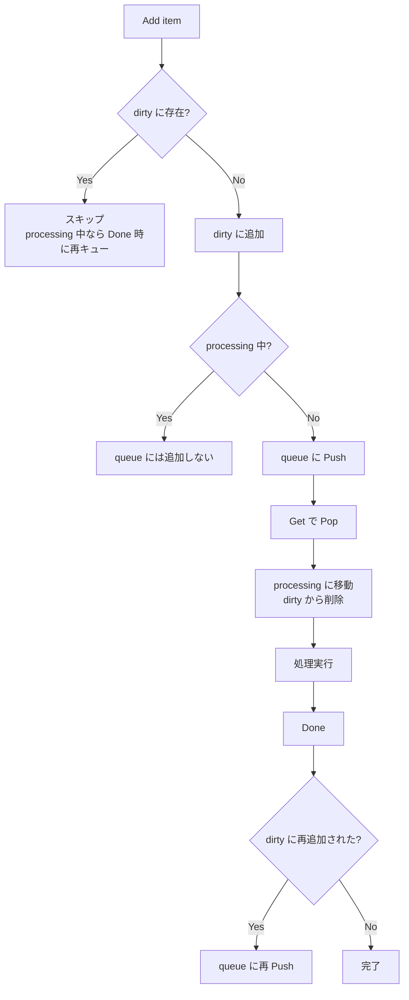

# 第19章 client-go と Informer

> 本章で読むソース
>
> - [staging/src/k8s.io/client-go/tools/cache/reflector.go L105-L171](https://github.com/kubernetes/kubernetes/blob/v1.36.2/staging/src/k8s.io/client-go/tools/cache/reflector.go#L105-L171)（Reflector 構造体）
> - [staging/src/k8s.io/client-go/tools/cache/reflector.go L458-L509](https://github.com/kubernetes/kubernetes/blob/v1.36.2/staging/src/k8s.io/client-go/tools/cache/reflector.go#L458-L509)（ListAndWatchWithContext）
> - [staging/src/k8s.io/client-go/tools/cache/delta_fifo.go L108-L158](https://github.com/kubernetes/kubernetes/blob/v1.36.2/staging/src/k8s.io/client-go/tools/cache/delta_fifo.go#L108-L158)（DeltaFIFO 構造体）
> - [staging/src/k8s.io/client-go/tools/cache/delta_fifo.go L480-L541](https://github.com/kubernetes/kubernetes/blob/v1.36.2/staging/src/k8s.io/client-go/tools/cache/delta_fifo.go#L480-L541)（queueActionInternalLocked）
> - [staging/src/k8s.io/client-go/tools/cache/shared_informer.go L575-L638](https://github.com/kubernetes/kubernetes/blob/v1.36.2/staging/src/k8s.io/client-go/tools/cache/shared_informer.go#L575-L638)（sharedIndexInformer 構造体）
> - [staging/src/k8s.io/client-go/tools/cache/shared_informer.go L719-L783](https://github.com/kubernetes/kubernetes/blob/v1.36.2/staging/src/k8s.io/client-go/tools/cache/shared_informer.go#L719-L783)（RunWithContext）
> - [staging/src/k8s.io/client-go/tools/cache/controller.go L114-L261](https://github.com/kubernetes/kubernetes/blob/v1.36.2/staging/src/k8s.io/client-go/tools/cache/controller.go#L114-L261)（controller と processLoop）
> - [staging/src/k8s.io/client-go/util/workqueue/queue.go L190-L302](https://github.com/kubernetes/kubernetes/blob/v1.36.2/staging/src/k8s.io/client-go/util/workqueue/queue.go#L190-L302)（Typed 構造体と Add/Get/Done）

## この章の狙い

Kubernetes のコントロールプレーンにおいて、コンポーネント間の状態同期は中核的な課題である。
kube-apiserver が etcd に持つ唯一の正（source of truth）に対し、各コントローラや外部クライアントはローカルキャッシュを保持し、差分イベントを受け取りながら整合性を維持する。
この「クライアント側の watch 機構」を実現するのが client-go の Informer である。

本章では Reflector による List+Watch、DeltaFIFO によるイベントキューイング、SharedInformer によるイベントハンドラ配送、WorkQueue の二重管理機構を順に読み、クライアントがどのように API サーバーと非同期に同期するかを明らかにする。

## 前提

- 第5章で kube-apiserver の watch メカニズム（etcd cacher からのイベントストリーム）を読んだ。
- Go のチャネル、goroutine、sync パッケージの基礎知識がある。

## Reflector による API サーバーとの通信

**Reflector** は API サーバーに対する List と Watch を担当する構造体である。
API サーバーからオブジェクトの一覧を取得し（List）、以降の差分をストリームで受け取る（Watch）。
取得したイベントは `store`（実際には DeltaFIFO）に書き込まれる。

[staging/src/k8s.io/client-go/tools/cache/reflector.go L105-L171](https://github.com/kubernetes/kubernetes/blob/v1.36.2/staging/src/k8s.io/client-go/tools/cache/reflector.go#L105-L171)

```go
// Reflector watches a specified resource and causes all changes to be reflected in the given store.
type Reflector struct {
    logger klog.Logger
    name string
    typeDescription string
    expectedType reflect.Type
    expectedGVK *schema.GroupVersionKind
    // The destination to sync up with the watch source
    store ReflectorStore
    // listerWatcher is used to perform lists and watches.
    listerWatcher ListerWatcherWithContext
    // delay returns the next backoff interval for retries.
    resyncPeriod time.Duration
    delayHandler wait.DelayFunc
    // minWatchTimeout defines the minimum timeout for watch requests.
    minWatchTimeout time.Duration
    // ...
}
```

`store` は `ReflectorStore` インターフェースを満たす DeltaFIFO である。
`listerWatcher` は API サーバーへの List/Watch リクエストを発行する。
`delayHandler` は指数バックオフによるリトライ間隔を返す。

### ListAndWatch の流れ

`ListAndWatchWithContext` は Reflector のメインロジックである。

[staging/src/k8s.io/client-go/tools/cache/reflector.go L470-L509](https://github.com/kubernetes/kubernetes/blob/v1.36.2/staging/src/k8s.io/client-go/tools/cache/reflector.go#L470-L509)

```go
func (r *Reflector) ListAndWatchWithContext(ctx context.Context) error {
    logger := klog.FromContext(ctx)
    logger.V(3).Info("Listing and watching", "type", r.typeDescription, "reflector", r.name)
    var err error
    var w watch.Interface
    fallbackToList := !r.useWatchList

    defer func() {
        if w != nil {
            w.Stop()
        }
    }()

    if r.useWatchList {
        w, err = r.watchList(ctx)
        // ...
    }

    if fallbackToList {
        err = r.list(ctx)
        if err != nil {
            return err
        }
    }

    logger.V(2).Info("Caches populated", "type", r.typeDescription, "reflector", r.name)
    return r.watchWithResync(ctx, w)
}
```

まず `useWatchList` フラグが有効なら WatchList（ストリーミングによる初期データ取得）を試みる。
無効なら従来の `list` によるページング取得にフォールバックする。
いずれにせよキャッシュが満たされた後、`watchWithResync` で Watch ストリームを張り、バックグラウンドで定期 resync を開始する。

### WatchList と従来の List の使い分け

WatchList（KEP-3157）は、初期一覧を個別の List リクエストではなく Watch ストリームの synthetic Added イベントで受け取る方式である。
サーバー側のリソース消費を抑えられる利点がある。

[staging/src/k8s.io/client-go/tools/cache/reflector.go L785-L803](https://github.com/kubernetes/kubernetes/blob/v1.36.2/staging/src/k8s.io/client-go/tools/cache/reflector.go#L785-L803)

```go
// watchList establishes a stream to get a consistent snapshot of data
// from the server as described in https://github.com/kubernetes/enhancements/tree/master/keps/sig-api-machinery/3157-watch-list#proposal
//
// case 1: start at Most Recent (RV="", ResourceVersionMatch=ResourceVersionMatchNotOlderThan)
// Establishes a consistent stream with the server.
// That means the returned data is consistent, as if, served directly from etcd via a quorum read.
// It begins with synthetic "Added" events of all resources up to the most recent ResourceVersion.
// It ends with a synthetic "Bookmark" event containing the most recent ResourceVersion.
// After receiving a "Bookmark" event the reflector is considered to be synchronized.
// It replaces its internal store with the collected items and
// reuses the current watch requests for getting further events.
```

Bookmark イベントを受信するまで一時ストアにデータを蓄積し、受信後にまとめてストアへ置き換える。
これにより、List と Watch の間に発生しうるイベントの取りこぼしを構造的に防げる。

### 指数バックオフによるリトライ

Watch が切断された場合、Reflector は指数バックオフでリトライする。

[staging/src/k8s.io/client-go/tools/cache/reflector.go L54-L67](https://github.com/kubernetes/kubernetes/blob/v1.36.2/staging/src/k8s.io/client-go/tools/cache/reflector.go#L54-L67)

```go
var (
    // We try to spread the load on apiserver by setting timeouts for
    // watch requests - it is random in [minWatchTimeout, 2*minWatchTimeout].
    defaultMinWatchTimeout = 5 * time.Minute
    defaultMaxWatchTimeout = 2 * defaultMinWatchTimeout
    // We used to make the call every 1sec (1 QPS), the goal here is to achieve ~98% traffic reduction when
    // API server is not healthy. With these parameters, backoff will stop at [30,60) sec interval which is
    // 0.22 QPS.
    defaultBackoffInit = 800 * time.Millisecond
    defaultBackoffMax  = 30 * time.Second
    // If we don't backoff for 2min, assume API server is healthy and we reset the backoff.
    defaultBackoffReset  = 2 * time.Minute
    defaultBackoffFactor = 2.0
    defaultBackoffJitter = 1.0
)
```

初期 800ms、最大 30 秒、_factor 2.0、_jitter 1.0 という設定は、API サーバーが不健康なときにトラフィックを約 98% 削減するという明確な目標に基づいている。
2 分間バックオフが起きなければ API サーバーが健全とみなしてバックオフをリセットする。

## DeltaFIFO によるイベントキューイング

**DeltaFIFO** は Reflector（生産者）と controller（消費者）の間に入るイベントキューである。
オブジェクトごとに `Deltas`（変更履歴のスライス）を保持し、FIFO 順で Pop する。

[staging/src/k8s.io/client-go/tools/cache/delta_fifo.go L108-L158](https://github.com/kubernetes/kubernetes/blob/v1.36.2/staging/src/k8s.io/client-go/tools/cache/delta_fifo.go#L108-L158)

```go
type DeltaFIFO struct {
    logger klog.Logger
    name string

    // lock/cond protects access to 'items' and 'queue'.
    lock sync.RWMutex
    cond sync.Cond

    // `items` maps a key to a Deltas.
    // Each such Deltas has at least one Delta.
    items map[string]Deltas

    // `queue` maintains FIFO order of keys for consumption in Pop().
    // There are no duplicates in `queue`.
    // A key is in `queue` if and only if it is in `items`.
    queue []string

    // ...
    keyFunc KeyFunc

    // knownObjects list keys that are "known" --- affecting Delete(),
    // Replace(), and Resync()
    knownObjects KeyListerGetter

    // ...
    transformer TransformFunc
}
```

`items` はキーから `Deltas` へのマップであり、同じオブジェクトに対する複数イベントを1箇所にまとめる。
`queue` はキーの FIFO 順序を保持する。
`knownObjects` は SharedInformer のローカルキャッシュ（Indexer）への参照であり、Replace 時の削除検出に使う。

### DeltaType の種類

[staging/src/k8s.io/client-go/tools/cache/delta_fifo.go L178-L208](https://github.com/kubernetes/kubernetes/blob/v1.36.2/staging/src/k8s.io/client-go/tools/cache/delta_fifo.go#L178-L208)

```go
const (
    Added   DeltaType = "Added"
    Updated DeltaType = "Updated"
    Deleted DeltaType = "Deleted"
    Replaced DeltaType = "Replaced"
    ReplacedAll DeltaType = "ReplacedAll"
    Sync DeltaType = "Sync"
    SyncAll DeltaType = "SyncAll"
    Bookmark DeltaType = "Bookmark"
)
```

`Added`/`Updated`/`Deleted` は API サーバーからの Watch イベントに対応する。
`Replaced` は再 List 時に発行される。
`Sync` は定期 resync 用の合成イベントである。

### queueActionInternalLocked での重複圧縮

DeltaFIFO の重要な最適化が、同一オブジェクトに対するイベントの重複圧縮である。

[staging/src/k8s.io/client-go/tools/cache/delta_fifo.go L491-L541](https://github.com/kubernetes/kubernetes/blob/v1.36.2/staging/src/k8s.io/client-go/tools/cache/delta_fifo.go#L491-L541)

```go
func (f *DeltaFIFO) queueActionInternalLocked(actionType, internalActionType DeltaType, obj interface{}) error {
    id, err := f.KeyOf(obj)
    if err != nil {
        return KeyError{obj, err}
    }

    // Every object comes through this code path once, so this is a good
    // place to call the transform func.
    if f.transformer != nil {
        _, isTombstone := obj.(DeletedFinalStateUnknown)
        if !isTombstone && internalActionType != Sync {
            var err error
            obj, err = f.transformer(obj)
            if err != nil {
                return err
            }
        }
    }

    oldDeltas := f.items[id]
    newDeltas := append(oldDeltas, Delta{actionType, obj})
    newDeltas = dedupDeltas(newDeltas)

    if len(newDeltas) > 0 {
        if _, exists := f.items[id]; !exists {
            f.queue = append(f.queue, id)
        }
        f.items[id] = newDeltas
        f.cond.Broadcast()
    }
    // ...
}
```

`dedupDeltas` は末尾2つの Delta が同じ種類（特に Deleted 同士）の場合に圧縮する。
これにより、Watch の再接続時に同じ削除イベントが重複して届いても、下流には1回だけ届く。
`transformer` はオブジェクトがキューに入る前に1回だけ呼ばれ、不要なフィールドを削ってメモリ使用量を抑える。

### Replace による削除検出

`Replace` は再 List の結果を DeltaFIFO に投入する際、既存オブジェクトとの差分から削除を検出する。

[staging/src/k8s.io/client-go/tools/cache/delta_fifo.go L610-L699](https://github.com/kubernetes/kubernetes/blob/v1.36.2/staging/src/k8s.io/client-go/tools/cache/delta_fifo.go#L610-L699)

```go
func (f *DeltaFIFO) Replace(list []interface{}, _ string) error {
    f.lock.Lock()
    defer f.lock.Unlock()
    keys := make(sets.Set[string], len(list))

    action := Sync
    if f.emitDeltaTypeReplaced {
        action = Replaced
    }

    for _, item := range list {
        key, err := f.KeyOf(item)
        if err != nil {
            return KeyError{item, err}
        }
        keys.Insert(key)
        if err := f.queueActionInternalLocked(action, Replaced, item); err != nil {
            return fmt.Errorf("couldn't enqueue object: %v", err)
        }
    }

    // Do deletion detection against objects in the queue
    queuedDeletions := 0
    for k, oldItem := range f.items {
        if keys.Has(k) {
            continue
        }
        // Delete pre-existing items not in the new list.
        // ...
        queuedDeletions++
        if err := f.queueActionLocked(Deleted, DeletedFinalStateUnknown{k, deletedObj}); err != nil {
            return err
        }
    }
    // ...
}
```

新しい一覧にないキーは `DeletedFinalStateUnknown` でラップされ、削除イベントとしてキューに入る。
これにより Watch イベントの取りこぼしによる「見えない削除」を防ぐ。

## SharedInformer によるイベントハンドラ管理

**SharedInformer** は DeltaFIFO の Pop 結果を受け取り、ローカルキャッシュ（Indexer）を更新し、登録されたイベントハンドラに通知する。
「Shared」の名が示す通り、同じリソースに対する複数のハンドラを1つの Informer で共有できる。

[staging/src/k8s.io/client-go/tools/cache/shared_informer.go L575-L638](https://github.com/kubernetes/kubernetes/blob/v1.36.2/staging/src/k8s.io/client-go/tools/cache/shared_informer.go#L575-L638)

```go
// `*sharedIndexInformer` implements SharedIndexInformer and has three
// main components.  One is an indexed local cache, `indexer Indexer`.
// The second main component is a Controller that pulls
// objects/notifications using the ListerWatcher and pushes them into
// a DeltaFIFO --- whose knownObjects is the informer's local cache
// --- while concurrently Popping Deltas values from that fifo and
// processing them with `sharedIndexInformer::HandleDeltas`.  Each
// invocation of HandleDeltas, which is done with the fifo's lock
// held, processes each Delta in turn.  For each Delta this both
// updates the local cache and stuffs the relevant notification into
// the sharedProcessor.  The third main component is that
// sharedProcessor, which is responsible for relaying those
// notifications to each of the informer's clients.
type sharedIndexInformer struct {
    indexer    Indexer
    controller Controller

    synced chan struct{}

    processor             *sharedProcessor
    cacheMutationDetector MutationDetector

    listerWatcher ListerWatcher
    objectType    runtime.Object
    // ...
}
```

3つのコンポーネントが明確に分かれている。

1. **Indexer**: ローカルキャッシュ。キーによる高速検索とインデックス機能を備える。
2. **Controller**: Reflector と DeltaFIFO を束ね、List+Watch と Pop/Process を駆動する。
3. **sharedProcessor**: イベントハンドラの集合。通知を配送する。

### RunWithContext での起動シーケンス

[staging/src/k8s.io/client-go/tools/cache/shared_informer.go L719-L783](https://github.com/kubernetes/kubernetes/blob/v1.36.2/staging/src/k8s.io/client-go/tools/cache/shared_informer.go#L719-L783)

```go
func (s *sharedIndexInformer) RunWithContext(ctx context.Context) {
    defer utilruntime.HandleCrashWithContext(ctx)
    logger := klog.FromContext(ctx)

    // ...

    func() {
        s.startedLock.Lock()
        defer s.startedLock.Unlock()

        logger, fifo := newQueueFIFO(logger, s.objectType, s.indexer, s.transform, s.identifier, s.informerMetricsProvider)

        cfg := &Config{
            Queue:             fifo,
            ListerWatcher:     s.listerWatcher,
            ObjectType:        s.objectType,
            ObjectDescription: s.objectDescription,
            FullResyncPeriod:  s.resyncCheckPeriod,
            ShouldResync:      s.processor.shouldResync,

            Process: func(obj interface{}, isInInitialList bool) error {
                return s.handleDeltas(logger, obj, isInInitialList)
            },
            // ...
        }

        s.controller = New(cfg)
        // ...
    }()

    // ...
    wg.StartWithContext(processorStopCtx, s.processor.run)
    // ...
    s.controller.RunWithContext(ctx)
}
```

`Config.Process` に関数として渡される `handleDeltas` は、DeltaFIFO から Pop された Deltas を処理し、Indexer の更新と sharedProcessor への通知を行う。

### controller の processLoop

`controller` は Reflector と DeltaFIFO の Pop を駆動する。

[staging/src/k8s.io/client-go/tools/cache/controller.go L170-L261](https://github.com/kubernetes/kubernetes/blob/v1.36.2/staging/src/k8s.io/client-go/tools/cache/controller.go#L170-L261)

```go
func (c *controller) RunWithContext(ctx context.Context) {
    defer utilruntime.HandleCrashWithContext(ctx)
    go func() {
        <-ctx.Done()
        c.config.Queue.Close()
    }()
    // ...
    r := NewReflectorWithOptions(
        c.config.ListerWatcher,
        c.config.ObjectType,
        c.config.Queue,
        // ...
    )
    // ...

    var wg wait.Group

    wg.StartWithContext(ctx, r.RunWithContext)

    wait.UntilWithContext(ctx, c.processLoop, time.Second)
    wg.Wait()
}

func (c *controller) processLoop(ctx context.Context) {
    // ...
    for {
        select {
        case <-ctx.Done():
            return
        default:
            var err error
            // ...
            _, err = c.config.Pop(PopProcessFunc(c.config.Process))
            // ...
        }
    }
}
```

Reflector は DeltaFIFO にイベントを Push し、processLoop は DeltaFIFO から Pop して `Process`（= `handleDeltas`）を呼ぶ。
この2つが独立した goroutine で動くことで、List+Watch の継続とイベント処理が並行に進む。

### sharedProcessor による通知配送

`sharedProcessor` は `processorListener` の集合体であり、イベントを各ハンドラに配送する。

[staging/src/k8s.io/client-go/tools/cache/shared_informer.go L1023-L1031](https://github.com/kubernetes/kubernetes/blob/v1.36.2/staging/src/k8s.io/client-go/tools/cache/shared_informer.go#L1023-L1031)

```go
type sharedProcessor struct {
    listenersStarted bool
    listenersLock    sync.RWMutex
    listenersRCond   *sync.Cond
    listeners map[*processorListener]bool
    clock     clock.Clock
    wg        wait.Group
}
```

各 `processorListener` は3つの goroutine（`add`/`pop`/`run`）とリングバッファで構成され、遅いハンドラが他をブロックしないように設計されている。

[staging/src/k8s.io/client-go/tools/cache/shared_informer.go L1195-L1254](https://github.com/kubernetes/kubernetes/blob/v1.36.2/staging/src/k8s.io/client-go/tools/cache/shared_informer.go#L1195-L1254)

```go
// processorListener relays notifications from a sharedProcessor to
// one ResourceEventHandler --- using three goroutines, two unbuffered
// channels, and an unbounded ring buffer.  The `add(notification)`
// function sends the given notification to `addCh`.  One goroutine
// runs `pop()`, which pumps notifications from `addCh` to `nextCh`
// using storage in the ring buffer while `nextCh` is not keeping up.
// Another goroutine runs `run()`, which receives notifications from
// `nextCh` and synchronously invokes the appropriate handler method.
type processorListener struct {
    logger klog.Logger
    nextCh chan interface{}
    addCh  chan interface{}
    done   chan struct{}

    handler     ResourceEventHandler
    handlerName string

    syncTracker       *synctrack.SingleFileTracker
    upstreamHasSynced DoneChecker

    pendingNotifications buffer.RingGrowing
    // ...
}
```

`addCh`（無バッファ）に通知を送ると、`pop` goroutine がリングバッファ `pendingNotifications` 経由で `nextCh` に流し、`run` goroutine がハンドラの `OnAdd`/`OnUpdate`/`OnDelete` を同期的に呼ぶ。
リングバッファが伸びる構造になっているため、遅いハンドラがあっても他のハンドラや Reflector には影響しない。

## resync による定期再同期

resync は Watch イベントでは見えない不整合を修復する安全網である。
`Reflector.startResync` が定期的に `store.Resync()` を呼び、DeltaFIFO が `knownObjects`（= Indexer）の全キーに対して `Sync` タイプの Delta を生成する。

[staging/src/k8s.io/client-go/tools/cache/reflector.go L511-L536](https://github.com/kubernetes/kubernetes/blob/v1.36.2/staging/src/k8s.io/client-go/tools/cache/reflector.go#L511-L536)

```go
func (r *Reflector) startResync(ctx context.Context, resyncerrc chan error) {
    logger := klog.FromContext(ctx)
    resyncCh, cleanup := r.resyncChan()
    defer func() {
        cleanup()
    }()
    for {
        select {
        case <-resyncCh:
        case <-ctx.Done():
            return
        }
        if r.ShouldResync == nil || r.ShouldResync() {
            logger.V(4).Info("Forcing resync", "reflector", r.name)
            if err := r.store.Resync(); err != nil {
                resyncerrc <- err
                return
            }
        }
        cleanup()
        resyncCh, cleanup = r.resyncChan()
    }
}
```

`ShouldResync` は `sharedProcessor.shouldResync` に委譲され、各 listener の resync 期間をチェックする。
resync が必要なければ `store.Resync()` を呼ばないため、無駄なイベント生成を抑えられる。

DeltaFIFO の `Resync` は `knownObjects` の全キーを走査し、まだキューに入っていないキーに対して `Sync` Delta を追加する。

[staging/src/k8s.io/client-go/tools/cache/delta_fifo.go L704-L747](https://github.com/kubernetes/kubernetes/blob/v1.36.2/staging/src/k8s.io/client-go/tools/cache/delta_fifo.go#L704-L747)

```go
func (f *DeltaFIFO) Resync() error {
    f.lock.Lock()
    defer f.lock.Unlock()

    if f.knownObjects == nil {
        return nil
    }

    keys := f.knownObjects.ListKeys()
    for _, k := range keys {
        if err := f.syncKeyLocked(k); err != nil {
            return err
        }
    }
    return nil
}

func (f *DeltaFIFO) syncKeyLocked(key string) error {
    obj, exists, err := f.knownObjects.GetByKey(key)
    // ...
    if len(f.items[id]) > 0 {
        return nil
    }

    if err := f.queueActionLocked(Sync, obj); err != nil {
        return fmt.Errorf("couldn't queue object: %v", err)
    }
    return nil
}
```

すでにキューにイベントがあるオブジェクトは resync をスキップする（`len(f.items[id]) > 0` のチェック）。
これにより、最新の Watch イベントが処理待ちのオブジェクトに対して古い resync イベントが追加されるのを防ぐ。

## WorkQueue の dirty set と processing set

Informer からイベントを受け取ったコントローラは、実際の処理を **WorkQueue** にキューイングする。
WorkQueue の特徴は `dirty` set と `processing` set の二重管理にある。

[staging/src/k8s.io/client-go/util/workqueue/queue.go L190-L222](https://github.com/kubernetes/kubernetes/blob/v1.36.2/staging/src/k8s.io/client-go/util/workqueue/queue.go#L190-L222)

```go
type Typed[t comparable] struct {
    // queue defines the order in which we will work on items. Every
    // element of queue should be in the dirty set and not in the
    // processing set.
    queue Queue[t]

    // dirty defines all of the items that need to be processed.
    dirty sets.Set[t]

    // Things that are currently being processed are in the processing set.
    // These things may be simultaneously in the dirty set. When we finish
    // processing something and remove it from this set, we'll check if
    // it's in the dirty set, and if so, add it to the queue.
    processing sets.Set[t]

    cond *sync.Cond
    // ...
}
```

`dirty` は「処理が必要なアイテムの集合」、`processing` は「現在処理中のアイテムの集合」である。
`queue` は順序付きのキュー本体で、`dirty` に含まれるかつ `processing` に含まれないアイテムだけが入る。

### Add: 重複排除

[staging/src/k8s.io/client-go/util/workqueue/queue.go L227-L251](https://github.com/kubernetes/kubernetes/blob/v1.36.2/staging/src/k8s.io/client-go/util/workqueue/queue.go#L227-L251)

```go
func (q *Typed[T]) Add(item T) {
    q.cond.L.Lock()
    defer q.cond.L.Unlock()
    if q.shuttingDown {
        return
    }
    if q.dirty.Has(item) {
        if !q.processing.Has(item) {
            q.queue.Touch(item)
        }
        return
    }

    q.metrics.add(item)

    q.dirty.Insert(item)
    if q.processing.Has(item) {
        return
    }

    q.queue.Push(item)
    q.cond.Signal()
}
```

すでに `dirty` にあるアイテムはキューに追加しない。
処理中に再度 Add された場合は `dirty` に追加するだけで、`Done` 呼び出し時に再キューイングされる。
これにより、同じオブジェクトに対する重複処理を防ぎつつ、最新の変更を取りこぼさない。

### Get と Done の連携

[staging/src/k8s.io/client-go/util/workqueue/queue.go L265-L302](https://github.com/kubernetes/kubernetes/blob/v1.36.2/staging/src/k8s.io/client-go/util/workqueue/queue.go#L265-L302)

```go
func (q *Typed[T]) Get() (item T, shutdown bool) {
    q.cond.L.Lock()
    defer q.cond.L.Unlock()
    for q.queue.Len() == 0 && !q.shuttingDown {
        q.cond.Wait()
    }
    // ...
    item = q.queue.Pop()

    q.metrics.get(item)

    q.processing.Insert(item)
    q.dirty.Delete(item)

    return item, false
}

func (q *Typed[T]) Done(item T) {
    q.cond.L.Lock()
    defer q.cond.L.Unlock()

    q.metrics.done(item)

    q.processing.Delete(item)
    if q.dirty.Has(item) {
        q.queue.Push(item)
        q.cond.Signal()
    }
    // ...
}
```

`Get` でアイテムを `processing` に移し `dirty` から削除する。
`Done` で `processing` から削除し、その間に `dirty` に再追加されていれば `queue` に戻す。
この仕組みにより、「処理中に更新イベントが来た」場合に処理完了後ただちに再処理キューに入る。



## まとめ

Informer のデータフローは Reflector → DeltaFIFO → Controller → sharedIndexInformer → sharedProcessor → processorListener という一方向のパイプラインである。
各層が独立した goroutine で動作し、チャネルとリングバッファで接続されることで、API サーバーからのイベントストリームとローカルでの処理が完全に非同期で進む。

高速化の観点では、DeltaFIFO の `dedupDeltas` による重複圧縮、`transformer` によるメモリ削減、WorkQueue の dirty/processing 二重管理による重複処理防止が挙げられる。
これらは大規模クラスターで数万のオブジェクトを扱う際に、クライアント側の CPU とメモリ消費を抑える仕組みである。

## 関連する章

- 第5章（API リクエスト処理）: API サーバー側の watch メカニズム
- 第9章（kube-controller-manager）: Informer を使うコントローラ側の処理
- 第20章（CRD と Aggregation）: CRD でも Informer が使われる
