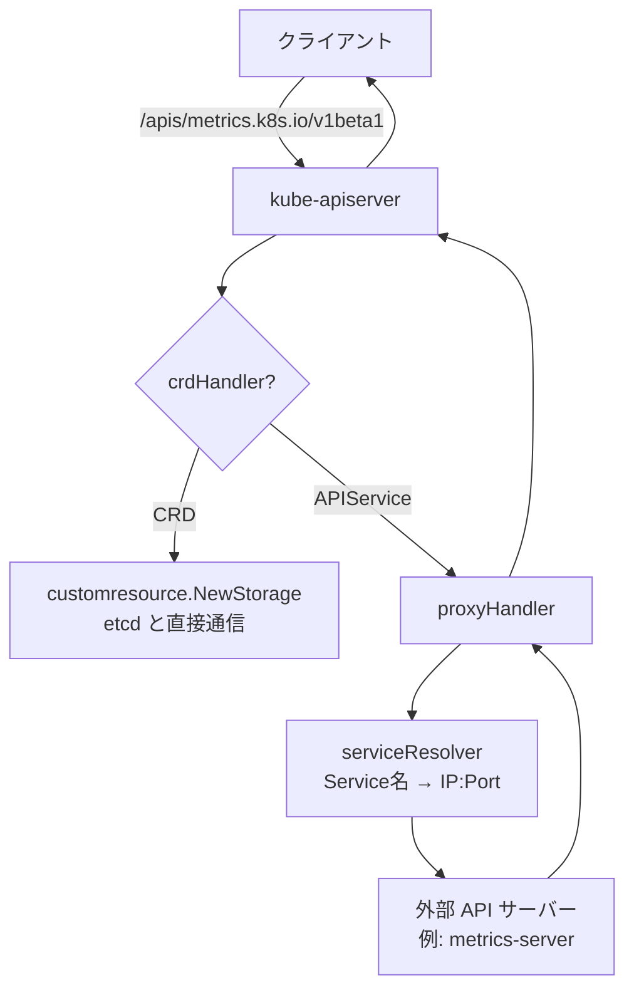

# 第20章 CRD と Aggregation

> 本章で読むソース
>
> - [staging/src/k8s.io/apiextensions-apiserver/pkg/apiserver/customresource_handler.go L89-L133](https://github.com/kubernetes/kubernetes/blob/v1.36.2/staging/src/k8s.io/apiextensions-apiserver/pkg/apiserver/customresource_handler.go#L89-L133)（crdHandler 構造体）
> - [staging/src/k8s.io/apiextensions-apiserver/pkg/apiserver/customresource_handler.go L228-L366](https://github.com/kubernetes/kubernetes/blob/v1.36.2/staging/src/k8s.io/apiextensions-apiserver/pkg/apiserver/customresource_handler.go#L228-L366)（ServeHTTP）
> - [staging/src/k8s.io/apiextensions-apiserver/pkg/apiserver/customresource_handler.go L614-L886](https://github.com/kubernetes/kubernetes/blob/v1.36.2/staging/src/k8s.io/apiextensions-apiserver/pkg/apiserver/customresource_handler.go#L614-L886)（getOrCreateServingInfoFor）
> - [staging/src/k8s.io/kube-aggregator/pkg/apiserver/apiserver.go L145-L193](https://github.com/kubernetes/kubernetes/blob/v1.36.2/staging/src/k8s.io/kube-aggregator/pkg/apiserver/apiserver.go#L145-L193)（APIAggregator 構造体）
> - [staging/src/k8s.io/kube-aggregator/pkg/apiserver/apiserver.go L521-L597](https://github.com/kubernetes/kubernetes/blob/v1.36.2/staging/src/k8s.io/kube-aggregator/pkg/apiserver/apiserver.go#L521-L597)（AddAPIService）
> - [staging/src/k8s.io/kube-aggregator/pkg/apiserver/handler_proxy.go L49-L188](https://github.com/kubernetes/kubernetes/blob/v1.36.2/staging/src/k8s.io/kube-aggregator/pkg/apiserver/handler_proxy.go#L49-L188)（proxyHandler）

## この章の狙い

Kubernetes はビルトインのリソース（Pod, Service など）だけでなく、ユーザーが独自のリソースを定義できる。
この拡張性を支える2つの仕組みが **CRD**（Custom Resource Definition）と **API Aggregation** である。
本章では、CRD がどのように動的に HTTP ハンドラを生成し、Aggregation がどのように外部 API サーバーを透過プロキシするかをソースコードから明らかにする。

## 前提

- 第3章（kube-apiserver のアーキテクチャ）で genericapiserver のハンドラチェーンを読んだ。
- 第5章（API リクエスト処理）でリクエストルーティングの仕組みを理解している。

## CRD ハンドラの動的生成

### crdHandler の全体像

`crdHandler` は `/apis` 配下にマウントされる `http.Handler` であり、登録済みの CRD ごとにリクエストをさばく。

[staging/src/k8s.io/apiextensions-apiserver/pkg/apiserver/customresource_handler.go L89-L133](https://github.com/kubernetes/kubernetes/blob/v1.36.2/staging/src/k8s.io/apiextensions-apiserver/pkg/apiserver/customresource_handler.go#L89-L133)

```go
type crdHandler struct {
    versionDiscoveryHandler *versionDiscoveryHandler
    groupDiscoveryHandler   *groupDiscoveryHandler

    customStorageLock sync.Mutex
    // customStorage contains a crdStorageMap
    // atomic.Value has a very good read performance compared to sync.RWMutex
    // see https://gist.github.com/dim/152e6bf80e1384ea72e17ac717a5000a
    // which is suited for most read and rarely write cases
    customStorage atomic.Value

    crdLister listers.CustomResourceDefinitionLister

    delegate          http.Handler
    restOptionsGetter generic.RESTOptionsGetter
    admission         admission.Interface

    establishingController *establish.EstablishingController

    // MasterCount is used to implement sleep to improve
    // CRD establishing process for HA clusters.
    masterCount int

    converterFactory *conversion.CRConverterFactory

    // so that we can do create on update.
    authorizer authorizer.Authorizer

    // request timeout we should delay storage teardown for
    requestTimeout time.Duration

    // minRequestTimeout applies to CR's list/watch calls
    minRequestTimeout time.Duration

    // staticOpenAPISpec is used as a base for the schema of CR's for the
    // purpose of managing fields, it is how CR handlers get the structure
    // of TypeMeta and ObjectMeta
    staticOpenAPISpec map[string]*spec.Schema

    // The limit on the request size that would be accepted and decoded in a write request
    // 0 means no limit.
    maxRequestBodyBytes int64
}
```

`customStorage` は `atomic.Value` に包まれた `crdStorageMap`（`map[types.UID]*crdInfo`）である。
読み取りはロック不要で、書き込み時だけ `customStorageLock` を取る。
CRD の読み取りはリクエストごとに高頻度で起きるが、書き込み（CRD の作成/更新/削除）は稀だからだ。

### ServeHTTP のルーティング

リクエストが来ると、`crdHandler` は以下の順序でルーティングを判定する。

[staging/src/k8s.io/apiextensions-apiserver/pkg/apiserver/customresource_handler.go L228-L366](https://github.com/kubernetes/kubernetes/blob/v1.36.2/staging/src/k8s.io/apiextensions-apiserver/pkg/apiserver/customresource_handler.go#L228-L366)

```go
func (r *crdHandler) ServeHTTP(w http.ResponseWriter, req *http.Request) {
    ctx := req.Context()
    requestInfo, ok := apirequest.RequestInfoFrom(ctx)
    if !ok {
        responsewriters.ErrorNegotiated(
            apierrors.NewInternalError(fmt.Errorf("no RequestInfo found in the context")),
            Codecs, schema.GroupVersion{}, w, req,
        )
        return
    }
    if !requestInfo.IsResourceRequest {
        pathParts := splitPath(requestInfo.Path)
        // only match /apis/<group>/<version>
        if len(pathParts) == 3 {
            r.versionDiscoveryHandler.ServeHTTP(w, req)
            return
        }
        // only match /apis/<group>
        if len(pathParts) == 2 {
            r.groupDiscoveryHandler.ServeHTTP(w, req)
            return
        }

        r.delegate.ServeHTTP(w, req)
        return
    }

    crdName := requestInfo.Resource + "." + requestInfo.APIGroup
    crd, err := r.crdLister.Get(crdName)
    if apierrors.IsNotFound(err) {
        r.delegate.ServeHTTP(w, req)
        return
    }
    // ...

    crdInfo, err := r.getOrCreateServingInfoFor(crd.UID, crd.Name)
    // ...

    verb := strings.ToUpper(requestInfo.Verb)
    resource := requestInfo.Resource
    subresource := requestInfo.Subresource
    // ...
    switch {
    case subresource == "status" && subresources != nil && subresources.Status != nil:
        handlerFunc = r.serveStatus(w, req, requestInfo, crdInfo, terminating, supportedTypes)
    case subresource == "scale" && subresources != nil && subresources.Scale != nil:
        handlerFunc = r.serveScale(w, req, requestInfo, crdInfo, terminating, supportedTypes)
    case len(subresource) == 0:
        handlerFunc = r.serveResource(w, req, requestInfo, crdInfo, crd, terminating, supportedTypes)
    default:
        // ...
    }

    if handlerFunc != nil {
        handlerFunc = metrics.InstrumentHandlerFunc(verb, ...)
        handler := genericfilters.WithWaitGroup(handlerFunc, longRunningFilter, crdInfo.waitGroup)
        handler.ServeHTTP(w, req)
        return
    }
}
```

1. リソースリクエストでなければ、discovery エンドポイントか delegate に委譲。
2. CRD 名（`<resource>.<group>`）で Lister から検索し、見つからなければ delegate に委譲（404 相当）。
3. `getOrCreateServingInfoFor` でストレージ情報を取得または動的生成する。
4. サブリソース（`status`、`scale`）か本体かに応じてハンドラを振り分ける。

### getOrCreateServingInfoFor でのストレージ構築

このメソッドは CRD の仕様から実行時の HTTP ハンドラを生成する核心部分である。

[staging/src/k8s.io/apiextensions-apiserver/pkg/apiserver/customresource_handler.go L614-L636](https://github.com/kubernetes/kubernetes/blob/v1.36.2/staging/src/k8s.io/apiextensions-apiserver/pkg/apiserver/customresource_handler.go#L614-L636)

```go
func (r *crdHandler) getOrCreateServingInfoFor(uid types.UID, name string) (*crdInfo, error) {
    storageMap := r.customStorage.Load().(crdStorageMap)
    if ret, ok := storageMap[uid]; ok {
        return ret, nil
    }

    r.customStorageLock.Lock()
    defer r.customStorageLock.Unlock()

    // Get the up-to-date CRD when we have the lock, to avoid racing with updateCustomResourceDefinition.
    crd, err := r.crdLister.Get(name)
    if err != nil {
        return nil, err
    }
    storageMap = r.customStorage.Load().(crdStorageMap)
    if ret, ok := storageMap[crd.UID]; ok {
        return ret, nil
    }
    // ...
}
```

まず `atomic.Value` からキャッシュを読み、ヒットすれば即座に返す（ロック不要の高速パス）。
ミスした場合のみロックを取得し、二重チェックしてからストレージを構築する。

ストレージ構築では以下を行う（L773-L886）。

1. 各バージョンごとに `parameterScheme`、`validator`、`structuralSchema` を生成。
2. `status`、`scale` サブリソースの仕様を構築。
3. `customresource.NewStorage` を呼び出し、REST ストレージ（etcd バックエンド）を生成。
4. JSON/YAML/protobuf の `negotiatedSerializer` を用意。

```go
storages[v.Name], err = customresource.NewStorage(
    resource.GroupResource(),
    singularResource.GroupResource(),
    kind,
    listKind,
    customresource.NewStrategy(
        typer,
        crd.Spec.Scope == apiextensionsv1.NamespaceScoped,
        kind,
        validator,
        statusValidator,
        structuralSchemas[v.Name],
        statusSpec,
        scaleSpec,
        v.SelectableFields,
    ),
    crdConversionRESTOptionsGetter{
        RESTOptionsGetter:     r.restOptionsGetter,
        converter:             safeConverter,
        decoderVersion:        schema.GroupVersion{Group: crd.Spec.Group, Version: v.Name},
        encoderVersion:        schema.GroupVersion{Group: crd.Spec.Group, Version: storageVersion},
        structuralSchemas:     structuralSchemas,
        structuralSchemaGK:    kind.GroupKind(),
        preserveUnknownFields: crd.Spec.PreserveUnknownFields,
    },
    crd.Status.AcceptedNames.Categories,
    table,
    replicasPathInCustomResource,
)
```

ビルトインリソースと CRD の違いは、このストレージがコンパイル時ではなく実行時に動的に作られる点だけである。
一度作られたストレージは `crdStorageMap` にキャッシュされ、以降のリクエストは同じインスタンスを再利用する。

### CRD 更新時のストレージ再生成

CRD の spec が変わると、`updateCustomResourceDefinition` が古いストレージを破棄する。

[staging/src/k8s.io/apiextensions-apiserver/pkg/apiserver/customresource_handler.go L477-L514](https://github.com/kubernetes/kubernetes/blob/v1.36.2/staging/src/k8s.io/apiextensions-apiserver/pkg/apiserver/customresource_handler.go#L477-L514)

```go
func (r *crdHandler) updateCustomResourceDefinition(oldObj, newObj interface{}) {
    oldCRD := oldObj.(*apiextensionsv1.CustomResourceDefinition)
    newCRD := newObj.(*apiextensionsv1.CustomResourceDefinition)

    r.customStorageLock.Lock()
    defer r.customStorageLock.Unlock()

    // ...

    storageMap := r.customStorage.Load().(crdStorageMap)
    oldInfo, found := storageMap[newCRD.UID]
    if !found {
        return
    }
    if apiequality.Semantic.DeepEqual(&newCRD.Spec, oldInfo.spec) && apiequality.Semantic.DeepEqual(&newCRD.Status.AcceptedNames, oldInfo.acceptedNames) {
        klog.V(6).Infof("Ignoring customresourcedefinition %s update because neither spec, nor accepted names changed", oldCRD.Name)
        return
    }

    klog.V(4).Infof("Updating customresourcedefinition %s", newCRD.Name)
    r.removeStorage_locked(newCRD.UID)
}
```

spec と acceptedNames が変わっていなければ無視し、変わっていれば `removeStorage_locked` でキャッシュから削除する。
次回リクエスト時に `getOrCreateServingInfoFor` が新しいストレージを再構築する。
古いストレージは `tearDown` で in-flight リクエストの完了を待ってから破棄される。

## API Aggregation による外部 API サーバーのプロキシ

### APIAggregator の構造

**API Aggregation** は、独立した API サーバーを kube-apiserver の下に透過的にマウントする仕組みである。

[staging/src/k8s.io/kube-aggregator/pkg/apiserver/apiserver.go L145-L193](https://github.com/kubernetes/kubernetes/blob/v1.36.2/staging/src/k8s.io/kube-aggregator/pkg/apiserver/apiserver.go#L145-L193)

```go
type APIAggregator struct {
    GenericAPIServer *genericapiserver.GenericAPIServer

    // provided for easier embedding
    APIRegistrationInformers informers.SharedInformerFactory

    delegateHandler http.Handler

    // proxyCurrentCertKeyContent holds he client cert used to identify this proxy. Backing APIServices use this to confirm the proxy's identity
    proxyCurrentCertKeyContent certKeyFunc
    proxyTransportDial         *transport.DialHolder

    // proxyHandlers are the proxy handlers that are currently registered, keyed by apiservice.name
    proxyHandlers map[string]*proxyHandler
    // handledGroupVersions contain the groups that already have routes. The key is the name of the group and the value
    // is the versions for the group.
    handledGroupVersions map[string]sets.Set[string]

    // lister is used to add group handling for /apis/<group> aggregator lookups based on
    // controller state
    lister listers.APIServiceLister

    // Information needed to determine routing for the aggregator
    serviceResolver ServiceResolver

    // ...
}
```

`proxyHandlers` は APIService ごとに `proxyHandler` を保持する。
`serviceResolver` は Service 名から実際のエンドポイント（IP:Port）への名前解決を行う。

### AddAPIService によるルーティング登録

APIService が追加されると、`AddAPIService` がプロキシハンドラを生成し、パスに登録する。

[staging/src/k8s.io/kube-aggregator/pkg/apiserver/apiserver.go L521-L597](https://github.com/kubernetes/kubernetes/blob/v1.36.2/staging/src/k8s.io/kube-aggregator/pkg/apiserver/apiserver.go#L521-L597)

```go
func (s *APIAggregator) AddAPIService(apiService *v1.APIService) error {
    // if the proxyHandler already exists, it needs to be updated.
    if proxyHandler, exists := s.proxyHandlers[apiService.Name]; exists {
        proxyHandler.updateAPIService(apiService)
        // ...
        return nil
    }

    proxyPath := "/apis/" + apiService.Spec.Group + "/" + apiService.Spec.Version
    // v1. is a special case for the legacy API.  It proxies to a wider set of endpoints.
    if apiService.Name == legacyAPIServiceName {
        proxyPath = "/api"
    }

    // register the proxy handler
    proxyHandler := &proxyHandler{
        localDelegate:              s.delegateHandler,
        proxyCurrentCertKeyContent: s.proxyCurrentCertKeyContent,
        proxyTransportDial:         s.proxyTransportDial,
        serviceResolver:            s.serviceResolver,
        rejectForwardingRedirects:  s.rejectForwardingRedirects,
        tracerProvider:             s.tracerProvider,
    }
    proxyHandler.updateAPIService(apiService)
    // ...

    s.proxyHandlers[apiService.Name] = proxyHandler
    s.GenericAPIServer.Handler.NonGoRestfulMux.Handle(proxyPath, proxyHandler)
    s.GenericAPIServer.Handler.NonGoRestfulMux.UnlistedHandlePrefix(proxyPath+"/", proxyHandler)

    // ...

    // it's time to register the group aggregation endpoint
    groupPath := "/apis/" + apiService.Spec.Group
    groupDiscoveryHandler := &apiGroupHandler{
        codecs:    aggregatingScheme.Codecs,
        groupName: apiService.Spec.Group,
        lister:    s.lister,
        delegate:  s.delegateHandler,
    }
    // aggregation is protected
    s.GenericAPIServer.Handler.NonGoRestfulMux.Handle(groupPath, groupDiscoveryHandler)
    s.GenericAPIServer.Handler.NonGoRestfulMux.UnlistedHandle(groupPath+"/", groupDiscoveryHandler)
    s.handledGroupVersions[apiService.Spec.Group] = sets.New[string](apiService.Spec.Version)
    return nil
}
```

すでに同じ APIService が存在する場合は `updateAPIService` で更新するだけ。
新規の場合は `/apis/<group>/<version>` と `/apis/<group>/<version>/` に `proxyHandler` を登録し、さらに `/apis/<group>` に discovery 用の `apiGroupHandler` を登録する。

### proxyHandler によるリクエスト転送

`proxyHandler.ServeHTTP` が実際に外部 API サーバーへリクエストを転送する。

[staging/src/k8s.io/kube-aggregator/pkg/apiserver/handler_proxy.go L107-L188](https://github.com/kubernetes/kubernetes/blob/v1.36.2/staging/src/k8s.io/kube-aggregator/pkg/apiserver/handler_proxy.go#L107-L188)

```go
func (r *proxyHandler) ServeHTTP(w http.ResponseWriter, req *http.Request) {
    value := r.handlingInfo.Load()
    if value == nil {
        r.localDelegate.ServeHTTP(w, req)
        return
    }
    handlingInfo := value.(proxyHandlingInfo)
    if handlingInfo.local {
        if r.localDelegate == nil {
            http.Error(w, "", http.StatusNotFound)
            return
        }
        r.localDelegate.ServeHTTP(w, req)
        return
    }

    if !handlingInfo.serviceAvailable {
        proxyError(w, req, "service unavailable", http.StatusServiceUnavailable)
        return
    }

    if handlingInfo.transportBuildingError != nil {
        proxyError(w, req, handlingInfo.transportBuildingError.Error(), http.StatusInternalServerError)
        return
    }

    user, ok := genericapirequest.UserFrom(req.Context())
    if !ok {
        proxyError(w, req, "missing user", http.StatusInternalServerError)
        return
    }

    // write a new location based on the existing request pointed at the target service
    location := &url.URL{}
    location.Scheme = "https"
    rloc, err := r.serviceResolver.ResolveEndpoint(handlingInfo.serviceNamespace, handlingInfo.serviceName, handlingInfo.servicePort)
    if err != nil {
        klog.Errorf("error resolving %s/%s: %v", handlingInfo.serviceNamespace, handlingInfo.serviceName, err)
        proxyError(w, req, "service unavailable", http.StatusServiceUnavailable)
        return
    }
    location.Host = rloc.Host
    location.Path = req.URL.Path
    location.RawQuery = req.URL.Query().Encode()

    newReq, cancelFn := apiserverproxyutil.NewRequestForProxy(location, req)
    defer cancelFn()

    // ...

    proxyRoundTripper := handlingInfo.proxyRoundTripper
    upgrade := httpstream.IsUpgradeRequest(req)

    // ...

    proxyRoundTripper = transport.NewAuthProxyRoundTripper(user.GetName(), userUID, user.GetGroups(), user.GetExtra(), proxyRoundTripper)

    // ...

    handler := proxy.NewUpgradeAwareHandler(location, proxyRoundTripper, true, upgrade, &responder{w: w})
    if r.rejectForwardingRedirects {
        handler.RejectForwardingRedirects = true
    }
    utilflowcontrol.RequestDelegated(req.Context())
    handler.ServeHTTP(w, newReq)
}
```

処理の流れは以下の通り。

1. `handlingInfo` を `atomic.Value` から読み込む。`local` フラグがあれば delegate（kube-apiserver 自身のハンドラ）に委譲。
2. サービスが利用可能でなければ 503 を返す。
3. `serviceResolver` で Service の実際のエンドポイント（IP:Port）を解決。
4. `NewAuthProxyRoundTripper` でユーザー情報をヘッダーに付与し、`proxy.NewUpgradeAwareHandler` で外部サーバーに転送。

`handlingInfo` が `atomic.Value` で保持されているため、`updateAPIService` による APIService 更新と `ServeHTTP` の読み取りがロック競合しない。



## まとめ

CRD と API Aggregation は、どちらも Kubernetes の API 拡張機構であるが、実装アプローチが異なる。
CRD は kube-apiserver 内で動的にストレージとハンドラを生成し、etcd を直接使う。
API Aggregation は外部の API サーバーをプロキシし、`/apis/<group>/<version>` パスを透過的に転送する。

高速化の観点では、`crdHandler` が `atomic.Value` を使って読み取りロックフリーを実現している点が注目される。
CRD の読み取りはリクエストごとに高頻度で起きるが、書き込みは稀なため、`sync.RWMutex` よりも `atomic.Value` の方が読み取り性能が高い。
同様に `proxyHandler` も `atomic.Value` で `handlingInfo` を保持し、プロキシパスの更新がリクエスト処理と競合しないようにしている。

## 関連する章

- 第3章（kube-apiserver のアーキテクチャ）: ハンドラチェーンの全体像
- 第5章（API リクエスト処理）: リクエストルーティングの仕組み
- 第19章（client-go と Informer）: CRD も Informer で watch される
- 第21章（Admission Webhook）: Webhook も外部 HTTP サービスを呼び出す
