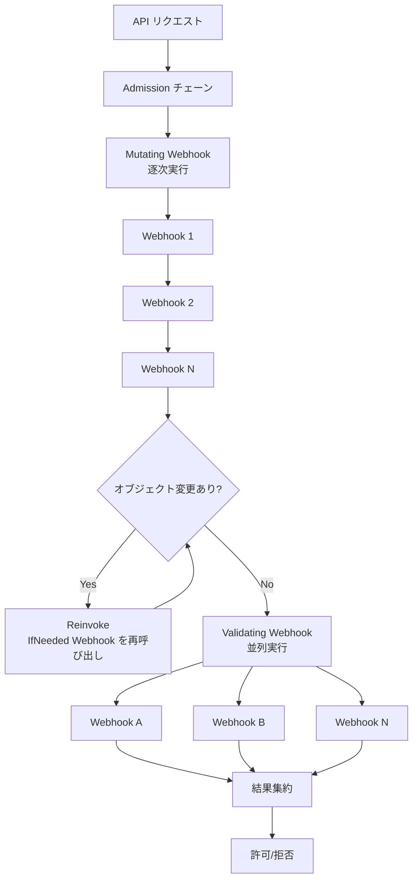

# 第21章 Admission Webhook

> 本章で読むソース
>
> - [staging/src/k8s.io/apiserver/pkg/admission/plugin/webhook/generic/webhook.go L50-L83](https://github.com/kubernetes/kubernetes/blob/v1.36.2/staging/src/k8s.io/apiserver/pkg/admission/plugin/webhook/generic/webhook.go#L50-L83)（Webhook 構造体）
> - [staging/src/k8s.io/apiserver/pkg/admission/plugin/webhook/generic/webhook.go L258-L376](https://github.com/kubernetes/kubernetes/blob/v1.36.2/staging/src/k8s.io/apiserver/pkg/admission/plugin/webhook/generic/webhook.go#L258-L376)（ShouldCallHook と Dispatch）
> - [staging/src/k8s.io/apiserver/pkg/admission/plugin/webhook/mutating/dispatcher.go L68-L240](https://github.com/kubernetes/kubernetes/blob/v1.36.2/staging/src/k8s.io/apiserver/pkg/admission/plugin/webhook/mutating/dispatcher.go#L68-L240)（mutatingDispatcher）
> - [staging/src/k8s.io/apiserver/pkg/admission/plugin/webhook/mutating/dispatcher.go L244-L392](https://github.com/kubernetes/kubernetes/blob/v1.36.2/staging/src/k8s.io/apiserver/pkg/admission/plugin/webhook/mutating/dispatcher.go#L244-L392)（callAttrMutatingHook）
> - [staging/src/k8s.io/apiserver/pkg/admission/plugin/webhook/validating/dispatcher.go L55-L246](https://github.com/kubernetes/kubernetes/blob/v1.36.2/staging/src/k8s.io/apiserver/pkg/admission/plugin/webhook/validating/dispatcher.go#L55-L246)（validatingDispatcher）
> - [staging/src/k8s.io/apiserver/pkg/admission/plugin/webhook/validating/dispatcher.go L248-L333](https://github.com/kubernetes/kubernetes/blob/v1.36.2/staging/src/k8s.io/apiserver/pkg/admission/plugin/webhook/validating/dispatcher.go#L248-L333)（callHook）

## この章の狙い

Admission Webhook は、API サーバーへのリクエストに対して外部の HTTP サービスで認可や変更を行う仕組みである。
Mutating Webhook はオブジェクトを変更でき、Validating Webhook は許可/拒否のみを行う。
本章では、Webhook の呼び出し順序、マッチング判定、並列実行の仕組みをソースコードから明らかにする。

## 前提

- 第5章（API リクエスト処理）で Admission チェーンの全体像を理解している。
- 第20章（CRD と Aggregation）で外部 HTTP サービスとの連携パターンを理解している。

## Webhook の基本構造

### generic.Webhook

Mutating と Validating の両方に共通する基底構造が `generic.Webhook` である。

[staging/src/k8s.io/apiserver/pkg/admission/plugin/webhook/generic/webhook.go L50-L83](https://github.com/kubernetes/kubernetes/blob/v1.36.2/staging/src/k8s.io/apiserver/pkg/admission/plugin/webhook/generic/webhook.go#L50-L83)

```go
type Webhook struct {
    *admission.Handler

    // Factories for creating webhook sources.
    apiSourceFactory    sourceFactory
    staticSourceFactory StaticSourceFactory

    // Configuration provided via admission config file and initializers.
    staticManifestsDir string // path to static webhook manifest directory (optional)
    apiServerID        string // identity of this API server instance, used for metrics

    // hookSource is the webhook source used at admission time. When staticManifestsDir
    // is configured, this is a composite source combining staticSource (loaded from disk)
    // with apiSource (from the API). Otherwise, it points directly to apiSource.
    hookSource Source
    // apiSource provides webhook configurations from the Kubernetes API (informer-based).
    apiSource Source
    // staticSource holds a reference to only the static (manifest-based) webhook source.
    // This can be used to route requests for excluded resources to static hooks only.
    staticSource ReloadableSource

    // Admission-time dependencies.
    namespaceInformer coreinformers.NamespaceInformer
    clientManager     *webhookutil.ClientManager
    namespaceMatcher  *namespace.Matcher
    objectMatcher     *object.Matcher
    dispatcher        Dispatcher
    filterCompiler    cel.ConditionCompiler
    authorizer        authorizer.Authorizer

    // Lifecycle.
    stopCh <-chan struct{}
}
```

`hookSource` は Webhook 設定（`MutatingWebhookConfiguration` または `ValidatingWebhookConfiguration`）の取得元である。
通常は Informer ベースの `apiSource` を使うが、`staticManifestsDir` が設定されていればファイルベースの設定と合成する。
`dispatcher` は実際の Webhook 呼び出しを行うインターフェースであり、Mutating と Validating で異なる実装が使われる。

### Dispatch の流れ

`Webhook.Dispatch` は Admission プラグインの `Admit` または `Validate` から呼ばれる。

[staging/src/k8s.io/apiserver/pkg/admission/plugin/webhook/generic/webhook.go L356-L376](https://github.com/kubernetes/kubernetes/blob/v1.36.2/staging/src/k8s.io/apiserver/pkg/admission/plugin/webhook/generic/webhook.go#L356-L376)

```go
func (a *Webhook) Dispatch(ctx context.Context, attr admission.Attributes, o admission.ObjectInterfaces) error {
    if rules.IsExemptAdmissionConfigurationResource(attr) {
        // Admission config resources are excluded from API-based webhooks to
        // prevent circular dependencies. However, static (manifest-based) webhooks
        // are safe to evaluate since they don't have self-referential concerns.
        if a.staticSource != nil {
            if !a.staticSource.HasSynced() {
                return admission.NewForbidden(attr, fmt.Errorf("not yet ready to handle request"))
            }
            hooks := a.staticSource.Webhooks()
            return a.dispatcher.Dispatch(ctx, attr, o, hooks)
        }
        return nil
    }
    if !a.WaitForReady() {
        return admission.NewForbidden(attr, fmt.Errorf("not yet ready to handle request"))
    }
    hooks := a.hookSource.Webhooks()
    return a.dispatcher.Dispatch(ctx, attr, o, hooks)
}
```

Admission 設定リソース（Webhook 設定自身）は API ベースの Webhook から除外される。
これは循環参照（Webhook が自分自身を呼び出してしまう問題）を防ぐためである。
ただし static（ファイルベース）の Webhook は安全に評価できる。

## ShouldCallHook: Webhook 呼び出しの判定

各 Webhook に対して、リクエストがマッチするかどうかを `ShouldCallHook` で判定する。

[staging/src/k8s.io/apiserver/pkg/admission/plugin/webhook/generic/webhook.go L258-L347](https://github.com/kubernetes/kubernetes/blob/v1.36.2/staging/src/k8s.io/apiserver/pkg/admission/plugin/webhook/generic/webhook.go#L258-L347)

```go
func (a *Webhook) ShouldCallHook(ctx context.Context, h webhook.WebhookAccessor, attr admission.Attributes, o admission.ObjectInterfaces, v VersionedAttributeAccessor) (*WebhookInvocation, *apierrors.StatusError) {
    matches, matchNsErr := a.namespaceMatcher.MatchNamespaceSelector(h, attr)
    // Should not return an error here for webhooks which do not apply to the request, even if err is an unexpected scenario.
    if !matches && matchNsErr == nil {
        return nil, nil
    }

    // Should not return an error here for webhooks which do not apply to the request, even if err is an unexpected scenario.
    matches, matchObjErr := a.objectMatcher.MatchObjectSelector(h, attr)
    if !matches && matchObjErr == nil {
        return nil, nil
    }

    var invocation *WebhookInvocation
    for _, r := range h.GetRules() {
        m := rules.Matcher{Rule: r, Attr: attr}
        if m.Matches() {
            invocation = &WebhookInvocation{
                Webhook:     h,
                Resource:    attr.GetResource(),
                Subresource: attr.GetSubresource(),
                Kind:        attr.GetKind(),
            }
            break
        }
    }
    if invocation == nil && h.GetMatchPolicy() != nil && *h.GetMatchPolicy() == v1.Equivalent {
        // ... Equivalent リソースのマッチング ...
    }

    if invocation == nil {
        return nil, nil
    }
    // ...
    matchConditions := h.GetMatchConditions()
    if len(matchConditions) > 0 {
        versionedAttr, err := v.VersionedAttribute(invocation.Kind)
        if err != nil {
            return nil, apierrors.NewInternalError(err)
        }

        matcher := h.GetCompiledMatcher(a.filterCompiler)
        matchResult := matcher.Match(ctx, versionedAttr, nil, a.authorizer)

        if matchResult.Error != nil {
            klog.Warningf("Failed evaluating matchConditions, failing closed %v: %v", h.GetName(), matchResult.Error)
            return nil, apierrors.NewForbidden(attr.GetResource().GroupResource(), attr.GetName(), matchResult.Error)
        } else if !matchResult.Matches {
            admissionmetrics.Metrics.ObserveMatchConditionExclusion(ctx, h.GetName(), "webhook", h.GetType(), string(attr.GetOperation()))
            // if no match, always skip webhook
            return nil, nil
        }
    }

    return invocation, nil
}
```

判定は以下の順序で行われる。

1. **NamespaceSelector**: リクエストの名前空間が Webhook の selector にマッチするか。
2. **ObjectSelector**: リクエストのオブジェクトラベルが selector にマッチするか。
3. **Rules**: 操作（CREATE/UPDATE/DELETE など）とリソース種別がルールにマッチするか。
4. **MatchPolicy=Equivalent**: マッチしない場合、同等リソース（例: deployments.apps と deployments.apps）でも再試行。
5. **matchConditions**: CEL 式で追加の条件判定を行う。評価エラー時は fail closed（拒否）する。

## Mutating Webhook の呼び出し順序

`mutatingDispatcher.Dispatch` は登録順に Webhook を逐次呼び出す。

[staging/src/k8s.io/apiserver/pkg/admission/plugin/webhook/mutating/dispatcher.go L105-L240](https://github.com/kubernetes/kubernetes/blob/v1.36.2/staging/src/k8s.io/apiserver/pkg/admission/plugin/webhook/mutating/dispatcher.go#L105-L240)

```go
func (a *mutatingDispatcher) Dispatch(ctx context.Context, attr admission.Attributes, o admission.ObjectInterfaces, hooks []webhook.WebhookAccessor) error {
    reinvokeCtx := attr.GetReinvocationContext()
    var webhookReinvokeCtx *webhookReinvokeContext
    if v := reinvokeCtx.Value(PluginName); v != nil {
        webhookReinvokeCtx = v.(*webhookReinvokeContext)
    } else {
        webhookReinvokeCtx = &webhookReinvokeContext{}
        reinvokeCtx.SetValue(PluginName, webhookReinvokeCtx)
    }

    if reinvokeCtx.IsReinvoke() && webhookReinvokeCtx.IsOutputChangedSinceLastWebhookInvocation(attr.GetObject()) {
        // If the object has changed, we know the in-tree plugin re-invocations have mutated the object,
        // and we need to reinvoke all eligible webhooks.
        webhookReinvokeCtx.RequireReinvokingPreviouslyInvokedPlugins()
    }
    defer func() {
        webhookReinvokeCtx.SetLastWebhookInvocationOutput(attr.GetObject())
    }()
    v := &versionedAttributeAccessor{
        attr:             attr,
        objectInterfaces: o,
    }
    for i, hook := range hooks {
        // ...
        invocation, statusErr := a.plugin.ShouldCallHook(ctx, hook, attrForCheck, o, v)
        if statusErr != nil {
            return statusErr
        }
        if invocation == nil {
            continue
        }

        hook, ok := invocation.Webhook.GetMutatingWebhook()
        if !ok {
            return fmt.Errorf("mutating webhook dispatch requires v1.MutatingWebhook, but got %T", hook)
        }
        // This means that during reinvocation, a webhook will not be
        // called for the first time. For example, if the webhook is
        // skipped in the first round because of mismatching labels,
        // even if the labels become matching, the webhook does not
        // get called during reinvocation.
        if reinvokeCtx.IsReinvoke() && !webhookReinvokeCtx.ShouldReinvokeWebhook(invocation.Webhook.GetUID()) {
            continue
        }

        versionedAttr, err := v.VersionedAttribute(invocation.Kind)
        if err != nil {
            return apierrors.NewInternalError(err)
        }

        // ...
        changed, err := a.callAttrMutatingHook(ctx, hook, invocation, versionedAttr, annotator, o, round, i)
        // ...
        if changed {
            // Patch had changed the object. Prepare to reinvoke all previous mutations that are eligible for re-invocation.
            webhookReinvokeCtx.RequireReinvokingPreviouslyInvokedPlugins()
            reinvokeCtx.SetShouldReinvoke()
        }
        if hook.ReinvocationPolicy != nil && *hook.ReinvocationPolicy == admissionregistrationv1.IfNeededReinvocationPolicy {
            webhookReinvokeCtx.AddReinvocableWebhookToPreviouslyInvoked(invocation.Webhook.GetUID())
        }
        if err == nil {
            continue
        }

        if callErr, ok := err.(*webhookutil.ErrCallingWebhook); ok {
            if ignoreClientCallFailures {
                // ... fail open ...
                continue
            }
            klog.Warningf("Failed calling webhook, failing closed %v: %v", hook.Name, err)
            return apierrors.NewInternalError(err)
        }
        if rejectionErr, ok := err.(*webhookutil.ErrWebhookRejection); ok {
            return rejectionErr.Status
        }
        return err
    }

    // convert versionedAttr.VersionedObject to the internal version in the underlying admission.Attributes
    if v.versionedAttr != nil && v.versionedAttr.VersionedObject != nil && v.versionedAttr.Dirty {
        return o.GetObjectConvertor().Convert(v.versionedAttr.VersionedObject, v.versionedAttr.Attributes.GetObject(), nil)
    }

    return nil
}
```

Mutating Webhook は**登録順に逐次**実行される。
各 Webhook がオブジェクトを変更（patch）すると、`changed` フラグが立ち、`reinvoke` が予約される。
全 Webhook を1巡した後、変更があれば `reinvocationPolicy=IfNeeded` の Webhook を再呼び出しする。
この再呼び出しは、オブジェクトが変化しなくなるまで繰り返される。

reinvoke コンテキストでは、初回にマッチしなかった Webhook は再呼び出しでも呼ばれない（コメントに明記されている）。
これはラベルセレクタが後からマッチするようになった場合でも、一貫性を保つためである。

### callAttrMutatingHook: 実際の HTTP 呼び出し

[staging/src/k8s.io/apiserver/pkg/admission/plugin/webhook/mutating/dispatcher.go L244-L392](https://github.com/kubernetes/kubernetes/blob/v1.36.2/staging/src/k8s.io/apiserver/pkg/admission/plugin/webhook/mutating/dispatcher.go#L244-L392)

```go
func (a *mutatingDispatcher) callAttrMutatingHook(ctx context.Context, h *admissionregistrationv1.MutatingWebhook, invocation *generic.WebhookInvocation, attr *admission.VersionedAttributes, annotator *webhookAnnotator, o admission.ObjectInterfaces, round, idx int) (bool, error) {
    configurationName := invocation.Webhook.GetConfigurationName()
    changed := false
    defer func() { annotator.addMutationAnnotation(changed) }()
    if attr.Attributes.IsDryRun() {
        if h.SideEffects == nil {
            return false, &webhookutil.ErrCallingWebhook{WebhookName: h.Name, Reason: fmt.Errorf("Webhook SideEffects is nil"), Status: apierrors.NewBadRequest("Webhook SideEffects is nil")}
        }
        if !(*h.SideEffects == admissionregistrationv1.SideEffectClassNone || *h.SideEffects == admissionregistrationv1.SideEffectClassNoneOnDryRun) {
            return false, webhookerrors.NewDryRunUnsupportedErr(h.Name)
        }
    }

    uid, request, response, err := webhookrequest.CreateAdmissionObjects(attr, invocation)
    if err != nil {
        return false, &webhookutil.ErrCallingWebhook{WebhookName: h.Name, Reason: fmt.Errorf("could not create admission objects: %w", err), Status: apierrors.NewBadRequest("error creating admission objects")}
    }
    // Make the webhook request
    client, err := invocation.Webhook.GetRESTClient(a.cm)
    if err != nil {
        return false, &webhookutil.ErrCallingWebhook{WebhookName: h.Name, Reason: fmt.Errorf("could not get REST client: %w", err), Status: apierrors.NewInternalError(err)}
    }
    ctx, span := tracing.Start(ctx, "Call mutating webhook", ...)
    defer span.End(500 * time.Millisecond)

    // if the webhook has a specific timeout, wrap the context to apply it
    if h.TimeoutSeconds != nil {
        var cancel context.CancelFunc
        ctx, cancel = context.WithTimeout(ctx, time.Duration(*h.TimeoutSeconds)*time.Second)
        defer cancel()
    }

    r := client.Post().Body(request)
    // ...
    do := func() { err = r.Do(ctx).Into(response) }
    // ...
    do()
    if err != nil {
        // ...
    }

    result, err := webhookrequest.VerifyAdmissionResponse(uid, true, response)
    // ...

    if !result.Allowed {
        return false, &webhookutil.ErrWebhookRejection{Status: webhookerrors.ToStatusErr(h.Name, result.Result)}
    }

    if len(result.Patch) == 0 {
        return false, nil
    }
    patchObj, err := jsonpatch.DecodePatch(result.Patch)
    // ...

    // ...
    switch result.PatchType {
    case admissionv1.PatchTypeJSONPatch:
        objJS, err := runtime.Encode(jsonSerializer, attr.VersionedObject)
        if err != nil {
            return false, apierrors.NewInternalError(err)
        }
        patchedJS, err = patchObj.Apply(objJS)
        if err != nil {
            return false, apierrors.NewInternalError(err)
        }
    default:
        return false, &webhookutil.ErrCallingWebhook{WebhookName: h.Name, Reason: fmt.Errorf("unsupported patch type %q", result.PatchType), Status: webhookerrors.ToStatusErr(h.Name, result.Result)}
    }

    // ...
    changed = !apiequality.Semantic.DeepEqual(attr.VersionedObject, newVersionedObject)
    span.AddEvent("Patch applied")
    annotator.addPatchAnnotation(patchObj, result.PatchType)
    attr.Dirty = true
    attr.VersionedObject = newVersionedObject
    o.GetObjectDefaulter().Default(attr.VersionedObject)
    return changed, nil
}
```

処理の流れ。

1. DryRun の場合、`sideEffects=None` または `NoneOnDryRun` でなければ拒否。
2. `AdmissionReview` リクエスト/レスポンスオブジェクトを生成。
3. Webhook 固有のタイムアウトがあれば `context.WithTimeout` で適用。
4. HTTP POST で Webhook を呼び出し、レスポンスを検証。
5. `allowed=false` なら拒否。
6. パッチがあれば JSON Patch を適用し、オブジェクトを更新。
7. `apiequality.Semantic.DeepEqual` で変更を検出し、`changed` フラグを立てる。

## Validating Webhook の並列実行

`validatingDispatcher.Dispatch` はマッチする Webhook を**並列**で呼び出す。

[staging/src/k8s.io/apiserver/pkg/admission/plugin/webhook/validating/dispatcher.go L88-L246](https://github.com/kubernetes/kubernetes/blob/v1.36.2/staging/src/k8s.io/apiserver/pkg/admission/plugin/webhook/validating/dispatcher.go#L88-L246)

```go
func (d *validatingDispatcher) Dispatch(ctx context.Context, attr admission.Attributes, o admission.ObjectInterfaces, hooks []webhook.WebhookAccessor) error {
    var relevantHooks []*generic.WebhookInvocation
    // Construct all the versions we need to call our webhooks
    versionedAttrAccessor := &versionedAttributeAccessor{
        versionedAttrs:   map[schema.GroupVersionKind]*admission.VersionedAttributes{},
        attr:             attr,
        objectInterfaces: o,
    }
    for _, hook := range hooks {
        invocation, statusError := d.plugin.ShouldCallHook(ctx, hook, attr, o, versionedAttrAccessor)
        if statusError != nil {
            return statusError
        }
        if invocation == nil {
            continue
        }

        relevantHooks = append(relevantHooks, invocation)
        // VersionedAttr result will be cached and reused later during parallel webhook calls
        _, err := versionedAttrAccessor.VersionedAttribute(invocation.Kind)
        if err != nil {
            return apierrors.NewInternalError(err)
        }
    }

    if len(relevantHooks) == 0 {
        // no matching hooks
        return nil
    }

    // Check if the request has already timed out before spawning remote calls
    select {
    case <-ctx.Done():
        // parent context is canceled or timed out, no point in continuing
        return apierrors.NewTimeoutError("request did not complete within requested timeout", 0)
    default:
    }

    wg := sync.WaitGroup{}
    errCh := make(chan error, 2*len(relevantHooks)) // double the length to handle extra errors for panics in the gofunc
    wg.Add(len(relevantHooks))
    for i := range relevantHooks {
        go func(invocation *generic.WebhookInvocation, idx int) {
            // ...
            defer wg.Done()
            defer func() {
                recover()
            }()
            defer utilruntime.HandleCrash(
                func(r interface{}) {
                    if r == nil {
                        return
                    }
                    if ignoreClientCallFailures {
                        // fail open
                        // ...
                        return
                    }
                    errCh <- apierrors.NewInternalError(fmt.Errorf("ValidatingAdmissionWebhook/%v has panicked: %v", hookName, r))
                },
            )

            hook, ok := invocation.Webhook.GetValidatingWebhook()
            // ...
            err := d.callHook(ctx, hook, invocation, versionedAttr)
            // ...
            if err != nil {
                // ...
                if callErr, ok := err.(*webhookutil.ErrCallingWebhook); ok {
                    if ignoreClientCallFailures {
                        // fail open
                        return
                    }

                    klog.Warningf("Failed calling webhook, failing closed %v: %v", hook.Name, err)
                    errCh <- apierrors.NewInternalError(err)
                    return
                }

                if rejectionErr, ok := err.(*webhookutil.ErrWebhookRejection); ok {
                    err = rejectionErr.Status
                }
                klog.Warningf("rejected by webhook %q: %#v", hook.Name, err)
                errCh <- err
            }
        }(relevantHooks[i], i)
    }
    wg.Wait()
    close(errCh)

    var errs []error
    for e := range errCh {
        errs = append(errs, e)
    }
    if len(errs) == 0 {
        return nil
    }
    if len(errs) > 1 {
        for i := 1; i < len(errs); i++ {
            // TODO: merge status errors; until then, just return the first one.
            utilruntime.HandleError(errs[i])
        }
    }
    return errs[0]
}
```

Validating Webhook は Mutating と異なり、オブジェクトを変更しないため並列実行が可能である。
処理の流れは以下の通り。

1. まず全 Webhook に対して `ShouldCallHook` を呼び、マッチするものを収集。
2. 各 Webhook のバージョン変換を事前に行い、キャッシュする。
3. マッチする Webhook がなければ即座に終了。
4. コンテキストがすでにタイムアウトしていなければ、goroutine で並列呼び出し。
5. `sync.WaitGroup` と `errCh` で結果を集約。
6. エラーがあれば最初のものを返す（複数あっても1つだけ）。

`errCh` のバッファサイズが `2*len(relevantHooks)` になっているのは、panic 時の crash handler が追加のエラーを送る可能性があるためである。



## Failure Policy: Fail Open と Fail Closed

Webhook 呼び出しが失敗したときの挙動は `failurePolicy` フィールドで制御される。

- **Fail**（デフォルト）: Webhook がエラーを返すと、リクエストは拒否される（fail closed）。
- **Ignore**: Webhook がエラーを返しても、リクエストは許可される（fail open）。

コードでは `ignoreClientCallFailures` 変数で判定されている。

[staging/src/k8s.io/apiserver/pkg/admission/plugin/webhook/validating/dispatcher.go L170](https://github.com/kubernetes/kubernetes/blob/v1.36.2/staging/src/k8s.io/apiserver/pkg/admission/plugin/webhook/validating/dispatcher.go#L170)

```go
ignoreClientCallFailures = hook.FailurePolicy != nil && *hook.FailurePolicy == v1.Ignore
```

fail open の場合はエラーをログに出力して审计 annotation に記録し、リクエストを続行する。
fail closed の場合はエラーを `errCh` に送り、リクエストを拒否する。

## まとめ

Admission Webhook は、Mutating が逐次実行でオブジェクトを変更し、Validating が並列実行で許可/拒否のみを行う。
この非対称な設計は、Mutating が前の Webhook の変更を後続の Webhook が見る必要があるためであり、Validating は独立に判定できるため並列化が可能である。

高速化の観点では、Validating Webhook の並列実行が最も重要である。
複数の Validating Webhook が登録されていても、すべて同時に呼び出されるため、レイテンシは最も遅い1つの Webhook の応答時間で済む。
また `versionedAttributeAccessor` によるバージョン変換のキャッシュも効いており、同じ GVK への変換を繰り返さずに済む。

## 関連する章

- 第5章（API リクエスト処理）: Admission チェーンの全体像
- 第20章（CRD と Aggregation）: 外部 HTTP サービスとの連携パターン
- 第23章（RBAC と ServiceAccount）: Webhook の認証と認可
