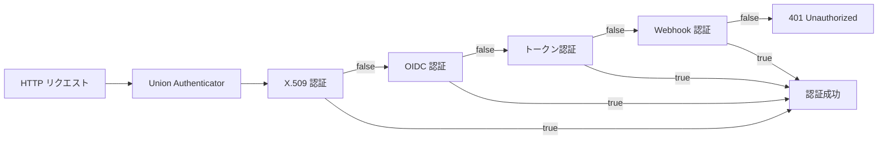
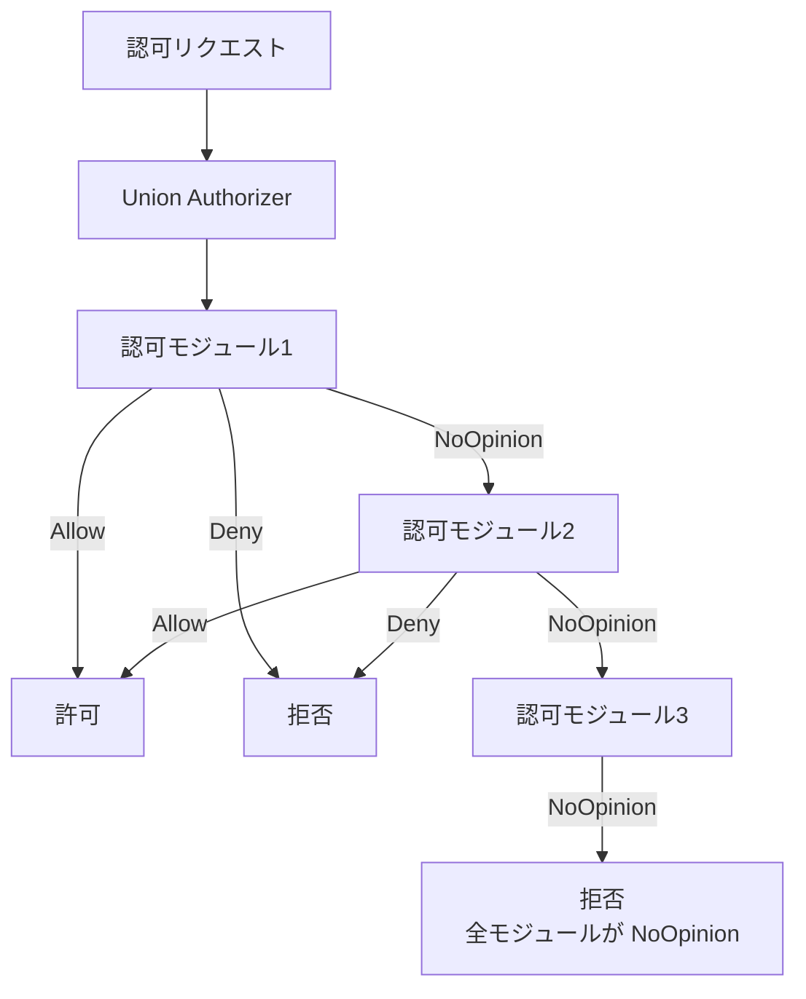

# 第22章 Authentication と Authorization

> 本章で読むソース:
>
> - [staging/src/k8s.io/apiserver/pkg/authentication/authenticator/interfaces.go L1-L65](https://github.com/kubernetes/kubernetes/blob/v1.36.2/staging/src/k8s.io/apiserver/pkg/authentication/authenticator/interfaces.go#L1-L65)
> - [staging/src/k8s.io/apiserver/pkg/authentication/request/union/union.go L1-L71](https://github.com/kubernetes/kubernetes/blob/v1.36.2/staging/src/k8s.io/apiserver/pkg/authentication/request/union/union.go#L1-L71)
> - [staging/src/k8s.io/apiserver/pkg/authentication/request/x509/x509.go L1-L332](https://github.com/kubernetes/kubernetes/blob/v1.36.2/staging/src/k8s.io/apiserver/pkg/authentication/request/x509/x509.go#L1-L332)
> - [staging/src/k8s.io/apiserver/plugin/pkg/authenticator/token/oidc/oidc.go L1-L1370](https://github.com/kubernetes/kubernetes/blob/v1.36.2/staging/src/k8s.io/apiserver/plugin/pkg/authenticator/token/oidc/oidc.go#L1-L1370)
> - [staging/src/k8s.io/apiserver/pkg/authorization/authorizer/interfaces.go L1-L198](https://github.com/kubernetes/kubernetes/blob/v1.36.2/staging/src/k8s.io/apiserver/pkg/authorization/authorizer/interfaces.go#L1-L198)
> - [staging/src/k8s.io/apiserver/pkg/authorization/union/union.go L1-L106](https://github.com/kubernetes/kubernetes/blob/v1.36.2/staging/src/k8s.io/apiserver/pkg/authorization/union/union.go#L1-L106)
> - [staging/src/k8s.io/apiserver/plugin/pkg/authorizer/webhook/webhook.go L1-L602](https://github.com/kubernetes/kubernetes/blob/v1.36.2/staging/src/k8s.io/apiserver/plugin/pkg/authorizer/webhook/webhook.go#L1-L602)

## この章の狙い

Kubernetes の API サーバーは、リクエストを受け取るとまず認証（Authentication）を行い、次に認可（Authorization）を評価する。
本章では、認証プラグインのチェーン機構、OIDC による JWT 検証、認可の3値評価モデル、そして Webhook による外部認可連携の仕組みをソースコードから読み解く。

## 前提

本章は API サーバーのリクエスト処理（第5章）を前提とする。
`kube-apiserver` が HTTP リクエストを受け取ると、ハンドラの先頭で認証・認可のゲートを通過させる。
認証は「誰か」を特定し、認可は「その操作を許すか」を判定する。

## 認証のインターフェース

Kubernetes の認証は、`authenticator.Request` と `authenticator.Token` の2つのインターフェースで抽象化されている。

[staging/src/k8s.io/apiserver/pkg/authentication/authenticator/interfaces.go L28-L36](https://github.com/kubernetes/kubernetes/blob/v1.36.2/staging/src/k8s.io/apiserver/pkg/authentication/authenticator/interfaces.go#L28-L36)

```go
// Token checks a string value against a backing authentication store and
// returns a Response or an error if the token could not be checked.
type Token interface {
	AuthenticateToken(ctx context.Context, token string) (*Response, bool, error)
}

// Request attempts to extract authentication information from a request and
// returns a Response or an error if the request could not be checked.
type Request interface {
	AuthenticateRequest(req *http.Request) (*authenticator.Response, bool, error)
}
```

返り値の `bool` は「認証できたか」を表す。
`true` であれば認証成功、`false` であれば「このプラグインでは判定できなかった」を意味し、次のプラグインに処理が委ねられる。
`error` は認証処理自体の異常（接続失敗、証明書不正など）を表す。

認証が成功すると `Response` に `user.Info` が格納される。

[staging/src/k8s.io/apiserver/pkg/authentication/authenticator/interfaces.go L54-L65](https://github.com/kubernetes/kubernetes/blob/v1.36.2/staging/src/k8s.io/apiserver/pkg/authentication/authenticator/interfaces.go#L54-L65)

```go
type Response struct {
	// Audiences is the set of audiences the authenticator was able to validate
	// the token against. If the authenticator is not audience aware, this field
	// will be empty.
	Audiences Audiences
	// User is the UserInfo associated with the authentication context.
	User user.Info
}
```

## 認証プラグインのチェーン

`kube-apiserver` は複数の認証プラグインをチェーン状に並べて、先頭から順に試す。
このチェーンは `unionAuthRequestHandler` で実装される。

[staging/src/k8s.io/apiserver/pkg/authentication/request/union/union.go L27-L41](https://github.com/kubernetes/kubernetes/blob/v1.36.2/staging/src/k8s.io/apiserver/pkg/authentication/request/union/union.go#L27-L41)

```go
// unionAuthRequestHandler authenticates a request using a chain of authenticator.Requests
type unionAuthRequestHandler struct {
	// Handlers is a chain of request authenticators to delegate to
	Handlers []authenticator.Request
	// FailOnError determines whether an error returns short-circuits the chain
	FailOnError bool
}

// New returns a request authenticator that validates credentials using a chain of authenticator.Request objects.
// The entire chain is tried until one succeeds. If all fail, an aggregate error is returned.
func New(authRequestHandlers ...authenticator.Request) authenticator.Request {
	if len(authRequestHandlers) == 1 {
		return authRequestHandlers[0]
	}
	return &unionAuthRequestHandler{Handlers: authRequestHandlers, FailOnError: false}
}
```

チェーンの各要素は `AuthenticateRequest` を順に呼び出される。
いずれかのプラグインが `(resp, true, nil)` を返せば、その時点でチェーンは成功を返す。
すべてのプラグインが `false` を返した場合、収集したエラーの集合が返る。

[staging/src/k8s.io/apiserver/pkg/authentication/request/union/union.go L53-L71](https://github.com/kubernetes/kubernetes/blob/v1.36.2/staging/src/k8s.io/apiserver/pkg/authentication/request/union/union.go#L53-L71)

```go
func (authHandler *unionAuthRequestHandler) AuthenticateRequest(req *http.Request) (*authenticator.Response, bool, error) {
	var errlist []error
	for _, currAuthRequestHandler := range authHandler.Handlers {
		resp, ok, err := currAuthRequestHandler.AuthenticateRequest(req)
		if err != nil {
			if authHandler.FailOnError {
				return resp, ok, err
			}
			errlist = append(errlist, err)
			continue
		}

		if ok {
			return resp, ok, err
		}
	}

	return nil, false, utilerrors.NewAggregate(errlist)
}
```

`FailOnError` が `false`（デフォルト）の場合、エラーが出てもチェーンは途切れない。
エラーは蓄積されつつ次のプラグインが試される。
これは「X.509 証明書がないリクエストでも OIDC トークンで認証できる」ことを意味する。



## X.509 クライアント証明書による認証

クラスター内部のコンポーネント（kubelet、kube-proxy、コントローラマネージャ）は、TLS クライアント証明書で認証する。
`Authenticator` は `req.TLS.PeerCertificates` を検証し、証明書の Subject からユーザー情報を抽出する。

[staging/src/k8s.io/apiserver/pkg/authentication/request/x509/x509.go L138-L207](https://github.com/kubernetes/kubernetes/blob/v1.36.2/staging/src/k8s.io/apiserver/pkg/authentication/request/x509/x509.go#L138-L207)

```go
func (a *Authenticator) AuthenticateRequest(req *http.Request) (*authenticator.Response, bool, error) {
	if req.TLS == nil || len(req.TLS.PeerCertificates) == 0 {
		return nil, false, nil
	}

	// Use intermediates, if provided
	optsCopy, ok := a.verifyOptionsFn()
	// if there are intentionally no verify options, then we cannot authenticate this request
	if !ok {
		return nil, false, nil
	}
	if optsCopy.Intermediates == nil && len(req.TLS.PeerCertificates) > 1 {
		optsCopy.Intermediates = x509.NewCertPool()
		for _, intermediate := range req.TLS.PeerCertificates[1:] {
			optsCopy.Intermediates.AddCert(intermediate)
		}
	}

	// ... (中略) ...

	remaining := req.TLS.PeerCertificates[0].NotAfter.Sub(time.Now())
	clientCertificateExpirationHistogram.WithContext(req.Context()).Observe(remaining.Seconds())
	chains, err := req.TLS.PeerCertificates[0].Verify(optsCopy)
	if err != nil {
		return nil, false, fmt.Errorf(
			"verifying certificate %s failed: %w",
			certificateIdentifier(req.TLS.PeerCertificates[0]),
			err,
		)
	}

	var errlist []error
	for _, chain := range chains {
		user, ok, err := a.user.User(chain)
		if err != nil {
			errlist = append(errlist, err)
			continue
		}

		if ok {
			return user, ok, err
		}
	}
	return nil, false, utilerrors.NewAggregate(errlist)
}
```

処理の流れは次の通りである。

1. TLS 接続にクライアント証明書が含まれているか確認する。なければ `false` を返して次のプラグインに任せる。
2. `VerifyOptionFunc` から検証オプション（CA プールなど）を取得する。動的に CA を差し替えられる設計である。
3. 中間証明書がリクエストに含まれていれば、検証オプションの `Intermediates` プールに追加する。
4. 証明書の残存有効期限をヒストグラムメトリクスに記録する。
5. `PeerCertificates[0].Verify(optsCopy)` で証明書チェーンを検証する。
6. 検証が成功したチェーンごとに `UserConversion` を呼び出し、ユーザー情報を取り出す。

`CommonNameUserConversion` は証明書の CommonName をユーザー名、Organization をグループとして抽出する。

[staging/src/k8s.io/apiserver/pkg/authentication/request/x509/x509.go L280-L302](https://github.com/kubernetes/kubernetes/blob/v1.36.2/staging/src/k8s.io/apiserver/pkg/authentication/request/x509/x509.go#L280-L302)

```go
var CommonNameUserConversion = UserConversionFunc(func(chain []*x509.Certificate) (*authenticator.Response, bool, error) {
	if len(chain[0].Subject.CommonName) == 0 {
		return nil, false, nil
	}

	fp := sha256.Sum256(chain[0].Raw)
	id := "X509SHA256=" + hex.EncodeToString(fp[:])

	uid, err := parseUIDFromCert(chain[0])
	if err != nil {
		return nil, false, err
	}
	return &authenticator.Response{
		User: &user.DefaultInfo{
			Name:   chain[0].Subject.CommonName,
			UID:    uid,
			Groups: chain[0].Subject.Organization,
			Extra: map[string][]string{
				user.CredentialIDKey: {id},
			},
		},
	}, true, nil
})
```

証明書の生データから SHA-256 ハッシュを計算し、`CredentialIDKey` として `Extra` に格納している。
この識別子は監査ログで credential の追跡に利用される。

## OIDC による JWT 検証

外部の OIDC プロバイダ（Keycloak、Google、Azure AD など）が発行した JWT で認証する仕組みが OIDC authenticator である。
`jwtAuthenticator` 構造体が中核を担う。

[staging/src/k8s.io/apiserver/plugin/pkg/authenticator/token/oidc/oidc.go L199-L217](https://github.com/kubernetes/kubernetes/blob/v1.36.2/staging/src/k8s.io/apiserver/plugin/pkg/authenticator/token/oidc/oidc.go#L199-L217)

```go
type jwtAuthenticator struct {
	jwtAuthenticator apiserver.JWTAuthenticator

	// Contains an *oidc.IDTokenVerifier. Do not access directly use the
	// idTokenVerifier method.
	verifier atomic.Value

	// resolver is used to resolve distributed claims.
	resolver *claimResolver

	// celMapper contains the compiled CEL expressions for
	// username, groups, uid, extra, claimMapping and claimValidation
	celMapper authenticationcel.CELMapper

	// requiredClaims contains the list of claims that must be present in the token.
	requiredClaims map[string]string

	healthCheck atomic.Pointer[errorHolder]
}
```

`verifier` は `atomic.Value` で保持されており、非同期に初期化される。
これにより、API サーバー起動時に OIDC プロバイダが利用できなくても、API サーバー自体は起動できる。

### 非同期初期化

`New` 関数では、`KeySet` が直接渡されない限り、バックグラウンドゴルーチンでプロバイダの初期化を試みる。

[staging/src/k8s.io/apiserver/plugin/pkg/authenticator/token/oidc/oidc.go L422-L468](https://github.com/kubernetes/kubernetes/blob/v1.36.2/staging/src/k8s.io/apiserver/plugin/pkg/authenticator/token/oidc/oidc.go#L422-L468)

```go
	} else {
		// Asynchronously attempt to initialize the authenticator. This enables
		// self-hosted providers, providers that run on top of Kubernetes itself.
		go func() {
			// we ignore any errors from polling because they can only come from the context being canceled
			_ = wait.PollUntilContextCancel(lifecycleCtx, 10*time.Second, true, func(_ context.Context) (done bool, err error) {
				// this must always use lifecycleCtx because NewProvider uses that context for future key set fetching.
				// this also means that there is no correct way to control the timeout of the discovery request made by NewProvider.
				// the global timeout of the http.Client is still honored.
				provider, err := oidc.NewProvider(lifecycleCtx, issuerURL)
				if err != nil {
					klog.Errorf("oidc authenticator: initializing plugin: %v", err)
					authn.healthCheck.Store(&errorHolder{err: err})
					return false, nil
				}

				// ... (中略) ...

				verifier := provider.Verifier(verifierConfig)
				authn.setVerifier(&idTokenVerifier{verifier, audiences})
				return true, nil
			})
		}()
	}
```

10秒ごとにポーリングを繰り返し、プロバイダが利用可能になるまで待機する。
Kubernetes 上で動作する OIDC プロバイダ（Dex など）の場合、API サーバーが起動してからプロバイダが起動するという順番依存があるため、この非同期初期化が不可欠である。

### JWT 検証とクレーム抽出

`AuthenticateToken` は JWT の issuer を事前チェックし、署名検証を経て、クレームからユーザー情報を構築する。

[staging/src/k8s.io/apiserver/plugin/pkg/authenticator/token/oidc/oidc.go L860-L972](https://github.com/kubernetes/kubernetes/blob/v1.36.2/staging/src/k8s.io/apiserver/plugin/pkg/authenticator/token/oidc/oidc.go#L860-L972)

```go
func (a *jwtAuthenticator) AuthenticateToken(ctx context.Context, token string) (*authenticator.Response, bool, error) {
	if !hasCorrectIssuer(a.jwtAuthenticator.Issuer.URL, token) {
		return nil, false, nil
	}

	verifier, ok := a.idTokenVerifier()
	if !ok {
		return nil, false, fmt.Errorf("oidc: authenticator not initialized")
	}

	idToken, err := verifier.Verify(ctx, token)
	if err != nil {
		return nil, false, fmt.Errorf("oidc: verify token: %v", err)
	}

	var c claims
	if err := idToken.Claims(&c); err != nil {
		return nil, false, fmt.Errorf("oidc: parse claims: %v", err)
	}
	if a.resolver != nil {
		if err := a.resolver.expand(ctx, c); err != nil {
			return nil, false, fmt.Errorf("oidc: could not expand distributed claims: %v", err)
		}
	}

	// ... (中略) ...

	var username string
	if username, err = a.getUsername(ctx, c, claimsValue); err != nil {
		return nil, false, err
	}

	info := &user.DefaultInfo{Name: username}
	if info.Groups, err = a.getGroups(ctx, c, claimsValue); err != nil {
		return nil, false, err
	}

	// ... (中略) ...

	return &authenticator.Response{User: info}, true, nil
}
```

処理の流れは次の通りである。

1. `hasCorrectIssuer` でトークンの issuer を事前確認する。これは署名検証の前に行う軽量なチェックであり、関係ないトークンを弾いて高コストな署名検証を省略する。
2. `verifier.Verify` で JWT の署名と有効期限を検証する。
3. `Claims` で JWT のペイロードをパースする。
4. `resolver.expand` で分散クレーム（Distributed Claims）を展開する。
5. CEL 式またはクレームマッピングで username、groups、UID、extra を抽出する。
6. 必須クレームの存在と値を確認する。
7. CEL によるクレーム検証ルール、ユーザー検証ルールを評価する。

### audience のローカル検証

OIDC の仕様では `aud` クレームの検証が必須である。
go-oidc ライブラリは単一の audience しか検証できないため、Kubernetes は自前で多段 audience 検証を実装している。

[staging/src/k8s.io/apiserver/plugin/pkg/authenticator/token/oidc/oidc.go L846-L858](https://github.com/kubernetes/kubernetes/blob/v1.36.2/staging/src/k8s.io/apiserver/plugin/pkg/authenticator/token/oidc/oidc.go#L846-L858)

```go
func (v *idTokenVerifier) verifyAudience(t *oidc.IDToken) error {
	// We validate audience field is not empty in the authentication configuration.
	// This check ensures callers of "Verify" using idTokenVerifier are not passing
	// an empty audience.
	if v.audiences.Len() == 0 {
		return fmt.Errorf("oidc: invalid configuration, audiences cannot be empty")
	}
	if v.audiences.HasAny(t.Audience...) {
		return nil
	}

	return fmt.Errorf("oidc: expected audience in %q got %q", sets.List(v.audiences), t.Audience)
}
```

`HasAny` は、トークンの audience のいずれかが設定された audience セットに含まれるかを判定する。
1つでも合致すればよい（MatchAny ポリシー）。

## 認可のインターフェースと3値評価

認証が「誰か」を特定するのに対し、認可は「その操作を許すか」を判定する。
認可のインターフェースは `Authorizer` で定義される。

[staging/src/k8s.io/apiserver/pkg/authorization/authorizer/interfaces.go L80-L85](https://github.com/kubernetes/kubernetes/blob/v1.36.2/staging/src/k8s.io/apiserver/pkg/authorization/authorizer/interfaces.go#L80-L85)

```go
type Authorizer interface {
	Authorize(ctx context.Context, a Attributes) (authorized Decision, reason string, err error)
}
```

`Decision` は3値のいずれかを取る。

[staging/src/k8s.io/apiserver/pkg/authorization/authorizer/interfaces.go L175-L198](https://github.com/kubernetes/kubernetes/blob/v1.36.2/staging/src/k8s.io/apiserver/pkg/authorization/authorizer/interfaces.go#L175-L198)

```go
type Decision int

const (
	// DecisionDeny means that an authorizer decided to deny the action.
	DecisionDeny Decision = iota
	// DecisionAllow means that an authorizer decided to allow the action.
	DecisionAllow
	// DecisionNoOpinion means that an authorizer has no opinion on whether
	// to allow or deny an action.
	DecisionNoOpinion
)

func (d Decision) String() string {
	switch d {
	case DecisionDeny:
		return "Deny"
	case DecisionAllow:
		return "Allow"
	case DecisionNoOpinion:
		return "NoOpinion"
	default:
		return fmt.Sprintf("Unknown (%d)", int(d))
	}
}
```

- **`DecisionAllow`**: 操作を許可する。
- **`DecisionDeny`**: 操作を拒否する。
- **`DecisionNoOpinion`**: 判断を留保する。次の認可モジュールに評価を委ねる。

`Attributes` はリクエストから認可判定に必要な情報を提供する。

[staging/src/k8s.io/apiserver/pkg/authorization/authorizer/interfaces.go L29-L78](https://github.com/kubernetes/kubernetes/blob/v1.36.2/staging/src/k8s.io/apiserver/pkg/authorization/authorizer/interfaces.go#L29-L78)

```go
type Attributes interface {
	// GetUser returns the user.Info object to authorize
	GetUser() user.Info

	// GetVerb returns the kube verb associated with API requests
	GetVerb() string

	// When IsReadOnly() == true, the request has no side effects
	IsReadOnly() bool

	// The namespace of the object, if a request is for a REST object.
	GetNamespace() string

	// The kind of object, if a request is for a REST object.
	GetResource() string

	// GetSubresource returns the subresource being requested
	GetSubresource() string

	// GetName returns the name of the object
	GetName() string

	// The group of the resource
	GetAPIGroup() string

	// GetAPIVersion returns the version of the group requested
	GetAPIVersion() string

	// IsResourceRequest returns true for requests to API resources
	IsResourceRequest() bool

	// GetPath returns the path of the request
	GetPath() string

	// ... (中略) ...
}
```

## Union 認可チェーン

複数の認可モジュールをチェーンする `unionAuthzHandler` は、`Allow` または `Deny` が返るまで各モジュールを順に評価する。

[staging/src/k8s.io/apiserver/pkg/authorization/union/union.go L36-L69](https://github.com/kubernetes/kubernetes/blob/v1.36.2/staging/src/k8s.io/apiserver/pkg/authorization/union/union.go#L36-L69)

```go
// unionAuthzHandler authorizer against a chain of authorizer.Authorizer
type unionAuthzHandler []authorizer.Authorizer

// New returns an authorizer that authorizes against a chain of authorizer.Authorizer objects
func New(authorizationHandlers ...authorizer.Authorizer) authorizer.Authorizer {
	return unionAuthzHandler(authorizationHandlers)
}

// Authorizes against a chain of authorizer.Authorizer objects
func (authzHandler unionAuthzHandler) Authorize(ctx context.Context, a authorizer.Attributes) (authorizer.Decision, string, error) {
	var (
		errlist    []error
		reasonlist []string
	)

	for _, currAuthzHandler := range authzHandler {
		decision, reason, err := currAuthzHandler.Authorize(ctx, a)

		if err != nil {
			errlist = append(errlist, err)
		}
		if len(reason) != 0 {
			reasonlist = append(reasonlist, reason)
		}
		switch decision {
		case authorizer.DecisionAllow, authorizer.DecisionDeny:
			return decision, reason, err
		case authorizer.DecisionNoOpinion:
			// continue to the next authorizer
		}
	}

	return authorizer.DecisionNoOpinion, strings.Join(reasonlist, "\n"), utilerrors.NewAggregate(errlist)
}
```

`NoOpinion` は「判断しない」ことを表す。
チェーン内のどのモジュールも `Allow`・`Deny` を返さなければ、最終的に `NoOpinion` が返り、リクエストは拒否される。
`Deny` は即座に short-circuit するため、一つでも `Deny` を返すモジュールがあれば、後のモジュールは評価されない。



典型的な `kube-apiserver` の構成では、Node 認可、RBAC、Webhook 認可が順にチェーンされる。

## Webhook 認可による外部連携

Webhook 認可は、`SubjectAccessReview` リクエストを外部サービスに送信し、認可判定を委ねる仕組みである。
これにより、OPA、AWS IAM、独自ポリシーエンジンなど、Kubernetes 外部の認可ロジックを統合できる。

[staging/src/k8s.io/apiserver/plugin/pkg/authorizer/webhook/webhook.go L72-L82](https://github.com/kubernetes/kubernetes/blob/v1.36.2/staging/src/k8s.io/apiserver/plugin/pkg/authorizer/webhook/webhook.go#L72-L82)

```go
type WebhookAuthorizer struct {
	subjectAccessReview subjectAccessReviewer
	responseCache       *cache.LRUExpireCache
	authorizedTTL       time.Duration
	unauthorizedTTL     time.Duration
	retryBackoff        wait.Backoff
	decisionOnError     authorizer.Decision
	metrics             metrics.AuthorizerMetrics
	celMatcher          *authorizationcel.CELMatcher
	name                string
}
```

`Authorize` メソッドは次の流れで処理する。

[staging/src/k8s.io/apiserver/plugin/pkg/authorizer/webhook/webhook.go L188-L296](https://github.com/kubernetes/kubernetes/blob/v1.36.2/staging/src/k8s.io/apiserver/plugin/pkg/authorizer/webhook/webhook.go#L188-L296)

```go
func (w *WebhookAuthorizer) Authorize(ctx context.Context, attr authorizer.Attributes) (decision authorizer.Decision, reason string, err error) {
	r := &authorizationv1.SubjectAccessReview{}
	if user := attr.GetUser(); user != nil {
		r.Spec = authorizationv1.SubjectAccessReviewSpec{
			User:   user.GetName(),
			UID:    user.GetUID(),
			Groups: user.GetGroups(),
			Extra:  convertToSARExtra(user.GetExtra()),
		}
	}

	if attr.IsResourceRequest() {
		r.Spec.ResourceAttributes = resourceAttributesFrom(attr)
	} else {
		r.Spec.NonResourceAttributes = &authorizationv1.NonResourceAttributes{
			Path: attr.GetPath(),
			Verb: attr.GetVerb(),
		}
	}
	// Process Match Conditions before calling the webhook
	matches, err := w.match(ctx, r)
	// ... (中略) ...
	if !matches {
		return authorizer.DecisionNoOpinion, "", nil
	}
	key, err := json.Marshal(r.Spec)
	if err != nil {
		return w.decisionOnError, "", err
	}
	if entry, ok := w.responseCache.Get(string(key)); ok {
		r.Status = entry.(authorizationv1.SubjectAccessReviewStatus)
	} else {
		// ... (中略: Webhook 呼び出し) ...
	}
	switch {
	case r.Status.Denied && r.Status.Allowed:
		return authorizer.DecisionDeny, r.Status.Reason, fmt.Errorf("webhook subject access review returned both allow and deny response")
	case r.Status.Denied:
		return authorizer.DecisionDeny, r.Status.Reason, nil
	case r.Status.Allowed:
		return authorizer.DecisionAllow, r.Status.Reason, nil
	default:
		return authorizer.DecisionNoOpinion, r.Status.Reason, nil
	}
}
```

1. `SubjectAccessReview` を構築し、ユーザー情報とリクエスト属性を設定する。
2. `match` で CEL 式の matchConditions を評価する。条件を満たさなければ Webhook を呼ばずに `NoOpinion` を返す。
3. キャッシュを参照し、ヒットすれば Webhook を呼ばずに結果を返す。
4. キャッシュになければ、`SubjectAccessReview` を作成して Webhook サービスに送信する。
5. レスポンスの `Allowed`/`Denied` に応じて3値の `Decision` を返す。

### キャッシュによる最適化

Webhook 認可の性能上の要は `responseCache` である。

[staging/src/k8s.io/apiserver/plugin/pkg/authorizer/webhook/webhook.go L128-L131](https://github.com/kubernetes/kubernetes/blob/v1.36.2/staging/src/k8s.io/apiserver/plugin/pkg/authorizer/webhook/webhook.go#L128-L131)

```go
	return &WebhookAuthorizer{
		subjectAccessReview: subjectAccessReview,
		responseCache:       cache.NewLRUExpireCache(8192),
		authorizedTTL:       authorizedTTL,
		unauthorizedTTL:     unauthorizedTTL,
```

`LRUExpireCache` は LRU 方式で最大8192エントリを保持し、TTL で自動失効する。
許可結果と拒否結果で異なる TTL を設定できる（`authorizedTTL`、`unauthorizedTTL`）。
拒否結果は短めの TTL、許可結果は長めの TTL に設定するのが一般的な運用である。

さらに、リクエスト属性のサイズが閾値を超えるとキャッシュをスキップする安全機構がある。

[staging/src/k8s.io/apiserver/plugin/pkg/authorizer/webhook/webhook.go L534-L544](https://github.com/kubernetes/kubernetes/blob/v1.36.2/staging/src/k8s.io/apiserver/plugin/pkg/authorizer/webhook/webhook.go#L534-L544)

```go
func shouldCache(attr authorizer.Attributes) bool {
	controlledAttrSize := int64(len(attr.GetNamespace())) +
		int64(len(attr.GetVerb())) +
		int64(len(attr.GetAPIGroup())) +
		int64(len(attr.GetAPIVersion())) +
		int64(len(attr.GetResource())) +
		int64(len(attr.GetSubresource())) +
		int64(len(attr.GetName())) +
		int64(len(attr.GetPath()))
	return controlledAttrSize < maxControlledAttrCacheSize
}
```

これは、巨大な属性を持つリクエストがキャッシュを汚染する DoS 攻撃を防ぐための防御策である。

## まとめ

Kubernetes の認証・認可は、プラグイン可能なインターフェースとチェーン機構によって構成されている。
認証は `unionAuthRequestHandler` が複数のプラグインを順に試し、いずれかが成功すれば即座に返る。
X.509 はクラスター内部の相互 TLS 認証に、OIDC は外部 ID プロバイダとの連携に使われる。
認可は3値（`Allow`、`Deny`、`NoOpinion`）のモデルで構成され、`unionAuthzHandler` が `Allow`/`Deny` のいずれかが返るまでチェーンを進める。
Webhook 認可は LRU キャッシュによって外部呼び出しのレイテンシを吸収し、matchConditions による CEL 評価で不要な呼び出しを事前に除外する。

## 関連する章

- [第5章 API リクエスト処理](../part01-apiserver/05-api-request-processing.md): 認証・認可がリクエスト処理のどこで挿入されるか
- [第23章 RBAC と ServiceAccount](23-rbac-and-service-account.md): 認可モジュールの代表的な実装である RBAC
