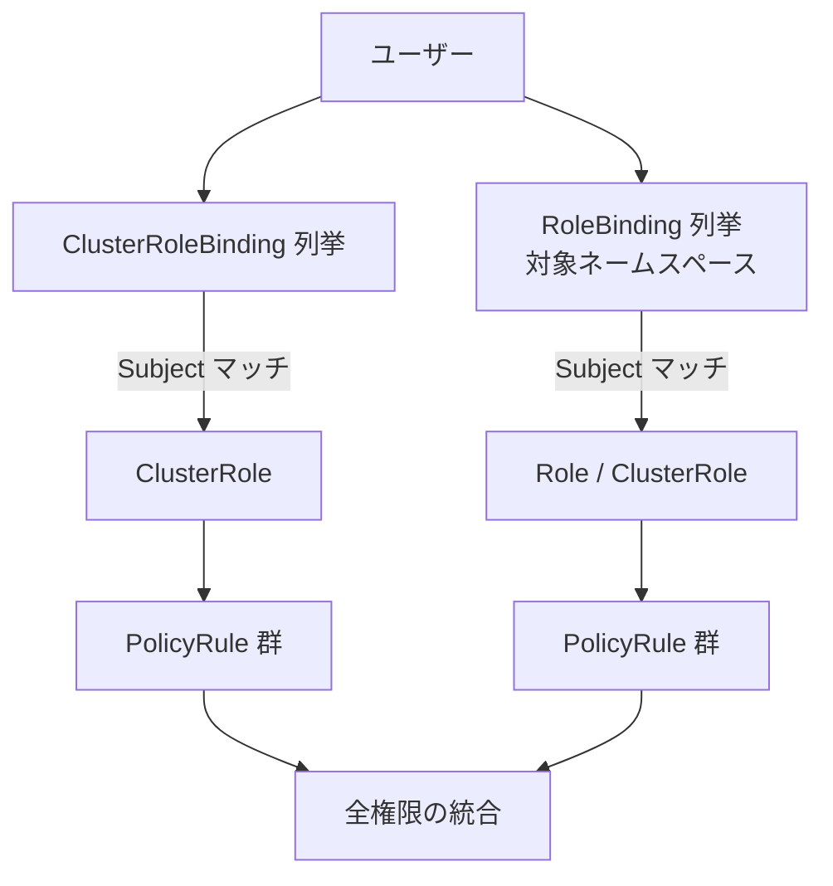
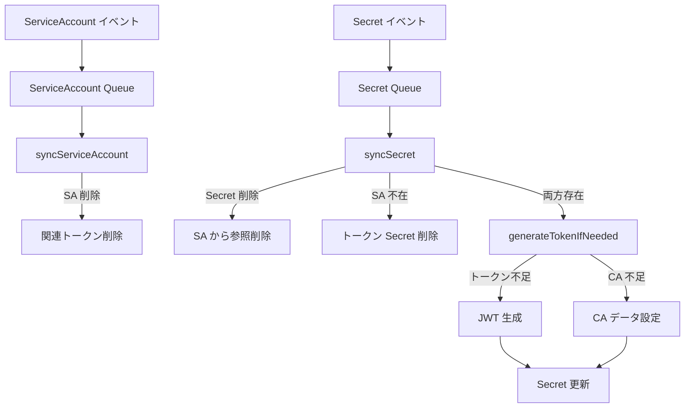

# 第23章 RBAC と ServiceAccount

> 本章で読むソース:
>
> - [pkg/registry/rbac/validation/rule.go L1-L368](https://github.com/kubernetes/kubernetes/blob/v1.36.2/pkg/registry/rbac/validation/rule.go#L1-L368)
> - [pkg/registry/rbac/rest/storage_rbac.go L1-L415](https://github.com/kubernetes/kubernetes/blob/v1.36.2/pkg/registry/rbac/rest/storage_rbac.go#L1-L415)
> - [pkg/controller/serviceaccount/tokens_controller.go L1-L619](https://github.com/kubernetes/kubernetes/blob/v1.36.2/pkg/controller/serviceaccount/tokens_controller.go#L1-L619)
> - [staging/src/k8s.io/apiserver/pkg/authentication/serviceaccount/util.go L1-L184](https://github.com/kubernetes/kubernetes/blob/v1.36.2/staging/src/k8s.io/apiserver/pkg/authentication/serviceaccount/util.go#L1-L184)

## この章の狙い

RBAC（Role-Based Access Control）は Kubernetes の標準的な認可機構である。
本章では RBAC の4リソースモデル、`DefaultRuleResolver` による権限解決、エスカレーション防止ロジック、そして `ServiceAccount` トークンの自動生成とユーザー名構築をソースコードから読み解く。

## 前提

本章は認証・認可のインターフェース（第22章）を前提とする。
`Authorizer` インターフェースと `Decision` の3値モデル（`Allow`、`Deny`、`NoOpinion`）を理解していることを想定する。

## RBAC の4リソース

RBAC は4種類のリソースで権限を表現する。

- **`Role`**: 特定のネームスペース内の権限ルール集合。
- **`ClusterRole`**: クラスター全体の権限ルール集合、または集約（Aggregation）のテンプレート。
- **`RoleBinding`**: `Role`（または `ClusterRole`）を特定のネームスペースの Subject にバインドする。
- **`ClusterRoleBinding`**: `ClusterRole` をクラスター全体の Subject にバインドする。

`PolicyRule` は権限の最小単位であり、API グループ、リソース、動詞（verb）の組み合わせで表現される。

## RBAC ストレージの初期化

RBAC の4リソースは `RESTStorageProvider` によって API サーバーに登録される。
この際、`DefaultRuleResolver` が4つのゲッター/リスターから構築される。

[pkg/registry/rbac/rest/storage_rbac.go L101-L126](https://github.com/kubernetes/kubernetes/blob/v1.36.2/pkg/registry/rbac/rest/storage_rbac.go#L101-L126)

```go
	authorizationRuleResolver := rbacregistryvalidation.NewDefaultRuleResolver(
		role.AuthorizerAdapter{Registry: role.NewRegistry(rolesStorage)},
		rolebinding.AuthorizerAdapter{Registry: rolebinding.NewRegistry(roleBindingsStorage)},
		clusterrole.AuthorizerAdapter{Registry: clusterrole.NewRegistry(clusterRolesStorage)},
		clusterrolebinding.AuthorizerAdapter{Registry: clusterrolebinding.NewRegistry(clusterRoleBindingsStorage)},
	)

	// roles
	if resource := "roles"; apiResourceConfigSource.ResourceEnabled(rbacapiv1.SchemeGroupVersion.WithResource(resource)) {
		storage[resource] = rolepolicybased.NewStorage(rolesStorage, p.Authorizer, authorizationRuleResolver)
	}

	// rolebindings
	if resource := "rolebindings"; apiResourceConfigSource.ResourceEnabled(rbacapiv1.SchemeGroupVersion.WithResource(resource)) {
		storage[resource] = rolebindingpolicybased.NewStorage(roleBindingsStorage, p.Authorizer, authorizationRuleResolver)
	}

	// clusterroles
	if resource := "clusterroles"; apiResourceConfigSource.ResourceEnabled(rbacapiv1.SchemeGroupVersion.WithResource(resource)) {
		storage[resource] = clusterrolepolicybased.NewStorage(clusterRolesStorage, p.Authorizer, authorizationRuleResolver)
	}

	// clusterrolebindings
	if resource := "clusterrolebindings"; apiResourceConfigSource.ResourceEnabled(rbacapiv1.SchemeGroupVersion.WithResource(resource)) {
		storage[resource] = clusterrolebindingpolicybased.NewStorage(clusterRoleBindingsStorage, p.Authorizer, authorizationRuleResolver)
	}
```

各リソースのストレージは `policybased.NewStorage` でラップされる。
このラッパーは、RBAC リソース自体への書き込みに対してエスカレーション防止チェックを適用する。

### ブートストラップロールの保証

API サーバー起動時には、システムに必要なデフォルトのロールとバインディングが存在することを保証する。

[pkg/registry/rbac/rest/storage_rbac.go L131-L141](https://github.com/kubernetes/kubernetes/blob/v1.36.2/pkg/registry/rbac/rest/storage_rbac.go#L131-L141)

```go
func (p RESTStorageProvider) PostStartHook() (string, genericapiserver.PostStartHookFunc, error) {
	policy := &PolicyData{
		ClusterRoles:               append(bootstrappolicy.ClusterRoles(), bootstrappolicy.ControllerRoles()...),
		ClusterRoleBindings:        append(bootstrappolicy.ClusterRoleBindings(), bootstrappolicy.ControllerRoleBindings()...),
		Roles:                      bootstrappolicy.NamespaceRoles(),
		RoleBindings:               bootstrappolicy.NamespaceRoleBindings(),
		ClusterRolesToAggregate:    bootstrappolicy.ClusterRolesToAggregate(),
		ClusterRoleBindingsToSplit: bootstrappolicy.ClusterRoleBindingsToSplit(),
	}
	return PostStartHookName, policy.EnsureRBACPolicy(), nil
}
```

`EnsureRBACPolicy` は `PostStartHook` として登録され、API サーバー起動後にブートストラップロールの作成・更新をポーリングで実行する。

[pkg/registry/rbac/rest/storage_rbac.go L162-L181](https://github.com/kubernetes/kubernetes/blob/v1.36.2/pkg/registry/rbac/rest/storage_rbac.go#L162-L181)

```go
func (p *PolicyData) EnsureRBACPolicy() genericapiserver.PostStartHookFunc {
	return func(hookContext genericapiserver.PostStartHookContext) error {
		// initializing roles is really important.  On some e2e runs, we've seen cases where etcd is down when the server
		// starts, the roles don't initialize, and nothing works.
		err := wait.Poll(1*time.Second, 30*time.Second, func() (done bool, err error) {
			client, err := clientset.NewForConfig(hookContext.LoopbackClientConfig)
			if err != nil {
				utilruntime.HandleError(fmt.Errorf("unable to initialize client set: %v", err))
				return false, nil
			}
			return ensureRBACPolicy(p, client)
		})
		// if we're never able to make it through initialization, kill the API server
		if err != nil {
			return fmt.Errorf("unable to initialize roles: %v", err)
		}

		return nil
	}
}
```

1秒間隔で最大30秒間ポーリングし、etcd が応答するのを待ってからブートストラップロールを投入する。
初期化に失敗すると API サーバー自体が起動しない。これは RBAC がセキュリティの根幹であるため、ロールなしでの稼働を許さない設計判断である。

## DefaultRuleResolver による権限解決

`DefaultRuleResolver` は、あるユーザーが持つ全権限を収集する。

[pkg/registry/rbac/validation/rule.go L91-L100](https://github.com/kubernetes/kubernetes/blob/v1.36.2/pkg/registry/rbac/validation/rule.go#L91-L100)

```go
type DefaultRuleResolver struct {
	roleGetter               RoleGetter
	roleBindingLister        RoleBindingLister
	clusterRoleGetter        ClusterRoleGetter
	clusterRoleBindingLister ClusterRoleBindingLister
}

func NewDefaultRuleResolver(roleGetter RoleGetter, roleBindingLister RoleBindingLister, clusterRoleGetter ClusterRoleGetter, clusterRoleBindingLister ClusterRoleBindingLister) *DefaultRuleResolver {
	return &DefaultRuleResolver{roleGetter, roleBindingLister, clusterRoleGetter, clusterRoleBindingLister}
}
```

### VisitRulesFor によるルール走査

`VisitRulesFor` は、`ClusterRoleBinding` と `RoleBinding` を列挙し、Subject にマッチするものを辿って権限ルールを visitor に渡す。

[pkg/registry/rbac/validation/rule.go L179-L237](https://github.com/kubernetes/kubernetes/blob/v1.36.2/pkg/registry/rbac/validation/rule.go#L179-L237)

```go
func (r *DefaultRuleResolver) VisitRulesFor(ctx context.Context, user user.Info, namespace string, visitor func(source fmt.Stringer, rule *rbacv1.PolicyRule, err error) bool) {
	if clusterRoleBindings, err := r.clusterRoleBindingLister.ListClusterRoleBindings(ctx); err != nil {
		if !visitor(nil, nil, err) {
			return
		}
	} else {
		sourceDescriber := &clusterRoleBindingDescriber{}
		for _, clusterRoleBinding := range clusterRoleBindings {
			subjectIndex, applies := appliesTo(user, clusterRoleBinding.Subjects, "")
			if !applies {
				continue
			}
			rules, err := r.GetRoleReferenceRules(ctx, clusterRoleBinding.RoleRef, "")
			if err != nil {
				if !visitor(nil, nil, err) {
					return
				}
				continue
			}
			sourceDescriber.binding = clusterRoleBinding
			sourceDescriber.subject = &clusterRoleBinding.Subjects[subjectIndex]
			for i := range rules {
				if !visitor(sourceDescriber, &rules[i], nil) {
					return
				}
			}
		}
	}

	if len(namespace) > 0 {
		if roleBindings, err := r.roleBindingLister.ListRoleBindings(ctx, namespace); err != nil {
			if !visitor(nil, nil, err) {
				return
			}
		} else {
			sourceDescriber := &roleBindingDescriber{}
			for _, roleBinding := range roleBindings {
				subjectIndex, applies := appliesTo(user, roleBinding.Subjects, namespace)
				if !applies {
					continue
				}
				rules, err := r.GetRoleReferenceRules(ctx, roleBinding.RoleRef, namespace)
				if err != nil {
					if !visitor(nil, nil, err) {
						return
					}
					continue
				}
				sourceDescriber.binding = roleBinding
				sourceDescriber.subject = &roleBinding.Subjects[subjectIndex]
				for i := range rules {
					if !visitor(sourceDescriber, &rules[i], nil) {
						return
					}
				}
			}
		}
	}
}
```

処理の流れは次の通りである。

1. まず全 `ClusterRoleBinding` を列挙し、ユーザーにマッチするものを探す。
2. マッチするバインディングがあれば、その `RoleRef` が指す `ClusterRole` を取得してルールを展開する。
3. ネームスペースが指定されていれば、同様に該当ネームスペースの `RoleBinding` を列挙する。
4. `RoleBinding` は `Role` または `ClusterRole` を参照し得る。`GetRoleReferenceRules` が両方を処理する。



### Subject マッチング

`appliesToUser` は Subject の Kind に応じてマッチングを行う。

[pkg/registry/rbac/validation/rule.go L281-L304](https://github.com/kubernetes/kubernetes/blob/v1.36.2/pkg/registry/rbac/validation/rule.go#L281-L304)

```go
func appliesToUser(user user.Info, subject rbacv1.Subject, namespace string) bool {
	switch subject.Kind {
	case rbacv1.UserKind:
		return user.GetName() == subject.Name

	case rbacv1.GroupKind:
		return has(user.GetGroups(), subject.Name)

	case rbacv1.ServiceAccountKind:
		// default the namespace to namespace we're working in if its available.  This allows rolebindings that reference
		// SAs in th local namespace to avoid having to qualify them.
		saNamespace := namespace
		if len(subject.Namespace) > 0 {
			saNamespace = subject.Namespace
		}
		if len(saNamespace) == 0 {
			return false
		}
		// use a more efficient comparison for RBAC checking
		return serviceaccount.MatchesUsername(saNamespace, subject.Name, user.GetName())
	default:
		return false
	}
}
```

`UserKind` はユーザー名の直接比較、`GroupKind` はグループリストとの照合である。
`ServiceAccountKind` は `MatchesUsername` を使って効率的な照合を行う。

### GetRoleReferenceRules

`GetRoleReferenceRules` は `RoleRef` の Kind に応じて Role または ClusterRole を取得する。

[pkg/registry/rbac/validation/rule.go L240-L259](https://github.com/kubernetes/kubernetes/blob/v1.36.2/pkg/registry/rbac/validation/rule.go#L240-L259)

```go
func (r *DefaultRuleResolver) GetRoleReferenceRules(ctx context.Context, roleRef rbacv1.RoleRef, bindingNamespace string) ([]rbacv1.PolicyRule, error) {
	switch roleRef.Kind {
	case "Role":
		role, err := r.roleGetter.GetRole(ctx, bindingNamespace, roleRef.Name)
		if err != nil {
			return nil, err
		}
		return role.Rules, nil

	case "ClusterRole":
		clusterRole, err := r.clusterRoleGetter.GetClusterRole(ctx, roleRef.Name)
		if err != nil {
			return nil, err
		}
		return clusterRole.Rules, nil

	default:
		return nil, fmt.Errorf("unsupported role reference kind: %q", roleRef.Kind)
	}
}
```

`RoleRef` が `Role` を指す場合はバインディングのネームスペースから Role を取得し、`ClusterRole` を指す場合はネームスペースを問わず ClusterRole を取得する。

## エスカレーション防止

RBAC の重要なセキュリティ特性は、自分が持つ権限を超えるロールを他者に付与できないことである。
`ConfirmNoEscalation` は、ユーザーが RBAC リソースを作成・更新する際に、その操作が既存の権限の範囲内であることを検証する。

[pkg/registry/rbac/validation/rule.go L53-L89](https://github.com/kubernetes/kubernetes/blob/v1.36.2/pkg/registry/rbac/validation/rule.go#L53-L89)

```go
func ConfirmNoEscalation(ctx context.Context, ruleResolver AuthorizationRuleResolver, rules []rbacv1.PolicyRule) error {
	ruleResolutionErrors := []error{}

	user, ok := genericapirequest.UserFrom(ctx)
	if !ok {
		return fmt.Errorf("no user on context")
	}
	namespace, _ := genericapirequest.NamespaceFrom(ctx)

	ownerRules, err := ruleResolver.RulesFor(ctx, user, namespace)
	if err != nil {
		// As per AuthorizationRuleResolver contract, this may return a non fatal error with an incomplete list of policies. Log the error and continue.
		klog.V(1).Infof("non-fatal error getting local rules for %v: %v", user, err)
		ruleResolutionErrors = append(ruleResolutionErrors, err)
	}

	ownerRightsCover, missingRights := validation.Covers(ownerRules, rules)
	if !ownerRightsCover {
		compactMissingRights := missingRights
		if compact, err := CompactRules(missingRights); err == nil {
			compactMissingRights = compact
		}

		missingDescriptions := sets.NewString()
		for _, missing := range compactMissingRights {
			missingDescriptions.Insert(rbacv1helpers.CompactString(missing))
		}

		msg := fmt.Sprintf("user %q (groups=%q) is attempting to grant RBAC permissions not currently held:\n%s", user.GetName(), user.GetGroups(), strings.Join(missingDescriptions.List(), "\n"))
		if len(ruleResolutionErrors) > 0 {
			msg = msg + fmt.Sprintf("; resolution errors: %v", ruleResolutionErrors)
		}

		return errors.New(msg)
	}
	return nil
}
```

処理の流れは次の通りである。

1. リクエストからユーザー情報を取り出す。
2. `RulesFor` でそのユーザーが現在持つ権限をすべて取得する。
3. `validation.Covers` で、ユーザーの権限が新規に付与しようとするルールをカバーしているかを確認する。
4. カバーできていないルールがあれば、不足権限を列挙してエラーを返す。

これにより、「cluster-admin 権限を持つユーザーだけが cluster-admin を付与できる」といった制約が自動的に保証される。

## ServiceAccount のユーザー名構築

`ServiceAccount` は Kubernetes 内の非人間主体（Pod 内で動作するアプリケーションなど）を表す。
認証されると、`system:serviceaccount:<namespace>:<name>` 形式のユーザー名が付与される。

[staging/src/k8s.io/apiserver/pkg/authentication/serviceaccount/util.go L28-L57](https://github.com/kubernetes/kubernetes/blob/v1.36.2/staging/src/k8s.io/apiserver/pkg/authentication/serviceaccount/util.go#L28-L57)

```go
const (
	ServiceAccountUsernamePrefix    = "system:serviceaccount:"
	ServiceAccountUsernameSeparator = ":"
	ServiceAccountGroupPrefix       = "system:serviceaccounts:"
	AllServiceAccountsGroup         = "system:serviceaccounts"
	// ... (中略) ...
)

// MakeUsername generates a username from the given namespace and ServiceAccount name.
// The resulting username can be passed to SplitUsername to extract the original namespace and ServiceAccount name.
func MakeUsername(namespace, name string) string {
	return ServiceAccountUsernamePrefix + namespace + ServiceAccountUsernameSeparator + name
}
```

例えば `kube-system` ネームスペースの `default` ServiceAccount は `system:serviceaccount:kube-system:default` というユーザー名になる。

### グループ名

ServiceAccount は暗黙的に2つのグループに所属する。

[staging/src/k8s.io/apiserver/pkg/authentication/serviceaccount/util.go L104-L114](https://github.com/kubernetes/kubernetes/blob/v1.36.2/staging/src/k8s.io/apiserver/pkg/authentication/serviceaccount/util.go#L104-L114)

```go
// MakeGroupNames generates service account group names for the given namespace
func MakeGroupNames(namespace string) []string {
	return []string{
		AllServiceAccountsGroup,
		MakeNamespaceGroupName(namespace),
	}
}

// MakeNamespaceGroupName returns the name of the group all service accounts in the namespace are included in
func MakeNamespaceGroupName(namespace string) string {
	return ServiceAccountGroupPrefix + namespace
}
```

- `system:serviceaccounts`: 全ネームスペースの全 ServiceAccount を含むグループ。
- `system:serviceaccounts:<namespace>`: 特定のネームスペースの ServiceAccount を含むグループ。

### ServiceAccountInfo

`ServiceAccountInfo` は Pod のバインディング情報を含む `user.Info` を構築する。

[staging/src/k8s.io/apiserver/pkg/authentication/serviceaccount/util.go L125-L164](https://github.com/kubernetes/kubernetes/blob/v1.36.2/staging/src/k8s.io/apiserver/pkg/authentication/serviceaccount/util.go#L125-L164)

```go
type ServiceAccountInfo struct {
	Name, Namespace, UID string
	PodName, PodUID      string
	CredentialID         string
	NodeName, NodeUID    string
}

func (sa *ServiceAccountInfo) UserInfo() user.Info {
	info := &user.DefaultInfo{
		Name:   MakeUsername(sa.Namespace, sa.Name),
		UID:    sa.UID,
		Groups: MakeGroupNames(sa.Namespace),
	}

	if sa.PodName != "" && sa.PodUID != "" {
		if info.Extra == nil {
			info.Extra = make(map[string][]string)
		}
		info.Extra[PodNameKey] = []string{sa.PodName}
		info.Extra[PodUIDKey] = []string{sa.PodUID}
	}
	if sa.CredentialID != "" {
		if info.Extra == nil {
			info.Extra = make(map[string][]string)
		}
		info.Extra[user.CredentialIDKey] = []string{sa.CredentialID}
	}
	if sa.NodeName != "" {
		if info.Extra == nil {
			info.Extra = make(map[string][]string)
		}
		info.Extra[NodeNameKey] = []string{sa.NodeName}
		// node UID is optional and will only be set if the node name is set
		if sa.NodeUID != "" {
			info.Extra[NodeUIDKey] = []string{sa.NodeUID}
		}
	}

	return info
}
```

`PodName` と `PodUID` は Token Bound Pod 識別のために `Extra` に格納される。
これにより監査ログから、どの Pod が発行したトークンがどの API リクエストに使われたかを追跡できる。

### MatchesUsername によるゼロアロケーション比較

`MatchesUsername` は、文字列結合なしに ServiceAccount のユーザー名が一致するかを判定する。

[staging/src/k8s.io/apiserver/pkg/authentication/serviceaccount/util.go L59-L78](https://github.com/kubernetes/kubernetes/blob/v1.36.2/staging/src/k8s.io/apiserver/pkg/authentication/serviceaccount/util.go#L59-L78)

```go
// MatchesUsername checks whether the provided username matches the namespace and name without
// allocating. Use this when checking a service account namespace and name against a known string.
func MatchesUsername(namespace, name string, username string) bool {
	if !strings.HasPrefix(username, ServiceAccountUsernamePrefix) {
		return false
	}
	username = username[len(ServiceAccountUsernamePrefix):]

	if !strings.HasPrefix(username, namespace) {
		return false
	}
	username = username[len(namespace):]

	if !strings.HasPrefix(username, ServiceAccountUsernameSeparator) {
		return false
	}
	username = username[len(ServiceAccountUsernameSeparator):]

	return username == name
}
```

`MakeUsername` で文字列を結合してから比較するのではなく、プレフィックスを順に削りながら直接比較する。
これによりヒープアロケーションが発生せず、RBAC の Subject マッチングのような高頻度パスで性能上の優位性を持つ。
`VisitRulesFor` は大量のバインディングに対してこの比較を繰り返すため、ゼロアロケーションであることがそのままレイテンシの削減につながる。

## TokensController によるトークン生成

`TokensController` は `ServiceAccount` に紐づく `Secret` のトークンデータを管理するコントローラである。

[pkg/controller/serviceaccount/tokens_controller.go L136-L163](https://github.com/kubernetes/kubernetes/blob/v1.36.2/pkg/controller/serviceaccount/tokens_controller.go#L136-L163)

```go
// TokensController manages ServiceAccountToken secrets for ServiceAccount objects
type TokensController struct {
	client clientset.Interface
	token  serviceaccount.TokenGenerator

	rootCA []byte

	serviceAccounts listersv1.ServiceAccountLister
	secrets         listersv1.SecretLister

	// Since we join two objects, we'll watch both of them with controllers.
	serviceAccountSynced cache.InformerSynced
	secretSynced         cache.InformerSynced

	// syncServiceAccountQueue handles service account events:
	//   * ensures tokens are removed for service accounts which no longer exist
	// key is "<namespace>/<name>/<uid>"
	syncServiceAccountQueue workqueue.TypedRateLimitingInterface[serviceAccountQueueKey]

	// syncSecretQueue handles secret events:
	//   * deletes tokens whose service account no longer exists
	//   * updates tokens with missing token or namespace data, or mismatched ca data
	//   * ensures service account secret references are removed for tokens which are deleted
	// key is a secretQueueKey{}
	syncSecretQueue workqueue.TypedRateLimitingInterface[secretQueueKey]

	maxRetries int
}
```

2つの `WorkQueue` を使って ServiceAccount イベントと Secret イベントをそれぞれ処理する。

### イベント処理の流れ

`syncSecret` は Secret の作成・更新・削除を処理する。

[pkg/controller/serviceaccount/tokens_controller.go L275-L332](https://github.com/kubernetes/kubernetes/blob/v1.36.2/pkg/controller/serviceaccount/tokens_controller.go#L275-L332)

```go
func (e *TokensController) syncSecret(ctx context.Context) {
	key, quit := e.syncSecretQueue.Get()
	if quit {
		return
	}
	defer e.syncSecretQueue.Done(key)

	logger := klog.FromContext(ctx)
	// Track whether or not we should retry this sync
	retry := false
	defer func() {
		retryOrForget(logger, e.syncSecretQueue, key, retry, e.maxRetries)
	}()

	secretInfo, err := parseSecretQueueKey(key)
	if err != nil {
		logger.Error(err, "Parsing secret queue key")
		return
	}

	secret, err := e.getSecret(ctx, secretInfo.namespace, secretInfo.name, secretInfo.uid)
	switch {
	case err != nil:
		logger.Error(err, "Getting secret")
		retry = true
	case secret == nil:
		// If the service account exists
		if sa, saErr := e.getServiceAccount(ctx, secretInfo.namespace, secretInfo.saName, secretInfo.saUID, false); saErr == nil && sa != nil {
			// secret no longer exists, so delete references to this secret from the service account
			if err := clientretry.RetryOnConflict(RemoveTokenBackoff, func() error {
				return e.removeSecretReference(ctx, secretInfo.namespace, secretInfo.saName, secretInfo.saUID, secretInfo.name)
			}); err != nil {
				logger.Error(err, "Removing secret reference")
			}
		}
	default:
		// Ensure service account exists
		sa, saErr := e.getServiceAccount(ctx, secretInfo.namespace, secretInfo.saName, secretInfo.saUID, true)
		switch {
		case saErr != nil:
			logger.Error(saErr, "Getting service account")
			retry = true
		case sa == nil:
			// Delete token
			logger.V(4).Info("Service account does not exist, deleting token", "secret", klog.KRef(secretInfo.namespace, secretInfo.name))
			if retriable, err := e.deleteToken(ctx, secretInfo.namespace, secretInfo.name, secretInfo.uid); err != nil {
				logger.Error(err, "Deleting serviceaccount token", "secret", klog.KRef(secretInfo.namespace, secretInfo.name), "serviceAccount", klog.KRef(secretInfo.namespace, secretInfo.saName))
				retry = retriable
			}
		default:
			// Update token if needed
			if retriable, err := e.generateTokenIfNeeded(ctx, sa, secret); err != nil {
				logger.Error(err, "Populating serviceaccount token", "secret", klog.KRef(secretInfo.namespace, secretInfo.name), "serviceAccount", klog.KRef(secretInfo.namespace, secretInfo.saName))
				retry = retriable
			}
		}
	}
}
```

Secret が存在しない場合は ServiceAccount からの参照を削除する。
Secret は存在するが ServiceAccount が存在しない場合はトークンを削除する。
両方存在する場合は `generateTokenIfNeeded` でトークンデータを生成する。

### トークン生成

`generateTokenIfNeeded` は Secret にトークン・CA・ネームスペースのデータが揃っているかを確認し、不足分を生成する。

[pkg/controller/serviceaccount/tokens_controller.go L382-L449](https://github.com/kubernetes/kubernetes/blob/v1.36.2/pkg/controller/serviceaccount/tokens_controller.go#L382-L449)

```go
func (e *TokensController) generateTokenIfNeeded(ctx context.Context, serviceAccount *v1.ServiceAccount, cachedSecret *v1.Secret) ( /* retry */ bool, error) {
	// Check the cached secret to see if changes are needed
	if needsCA, needsNamespace, needsToken := e.secretUpdateNeeded(cachedSecret); !needsCA && !needsToken && !needsNamespace {
		return false, nil
	}

	// We don't want to update the cache's copy of the secret
	// so add the token to a freshly retrieved copy of the secret
	secrets := e.client.CoreV1().Secrets(cachedSecret.Namespace)
	liveSecret, err := secrets.Get(ctx, cachedSecret.Name, metav1.GetOptions{})
	if err != nil {
		// Retry for any error other than a NotFound
		return !apierrors.IsNotFound(err), err
	}
	if liveSecret.ResourceVersion != cachedSecret.ResourceVersion {
		// our view of the secret is not up to date
		// we'll get notified of an update event later and get to try again
		klog.FromContext(ctx).V(2).Info("Secret is not up to date, skipping token population", "secret", klog.KRef(liveSecret.Namespace, liveSecret.Name))
		return false, nil
	}

	// ... (中略) ...

	// Generate the token
	if needsToken {
		c, pc := serviceaccount.LegacyClaims(*serviceAccount, *liveSecret)
		token, err := e.token.GenerateToken(ctx, c, pc)
		if err != nil {
			return false, err
		}
		liveSecret.Data[v1.ServiceAccountTokenKey] = []byte(token)
	}

	// Set annotations
	liveSecret.Annotations[v1.ServiceAccountNameKey] = serviceAccount.Name
	liveSecret.Annotations[v1.ServiceAccountUIDKey] = string(serviceAccount.UID)

	// Save the secret
	_, err = secrets.Update(ctx, liveSecret, metav1.UpdateOptions{})
	if apierrors.IsConflict(err) || apierrors.IsNotFound(err) {
		// if we got a Conflict error, the secret was updated by someone else, and we'll get an update notification later
		// if we got a NotFound error, the secret no longer exists, and we don't need to populate a token
		return false, nil
	}
	if err != nil {
		return true, err
	}
	return false, nil
}
```

キャッシュとライブの `ResourceVersion` を比較して、キャッシュが最新であることを確認してから更新する。
これにより、他のコントローラやユーザーが同時に更新した場合の競合を回避する。
トークンは `TokenGenerator.GenerateToken` で生成され、JWT 形式で Secret の `token` キーに格納される。



## まとめ

RBAC は4リソース（`Role`、`ClusterRole`、`RoleBinding`、`ClusterRoleBinding`）で権限を表現し、`DefaultRuleResolver` が `ClusterRoleBinding` と `RoleBinding` を走査してユーザーの権限を収集する。
エスカレーション防止は `ConfirmNoEscalation` によって保証され、ユーザーは自分が持つ権限を超えるロールを付与できない。
`ServiceAccount` のユーザー名は `system:serviceaccount:<namespace>:<name>` 形式で構築され、`MatchesUsername` はゼロアロケーションでマッチングを行う。
`TokensController` は ServiceAccount トークンの生成・削除・参照整合性を管理し、キャッシュとライブの `ResourceVersion` 比較で競合を回避する。

## 関連する章

- [第22章 Authentication と Authorization](22-authentication-and-authorization.md): 認可インターフェースとチェーン機構
- [第3章 kube-apiserver のアーキテクチャ](../part01-apiserver/03-apiserver-architecture.md): API サーバーの全体像
- [第10章 主要コントローラ](../part03-controller-manager/10-workload-controllers.md): コントローラパターンの基礎
