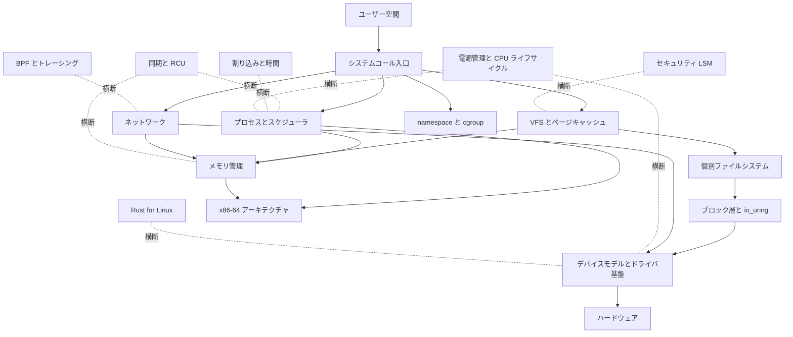

# Linux カーネル ソースコードリーディング

Linux カーネル（[gregkh/linux](https://github.com/gregkh/linux)）のソースコードを読み解き、各サブシステムが「何のために、どういう処理を行うか」と「高速化と最適化の工夫」を、ソースコードを引用しながら日本語で解説するドキュメント群である。
コードベースが巨大なため、サブシステム別の分冊に分けて、重要度と関心に応じて少しずつ執筆する。

- **対象バージョン**：6.18.38（最新 LTS 系列。コード引用はすべて [`v6.18.38` タグ](https://github.com/gregkh/linux/tree/v6.18.38)に固定）
- **対比バージョン**：7.1.3（変化の途上にある 7.x 系。大きな変更は [`v7.1.3` タグ](https://github.com/gregkh/linux/tree/v7.1.3)への固定リンク付きで注釈する）
- **想定読者**：C とオペレーティングシステムの基礎があり、カーネルの内部実装をソースから追いたい中級エンジニア
- **読み方**：分冊は独立して読めるが、「全体像と横断基盤」から入り、コア（スケジューラ、同期、割り込みと時間）、メモリ管理、ストレージとネットワーク、周辺サブシステムへ進む順序を推奨する
- **ライセンス**：GPL-2.0 WITH Linux-syscall-note（引用の方針はリポジトリルートの[引用とライセンス](../README.md#引用とライセンス)を参照）。

アーキテクチャ依存の記述は x86-64 を既定とする。

## サブシステムの全体像

## 収録分冊

| 分冊 | 範囲 | 主要ソースディレクトリ |
|---|---|---|
| [全体像と横断基盤](foundation/README.md) | ソースツリーの地図、Kconfig と Kbuild、起動シーケンス、システムコール入口、主要データ構造（リスト、赤黒木、XArray、Maple Tree、rhashtable、IDR）、モジュールローダと livepatch、sysctl とカーネルパラメータ、panic と reboot | init/、kernel/entry/、kernel/module/、kernel/livepatch/、kernel/params.c、kernel/sysctl.c、kernel/panic.c、kernel/reboot.c、lib/、include/linux/ |
| [プロセスとスケジューラ](sched/README.md) | task_struct、fork と exec、シグナル配送、sleep と wakeup、kthread、EEVDF スケジューラ、sched_ext、RT と deadline クラス、プリエンプションモデル、topology と PELT、PSI、ptrace | kernel/sched/、kernel/fork.c、kernel/signal.c、kernel/kthread.c、kernel/ptrace.c、fs/exec.c |
| [同期と RCU](locking/README.md) | アトミック操作、スピンロック、mutex と rwsem、seqlock、waitqueue、lockdep、RCU（Tree、SRCU、Tasks）、per-CPU 変数、futex | kernel/locking/、kernel/rcu/、kernel/futex/、kernel/sched/wait.c、kernel/sched/swait.c、kernel/sched/wait_bit.c |
| [割り込みと時間](irq-time/README.md) | genirq、MSI ドメイン、softirq と irq_work、workqueue、タイマーホイールと timer migration、hrtimer、tick と NO_HZ、tick broadcast、クロックソース、NTP 補正、POSIX タイマー | kernel/irq/、kernel/time/、kernel/softirq.c、kernel/workqueue.c |
| [メモリ管理](mm/README.md) | memblock、バディアロケータ、SLUB、folio、VMA と Maple Tree、ページフォールト、rmap、LRU と MGLRU、回収とコンパクション、THP、memcg、swap、NUMA バランシングの fault 側 | mm/ |
| [VFS とページキャッシュ](vfs/README.md) | パス解決と dcache、inode、マウント、ページキャッシュ、writeback、読み書きの経路 | fs/（コア部分）、mm/filemap.c |
| [個別ファイルシステム](fs/README.md) | ext4、btrfs、XFS、overlayfs、tmpfs、procfs と kernfs（25章、directory/htree、mballoc、transaction/tree-log、inode fork など補強済み） | fs/ext4/、fs/btrfs/、fs/xfs/、fs/overlayfs/ ほか |
| [ブロック層と io_uring](block/README.md) | bio と request、blk-mq、I/O スケジューラ、io_uring、NVMe ドライバ概観、device mapper | block/、io_uring/、drivers/nvme/ |
| [ネットワーク](net/README.md) | sk_buff、ソケット層、TCP/IP、netfilter、ルーティング、GRO と XDP などの高速化 | net/ |
| [namespace と cgroup](ns-cgroup/README.md) | 各種 namespace（time namespace を含む）、cgroup v2 コア、主要コントローラ、コンテナ実行の土台 | kernel/cgroup/、kernel/nsproxy.c、kernel/time/namespace.c、ipc/ |
| [電源管理と CPU ライフサイクル](power-cpu/README.md) | suspend と hibernate、freezer、PM QoS、device PM（runtime PM・wakeup・genpd）、cpufreq と cpuidle、CPU hotplug | kernel/power/、kernel/cpu.c、drivers/cpuidle/、drivers/cpufreq/ |
| [セキュリティ](security/README.md) | LSM フック、capabilities、seccomp、Landlock、keys（SELinux 本体の詳細は [SELinux userspace](../selinux/README.md) と接続する） | security/、kernel/capability.c、kernel/seccomp.c |
| [仮想化（KVM）](kvm/README.md) | KVM コア、x86 の VMX と SVM、vhost 概観 | virt/kvm/、arch/x86/kvm/ |
| [デバイスモデルとドライバ基盤](driver-model/README.md) | driver core、bus と probe、sysfs、Device Tree と ACPI 概観、PCI | drivers/base/、drivers/pci/ |
| [BPF とトレーシング](bpf/README.md) | verifier、JIT、map、tracepoint、ftrace、kprobes、perf | kernel/bpf/、kernel/trace/、kernel/events/ |
| [Rust for Linux](rust/README.md) | ビルド統合、kernel クレート、抽象レイヤー、実ドライバ例 | rust/ |
| [x86-64 アーキテクチャ](x86/README.md) | ブートの詳細（全体像と横断基盤の概観を引き継ぐ）、エントリ（システムコール、例外、割り込み）、コンテキストスイッチ、ページテーブル、SMP と per-CPU | arch/x86/ |

分冊を執筆したら、分冊名を各分冊の README へのリンクに置き換える。
部と章の数は対象サブシステムの実態から決め、既存分冊の章数に合わせない。

## 7.x 系への注釈の方針

7.x 系は LTS リリースがまだなく変化の途上だが、大きな変更が入っている。
対象コードが 7.x 系で大きく変わる章には「7.x 系での変化」の注記を置き、`v7.1.3` タグへの固定リンクで対比する。
例として、プリエンプションモデルの既定値は 6.18 の `PREEMPT_NONE` から 7.1 では対応アーキテクチャで `PREEMPT_LAZY` に変わっている（`kernel/Kconfig.preempt`）。
Rust 対応のコードも 6.18 から 7.1 の間に大きく拡大している。
7.x 系で削除されるレガシーコードは「削除予定」と注記し、歴史的な意義が大きい場合を除いて深くは扱わない。

---

> 分冊は重要度と関心に応じて順次執筆する。
> コード引用は `v6.18.38` タグに固定し、7.x 系の注釈のみ `v7.1.3` タグを使う。
