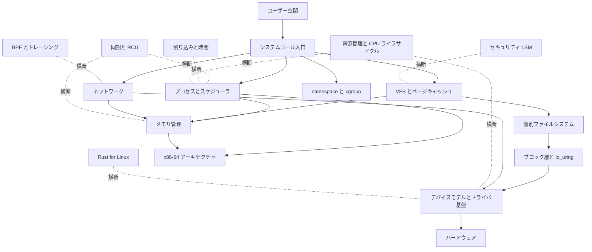

# Linux カーネル ソースコードリーディング

Linux カーネル（[gregkh/linux](https://github.com/gregkh/linux)）のソースコードを読み解き、各サブシステムが「何のために、どういう処理を行うか」と「高速化と最適化の工夫」を、ソースコードを引用しながら日本語で解説するドキュメント群である。
コードベースが巨大なため、サブシステム別の分冊に分けて、重要度と関心に応じて少しずつ執筆する。

- **対象バージョン**：6.18.38（最新 LTS 系列。コード引用はすべて [`v6.18.38` タグ](https://github.com/gregkh/linux/tree/v6.18.38)に固定）
- **対比バージョン**：7.1.3（変化の途上にある 7.x 系。大きな変更は [`v7.1.3` タグ](https://github.com/gregkh/linux/tree/v7.1.3)への固定リンク付きで注釈する）
- **想定読者**：C とオペレーティングシステムの基礎があり、カーネルの内部実装をソースから追いたい中級エンジニア
- **読み方**：分冊は独立して読めるが、「全体像と横断基盤」から入り、コア（スケジューラ、同期、割り込みと時間）、メモリ管理、ストレージとネットワーク、周辺サブシステムへ進む順序を推奨する
- **ライセンス**：GPL-2.0 WITH Linux-syscall-note（引用の方針はリポジトリルートの[引用とライセンス](../README.md#引用とライセンス)を参照）。

アーキテクチャ依存の記述は x86-64 を既定とする。

## サブシステムの全体像

## 収録分冊

| 分冊 | 範囲 | 主要ソースディレクトリ | 状態 |
|---|---|---|---|
| [全体像と横断基盤](foundation/README.md) | ソースツリーの地図、Kconfig と Kbuild、起動シーケンス、システムコール入口、主要データ構造（リスト、赤黒木、XArray、Maple Tree、rhashtable、IDR）、モジュールローダと livepatch、sysctl とカーネルパラメータ、panic と reboot | init/、kernel/entry/、kernel/module/、kernel/livepatch/、kernel/params.c、kernel/sysctl.c、kernel/panic.c、kernel/reboot.c、lib/、include/linux/ | 公開（補強中） |
| [プロセスとスケジューラ](sched/README.md) | task_struct、fork と exec、シグナル配送、sleep と wakeup、kthread、EEVDF スケジューラ、sched_ext、RT と deadline クラス、プリエンプションモデル、topology と PELT、PSI、ptrace | kernel/sched/、kernel/fork.c、kernel/signal.c、kernel/kthread.c、kernel/ptrace.c、fs/exec.c | 公開（補強中） |
| [同期と RCU](locking/README.md) | アトミック操作、スピンロック、mutex と rwsem、seqlock、waitqueue、lockdep、RCU（Tree、SRCU、Tasks）、per-CPU 変数、futex | kernel/locking/、kernel/rcu/、kernel/futex/、kernel/sched/wait.c、kernel/sched/swait.c、kernel/sched/wait_bit.c | 公開（補強中） |
| [割り込みと時間](irq-time/README.md) | genirq、MSI ドメイン、softirq と irq_work、workqueue、タイマーホイールと timer migration、hrtimer、tick と NO_HZ、tick broadcast、クロックソース、NTP 補正、POSIX タイマー | kernel/irq/、kernel/time/、kernel/softirq.c、kernel/workqueue.c | 公開（補強中） |
| [メモリ管理](mm/README.md) | memblock、バディアロケータ、SLUB、folio、VMA と Maple Tree、ページフォールト、rmap、LRU と MGLRU、回収とコンパクション、THP、memcg、swap、NUMA バランシングの fault 側 | mm/ | 公開 |
| VFS とページキャッシュ | パス解決と dcache、inode、マウント、ページキャッシュ、writeback、読み書きの経路 | fs/（コア部分）、mm/filemap.c | 計画 |
| 個別ファイルシステム | ext4、btrfs、XFS 概観、overlayfs、tmpfs、procfs と sysfs | fs/ext4/、fs/btrfs/ ほか | 計画 |
| ブロック層と io_uring | bio と request、blk-mq、I/O スケジューラ、io_uring、NVMe ドライバ概観、device mapper | block/、io_uring/、drivers/nvme/ | 計画 |
| ネットワーク | sk_buff、ソケット層、TCP/IP、netfilter、ルーティング、GRO と XDP などの高速化 | net/ | 計画 |
| namespace と cgroup | 各種 namespace（time namespace を含む）、cgroup v2 コア、主要コントローラ、コンテナ実行の土台 | kernel/cgroup/、kernel/nsproxy.c、kernel/time/namespace.c、ipc/ | 計画 |
| 電源管理と CPU ライフサイクル | suspend と hibernate、freezer、PM QoS、cpufreq と cpuidle、CPU hotplug | kernel/power/、kernel/cpu.c、drivers/cpuidle/、drivers/cpufreq/ | 計画 |
| セキュリティ | LSM フック、capabilities、seccomp、Landlock、keys（SELinux 本体の詳細は [SELinux userspace](../selinux/README.md) と接続する） | security/ | 計画 |
| 仮想化（KVM） | KVM コア、x86 の VMX と SVM、vhost 概観 | virt/kvm/、arch/x86/kvm/ | 計画 |
| デバイスモデルとドライバ基盤 | driver core、bus と probe、sysfs、Device Tree と ACPI 概観、PCI | drivers/base/、drivers/pci/ | 計画 |
| BPF とトレーシング | verifier、JIT、map、tracepoint、ftrace、kprobes、perf | kernel/bpf/、kernel/trace/、kernel/events/ | 計画 |
| Rust for Linux | ビルド統合、kernel クレート、抽象レイヤー、実ドライバ例 | rust/ | 計画 |
| x86-64 アーキテクチャ | ブートの詳細（全体像と横断基盤の概観を引き継ぐ）、エントリ（システムコール、例外、割り込み）、コンテキストスイッチ、ページテーブル、SMP と per-CPU | arch/x86/ | 計画 |

分冊を執筆したら、分冊名を各分冊の README へのリンクに置き換え、状態を「計画」から「公開」に更新する。
部と章の数は対象サブシステムの実態から決め、既存分冊の章数に合わせない。

## 補強計画

構成監査で、公開済み4分冊に根本的なカバレッジ欠落が見つかった。
以下を優先度順に補強 PR で追加する。

- **P2（継続候補）**：irq-time の IRQ affinity と vector matrix、IRQ timing 予測、foundation の livepatch。
- **章の分割**：詰め込みすぎと判定された章（rwsem、expedited と nocb、workqueue、clocksource と clockevents、NO_HZ、Kconfig と Kbuild など）は補強 PR の中で段階的に分割する。
- **将来分冊との境界**：x86-64 の boot とエントリ詳細、Maple Tree の VMA 適用、kobject のデバイス登録、cgroup コア、NUMA fault 側など、計画中の分冊と重なる詳細は該当分冊の執筆時に移し、それまでは参照注記で扱う。

## 7.x 系への注釈の方針

7.x 系は LTS リリースがまだなく変化の途上だが、大きな変更が入っている。
対象コードが 7.x 系で大きく変わる章には「7.x 系での変化」の注記を置き、`v7.1.3` タグへの固定リンクで対比する。
例として、プリエンプションモデルの既定値は 6.18 の `PREEMPT_NONE` から 7.1 では対応アーキテクチャで `PREEMPT_LAZY` に変わっている（`kernel/Kconfig.preempt`）。
Rust 対応のコードも 6.18 から 7.1 の間に大きく拡大している。
7.x 系で削除されるレガシーコードは「削除予定」と注記し、歴史的な意義が大きい場合を除いて深くは扱わない。

---

> 分冊は重要度と関心に応じて順次執筆する。
> コード引用は `v6.18.38` タグに固定し、7.x 系の注釈のみ `v7.1.3` タグを使う。
