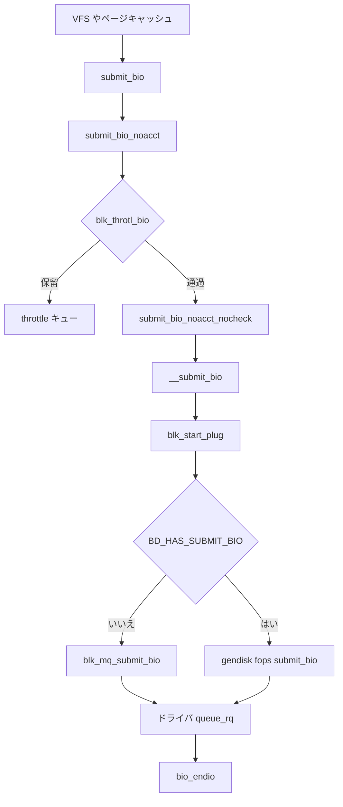

# 第1章 ブロック層の全体像と submit_bio 経路

> **本章で読むソース**
>
> - [`block/blk-core.c` L626-L652](https://github.com/gregkh/linux/blob/v6.18.38/block/blk-core.c#L626-L652)
> - [`block/blk-core.c` L730-L758](https://github.com/gregkh/linux/blob/v6.18.38/block/blk-core.c#L730-L758)
> - [`block/blk-core.c` L782-L879](https://github.com/gregkh/linux/blob/v6.18.38/block/blk-core.c#L782-L879)
> - [`block/blk-core.c` L911-L922](https://github.com/gregkh/linux/blob/v6.18.38/block/blk-core.c#L911-L922)
> - [`block/blk-mq.c` L3121-L3183](https://github.com/gregkh/linux/blob/v6.18.38/block/blk-mq.c#L3121-L3183)
> - [`include/linux/blk_types.h` L210-L233](https://github.com/gregkh/linux/blob/v6.18.38/include/linux/blk_types.h#L210-L233)

## この章の狙い

ファイルシステムやページキャッシュから届くディスク I/O が、**bio** を介してブロック層に入り、**request** に変換されてドライバへ渡るまでの主経路を概観する。
`submit_bio` から `blk_mq_submit_bio` までを地図として押さえ、後続章で各オブジェクトを深掘りする。

## 前提

- [VFS とページキャッシュ](../../vfs/README.md) で `read`/`write` がページキャッシュを経由することを知っていること。
- ブロックデバイスはセクタ単位でアクセスする点を知っていること。

## ブロック層が担う役割

VFS はファイル単位で読み書きする。
実ディスクへはセクタ番号とバッファアドレスを持つ **bio**（block I/O）に変換してからブロック層へ渡す。
ブロック層はマージ、スケジューリング、タグ管理、完了通知を担い、下層の NVMe や device mapper へ **request** を配送する。

ページキャッシュのライトバックは [VFS 分冊の writeback 章](../../vfs/part05-writeback/17-writeback-bdi-kthread.md) で扱う。
本分冊では bio がブロック層に入ったあとの処理に焦点を当てる。

## bio の入口フィールド

bio はブロック層と下層ドライバが共有する I/O 単位である。
`bi_bdev` が対象デバイス、`bi_opf` が操作種別とフラグ、`bi_iter` がセクタ位置と残りバイト数を表す。

[`include/linux/blk_types.h` L210-L233](https://github.com/gregkh/linux/blob/v6.18.38/include/linux/blk_types.h#L210-L233)

```c
struct bio {
	struct bio		*bi_next;	/* request queue link */
	struct block_device	*bi_bdev;
	blk_opf_t		bi_opf;		/* bottom bits REQ_OP, top bits
						 * req_flags.
						 */
	unsigned short		bi_flags;	/* BIO_* below */
	unsigned short		bi_ioprio;
	enum rw_hint		bi_write_hint;
	u8			bi_write_stream;
	blk_status_t		bi_status;
	atomic_t		__bi_remaining;

	struct bvec_iter	bi_iter;

	union {
		/* for polled bios: */
		blk_qc_t		bi_cookie;
		/* for plugged zoned writes only: */
		unsigned int		__bi_nr_segments;
	};
	bio_end_io_t		*bi_end_io;
	void			*bi_private;
#ifdef CONFIG_BLK_CGROUP
```

完了は `bi_end_io` コールバックで非同期に通知される。
呼び出し側はコールバックが走るまで bio を触ってはならない。

## submit_bio の公開 API

ファイルシステムやメモリ管理から呼ばれる公開入口は `submit_bio` である。
読み取りでは VM 統計を更新し、I/O 優先度を設定したうえで `submit_bio_noacct` へ進む。

[`block/blk-core.c` L911-L922](https://github.com/gregkh/linux/blob/v6.18.38/block/blk-core.c#L911-L922)

```c
void submit_bio(struct bio *bio)
{
	if (bio_op(bio) == REQ_OP_READ) {
		task_io_account_read(bio->bi_iter.bi_size);
		count_vm_events(PGPGIN, bio_sectors(bio));
	} else if (bio_op(bio) == REQ_OP_WRITE) {
		count_vm_events(PGPGOUT, bio_sectors(bio));
	}

	bio_set_ioprio(bio);
	submit_bio_noacct(bio);
}
```

スタック型ブロックドライバが下層へ再投入するときだけ `submit_bio_noacct` を使う。
この区別により、上層と下層で検証責務を分けている。

## submit_bio_noacct の検証とスロットリング

`submit_bio_noacct` は操作種別ごとにデバイス能力を検査する。
読み取り専用デバイス、パーティション境界、ゾーンデバイス制約、フラッシュ合成などをここで弾く。
`blk_throtl_bio` が真を返せば、ここで一旦保留され、帯域制限が効く。

[`block/blk-core.c` L782-L879](https://github.com/gregkh/linux/blob/v6.18.38/block/blk-core.c#L782-L879)

```c
void submit_bio_noacct(struct bio *bio)
{
	struct block_device *bdev = bio->bi_bdev;
	struct request_queue *q = bdev_get_queue(bdev);
	blk_status_t status = BLK_STS_IOERR;

	might_sleep();

	/*
	 * For a REQ_NOWAIT based request, return -EOPNOTSUPP
	 * if queue does not support NOWAIT.
	 */
	// ... (中略) ...
		fallthrough;
	default:
		goto not_supported;
	}

	if (blk_throtl_bio(bio))
		return;
	submit_bio_noacct_nocheck(bio, false);
```

検証を通過した bio は `submit_bio_noacct_nocheck` へ渡る。
スタックドライバが `submit_bio` 中にさらに bio を生成した場合、`current->bio_list` で再帰を反復に変換する。

## __submit_bio と blk-mq への分岐

`__submit_bio` は plug の開始と終了を挟み、キュー実装へ振り分ける。
`BD_HAS_SUBMIT_BIO` が立っていなければ `blk_mq_submit_bio` が標準経路になる。
レガシーな `->submit_bio` を持つドライバだけ `gendisk->fops->submit_bio` へ進む。

[`block/blk-core.c` L626-L652](https://github.com/gregkh/linux/blob/v6.18.38/block/blk-core.c#L626-L652)

```c
static void __submit_bio(struct bio *bio)
{
	/* If plug is not used, add new plug here to cache nsecs time. */
	struct blk_plug plug;

	if (unlikely(!blk_crypto_bio_prep(&bio)))
		return;

	blk_start_plug(&plug);

	if (!bdev_test_flag(bio->bi_bdev, BD_HAS_SUBMIT_BIO)) {
		blk_mq_submit_bio(bio);
	} else if (likely(bio_queue_enter(bio) == 0)) {
		struct gendisk *disk = bio->bi_bdev->bd_disk;
	
		if ((bio->bi_opf & REQ_POLLED) &&
		    !(disk->queue->limits.features & BLK_FEAT_POLL)) {
			bio->bi_status = BLK_STS_NOTSUPP;
			bio_endio(bio);
		} else {
			disk->fops->submit_bio(bio);
		}
		blk_queue_exit(disk->queue);
	}

	blk_finish_plug(&plug);
}
```

plug は同一タスクから連続投入される bio をまとめ、マージとバッチ投入の機会を作る。
第10章で詳述する。

## blk_mq_submit_bio の入口

`blk_mq_submit_bio` は bio から request を組み立て、マージ、スケジューラ挿入、ドライバ配送までを担う。
cached request の再利用、ゾーン書き込みプラグ、分割、整合性準備、マージ試行の順で前処理が走る。

[`block/blk-mq.c` L3121-L3183](https://github.com/gregkh/linux/blob/v6.18.38/block/blk-mq.c#L3121-L3183)

```c
void blk_mq_submit_bio(struct bio *bio)
{
	struct request_queue *q = bdev_get_queue(bio->bi_bdev);
	struct blk_plug *plug = current->plug;
	const int is_sync = op_is_sync(bio->bi_opf);
	struct blk_mq_hw_ctx *hctx;
	unsigned int nr_segs;
	struct request *rq;
	blk_status_t ret;

	/*
	 * If the plug has a cached request for this queue, try to use it.
	// ... (中略) ...
		goto queue_exit;

	if (!bio_integrity_prep(bio))
		goto queue_exit;

	blk_mq_bio_issue_init(q, bio);
	if (blk_mq_attempt_bio_merge(q, bio, nr_segs))
		goto queue_exit;
```

マージに成功すれば新しい request を割らずに済む。
失敗すればタグ付き request を確保し、スケジューラまたは直接 dispatch リストへ進む。

## submit_bio_noacct_nocheck の再帰制御

スタック型デバイスは `->submit_bio` 内で下層 bio を追加生成しうる。
`current->bio_list` に積んでから反復処理することで、スタック深度によるオーバーフローを防ぐ。

[`block/blk-core.c` L730-L758](https://github.com/gregkh/linux/blob/v6.18.38/block/blk-core.c#L730-L758)

```c
void submit_bio_noacct_nocheck(struct bio *bio, bool split)
{
	blk_cgroup_bio_start(bio);

	if (!bio_flagged(bio, BIO_TRACE_COMPLETION)) {
		trace_block_bio_queue(bio);
		/*
		 * Now that enqueuing has been traced, we need to trace
		 * completion as well.
		 */
		bio_set_flag(bio, BIO_TRACE_COMPLETION);
	}

	/*
	 * We only want one ->submit_bio to be active at a time, else stack
	 * usage with stacked devices could be a problem.  Use current->bio_list
	 * to collect a list of requests submited by a ->submit_bio method while
	 * it is active, and then process them after it returned.
	 */
	if (current->bio_list) {
		if (split)
			bio_list_add_head(&current->bio_list[0], bio);
		else
			bio_list_add(&current->bio_list[0], bio);
	} else if (!bdev_test_flag(bio->bi_bdev, BD_HAS_SUBMIT_BIO)) {
		__submit_bio_noacct_mq(bio);
	} else {
		__submit_bio_noacct(bio);
	}
```

`BD_HAS_SUBMIT_BIO` の有無で mq 経路とレガシー経路が分岐する点は、device mapper や多層ブロックデバイスを読むときの手がかりになる。

## 処理の流れ



上図は同期読み書きの典型経路である。
`REQ_POLLED` や `io_uring` 経由では完了待ちの形が変わるが、ブロック層への入口は同じ `submit_bio` 系である。

## 高速化と最適化の工夫

**plug によるバッチ化**が最初の最適化である。
`__submit_bio` は常に `blk_start_plug` と `blk_finish_plug` を挟むため、連続する bio がマージ可能なまま `blk_mq_submit_bio` へ届く。
マージが成功すれば request 割り当てとタグ消費を省略できる。

**cached request** は plug 付き投入で `blk_mq_get_new_requests` がまとめて確保した余剰 request を `cached_rqs` から消費する仕組みである。
`blk_mq_peek_cached_request` がヒットすれば個別の tag 確保を避けられる。

**bio_list による再帰の反復化**は、スタック型ドライバが深くなってもカーネルスタックを圧迫しない。
I/O 経路の正しさと性能の両方に効く横断的な工夫である。

> **v7.1.3 注記**：本章が引用する範囲では v6.18.38 と v7.1.3 で読解に影響する分岐変更は確認されていない。
> 監査一覧は [README](../README.md#v713-との差分監査) を参照。

## まとめ

ブロック層の公開入口は `submit_bio` であり、検証と cgroup 課金を経て `blk_mq_submit_bio` へ至るのが現行の標準経路である。
bio はセクタ位置とバッファを運び、request はタグ付きでハードウェアキューへ載る。
次章では bio の割り当てと完了コールバックを詳しく読む。

## 関連する章

- [第2章 bio の構造とライフサイクル](02-bio-structure-lifecycle.md)
- [第5章 blk_mq_submit_bio とタグ割り当て](../part01-blk-mq/05-blk-mq-submit-tags.md)
- [第10章 plug と merge](../part02-iosched/10-plug-merge.md)
