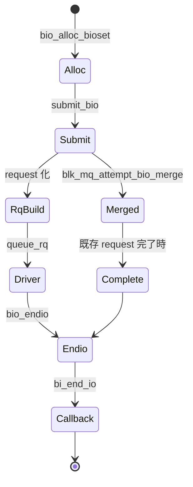

# 第2章 bio の構造とライフサイクル

> **本章で読むソース**
>
> - [`include/linux/blk_types.h` L210-L269](https://github.com/gregkh/linux/blob/v6.18.38/include/linux/blk_types.h#L210-L269)
> - [`include/linux/blk_types.h` L315-L330](https://github.com/gregkh/linux/blob/v6.18.38/include/linux/blk_types.h#L315-L330)
> - [`block/bio.c` L507-L596](https://github.com/gregkh/linux/blob/v6.18.38/block/bio.c#L507-L596)
> - [`block/bio.c` L358-L365](https://github.com/gregkh/linux/blob/v6.18.38/block/bio.c#L358-L365)
> - [`block/bio.c` L1629-L1673](https://github.com/gregkh/linux/blob/v6.18.38/block/bio.c#L1629-L1673)
> - [`block/blk-merge.c` L934-L960](https://github.com/gregkh/linux/blob/v6.18.38/block/blk-merge.c#L934-L960)

## この章の狙い

**bio** のフィールドが I/O の意味をどう符号化するか、割り当てから `bio_endio` までのライフサイクルをソースで追う。
マージ可能な bio が request に吸収される条件の一端も押さえる。

## 前提

- [第1章](01-block-layer-overview.md) で `submit_bio` 経路を読んでいること。

## bio が表すもの

bio は「どのデバイスの、どのセクタから何バイトを、どの操作で、どのバッファへ」という一次情報を運ぶ。
`bi_opf` の下位8ビットが `REQ_OP_*`、上位が `REQ_*` フラグである。
`bi_iter` は走査中のセクタと残りサイズを保持し、部分完了や分割後も一貫して更新される。

[`include/linux/blk_types.h` L315-L330](https://github.com/gregkh/linux/blob/v6.18.38/include/linux/blk_types.h#L315-L330)

```c
/**
 * enum req_op - Operations common to the bio and request structures.
 * We use 8 bits for encoding the operation, and the remaining 24 for flags.
 *
 * The least significant bit of the operation number indicates the data
 * transfer direction:
 *
 *   - if the least significant bit is set transfers are TO the device
 *   - if the least significant bit is not set transfers are FROM the device
 *
 * If a operation does not transfer data the least significant bit has no
 * meaning.
 */
enum req_op {
	/* read sectors from the device */
	REQ_OP_READ		= (__force blk_opf_t)0,
```

読み取りと書き込みで最下位ビットが向きを表す設計は、マクロ `op_is_write` などの高速判定に使われる。

## 主要フィールドとプール

`bi_io_vec` が scatter-gather リスト、`bi_pool` が所属する `bio_set` を指す。
`bio_inline_vecs` により小さなベクトル数は bio 本体直後にインライン配置され、追加割り当てを避ける。

[`include/linux/blk_types.h` L210-L269](https://github.com/gregkh/linux/blob/v6.18.38/include/linux/blk_types.h#L210-L269)

```c
struct bio {
	struct bio		*bi_next;	/* request queue link */
	struct block_device	*bi_bdev;
	blk_opf_t		bi_opf;		/* bottom bits REQ_OP, top bits
						 * req_flags.
						 */
	unsigned short		bi_flags;	/* BIO_* below */
	unsigned short		bi_ioprio;
	enum rw_hint		bi_write_hint;
	u8			bi_write_stream;
	blk_status_t		bi_status;
	atomic_t		__bi_remaining;
	// ... (中略) ...
	unsigned short		bi_max_vecs;	/* max bvl_vecs we can hold */

	atomic_t		__bi_cnt;	/* pin count */

	struct bio_vec		*bi_io_vec;	/* the actual vec list */

	struct bio_set		*bi_pool;
};
```

`__bi_remaining` は `BIO_CHAIN` でつながった複数 bio の完了カウントに使われる。
チェーンの最後の bio だけが `bi_end_io` を呼ぶ。

## bio_alloc_bioset による割り当て

ファイルシステム I/O 経路では `bio_alloc_bioset` が標準的な割り当て口である。
mempool と per-CPU キャッシュを組み合わせ、`submit_bio_noacct` 再帰下でのデッドロックを rescuer workqueue で回避する。

[`block/bio.c` L507-L596](https://github.com/gregkh/linux/blob/v6.18.38/block/bio.c#L507-L596)

```c
struct bio *bio_alloc_bioset(struct block_device *bdev, unsigned short nr_vecs,
			     blk_opf_t opf, gfp_t gfp_mask,
			     struct bio_set *bs)
{
	gfp_t saved_gfp = gfp_mask;
	struct bio *bio;
	void *p;

	/* should not use nobvec bioset for nr_vecs > 0 */
	if (WARN_ON_ONCE(!mempool_initialized(&bs->bvec_pool) && nr_vecs > 0))
		return NULL;

	// ... (中略) ...
	bio->bi_pool = bs;
	return bio;

err_free:
	mempool_free(p, &bs->bio_pool);
	return NULL;
}
EXPORT_SYMBOL(bio_alloc_bioset);
```

`REQ_ALLOC_CACHE` が付いていれば per-CPU キャッシュを優先する。
キャッシュミス時はフラグを外して通常割り当てへ落ちる。

## bio_chain による分割完了

大きな I/O を複数 bio に分けたとき、上位は `bio_chain` で下位 bio をつなぐ。
`bio_chain_and_submit` はチェーンを張ってから下位を投入するヘルパである。

[`block/bio.c` L358-L365](https://github.com/gregkh/linux/blob/v6.18.38/block/bio.c#L358-L365)

```c
struct bio *bio_chain_and_submit(struct bio *prev, struct bio *new)
{
	if (prev) {
		bio_chain(prev, new);
		submit_bio(prev);
	}
	return new;
}
```

チェーン中は `bio_endio` が `__bi_remaining` をデクリメントし、ゼロになるまで `bi_end_io` を遅延する。
これにより分割 I/O でも上位には一度だけ完了通知が届く。

## bio_endio と完了通知

`bio_endio` は整合性、ゾーン、QoS、トレースを処理したうえで `bi_end_io` を呼ぶ。
`bio_chain_endio` の場合は尾再帰的に次の bio へ進む。

[`block/bio.c` L1629-L1673](https://github.com/gregkh/linux/blob/v6.18.38/block/bio.c#L1629-L1673)

```c
void bio_endio(struct bio *bio)
{
again:
	if (!bio_remaining_done(bio))
		return;
	if (!bio_integrity_endio(bio))
		return;

	blk_zone_bio_endio(bio);

	rq_qos_done_bio(bio);

	// ... (中略) ...
		blkg_put(bio->bi_blkg);
		bio->bi_blkg = NULL;
	}
#endif

	if (bio->bi_end_io)
		bio->bi_end_io(bio);
}
```

`bi_status` はここに至る前に設定されている。
エラー経路では `submit_bio_noacct` 内の `end_io` ラベルから直接 `bio_endio` が呼ばれる。

## フロントマージの条件

bio が既存 request に吸収できるかは `bio_attempt_front_merge` で判定する。
セクタ連続性、セグメント上限、暗号化コンテキスト一致などが条件になる。

[`block/blk-merge.c` L934-L960](https://github.com/gregkh/linux/blob/v6.18.38/block/blk-merge.c#L934-L960)

```c
static enum bio_merge_status bio_attempt_front_merge(struct request *req,
		struct bio *bio, unsigned int nr_segs)
{
	const blk_opf_t ff = bio_failfast(bio);

	/*
	 * A front merge for writes to sequential zones of a zoned block device
	 * can happen only if the user submitted writes out of order. Do not
	 * merge such write to let it fail.
	 */
	if (req->rq_flags & RQF_ZONE_WRITE_PLUGGING)
		return BIO_MERGE_FAILED;

	if (!ll_front_merge_fn(req, bio, nr_segs))
		return BIO_MERGE_FAILED;

	trace_block_bio_frontmerge(bio);
	rq_qos_merge(req->q, req, bio);

	if ((req->cmd_flags & REQ_FAILFAST_MASK) != ff)
		blk_rq_set_mixed_merge(req);

	blk_update_mixed_merge(req, bio, true);

	bio->bi_next = req->bio;
	req->bio = bio;

```

マージ成功時は新規 request を割らず、bio のセグメントだけが既存 request に追加される。

## 処理の流れ



bio はドライバ完了後に必ず `bio_endio` を通る。
request ベースのドライバでも、最終的な上位通知は bio 単位で行われる。

## 高速化と最適化の工夫

**インラインベクトル**（`BIO_INLINE_VECS`）は小さな I/O で bvec プールへの往復を省く。
ページキャッシュの多くの読み書きは少数セグメントに収まるため、頻出経路に効く。

**per-CPU bio キャッシュ**（`REQ_ALLOC_CACHE`）は同一 CPU からの連続割り当てを高速化する。
キャッシュは飽和時に自動で無効化され、mempool へフォールバックする。

**bio_set の rescuer** は `submit_bio_noacct` 再帰中の mempool 枯渇デッドロックを防ぐ。
`__GFP_DIRECT_RECLAIM` を外して割り当てを試し、失敗時は積んだ bio を workqueue へ退避する。


> **v7.1.3 注記**：本章が引用する範囲では v6.18.38 と v7.1.3 で読解に影響する分岐変更は確認されていない。
> 監査一覧は [README](../README.md#v713-との差分監査) を参照。

## まとめ

bio はブロック I/O の意味とバッファ位置を担う中核オブジェクトである。
割り当ては bio_set と mempool で管理され、完了は `bio_endio` が一元化する。
マージにより request 数とタグ消費を減らせるため、ライフサイクルとマージ条件はセットで理解する。

## 関連する章

- [第3章 gendisk、request_queue、request](03-gendisk-request-queue.md)
- [第10章 plug と merge](../part02-iosched/10-plug-merge.md)
