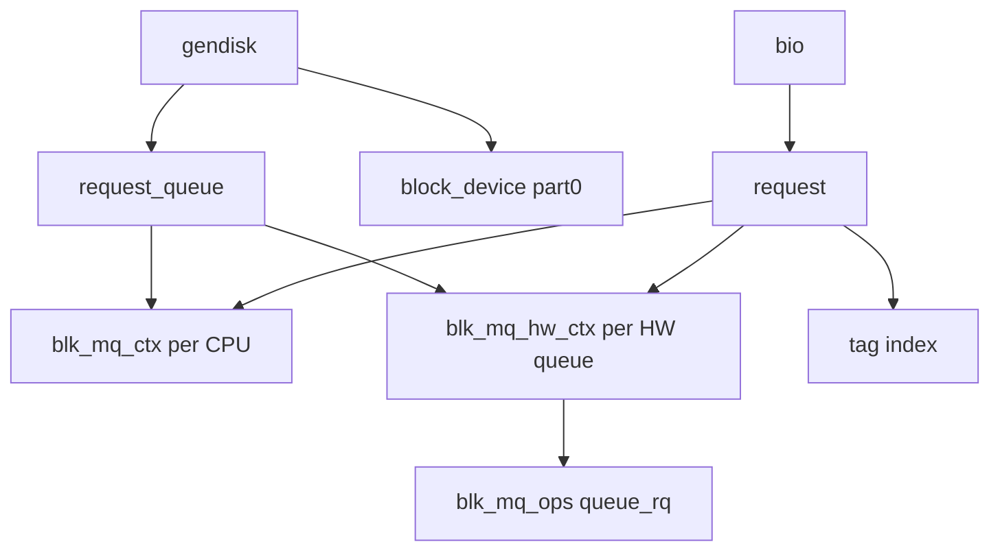

# 第3章 gendisk、request_queue、request

> **本章で読むソース**
>
> - [`include/linux/blkdev.h` L143-L179](https://github.com/gregkh/linux/blob/v6.18.38/include/linux/blkdev.h#L143-L179)
> - [`include/linux/blk-mq.h` L103-L163](https://github.com/gregkh/linux/blob/v6.18.38/include/linux/blk-mq.h#L103-L163)
> - [`block/blk-mq.c` L4418-L4455](https://github.com/gregkh/linux/blob/v6.18.38/block/blk-mq.c#L4418-L4455)
> - [`block/blk-mq.c` L643-L678](https://github.com/gregkh/linux/blob/v6.18.38/block/blk-mq.c#L643-L678)
> - [`block/genhd.c` L1446-L1480](https://github.com/gregkh/linux/blob/v6.18.38/block/genhd.c#L1446-L1480)
> - [`block/blk-mq.h` L19-L32](https://github.com/gregkh/linux/blob/v6.18.38/block/blk-mq.h#L19-L32)

## この章の狙い

ディスクをユーザー空間に見せる **gendisk**、I/O ポリシーを保持する **request_queue**、ドライバへ渡す **request** の関係を整理する。
`blk-mq` がキューをどう初期化し、request をどう割り当てるかを読む。

## 前提

- [第2章](02-bio-structure-lifecycle.md) で bio のフィールドを読んでいること。

## gendisk が表すディスクインスタンス

`gendisk` はカーネル内の1つのディスク（またはその代表）に対応する。
`disk_name` が `/dev` 下の名前、`queue` が I/O キュー、`part0` が全体デバイスを指す block_device である。

[`include/linux/blkdev.h` L143-L179](https://github.com/gregkh/linux/blob/v6.18.38/include/linux/blkdev.h#L143-L179)

```c
struct gendisk {
	/*
	 * major/first_minor/minors should not be set by any new driver, the
	 * block core will take care of allocating them automatically.
	 */
	int major;
	int first_minor;
	int minors;

	char disk_name[DISK_NAME_LEN];	/* name of major driver */

	unsigned short events;		/* supported events */
	// ... (中略) ...
#define GD_ADDED			4
#define GD_SUPPRESS_PART_SCAN		5
#define GD_OWNS_QUEUE			6

	struct mutex open_mutex;	/* open/close mutex */
	unsigned open_partitions;	/* number of open partitions */

	struct backing_dev_info	*bdi;
```

`bio_split` はデバイス制限を超える bio を分割するときの専用 bio_set である。
`bdi` はライトバックと VFS 分冊の writeback 経路へ接続する。

## request のフィールド配置

`request` は bio リスト、タグ、ハードウェア/ソフトウェアキュー文脈、統計用タイムスタンプをまとめる。
コメントが示す通り、キャッシュラインを意識してフィールドが並べられている。

[`include/linux/blk-mq.h` L103-L163](https://github.com/gregkh/linux/blob/v6.18.38/include/linux/blk-mq.h#L103-L163)

```c
struct request {
	struct request_queue *q;
	struct blk_mq_ctx *mq_ctx;
	struct blk_mq_hw_ctx *mq_hctx;

	blk_opf_t cmd_flags;		/* op and common flags */
	req_flags_t rq_flags;

	int tag;
	int internal_tag;

	unsigned int timeout;
	// ... (中略) ...
	struct bio_crypt_ctx *crypt_ctx;
	struct blk_crypto_keyslot *crypt_keyslot;
#endif

	enum mq_rq_state state;
	atomic_t ref;

	unsigned long deadline;
```

`tag` はドライバが完了を識別する番号であり、第5章で読む sbitmap ベースの割り当てと対応する。
`mq_rq_state` は IDLE、IN_FLIGHT、COMPLETE の3状態を取る。

## ソフトウェアキュー ctx

各 CPU（または CPU グループ）に `blk_mq_ctx` が割り当てられる。
送信側 CPU はまず自分の ctx のリストへ request を載せ、hctx へディスパッチされる。

[`block/blk-mq.h` L19-L32](https://github.com/gregkh/linux/blob/v6.18.38/block/blk-mq.h#L19-L32)

```c
struct blk_mq_ctx {
	struct {
		spinlock_t		lock;
		struct list_head	rq_lists[HCTX_MAX_TYPES];
	} ____cacheline_aligned_in_smp;

	unsigned int		cpu;
	unsigned short		index_hw[HCTX_MAX_TYPES];
	struct blk_mq_hw_ctx 	*hctxs[HCTX_MAX_TYPES];

	struct request_queue	*queue;
	struct blk_mq_ctxs      *ctxs;
	struct kobject		kobj;
} ____cacheline_aligned_in_smp;
```

`HCTX_MAX_TYPES` により通常 I/O と poll 用など種別ごとにリストが分かれる。
ctx と hctx の対応は tag_set のマッピング関数で決まる。

## request_queue の blk-mq 割り当て

`blk_mq_alloc_queue` は tag_set とマップ関数から request_queue を構築する。
ハードウェアキュー数、ドライバの `blk_mq_ops`、キュー深度がここで固定される。

[`block/blk-mq.c` L4418-L4455](https://github.com/gregkh/linux/blob/v6.18.38/block/blk-mq.c#L4418-L4455)

```c
struct request_queue *blk_mq_alloc_queue(struct blk_mq_tag_set *set,
		struct queue_limits *lim, void *queuedata)
{
	struct queue_limits default_lim = { };
	struct request_queue *q;
	int ret;

	if (!lim)
		lim = &default_lim;
	lim->features |= BLK_FEAT_IO_STAT | BLK_FEAT_NOWAIT;
	if (set->nr_maps > HCTX_TYPE_POLL)
		lim->features |= BLK_FEAT_POLL;
	// ... (中略) ...
 * This shuts down a request queue allocated by blk_mq_alloc_queue(). All future
 * requests will be failed with -ENODEV. The caller is responsible for dropping
 * the reference from blk_mq_alloc_queue() by calling blk_put_queue().
 *
 * Context: can sleep
 */
void blk_mq_destroy_queue(struct request_queue *q)
{
```

ドライバは tag_set を静的に定義し、`queue_rq` などのコールバックを登録する。
NVMe は第15章で具体例を読む。

## request の割り当て API

`blk_mq_alloc_request` はキューと操作フラグから request を取り出す公開 API である。
内部ではタグ取得、ctx/hctx の選択、初期化が行われる。

[`block/blk-mq.c` L643-L678](https://github.com/gregkh/linux/blob/v6.18.38/block/blk-mq.c#L643-L678)

```c
struct request *blk_mq_alloc_request(struct request_queue *q, blk_opf_t opf,
		blk_mq_req_flags_t flags)
{
	struct request *rq;

	rq = blk_mq_alloc_cached_request(q, opf, flags);
	if (!rq) {
		struct blk_mq_alloc_data data = {
			.q		= q,
			.flags		= flags,
			.shallow_depth	= 0,
			.cmd_flags	= opf,
	// ... (中略) ...
	rq->__data_len = 0;
	rq->__sector = (sector_t) -1;
	rq->bio = rq->biotail = NULL;
	return rq;
out_queue_exit:
	blk_queue_exit(q);
	return ERR_PTR(-EWOULDBLOCK);
}
```

`blk_mq_get_request` はタグが尽きればスリープまたは `BLK_MQ_NO_TAG` を返す。
`REQ_NOWAIT` 指定時は待たずに失敗する。

## gendisk 割り当て

`__alloc_disk_node` はキューと紐づく gendisk を NUMA ノード指定で確保する。
パーティションスキャンや `bdi` 登録は `add_disk` 経路で行われる。

[`block/genhd.c` L1446-L1480](https://github.com/gregkh/linux/blob/v6.18.38/block/genhd.c#L1446-L1480)

```c
struct gendisk *__alloc_disk_node(struct request_queue *q, int node_id,
		struct lock_class_key *lkclass)
{
	struct gendisk *disk;

	disk = kzalloc_node(sizeof(struct gendisk), GFP_KERNEL, node_id);
	if (!disk)
		return NULL;

	if (bioset_init(&disk->bio_split, BIO_POOL_SIZE, 0, 0))
		goto out_free_disk;

	disk->bdi = bdi_alloc(node_id);
	if (!disk->bdi)
		goto out_free_bioset;

	/* bdev_alloc() might need the queue, set before the first call */
	disk->queue = q;

	disk->part0 = bdev_alloc(disk, 0);
	if (!disk->part0)
		goto out_free_bdi;

	disk->node_id = node_id;
	mutex_init(&disk->open_mutex);
	xa_init(&disk->part_tbl);
	if (xa_insert(&disk->part_tbl, 0, disk->part0, GFP_KERNEL))
		goto out_destroy_part_tbl;

	if (blkcg_init_disk(disk))
		goto out_erase_part0;

	disk_init_zone_resources(disk);
	rand_initialize_disk(disk);
	disk_to_dev(disk)->class = &block_class;
```

ドライバは `disk->fops` に `submit_bio` 相当や ioctl を実装する。
blk-mq デバイスでは `BD_HAS_SUBMIT_BIO` を立てず、第1章の標準経路を使う。

## オブジェクト関係



bio は1つ以上を request が保持し、ドライバは request 単位でコマンドを組み立てる。
完了時はタグを解放し、bio へ `bio_endio` が伝播する。

## 高速化と最適化の工夫

**ctx の per-CPU 配置**は送信側ロック競合を減らす。
I/O 投入はまずローカル ctx のリストへ載り、他 CPU との衝突を避けやすい。

**request フィールドのキャッシュライン整列**は、ディスパッチと完了で触るフィールドを分離する意図がある。
`mq_hctx` と `tag` は発行側ホットパス、`state` と `ref` は完了側で更新される。

**tag_set によるキュー共有**は、複数 gendisk が同一タグプールを使うマルチキューデバイス向けである。
NVMe 名前空間ごとにキューを分けつつ、タグ管理を統一できる。

> **v7.1.3 注記**：本章が引用する範囲では v6.18.38 と v7.1.3 で読解に影響する分岐変更は確認されていない。
> 監査一覧は [README](../README.md#v713-との差分監査) を参照。

## まとめ

gendisk はデバイス公開の窓口、request_queue はポリシーと blk-mq 状態の器、request はドライバ配送単位である。
bio から request への変換は `blk_mq_submit_bio` が担い、ctx と hctx を経て `queue_rq` へ至る。
次章から blk-mq のキュー構造とタグ割り当てを詳しく読む。

## 関連する章

- [第4章 ソフトウェアキューとハードウェアキュー](../part01-blk-mq/04-blk-mq-queues-hctx-ctx.md)
- [第15章 NVMe と blk-mq キュー対応](../part04-driver-stack/15-nvme-queues.md)
