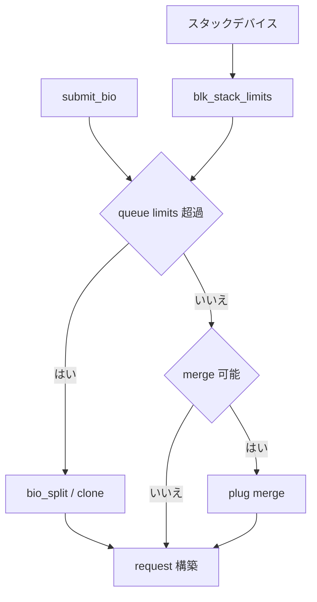

# 第3章 queue limits と bio の split/clone

> **本章で読むソース**
>
> - [`block/blk-settings.c` L37-L60](https://github.com/gregkh/linux/blob/v6.18.38/block/blk-settings.c#L37-L60)
> - [`block/blk-settings.c` L509-L519](https://github.com/gregkh/linux/blob/v6.18.38/block/blk-settings.c#L509-L519)
> - [`block/blk-settings.c` L765-L808](https://github.com/gregkh/linux/blob/v6.18.38/block/blk-settings.c#L765-L808)
> - [`block/bio.c` L865-L881](https://github.com/gregkh/linux/blob/v6.18.38/block/bio.c#L865-L881)
> - [`block/bio.c` L1690-L1723](https://github.com/gregkh/linux/blob/v6.18.38/block/bio.c#L1690-L1723)
> - [`block/blk-merge.c` L859-L883](https://github.com/gregkh/linux/blob/v6.18.38/block/blk-merge.c#L859-L883)

## この章の狙い

**queue_limits** がデバイスごとのセクタ上限、セグメント数、整合性制約をどう表すかを読む。
bio が制限を超えるときの **split** と **clone** がどこで起き、第12章の plug/merge と何が違うかを整理する。

## 前提

- [第2章](02-bio-structure-lifecycle.md) で bio のフィールドと `bio_endio` を読んでいること。

## queue_limits の初期化

ドライバは `queue_limits` を埋め、`blk_validate_limits` で整合性を検査する。
スタッキングデバイス（device mapper など）は `blk_set_stacking_limits` で寛い初期値を取り、下位デバイスから `blk_stack_limits` で絞り込む。

[`block/blk-settings.c` L37-L60](https://github.com/gregkh/linux/blob/v6.18.38/block/blk-settings.c#L37-L60)

```c
void blk_set_stacking_limits(struct queue_limits *lim)
{
	memset(lim, 0, sizeof(*lim));
	lim->logical_block_size = SECTOR_SIZE;
	lim->physical_block_size = SECTOR_SIZE;
	lim->io_min = SECTOR_SIZE;
	lim->discard_granularity = SECTOR_SIZE;
	lim->dma_alignment = SECTOR_SIZE - 1;
	lim->seg_boundary_mask = BLK_SEG_BOUNDARY_MASK;

	/* Inherit limits from component devices */
	lim->max_segments = USHRT_MAX;
	lim->max_discard_segments = USHRT_MAX;
	lim->max_hw_sectors = UINT_MAX;
	lim->max_segment_size = UINT_MAX;
	lim->max_sectors = UINT_MAX;
	lim->max_dev_sectors = UINT_MAX;
	lim->max_write_zeroes_sectors = UINT_MAX;
	lim->max_hw_wzeroes_unmap_sectors = UINT_MAX;
	lim->max_user_wzeroes_unmap_sectors = UINT_MAX;
	lim->max_hw_zone_append_sectors = UINT_MAX;
	lim->max_user_discard_sectors = UINT_MAX;
	lim->atomic_write_hw_max = UINT_MAX;
}
```

新規キューは `blk_set_default_limits` でユーザー向け上限を最大値に初期化し、`blk_validate_limits` に渡す。

[`block/blk-settings.c` L509-L519](https://github.com/gregkh/linux/blob/v6.18.38/block/blk-settings.c#L509-L519)

```c
int blk_set_default_limits(struct queue_limits *lim)
{
	/*
	 * Most defaults are set by capping the bounds in blk_validate_limits,
	 * but these limits are special and need an explicit initialization to
	 * the max value here.
	 */
	lim->max_user_discard_sectors = UINT_MAX;
	lim->max_user_wzeroes_unmap_sectors = UINT_MAX;
	return blk_validate_limits(lim);
}
```

## スタック時の制限合成

`blk_stack_limits` は上位キュー `t` と下位キュー `b` の各フィールドを `min` で合成する。
`BLK_FEAT_NOWAIT` や `BLK_FEAT_POLL` は下位が未対応なら上位からも落とす。

[`block/blk-settings.c` L765-L808](https://github.com/gregkh/linux/blob/v6.18.38/block/blk-settings.c#L765-L808)

```c
int blk_stack_limits(struct queue_limits *t, struct queue_limits *b,
		     sector_t start)
{
	unsigned int top, bottom, alignment;
	int ret = 0;

	t->features |= (b->features & BLK_FEAT_INHERIT_MASK);

	/*
	 * Some feaures need to be supported both by the stacking driver and all
	 * underlying devices.  The stacking driver sets these flags before
	 * stacking the limits, and this will clear the flags if any of the
	 * underlying devices does not support it.
	 */
	if (!(b->features & BLK_FEAT_NOWAIT))
		t->features &= ~BLK_FEAT_NOWAIT;
	if (!(b->features & BLK_FEAT_POLL))
		t->features &= ~BLK_FEAT_POLL;

	t->flags |= (b->flags & BLK_FLAG_MISALIGNED);

	t->max_sectors = min_not_zero(t->max_sectors, b->max_sectors);
	t->max_user_sectors = min_not_zero(t->max_user_sectors,
			b->max_user_sectors);
	t->max_hw_sectors = min_not_zero(t->max_hw_sectors, b->max_hw_sectors);
	t->max_dev_sectors = min_not_zero(t->max_dev_sectors, b->max_dev_sectors);
	// ... (中略) ...
	t->max_segments = min_not_zero(t->max_segments, b->max_segments);
```

dm や MD が複数下位デバイスを束ねるとき、最も厳しい制限が最終的な `request_queue->limits` になる。

## bio_alloc_clone とベクタ共有

`bio_alloc_clone` は元 bio の `bi_io_vec` を共有する軽量コピーを作る。
データ本体は共有し、イテレータだけを切り出す用途（分割の下準備など）に使う。

[`block/bio.c` L865-L881](https://github.com/gregkh/linux/blob/v6.18.38/block/bio.c#L865-L881)

```c
struct bio *bio_alloc_clone(struct block_device *bdev, struct bio *bio_src,
		gfp_t gfp, struct bio_set *bs)
{
	struct bio *bio;

	bio = bio_alloc_bioset(bdev, 0, bio_src->bi_opf, gfp, bs);
	if (!bio)
		return NULL;

	if (__bio_clone(bio, bio_src, gfp) < 0) {
		bio_put(bio);
		return NULL;
	}
	bio->bi_io_vec = bio_src->bi_io_vec;

	return bio;
}
```

呼び出し側は `bio_src` より先に clone を解放してはならない。

## bio_split によるセクタ分割

`bio_split` は先頭から `sectors` 分だけを切り出した新 bio を返し、元 bio を `bio_advance` で進める。
zone append や atomic write は分割不可として `ERR_PTR` を返す。

[`block/bio.c` L1690-L1723](https://github.com/gregkh/linux/blob/v6.18.38/block/bio.c#L1690-L1723)

```c
struct bio *bio_split(struct bio *bio, int sectors,
		      gfp_t gfp, struct bio_set *bs)
{
	struct bio *split;

	if (WARN_ON_ONCE(sectors <= 0))
		return ERR_PTR(-EINVAL);
	if (WARN_ON_ONCE(sectors >= bio_sectors(bio)))
		return ERR_PTR(-EINVAL);

	/* Zone append commands cannot be split */
	if (WARN_ON_ONCE(bio_op(bio) == REQ_OP_ZONE_APPEND))
		return ERR_PTR(-EINVAL);

	/* atomic writes cannot be split */
	if (bio->bi_opf & REQ_ATOMIC)
		return ERR_PTR(-EINVAL);

	split = bio_alloc_clone(bio->bi_bdev, bio, gfp, bs);
	if (!split)
		return ERR_PTR(-ENOMEM);

	split->bi_iter.bi_size = sectors << 9;

	if (bio_integrity(split))
		bio_integrity_trim(split);

	bio_advance(bio, split->bi_iter.bi_size);

	if (bio_flagged(bio, BIO_TRACE_COMPLETION))
		bio_set_flag(split, BIO_TRACE_COMPLETION);

	return split;
}
```

`gendisk` の `bio_split` bio_set は第4章で読む専用プールであり、大きな bio をデバイス上限に合わせて刻む。

## merge 可否の事前検査

`blk_rq_merge_ok` は request と bio の opcode、cgroup、整合性、暗号化コンテキストが一致するかを見る。
第12章の plug/merge はこの検査を通過した bio を request に連結する。

[`block/blk-merge.c` L859-L883](https://github.com/gregkh/linux/blob/v6.18.38/block/blk-merge.c#L859-L883)

```c
bool blk_rq_merge_ok(struct request *rq, struct bio *bio)
{
	if (!rq_mergeable(rq) || !bio_mergeable(bio))
		return false;

	if (req_op(rq) != bio_op(bio))
		return false;

	if (!blk_cgroup_mergeable(rq, bio))
		return false;
	if (blk_integrity_merge_bio(rq->q, rq, bio) == false)
		return false;
	if (!bio_crypt_rq_ctx_compatible(rq, bio))
		return false;
	if (rq->bio->bi_write_hint != bio->bi_write_hint)
		return false;
	if (rq->bio->bi_write_stream != bio->bi_write_stream)
		return false;
	if (rq->bio->bi_ioprio != bio->bi_ioprio)
		return false;
	if (blk_atomic_write_mergeable_rq_bio(rq, bio) == false)
		return false;

	return true;
}
```

split は「1 bio を複数に割る」、merge は「複数 bio を1 request にまとめる」と役割が逆である。

## 処理の流れ



## 高速化と最適化の工夫

**bio_alloc_clone によるベクタ共有**は、分割や dm の部分 remap でデータコピーを避ける。
新 bio はメタデータだけ確保し、`bi_io_vec` は元 bio と共有する。

**`blk_stack_limits` の min 合成**はスタック経路で毎回フル検査せず、キュー構築時に一度だけ厳しい上限を確定する。
実行時の split 判定は確定済み `limits` を参照するだけである。

**merge 前の `blk_rq_merge_ok`** は連結不可能な bio を早期に弾き、request 内部のリスト走査と整合性エラーを省く。

> **v7.1.3 注記**：本章が引用する範囲では v6.18.38 と v7.1.3 で読解に影響する分岐変更は確認されていない。
> 監査一覧は [README](../README.md#v713-との差分監査) を参照。

## まとめ

queue_limits はデバイスとスタックの両方で合成され、bio の最大セクタ数とセグメント数を決める。
bio_split と bio_alloc_clone は制限超過や remap をセクタ単位で刻む。
merge は制限内で隣接 bio をまとめる別経路であり、本章の split/clone と補完関係にある。

## 関連する章

- [第2章 bio の構造とライフサイクル](02-bio-structure-lifecycle.md)
- [第4章 gendisk と request の所有関係](04-gendisk-request-queue.md)
- [第12章 plug と merge](../part02-iosched/12-plug-merge.md)
