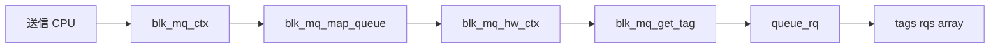

# 第4章 ソフトウェアキューとハードウェアキュー、hctx と ctx

> **本章で読むソース**
>
> - [`block/blk-mq.h` L19-L32](https://github.com/gregkh/linux/blob/v6.18.38/block/blk-mq.h#L19-L32)
> - [`include/linux/blk-mq.h` L304-L365](https://github.com/gregkh/linux/blob/v6.18.38/include/linux/blk-mq.h#L304-L365)
> - [`block/blk-mq-tag.c` L109-L120](https://github.com/gregkh/linux/blob/v6.18.38/block/blk-mq-tag.c#L109-L120)
> - [`block/blk-mq-tag.c` L137-L160](https://github.com/gregkh/linux/blob/v6.18.38/block/blk-mq-tag.c#L137-L160)
> - [`block/blk-mq.c` L1834-L1865](https://github.com/gregkh/linux/blob/v6.18.38/block/blk-mq.c#L1834-L1865)
> - [`block/blk-mq.c` L1351-L1376](https://github.com/gregkh/linux/blob/v6.18.38/block/blk-mq.c#L1351-L1376)

## この章の狙い

**blk-mq** が CPU 側のソフトウェアキュー（**ctx**）とデバイス側のハードウェアキュー（**hctx**）をどう分離するか、タグ管理の入口を読む。
マルチキュー NVMe が blk-mq 設計の前提である理由を、データ構造から説明する。

## 前提

- [第3章](../part00-overview/03-gendisk-request-queue.md) で request と request_queue を読んでいること。

## 二層キューモデル

blk-mq は「送信 CPU ごとのソフトウェアキュー」と「ハードウェアキューごとのディスパッチ」を分ける。
旧来の単一キュー＋大域ロックモデルでは、マルチコアと NVMe 複数キューにスケールしにくかった。
ctx で投入を分散し、hctx でドライバ `queue_rq` を並列化する。

## blk_mq_ctx の役割

各 ctx は1つの送信 CPU に紐づく。
`rq_lists` は種別ごとの request リストで、スピンロックで保護される。

[`block/blk-mq.h` L19-L32](https://github.com/gregkh/linux/blob/v6.18.38/block/blk-mq.h#L19-L32)

```c
struct blk_mq_ctx {
	struct {
		spinlock_t		lock;
		struct list_head	rq_lists[HCTX_MAX_TYPES];
	} ____cacheline_aligned_in_smp;

	unsigned int		cpu;
	unsigned short		index_hw[HCTX_MAX_TYPES];
	struct blk_mq_hw_ctx 	*hctxs[HCTX_MAX_TYPES];

	struct request_queue	*queue;
	struct blk_mq_ctxs      *ctxs;
	struct kobject		kobj;
} ____cacheline_aligned_in_smp;
```

`index_hw` は当該 ctx から各 hctx へのインデックスである。
マップ関数 `blk_mq_map_queue` が操作種別と CPU から hctx を選ぶ。

## blk_mq_hw_ctx の役割

hctx はドライバが見るハードウェアキューに対応する。
`dispatch` リストはリソース不足で送れなかった request の待ち行列である。

[`include/linux/blk-mq.h` L304-L365](https://github.com/gregkh/linux/blob/v6.18.38/include/linux/blk-mq.h#L304-L365)

```c
struct blk_mq_hw_ctx {
	struct {
		/** @lock: Protects the dispatch list. */
		spinlock_t		lock;
		/**
		 * @dispatch: Used for requests that are ready to be
		 * dispatched to the hardware but for some reason (e.g. lack of
		 * resources) could not be sent to the hardware. As soon as the
		 * driver can send new requests, requests at this list will
		 * be sent first for a fairer dispatch.
		 */
		struct list_head	dispatch;
	// ... (中略) ...
	 */
	void			*driver_data;

	/**
	 * @ctx_map: Bitmap for each software queue. If bit is on, there is a
	 * pending request in that software queue.
	 */
	struct sbitmap		ctx_map;
```

`ctx_map` はどの ctx に未処理 request があるかをビットマップで示す。
`run_work` は hctx を後から起動するための遅延ワークである。

## タグ割り当てのロックレス fast path

タグは inflight request の上限を表す。
`__blk_mq_get_tag` は sbitmap からビットを取得するロックレス fast path が中心である。

[`block/blk-mq-tag.c` L109-L120](https://github.com/gregkh/linux/blob/v6.18.38/block/blk-mq-tag.c#L109-L120)

```c
static int __blk_mq_get_tag(struct blk_mq_alloc_data *data,
			    struct sbitmap_queue *bt)
{
	if (!data->q->elevator && !(data->flags & BLK_MQ_REQ_RESERVED) &&
			!hctx_may_queue(data->hctx, bt))
		return BLK_MQ_NO_TAG;

	if (data->shallow_depth)
		return sbitmap_queue_get_shallow(bt, data->shallow_depth);
	else
		return __sbitmap_queue_get(bt);
}
```

`hctx_may_queue` は共有タグプールでの公平性を調整する。
スケジューラ有効時は別ルールが適用される。

## タグ枯渇時の待機

タグが取れなければ `blk_mq_run_hw_queue` で完了を促してからスリープする。
`REQ_NOWAIT` の場合は待たず `BLK_MQ_NO_TAG` を返す。

[`block/blk-mq-tag.c` L137-L160](https://github.com/gregkh/linux/blob/v6.18.38/block/blk-mq-tag.c#L137-L160)

```c
unsigned int blk_mq_get_tag(struct blk_mq_alloc_data *data)
{
	struct blk_mq_tags *tags = blk_mq_tags_from_data(data);
	struct sbitmap_queue *bt;
	struct sbq_wait_state *ws;
	DEFINE_SBQ_WAIT(wait);
	unsigned int tag_offset;
	int tag;

	if (data->flags & BLK_MQ_REQ_RESERVED) {
		if (unlikely(!tags->nr_reserved_tags)) {
			WARN_ON_ONCE(1);
			return BLK_MQ_NO_TAG;
		}
		bt = &tags->breserved_tags;
		tag_offset = 0;
	} else {
		bt = &tags->bitmap_tags;
		tag_offset = tags->nr_reserved_tags;
	}

	tag = __blk_mq_get_tag(data, bt);
	if (tag != BLK_MQ_NO_TAG)
		goto found_tag;
```

待機前にハードウェアキューを走らせるのは、完了によるタグ返却を早めるためである。

## hctx からの dequeue

スケジューラが無い場合や bypass 時は ctx リストから request を取り出す。
`blk_mq_dequeue_from_ctx` は開始 ctx から巡回する。

[`block/blk-mq.c` L1834-L1865](https://github.com/gregkh/linux/blob/v6.18.38/block/blk-mq.c#L1834-L1865)

```c
struct request *blk_mq_dequeue_from_ctx(struct blk_mq_hw_ctx *hctx,
					struct blk_mq_ctx *start)
{
	unsigned off = start ? start->index_hw[hctx->type] : 0;
	struct dispatch_rq_data data = {
		.hctx = hctx,
		.rq   = NULL,
	};

	__sbitmap_for_each_set(&hctx->ctx_map, off,
			       dispatch_rq_from_ctx, &data);

	return data.rq;
}

bool __blk_mq_alloc_driver_tag(struct request *rq)
{
	struct sbitmap_queue *bt = &rq->mq_hctx->tags->bitmap_tags;
	unsigned int tag_offset = rq->mq_hctx->tags->nr_reserved_tags;
	int tag;

	blk_mq_tag_busy(rq->mq_hctx);

	if (blk_mq_tag_is_reserved(rq->mq_hctx->sched_tags, rq->internal_tag)) {
		bt = &rq->mq_hctx->tags->breserved_tags;
		tag_offset = 0;
	} else {
		if (!hctx_may_queue(rq->mq_hctx, bt))
			return false;
	}

	tag = __sbitmap_queue_get(bt);
```

公平性は ctx 巡回とスケジューラ側の挿入順序で担保される。

## request 発行とタグの紐づけ

`blk_mq_start_request` は発行時にタイマーを開始し、タグ配列へ request を登録する。
`REQ_POLLED` では bio に `bi_cookie` を書き、後の polling で hctx を特定する。

[`block/blk-mq.c` L1351-L1376](https://github.com/gregkh/linux/blob/v6.18.38/block/blk-mq.c#L1351-L1376)

```c
void blk_mq_start_request(struct request *rq)
{
	struct request_queue *q = rq->q;

	trace_block_rq_issue(rq);

	if (test_bit(QUEUE_FLAG_STATS, &q->queue_flags) &&
	    !blk_rq_is_passthrough(rq)) {
		rq->io_start_time_ns = blk_time_get_ns();
		rq->stats_sectors = blk_rq_sectors(rq);
		rq->rq_flags |= RQF_STATS;
		rq_qos_issue(q, rq);
	}

	WARN_ON_ONCE(blk_mq_rq_state(rq) != MQ_RQ_IDLE);

	blk_add_timer(rq);
	WRITE_ONCE(rq->state, MQ_RQ_IN_FLIGHT);
	rq->mq_hctx->tags->rqs[rq->tag] = rq;

	if (blk_integrity_rq(rq) && req_op(rq) == REQ_OP_WRITE)
		blk_integrity_prepare(rq);

	if (rq->bio && rq->bio->bi_opf & REQ_POLLED)
	        WRITE_ONCE(rq->bio->bi_cookie, rq->mq_hctx->queue_num);
}
```

タグから request への逆引きはドライバ完了処理で使われる。

## 処理の流れ



ctx は「誰が送ったか」、hctx は「どの HW キューへ載せるか」、tag は「inflight の席」を表す。

## 高速化と最適化の工夫

**sbitmap によるロックレス tag 取得**は blk-mq の中心最適化である。
ビットマップ操作はアトミックで行われ、タグ枯渇時だけ waitqueue へ落ちる。

**per-CPU ctx** は投入側のロック競合を局所化する。
送信 CPU が自分の ctx だけ触ればよい場面が多く、キャッシュ局所性も保ちやすい。

**ctx_map と run_work** は hctx 側が「どこに仕事があるか」を O(1) に近い形で把握する仕組みである。
不要なハードウェアキュー走査を減らし、割り込みコンテキストからの wake を抑える。


> **v7.1.3 注記**：本章が引用する範囲では v6.18.38 と v7.1.3 で読解に影響する分岐変更は確認されていない。
> 監査一覧は [README](../README.md#v713-との差分監査) を参照。

## まとめ

blk-mq は ctx と hctx の二層構造でマルチコアとマルチキューデバイスに対応する。
タグは sbitmap で管理され、request のライフサイクルと inflight 上限を結びつける。
次章では `blk_mq_submit_bio` からタグ付き request 生成までを追う。

## 関連する章

- [第5章 blk_mq_submit_bio とタグ割り当て](05-blk-mq-submit-tags.md)
- [第15章 NVMe と blk-mq キュー対応](../part04-driver-stack/15-nvme-queues.md)
