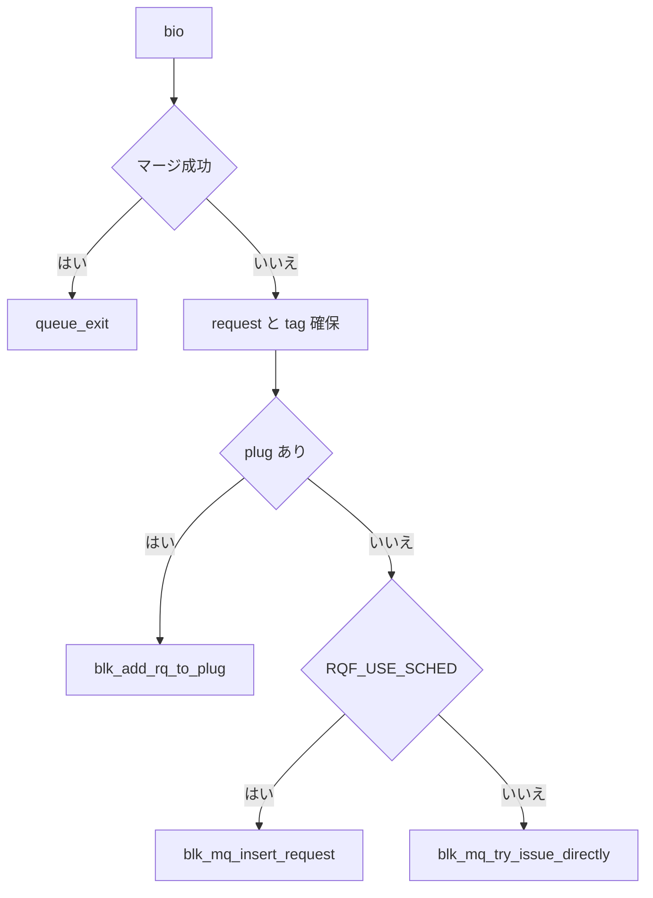

# 第6章 blk_mq_submit_bio とタグ割り当て

> **本章で読むソース**
>
> - [`block/blk-mq.c` L3121-L3234](https://github.com/gregkh/linux/blob/v6.18.38/block/blk-mq.c#L3121-L3234)
> - [`block/blk-mq.c` L3075-L3095](https://github.com/gregkh/linux/blob/v6.18.38/block/blk-mq.c#L3075-L3095)
> - [`block/blk-mq-tag.c` L122-L135](https://github.com/gregkh/linux/blob/v6.18.38/block/blk-mq-tag.c#L122-L135)
> - [`block/blk-mq-tag.c` L228-L245](https://github.com/gregkh/linux/blob/v6.18.38/block/blk-mq-tag.c#L228-L245)
> - [`block/blk-mq.c` L1391-L1403](https://github.com/gregkh/linux/blob/v6.18.38/block/blk-mq.c#L1391-L1403)
> - [`block/blk-mq.c` L3026-L3055](https://github.com/gregkh/linux/blob/v6.18.38/block/blk-mq.c#L3026-L3055)
> - [`block/blk-mq.c` L3060-L3077](https://github.com/gregkh/linux/blob/v6.18.38/block/blk-mq.c#L3060-L3077)
> - [`block/blk-mq.c` L3014-L3024](https://github.com/gregkh/linux/blob/v6.18.38/block/blk-mq.c#L3014-L3024)
> - [`block/blk-mq-sched.c` L335-L368](https://github.com/gregkh/linux/blob/v6.18.38/block/blk-mq-sched.c#L335-L368)

## この章の狙い

`blk_mq_submit_bio` が bio から request を組み立て、plug、スケジューラ挿入、直接発行のいずれかへ振り分ける分岐を読む。
タグのバッチ取得と返却がスループットに与える影響も押さえる。

## 前提

- [第5章](05-blk-mq-queues-hctx-ctx.md) で ctx、hctx、タグの概観を読んでいること。

## blk_mq_submit_bio の全体像

入口で cached request、キュー参照、整合性、マージ、ゾーンプラグを処理する。
新規 request 経路では `blk_mq_bio_to_request` のあと暗号化キースロット確保、flush 合成、plug または dispatch へ進む。

[`block/blk-mq.c` L3121-L3234](https://github.com/gregkh/linux/blob/v6.18.38/block/blk-mq.c#L3121-L3234)

```c
void blk_mq_submit_bio(struct bio *bio)
{
	struct request_queue *q = bdev_get_queue(bio->bi_bdev);
	struct blk_plug *plug = current->plug;
	const int is_sync = op_is_sync(bio->bi_opf);
	struct blk_mq_hw_ctx *hctx;
	unsigned int nr_segs;
	struct request *rq;
	blk_status_t ret;

	/*
	 * If the plug has a cached request for this queue, try to use it.
	// ... (中略) ...
	hctx = rq->mq_hctx;
	if ((rq->rq_flags & RQF_USE_SCHED) ||
	    (hctx->dispatch_busy && (q->nr_hw_queues == 1 || !is_sync))) {
		blk_mq_insert_request(rq, 0);
		blk_mq_run_hw_queue(hctx, true);
	} else {
		blk_mq_run_dispatch_ops(q, blk_mq_try_issue_directly(hctx, rq));
	}
```

同期 I/O は `dispatch_busy` でも直接発行しやすい。
非同期はスケジューラ経由になりやすい。

## cached request の事前確保と消費

plug 付き投入では `blk_mq_get_new_requests` が `plug->nr_ios` 件ぶんの request と tag をまとめて確保する。
先頭1件を返し、余剰は `plug->cached_rqs` に載せる。
後続 bio はまだ bio を持たない cached request を `blk_mq_peek_cached_request` で取り出し、`blk_mq_use_cached_rq` で再利用する。

[`block/blk-mq.c` L3026-L3055](https://github.com/gregkh/linux/blob/v6.18.38/block/blk-mq.c#L3026-L3055)

```c
static struct request *blk_mq_get_new_requests(struct request_queue *q,
					       struct blk_plug *plug,
					       struct bio *bio)
{
	struct blk_mq_alloc_data data = {
		.q		= q,
		.flags		= 0,
		.shallow_depth	= 0,
		.cmd_flags	= bio->bi_opf,
		.rq_flags	= 0,
		.nr_tags	= 1,
		.cached_rqs	= NULL,
		.ctx		= NULL,
		.hctx		= NULL
	};
	struct request *rq;

	rq_qos_throttle(q, bio);

	if (plug) {
		data.nr_tags = plug->nr_ios;
		plug->nr_ios = 1;
		data.cached_rqs = &plug->cached_rqs;
	}

	rq = __blk_mq_alloc_requests(&data);
	if (unlikely(!rq))
		rq_qos_cleanup(q, bio);
	return rq;
}
```

[`block/blk-mq.c` L3060-L3077](https://github.com/gregkh/linux/blob/v6.18.38/block/blk-mq.c#L3060-L3077)

```c
static struct request *blk_mq_peek_cached_request(struct blk_plug *plug,
		struct request_queue *q, blk_opf_t opf)
{
	enum hctx_type type = blk_mq_get_hctx_type(opf);
	struct request *rq;

	if (!plug)
		return NULL;
	rq = rq_list_peek(&plug->cached_rqs);
	if (!rq || rq->q != q)
		return NULL;
	if (type != rq->mq_hctx->type &&
	    (type != HCTX_TYPE_READ || rq->mq_hctx->type != HCTX_TYPE_DEFAULT))
		return NULL;
	if (op_is_flush(rq->cmd_flags) != op_is_flush(opf))
		return NULL;
	return rq;
}
```

`mq_list` 上の発行待ち request を再利用するのではなく、未使用の事前確保分を消費する。
`blk_mq_use_cached_rq` は QoS throttle を済ませ、タイムスタンプとフラグを設定する（L3079-L3095）。

> **v7.1.3 注記**：`blk_mq_get_new_requests` と `blk_mq_peek_cached_request` の本体は [v7.1.3 `block/blk-mq.c` L3046-L3095 付近](https://github.com/gregkh/linux/blob/v7.1.3/block/blk-mq.c#L3046-L3095)でも同一である。

## タグのバッチ取得

複数 request をまとめて確保する経路では `blk_mq_get_tags` が sbitmap のバッチ API を使う。
浅い深度制限や共有タグキューではバッチを使わない。

[`block/blk-mq-tag.c` L122-L135](https://github.com/gregkh/linux/blob/v6.18.38/block/blk-mq-tag.c#L122-L135)

```c
unsigned long blk_mq_get_tags(struct blk_mq_alloc_data *data, int nr_tags,
			      unsigned int *offset)
{
	struct blk_mq_tags *tags = blk_mq_tags_from_data(data);
	struct sbitmap_queue *bt = &tags->bitmap_tags;
	unsigned long ret;

	if (data->shallow_depth ||data->flags & BLK_MQ_REQ_RESERVED ||
	    data->hctx->flags & BLK_MQ_F_TAG_QUEUE_SHARED)
		return 0;
	ret = __sbitmap_queue_get_batch(bt, nr_tags, offset);
	*offset += tags->nr_reserved_tags;
	return ret;
}
```

バッチ取得は plug flush 時に複数 request を一度に載せる場面で有効である。

## タグ返却

完了時は `blk_mq_put_tag` でビットを戻す。
バッチ完了では `blk_mq_put_tags` と `percpu_ref_put_many` で参照カウントもまとめて減らす。

[`block/blk-mq-tag.c` L228-L245](https://github.com/gregkh/linux/blob/v6.18.38/block/blk-mq-tag.c#L228-L245)

```c
void blk_mq_put_tag(struct blk_mq_tags *tags, struct blk_mq_ctx *ctx,
		    unsigned int tag)
{
	if (!blk_mq_tag_is_reserved(tags, tag)) {
		const int real_tag = tag - tags->nr_reserved_tags;

		BUG_ON(real_tag >= tags->nr_tags);
		sbitmap_queue_clear(&tags->bitmap_tags, real_tag, ctx->cpu);
	} else {
		sbitmap_queue_clear(&tags->breserved_tags, tag, ctx->cpu);
	}
}

void blk_mq_put_tags(struct blk_mq_tags *tags, int *tag_array, int nr_tags)
{
	sbitmap_queue_clear_batch(&tags->bitmap_tags, tags->nr_reserved_tags,
					tag_array, nr_tags);
}
```

タグ返却で待機中の submit タスクが wake される。

## plug への追加と flush 条件

plug は request 数またはバイト数の閾値で自動 flush する。
閾値超過はマージ機会よりスループットを優先するトレードオフである。

[`block/blk-mq.c` L1391-L1403](https://github.com/gregkh/linux/blob/v6.18.38/block/blk-mq.c#L1391-L1403)

```c
static void blk_add_rq_to_plug(struct blk_plug *plug, struct request *rq)
{
	struct request *last = rq_list_peek(&plug->mq_list);

	if (!plug->rq_count) {
		trace_block_plug(rq->q);
	} else if (plug->rq_count >= blk_plug_max_rq_count(plug) ||
		   (!blk_queue_nomerges(rq->q) &&
		    blk_rq_bytes(last) >= BLK_PLUG_FLUSH_SIZE)) {
		blk_mq_flush_plug_list(plug, false);
		last = NULL;
		trace_block_plug(rq->q);
	}
```

## bio マージ試行（二段の排他分岐）

`blk_mq_attempt_bio_merge` は `nomerges` と `REQ_NOMERGE` を確認したうえで、まず plug 内、次にスケジューラ側の merge を試す。
どちらかが成功すれば true を返し、新規 request 確保は不要になる。

[`block/blk-mq.c` L3014-L3024](https://github.com/gregkh/linux/blob/v6.18.38/block/blk-mq.c#L3014-L3024)

```c
static bool blk_mq_attempt_bio_merge(struct request_queue *q,
				     struct bio *bio, unsigned int nr_segs)
{
	if (!blk_queue_nomerges(q) && bio_mergeable(bio)) {
		if (blk_attempt_plug_merge(q, bio, nr_segs))
			return true;
		if (blk_mq_sched_bio_merge(q, bio, nr_segs))
			return true;
	}
	return false;
}
```

第二段の `blk_mq_sched_bio_merge` は、elevator が `bio_merge` を実装していればそこで終了する。
無ければ per-ctx の `rq_lists` を最大8件相当逆走査する。

[`block/blk-mq-sched.c` L335-L368](https://github.com/gregkh/linux/blob/v6.18.38/block/blk-mq-sched.c#L335-L368)

```c
bool blk_mq_sched_bio_merge(struct request_queue *q, struct bio *bio,
		unsigned int nr_segs)
{
	struct elevator_queue *e = q->elevator;
	struct blk_mq_ctx *ctx;
	struct blk_mq_hw_ctx *hctx;
	bool ret = false;
	enum hctx_type type;

	if (e && e->type->ops.bio_merge) {
		ret = e->type->ops.bio_merge(q, bio, nr_segs);
		goto out_put;
	}

	ctx = blk_mq_get_ctx(q);
	hctx = blk_mq_map_queue(bio->bi_opf, ctx);
	type = hctx->type;
	if (list_empty_careful(&ctx->rq_lists[type]))
		goto out_put;

	/* default per sw-queue merge */
	spin_lock(&ctx->lock);
	/*
	 * Reverse check our software queue for entries that we could
	 * potentially merge with. Currently includes a hand-wavy stop
	 * count of 8, to not spend too much time checking for merges.
	 */
	if (blk_bio_list_merge(q, &ctx->rq_lists[type], bio, nr_segs))
		ret = true;

	spin_unlock(&ctx->lock);
out_put:
	return ret;
}
```

plug とスケジューラキューは常に両方走るわけではなく、前者が成功すれば後者は呼ばれない。
個別 request と bio の front/back 適合判定は `blk-merge.c` 側のヘルパである。

> **v7.1.3 注記**：上記2関数は [v7.1.3 `block/blk-mq.c` L3034-L3044](https://github.com/gregkh/linux/blob/v7.1.3/block/blk-mq.c#L3034-L3044) でも本文と同一である（行番号のみずれる）。

## 処理の流れ



## 高速化と最適化の工夫

**cached request のバッチ確保**は plug 付き投入で tag と request 構造体の確保回数をまとめる。
余剰分を `cached_rqs` に置き、後続 bio が個別確保を避けられる。

**sbitmap バッチ tag 取得**は `blk_mq_get_tags` が複数 tag を一度に取る経路であり、plug flush で複数 request を載せる場面でアトミック操作回数を減らす。

**同期 I/O の直接発行 bypass**は `dispatch_busy` でも遅延させない。
アプリケーションが `O_SYNC` や direct I/O で待っている経路のレイテンシを守る。

## まとめ

`blk_mq_submit_bio` はマージ、タグ付き request 生成、plug、スケジューラ挿入、直接発行を状況に応じて切り替える。
タグは sbitmap で高速に借り返しされ、バッチ API はスループット向上に寄与する。
次章では完了側の IRQ、polling、バッチ完了を読む。

## 関連する章

- [第8章 完了処理、IRQ、polling](08-blk-mq-completion-poll.md)
- [第12章 plug と merge](../part02-iosched/12-plug-merge.md)
