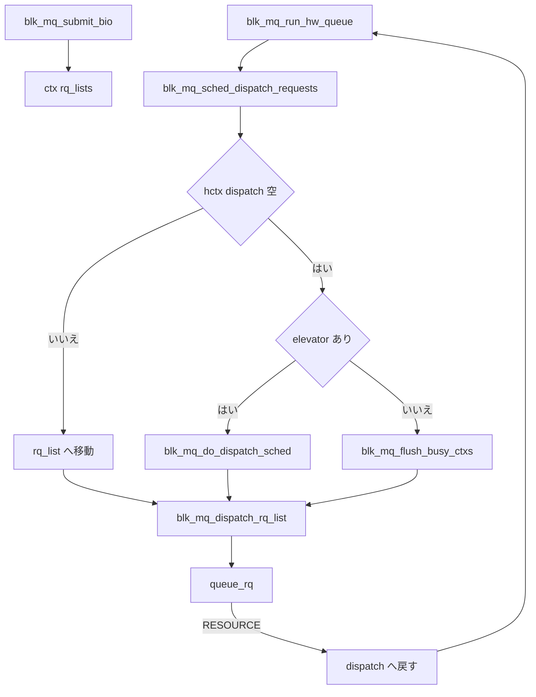

# 第7章 dispatch と queue_rq handoff

> **本章で読むソース**
>
> - [`block/blk-mq.c` L2334-L2370](https://github.com/gregkh/linux/blob/v6.18.38/block/blk-mq.c#L2334-L2370)
> - [`block/blk-mq-sched.c` L268-L314](https://github.com/gregkh/linux/blob/v6.18.38/block/blk-mq-sched.c#L268-L314)
> - [`block/blk-mq-sched.c` L317-L333](https://github.com/gregkh/linux/blob/v6.18.38/block/blk-mq-sched.c#L317-L333)
> - [`block/blk-mq.c` L2098-L2144](https://github.com/gregkh/linux/blob/v6.18.38/block/blk-mq.c#L2098-L2144)
> - [`include/linux/blk-mq.h` L304-L333](https://github.com/gregkh/linux/blob/v6.18.38/include/linux/blk-mq.h#L304-L333)
> - [`block/blk-mq.c` L2145-L2216](https://github.com/gregkh/linux/blob/v6.18.38/block/blk-mq.c#L2145-L2216)
> - [`block/mq-deadline.c` L446-L448](https://github.com/gregkh/linux/blob/v6.18.38/block/mq-deadline.c#L446-L448)

## この章の狙い

ctx のソフトウェアキューからドライバの `queue_rq` までの中間経路を読む。
`blk_mq_run_hw_queue`、hctx の **dispatch** リスト、elevator からの取出しがどう接続するかを追う。

## 前提

- [第5章](05-blk-mq-queues-hctx-ctx.md) で ctx と hctx を読んでいること。
- [第6章](06-blk-mq-submit-tags.md) で `blk_mq_submit_bio` を読んでいること。

## blk_mq_run_hw_queue の起動条件

ハードウェアキューを走らせる入口は `blk_mq_run_hw_queue` である。
送信 CPU が hctx の cpumask に含まれれば同期で `blk_mq_sched_dispatch_requests` を呼び、そうでなければ work へ遅延する。

[`block/blk-mq.c` L2334-L2370](https://github.com/gregkh/linux/blob/v6.18.38/block/blk-mq.c#L2334-L2370)

```c
void blk_mq_run_hw_queue(struct blk_mq_hw_ctx *hctx, bool async)
{
	bool need_run;

	/*
	 * We can't run the queue inline with interrupts disabled.
	 */
	WARN_ON_ONCE(!async && in_interrupt());

	might_sleep_if(!async && hctx->flags & BLK_MQ_F_BLOCKING);

	need_run = blk_mq_hw_queue_need_run(hctx);
	if (!need_run) {
		unsigned long flags;

		/*
		 * Synchronize with blk_mq_unquiesce_queue(), because we check
		 * if hw queue is quiesced locklessly above, we need the use
		 * ->queue_lock to make sure we see the up-to-date status to
		 * not miss rerunning the hw queue.
		 */
		spin_lock_irqsave(&hctx->queue->queue_lock, flags);
		need_run = blk_mq_hw_queue_need_run(hctx);
		spin_unlock_irqrestore(&hctx->queue->queue_lock, flags);

		if (!need_run)
			return;
	}

	if (async || !cpumask_test_cpu(raw_smp_processor_id(), hctx->cpumask)) {
		blk_mq_delay_run_hw_queue(hctx, 0);
		return;
	}

	blk_mq_run_dispatch_ops(hctx->queue,
				blk_mq_sched_dispatch_requests(hctx));
}
```

タグ不足や submit 完了後に `blk_mq_run_hw_queue(hctx, true)` が呼ばれ、滞留 request を動かす。

## hctx の dispatch リスト

`blk_mq_hw_ctx` の `dispatch` は、ドライバが `BLK_STS_RESOURCE` を返して送れなかった request の待ち行列である。
コメントが示す通り、次回はここから先に取り出して公平性を保つ。

[`include/linux/blk-mq.h` L304-L333](https://github.com/gregkh/linux/blob/v6.18.38/include/linux/blk-mq.h#L304-L333)

```c
struct blk_mq_hw_ctx {
	struct {
		/** @lock: Protects the dispatch list. */
		spinlock_t		lock;
		/**
		 * @dispatch: Used for requests that are ready to be
		 * dispatched to the hardware but for some reason (e.g. lack of
		 * resources) could not be sent to the hardware. As soon as the
		 * driver can send new requests, requests at this list will
		 * be sent first for a fairer dispatch.
		 */
		struct list_head	dispatch;
		 /**
		  * @state: BLK_MQ_S_* flags. Defines the state of the hw
		  * queue (active, scheduled to restart, stopped).
		  */
		unsigned long		state;
	} ____cacheline_aligned_in_smp;

	/**
	 * @run_work: Used for scheduling a hardware queue run at a later time.
	 */
	struct delayed_work	run_work;
	/** @cpumask: Map of available CPUs where this hctx can run. */
	cpumask_var_t		cpumask;
	/**
	 * @next_cpu: Used by blk_mq_hctx_next_cpu() for round-robin CPU
	 * selection from @cpumask.
	 */
	int			next_cpu;
```

リソース不足で戻された request は `list_splice_tail_init` で `dispatch` へ載る（第7章後半の `blk_mq_dispatch_rq_list` 参照）。

## スケジューラ経由の取出し

`__blk_mq_sched_dispatch_requests` はまず `dispatch` リストを `rq_list` へ移し、空なら elevator または ctx から取出す。
elevator 有効時は `blk_mq_do_dispatch_sched`、無効時は `blk_mq_flush_busy_ctxs` でソフトウェアキューを走査する。

[`block/blk-mq-sched.c` L268-L314](https://github.com/gregkh/linux/blob/v6.18.38/block/blk-mq-sched.c#L268-L314)

```c
static int __blk_mq_sched_dispatch_requests(struct blk_mq_hw_ctx *hctx)
{
	bool need_dispatch = false;
	LIST_HEAD(rq_list);

	/*
	 * If we have previous entries on our dispatch list, grab them first for
	 * more fair dispatch.
	 */
	if (!list_empty_careful(&hctx->dispatch)) {
		spin_lock(&hctx->lock);
		if (!list_empty(&hctx->dispatch))
			list_splice_init(&hctx->dispatch, &rq_list);
		spin_unlock(&hctx->lock);
	}

	// ... (中略) ...

	if (!list_empty(&rq_list)) {
		blk_mq_sched_mark_restart_hctx(hctx);
		if (!blk_mq_dispatch_rq_list(hctx, &rq_list, true))
			return 0;
		need_dispatch = true;
	} else {
		need_dispatch = hctx->dispatch_busy;
	}

	if (hctx->queue->elevator)
		return blk_mq_do_dispatch_sched(hctx);

	/* dequeue request one by one from sw queue if queue is busy */
	if (need_dispatch)
		return blk_mq_do_dispatch_ctx(hctx);
	blk_mq_flush_busy_ctxs(hctx, &rq_list);
	blk_mq_dispatch_rq_list(hctx, &rq_list, true);
	return 0;
}
```

mq-deadline のコメントは、この関数が elevator から呼ばれることを明示している。

[`block/mq-deadline.c` L446-L448](https://github.com/gregkh/linux/blob/v6.18.38/block/mq-deadline.c#L446-L448)

```c
 * Called from blk_mq_run_hw_queue() -> __blk_mq_sched_dispatch_requests().
```

## blk_mq_dispatch_rq_list と queue_rq

取出した request リストを順に `mq_ops->queue_rq` へ渡す。
`BLK_STS_RESOURCE` や `BLK_STS_DEV_RESOURCE` なら request をリスト先頭へ戻し、後で `dispatch` へ再挿入する。

[`block/blk-mq.c` L2098-L2144](https://github.com/gregkh/linux/blob/v6.18.38/block/blk-mq.c#L2098-L2144)

```c
bool blk_mq_dispatch_rq_list(struct blk_mq_hw_ctx *hctx, struct list_head *list,
			     bool get_budget)
{
	enum prep_dispatch prep;
	struct request_queue *q = hctx->queue;
	struct request *rq;
	int queued;
	blk_status_t ret = BLK_STS_OK;
	bool needs_resource = false;

	if (list_empty(list))
		return false;

	/*
	 * Now process all the entries, sending them to the driver.
	 */
	queued = 0;
	do {
		struct blk_mq_queue_data bd;

		rq = list_first_entry(list, struct request, queuelist);

		WARN_ON_ONCE(hctx != rq->mq_hctx);
		prep = blk_mq_prep_dispatch_rq(rq, get_budget);
		if (prep != PREP_DISPATCH_OK)
			break;

		list_del_init(&rq->queuelist);

		bd.rq = rq;
		bd.last = list_empty(list);

		ret = q->mq_ops->queue_rq(hctx, &bd);
		switch (ret) {
		case BLK_STS_OK:
			queued++;
			break;
		case BLK_STS_RESOURCE:
			needs_resource = true;
			fallthrough;
		case BLK_STS_DEV_RESOURCE:
			blk_mq_handle_dev_resource(rq, list);
			goto out;
		default:
			blk_mq_end_request(rq, ret);
		}
	} while (!list_empty(list));
```

`bd.last` はドライバがバッチ末尾でドアベルを一度だけ鳴らすためのヒントである（NVMe の `queue_rqs` と対応）。

## dispatch リストへの再挿入

`queue_rq` が `BLK_STS_RESOURCE` または `BLK_STS_DEV_RESOURCE` を返すと、未送出 request は `list` に残る。
`list_splice_tail_init` で `hctx->dispatch` へ戻し、`smp_mb` の後に restart 判定を行う。
`PREP_DISPATCH_NO_TAG` かつ共有タグの場合は `no_tag` として扱い、dispatch waitqueue の状態で rerun 条件が変わる。

[`block/blk-mq.c` L2145-L2216](https://github.com/gregkh/linux/blob/v6.18.38/block/blk-mq.c#L2145-L2216)

```c
out:
	/* If we didn't flush the entire list, we could have told the driver
	 * there was more coming, but that turned out to be a lie.
	 */
	if (!list_empty(list) || ret != BLK_STS_OK)
		blk_mq_commit_rqs(hctx, queued, false);

	/*
	 * Any items that need requeuing? Stuff them into hctx->dispatch,
	 * that is where we will continue on next queue run.
	 */
	if (!list_empty(list)) {
		bool needs_restart;
		/* For non-shared tags, the RESTART check will suffice */
		bool no_tag = prep == PREP_DISPATCH_NO_TAG &&
			((hctx->flags & BLK_MQ_F_TAG_QUEUE_SHARED) ||
			blk_mq_is_shared_tags(hctx->flags));

		// ... (中略) ...

		spin_lock(&hctx->lock);
		list_splice_tail_init(list, &hctx->dispatch);
		spin_unlock(&hctx->lock);

		/*
		 * Order adding requests to hctx->dispatch and checking
		 * SCHED_RESTART flag. The pair of this smp_mb() is the one
		 * in blk_mq_sched_restart(). Avoid restart code path to
		 * miss the new added requests to hctx->dispatch, meantime
		 * SCHED_RESTART is observed here.
		 */
		smp_mb();

		// ... (中略) ...

		needs_restart = blk_mq_sched_needs_restart(hctx);
		if (prep == PREP_DISPATCH_NO_BUDGET)
			needs_resource = true;
		if (!needs_restart ||
		    (no_tag && list_empty_careful(&hctx->dispatch_wait.entry)))
			blk_mq_run_hw_queue(hctx, true);
		else if (needs_resource)
			blk_mq_delay_run_hw_queue(hctx, BLK_MQ_RESOURCE_DELAY);
```

`BLK_STS_RESOURCE` は `needs_resource` を立て遅延 rerun へ、`BLK_STS_DEV_RESOURCE` は即時 `blk_mq_handle_dev_resource` でリスト先頭へ戻す。
no-tag 失敗時は dispatch waitqueue が空なら `blk_mq_run_hw_queue(hctx, true)` で非同期に再スケジュールする。

## 再ディスパッチと EAGAIN

`blk_mq_sched_dispatch_requests` は flush 系 request の飢餓を避けるため `-EAGAIN` 時に再実行する。

[`block/blk-mq-sched.c` L317-L333](https://github.com/gregkh/linux/blob/v6.18.38/block/blk-mq-sched.c#L317-L333)

```c
void blk_mq_sched_dispatch_requests(struct blk_mq_hw_ctx *hctx)
{
	struct request_queue *q = hctx->queue;

	/* RCU or SRCU read lock is needed before checking quiesced flag */
	if (unlikely(blk_mq_hctx_stopped(hctx) || blk_queue_quiesced(q)))
		return;

	/*
	 * A return of -EAGAIN is an indication that hctx->dispatch is not
	 * empty and we must run again in order to avoid starving flushes.
	 */
	if (__blk_mq_sched_dispatch_requests(hctx) == -EAGAIN) {
		if (__blk_mq_sched_dispatch_requests(hctx) == -EAGAIN)
			blk_mq_run_hw_queue(hctx, true);
	}
}
```

## 処理の流れ



## 高速化と最適化の工夫

**dispatch リストの優先取出し**は、リソース不足で一度弾かれた request を先に再送し、新規 request だけが先に行く偏りを抑える。

**`bd.last` によるバッチヒント**はドライバが複数 `queue_rq` をまとめてドアベル通知できるようにする。
NVMe では MMIO 回数削減に直結する（第21章）。

**cpumask 不一致時の遅延実行**は、送信 CPU と hctx の担当 CPU が異なるときに別 CPU でディスパッチし、キャッシュ局所性を保つ。

> **v7.1.3 注記**：本章が引用する範囲では v6.18.38 と v7.1.3 で読解に影響する分岐変更は確認されていない。
> 監査一覧は [README](../README.md#v713-との差分監査) を参照。

## まとめ

submit 後の request は ctx または elevator を経て `blk_mq_run_hw_queue` で動き出す。
`blk_mq_dispatch_rq_list` が `queue_rq` への最終 handoff を担い、RESOURCE 時は `dispatch` へ戻って再試行する。
第8章はこの先の完了と IRQ、polling を読む。

## 関連する章

- [第6章 blk_mq_submit_bio とタグ割り当て](06-blk-mq-submit-tags.md)
- [第8章 完了処理、IRQ、polling](08-blk-mq-completion-poll.md)
- [第9章 elevator フレームワーク](../part02-iosched/09-elevator-framework.md)
- [第21章 NVMe の queue_rq](../part04-nvme-zoned/21-nvme-queue-rq-doorbell.md)
