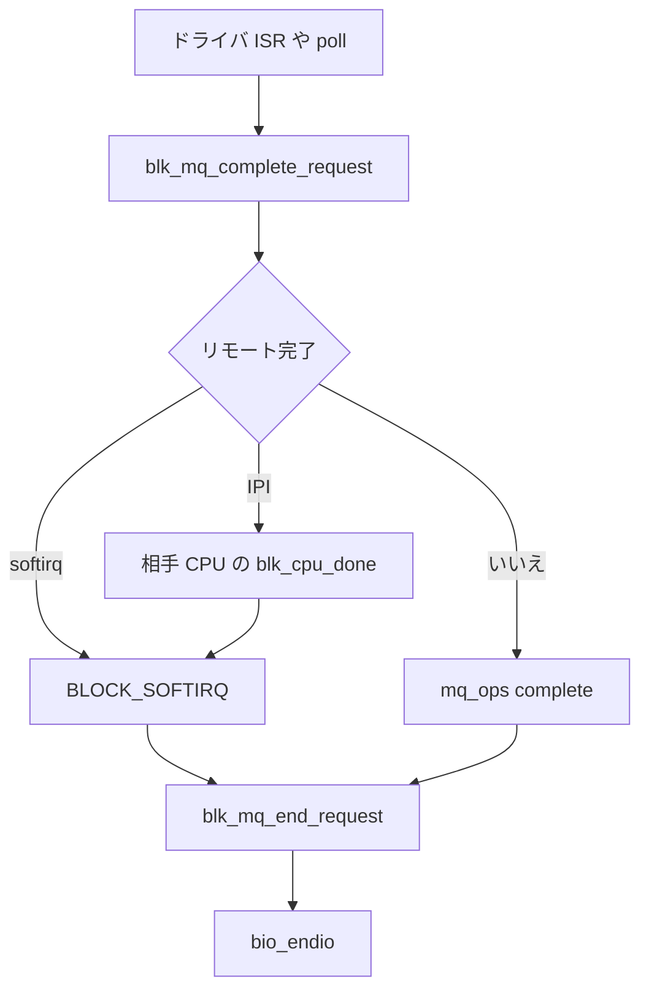

# 第8章 完了処理、IRQ、polling

> **本章で読むソース**
>
> - [`block/blk-mq.c` L1255-L1280](https://github.com/gregkh/linux/blob/v6.18.38/block/blk-mq.c#L1255-L1280)
> - [`block/blk-mq.c` L1302-L1326](https://github.com/gregkh/linux/blob/v6.18.38/block/blk-mq.c#L1302-L1326)
> - [`block/blk-mq.c` L1336-L1340](https://github.com/gregkh/linux/blob/v6.18.38/block/blk-mq.c#L1336-L1340)
> - [`block/blk-mq.c` L1239-L1253](https://github.com/gregkh/linux/blob/v6.18.38/block/blk-mq.c#L1239-L1253)
> - [`block/blk-mq.c` L1142-L1165](https://github.com/gregkh/linux/blob/v6.18.38/block/blk-mq.c#L1142-L1165)
> - [`block/blk-mq.c` L1180-L1211](https://github.com/gregkh/linux/blob/v6.18.38/block/blk-mq.c#L1180-L1211)
> - [`block/blk-mq.c` L5221-L5244](https://github.com/gregkh/linux/blob/v6.18.38/block/blk-mq.c#L5221-L5244)
> - [`block/blk-core.c` L937-L960](https://github.com/gregkh/linux/blob/v6.18.38/block/blk-core.c#L937-L960)

## この章の狙い

ドライバが I/O を終えてから `bio_endio` に至るまでの完了経路を読む。
割り込み、softirq、CPU 間 IPI、polling の分岐を整理する。

## 前提

- [第6章](06-blk-mq-submit-tags.md) で request 発行を読んでいること。

## blk_mq_complete_request の分岐

ドライバは通常 `blk_mq_complete_request` を呼ぶ。
`blk_mq_complete_request_remote` が true を返せば IPI または softirq へ載せ、false なら `mq_ops->complete` を直接呼ぶ。

[`block/blk-mq.c` L1302-L1326](https://github.com/gregkh/linux/blob/v6.18.38/block/blk-mq.c#L1302-L1326)

```c
bool blk_mq_complete_request_remote(struct request *rq)
{
	WRITE_ONCE(rq->state, MQ_RQ_COMPLETE);

	/*
	 * For request which hctx has only one ctx mapping,
	 * or a polled request, always complete locally,
	 * it's pointless to redirect the completion.
	 */
	if ((rq->mq_hctx->nr_ctx == 1 &&
	     rq->mq_ctx->cpu == raw_smp_processor_id()) ||
	     rq->cmd_flags & REQ_POLLED)
		return false;

	if (blk_mq_complete_need_ipi(rq)) {
		blk_mq_complete_send_ipi(rq);
		return true;
	}

	if (rq->q->nr_hw_queues == 1) {
		blk_mq_raise_softirq(rq);
		return true;
	}
	return false;
}
```

`REQ_POLLED` は `blk_mq_complete_request` を呼んだ現在 CPU で `mq_ops->complete` を直接実行し、IPI や softirq へのリダイレクトを避ける。
poller が投入 CPU と同じであることは API 上は保証されない。

[`block/blk-mq.c` L1336-L1340](https://github.com/gregkh/linux/blob/v6.18.38/block/blk-mq.c#L1336-L1340)

```c
void blk_mq_complete_request(struct request *rq)
{
	if (!blk_mq_complete_request_remote(rq))
		rq->q->mq_ops->complete(rq);
}
```

## blk_mq_complete_need_ipi と QUEUE_FLAG_SAME_COMP

`QUEUE_FLAG_SAME_COMP` が立っていても無条件にローカル完了するわけではない。
現在 CPU が submit CPU と同一、または同一 cache/capacity ならローカル、それ以外は submit CPU へ IPI する。

[`block/blk-mq.c` L1255-L1280](https://github.com/gregkh/linux/blob/v6.18.38/block/blk-mq.c#L1255-L1280)

```c
static inline bool blk_mq_complete_need_ipi(struct request *rq)
{
	int cpu = raw_smp_processor_id();

	if (!IS_ENABLED(CONFIG_SMP) ||
	    !test_bit(QUEUE_FLAG_SAME_COMP, &rq->q->queue_flags))
		return false;
	/*
	 * With force threaded interrupts enabled, raising softirq from an SMP
	 * function call will always result in waking the ksoftirqd thread.
	 * This is probably worse than completing the request on a different
	 * cache domain.
	 */
	if (force_irqthreads())
		return false;

	/* same CPU or cache domain and capacity?  Complete locally */
	if (cpu == rq->mq_ctx->cpu ||
	    (!test_bit(QUEUE_FLAG_SAME_FORCE, &rq->q->queue_flags) &&
	     cpus_share_cache(cpu, rq->mq_ctx->cpu) &&
	     cpus_equal_capacity(cpu, rq->mq_ctx->cpu)))
		return false;

	/* don't try to IPI to an offline CPU */
	return cpu_online(rq->mq_ctx->cpu);
}
```

> **v7.1.3 注記**：`blk_mq_complete_request_remote` と `blk_mq_complete_need_ipi` は [v7.1.3 `block/blk-mq.c` L1272-L1343](https://github.com/gregkh/linux/blob/v7.1.3/block/blk-mq.c#L1272-L1343) でも本文と同一である。

## IPI と BLOCK_SOFTIRQ

完了 CPU が投入 CPU と離れている場合、IPI で相手の per-CPU リストへ載せる。
単一 hw queue デバイスでは softirq `BLOCK_SOFTIRQ` を直接起こす経路もある。

[`block/blk-mq.c` L1239-L1253](https://github.com/gregkh/linux/blob/v6.18.38/block/blk-mq.c#L1239-L1253)

```c
static __latent_entropy void blk_done_softirq(void)
{
	blk_complete_reqs(this_cpu_ptr(&blk_cpu_done));
}

static int blk_softirq_cpu_dead(unsigned int cpu)
{
	blk_complete_reqs(&per_cpu(blk_cpu_done, cpu));
	return 0;
}

static void __blk_mq_complete_request_remote(void *data)
{
	__raise_softirq_irqoff(BLOCK_SOFTIRQ);
}
```

softirq ハンドラは溜まった request に対し `mq_ops->complete` を呼ぶ。
割り込みを短く保ち、重い処理はブロック層側へ逃がす。

## request 終了と bio 伝播

`blk_mq_end_request` は残りセクタを更新し、`__blk_mq_end_request` でタグ解放と `end_io` を呼ぶ。
`end_io` が `RQ_END_IO_FREE` を返せば request をプールへ戻す。

[`block/blk-mq.c` L1142-L1165](https://github.com/gregkh/linux/blob/v6.18.38/block/blk-mq.c#L1142-L1165)

```c
inline void __blk_mq_end_request(struct request *rq, blk_status_t error)
{
	if (blk_mq_need_time_stamp(rq))
		__blk_mq_end_request_acct(rq, blk_time_get_ns());

	blk_mq_finish_request(rq);

	if (rq->end_io) {
		rq_qos_done(rq->q, rq);
		if (rq->end_io(rq, error) == RQ_END_IO_FREE)
			blk_mq_free_request(rq);
	} else {
		blk_mq_free_request(rq);
	}
}
EXPORT_SYMBOL(__blk_mq_end_request);

void blk_mq_end_request(struct request *rq, blk_status_t error)
{
	if (blk_update_request(rq, error, blk_rq_bytes(rq)))
		BUG();
	__blk_mq_end_request(rq, error);
}
EXPORT_SYMBOL(blk_mq_end_request);
```

部分完了の bio は `blk_update_request` で前進し、全部終わるまで `end_io` は遅延する。

## バッチ完了

polling や `io_comp_batch` 経路では `blk_mq_end_request_batch` が複数 request をまとめて処理する。
タグ返却も `blk_mq_put_tags` でバッチ化される。

[`block/blk-mq.c` L1180-L1211](https://github.com/gregkh/linux/blob/v6.18.38/block/blk-mq.c#L1180-L1211)

```c
void blk_mq_end_request_batch(struct io_comp_batch *iob)
{
	int tags[TAG_COMP_BATCH], nr_tags = 0;
	struct blk_mq_hw_ctx *cur_hctx = NULL;
	struct request *rq;
	u64 now = 0;

	if (iob->need_ts)
		now = blk_time_get_ns();

	while ((rq = rq_list_pop(&iob->req_list)) != NULL) {
		prefetch(rq->bio);
		prefetch(rq->rq_next);

		blk_complete_request(rq);
		if (iob->need_ts)
			__blk_mq_end_request_acct(rq, now);

		blk_mq_finish_request(rq);

		rq_qos_done(rq->q, rq);

		/*
		 * If end_io handler returns NONE, then it still has
		 * ownership of the request.
		 */
		if (rq->end_io && rq->end_io(rq, 0) == RQ_END_IO_NONE)
			continue;

		WRITE_ONCE(rq->state, MQ_RQ_IDLE);
		if (!req_ref_put_and_test(rq))
			continue;
```

`prefetch` は次の request と bio を先読みし、完了ループのキャッシュミスを減らす。

## blk_mq_poll

ユーザー空間 polling や `io_uring` の IOPOLL は `blk_mq_poll` を経由する。
`bi_cookie` が指す hctx でドライバの `poll` コールバックを回す。

[`block/blk-mq.c` L5221-L5244](https://github.com/gregkh/linux/blob/v6.18.38/block/blk-mq.c#L5221-L5244)

```c
int blk_mq_poll(struct request_queue *q, blk_qc_t cookie,
		struct io_comp_batch *iob, unsigned int flags)
{
	if (!blk_mq_can_poll(q))
		return 0;
	return blk_hctx_poll(q, xa_load(&q->hctx_table, cookie), iob, flags);
}

int blk_rq_poll(struct request *rq, struct io_comp_batch *iob,
		unsigned int poll_flags)
{
	struct request_queue *q = rq->q;
	int ret;

	if (!blk_rq_is_poll(rq))
		return 0;
	if (!percpu_ref_tryget(&q->q_usage_counter))
		return 0;

	ret = blk_hctx_poll(q, rq->mq_hctx, iob, poll_flags);
	blk_queue_exit(q);

	return ret;
}
```

割り込みを待たずに完了キューを覗くため、低レイテンシ I/O で使われる。

## bio_poll 入口

bio 単位の polling 公開 API は `bio_poll` である。
`bi_cookie` からキューと hctx をたどる。

[`block/blk-core.c` L937-L960](https://github.com/gregkh/linux/blob/v6.18.38/block/blk-core.c#L937-L960)

```c
int bio_poll(struct bio *bio, struct io_comp_batch *iob, unsigned int flags)
{
	blk_qc_t cookie = READ_ONCE(bio->bi_cookie);
	struct block_device *bdev;
	struct request_queue *q;
	int ret = 0;

	bdev = READ_ONCE(bio->bi_bdev);
	if (!bdev)
		return 0;

	q = bdev_get_queue(bdev);
	if (cookie == BLK_QC_T_NONE)
		return 0;

	blk_flush_plug(current->plug, false);

	/*
	 * We need to be able to enter a frozen queue, similar to how
	 * timeouts also need to do that. If that is blocked, then we can
	 * have pending IO when a queue freeze is started, and then the
	 * wait for the freeze to finish will wait for polled requests to
	 * timeout as the poller is preventer from entering the queue and
	 * completing them. As long as we prevent new IO from being queued,
```

発行側タスクが自分で完了を回収するモデルである。

## 処理の流れ



## 高速化と最適化の工夫

**完了 CPU の局所化**（`QUEUE_FLAG_SAME_COMP`）は、submit CPU と同一 cache/capacity ならローカル完了し、離れていれば IPI で submit CPU へ送る。
無条件 IPI よりコストが低い場面を選ぶための条件分岐である。

**バッチ完了とタグバッチ返却**は polling ループで inflight がまとめて終わるときに固定費を削る。
NVMe の割り込み coalescing と組み合わさると効果が大きい。

**REQ_POLLED と blk_mq_poll** は割り込みハンドラを介さない完了回収を可能にする。
システムコールと割り込みのオーバーヘッドを避ける代わり、CPU を消費するトレードオフがある。

## まとめ

完了は `blk_mq_complete_request` から入り、CPU 配置に応じて IPI、softirq、直接完了が選ばれる。
`blk_mq_end_request` が request とタグを解放し、bio へ結果が伝播する。
polling 経路は第18章の `io_uring` IOPOLL と接続する。

## 関連する章

- [第18章 登録リソースと buffer ring](../part03-io-uring/18-fixed-resources-buffer-ring.md)
- [第21章 NVMe の queue_rq とドアベル](../part04-nvme-zoned/21-nvme-queue-rq-doorbell.md)
