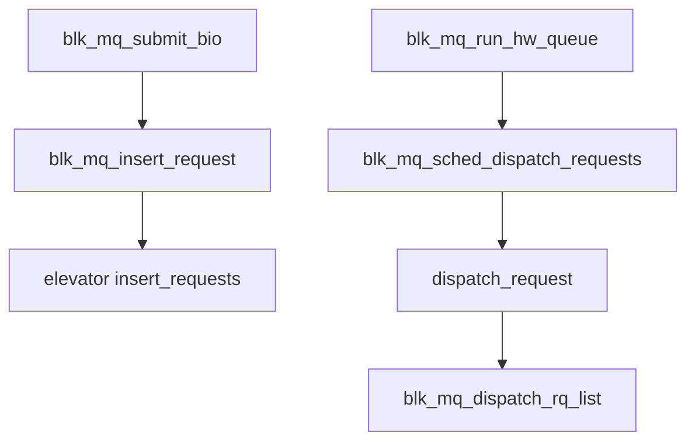

# 第7章 elevator フレームワークと切り替え

> **本章で読むソース**
>
> - [`block/elevator.h` L60-L84](https://github.com/gregkh/linux/blob/v6.18.38/block/elevator.h#L60-L84)
> - [`block/elevator.h` L97-L118](https://github.com/gregkh/linux/blob/v6.18.38/block/elevator.h#L97-L118)
> - [`block/elevator.c` L562-L605](https://github.com/gregkh/linux/blob/v6.18.38/block/elevator.c#L562-L605)
> - [`block/blk-mq-sched.c` L268-L314](https://github.com/gregkh/linux/blob/v6.18.38/block/blk-mq-sched.c#L268-L314)
> - [`block/blk-mq-sched.c` L317-L330](https://github.com/gregkh/linux/blob/v6.18.38/block/blk-mq-sched.c#L317-L330)
> - [`block/blk-mq.c` L3227-L3231](https://github.com/gregkh/linux/blob/v6.18.38/block/blk-mq.c#L3227-L3231)

## この章の狙い

blk-mq 時代の **elevator**（I/O スケジューラ）が提供するコールバック集合と、キューへの挿入から dispatch までの枠組みを読む。
`none`、mq-deadline、BFQ の切り替えがどう行われるかも押さえる。

## 前提

- [第5章](../part01-blk-mq/05-blk-mq-submit-tags.md) で `blk_mq_insert_request` への分岐を読んでいること。

## elevator_mq_ops の契約

スケジューラは `elevator_mq_ops` の関数群を実装する。
挿入、dispatch、マージ、深度制限、完了通知が揃っている。

[`block/elevator.h` L60-L84](https://github.com/gregkh/linux/blob/v6.18.38/block/elevator.h#L60-L84)

```c
	int (*init_hctx)(struct blk_mq_hw_ctx *, unsigned int);
	void (*exit_hctx)(struct blk_mq_hw_ctx *, unsigned int);
	void (*depth_updated)(struct request_queue *);
	void *(*alloc_sched_data)(struct request_queue *);
	void (*free_sched_data)(void *);

	bool (*allow_merge)(struct request_queue *, struct request *, struct bio *);
	bool (*bio_merge)(struct request_queue *, struct bio *, unsigned int);
	int (*request_merge)(struct request_queue *q, struct request **, struct bio *);
	void (*request_merged)(struct request_queue *, struct request *, enum elv_merge);
	void (*requests_merged)(struct request_queue *, struct request *, struct request *);
	void (*limit_depth)(blk_opf_t, struct blk_mq_alloc_data *);
	void (*prepare_request)(struct request *);
	void (*finish_request)(struct request *);
	void (*insert_requests)(struct blk_mq_hw_ctx *hctx, struct list_head *list,
			blk_insert_t flags);
	struct request *(*dispatch_request)(struct blk_mq_hw_ctx *);
	bool (*has_work)(struct blk_mq_hw_ctx *);
	void (*completed_request)(struct request *, u64);
	void (*requeue_request)(struct request *);
	struct request *(*former_request)(struct request_queue *, struct request *);
	struct request *(*next_request)(struct request_queue *, struct request *);
	void (*init_icq)(struct io_cq *);
	void (*exit_icq)(struct io_cq *);
};
```

`insert_requests` は hctx 単位でまとめて挿入する。
`dispatch_request` はドライバへ送る次の request を選ぶ。

## elevator_type の登録

実装は `elevator_type` としてモジュール登録される。
`elevator_name` が sysfs の切り替え名になる。

[`block/elevator.h` L97-L118](https://github.com/gregkh/linux/blob/v6.18.38/block/elevator.h#L97-L118)

```c
struct elevator_type
{
	/* managed by elevator core */
	struct kmem_cache *icq_cache;

	/* fields provided by elevator implementation */
	struct elevator_mq_ops ops;

	size_t icq_size;	/* see iocontext.h */
	size_t icq_align;	/* ditto */
	const struct elv_fs_entry *elevator_attrs;
	const char *elevator_name;
	const char *elevator_alias;
	struct module *elevator_owner;
#ifdef CONFIG_BLK_DEBUG_FS
	const struct blk_mq_debugfs_attr *queue_debugfs_attrs;
	const struct blk_mq_debugfs_attr *hctx_debugfs_attrs;
#endif

	/* managed by elevator core */
	char icq_cache_name[ELV_NAME_MAX + 6];	/* elvname + "_io_cq" */
	struct list_head list;
```

`icq`（I/O context per process）サイズはスケジューラ固有の per-task 状態に使われる。

## elevator_switch

キューのスケジューラ変更は freeze 下で行う。
古い elevator を `elevator_exit` し、`blk_mq_init_sched` で新しい実装を載せる。

[`block/elevator.c` L562-L605](https://github.com/gregkh/linux/blob/v6.18.38/block/elevator.c#L562-L605)

```c
static int elevator_switch(struct request_queue *q, struct elv_change_ctx *ctx)
{
	struct elevator_type *new_e = NULL;
	int ret = 0;

	WARN_ON_ONCE(q->mq_freeze_depth == 0);
	lockdep_assert_held(&q->elevator_lock);

	if (strncmp(ctx->name, "none", 4)) {
		new_e = elevator_find_get(ctx->name);
		if (!new_e)
			return -EINVAL;
	// ... (中略) ...
	if (ret) {
		pr_warn("elv: switch to \"%s\" failed, falling back to \"none\"\n",
			new_e->elevator_name);
	}

	if (new_e)
		elevator_put(new_e);
	return ret;
```

`none` では elevator ポインタが NULL になり、スケジューラなしの直接 dispatch になる。

## dispatch ループ

`__blk_mq_sched_dispatch_requests` はまず hctx の `dispatch` 残りを処理し、次にスケジューラから取り出す。
スケジューラから引き抜いた request はもうマージできないため、できるだけキューに残す設計である。

[`block/blk-mq-sched.c` L268-L314](https://github.com/gregkh/linux/blob/v6.18.38/block/blk-mq-sched.c#L268-L314)

```c
static int __blk_mq_sched_dispatch_requests(struct blk_mq_hw_ctx *hctx)
{
	bool need_dispatch = false;
	LIST_HEAD(rq_list);

	/*
	 * If we have previous entries on our dispatch list, grab them first for
	 * more fair dispatch.
	 */
	if (!list_empty_careful(&hctx->dispatch)) {
		spin_lock(&hctx->lock);
		if (!list_empty(&hctx->dispatch))
	// ... (中略) ...
		return blk_mq_do_dispatch_sched(hctx);

	/* dequeue request one by one from sw queue if queue is busy */
	if (need_dispatch)
		return blk_mq_do_dispatch_ctx(hctx);
	blk_mq_flush_busy_ctxs(hctx, &rq_list);
	blk_mq_dispatch_rq_list(hctx, &rq_list, true);
	return 0;
```

elevator 有効時は `blk_mq_do_dispatch_sched` が `dispatch_request` を繰り返し呼ぶ。

## hctx 走査のエントリ

`blk_mq_sched_dispatch_requests` はキュー freeze 状態を確認し、必要なら restart をマークする。

[`block/blk-mq-sched.c` L317-L330](https://github.com/gregkh/linux/blob/v6.18.38/block/blk-mq-sched.c#L317-L330)

```c
void blk_mq_sched_dispatch_requests(struct blk_mq_hw_ctx *hctx)
{
	struct request_queue *q = hctx->queue;

	/* RCU or SRCU read lock is needed before checking quiesced flag */
	if (unlikely(blk_mq_hctx_stopped(hctx) || blk_queue_quiesced(q)))
		return;

	/*
	 * A return of -EAGAIN is an indication that hctx->dispatch is not
	 * empty and we must run again in order to avoid starving flushes.
	 */
	if (__blk_mq_sched_dispatch_requests(hctx) == -EAGAIN) {
		if (__blk_mq_sched_dispatch_requests(hctx) == -EAGAIN)
```

タグ不足で `-EAGAIN` のときは遅延再実行する。

## submit 側のスケジューラ分岐

`blk_mq_submit_bio` は `RQF_USE_SCHED` または `dispatch_busy` のとき insert 経路へ入る。

[`block/blk-mq.c` L3227-L3231](https://github.com/gregkh/linux/blob/v6.18.38/block/blk-mq.c#L3227-L3231)

```c
	hctx = rq->mq_hctx;
	if ((rq->rq_flags & RQF_USE_SCHED) ||
	    (hctx->dispatch_busy && (q->nr_hw_queues == 1 || !is_sync))) {
		blk_mq_insert_request(rq, 0);
		blk_mq_run_hw_queue(hctx, true);
```

単一 hw queue で非同期 I/O が溜まっているときはスケジューラ経由になりやすい。

## 処理の流れ



## 高速化と最適化の工夫

**dispatch リスト優先**は、一度送れなかった request を先に再送する公平性の仕組みである。
スケジューラのソート結果より先に処理することで飢餓を防ぐ。

**スケジューラ内でのマージ猶予**は、dispatch 前に request をキューに留める設計から来る。
早く引き抜きすぎるとマージとソートの機会を失う。

**`limit_depth` フック**はタグ取得前に深度を浅くし、スケジューラがバーストを抑える。
mq-deadline の async depth 制限などがここに接続する。


> **v7.1.3 注記**：本章が引用する範囲では v6.18.38 と v7.1.3 で読解に影響する分岐変更は確認されていない。
> 監査一覧は [README](../README.md#v713-との差分監査) を参照。

## まとめ

elevator は blk-mq の dispatch パイプラインに差し込まれるプラグインである。
`elevator_mq_ops` がマージと順序付けを担い、`blk_mq_sched_dispatch_requests` がドライバへ送る。
次章から mq-deadline と BFQ の具体実装を読む。

## 関連する章

- [第8章 mq-deadline スケジューラ](08-mq-deadline.md)
- [第9章 BFQ 概観](09-bfq-overview.md)
