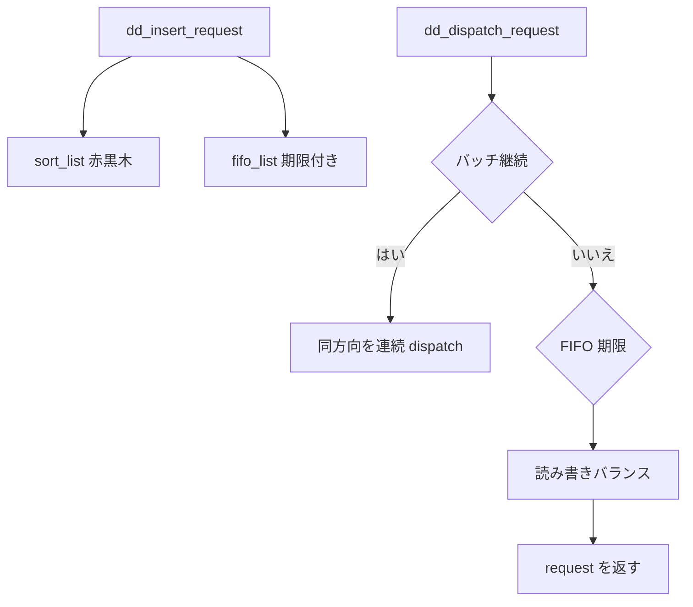

# 第8章 mq-deadline スケジューラ

> **本章で読むソース**
>
> - [`block/mq-deadline.c` L81-L105](https://github.com/gregkh/linux/blob/v6.18.38/block/mq-deadline.c#L81-L105)
> - [`block/mq-deadline.c` L639-L679](https://github.com/gregkh/linux/blob/v6.18.38/block/mq-deadline.c#L639-L679)
> - [`block/mq-deadline.c` L326-L360](https://github.com/gregkh/linux/blob/v6.18.38/block/mq-deadline.c#L326-L360)
> - [`block/mq-deadline.c` L453-L486](https://github.com/gregkh/linux/blob/v6.18.38/block/mq-deadline.c#L453-L486)
> - [`block/mq-deadline.c` L107-L113](https://github.com/gregkh/linux/blob/v6.18.38/block/mq-deadline.c#L107-L113)
> - [`block/elevator.c` L194-L210](https://github.com/gregkh/linux/blob/v6.18.38/block/elevator.c#L194-L210)

## この章の狙い

**mq-deadline** が締切（deadline）とソート順をどう組み合わせるか、挿入から dispatch までを読む。
読み取り飢餓防止とバッチングのトレードオフをソースで確認する。

## 前提

- [第7章](07-elevator-framework.md) で elevator フレームワークを読んでいること。

## deadline_data の構造

mq-deadline は優先度クラスごとに赤黒木（ソート）と FIFO（締切）を持つ。
`fifo_expire` が読み書きそれぞれの期限、`fifo_batch` が連続 dispatch の上限である。

[`block/mq-deadline.c` L81-L105](https://github.com/gregkh/linux/blob/v6.18.38/block/mq-deadline.c#L81-L105)

```c
struct deadline_data {
	/*
	 * run time data
	 */

	struct list_head dispatch;
	struct dd_per_prio per_prio[DD_PRIO_COUNT];

	/* Data direction of latest dispatched request. */
	enum dd_data_dir last_dir;
	unsigned int batching;		/* number of sequential requests made */
	unsigned int starved;		/* times reads have starved writes */

	/*
	 * settings that change how the i/o scheduler behaves
	 */
	int fifo_expire[DD_DIR_COUNT];
	int fifo_batch;
	int writes_starved;
	int front_merges;
	u32 async_depth;
	int prio_aging_expire;

	spinlock_t lock;
};
```

`starved` は読み取りが書き込みに押され続けた回数を数える。
`writes_starved` を超えると書き込みを優先する。

## I/O 優先度クラスへの写像

プロセスの ioprio クラスは mq-deadline 内部の優先度帯へ写像される。

[`block/mq-deadline.c` L107-L113](https://github.com/gregkh/linux/blob/v6.18.38/block/mq-deadline.c#L107-L113)

```c
/* Maps an I/O priority class to a deadline scheduler priority. */
static const enum dd_prio ioprio_class_to_prio[] = {
	[IOPRIO_CLASS_NONE]	= DD_BE_PRIO,
	[IOPRIO_CLASS_RT]	= DD_RT_PRIO,
	[IOPRIO_CLASS_BE]	= DD_BE_PRIO,
	[IOPRIO_CLASS_IDLE]	= DD_IDLE_PRIO,
};
```

RT クラスは別帯で扱われ、BE より先に dispatch されうる。

## request 挿入

`dd_insert_request` はマージを試し、失敗すれば赤黒木と FIFO へ載せる。
`fifo_time` に期限を記録し、期限切れ dispatch の判断材料にする。

[`block/mq-deadline.c` L639-L679](https://github.com/gregkh/linux/blob/v6.18.38/block/mq-deadline.c#L639-L679)

```c
static void dd_insert_request(struct blk_mq_hw_ctx *hctx, struct request *rq,
			      blk_insert_t flags, struct list_head *free)
{
	struct request_queue *q = hctx->queue;
	struct deadline_data *dd = q->elevator->elevator_data;
	const enum dd_data_dir data_dir = rq_data_dir(rq);
	u16 ioprio = req_get_ioprio(rq);
	u8 ioprio_class = IOPRIO_PRIO_CLASS(ioprio);
	struct dd_per_prio *per_prio;
	enum dd_prio prio;

	lockdep_assert_held(&dd->lock);
	// ... (中略) ...
				q->last_merge = rq;
		}

		/*
		 * set expire time and add to fifo list
		 */
		rq->fifo_time = jiffies + dd->fifo_expire[data_dir];
		list_add_tail(&rq->queuelist, &per_prio->fifo_list[data_dir]);
```

ハッシュはセクタ位置でのマージ加速に使われる。

## dispatch 選択ロジック

`__dd_dispatch_request` はバッチ継続中なら同方向を優先する。
そうでなければ FIFO 期限と読み書きバランスを見て方向を選ぶ。

[`block/mq-deadline.c` L326-L360](https://github.com/gregkh/linux/blob/v6.18.38/block/mq-deadline.c#L326-L360)

```c
static struct request *__dd_dispatch_request(struct deadline_data *dd,
					     struct dd_per_prio *per_prio,
					     unsigned long latest_start)
{
	struct request *rq, *next_rq;
	enum dd_data_dir data_dir;

	lockdep_assert_held(&dd->lock);

	/*
	 * batches are currently reads XOR writes
	 */
	rq = deadline_next_request(dd, per_prio, dd->last_dir);
	if (rq && dd->batching < dd->fifo_batch) {
		/* we have a next request and are still entitled to batch */
		data_dir = rq_data_dir(rq);
		goto dispatch_request;
	}

	/*
	 * at this point we are not running a batch. select the appropriate
	 * data direction (read / write)
	 */

	if (!list_empty(&per_prio->fifo_list[DD_READ])) {
		BUG_ON(RB_EMPTY_ROOT(&per_prio->sort_list[DD_READ]));

		if (deadline_fifo_request(dd, per_prio, DD_WRITE) &&
		    (dd->starved++ >= dd->writes_starved))
			goto dispatch_writes;

		data_dir = DD_READ;

		goto dispatch_find_request;
	}
```

バッチはシーケンシャル I/O のスループットを上げる。
期限はランダム I/O のレイテンシ上限を守る。

## hctx 横断 dispatch

mq-deadline は全 hctx で状態を共有する。
`dd_dispatch_request` は特定 hctx から呼ばれても、別 hctx 向け request を返しうる。

[`block/mq-deadline.c` L453-L486](https://github.com/gregkh/linux/blob/v6.18.38/block/mq-deadline.c#L453-L486)

```c
static struct request *dd_dispatch_request(struct blk_mq_hw_ctx *hctx)
{
	struct deadline_data *dd = hctx->queue->elevator->elevator_data;
	const unsigned long now = jiffies;
	struct request *rq;
	enum dd_prio prio;

	spin_lock(&dd->lock);

	if (!list_empty(&dd->dispatch)) {
		rq = list_first_entry(&dd->dispatch, struct request, queuelist);
		list_del_init(&rq->queuelist);
		dd_start_request(dd, rq_data_dir(rq), rq);
		goto unlock;
	}

	rq = dd_dispatch_prio_aged_requests(dd, now);
	if (rq)
		goto unlock;

	/*
	 * Next, dispatch requests in priority order. Ignore lower priority
	 * requests if any higher priority requests are pending.
	 */
	for (prio = 0; prio <= DD_PRIO_MAX; prio++) {
		rq = __dd_dispatch_request(dd, &dd->per_prio[prio], now);
		if (rq || dd_queued(dd, prio))
			break;
	}

unlock:
	spin_unlock(&dd->lock);

	return rq;
```

## マージ用ハッシュ

`elv_rqhash_find` はセクタ位置から既存 request を探す。
mq-deadline の insert 経路と共通の仕組みである。

[`block/elevator.c` L194-L210](https://github.com/gregkh/linux/blob/v6.18.38/block/elevator.c#L194-L210)

```c
struct request *elv_rqhash_find(struct request_queue *q, sector_t offset)
{
	struct elevator_queue *e = q->elevator;
	struct hlist_node *next;
	struct request *rq;

	hash_for_each_possible_safe(e->hash, rq, next, hash, offset) {
		BUG_ON(!ELV_ON_HASH(rq));

		if (unlikely(!rq_mergeable(rq))) {
			__elv_rqhash_del(rq);
			continue;
		}

		if (rq_hash_key(rq) == offset)
			return rq;
	}
```

## 処理の流れ



## 高速化と最適化の工夫

**赤黒木＋FIFO の二段構え**は、ソート順のマージ効率と期限付きレイテンシ保証を両立する古典設計である。
ソートだけでは古い request が後回しになりうるため、FIFO で締切を切る。

**fifo_batch によるシーケンシャルバッチ**はディスク先読みとキュー深度活用に効く。
期限を守りつつ、連続セクタはまとめて送る。

**elv_rqhash による O(1) 近似マージ探索**はセクタ位置キーで候補 request を引く。
フロントマージとバックマージの成功率を上げ、request 数を減らす。

> **v7.1.3 注記**：本章が引用する範囲では v6.18.38 と v7.1.3 で読解に影響する分岐変更は確認されていない。
> 監査一覧は [README](../README.md#v713-との差分監査) を参照。

## まとめ

mq-deadline はソート、FIFO 期限、読み書きバランス、バッチングを組み合わせた汎用スケジューラである。
blk-mq では全 hctx で状態を共有し、`dispatch_request` が横断的に選ぶ。
次章は比例公平性を重視する BFQ の概観を読む。

## 関連する章

- [第9章 BFQ 概観](09-bfq-overview.md)
- [第10章 plug と merge](10-plug-merge.md)
