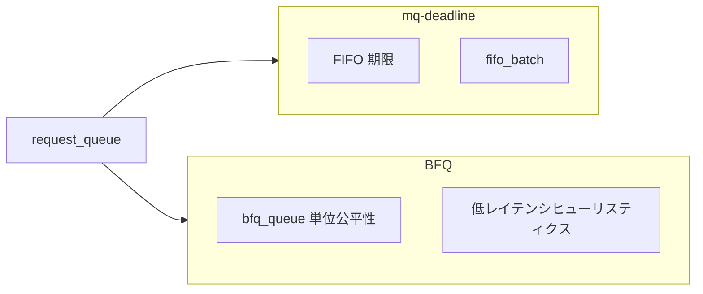

# 第11章 BFQ 概観

> **本章で読むソース**
>
> - [`block/bfq-iosched.c` L7205-L7233](https://github.com/gregkh/linux/blob/v6.18.38/block/bfq-iosched.c#L7205-L7233)
> - [`block/bfq-iosched.c` L7602-L7628](https://github.com/gregkh/linux/blob/v6.18.38/block/bfq-iosched.c#L7602-L7628)
> - [`block/bfq-iosched.h` L1-L41](https://github.com/gregkh/linux/blob/v6.18.38/block/bfq-iosched.h#L1-L41)
> - [`block/bfq-iosched.c` L436-L442](https://github.com/gregkh/linux/blob/v6.18.38/block/bfq-iosched.c#L436-L442)
> - [`block/elevator.h` L71-L72](https://github.com/gregkh/linux/blob/v6.18.38/block/elevator.h#L71-L72)
> - [`block/mq-deadline.c` L81-L88](https://github.com/gregkh/linux/blob/v6.18.38/block/mq-deadline.c#L81-L88)

## この章の狙い

**BFQ**（Budget Fair Queueing）が blk-mq elevator としてどう登録され、キュー初期化で何を構築するかを概観する。
低レイテンシ志向のデスクトップ向けスケジューラとして、プロセス単位の公平性をどこで持つかを押さえる。

## 前提

- [第9章](09-elevator-framework.md) と [第10章](10-mq-deadline.md) を読んでいること。

## BFQ の位置づけ

BFQ はプロセス（より正確には `bfq_queue`）ごとに帯域を配分し、対話的ワークロードの応答性を守る。
mq-deadline が期限とソート中心なのに対し、BFQ はサービスツリーと予算（budget）で公平性を実現する。
本章は数万行ある実装全体ではなく、elevator 登録と初期化に焦点を当てる。

## ヘッダが示す分割

`bfq-iosched.h` は waker、マージ、スケジューリング、cgroup などファイル分割の入口を示す。
実装は `bfq-iosched.c` を中心に複数翻訳単位へ分かれている。

[`block/bfq-iosched.h` L1-L41](https://github.com/gregkh/linux/blob/v6.18.38/block/bfq-iosched.h#L1-L41)

```c
/* SPDX-License-Identifier: GPL-2.0-or-later */
/*
 * Header file for the BFQ I/O scheduler: data structures and
 * prototypes of interface functions among BFQ components.
 */
#ifndef _BFQ_H
#define _BFQ_H

#include <linux/blktrace_api.h>
#include <linux/hrtimer.h>

#include "blk-cgroup-rwstat.h"
	// ... (中略) ...

/*
 * Maximum number of actuators supported. This constant is used simply
 * to define the size of the static array that will contain
 * per-actuator data. The current value is hopefully a good upper
 * bound to the possible number of actuators of any actual drive.
 */
#define BFQ_MAX_ACTUATORS 8
```

BFQ は blk-cgroup と連携し、グループ単位の統計と制御を取り込む。

## bfq_init_queue

キュー初期化では `bfq_data` を割り当て、OOM 時のフォールバック用 `oom_bfqq` を用意する。
`bfq_io_cq` はプロセスごとの I/O コンテキストとして `icq_size` で確保される。

[`block/bfq-iosched.c` L7205-L7233](https://github.com/gregkh/linux/blob/v6.18.38/block/bfq-iosched.c#L7205-L7233)

```c
static int bfq_init_queue(struct request_queue *q, struct elevator_queue *eq)
{
	struct bfq_data *bfqd;
	unsigned int i;
	struct blk_independent_access_ranges *ia_ranges = q->disk->ia_ranges;

	bfqd = kzalloc_node(sizeof(*bfqd), GFP_KERNEL, q->node);
	if (!bfqd)
		return -ENOMEM;

	eq->elevator_data = bfqd;

	spin_lock_irq(&q->queue_lock);
	q->elevator = eq;
	spin_unlock_irq(&q->queue_lock);

	/*
	 * Our fallback bfqq if bfq_find_alloc_queue() runs into OOM issues.
	 * Grab a permanent reference to it, so that the normal code flow
	 * will not attempt to free it.
	 * Set zero as actuator index: we will pretend that
	 * all I/O requests are for the same actuator.
	 */
	bfq_init_bfqq(bfqd, &bfqd->oom_bfqq, NULL, 1, 0, 0);
	bfqd->oom_bfqq.ref++;
	bfqd->oom_bfqq.new_ioprio = BFQ_DEFAULT_QUEUE_IOPRIO;
	bfqd->oom_bfqq.new_ioprio_class = IOPRIO_CLASS_BE;
	bfqd->oom_bfqq.entity.new_weight =
		bfq_ioprio_to_weight(bfqd->oom_bfqq.new_ioprio);
```

`oom_bfqq` はメモリ不足で通常キューが作れないときの最後の避難先である。

## elevator_type 登録

`iosched_bfq_mq` は `elevator_mq_ops` の各フックを BFQ 関数へ結びつける。
`limit_depth` と `prepare_request` が blk-mq との接点になる。

[`block/bfq-iosched.c` L7602-L7628](https://github.com/gregkh/linux/blob/v6.18.38/block/bfq-iosched.c#L7602-L7628)

```c
static struct elevator_type iosched_bfq_mq = {
	.ops = {
		.limit_depth		= bfq_limit_depth,
		.prepare_request	= bfq_prepare_request,
		.requeue_request        = bfq_finish_requeue_request,
		.finish_request		= bfq_finish_request,
		.exit_icq		= bfq_exit_icq,
		.insert_requests	= bfq_insert_requests,
		.dispatch_request	= bfq_dispatch_request,
		.next_request		= elv_rb_latter_request,
		.former_request		= elv_rb_former_request,
		.allow_merge		= bfq_allow_bio_merge,
		.bio_merge		= bfq_bio_merge,
		.request_merge		= bfq_request_merge,
		.requests_merged	= bfq_requests_merged,
		.request_merged		= bfq_request_merged,
		.has_work		= bfq_has_work,
		.depth_updated		= bfq_depth_updated,
		.init_sched		= bfq_init_queue,
		.exit_sched		= bfq_exit_queue,
	},

	.icq_size =		sizeof(struct bfq_io_cq),
	.icq_align =		__alignof__(struct bfq_io_cq),
	.elevator_attrs =	bfq_attrs,
	.elevator_name =	"bfq",
	.elevator_owner =	THIS_MODULE,
```

sysfs 属性 `low_latency` などは `bfq_attrs` 経由で露出する。

## per-process コンテキスト

`bic_to_bfqd` は `bfq_io_cq` からアクティブな `bfq_data` を辿るヘルパである。
プロセスがキューに I/O を出すたび icq が更新される。

[`block/bfq-iosched.c` L436-L442](https://github.com/gregkh/linux/blob/v6.18.38/block/bfq-iosched.c#L436-L442)

```c
struct bfq_data *bic_to_bfqd(struct bfq_io_cq *bic)
{
	return bic->icq.q->elevator->elevator_data;
}

/**
 * icq_to_bic - convert iocontext queue structure to bfq_io_cq.
```

遅い経路は初回アクセス時にキュー構造を遅延構築する。

## limit_depth フック

elevator はタグ取得前に `limit_depth` で浅い深度を強制できる。
BFQ はバーストを抑え、自分のスケジューリング判断と整合させる。

[`block/elevator.h` L71-L72](https://github.com/gregkh/linux/blob/v6.18.38/block/elevator.h#L71-L72)

```c
	void (*limit_depth)(blk_opf_t, struct blk_mq_alloc_data *);
	void (*prepare_request)(struct request *);
```

mq-deadline も `async_depth` で同様の制限を持つ。

[`block/mq-deadline.c` L81-L88](https://github.com/gregkh/linux/blob/v6.18.38/block/mq-deadline.c#L81-L88)

```c
struct deadline_data {
	/*
	 * run time data
	 */

	struct list_head dispatch;
	struct dd_per_prio per_prio[DD_PRIO_COUNT];

```

## BFQ と mq-deadline の使い分け



サーバ向けスループット重視なら mq-deadline、デスクトップ応答性なら BFQ が選ばれやすい。
実際の選択はワークロードと sysfs で決める。

## 高速化と最適化の工夫

**サービスツリーと予算**は、ディスク時間を通貨のように配分するモデルである。
シーケンシャル I/O はまとめてサービスし、ランダム I/O の飢餓を防ぐ。

**`bfq_limit_depth` による浅いタグ深度**は、スケジューラが選ぶ前に inflight を抑える。
デバイスキューが溢れてマージ機会を失う状況を避ける。

**blk-wbt 連携**（ヘッダ include）は書き込みバックプレッシャでページキャッシュの書き込み洪水を抑える。
BFQ はスケジューラ層と wbt の両方でレイテンシを守る。

> **v7.1.3 注記**：本章が引用する範囲では v6.18.38 と v7.1.3 で読解に影響する分岐変更は確認されていない。
> 監査一覧は [README](../README.md#v713-との差分監査) を参照。

## まとめ

BFQ は blk-mq elevator として登録され、`bfq_data` と per-process `bfq_io_cq` で公平性を実現する。
実装は大規模だが、elevator フックへの接続点は mq-deadline と同型である。
次章ではスケジューラ以前の plug と merge を読む。

## 関連する章

- [第12章 plug と merge](12-plug-merge.md)
- [第26章 blk-cgroup QoS](../part05-dm-control/26-blk-cgroup-qos.md)
