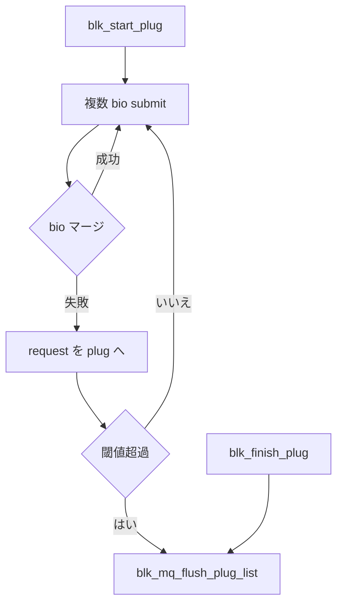

# 第12章 plug と merge

> **本章で読むソース**
>
> - [`block/blk-core.c` L1124-L1147](https://github.com/gregkh/linux/blob/v6.18.38/block/blk-core.c#L1124-L1147)
> - [`block/blk-core.c` L1221-L1237](https://github.com/gregkh/linux/blob/v6.18.38/block/blk-core.c#L1221-L1237)
> - [`block/blk-core.c` L1249-L1255](https://github.com/gregkh/linux/blob/v6.18.38/block/blk-core.c#L1249-L1255)
> - [`block/blk-mq.c` L1391-L1403](https://github.com/gregkh/linux/blob/v6.18.38/block/blk-mq.c#L1391-L1403)
> - [`block/blk-merge.c` L934-L960](https://github.com/gregkh/linux/blob/v6.18.38/block/blk-merge.c#L934-L960)
> - [`block/blk-mq.c` L3014-L3024](https://github.com/gregkh/linux/blob/v6.18.38/block/blk-mq.c#L3014-L3024)
> - [`block/blk-mq-sched.c` L335-L368](https://github.com/gregkh/linux/blob/v6.18.38/block/blk-mq-sched.c#L335-L368)

## この章の狙い

**plug** が同一タスクの I/O をまとめる仕組みと、**merge** が bio を既存 request に吸収する条件を読む。
スケジューラ以前の最適化として、request 数とタグ消費をどう減らすかを説明する。

## 前提

- [第6章](../part01-blk-mq/06-blk-mq-submit-tags.md) で plug への追加を読んでいること。

## blk_plug の初期化

`blk_start_plug` は `current->plug` に plug を載せ、mq_list と cached_rqs を空にする。
ネストした plug は上書きしない。

[`block/blk-core.c` L1124-L1147](https://github.com/gregkh/linux/blob/v6.18.38/block/blk-core.c#L1124-L1147)

```c
void blk_start_plug_nr_ios(struct blk_plug *plug, unsigned short nr_ios)
{
	struct task_struct *tsk = current;

	/*
	 * If this is a nested plug, don't actually assign it.
	 */
	if (tsk->plug)
		return;

	plug->cur_ktime = 0;
	rq_list_init(&plug->mq_list);
	rq_list_init(&plug->cached_rqs);
	plug->nr_ios = min_t(unsigned short, nr_ios, BLK_MAX_REQUEST_COUNT);
	plug->rq_count = 0;
	plug->multiple_queues = false;
	plug->has_elevator = false;
	INIT_LIST_HEAD(&plug->cb_list);

	/*
	 * Store ordering should not be needed here, since a potential
	 * preempt will imply a full memory barrier
	 */
	tsk->plug = plug;
```

`__submit_bio` はローカル plug を毎回構築するため、ファイルシステム経路では常に plug 区間が存在する。

## flush と schedule 時の自動 unplug

`__blk_flush_plug` は plug 内 request を flush し、コールバックと cached request を解放する。
タスクがスリープするときも flush され、デッドロックを防ぐ。

[`block/blk-core.c` L1221-L1237](https://github.com/gregkh/linux/blob/v6.18.38/block/blk-core.c#L1221-L1237)

```c
void __blk_flush_plug(struct blk_plug *plug, bool from_schedule)
{
	if (!list_empty(&plug->cb_list))
		flush_plug_callbacks(plug, from_schedule);
	blk_mq_flush_plug_list(plug, from_schedule);
	/*
	 * Unconditionally flush out cached requests, even if the unplug
	 * event came from schedule. Since we know hold references to the
	 * queue for cached requests, we don't want a blocked task holding
	 * up a queue freeze/quiesce event.
	 */
	if (unlikely(!rq_list_empty(&plug->cached_rqs)))
		blk_mq_free_plug_rqs(plug);

	plug->cur_ktime = 0;
	current->flags &= ~PF_BLOCK_TS;
}
```

`blk_finish_plug` は `current->plug` が一致するときだけ flush する。

[`block/blk-core.c` L1249-L1255](https://github.com/gregkh/linux/blob/v6.18.38/block/blk-core.c#L1249-L1255)

```c
void blk_finish_plug(struct blk_plug *plug)
{
	if (plug == current->plug) {
		__blk_flush_plug(plug, false);
		current->plug = NULL;
	}
}
```

## plug への request 追加と閾値

request 数または直前 request サイズが閾値を超えると自動 flush する。
`BLK_PLUG_FLUSH_SIZE` はバイト閾値、`BLK_MAX_REQUEST_COUNT` は本数閾値である。

[`block/blk-mq.c` L1391-L1403](https://github.com/gregkh/linux/blob/v6.18.38/block/blk-mq.c#L1391-L1403)

```c
static void blk_add_rq_to_plug(struct blk_plug *plug, struct request *rq)
{
	struct request *last = rq_list_peek(&plug->mq_list);

	if (!plug->rq_count) {
		trace_block_plug(rq->q);
	} else if (plug->rq_count >= blk_plug_max_rq_count(plug) ||
		   (!blk_queue_nomerges(rq->q) &&
		    blk_rq_bytes(last) >= BLK_PLUG_FLUSH_SIZE)) {
		blk_mq_flush_plug_list(plug, false);
		last = NULL;
		trace_block_plug(rq->q);
	}
```

複数キューへ跨る plug は `multiple_queues` フラグで追跡される。

## フロントマージの判定

隣接セクタで操作種別が一致し、暗号化コンテキストが相容れればマージ候補になる。
セクタ上限を超える場合は失敗する。

[`block/blk-merge.c` L934-L960](https://github.com/gregkh/linux/blob/v6.18.38/block/blk-merge.c#L934-L960)

```c
static enum bio_merge_status bio_attempt_front_merge(struct request *req,
		struct bio *bio, unsigned int nr_segs)
{
	const blk_opf_t ff = bio_failfast(bio);

	/*
	 * A front merge for writes to sequential zones of a zoned block device
	 * can happen only if the user submitted writes out of order. Do not
	 * merge such write to let it fail.
	 */
	if (req->rq_flags & RQF_ZONE_WRITE_PLUGGING)
		return BIO_MERGE_FAILED;

	if (!ll_front_merge_fn(req, bio, nr_segs))
		return BIO_MERGE_FAILED;

	trace_block_bio_frontmerge(bio);
	rq_qos_merge(req->q, req, bio);

	if ((req->cmd_flags & REQ_FAILFAST_MASK) != ff)
		blk_rq_set_mixed_merge(req);

	blk_update_mixed_merge(req, bio, true);

	bio->bi_next = req->bio;
	req->bio = bio;

```

バックマージと plug 内マージも同様の幾何条件を共有する。

## blk_mq_attempt_bio_merge の順序

`blk_mq_attempt_bio_merge` は二段の排他分岐である。
まず `blk_attempt_plug_merge` で plug 内を試し、失敗したときだけ `blk_mq_sched_bio_merge` が走る。

[`block/blk-mq.c` L3014-L3024](https://github.com/gregkh/linux/blob/v6.18.38/block/blk-mq.c#L3014-L3024)

```c
static bool blk_mq_attempt_bio_merge(struct request_queue *q,
				     struct bio *bio, unsigned int nr_segs)
{
	if (!blk_queue_nomerges(q) && bio_mergeable(bio)) {
		if (blk_attempt_plug_merge(q, bio, nr_segs))
			return true;
		if (blk_mq_sched_bio_merge(q, bio, nr_segs))
			return true;
	}
	return false;
}
```

第二段では elevator の `bio_merge` があればそこで終了し、無ければ ctx の `rq_lists` を逆走査する。

[`block/blk-mq-sched.c` L335-L368](https://github.com/gregkh/linux/blob/v6.18.38/block/blk-mq-sched.c#L335-L368)

```c
bool blk_mq_sched_bio_merge(struct request_queue *q, struct bio *bio,
		unsigned int nr_segs)
{
	struct elevator_queue *e = q->elevator;
	struct blk_mq_ctx *ctx;
	struct blk_mq_hw_ctx *hctx;
	bool ret = false;
	enum hctx_type type;

	if (e && e->type->ops.bio_merge) {
		ret = e->type->ops.bio_merge(q, bio, nr_segs);
		goto out_put;
	}

	ctx = blk_mq_get_ctx(q);
	hctx = blk_mq_map_queue(bio->bi_opf, ctx);
	type = hctx->type;
	if (list_empty_careful(&ctx->rq_lists[type]))
		goto out_put;

	/* default per sw-queue merge */
	spin_lock(&ctx->lock);
	/*
	 * Reverse check our software queue for entries that we could
	 * potentially merge with. Currently includes a hand-wavy stop
	 * count of 8, to not spend too much time checking for merges.
	 */
	if (blk_bio_list_merge(q, &ctx->rq_lists[type], bio, nr_segs))
		ret = true;

	spin_unlock(&ctx->lock);
out_put:
	return ret;
}
```

「plug、スケジューラキュー、エレベータが常に順番に3段走る」わけではない。
plug 成功時は sched 側は呼ばれず、sched 側は elevator 実装か per-ctx リストのいずれか一方である。

> **v7.1.3 注記**：[v7.1.3](https://github.com/gregkh/linux/blob/v7.1.3/block/blk-mq.c#L3034-L3044) でも上記分岐は同一である。

## 処理の流れ



## 高速化と最適化の工夫

**plug はスケジューラ外のマージ猶予**をタスク単位で作る。
短時間に吐かれる書き込みを1つの request にまとめやすくする。

**閾値付き自動 flush**はマージだけに時間を使いすぎない安全弁である。
遅延が大きくなりすぎる前にドライバへ流す。

**暗号化コンテキスト一致チェック**はマージによるキー境界違反を防ぐ。
性能より正しさの条件だが、マージ可能域を適切に切ることで無駄な試行も減る。

## まとめ

plug と merge はスケジューラ以前に request 数を減らす二段の最適化である。
`__submit_bio` が常に plug を張るため、ファイルシステム経路では効果が出やすい。
io_uring からの連続 submit でも同様のメリットが期待できる。

## 関連する章

- [第1章 ブロック層の全体像](../part00-overview/01-block-layer-overview.md)
- [第14章 SQE の発行](../part03-io-uring/14-sqe-submission.md)
